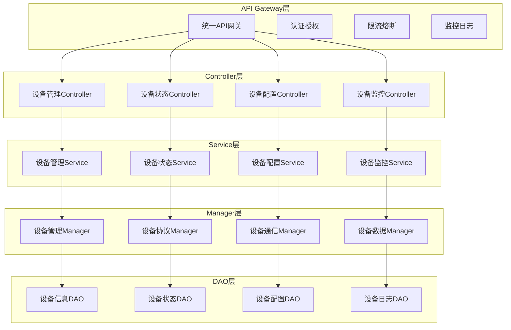

# 📱 设备管理API文档

**文档版本**: v1.0.0
**创建日期**: 2025-11-16
**最后更新**: 2025-11-16
**维护者**: SmartAdmin Team

---

## 📋 概述

本文档提供了IOE-DREAM智慧园区一卡通管理平台中设备管理系统的完整API接口文档。基于repowiki规范体系，遵循RESTful API设计规范，提供统一的设备管理接口标准。

---

## 🏗️ API架构设计

### 📐 API分层架构（遵循repowiki规范）



---

## 📚 API接口总览

### 📊 设备管理API分类

| API分类 | 功能描述 | 接口数量 | 认证要求 | 权限级别 |
|----------|----------|----------|----------|----------|
| 设备基础管理 | 设备CRUD操作 | 8 | 必须登录 | 管理员 |
| 设备状态管理 | 设备状态监控 | 6 | 必须登录 | 操作员 |
| 设备配置管理 | 设备参数配置 | 5 | 必须登录 | 管理员 |
| 设备监控管理 | 设备实时监控 | 7 | 必须登录 | 操作员 |
| 设备通讯管理 | 设备通讯接口 | 4 | 系统调用 | 系统 |
| 设备日志管理 | 设备日志查询 | 4 | 必须登录 | 管理员 |
| 设备统计分析 | 设备统计报表 | 6 | 必须登录 | 分析员 |

---

## 🔧 设备基础管理API

### 📋 设备信息管理

#### 1. 获取设备列表

```http
GET /api/smart/device/list
```

**请求参数:**

| 参数名 | 类型 | 必填 | 说明 | 示例 |
|--------|------|------|------|------|
| deviceType | String | 否 | 设备类型 | ACCESS_CONTROLLER |
| status | String | 否 | 设备状态 | ONLINE |
| page | Integer | 否 | 页码 | 1 |
| pageSize | Integer | 否 | 每页大小 | 20 |

**响应示例:**
```json
{
  "code": 200,
  "message": "查询成功",
  "data": {
    "list": [
      {
        "deviceId": "ACCESS_001",
        "deviceName": "主入口门禁控制器",
        "deviceType": "ACCESS_CONTROLLER",
        "deviceModel": "ZKTeco-Pro",
        "status": "ONLINE",
        "ipAddress": "192.168.1.100",
        "location": "主入口",
        "createTime": "2025-11-16 10:00:00",
        "updateTime": "2025-11-16 15:30:00"
      }
    ],
    "total": 1,
    "page": 1,
    "pageSize": 20
  }
}
```

#### 2. 获取设备详情

```http
GET /api/smart/device/{deviceId}
```

**路径参数:**

| 参数名 | 类型 | 必填 | 说明 |
|--------|------|------|------|
| deviceId | String | 是 | 设备ID |

**响应示例:**
```json
{
  "code": 200,
  "message": "查询成功",
  "data": {
    "deviceId": "ACCESS_001",
    "deviceName": "主入口门禁控制器",
    "deviceType": "ACCESS_CONTROLLER",
    "deviceModel": "ZKTeco-Pro",
    "serialNumber": "SN123456789",
    "status": "ONLINE",
    "ipAddress": "192.168.1.100",
    "port": 8080,
    "location": "主入口",
    "areaId": "AREA_001",
    "manufacturer": "ZKTeco",
    "installDate": "2025-10-01",
    "warrantyDate": "2027-10-01",
    "configInfo": {
      "heartbeatInterval": 30,
      "timeoutDuration": 60,
      "retryCount": 3
    },
    "createTime": "2025-11-16 10:00:00",
    "updateTime": "2025-11-16 15:30:00",
    "createUser": "admin",
    "updateUser": "admin"
  }
}
```

#### 3. 新增设备

```http
POST /api/smart/device/add
```

**请求体:**
```json
{
  "deviceName": "侧门入口门禁控制器",
  "deviceType": "ACCESS_CONTROLLER",
  "deviceModel": "ZKTeco-Pro",
  "serialNumber": "SN987654321",
  "ipAddress": "192.168.1.101",
  "port": 8080,
  "location": "侧门入口",
  "areaId": "AREA_002",
  "manufacturer": "ZKTeco",
  "installDate": "2025-11-16",
  "warrantyDate": "2027-11-16",
  "configInfo": {
    "heartbeatInterval": 30,
    "timeoutDuration": 60,
    "retryCount": 3
  }
}
```

**响应示例:**
```json
{
  "code": 200,
  "message": "设备添加成功",
  "data": {
    "deviceId": "ACCESS_002"
  }
}
```

#### 4. 修改设备信息

```http
PUT /api/smart/device/{deviceId}
```

**路径参数:**

| 参数名 | 类型 | 必填 | 说明 |
|--------|------|------|------|
| deviceId | String | 是 | 设备ID |

**请求体:**
```json
{
  "deviceName": "侧门入口门禁控制器-更新",
  "location": "侧门入口-更新",
  "ipAddress": "192.168.1.102",
  "configInfo": {
    "heartbeatInterval": 60,
    "timeoutDuration": 120,
    "retryCount": 5
  }
}
```

#### 5. 删除设备

```http
DELETE /api/smart/device/{deviceId}
```

**路径参数:**

| 参数名 | 类型 | 必填 | 说明 |
|--------|------|------|------|
| deviceId | String | 是 | 设备ID |

**响应示例:**
```json
{
  "code": 200,
  "message": "设备删除成功",
  "data": null
}
```

---

## 📊 设备状态管理API

### 🔍 设备状态查询

#### 1. 获取设备实时状态

```http
GET /api/smart/device/{deviceId}/status
```

**响应示例:**
```json
{
  "code": 200,
  "message": "查询成功",
  "data": {
    "deviceId": "ACCESS_001",
    "status": "ONLINE",
    "lastHeartbeat": 1634412345678,
    "networkStatus": {
      "ipAddress": "192.168.1.100",
      "port": 8080,
      "connectionStatus": "CONNECTED",
      "responseTime": 50
    },
    "deviceStatus": {
      "cpuUsage": 15.5,
      "memoryUsage": 32.8,
      "diskUsage": 45.2,
      "temperature": 28.5
    },
    "businessStatus": {
      "onlineUsers": 156,
      "todayAccessCount": 1248,
      "errorCount": 0,
      "lastAccessTime": 1634412300123
    }
  }
}
```

#### 2. 获取设备历史状态

```http
GET /api/smart/device/{deviceId}/status/history
```

**请求参数:**

| 参数名 | 类型 | 必填 | 说明 | 示例 |
|--------|------|------|------|------|
| startTime | String | 是 | 开始时间 | 2025-11-16 00:00:00 |
| endTime | String | 是 | 结束时间 | 2025-11-16 23:59:59 |
| interval | String | 否 | 统计间隔 | 5m |

#### 3. 批量获取设备状态

```http
POST /api/smart/device/status/batch
```

**请求体:**
```json
{
  "deviceIds": ["ACCESS_001", "ACCESS_002", "CAMERA_001"]
}
```

### 🔧 设备控制操作

#### 1. 设备重启

```http
POST /api/smart/device/{deviceId}/restart
```

**响应示例:**
```json
{
  "code": 200,
  "message": "设备重启指令发送成功",
  "data": {
    "taskId": "TASK_001",
    "estimatedDuration": 60
  }
}
```

#### 2. 设备配置同步

```http
POST /api/smart/device/{deviceId}/sync-config
```

---

## ⚙️ 设备配置管理API

### 📋 配置管理接口

#### 1. 获取设备配置

```http
GET /api/smart/device/{deviceId}/config
```

**响应示例:**
```json
{
  "code": 200,
  "message": "查询成功",
  "data": {
    "deviceId": "ACCESS_001",
    "basicConfig": {
      "deviceName": "主入口门禁控制器",
      "location": "主入口",
      "description": "主入口门禁控制设备"
    },
    "networkConfig": {
      "ipAddress": "192.168.1.100",
      "port": 8080,
      "subnetMask": "255.255.255.0",
      "gateway": "192.168.1.1"
    },
    "businessConfig": {
      "heartbeatInterval": 30,
      "timeoutDuration": 60,
      "retryCount": 3,
      "openDoorDuration": 5,
      "enableIntercom": true,
      "enableVideo": false
    },
    "securityConfig": {
      "enableEncryption": true,
      "encryptionKey": "***",
      "enableAudit": true,
      "auditLogLevel": "INFO"
    }
  }
}
```

#### 2. 更新设备配置

```http
PUT /api/smart/device/{deviceId}/config
```

**请求体:**
```json
{
  "basicConfig": {
    "deviceName": "主入口门禁控制器-更新",
    "description": "主入口门禁控制设备-更新配置"
  },
  "businessConfig": {
    "heartbeatInterval": 60,
    "timeoutDuration": 120,
    "retryCount": 5,
    "openDoorDuration": 8
  }
}
```

#### 3. 重置设备配置

```http
POST /api/smart/device/{deviceId}/config/reset
```

---

## 📹 设备监控管理API

### 🎥 视频设备监控

#### 1. 获取实时视频流

```http
GET /api/smart/device/{deviceId}/stream/realtime
```

**响应示例:**
```json
{
  "code": 200,
  "message": "获取成功",
  "data": {
    "deviceId": "CAMERA_001",
    "streamType": "REALTIME",
    "streamUrl": "webrtc://192.168.1.200:8080/live/stream_001",
    "streamFormat": "WEBRTC",
    "resolution": "1920x1080",
    "fps": 25,
    "bitrate": 2048,
    "expirationTime": 1634415945678
  }
}
```

#### 2. 获取视频回放

```http
GET /api/smart/device/{deviceId}/stream/playback
```

**请求参数:**

| 参数名 | 类型 | 必填 | 说明 | 示例 |
|--------|------|------|------|------|
| startTime | String | 是 | 开始时间 | 2025-11-16 14:00:00 |
| endTime | String | 是 | 结束时间 | 2025-11-16 14:30:00 |

#### 3. 云台控制(PTZ)

```http
POST /api/smart/device/{deviceId}/ptz/control
```

**请求体:**
```json
{
  "action": "MOVE",
  "direction": "UP",
  "speed": 5,
  "duration": 2000
}
```

### 🚪 门禁设备监控

#### 1. 远程开门

```http
POST /api/smart/device/{deviceId}/door/open
```

**请求体:**
```json
{
  "doorId": "MAIN_DOOR",
  "userId": "USER_001",
  "reason": "管理员远程开门",
  "duration": 5
}
```

#### 2. 锁定门禁

```http
POST /api/smart/device/{deviceId}/door/lock
```

#### 3. 解锁门禁

```http
POST /api/smart/device/{deviceId}/door/unlock
```

---

## 📡 设备通讯管理API

### 🔗 通讯接口管理

#### 1. 测试设备连接

```http
POST /api/smart/device/{deviceId}/connection/test
```

**响应示例:**
```json
{
  "code": 200,
  "message": "连接测试完成",
  "data": {
    "deviceId": "ACCESS_001",
    "testResult": "SUCCESS",
    "responseTime": 45,
    "testTime": "2025-11-16 15:30:00",
    "connectionInfo": {
      "protocol": "TCP",
      "localAddress": "192.168.1.10:54321",
      "remoteAddress": "192.168.1.100:8080",
      "status": "CONNECTED"
    }
  }
}
```

#### 2. 获取设备通讯日志

```http
GET /api/smart/device/{deviceId}/communication/logs
```

---

## 📊 设备统计分析API

### 📈 统计报表接口

#### 1. 设备状态统计

```http
GET /api/smart/device/statistics/status
```

**响应示例:**
```json
{
  "code": 200,
  "message": "查询成功",
  "data": {
    "totalDevices": 150,
    "onlineDevices": 142,
    "offlineDevices": 8,
    "faultDevices": 3,
    "maintenanceDevices": 2,
    "deviceTypeStatistics": [
      {
        "deviceType": "ACCESS_CONTROLLER",
        "totalCount": 80,
        "onlineCount": 76,
        "offlineCount": 4
      },
      {
        "deviceType": "CAMERA",
        "totalCount": 50,
        "onlineCount": 48,
        "offlineCount": 2
      },
      {
        "deviceType": "ATTENDANCE_MACHINE",
        "totalCount": 20,
        "onlineCount": 18,
        "offlineCount": 2
      }
    ]
  }
}
```

#### 2. 设备使用统计

```http
GET /api/smart/device/statistics/usage
```

**请求参数:**

| 参数名 | 类型 | 必填 | 说明 | 示例 |
|--------|------|------|------|------|
| deviceType | String | 否 | 设备类型 | ACCESS_CONTROLLER |
| timeRange | String | 否 | 时间范围 | LAST_7_DAYS |
| areaId | String | 否 | 区域ID | AREA_001 |

---

## 🔐 API安全与认证

### 🛡️ 认证机制

所有API接口必须通过以下认证：

1. **登录认证**: 使用Sa-Token进行用户身份验证
2. **权限控制**: 使用@SaCheckPermission注解进行接口权限验证
3. **参数验证**: 使用@Valid注解进行请求参数验证

### 📋 权限级别定义

| 权限级别 | 说明 | 示例权限 |
|----------|------|----------|
| 系统级 | 系统内部调用 | device:system:call |
| 管理员级 | 设备管理操作 | device:manage:*, device:config:* |
| 操作员级 | 设备操作监控 | device:operate:*, device:monitor:* |
| 查询级 | 设备信息查询 | device:query:* |

### 🚫 接口限流

| 接口类型 | 限流规则 | 时间窗口 |
|----------|----------|----------|
| 查询接口 | 100次/分钟 | 1分钟 |
| 操作接口 | 20次/分钟 | 1分钟 |
| 配置接口 | 10次/分钟 | 1分钟 |
| 系统接口 | 1000次/分钟 | 1分钟 |

---

## 📝 API错误码

### 🚨 通用错误码

| 错误码 | 说明 | HTTP状态码 |
|--------|------|------------|
| 200 | 成功 | 200 |
| 400 | 请求参数错误 | 400 |
| 401 | 未登录或登录过期 | 401 |
| 403 | 权限不足 | 403 |
| 404 | 资源不存在 | 404 |
| 429 | 请求过于频繁 | 429 |
| 500 | 服务器内部错误 | 500 |

### 📱 设备管理专用错误码

| 错误码 | 说明 | 解决方案 |
|--------|------|----------|
| 10001 | 设备不存在 | 检查设备ID是否正确 |
| 10002 | 设备离线 | 检查设备网络连接 |
| 10003 | 设备配置错误 | 检查设备配置参数 |
| 10004 | 设备通讯失败 | 检查网络和防火墙设置 |
| 10005 | 设备操作超时 | 增加超时时间或重试 |
| 10006 | 设备权限不足 | 检查用户设备操作权限 |

---

## 🧪 API测试用例

### 📋 测试环境配置

**Base URL**: `http://localhost:1024/api/smart/device`

**认证方式**: Header中添加 `satoken: {token}`

### 🔧 测试用例示例

#### 1. 获取设备列表测试

```bash
# 请求
curl -X GET "http://localhost:1024/api/smart/device/list?page=1&pageSize=10" \
  -H "satoken: your_token_here"

# 预期响应
{
  "code": 200,
  "message": "查询成功",
  "data": {
    "list": [...],
    "total": 50,
    "page": 1,
    "pageSize": 10
  }
}
```

#### 2. 新增设备测试

```bash
# 请求
curl -X POST "http://localhost:1024/api/smart/device/add" \
  -H "Content-Type: application/json" \
  -H "satoken: your_token_here" \
  -d '{
    "deviceName": "测试设备",
    "deviceType": "ACCESS_CONTROLLER",
    "ipAddress": "192.168.1.200"
  }'

# 预期响应
{
  "code": 200,
  "message": "设备添加成功",
  "data": {
    "deviceId": "TEST_001"
  }
}
```

---

## 📚 参考规范

### 🔗 repowiki核心规范
- **[API设计规范](../../../repowiki/zh/content/核心规范/RESTfulAPI设计规范.md)** - RESTful接口设计标准
- **[Java编码规范](../../../repowiki/zh/content/核心规范/Java编码规范.md)** - Java代码编写标准
- **[架构设计规范](../../../repowiki/zh/content/核心规范/架构设计规范.md)** - 四层架构设计标准
- **[系统安全规范](../../../repowiki/zh/content/核心规范/系统安全规范.md)** - 系统安全要求

### 📖 项目规范文档
- **[架构设计规范](../../ARCHITECTURE_STANDARDS.md)** - IOE-DREAM架构设计要求
- **[通用开发检查清单](../../CHECKLISTS/通用开发检查清单.md)** - 代码质量保证清单

---

**⚠️ 重要提醒**: 本设备管理API文档严格遵循repowiki规范体系和IOE-DREAM项目架构标准。所有API接口开发和使用都必须按照本文档中的接口规范和安全要求执行，确保系统的稳定性、安全性和可维护性。