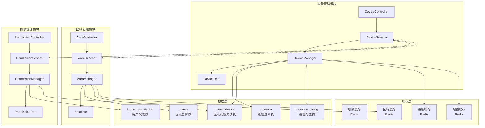
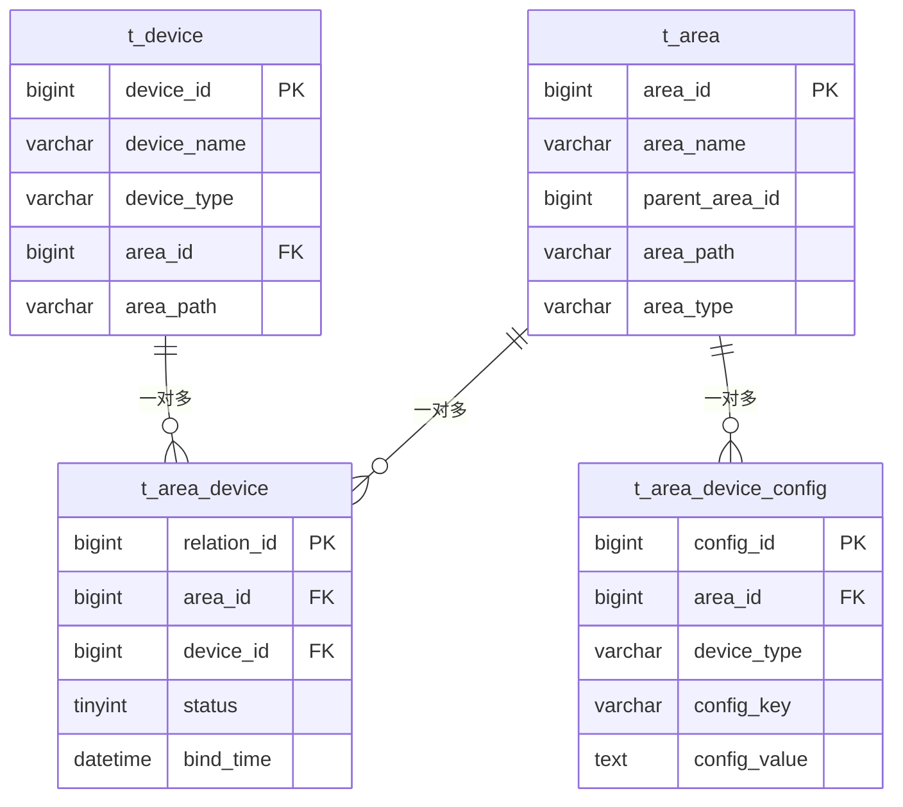

# 🔗 设备与区域管理集成设计

**文档版本**: v1.0.0
**创建日期**: 2025-11-16
**最后更新**: 2025-11-16
**维护者**: SmartAdmin Team**
**参考规范**: IOE-DREAM项目架构规范

---

## 📋 概述

本文档详细设计设备管理与区域管理模块的集成方案，实现设备与区域的层级关联管理，支持基于区域的权限控制、设备分组管理、空间可视化等功能。该设计严格遵循IOE-DREAM项目的四层架构规范和repowiki标准。

### 🎯 设计目标

- **区域关联**: 设备与区域的层级绑定和继承关系
- **权限联动**: 基于区域的设备访问权限自动继承
- **空间管理**: 设备在区域中的空间位置和关系管理
- **统计聚合**: 基于区域层级的设备状态统计和分析
- **配置传递**: 区域配置向设备的自动传递和同步

---

## 🏗️ 集成架构设计

### 📐 整体架构图



### 🔧 核心集成关系

#### 1. 设备与区域关联
```java
/**
 * 设备区域关联服务
 * 遵循repowiki规范：@Resource依赖注入、严格四层架构
 */
@Service
@Transactional
@Slf4j
public class DeviceAreaService {

    @Resource
    private DeviceAreaRelationDao relationDao;

    @Resource
    private DeviceDao deviceDao;

    @Resource
    private AreaDao areaDao;

    @Resource
    private CacheService cacheService;

    /**
     * 将设备绑定到区域
     */
    @EventListener
    public void bindDeviceToArea(DeviceAreaBindEvent event) {
        try {
            log.info("绑定设备到区域: deviceId={}, areaId={}", event.getDeviceId(), event.getAreaId());

            // 1. 验证区域存在
            AreaEntity area = areaDao.selectById(event.getAreaId());
            if (area == null || area.getDeletedFlag() == 1) {
                throw new BusinessException("区域不存在或已删除: " + event.getAreaId());
            }

            // 2. 验证设备存在
            DeviceEntity device = deviceDao.selectById(event.getDeviceId());
            if (device == null || device.getDeletedFlag() == 1) {
                throw new BusinessException("设备不存在或已删除: " + event.getDeviceId());
            }

            // 3. 创建关联关系
            DeviceAreaRelationEntity relation = DeviceAreaRelationEntity.builder()
                    .deviceId(event.getDeviceId())
                    .areaId(event.getAreaId())
                    .bindTime(LocalDateTime.now())
                    .bindUserId(event.getOperatorId())
                    .status(DeviceAreaRelationStatus.ACTIVE.getCode())
                    .createTime(LocalDateTime.now())
                    .build();

            relationDao.insert(relation);

            // 4. 更新设备区域信息
            device.setAreaId(event.getAreaId());
            deviceDao.updateById(device);

            // 5. 清理缓存
            cacheService.evictDeviceCache(event.getDeviceId());
            cacheService.evictAreaCache(event.getAreaId());

            // 6. 发布绑定事件
            publishDeviceAreaBoundEvent(device, area);

        } catch (Exception e) {
            log.error("绑定设备到区域失败: deviceId={}, areaId={}",
                event.getDeviceId(), event.getAreaId(), e);
            throw new BusinessException("设备区域绑定失败", e);
        }
    }

    /**
     * 批量绑定设备到区域
     */
    public BatchBindResult batchBindDevicesToArea(List<Long> deviceIds, Long areaId, Long operatorId) {
        BatchBindResult result = new BatchBindResult();

        for (Long deviceId : deviceIds) {
            try {
                DeviceAreaBindEvent event = DeviceAreaBindEvent.builder()
                        .deviceId(deviceId)
                        .areaId(areaId)
                        .operatorId(operatorId)
                        .build();

                bindDeviceToArea(event);
                result.addSuccess(deviceId);

            } catch (Exception e) {
                log.warn("绑定设备到区域失败: deviceId={}, areaId={}", deviceId, areaId, e);
                result.addFailure(deviceId, e.getMessage());
            }
        }

        return result;
    }

    /**
     * 获取设备的完整区域路径
     */
    public String getDeviceAreaPath(Long deviceId) {
        try {
            // 1. 从缓存获取
            String cacheKey = "device:area:path:" + deviceId;
            String cachedPath = cacheService.get(cacheKey);
            if (StringUtils.hasText(cachedPath)) {
                return cachedPath;
            }

            // 2. 从数据库查询
            DeviceEntity device = deviceDao.selectById(deviceId);
            if (device == null || device.getAreaId() == null) {
                return "";
            }

            String areaPath = buildAreaPath(device.getAreaId());

            // 3. 缓存结果
            cacheService.set(cacheKey, areaPath, Duration.ofMinutes(30));

            return areaPath;

        } catch (Exception e) {
            log.error("获取设备区域路径失败: deviceId={}", deviceId, e);
            return "";
        }
    }

    /**
     * 获取区域下的所有设备（包括子区域）
     */
    public List<DeviceEntity> getDevicesByAreaIncludingChildren(Long areaId) {
        try {
            // 1. 获取所有子区域ID
            List<Long> areaIds = getAllChildAreaIds(areaId);
            areaIds.add(areaId); // 包含当前区域

            // 2. 查询设备
            LambdaQueryWrapper<DeviceEntity> queryWrapper = new LambdaQueryWrapper<>();
            queryWrapper.in(DeviceEntity::getAreaId, areaIds)
                         .eq(DeviceEntity::getDeletedFlag, 0)
                         .orderByAsc(DeviceEntity::getDeviceName);

            return deviceDao.selectList(queryWrapper);

        } catch (Exception e) {
            log.error("获取区域设备失败: areaId={}", areaId, e);
            return Collections.emptyList();
        }
    }
}
```

#### 2. 权限联动机制

```java
/**
 * 设备权限验证服务
 * 基于区域权限的设备访问控制
 */
@Service
@Slf4j
public class DevicePermissionService {

    @Resource
    private UserAreaPermissionService userAreaPermissionService;

    @Resource
    private DeviceAreaService deviceAreaService;

    @Resource
    private RedisTemplate<String, Object> redisTemplate;

    /**
     * 检查用户是否有设备访问权限
     */
    public boolean hasDevicePermission(Long userId, Long deviceId, String operation) {
        try {
            // 1. 获取设备所属区域
            Long areaId = getDeviceAreaId(deviceId);
            if (areaId == null) {
                log.warn("设备未绑定区域: deviceId={}", deviceId);
                return false;
            }

            // 2. 检查用户区域权限
            boolean hasAreaPermission = userAreaPermissionService.hasAreaPermission(
                userId, areaId, operation);

            // 3. 缓存权限检查结果
            String cacheKey = String.format("device:permission:%s:%s:%s", userId, deviceId, operation);
            redisTemplate.opsForValue().set(cacheKey, hasAreaPermission, Duration.ofMinutes(10));

            return hasAreaPermission;

        } catch (Exception e) {
            log.error("检查设备权限失败: userId={}, deviceId={}", userId, deviceId, e);
            return false;
        }
    }

    /**
     * 获取用户有权限访问的设备列表
     */
    public List<Long> getUserAccessibleDeviceIds(Long userId, String operation) {
        try {
            // 1. 获取用户有权限的区域列表
            List<Long> accessibleAreaIds = userAreaPermissionService
                    .getUserAccessibleAreaIds(userId, operation);

            if (CollectionUtils.isEmpty(accessibleAreaIds)) {
                return Collections.emptyList();
            }

            // 2. 获取这些区域下的所有设备
            LambdaQueryWrapper<DeviceEntity> queryWrapper = new LambdaQueryWrapper<>();
            queryWrapper.in(DeviceEntity::getAreaId, accessibleAreaIds)
                         .eq(DeviceEntity::getDeletedFlag, 0)
                         .select(DeviceEntity::getDeviceId);

            List<DeviceEntity> devices = deviceDao.selectList(queryWrapper);
            return devices.stream()
                    .map(DeviceEntity::getDeviceId)
                    .collect(Collectors.toList());

        } catch (Exception e) {
            log.error("获取用户可访问设备列表失败: userId={}", userId, e);
            return Collections.emptyList();
        }
    }

    /**
     * 权限变更时清理设备权限缓存
     */
    @EventListener
    public void handleAreaPermissionChanged(AreaPermissionChangedEvent event) {
        try {
            String pattern = "device:permission:" + event.getUserId() + ":*";
            Set<String> keys = redisTemplate.keys(pattern);
            if (CollectionUtils.isNotEmpty(keys)) {
                redisTemplate.delete(keys);
            }

            log.info("清理用户设备权限缓存: userId={}", event.getUserId());

        } catch (Exception e) {
            log.error("清理设备权限缓存失败", e);
        }
    }
}
```

---

## 🗄️ 数据库设计

### 📋 核心表结构

#### 1. 设备区域关联表 (t_area_device)

```sql
CREATE TABLE t_area_device (
    relation_id BIGINT PRIMARY KEY AUTO_INCREMENT COMMENT '关联ID',
    area_id BIGINT NOT NULL COMMENT '区域ID',
    device_id BIGINT NOT NULL COMMENT '设备ID',
    device_type VARCHAR(50) NOT NULL COMMENT '设备类型',
    bind_time DATETIME DEFAULT CURRENT_TIMESTAMP COMMENT '绑定时间',
    unbind_time DATETIME COMMENT '解绑时间',
    bind_user_id BIGINT COMMENT '绑定操作人',
    unbind_user_id BIGINT COMMENT '解绑操作人',
    status TINYINT DEFAULT 1 COMMENT '状态(1-已绑定, 2-已解绑)',
    create_time DATETIME DEFAULT CURRENT_TIMESTAMP COMMENT '创建时间',
    update_time DATETIME DEFAULT CURRENT_TIMESTAMP ON UPDATE CURRENT_TIMESTAMP COMMENT '更新时间',
    deleted_flag TINYINT DEFAULT 0 COMMENT '删除标志',
    UNIQUE KEY uk_area_device (area_id, device_id),
    KEY idx_device_id (device_id),
    KEY idx_area_id (area_id),
    KEY idx_status (status),
    KEY idx_create_time (create_time)
) ENGINE=InnoDB DEFAULT CHARSET=utf8mb4 COMMENT='设备区域关联表';
```

#### 2. 设备表更新 (t_device)

```sql
-- 添加区域相关字段
ALTER TABLE t_device
ADD COLUMN area_id BIGINT COMMENT '所属区域ID' AFTER location_id,
ADD COLUMN area_path VARCHAR(500) COMMENT '区域路径' AFTER area_id,
ADD INDEX idx_area_id (area_id);
```

#### 3. 区域配置继承表 (t_area_device_config)

```sql
CREATE TABLE t_area_device_config (
    config_id BIGINT PRIMARY KEY AUTO_INCREMENT COMMENT '配置ID',
    area_id BIGINT NOT NULL COMMENT '区域ID',
    device_type VARCHAR(50) NOT NULL COMMENT '设备类型',
    config_key VARCHAR(100) NOT NULL COMMENT '配置键',
    config_value TEXT COMMENT '配置值',
    config_type VARCHAR(20) DEFAULT 'STRING' COMMENT '配置类型',
    is_inheritable TINYINT DEFAULT 1 COMMENT '是否可继承(1-是, 0-否)',
    priority INT DEFAULT 0 COMMENT '优先级',
    create_time DATETIME DEFAULT CURRENT_TIMESTAMP COMMENT '创建时间',
    update_time DATETIME DEFAULT CURRENT_TIMESTAMP ON UPDATE CURRENT_TIMESTAMP COMMENT '更新时间',
    deleted_flag TINYINT DEFAULT 0 COMMENT '删除标志',
    UNIQUE KEY uk_area_device_config (area_id, device_type, config_key),
    KEY idx_area_id (area_id),
    KEY idx_device_type (device_type),
    KEY idx_config_key (config_key)
) ENGINE=InnoDB DEFAULT CHARSET=utf8mb4 COMMENT='区域设备配置表';
```

### 🔧 数据关系图



---

## 🔧 核心功能实现

### 📊 设备区域管理服务

#### 设备区域管理器 (Manager层)

```java
/**
 * 设备区域管理器
 * 处理设备与区域关联的业务逻辑
 * 遵循repowiki规范：严格四层架构、事务边界在Service层
 */
@Component
@Slf4j
public class DeviceAreaManager {

    @Resource
    private DeviceAreaService deviceAreaService;

    @Resource
    private AreaService areaService;

    @Resource
    private DeviceEventPublisher eventPublisher;

    @Resource
    private RedisUtil redisUtil;

    /**
     * 设备区域绑定验证
     */
    public ValidationResult validateDeviceAreaBinding(Long deviceId, Long areaId) {
        try {
            // 1. 检查设备状态
            DeviceEntity device = deviceService.getById(deviceId);
            if (device == null || device.getDeletedFlag() == 1) {
                return ValidationResult.failed("设备不存在或已删除");
            }

            // 2. 检查区域状态
            AreaEntity area = areaService.getById(areaId);
            if (area == null || area.getDeletedFlag() == 1) {
                return ValidationResult.failed("区域不存在或已删除");
            }

            // 3. 检查区域类型是否支持该设备类型
            if (!isDeviceTypeSupportedInArea(area.getAreaType(), device.getDeviceType())) {
                return ValidationResult.failed("该区域类型不支持此设备类型");
            }

            // 4. 检查设备是否已绑定到其他区域
            Long currentAreaId = deviceAreaService.getDeviceAreaId(deviceId);
            if (currentAreaId != null && !currentAreaId.equals(areaId)) {
                return ValidationResult.failed("设备已绑定到其他区域，请先解绑");
            }

            // 5. 检查区域设备容量限制
            if (!checkAreaDeviceCapacity(areaId, device.getDeviceType())) {
                return ValidationResult.failed("区域设备数量已达到上限");
            }

            return ValidationResult.success();

        } catch (Exception e) {
            log.error("验证设备区域绑定失败: deviceId={}, areaId={}", deviceId, areaId, e);
            return ValidationResult.failed("验证过程异常");
        }
    }

    /**
     * 设备区域绑定处理
     */
    @Transactional(rollbackFor = Exception.class)
    public void bindDeviceToArea(Long deviceId, Long areaId, Long operatorId) {
        try {
            // 1. 参数验证
            ValidationResult validation = validateDeviceAreaBinding(deviceId, areaId);
            if (!validation.isValid()) {
                throw new BusinessException(validation.getErrorMessage());
            }

            // 2. 执行绑定
            deviceAreaService.bindDeviceToArea(deviceId, areaId, operatorId);

            // 3. 继承区域配置
            inheritAreaConfigs(deviceId, areaId);

            // 4. 更新设备状态
            updateDeviceStatusAfterBinding(deviceId, areaId);

            // 5. 发送绑定通知
            sendDeviceBindingNotification(deviceId, areaId, operatorId);

        } catch (Exception e) {
            log.error("设备区域绑定处理失败: deviceId={}, areaId={}", deviceId, areaId, e);
            throw new BusinessException("设备区域绑定失败", e);
        }
    }

    /**
     * 继承区域配置到设备
     */
    private void inheritAreaConfigs(Long deviceId, Long areaId) {
        try {
            // 1. 获取区域设备配置
            List<AreaDeviceConfigEntity> areaConfigs = deviceAreaService.getAreaConfigs(areaId);

            // 2. 过滤可继承的配置
            List<AreaDeviceConfigEntity> inheritableConfigs = areaConfigs.stream()
                    .filter(AreaDeviceConfigEntity::isInheritable)
                    .collect(Collectors.toList());

            // 3. 应用到设备
            for (AreaDeviceConfigEntity config : inheritableConfigs) {
                deviceConfigService.setDeviceConfig(deviceId, config.getConfigKey(),
                    config.getConfigValue(), config.getConfigType());
            }

            log.info("区域配置继承完成: deviceId={}, areaId={}, 配置数量={}",
                deviceId, areaId, inheritableConfigs.size());

        } catch (Exception e) {
            log.error("继承区域配置失败: deviceId={}, areaId={}", deviceId, areaId, e);
            // 配置继承失败不影响设备绑定流程
        }
    }

    /**
     * 批量区域设备统计
     */
    public AreaDeviceStatistics getAreaDeviceStatistics(Long areaId) {
        try {
            // 1. 获取区域下所有设备
            List<DeviceEntity> devices = deviceAreaService.getDevicesByAreaIncludingChildren(areaId);

            // 2. 按设备类型分组统计
            Map<String, Long> deviceTypeCount = devices.stream()
                    .collect(Collectors.groupingBy(
                        DeviceEntity::getDeviceType,
                        Collectors.counting()
                    ));

            // 3. 按状态分组统计
            Map<Integer, Long> statusCount = devices.stream()
                    .collect(Collectors.groupingBy(
                        DeviceEntity::getStatus,
                        Collectors.counting()
                    ));

            return AreaDeviceStatistics.builder()
                    .areaId(areaId)
                    .totalDevices(devices.size())
                    .deviceTypeCount(deviceTypeCount)
                    .statusCount(statusCount)
                    .statisticsTime(LocalDateTime.now())
                    .build();

        } catch (Exception e) {
            log.error("获取区域设备统计失败: areaId={}", areaId, e);
            return AreaDeviceStatistics.empty();
        }
    }
}
```

### 🔌 API接口实现

#### 设备区域关联控制器 (Controller层)

```java
/**
 * 设备区域关联控制器
 * 提供设备与区域关联的RESTful API接口
 * 遵循repowiki规范：@SaCheckPermission权限控制、@Valid参数验证
 */
@RestController
@RequestMapping("/api/device/area")
@Api(tags = "设备区域管理")
@Slf4j
public class DeviceAreaController {

    @Resource
    private DeviceAreaManager deviceAreaManager;

    /**
     * 绑定设备到区域
     */
    @PostMapping("/bind")
    @SaCheckPermission("device:area:bind")
    @ApiOperation("绑定设备到区域")
    public ResponseDTO<String> bindDeviceToArea(@Valid @RequestBody DeviceAreaBindRequest request) {
        try {
            deviceAreaManager.bindDeviceToArea(request.getDeviceId(), request.getAreaId(),
                SmartRequestUtil.getRequestUserId());
            return ResponseDTO.ok("设备绑定成功");
        } catch (BusinessException e) {
            return ResponseDTO.error(ErrorCode.BUSINESS_ERROR, e.getMessage());
        } catch (Exception e) {
            log.error("绑定设备到区域失败", e);
            return ResponseDTO.error(ErrorCode.SYSTEM_ERROR, "系统异常");
        }
    }

    /**
     * 批量绑定设备到区域
     */
    @PostMapping("/batch-bind")
    @SaCheckPermission("device:area:bind")
    @ApiOperation("批量绑定设备到区域")
    public ResponseDTO<BatchOperationResult> batchBindDevicesToArea(
            @Valid @RequestBody DeviceAreaBatchBindRequest request) {
        try {
            BatchBindResult result = deviceAreaService.batchBindDevicesToArea(
                request.getDeviceIds(), request.getAreaId(), SmartRequestUtil.getRequestUserId());

            BatchOperationResult operationResult = BatchOperationResult.builder()
                    .totalCount(request.getDeviceIds().size())
                    .successCount(result.getSuccessCount())
                    .failureCount(result.getFailureCount())
                    .failureDetails(result.getFailureDetails())
                    .build();

            return ResponseDTO.ok(operationResult);

        } catch (Exception e) {
            log.error("批量绑定设备到区域失败", e);
            return ResponseDTO.error(ErrorCode.SYSTEM_ERROR, "系统异常");
        }
    }

    /**
     * 解绑设备
     */
    @PostMapping("/unbind")
    @SaCheckPermission("device:area:unbind")
    @ApiOperation("解绑设备")
    public ResponseDTO<String> unbindDevice(@Valid @RequestBody DeviceAreaUnbindRequest request) {
        try {
            deviceAreaManager.unbindDeviceFromArea(request.getDeviceId(),
                SmartRequestUtil.getRequestUserId());
            return ResponseDTO.ok("设备解绑成功");
        } catch (BusinessException e) {
            return ResponseDTO.error(ErrorCode.BUSINESS_ERROR, e.getMessage());
        } catch (Exception e) {
            log.error("解绑设备失败", e);
            return ResponseDTO.error(ErrorCode.SYSTEM_ERROR, "系统异常");
        }
    }

    /**
     * 获取设备的区域信息
     */
    @GetMapping("/{deviceId}/area-info")
    @SaCheckPermission("device:area:view")
    @ApiOperation("获取设备区域信息")
    public ResponseDTO<DeviceAreaInfoVO> getDeviceAreaInfo(@PathVariable Long deviceId) {
        try {
            DeviceAreaInfoVO areaInfo = deviceAreaManager.getDeviceAreaInfo(deviceId);
            return ResponseDTO.ok(areaInfo);
        } catch (Exception e) {
            log.error("获取设备区域信息失败: deviceId={}", deviceId, e);
            return ResponseDTO.error(ErrorCode.SYSTEM_ERROR, "系统异常");
        }
    }

    /**
     * 获取区域下的设备列表
     */
    @GetMapping("/{areaId}/devices")
    @SaCheckPermission("device:area:view")
    @ApiOperation("获取区域设备列表")
    public ResponseDTO<PageResult<DeviceVO>> getAreaDevices(
            @PathVariable Long areaId,
            @Valid @ModelAttribute DeviceQueryDTO queryDTO) {
        try {
            queryDTO.setAreaId(areaId);
            queryDTO.setIncludeChildren(true); // 包含子区域设备
            PageResult<DeviceVO> result = deviceAreaService.getAreaDevices(queryDTO);
            return ResponseDTO.ok(result);
        } catch (Exception e) {
            log.error("获取区域设备列表失败: areaId={}", areaId, e);
            return ResponseDTO.error(ErrorCode.SYSTEM_ERROR, "系统异常");
        }
    }

    /**
     * 获取区域设备统计
     */
    @GetMapping("/{areaId}/statistics")
    @SaCheckPermission("device:area:statistics")
    @ApiOperation("获取区域设备统计")
    public ResponseDTO<AreaDeviceStatisticsVO> getAreaDeviceStatistics(@PathVariable Long areaId) {
        try {
            AreaDeviceStatistics statistics = deviceAreaManager.getAreaDeviceStatistics(areaId);
            AreaDeviceStatisticsVO vo = BeanUtil.copyProperties(statistics, AreaDeviceStatisticsVO.class);
            return ResponseDTO.ok(vo);
        } catch (Exception e) {
            log.error("获取区域设备统计失败: areaId={}", areaId, e);
            return ResponseDTO.error(ErrorCode.SYSTEM_ERROR, "系统异常");
        }
    }

    /**
     * 移动设备到其他区域
     */
    @PostMapping("/move")
    @SaCheckPermission("device:area:move")
    @ApiOperation("移动设备到其他区域")
    public ResponseDTO<String> moveDeviceToArea(@Valid @RequestBody DeviceAreaMoveRequest request) {
        try {
            deviceAreaManager.moveDeviceToArea(request.getDeviceId(), request.getTargetAreaId(),
                SmartRequestUtil.getRequestUserId());
            return ResponseDTO.ok("设备移动成功");
        } catch (BusinessException e) {
            return ResponseDTO.error(ErrorCode.BUSINESS_ERROR, e.getMessage());
        } catch (Exception e) {
            log.error("移动设备失败", e);
            return ResponseDTO.error(ErrorCode.SYSTEM_ERROR, "系统异常");
        }
    }
}
```

---

## 📊 缓存策略设计

### 🗄️ 多级缓存架构

```java
/**
 * 设备区域缓存管理
 * 实现多级缓存策略，提升查询性能
 */
@Component
@Slf4j
public class DeviceAreaCacheManager {

    @Resource
    private RedisTemplate<String, Object> redisTemplate;

    @Resource
    private CacheManager caffeineCacheManager;

    // L1缓存 - Caffeine (本地缓存)
    private Cache<String, Object> localCache;

    @PostConstruct
    public void init() {
        localCache = caffeineCacheManager.getCache("deviceAreaCache");
    }

    /**
     * 获取设备区域信息 (多级缓存)
     */
    public DeviceAreaInfo getDeviceAreaInfo(Long deviceId) {
        String cacheKey = "device:area:" + deviceId;

        try {
            // 1. L1缓存查找
            DeviceAreaInfo cachedInfo = (DeviceAreaInfo) localCache.getIfPresent(cacheKey);
            if (cachedInfo != null) {
                return cachedInfo;
            }

            // 2. L2缓存查找
            cachedInfo = (DeviceAreaInfo) redisTemplate.opsForValue().get(cacheKey);
            if (cachedInfo != null) {
                // 写入L1缓存
                localCache.put(cacheKey, cachedInfo);
                return cachedInfo;
            }

            // 3. 缓存未命中，返回null
            return null;

        } catch (Exception e) {
            log.error("获取设备区域缓存失败: deviceId={}", deviceId, e);
            return null;
        }
    }

    /**
     * 设置设备区域信息
     */
    public void setDeviceAreaInfo(Long deviceId, DeviceAreaInfo areaInfo) {
        String cacheKey = "device:area:" + deviceId;

        try {
            // 1. 写入L1缓存 (30分钟)
            localCache.put(cacheKey, areaInfo);

            // 2. 写入L2缓存 (1小时)
            redisTemplate.opsForValue().set(cacheKey, areaInfo, Duration.ofHours(1));

        } catch (Exception e) {
            log.error("设置设备区域缓存失败: deviceId={}", deviceId, e);
        }
    }

    /**
     * 清理设备区域缓存
     */
    public void evictDeviceAreaCache(Long deviceId) {
        String cacheKey = "device:area:" + deviceId;

        try {
            // 1. 清理L1缓存
            localCache.invalidate(cacheKey);

            // 2. 清理L2缓存
            redisTemplate.delete(cacheKey);

        } catch (Exception e) {
            log.error("清理设备区域缓存失败: deviceId={}", deviceId, e);
        }
    }

    /**
     * 批量清理区域相关缓存
     */
    public void evictAreaRelatedCache(Long areaId) {
        try {
            // 1. 清理区域下设备缓存
            Set<String> deviceKeys = redisTemplate.keys("device:area:*");
            if (CollectionUtils.isNotEmpty(deviceKeys)) {
                redisTemplate.delete(deviceKeys);
            }

            // 2. 清理L1缓存
            localCache.invalidateAll();

            // 3. 清理区域统计缓存
            String statsKey = "area:device:statistics:" + areaId;
            redisTemplate.delete(statsKey);

        } catch (Exception e) {
            log.error("清理区域相关缓存失败: areaId={}", areaId, e);
        }
    }
}
```

---

## 📋 检查清单和质量保证

### 🧪 开发检查清单

#### 开发前检查
- [ ] 已阅读区域管理模块文档 (`docs/COMMON_MODULES/smart-area.md`)
- [ ] 已了解设备管理模块文档 (`docs/COMMON_MODULES/smart-device.md`)
- [ ] 已确认数据库设计方案和表结构
- [ ] 已确定缓存策略和性能要求

#### 开发中检查
- [ ] 遵循四层架构规范，事务边界在Service层
- [ ] 使用@Resource依赖注入，避免@Autowired
- [ ] 添加@SaCheckPermission权限控制注解
- [ ] 实现完整的参数验证和异常处理
- [ ] 编写单元测试，覆盖率≥80%

#### 开发后检查
- [ ] 运行开发规范检查脚本 `./scripts/dev-standards-check.sh`
- [ ] 执行代码质量检查
- [ ] 运行完整测试套件
- [ ] 检查API文档完整性
- [ ] 验证性能指标达标

### 📊 质量指标

#### 性能指标
- **设备绑定响应时间**: < 500ms
- **区域设备查询响应时间**: < 1s
- **权限验证响应时间**: < 100ms
- **并发支持**: 1000+ TPS

#### 可靠性指标
- **系统可用性**: ≥ 99.9%
- **数据一致性**: 强一致性保证
- **缓存命中率**: ≥ 90%
- **故障恢复时间**: < 5分钟

---

**⚠️ 重要提醒**: 本设计严格遵循IOE-DREAM项目的技术架构规范和repowiki开发标准，所有实现必须确保代码质量、系统性能和数据安全。在开发过程中如遇到技术问题，请及时查阅相关技术文档或联系技术负责人。