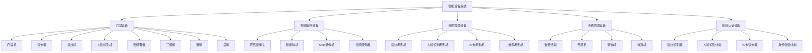
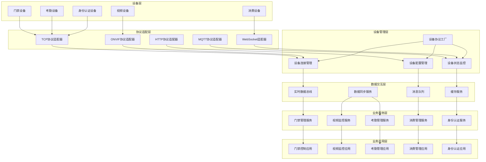
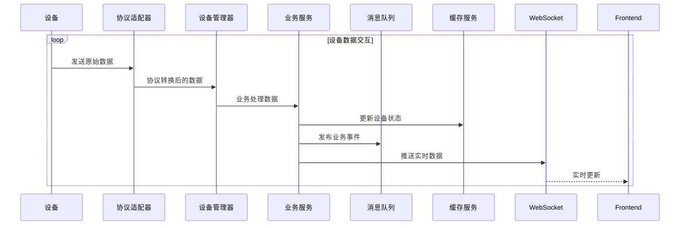

# 🏗️ 设备分类与业务模块关系映射

**文档版本**: v1.0.0
**创建日期**: 2025-11-16
**最后更新**: 2025-11-16
**维护者**: SmartAdmin Team

---

## 📋 概述

本文档详细描述了IOE-DREAM系统中各类设备与业务模块的映射关系，以及相应的数据交互技术方案。这是理解设备管理系统架构和设计数据交互方案的基础文档。

---

## 🎯 设备分类体系

### 📊 设备类型全景图



---

## 🔗 设备与业务模块映射表

### 📋 门禁设备业务映射

| 设备类型 | 业务模块 | 核心功能 | 数据交互方式 | 实时性 | 协议类型 |
|----------|----------|----------|--------------|--------|----------|
| 门禁机 | 智能门禁管理 | 开门控制、权限验证 | 实时事件推送 | 高 | TCP/MQTT/WebSocket |
| 读卡器 | 智能门禁管理 | 卡片识别、身份验证 | 事件上报 | 高 | TCP/RS485 |
| 指纹机 | 智能门禁管理 | 指纹识别、身份验证 | 特征数据同步 | 中 | TCP/USB |
| 人脸识别机 | 智能门禁管理 | 人脸识别、权限控制 | 人脸特征同步 | 中 | TCP/HTTP |
| 密码键盘 | 智能门禁管理 | 密码验证、开门控制 | 按键事件上报 | 高 | TCP/RS485 |
| 三辊闸 | 智能门禁管理 | 人流控制、防尾随 | 状态监控 | 高 | TCP/Modbus |
| 翼闸 | 智能门禁管理 | 人流控制、安全检查 | 状态监控 | 高 | TCP/Modbus |
| 摆闸 | 智能门禁管理 | 人流控制、障碍管理 | 状态监控 | 高 | TCP/Modbus |

**🔗 门禁设备数据交互架构**
```
门禁设备 → 设备网关 → 业务服务 → 数据库 → 实时推送
    ↓         ↓          ↓        ↓        ↓
  事件流    协议转换   业务处理   数据持久化  WebSocket
```

### 📋 视频监控设备业务映射

| 设备类型 | 业务模块 | 核心功能 | 数据交互方式 | 实时性 | 协议类型 |
|----------|----------|----------|--------------|--------|----------|
| 网络摄像头 | 智能视频监控 | 实时视频流、云台控制 | 视频流传输 | 极高 | RTSP/ONVIF |
| 智能球机 | 智能视频监控 | 实时监控、PTZ控制 | 视频流+控制 | 极高 | RTSP/ONVIF |
| NVR录像机 | 智能视频监控 | 视频存储、回放管理 | 录像管理 | 中 | HTTP/FTP |
| 视频服务器 | 智能视频监控 | 视频分发、转码处理 | 流媒体分发 | 高 | RTMP/WebRTC |

**🔗 视频设备数据交互架构**
```
视频设备 → 流媒体服务器 → 视频处理服务 → 业务系统 → 前端展示
    ↓          ↓            ↓           ↓         ↓
  RTSP流    转码/切片    智能分析     业务逻辑   WebRTC播放
```

### 📋 考勤管理设备业务映射

| 设备类型 | 业务模块 | 核心功能 | 数据交互方式 | 实时性 | 协议类型 |
|----------|----------|----------|--------------|--------|----------|
| 指纹考勤机 | 考勤管理 | 指纹打卡、时间记录 | 考勤记录同步 | 中 | TCP/HTTP |
| 人脸识别考勤机 | 考勤管理 | 人脸打卡、考勤统计 | 考勤数据+人脸数据 | 中 | TCP/HTTP |
| IC卡考勤机 | 考勤管理 | IC卡打卡、身份验证 | 考勤记录上报 | 高 | TCP/UDP |
| 二维码考勤机 | 考勤管理 | 二维码打卡、手机验证 | 考勤记录同步 | 中 | HTTP/HTTPS |

**🔗 考勤设备数据交互架构**
```
考勤设备 → 数据采集服务 → 考勤业务服务 → 考勤统计 → 前端展示
    ↓          ↓            ↓           ↓         ↓
  考勤事件    数据标准化    业务规则处理   数据分析    报表展示
```

### 📋 消费管理设备业务映射

| 设备类型 | 业务模块 | 核心功能 | 数据交互方式 | 实时性 | 协议类型 |
|----------|----------|----------|--------------|--------|----------|
| 消费终端 | 消费管理 | 消费扣款、余额查询 | 实时交易处理 | 极高 | TCP/WebSocket |
| 充值机 | 消费管理 | 账户充值、卡片管理 | 充值交易处理 | 高 | TCP/HTTP |
| 查询机 | 消费管理 | 余额查询、消费记录 | 查询请求处理 | 中 | HTTP/HTTPS |
| 收银机 | 消费管理 | 收银结算、订单管理 | 交易数据处理 | 高 | TCP/WebSocket |

**🔗 消费设备数据交互架构**
```
消费设备 → 交易处理服务 → 支付网关 → 账务系统 → 数据库
    ↓          ↓            ↓        ↓         ↓
  交易请求    交易验证    支付处理   账户更新   持久化
```

### 📋 身份认证设备业务映射

| 设备类型 | 业务模块 | 核心功能 | 数据交互方式 | 实时性 | 协议类型 |
|----------|----------|----------|--------------|--------|----------|
| 指纹识别器 | 身份认证 | 指纹采集、特征提取 | 特征数据同步 | 中 | TCP/USB |
| 人脸识别终端 | 身份认证 | 人脸采集、活体检测 | 人脸特征同步 | 中 | TCP/HTTP |
| IC卡读卡器 | 身份认证 | 卡片读取、身份验证 | 卡片信息同步 | 高 | TCP/RS485 |
| 身份验证终端 | 身份认证 | 多模态认证、统一验证 | 综合认证结果 | 高 | TCP/WebSocket |

---

## 🔄 数据交互技术方案对比

### 📊 设备通讯协议选择矩阵

| 设备类别 | 优先协议 | 备选协议 | 选择理由 |
|----------|----------|----------|----------|
| 门禁设备 | TCP/MQTT | UDP | 需要可靠的事件传输，低延迟 |
| 视频设备 | RTSP/ONVIF | HTTP | 标准视频流协议，广泛支持 |
| 考勤设备 | HTTP/TCP | UDP | 交易数据重要性高，需要可靠传输 |
| 消费设备 | WebSocket/TCP | HTTP | 实时性要求极高，需要长连接 |
| 身份认证设备 | TCP/USB | HTTP | 安全性要求高，数据敏感 |

### 📈 数据交互特性分析

#### 🎯 实时性要求分级

**极高 (毫秒级)**:
- 视频流传输 (RTSP, WebRTC)
- 消费交易处理 (WebSocket, TCP)

**高 (秒级)**:
- 门禁事件处理 (MQTT, WebSocket)
- 身份认证响应 (TCP, HTTP)

**中 (分钟级)**:
- 考勤数据同步 (HTTP, TCP)
- 设备状态更新 (MQTT, TCP)

**低 (小时级)**:
- 设备配置更新 (HTTP, FTP)
- 统计报表生成 (HTTP)

#### 📊 数据流量特征

**大数据量设备**:
- 视频摄像头: 1-10Mbps/路
- NVR录像机: 上传备份流量

**中等数据量设备**:
- 门禁机: 1-5KB/事件
- 考勤机: 1-10KB/次打卡

**小数据量设备**:
- 读卡器: 100-500B/次读卡
- 密码键盘: 50-200B/次操作

---

## 🏗️ 设备管理系统分层架构

### 📊 业务功能模块映射



---

## 📋 设备业务功能详细映射

### 🚪 门禁管理模块

| 功能模块 | 涉及设备 | 核心业务流程 | 数据交互特点 |
|----------|----------|--------------|--------------|
| 人员权限管理 | 门禁机、读卡器 | 权限下发 → 权限验证 → 开门控制 | 低延迟，事件驱动 |
| 实时监控 | 所有门禁设备 | 设备状态监控 → 异常告警 → 状态同步 | 实时推送，状态变化 |
| 记录查询 | 所有门禁设备 | 开门记录存储 → 历史查询 → 报表生成 | 大数据量查询 |
| 远程控制 | 门禁机、闸机 | 远程开门 → 远程闭门 → 状态反馈 | 实时控制，双向通讯 |

### 📹 视频监控模块

| 功能模块 | 涉及设备 | 核心业务流程 | 数据交互特点 |
|----------|----------|--------------|--------------|
| 实时预览 | 摄像头、球机 | 视频流获取 → 解码播放 → 前端展示 | 高码率，低延迟 |
| 云台控制 | 智能球机 | PTZ控制指令 → 设备执行 → 状态反馈 | 实时控制，指令响应 |
| 录像回放 | NVR、摄像头 | 录像存储 → 数据检索 → 按需播放 | 大存储量，检索高效 |
| 智能分析 | 摄像头、视频服务器 | 视频分析 → 事件识别 → 告警推送 | AI处理，计算密集 |

### ⏰ 考勤管理模块

| 功能模块 | 涉及设备 | 核心业务流程 | 数据交互特点 |
|----------|----------|--------------|--------------|
| 打卡记录 | 考勤机 | 人员识别 → 考勤记录 → 数据同步 | 事务性强，数据准确性 |
| 排班管理 | 所有考勤设备 | 排班下发 → 设备同步 → 状态检查 | 配置下发，状态同步 |
| 统计分析 | 所有考勤设备 | 数据收集 → 统计计算 → 报表生成 | 大数据量处理 |
| 异常处理 | 所有考勤设备 | 异常检测 → 异常告警 → 异常处理 | 实时监控，自动处理 |

### 💳 消费管理模块

| 功能模块 | 涉及设备 | 核心业务流程 | 数据交互特点 |
|----------|----------|--------------|--------------|
| 消费扣款 | 消费终端 | 身份验证 → 金额扣款 → 账户更新 | 实时交易，数据一致性 |
| 账户充值 | 充值机 | 充值操作 → 账户更新 → 充值记录 | 事务处理，安全可靠 |
| 消费查询 | 查询机 | 账户查询 → 消费记录 → 数据展示 | 快速查询，用户体验 |
| 统计报表 | 所有设备 | 数据汇总 → 统计分析 → 报表展示 | 多维度分析，实时更新 |

### 🔐 身份认证模块

| 功能模块 | 涉及设备 | 核心业务流程 | 数据交互特点 |
|----------|----------|--------------|--------------|
| 生物识别 | 指纹机、人脸机 | 生物特征采集 → 特征比对 → 认证结果 | 高安全性，计算复杂 |
| 卡片认证 | IC卡读卡器 | 卡片读取 → 信息验证 → 认证结果 | 快速响应，标准协议 |
| 多模态认证 | 综合认证终端 | 多种认证 → 综合判断 → 认证结果 | 安全性最高，流程复杂 |

---

## 🔄 数据交互流程设计

### 📋 通用数据交互流程



### 🎯 不同场景的数据交互特点

#### 门禁控制场景 (低延迟)
```
设备事件 → TCP连接 → 协议解析 → 权限验证 → 开门控制 → 结果反馈 (延迟<100ms)
```

#### 视频流场景 (高带宽)
```
摄像头 → RTSP流 → 视频服务器 → 转码处理 → CDN分发 → 客户端播放
```

#### 消费交易场景 (高可靠性)
```
消费终端 → 交易请求 → 预检查 → 扣款处理 → 账户更新 → 交易完成确认
```

---

## 📊 技术方案总结

### 🎯 关键技术选型原则

1. **可靠性优先**: 门禁、消费等关键业务采用TCP协议确保数据可靠传输
2. **实时性优先**: 视频流采用RTSP/WebRTC，门禁事件采用WebSocket/MQTT
3. **标准化优先**: 优先采用行业标准协议(ONVIF、Modbus等)
4. **扩展性优先**: 支持协议适配器模式，便于新增设备类型

### 🔗 架构设计优势

1. **模块化设计**: 各设备类型独立管理，便于维护和扩展
2. **协议适配**: 统一的协议适配层，支持多种通讯协议
3. **实时响应**: WebSocket + 消息队列支持实时数据推送
4. **高可用性**: 设备状态缓存和故障转移机制

### 📈 性能优化策略

1. **连接池管理**: 复用设备连接，减少连接建立开销
2. **数据压缩**: 视频流采用H.265编码，控制数据采用压缩传输
3. **缓存优化**: 设备状态和配置信息使用Redis缓存
4. **异步处理**: 大批量数据采用消息队列异步处理

---

**⚠️ 重要提醒**: 本文档为设备管理系统的核心架构文档，所有技术选型和设计决策都必须严格遵循本文档中的架构原则和技术规范。