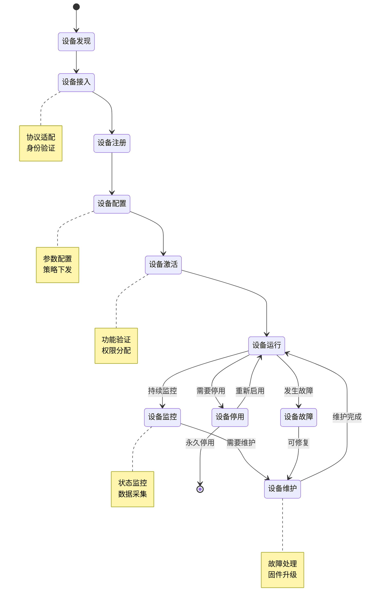
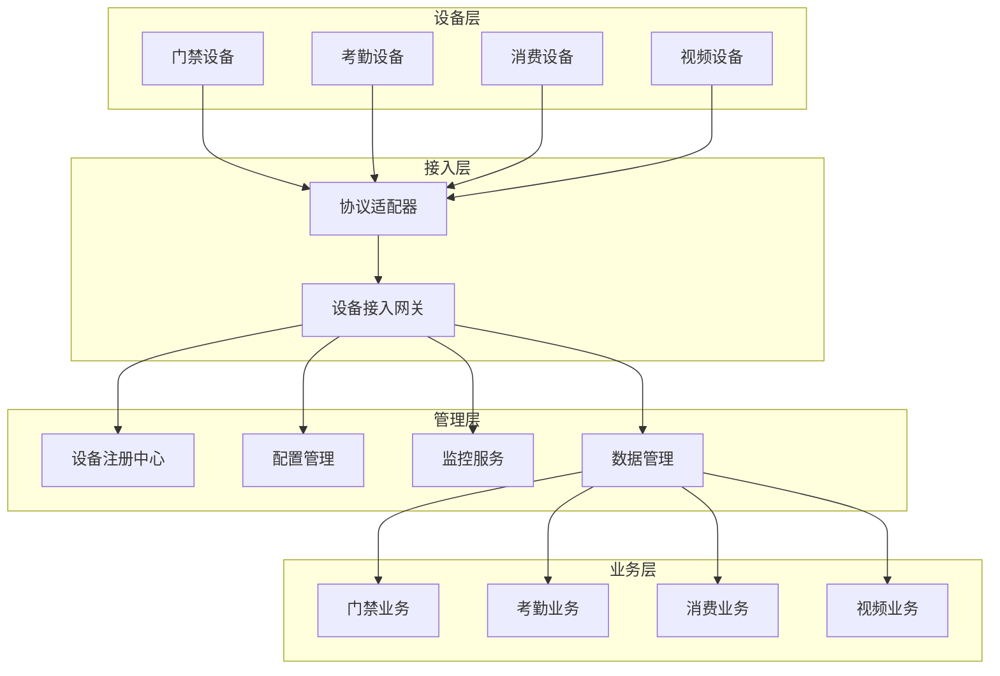

# 🔧 IOT设备管理核心操作设计

**文档版本**: v1.0.0
**创建日期**: 2025-11-16
**最后更新**: 2025-11-16
**维护者**: SmartAdmin Team
**适用范围**: IOE-DREAM项目设备管理核心功能

---

## 📋 概述

本文档专注于IOE-DREAM项目的IOT设备管理核心操作，包括设备接入、配置、监控、维护和数据交互等关键功能。文档聚焦于项目实际需要的设备管理能力，排除采购、退役等非核心流程。

### 🎯 核心功能定位

- **设备接入管理**: 支持多协议设备快速接入和注册
- **设备配置管理**: 统一的设备参数配置和策略下发
- **设备状态监控**: 实时监控设备运行状态和连接状态
- **数据交互管理**: 设备与业务系统的数据流管理
- **故障诊断处理**: 设备故障的自动诊断和恢复机制

---

## 🏗️ 设备管理核心操作模型

### 📐 核心操作流程



### 🔄 数据流转过程



---

## 🔌 设备接入管理

### 设备发现机制

#### 自动发现
```java
/**
 * 设备自动发现服务
 */
@Service
@Slf4j
public class DeviceDiscoveryService {

    @Autowired
    private List<ProtocolAdapter> protocolAdapters;

    @Autowired
    private DeviceRegistrationService deviceRegistrationService;

    /**
     * 自动发现网络设备
     */
    @Scheduled(fixedDelay = 300000) // 5分钟执行一次
    public void autoDiscovery() {
        log.info("开始设备自动发现");

        for (ProtocolAdapter adapter : protocolAdapters) {
            try {
                List<DiscoveredDevice> devices = adapter.discoverDevices();

                for (DiscoveredDevice device : devices) {
                    // 检查设备是否已注册
                    if (!isDeviceRegistered(device.getMacAddress())) {
                        // 自动注册新设备
                        deviceRegistrationService.autoRegister(device);
                        log.info("自动注册设备: {}", device.getMacAddress());
                    }
                }
            } catch (Exception e) {
                log.error("协议适配器 {} 发现设备失败", adapter.getProtocolType(), e);
            }
        }
    }
}
```

#### 手动接入
```java
/**
 * 手动设备接入服务
 */
@Service
@Slf4j
public class DeviceManualAccessService {

    /**
     * 手动添加设备
     */
    public DeviceAccessResult addDevice(ManualDeviceAddRequest request) {
        log.info("手动添加设备: {}", request.getDeviceCode());

        try {
            // 1. 验证设备参数
            validateDeviceParameters(request);

            // 2. 检查网络连接
            boolean isReachable = checkNetworkConnectivity(request.getIpAddress(), request.getPort());
            if (!isReachable) {
                return DeviceAccessResult.failed("设备网络不可达");
            }

            // 3. 协议连接测试
            ProtocolAdapter adapter = getProtocolAdapter(request.getProtocolType());
            boolean canConnect = adapter.testConnection(request);
            if (!canConnect) {
                return DeviceAccessResult.failed("协议连接失败");
            }

            // 4. 创建设备记录
            SmartDeviceEntity device = createDeviceEntity(request);
            smartDeviceDao.insert(device);

            // 5. 初始化设备配置
            initializeDeviceConfig(device);

            return DeviceAccessResult.success(device.getDeviceId());

        } catch (Exception e) {
            log.error("手动添加设备失败", e);
            return DeviceAccessResult.failed("添加失败: " + e.getMessage());
        }
    }
}
```

### 设备注册认证

```java
/**
 * 设备注册认证服务
 */
@Service
@Slf4j
public class DeviceRegistrationService {

    /**
     * 设备身份认证
     */
    public DeviceAuthResult authenticateDevice(DeviceAuthRequest authRequest) {
        log.info("设备身份认证: {}", authRequest.getDeviceId());

        try {
            // 1. 查询设备信息
            SmartDeviceEntity device = smartDeviceDao.selectByDeviceCode(authRequest.getDeviceCode());
            if (device == null) {
                return DeviceAuthResult.failed("设备未注册");
            }

            // 2. 验证证书（如果使用证书认证）
            if (device.getAuthType() == AuthType.CERTIFICATE) {
                boolean certValid = validateCertificate(authRequest.getCertificate(), device);
                if (!certValid) {
                    return DeviceAuthResult.failed("证书验证失败");
                }
            }

            // 3. 验证密钥（如果使用密钥认证）
            if (device.getAuthType() == AuthType.SECRET_KEY) {
                boolean keyValid = validateSecretKey(authRequest.getSecretKey(), device);
                if (!keyValid) {
                    return DeviceAuthResult.failed("密钥验证失败");
                }
            }

            // 4. 生成访问令牌
            String accessToken = generateDeviceToken(device);

            // 5. 更新设备状态
            updateDeviceOnlineStatus(device.getDeviceId(), true);

            return DeviceAuthResult.success(accessToken);

        } catch (Exception e) {
            log.error("设备认证失败", e);
            return DeviceAuthResult.failed("认证失败: " + e.getMessage());
        }
    }
}
```

---

## ⚙️ 设备配置管理

### 配置参数管理

```java
/**
 * 设备配置管理服务
 */
@Service
@Slf4j
public class DeviceConfigService {

    /**
     * 设备配置下发
     */
    public ConfigDeployResult deployConfig(Long deviceId, DeviceConfigDTO configDTO, Long operatorId) {
        log.info("配置下发: deviceId={}, operatorId={}", deviceId, operatorId);

        try {
            // 1. 验证设备状态
            SmartDeviceEntity device = validateDeviceForConfig(deviceId);

            // 2. 验证配置参数
            validateConfigParameters(configDTO, device.getDeviceType());

            // 3. 转换配置格式
            String deviceConfig = convertConfigToDeviceFormat(configDTO, device.getProtocolType());

            // 4. 下发配置到设备
            ProtocolAdapter adapter = getProtocolAdapter(device.getProtocolType());
            ConfigResult result = adapter.deployConfig(device, deviceConfig);

            if (result.isSuccess()) {
                // 5. 保存配置记录
                saveConfigHistory(deviceId, configDTO, operatorId, ConfigStatus.SUCCESS);

                // 6. 更新设备配置缓存
                updateDeviceConfigCache(deviceId, configDTO);

                return ConfigDeployResult.success("配置下发成功");
            } else {
                saveConfigHistory(deviceId, configDTO, operatorId, ConfigStatus.FAILED);
                return ConfigDeployResult.failed(result.getErrorMessage());
            }

        } catch (Exception e) {
            log.error("配置下发失败: deviceId={}", deviceId, e);
            saveConfigHistory(deviceId, configDTO, operatorId, ConfigStatus.FAILED);
            return ConfigDeployResult.failed("配置下发失败: " + e.getMessage());
        }
    }

    /**
     * 批量配置下发
     */
    public BatchConfigResult batchDeployConfig(List<Long> deviceIds, DeviceConfigDTO configDTO, Long operatorId) {
        log.info("批量配置下发: deviceCount={}", deviceIds.size());

        BatchConfigResult batchResult = new BatchConfigResult();

        for (Long deviceId : deviceIds) {
            try {
                ConfigDeployResult result = deployConfig(deviceId, configDTO, operatorId);
                if (result.isSuccess()) {
                    batchResult.addSuccess(deviceId);
                } else {
                    batchResult.addFailure(deviceId, result.getErrorMessage());
                }
            } catch (Exception e) {
                batchResult.addFailure(deviceId, e.getMessage());
            }
        }

        return batchResult;
    }
}
```

### 策略管理

```java
/**
 * 设备策略管理服务
 */
@Service
@Slf4j
public class DevicePolicyService {

    /**
     * 创建设备策略
     */
    public DevicePolicy createPolicy(DevicePolicyCreateRequest request) {
        log.info("创建设备策略: {}", request.getPolicyName());

        // 1. 验证策略参数
        validatePolicyParameters(request);

        // 2. 创建策略记录
        DevicePolicyEntity policy = new DevicePolicyEntity();
        policy.setPolicyName(request.getPolicyName());
        policy.setPolicyType(request.getPolicyType());
        policy.setPolicyContent(JSON.toJSONString(request.getPolicyContent()));
        policy.setPriority(request.getPriority());
        policy.setEnableFlag(1);
        policy.setCreateUserId(request.getOperatorId());

        devicePolicyDao.insert(policy);

        // 3. 绑定策略到设备
        if (!CollectionUtils.isEmpty(request.getDeviceIds())) {
            bindPolicyToDevices(policy.getPolicyId(), request.getDeviceIds());
        }

        return convertToDTO(policy);
    }

    /**
     * 策略下发
     */
    public PolicyDeployResult deployPolicy(Long policyId, List<Long> deviceIds, Long operatorId) {
        log.info("策略下发: policyId={}, deviceCount={}", policyId, deviceIds.size());

        DevicePolicyEntity policy = devicePolicyDao.selectById(policyId);
        if (policy == null) {
            throw new SmartException("策略不存在");
        }

        PolicyDeployResult result = new PolicyDeployResult();

        for (Long deviceId : deviceIds) {
            try {
                SmartDeviceEntity device = smartDeviceDao.selectById(deviceId);
                if (device == null) {
                    result.addFailure(deviceId, "设备不存在");
                    continue;
                }

                // 下发策略到设备
                ProtocolAdapter adapter = getProtocolAdapter(device.getProtocolType());
                boolean deployResult = adapter.deployPolicy(device, policy);

                if (deployResult) {
                    result.addSuccess(deviceId);
                    // 保存设备策略绑定记录
                    saveDevicePolicyBinding(deviceId, policyId, operatorId);
                } else {
                    result.addFailure(deviceId, "策略下发失败");
                }

            } catch (Exception e) {
                log.error("策略下发失败: deviceId={}, policyId={}", deviceId, policyId, e);
                result.addFailure(deviceId, e.getMessage());
            }
        }

        return result;
    }
}
```

---

## 📊 设备监控管理

### 实时状态监控

```java
/**
 * 设备实时监控服务
 */
@Service
@Slf4j
public class DeviceMonitorService {

    @Autowired
    private WebSocketService webSocketService;

    @Autowired
    private RedisTemplate<String, Object> redisTemplate;

    private static final String DEVICE_STATUS_KEY = "device:status:";

    /**
     * 更新设备状态
     */
    public void updateDeviceStatus(Long deviceId, DeviceStatus status) {
        log.info("更新设备状态: deviceId={}, status={}", deviceId, status);

        try {
            // 1. 更新数据库
            smartDeviceDao.updateStatus(deviceId, status.getStatusCode(), new Date());

            // 2. 更新Redis缓存
            String cacheKey = DEVICE_STATUS_KEY + deviceId;
            redisTemplate.opsForValue().set(cacheKey, status, 5, TimeUnit.MINUTES);

            // 3. 发送WebSocket通知
            DeviceStatusNotification notification = new DeviceStatusNotification();
            notification.setDeviceId(deviceId);
            notification.setStatus(status);
            notification.setTimestamp(new Date());

            webSocketService.sendToTopic("device:status:update", notification);

            // 4. 触发告警（如果需要）
            if (status.isAlarmRequired()) {
                triggerDeviceAlarm(deviceId, status);
            }

        } catch (Exception e) {
            log.error("更新设备状态失败: deviceId={}", deviceId, e);
        }
    }

    /**
     * 批量获取设备状态
     */
    public Map<Long, DeviceStatus> batchGetDeviceStatus(List<Long> deviceIds) {
        log.info("批量获取设备状态: deviceCount={}", deviceIds.size());

        Map<Long, DeviceStatus> statusMap = new HashMap<>();

        // 1. 尝试从缓存获取
        List<String> cacheKeys = deviceIds.stream()
                .map(id -> DEVICE_STATUS_KEY + id)
                .collect(Collectors.toList());

        List<Object> cachedStatuses = redisTemplate.opsForValue().multiGet(cacheKeys);

        for (int i = 0; i < deviceIds.size(); i++) {
            Long deviceId = deviceIds.get(i);
            Object cachedStatus = cachedStatuses.get(i);

            if (cachedStatus != null) {
                statusMap.put(deviceId, (DeviceStatus) cachedStatus);
            }
        }

        // 2. 从数据库获取缓存中缺失的状态
        List<Long> missingDeviceIds = deviceIds.stream()
                .filter(id -> !statusMap.containsKey(id))
                .collect(Collectors.toList());

        if (!missingDeviceIds.isEmpty()) {
            List<SmartDeviceEntity> devices = smartDeviceDao.selectByIds(missingDeviceIds);

            for (SmartDeviceEntity device : devices) {
                DeviceStatus status = DeviceStatus.fromEntity(device);
                statusMap.put(device.getDeviceId(), status);

                // 更新缓存
                String cacheKey = DEVICE_STATUS_KEY + device.getDeviceId();
                redisTemplate.opsForValue().set(cacheKey, status, 5, TimeUnit.MINUTES);
            }
        }

        return statusMap;
    }
}
```

### 设备健康检查

```java
/**
 * 设备健康检查服务
 */
@Service
@Slf4j
public class DeviceHealthCheckService {

    /**
     * 执行设备健康检查
     */
    @Scheduled(fixedDelay = 60000) // 1分钟执行一次
    public void performHealthCheck() {
        log.debug("开始设备健康检查");

        try {
            // 获取所有在线设备
            List<SmartDeviceEntity> onlineDevices = smartDeviceDao.selectOnlineDevices();

            // 并行执行健康检查
            List<CompletableFuture<HealthCheckResult>> futures = onlineDevices.stream()
                    .map(this::checkDeviceHealth)
                    .collect(Collectors.toList());

            // 等待所有检查完成
            CompletableFuture.allOf(futures.toArray(new CompletableFuture[0])).join();

            // 处理检查结果
            for (CompletableFuture<HealthCheckResult> future : futures) {
                try {
                    HealthCheckResult result = future.get();
                    handleHealthCheckResult(result);
                } catch (Exception e) {
                    log.error("健康检查结果处理失败", e);
                }
            }

        } catch (Exception e) {
            log.error("设备健康检查执行失败", e);
        }
    }

    /**
     * 单个设备健康检查
     */
    @Async("healthCheckExecutor")
    public CompletableFuture<HealthCheckResult> checkDeviceHealth(SmartDeviceEntity device) {
        return CompletableFuture.supplyAsync(() -> {
            try {
                ProtocolAdapter adapter = getProtocolAdapter(device.getProtocolType());
                return adapter.healthCheck(device);
            } catch (Exception e) {
                log.error("设备健康检查失败: deviceId={}", device.getDeviceId(), e);
                return HealthCheckResult.failed(device.getDeviceId(), e.getMessage());
            }
        });
    }

    /**
     * 处理健康检查结果
     */
    private void handleHealthCheckResult(HealthCheckResult result) {
        Long deviceId = result.getDeviceId();

        if (result.isHealthy()) {
            // 设备正常
            deviceMonitorService.updateDeviceStatus(deviceId, DeviceStatus.ONLINE);
        } else {
            // 设备异常
            DeviceStatus abnormalStatus = DeviceStatus.ABNORMAL;
            abnormalStatus.setErrorMessage(result.getErrorMessage());
            deviceMonitorService.updateDeviceStatus(deviceId, abnormalStatus);

            // 记录健康检查日志
            saveHealthCheckLog(deviceId, result);
        }
    }
}
```

---

## 🔧 故障诊断处理

### 故障自动诊断

```java
/**
 * 设备故障诊断服务
 */
@Service
@Slf4j
public class DeviceDiagnosticService {

    @Autowired
    private List<DiagnosticRule> diagnosticRules;

    /**
     * 执行设备故障诊断
     */
    public DiagnosticResult diagnoseDevice(Long deviceId, DeviceFaultReport faultReport) {
        log.info("设备故障诊断: deviceId={}, faultCode={}", deviceId, faultReport.getFaultCode());

        DiagnosticResult result = new DiagnosticResult();
        result.setDeviceId(deviceId);
        result.setFaultReport(faultReport);

        try {
            // 1. 获取设备信息
            SmartDeviceEntity device = smartDeviceDao.selectById(deviceId);
            if (device == null) {
                result.setDiagnosisStatus(DiagnosisStatus.DEVICE_NOT_FOUND);
                return result;
            }

            // 2. 执行诊断规则
            for (DiagnosticRule rule : diagnosticRules) {
                if (rule.isApplicable(faultReport, device)) {
                    RuleResult ruleResult = rule.diagnose(faultReport, device);
                    result.addRuleResult(ruleResult);

                    if (ruleResult.isCritical()) {
                        result.setCritical(true);
                    }
                }
            }

            // 3. 生成诊断结论
            if (result.isCritical()) {
                result.setDiagnosisStatus(DiagnosisStatus.CRITICAL_FAULT);
            } else if (result.hasWarnings()) {
                result.setDiagnosisStatus(DiagnosisStatus.WARNING);
            } else {
                result.setDiagnosisStatus(DiagnosisStatus.NORMAL);
            }

            // 4. 生成修复建议
            generateRepairSuggestions(result);

            // 5. 保存诊断记录
            saveDiagnosticRecord(result);

        } catch (Exception e) {
            log.error("设备故障诊断失败: deviceId={}", deviceId, e);
            result.setDiagnosisStatus(DiagnosisStatus.DIAGNOSIS_FAILED);
            result.setErrorMessage(e.getMessage());
        }

        return result;
    }
}
```

### 自动恢复机制

```java
/**
 * 设备自动恢复服务
 */
@Service
@Slf4j
public class DeviceAutoRecoveryService {

    @Autowired
    private List<RecoveryAction> recoveryActions;

    /**
     * 执行自动恢复
     */
    public RecoveryResult performAutoRecovery(Long deviceId, DiagnosticResult diagnosticResult) {
        log.info("设备自动恢复: deviceId={}", deviceId);

        RecoveryResult result = new RecoveryResult();
        result.setDeviceId(deviceId);

        try {
            // 1. 判断是否可以自动恢复
            if (!canAutoRecover(diagnosticResult)) {
                result.setRecoveryStatus(RecoveryStatus.MANUAL_REQUIRED);
                result.setMessage("需要人工干预");
                return result;
            }

            // 2. 按优先级执行恢复操作
            List<RecoveryAction> applicableActions = recoveryActions.stream()
                    .filter(action -> action.isApplicable(diagnosticResult))
                    .sorted(Comparator.comparing(RecoveryAction::getPriority))
                    .collect(Collectors.toList());

            for (RecoveryAction action : applicableActions) {
                try {
                    ActionResult actionResult = action.execute(deviceId, diagnosticResult);
                    result.addActionResult(actionResult);

                    if (actionResult.isSuccess()) {
                        // 恢复成功，验证设备状态
                        if (verifyDeviceRecovery(deviceId)) {
                            result.setRecoveryStatus(RecoveryStatus.SUCCESS);
                            result.setMessage("自动恢复成功");
                            break;
                        }
                    }

                } catch (Exception e) {
                    log.error("恢复操作失败: action={}, deviceId={}", action.getClass().getSimpleName(), deviceId, e);
                    result.addError(e.getMessage());
                }
            }

            // 3. 设置最终恢复状态
            if (result.getRecoveryStatus() == null) {
                result.setRecoveryStatus(RecoveryStatus.FAILED);
                result.setMessage("自动恢复失败");
            }

            // 4. 保存恢复记录
            saveRecoveryRecord(result);

        } catch (Exception e) {
            log.error("设备自动恢复执行失败: deviceId={}", deviceId, e);
            result.setRecoveryStatus(RecoveryStatus.FAILED);
            result.setErrorMessage(e.getMessage());
        }

        return result;
    }

    /**
     * 验证设备恢复状态
     */
    private boolean verifyDeviceRecovery(Long deviceId) {
        try {
            // 等待设备稳定
            Thread.sleep(5000);

            // 执行健康检查
            SmartDeviceEntity device = smartDeviceDao.selectById(deviceId);
            ProtocolAdapter adapter = getProtocolAdapter(device.getProtocolType());
            HealthCheckResult healthResult = adapter.healthCheck(device);

            return healthResult.isHealthy();

        } catch (Exception e) {
            log.error("设备恢复验证失败: deviceId={}", deviceId, e);
            return false;
        }
    }
}
```

---

## 📈 性能监控和优化

### 设备性能监控

```java
/**
 * 设备性能监控服务
 */
@Service
@Slf4j
public class DevicePerformanceMonitorService {

    @Autowired
    private MeterRegistry meterRegistry;

    private final Map<Long, DeviceMetrics> deviceMetricsMap = new ConcurrentHashMap<>();

    /**
     * 记录设备响应时间
     */
    public void recordResponseTime(Long deviceId, String operation, Duration duration) {
        Timer.Sample sample = Timer.start(meterRegistry);
        sample.stop(Timer.builder("device.response.time")
                .tag("device_id", deviceId.toString())
                .tag("operation", operation)
                .register(meterRegistry));

        // 更新设备指标
        DeviceMetrics metrics = getDeviceMetrics(deviceId);
        metrics.recordResponseTime(operation, duration);
    }

    /**
     * 记录设备错误
     */
    public void recordError(Long deviceId, String errorType, String errorMessage) {
        Counter.builder("device.error.count")
                .tag("device_id", deviceId.toString())
                .tag("error_type", errorType)
                .register(meterRegistry)
                .increment();

        // 更新设备指标
        DeviceMetrics metrics = getDeviceMetrics(deviceId);
        metrics.recordError(errorType, errorMessage);
    }

    /**
     * 获取设备性能报告
     */
    public DevicePerformanceReport getPerformanceReport(Long deviceId, Duration period) {
        DeviceMetrics metrics = deviceMetricsMap.get(deviceId);
        if (metrics == null) {
            return DevicePerformanceReport.empty(deviceId);
        }

        return metrics.generateReport(period);
    }

    private DeviceMetrics getDeviceMetrics(Long deviceId) {
        return deviceMetricsMap.computeIfAbsent(deviceId, id -> new DeviceMetrics(id));
    }
}
```

### 设备负载均衡

```java
/**
 * 设备负载均衡服务
 */
@Service
@Slf4j
public class DeviceLoadBalancerService {

    @Autowired
    private DevicePerformanceMonitorService performanceMonitor;

    /**
     * 选择最优设备
     */
    public SmartDeviceEntity selectOptimalDevice(String deviceType, LoadBalancingStrategy strategy) {
        List<SmartDeviceEntity> availableDevices = smartDeviceDao.selectAvailableByType(deviceType);

        if (availableDevices.isEmpty()) {
            throw new SmartException("没有可用的设备: " + deviceType);
        }

        return strategy.select(availableDevices, performanceMonitor);
    }

    /**
     * 基于响应时间的负载均衡策略
     */
    public static class ResponseTimeStrategy implements LoadBalancingStrategy {
        @Override
        public SmartDeviceEntity select(List<SmartDeviceEntity> devices, DevicePerformanceMonitorService monitor) {
            return devices.stream()
                    .min(Comparator.comparing(device -> {
                        DevicePerformanceReport report = monitor.getPerformanceReport(device.getDeviceId(), Duration.ofMinutes(5));
                        return report.getAverageResponseTime();
                    }))
                    .orElse(devices.get(0));
        }
    }

    /**
     * 基于错误率的负载均衡策略
     */
    public static class ErrorRateStrategy implements LoadBalancingStrategy {
        @Override
        public SmartDeviceEntity select(List<SmartDeviceEntity> devices, DevicePerformanceMonitorService monitor) {
            return devices.stream()
                    .min(Comparator.comparing(device -> {
                        DevicePerformanceReport report = monitor.getPerformanceReport(device.getDeviceId(), Duration.ofMinutes(5));
                        return report.getErrorRate();
                    }))
                    .orElse(devices.get(0));
        }
    }
}
```

---

## 🔐 安全管理

### 设备访问控制

```java
/**
 * 设备访问控制服务
 */
@Service
@Slf4j
public class DeviceAccessControlService {

    @Autowired
    private RateLimiter rateLimiter;

    @Autowired
    private AccessControlList accessControlList;

    /**
     * 检查设备访问权限
     */
    public boolean checkDeviceAccess(Long deviceId, String clientIp, String authToken) {
        try {
            // 1. 限流检查
            if (!rateLimiter.tryAcquire(deviceId.toString())) {
                log.warn("设备访问频率超限: deviceId={}, clientIp={}", deviceId, clientIp);
                return false;
            }

            // 2. IP白名单检查
            if (!accessControlList.isIpAllowed(clientIp)) {
                log.warn("设备访问IP被拒绝: deviceId={}, clientIp={}", deviceId, clientIp);
                return false;
            }

            // 3. 令牌验证
            if (!validateDeviceToken(deviceId, authToken)) {
                log.warn("设备访问令牌无效: deviceId={}, clientIp={}", deviceId, clientIp);
                return false;
            }

            // 4. 设备状态检查
            SmartDeviceEntity device = smartDeviceDao.selectById(deviceId);
            if (device == null || device.getEnableFlag() != 1) {
                log.warn("设备状态异常: deviceId={}, clientIp={}", deviceId, clientIp);
                return false;
            }

            return true;

        } catch (Exception e) {
            log.error("设备访问权限检查失败: deviceId={}", deviceId, e);
            return false;
        }
    }
}
```

### 设备数据加密

```java
/**
 * 设备数据加密服务
 */
@Component
@Slf4j
public class DeviceDataEncryptionService {

    @Value("${device.encryption.enabled:true}")
    private boolean encryptionEnabled;

    @Value("${device.encryption.algorithm:AES-256-GCM}")
    private String encryptionAlgorithm;

    /**
     * 加密设备数据
     */
    public byte[] encryptData(byte[] originalData, Long deviceId) {
        if (!encryptionEnabled) {
            return originalData;
        }

        try {
            // 获取设备特定密钥
            String deviceKey = getDeviceEncryptionKey(deviceId);

            // 执行加密
            Cipher cipher = Cipher.getInstance(encryptionAlgorithm);
            SecretKeySpec keySpec = new SecretKeySpec(deviceKey.getBytes(), "AES");

            // 生成随机IV
            byte[] iv = new byte[12];
            SecureRandom.getInstanceStrong().nextBytes(iv);
            GCMParameterSpec parameterSpec = new GCMParameterSpec(128, iv);

            cipher.init(Cipher.ENCRYPT_MODE, keySpec, parameterSpec);
            byte[] encryptedData = cipher.doFinal(originalData);

            // 组合IV和加密数据
            byte[] combined = new byte[iv.length + encryptedData.length];
            System.arraycopy(iv, 0, combined, 0, iv.length);
            System.arraycopy(encryptedData, 0, combined, iv.length, encryptedData.length);

            return combined;

        } catch (Exception e) {
            log.error("设备数据加密失败: deviceId={}", deviceId, e);
            throw new SmartException("数据加密失败");
        }
    }

    /**
     * 解密设备数据
     */
    public byte[] decryptData(byte[] encryptedData, Long deviceId) {
        if (!encryptionEnabled) {
            return encryptedData;
        }

        try {
            String deviceKey = getDeviceEncryptionKey(deviceId);

            // 提取IV和密文
            byte[] iv = Arrays.copyOfRange(encryptedData, 0, 12);
            byte[] cipherText = Arrays.copyOfRange(encryptedData, 12, encryptedData.length);

            Cipher cipher = Cipher.getInstance(encryptionAlgorithm);
            SecretKeySpec keySpec = new SecretKeySpec(deviceKey.getBytes(), "AES");
            GCMParameterSpec parameterSpec = new GCMParameterSpec(128, iv);

            cipher.init(Cipher.DECRYPT_MODE, keySpec, parameterSpec);
            return cipher.doFinal(cipherText);

        } catch (Exception e) {
            log.error("设备数据解密失败: deviceId={}", deviceId, e);
            throw new SmartException("数据解密失败");
        }
    }
}
```

---

## 📊 监控指标和告警

### 关键指标定义

```java
/**
 * 设备监控指标定义
 */
@Component
public class DeviceMonitorMetrics {

    @Autowired
    private MeterRegistry meterRegistry;

    private Counter deviceOnlineCounter;
    private Counter deviceOfflineCounter;
    private Counter deviceErrorCounter;
    private Gauge deviceCountGauge;
    private Timer responseTimeTimer;

    @PostConstruct
    public void initMetrics() {
        deviceOnlineCounter = Counter.builder("device.online.count")
                .description("设备上线次数")
                .register(meterRegistry);

        deviceOfflineCounter = Counter.builder("device.offline.count")
                .description("设备下线次数")
                .register(meterRegistry);

        deviceErrorCounter = Counter.builder("device.error.count")
                .description("设备错误次数")
                .tag("error_type", "unknown")
                .register(meterRegistry);

        deviceCountGauge = Gauge.builder("device.total.count")
                .description("设备总数")
                .register(meterRegistry, this, DeviceMonitorMetrics::getTotalDeviceCount);

        responseTimeTimer = Timer.builder("device.response.time")
                .description("设备响应时间")
                .tag("device_type", "unknown")
                .register(meterRegistry);
    }

    public void recordDeviceOnline() {
        deviceOnlineCounter.increment();
    }

    public void recordDeviceOffline() {
        deviceOfflineCounter.increment();
    }

    public void recordDeviceError(String errorType) {
        deviceErrorCounter.increment(Tags.of("error_type", errorType));
    }

    public void recordResponseTime(String deviceType, Duration duration) {
        responseTimeTimer.tag("device_type", deviceType).record(duration);
    }

    private double getTotalDeviceCount() {
        return smartDeviceDao.selectCount();
    }
}
```

### 告警规则配置

```java
/**
 * 设备告警规则服务
 */
@Service
@Slf4j
public class DeviceAlarmRuleService {

    /**
     * 创建告警规则
     */
    public DeviceAlarmRule createAlarmRule(AlarmRuleCreateRequest request) {
        log.info("创建设备告警规则: {}", request.getRuleName());

        // 1. 验证规则参数
        validateAlarmRule(request);

        // 2. 创建规则记录
        DeviceAlarmRuleEntity rule = new DeviceAlarmRuleEntity();
        rule.setRuleName(request.getRuleName());
        rule.setRuleType(request.getRuleType());
        rule.setConditionExpression(request.getConditionExpression());
        rule.setThresholdValue(request.getThresholdValue());
        rule.setAlarmLevel(request.getAlarmLevel());
        rule.setNotificationChannels(JSON.toJSONString(request.getNotificationChannels()));
        rule.setEnableFlag(1);
        rule.setCreateUserId(request.getOperatorId());

        deviceAlarmRuleDao.insert(rule);

        return convertToDTO(rule);
    }

    /**
     * 评估告警规则
     */
    @EventListener
    public void evaluateAlarmRules(DeviceStatusEvent event) {
        List<DeviceAlarmRuleEntity> applicableRules = deviceAlarmRuleDao.selectApplicableRules(
                event.getDeviceId(), event.getEventType());

        for (DeviceAlarmRuleEntity rule : applicableRules) {
            try {
                boolean triggered = evaluateRule(rule, event);
                if (triggered) {
                    triggerAlarm(rule, event);
                }
            } catch (Exception e) {
                log.error("告警规则评估失败: ruleId={}, deviceId={}", rule.getRuleId(), event.getDeviceId(), e);
            }
        }
    }

    /**
     * 触发告警
     */
    private void triggerAlarm(DeviceAlarmRuleEntity rule, DeviceStatusEvent event) {
        // 1. 创建告警记录
        DeviceAlarmEntity alarm = new DeviceAlarmEntity();
        alarm.setDeviceId(event.getDeviceId());
        alarm.setRuleId(rule.getRuleId());
        alarm.setAlarmLevel(rule.getAlarmLevel());
        alarm.setAlarmMessage(generateAlarmMessage(rule, event));
        alarm.setAlarmTime(new Date());
        alarm.setStatus(AlarmStatus.ACTIVE);

        deviceAlarmDao.insert(alarm);

        // 2. 发送通知
        sendAlarmNotification(rule, alarm, event);
    }
}
```

---

## 📚 相关文档

- **[设备分类与业务模块关系](./device-business-mapping.md)** - 设备类型与业务模块映射
- **[设备与区域管理集成设计](./device-area-integration.md)** - 设备区域关联和权限管理
- **[设备与人员管理集成设计](./device-personnel-integration.md)** - 设备人员下发和同步管理
- **[IOT设备数据采集和处理架构](./iot-data-collection-processing.md)** - 数据采集和处理架构
- **[IOT设备接入最佳实践指南](./iot-best-practices-guide.md)** - 设备接入和运维最佳实践
- **[多协议设备接入技术实现方案](../IMPLEMENTATION/multi-protocol-implementation-guide.md)** - 协议适配和设备接入实现

---

**⚠️ 重要提醒**: 本文档专注IOE-DREAM项目的设备管理核心功能，所有设计和实现必须严格遵循项目repowiki规范和架构设计标准。设备管理功能应与门禁、考勤、消费、视频等业务模块紧密集成，确保数据流的一致性和业务逻辑的正确性。