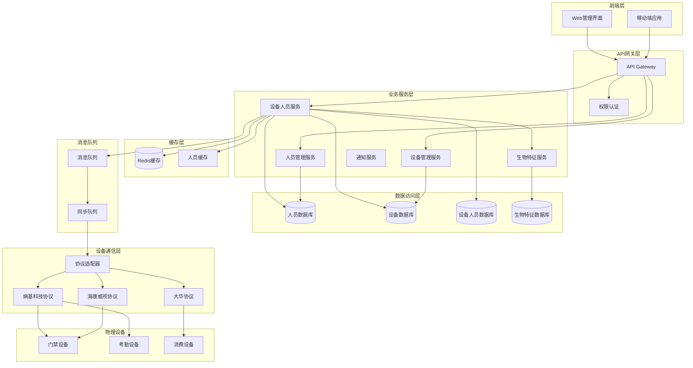
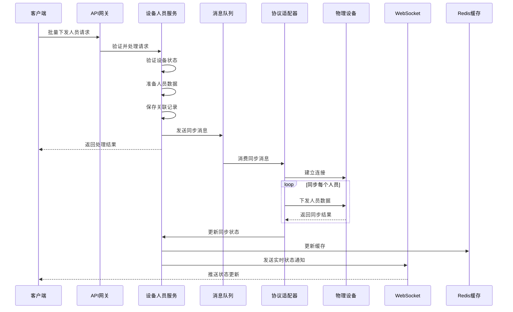

# 🏢 设备与人员管理集成架构设计

**项目**: IOE-DREAM 智能设备管理系统
**模块**: 设备-人员集成管理
**版本**: v1.0.0
**最后更新**: 2025-11-16
**维护者**: SmartAdmin Team

---

## 📋 概述

本文档详细描述IOE-DREAM系统中设备与人员管理的集成架构设计，实现人员信息到设备的下发、同步、权限管理等功能，支持查看"设备中下发人员（存在的人）有哪些"的核心需求。

### 🎯 核心目标
- 👥 **人员下发管理**: 支持将人员信息批量下发到指定设备
- 📊 **同步状态监控**: 实时监控人员同步状态和结果
- 🔐 **权限集中管理**: 统一管理设备端人员的访问权限
- 👆 **生物特征集成**: 支持指纹、人脸等生物特征的模板管理
- 📱 **实时状态查询**: 提供设备人员列表的实时查询接口

---

## 🏗️ 系统架构设计

### 架构概览



### 核心组件说明

#### 1. 设备人员服务 (DevicePersonnelService)
- **人员下发**: 处理人员信息到设备的批量下发
- **状态同步**: 监控和更新人员同步状态
- **权限管理**: 管理设备端人员的访问权限
- **查询服务**: 提供设备人员列表查询功能

#### 2. 生物特征服务 (BiometricService)
- **模板管理**: 指纹、人脸等生物特征模板管理
- **加密存储**: 生物特征数据的安全存储
- **格式转换**: 不同设备间的生物特征格式转换

#### 3. 协议适配器 (ProtocolAdapter)
- **多协议支持**: 支持不同厂家设备的通信协议
- **数据转换**: 统一数据格式到设备特定格式
- **异常处理**: 通信异常的重试和错误处理

---

## 🗄️ 数据库设计

### 设备人员关联表 (t_device_personnel)

```sql
CREATE TABLE `t_device_personnel` (
  `device_personnel_id` BIGINT NOT NULL AUTO_INCREMENT COMMENT '设备人员关联ID',
  `device_id` BIGINT NOT NULL COMMENT '设备ID',
  `personnel_id` BIGINT NOT NULL COMMENT '人员ID',
  `sync_status` TINYINT NOT NULL DEFAULT 0 COMMENT '同步状态: 0-待同步 1-同步中 2-同步成功 3-同步失败',
  `sync_time` DATETIME DEFAULT NULL COMMENT '最后同步时间',
  `sync_error_code` VARCHAR(50) DEFAULT NULL COMMENT '同步错误码',
  `sync_error_message` TEXT DEFAULT NULL COMMENT '同步错误信息',
  `device_personnel_id` VARCHAR(100) DEFAULT NULL COMMENT '设备端人员ID',
  `access_level` TINYINT DEFAULT 1 COMMENT '访问级别: 1-普通 2-管理员 3-超级管理员',
  `valid_start_time` DATETIME DEFAULT NULL COMMENT '权限开始时间',
  `valid_end_time` DATETIME DEFAULT NULL COMMENT '权限结束时间',
  `enable_flag` TINYINT DEFAULT 1 COMMENT '启用状态: 0-禁用 1-启用',
  `create_time` DATETIME DEFAULT CURRENT_TIMESTAMP COMMENT '创建时间',
  `create_user_id` BIGINT DEFAULT NULL COMMENT '创建人ID',
  `update_time` DATETIME DEFAULT CURRENT_TIMESTAMP ON UPDATE CURRENT_TIMESTAMP COMMENT '更新时间',
  `update_user_id` BIGINT DEFAULT NULL COMMENT '更新人ID',
  `deleted_flag` TINYINT DEFAULT 0 COMMENT '删除标志: 0-未删除 1-已删除',
  PRIMARY KEY (`device_personnel_id`),
  UNIQUE KEY `uk_device_personnel` (`device_id`, `personnel_id`),
  KEY `idx_personnel_id` (`personnel_id`),
  KEY `idx_sync_status` (`sync_status`),
  KEY `idx_sync_time` (`sync_time`)
) ENGINE=InnoDB DEFAULT CHARSET=utf8mb4 COLLATE=utf8mb4_unicode_ci COMMENT='设备人员关联表';
```

### 人员生物特征表 (t_personnel_biometric)

```sql
CREATE TABLE `t_personnel_biometric` (
  `biometric_id` BIGINT NOT NULL AUTO_INCREMENT COMMENT '生物特征ID',
  `personnel_id` BIGINT NOT NULL COMMENT '人员ID',
  `biometric_type` TINYINT NOT NULL COMMENT '生物特征类型: 1-指纹 2-人脸 3-虹膜 4-掌纹',
  `template_index` TINYINT DEFAULT 1 COMMENT '模板索引',
  `template_data` LONGBLOB DEFAULT NULL COMMENT '生物特征模板数据(加密存储)',
  `template_format` VARCHAR(20) DEFAULT NULL COMMENT '模板格式',
  `quality_score` DECIMAL(3,2) DEFAULT NULL COMMENT '质量分数',
  `device_compatible` TINYINT DEFAULT 1 COMMENT '设备兼容性: 1-通用 2-特定设备',
  `device_type` VARCHAR(50) DEFAULT NULL COMMENT '适用设备类型',
  `create_time` DATETIME DEFAULT CURRENT_TIMESTAMP COMMENT '创建时间',
  `update_time` DATETIME DEFAULT CURRENT_TIMESTAMP ON UPDATE CURRENT_TIMESTAMP COMMENT '更新时间',
  PRIMARY KEY (`biometric_id`),
  KEY `idx_personnel_id` (`personnel_id`),
  KEY `idx_biometric_type` (`biometric_type`)
) ENGINE=InnoDB DEFAULT CHARSET=utf8mb4 COLLATE=utf8mb4_unicode_ci COMMENT='人员生物特征表';
```

### 设备人员同步日志表 (t_device_personnel_sync_log)

```sql
CREATE TABLE `t_device_personnel_sync_log` (
  `sync_log_id` BIGINT NOT NULL AUTO_INCREMENT COMMENT '同步日志ID',
  `device_id` BIGINT NOT NULL COMMENT '设备ID',
  `personnel_id` BIGINT DEFAULT NULL COMMENT '人员ID(为空表示批量操作)',
  `sync_type` TINYINT NOT NULL COMMENT '同步类型: 1-新增 2-更新 3-删除 4-批量同步',
  `sync_status` TINYINT NOT NULL COMMENT '同步状态: 1-开始 2-成功 3-失败',
  `request_data` TEXT DEFAULT NULL COMMENT '请求数据',
  `response_data` TEXT DEFAULT NULL COMMENT '响应数据',
  `error_code` VARCHAR(50) DEFAULT NULL COMMENT '错误码',
  `error_message` TEXT DEFAULT NULL COMMENT '错误信息',
  `sync_duration` INT DEFAULT NULL COMMENT '同步耗时(毫秒)',
  `create_time` DATETIME DEFAULT CURRENT_TIMESTAMP COMMENT '创建时间',
  PRIMARY KEY (`sync_log_id`),
  KEY `idx_device_id` (`device_id`),
  KEY `idx_personnel_id` (`personnel_id`),
  KEY `idx_sync_status` (`sync_status`),
  KEY `idx_create_time` (`create_time`)
) ENGINE=InnoDB DEFAULT CHARSET=utf8mb4 COLLATE=utf8mb4_unicode_ci COMMENT='设备人员同步日志表';
```

---

## 🔧 核心服务实现

### 设备人员管理服务

#### DevicePersonnelService 核心实现

```java
package net.lab1024.sa.base.module.smart.device.service;

import lombok.extern.slf4j.Slf4j;
import net.lab1024.sa.base.common.device.domain.entity.SmartDeviceEntity;
import net.lab1024.sa.base.common.entity.BaseEntity;
import net.lab1024.sa.base.module.smart.device.domain.dto.DevicePersonnelDTO;
import net.lab1024.sa.base.module.smart.device.domain.entity.DevicePersonnelEntity;
import net.lab1024.sa.base.module.smart.device.domain.form.DevicePersonnelQueryForm;
import net.lab1024.sa.base.module.smart.device.domain.vo.DevicePersonnelVO;
import org.springframework.beans.factory.annotation.Autowired;
import org.springframework.data.redis.core.RedisTemplate;
import org.springframework.stereotype.Service;
import org.springframework.transaction.annotation.Transactional;

import java.util.*;
import java.util.concurrent.TimeUnit;

/**
 * 设备人员管理服务
 * 支持人员下发、同步状态管理、权限控制等功能
 *
 * @author SmartAdmin Team
 * @date 2025-11-16
 */
@Service
@Transactional(rollbackFor = Exception.class)
@Slf4j
public class DevicePersonnelService extends BaseService {

    @Autowired
    private DevicePersonnelDao devicePersonnelDao;

    @Autowired
    private SmartDeviceDao smartDeviceDao;

    @Autowired
    private PersonnelService personnelService;

    @Autowired
    private BiometricService biometricService;

    @Autowired
    private ProtocolAdapterService protocolAdapterService;

    @Autowired
    private RedisTemplate<String, Object> redisTemplate;

    private static final String CACHE_PREFIX = "device:personnel:";
    private static final long CACHE_EXPIRE_MINUTES = 30;

    /**
     * 获取设备人员列表
     *
     * @param deviceId 设备ID
     * @param queryForm 查询条件
     * @return 设备人员列表
     */
    public PageResult<DevicePersonnelVO> getDevicePersonnelList(Long deviceId, DevicePersonnelQueryForm queryForm) {
        log.info("查询设备人员列表: deviceId={}, query={}", deviceId, queryForm);

        // 1. 参数验证
        if (deviceId == null) {
            throw new SmartException("设备ID不能为空");
        }

        // 检查设备是否存在
        SmartDeviceEntity device = smartDeviceDao.selectById(deviceId);
        if (device == null) {
            throw new SmartException("设备不存在");
        }

        // 2. 构建查询条件
        queryForm.setDeviceId(deviceId);

        // 3. 分页查询
        PageResult<DevicePersonnelEntity> pageResult = devicePersonnelDao.selectPage(queryForm);

        // 4. 转换为VO
        List<DevicePersonnelVO> voList = new ArrayList<>();
        for (DevicePersonnelEntity entity : pageResult.getRows()) {
            DevicePersonnelVO vo = this.convertToVO(entity);
            voList.add(vo);
        }

        return new PageResult<>(voList, pageResult.getTotal());
    }

    /**
     * 批量下发人员到设备
     *
     * @param deviceId 设备ID
     * @param personnelIds 人员ID列表
     * @param operatorId 操作人ID
     * @return 下发结果
     */
    public DevicePersonnelSyncResult batchDeployPersonnel(Long deviceId, List<Long> personnelIds, Long operatorId) {
        log.info("批量下发人员到设备: deviceId={}, personnelCount={}, operator={}",
                deviceId, personnelIds.size(), operatorId);

        try {
            // 1. 参数验证和设备检查
            SmartDeviceEntity device = this.validateDeviceForDeployment(deviceId);

            // 2. 检查人员信息
            List<PersonnelEntity> personnelList = personnelService.selectByIds(personnelIds);
            if (personnelList.size() != personnelIds.size()) {
                throw new SmartException("部分人员信息不存在");
            }

            // 3. 准备下发数据
            List<DevicePersonnelDTO> deployList = new ArrayList<>();
            for (PersonnelEntity personnel : personnelList) {
                DevicePersonnelDTO dto = this.prepareDeploymentData(device, personnel, operatorId);
                deployList.add(dto);
            }

            // 4. 异步下发到设备
            DevicePersonnelSyncResult result = protocolAdapterService.batchDeployPersonnel(device, deployList);

            // 5. 保存关联记录
            for (PersonnelEntity personnel : personnelList) {
                this.saveDevicePersonnelAssociation(deviceId, personnel.getPersonnelId(), operatorId, result.getSyncStatus());
            }

            // 6. 清除缓存
            this.clearDevicePersonnelCache(deviceId);

            // 7. 发送通知
            this.sendDeploymentNotification(deviceId, personnelIds, result);

            log.info("人员下发完成: deviceId={}, successCount={}, failCount={}",
                    deviceId, result.getSuccessCount(), result.getFailCount());

            return result;

        } catch (Exception e) {
            log.error("批量下发人员失败: deviceId={}, error={}", deviceId, e.getMessage(), e);
            throw new SmartException("人员下发失败: " + e.getMessage());
        }
    }

    /**
     * 获取设备人员同步状态
     *
     * @param deviceId 设备ID
     * @param personnelId 人员ID(可选)
     * @return 同步状态信息
     */
    public List<DevicePersonnelSyncStatus> getSyncStatus(Long deviceId, Long personnelId) {
        log.info("查询设备人员同步状态: deviceId={}, personnelId={}", deviceId, personnelId);

        // 1. 参数验证
        if (deviceId == null) {
            throw new SmartException("设备ID不能为空");
        }

        // 2. 查询同步状态
        return devicePersonnelDao.selectSyncStatus(deviceId, personnelId);
    }

    /**
     * 重新同步失败的人员
     *
     * @param deviceId 设备ID
     * @param personnelIds 人员ID列表
     * @param operatorId 操作人ID
     * @return 同步结果
     */
    public DevicePersonnelSyncResult retrySyncFailedPersonnel(Long deviceId, List<Long> personnelIds, Long operatorId) {
        log.info("重新同步失败人员: deviceId={}, personnelIds={}", deviceId, personnelIds);

        // 1. 查询失败的记录
        List<DevicePersonnelEntity> failedRecords = devicePersonnelDao.selectFailedRecords(deviceId, personnelIds);

        if (failedRecords.isEmpty()) {
            throw new SmartException("没有需要重新同步的人员");
        }

        // 2. 重新同步
        List<Long> retryPersonnelIds = failedRecords.stream()
                .map(DevicePersonnelEntity::getPersonnelId)
                .collect(Collectors.toList());

        return this.batchDeployPersonnel(deviceId, retryPersonnelIds, operatorId);
    }

    /**
     * 从设备移除人员
     *
     * @param deviceId 设备ID
     * @param personnelIds 人员ID列表
     * @param operatorId 操作人ID
     * @return 移除结果
     */
    public DevicePersonnelSyncResult removePersonnelFromDevice(Long deviceId, List<Long> personnelIds, Long operatorId) {
        log.info("从设备移除人员: deviceId={}, personnelIds={}", deviceId, personnelIds);

        try {
            // 1. 参数验证
            this.validateDeviceForDeployment(deviceId);

            // 2. 从设备删除人员
            SmartDeviceEntity device = smartDeviceDao.selectById(deviceId);
            DevicePersonnelSyncResult result = protocolAdapterService.removePersonnelFromDevice(device, personnelIds);

            // 3. 更新数据库记录
            if (result.isSuccess()) {
                devicePersonnelDao.deleteByDeviceAndPersonnelIds(deviceId, personnelIds);
                this.clearDevicePersonnelCache(deviceId);
            }

            return result;

        } catch (Exception e) {
            log.error("从设备移除人员失败: deviceId={}, error={}", deviceId, e.getMessage(), e);
            throw new SmartException("移除人员失败: " + e.getMessage());
        }
    }

    /**
     * 验证设备是否可以下发人员
     */
    private SmartDeviceEntity validateDeviceForDeployment(Long deviceId) {
        SmartDeviceEntity device = smartDeviceDao.selectById(deviceId);
        if (device == null) {
            throw new SmartException("设备不存在");
        }

        if (device.getOnlineStatus() != 1) {
            throw new SmartException("设备不在线，无法下发人员");
        }

        if (device.getEnableFlag() != 1) {
            throw new SmartException("设备已禁用");
        }

        return device;
    }

    /**
     * 准备下发数据
     */
    private DevicePersonnelDTO prepareDeploymentData(SmartDeviceEntity device, PersonnelEntity personnel, Long operatorId) {
        DevicePersonnelDTO dto = new DevicePersonnelDTO();

        // 基础信息
        dto.setPersonnelId(personnel.getPersonnelId());
        dto.setPersonnelCode(personnel.getPersonnelCode());
        dto.setPersonnelName(personnel.getPersonnelName());
        dto.setDepartmentId(personnel.getDepartmentId());
        dto.setPositionId(personnel.getPositionId());

        // 生物特征信息
        List<BiometricDTO> biometrics = biometricService.getPersonnelBiometrics(personnel.getPersonnelId(), device.getDeviceType());
        dto.setBiometrics(biometrics);

        // 权限配置
        dto.setAccessLevel(this.getDefaultAccessLevel(device.getDeviceType()));
        dto.setValidStartTime(new Date());
        dto.setValidEndTime(this.calculateValidEndTime(personnel.getEmploymentStatus()));

        // 设备特定配置
        dto.setDeviceType(device.getDeviceType());
        dto.setDeviceModel(device.getDeviceModel());

        return dto;
    }

    /**
     * 保存设备人员关联
     */
    private void saveDevicePersonnelAssociation(Long deviceId, Long personnelId, Long operatorId, Integer syncStatus) {
        DevicePersonnelEntity existRecord = devicePersonnelDao.selectByDeviceAndPersonnel(deviceId, personnelId);

        if (existRecord != null) {
            // 更新现有记录
            existRecord.setSyncStatus(syncStatus);
            existRecord.setSyncTime(new Date());
            existRecord.setUpdateTime(new Date());
            existRecord.setUpdateUserId(operatorId);
            devicePersonnelDao.updateById(existRecord);
        } else {
            // 创建新记录
            DevicePersonnelEntity entity = new DevicePersonnelEntity();
            entity.setDeviceId(deviceId);
            entity.setPersonnelId(personnelId);
            entity.setSyncStatus(syncStatus);
            entity.setSyncTime(new Date());
            entity.setCreateUserId(operatorId);
            entity.setAccessLevel(1);
            entity.setEnableFlag(1);
            devicePersonnelDao.insert(entity);
        }
    }

    /**
     * 清除设备人员缓存
     */
    private void clearDevicePersonnelCache(Long deviceId) {
        String cacheKey = CACHE_PREFIX + deviceId;
        redisTemplate.delete(cacheKey);
    }

    /**
     * 实体转VO
     */
    private DevicePersonnelVO convertToVO(DevicePersonnelEntity entity) {
        DevicePersonnelVO vo = new DevicePersonnelVO();
        BeanUtil.copyProperties(entity, vo);

        // 查询人员基础信息
        PersonnelEntity personnel = personnelService.selectById(entity.getPersonnelId());
        if (personnel != null) {
            vo.setPersonnelName(personnel.getPersonnelName());
            vo.setPersonnelCode(personnel.getPersonnelCode());
            vo.setDepartmentName(personnel.getDepartmentName());
            vo.setPositionName(personnel.getPositionName());
            vo.setEmploymentStatus(personnel.getEmploymentStatus());
        }

        // 查询设备信息
        SmartDeviceEntity device = smartDeviceDao.selectById(entity.getDeviceId());
        if (device != null) {
            vo.setDeviceName(device.getDeviceName());
            vo.setDeviceCode(device.getDeviceCode());
        }

        // 同步状态描述
        vo.setSyncStatusDesc(this.getSyncStatusDesc(entity.getSyncStatus()));

        return vo;
    }

    /**
     * 获取同步状态描述
     */
    private String getSyncStatusDesc(Integer syncStatus) {
        switch (syncStatus) {
            case 0: return "待同步";
            case 1: return "同步中";
            case 2: return "同步成功";
            case 3: return "同步失败";
            default: return "未知状态";
        }
    }
}
```

### 生物特征管理服务

#### BiometricService 核心实现

```java
package net.lab1024.sa.base.module.smart.device.service;

import lombok.extern.slf4j.Slf4j;
import net.lab1024.sa.base.common.util.SmartCryptoUtil;
import org.springframework.beans.factory.annotation.Autowired;
import org.springframework.stereotype.Service;
import org.springframework.transaction.annotation.Transactional;

import java.util.List;

/**
 * 生物特征管理服务
 * 支持指纹、人脸等生物特征的存储、格式转换和设备适配
 *
 * @author SmartAdmin Team
 * @date 2025-11-16
 */
@Service
@Transactional(rollbackFor = Exception.class)
@Slf4j
public class BiometricService extends BaseService {

    @Autowired
    private PersonnelBiometricDao personnelBiometricDao;

    @Autowired
    private BiometricFormatConverter biometricFormatConverter;

    /**
     * 获取人员生物特征信息
     *
     * @param personnelId 人员ID
     * @param deviceType 设备类型(用于过滤兼容的生物特征)
     * @return 生物特征列表
     */
    public List<BiometricDTO> getPersonnelBiometrics(Long personnelId, String deviceType) {
        log.info("获取人员生物特征: personnelId={}, deviceType={}", personnelId, deviceType);

        // 1. 查询生物特征
        List<PersonnelBiometricEntity> biometricEntities =
                personnelBiometricDao.selectByPersonnelIdAndDeviceType(personnelId, deviceType);

        // 2. 转换为DTO并解密
        List<BiometricDTO> biometricList = new ArrayList<>();
        for (PersonnelBiometricEntity entity : biometricEntities) {
            BiometricDTO dto = new BiometricDTO();

            dto.setBiometricType(entity.getBiometricType());
            dto.setTemplateIndex(entity.getTemplateIndex());
            dto.setQualityScore(entity.getQualityScore());
            dto.setTemplateFormat(entity.getTemplateFormat());

            // 解密模板数据
            try {
                byte[] decryptedData = SmartCryptoUtil.decrypt(entity.getTemplateData());
                dto.setTemplateData(decryptedData);
            } catch (Exception e) {
                log.error("生物特征解密失败: personnelId={}, biometricId={}, error={}",
                        personnelId, entity.getBiometricId(), e.getMessage());
                continue;
            }

            biometricList.add(dto);
        }

        return biometricList;
    }

    /**
     * 保存人员生物特征
     *
     * @param personnelId 人员ID
     * @param biometricDTO 生物特征信息
     * @param operatorId 操作人ID
     * @return 保存结果
     */
    public boolean savePersonnelBiometric(Long personnelId, BiometricDTO biometricDTO, Long operatorId) {
        log.info("保存人员生物特征: personnelId={}, biometricType={}", personnelId, biometricDTO.getBiometricType());

        try {
            // 1. 检查是否已存在相同类型的生物特征
            PersonnelBiometricEntity existEntity = personnelBiometricDao.selectByPersonnelAndType(
                    personnelId, biometricDTO.getBiometricType(), biometricDTO.getTemplateIndex());

            // 2. 加密模板数据
            byte[] encryptedData = SmartCryptoUtil.encrypt(biometricDTO.getTemplateData());

            if (existEntity != null) {
                // 更新现有记录
                existEntity.setTemplateData(encryptedData);
                existEntity.setTemplateFormat(biometricDTO.getTemplateFormat());
                existEntity.setQualityScore(biometricDTO.getQualityScore());
                existEntity.setUpdateTime(new Date());
                existEntity.setUpdateUserId(operatorId);

                return personnelBiometricDao.updateById(existEntity) > 0;
            } else {
                // 创建新记录
                PersonnelBiometricEntity entity = new PersonnelBiometricEntity();
                entity.setPersonnelId(personnelId);
                entity.setBiometricType(biometricDTO.getBiometricType());
                entity.setTemplateIndex(biometricDTO.getTemplateIndex());
                entity.setTemplateData(encryptedData);
                entity.setTemplateFormat(biometricDTO.getTemplateFormat());
                entity.setQualityScore(biometricDTO.getQualityScore());
                entity.setDeviceCompatible(1); // 默认通用
                entity.setCreateUserId(operatorId);

                return personnelBiometricDao.insert(entity) > 0;
            }

        } catch (Exception e) {
            log.error("保存生物特征失败: personnelId={}, error={}", personnelId, e.getMessage(), e);
            return false;
        }
    }

    /**
     * 删除人员生物特征
     *
     * @param personnelId 人员ID
     * @param biometricType 生物特征类型
     * @param templateIndex 模板索引
     * @return 删除结果
     */
    public boolean deletePersonnelBiometric(Long personnelId, Integer biometricType, Integer templateIndex) {
        log.info("删除人员生物特征: personnelId={}, biometricType={}", personnelId, biometricType);

        return personnelBiometricDao.deleteByPersonnelAndType(personnelId, biometricType, templateIndex) > 0;
    }
}
```

---

## 🌐 API接口设计

### 设备人员管理API

#### 1. 获取设备人员列表

```java
@GetMapping("/api/device/{deviceId}/personnel/list")
@ApiOperation(value = "获取设备人员列表", notes = "分页查询指定设备的下发人员列表")
@SaCheckLogin
@SaCheckPermission("device:personnel:query")
public ResponseDTO<PageResult<DevicePersonnelVO>> getDevicePersonnelList(
        @PathVariable Long deviceId,
        @Valid @ModelAttribute DevicePersonnelQueryForm queryForm) {

    log.info("获取设备人员列表: deviceId={}, query={}", deviceId, queryForm);

    try {
        PageResult<DevicePersonnelVO> result = devicePersonnelService.getDevicePersonnelList(deviceId, queryForm);
        return ResponseDTO.ok(result);

    } catch (Exception e) {
        log.error("获取设备人员列表失败: deviceId={}, error={}", deviceId, e.getMessage(), e);
        return ResponseDTO.error(UserErrorCode.PARAM_ERROR, "查询失败: " + e.getMessage());
    }
}
```

#### 2. 批量下发人员到设备

```java
@PostMapping("/api/device/{deviceId}/personnel/deploy")
@ApiOperation(value = "批量下发人员到设备", notes = "将指定人员批量下发到设备")
@SaCheckLogin
@SaCheckPermission("device:personnel:deploy")
public ResponseDTO<DevicePersonnelSyncResult> batchDeployPersonnel(
        @PathVariable Long deviceId,
        @Valid @RequestBody DevicePersonnelDeployForm deployForm) {

    log.info("批量下发人员到设备: deviceId={}, personnelCount={}", deviceId, deployForm.getPersonnelIds().size());

    try {
        DevicePersonnelSyncResult result = devicePersonnelService.batchDeployPersonnel(
                deviceId, deployForm.getPersonnelIds(), SmartLoginUtil.getCurrentUserId());

        return ResponseDTO.ok(result);

    } catch (Exception e) {
        log.error("批量下发人员失败: deviceId={}, error={}", deviceId, e.getMessage(), e);
        return ResponseDTO.error(UserErrorCode.PARAM_ERROR, "下发失败: " + e.getMessage());
    }
}
```

#### 3. 查询同步状态

```java
@GetMapping("/api/device/{deviceId}/personnel/sync/status")
@ApiOperation(value = "查询人员同步状态", notes = "查询设备人员的同步状态")
@SaCheckLogin
@SaCheckPermission("device:personnel:query")
public ResponseDTO<List<DevicePersonnelSyncStatus>> getSyncStatus(
        @PathVariable Long deviceId,
        @RequestParam(required = false) Long personnelId) {

    log.info("查询同步状态: deviceId={}, personnelId={}", deviceId, personnelId);

    try {
        List<DevicePersonnelSyncStatus> statusList = devicePersonnelService.getSyncStatus(deviceId, personnelId);
        return ResponseDTO.ok(statusList);

    } catch (Exception e) {
        log.error("查询同步状态失败: deviceId={}, error={}", deviceId, e.getMessage(), e);
        return ResponseDTO.error(UserErrorCode.PARAM_ERROR, "查询失败: " + e.getMessage());
    }
}
```

#### 4. 从设备移除人员

```java
@DeleteMapping("/api/device/{deviceId}/personnel/remove")
@ApiOperation(value = "从设备移除人员", notes = "将指定人员从设备中移除")
@SaCheckLogin
@SaCheckPermission("device:personnel:remove")
public ResponseDTO<DevicePersonnelSyncResult> removePersonnelFromDevice(
        @PathVariable Long deviceId,
        @Valid @RequestBody DevicePersonnelRemoveForm removeForm) {

    log.info("从设备移除人员: deviceId={}, personnelCount={}", deviceId, removeForm.getPersonnelIds().size());

    try {
        DevicePersonnelSyncResult result = devicePersonnelService.removePersonnelFromDevice(
                deviceId, removeForm.getPersonnelIds(), SmartLoginUtil.getCurrentUserId());

        return ResponseDTO.ok(result);

    } catch (Exception e) {
        log.error("从设备移除人员失败: deviceId={}, error={}", deviceId, e.getMessage(), e);
        return ResponseDTO.error(UserErrorCode.PARAM_ERROR, "移除失败: " + e.getMessage());
    }
}
```

---

## 🔄 数据同步机制

### 实时状态同步



### 同步状态管理

```java
/**
 * 同步状态枚举
 */
public enum SyncStatusEnum {
    PENDING(0, "待同步"),
    SYNCING(1, "同步中"),
    SUCCESS(2, "同步成功"),
    FAILED(3, "同步失败");

    private final Integer code;
    private final String desc;

    SyncStatusEnum(Integer code, String desc) {
        this.code = code;
        this.desc = desc;
    }
}

/**
 * 同步状态监控服务
 */
@Service
@Slf4j
public class SyncStatusMonitorService {

    @Autowired
    private WebSocketService webSocketService;

    @Autowired
    private RedisTemplate<String, Object> redisTemplate;

    /**
     * 更新同步状态
     */
    public void updateSyncStatus(Long deviceId, Long personnelId, SyncStatusEnum status, String errorMessage) {
        log.info("更新同步状态: deviceId={}, personnelId={}, status={}", deviceId, personnelId, status);

        // 1. 更新数据库
        devicePersonnelDao.updateSyncStatus(deviceId, personnelId, status.getCode(), errorMessage);

        // 2. 更新缓存
        String cacheKey = "sync:status:" + deviceId;
        redisTemplate.opsForHash().put(cacheKey, personnelId.toString(), status.getCode());

        // 3. 发送WebSocket通知
        DevicePersonnelSyncNotification notification = new DevicePersonnelSyncNotification();
        notification.setDeviceId(deviceId);
        notification.setPersonnelId(personnelId);
        notification.setSyncStatus(status.getCode());
        notification.setSyncStatusDesc(status.getDesc());
        notification.setTimestamp(new Date());

        if (errorMessage != null) {
            notification.setErrorMessage(errorMessage);
        }

        webSocketService.sendToTopic("device:personnel:sync", notification);
    }
}
```

---

## 📊 前端组件设计

### 设备人员管理组件

```vue
<template>
  <div class="device-personnel-manager">
    <!-- 设备信息 -->
    <a-card title="设备信息" class="mb-4">
      <a-descriptions :column="3">
        <a-descriptions-item label="设备名称">{{ deviceInfo.deviceName }}</a-descriptions-item>
        <a-descriptions-item label="设备编码">{{ deviceInfo.deviceCode }}</a-descriptions-item>
        <a-descriptions-item label="设备类型">{{ deviceInfo.deviceType }}</a-descriptions-item>
        <a-descriptions-item label="在线状态">
          <a-tag :color="deviceInfo.onlineStatus === 1 ? 'green' : 'red'">
            {{ deviceInfo.onlineStatus === 1 ? '在线' : '离线' }}
          </a-tag>
        </a-descriptions-item>
        <a-descriptions-item label="人员总数">{{ statistics.totalCount }}</a-descriptions-item>
        <a-descriptions-item label="同步成功">{{ statistics.successCount }}</a-descriptions-item>
      </a-descriptions>
    </a-card>

    <!-- 操作工具栏 -->
    <a-card title="人员管理" class="mb-4">
      <div class="toolbar">
        <a-space>
          <a-button type="primary" @click="showDeployModal" :disabled="!deviceInfo.onlineStatus">
            <template #icon><UserAddOutlined /></template>
            下发人员
          </a-button>
          <a-button @click="showRemoveModal" :disabled="selectedRowKeys.length === 0">
            <template #icon><UserDeleteOutlined /></template>
            移除人员
          </a-button>
          <a-button @click="refreshData">
            <template #icon><ReloadOutlined /></template>
            刷新
          </a-button>
        </a-space>

        <a-space>
          <a-select v-model:value="queryForm.syncStatus" placeholder="同步状态" style="width: 120px" allowClear>
            <a-select-option :value="0">待同步</a-select-option>
            <a-select-option :value="1">同步中</a-select-option>
            <a-select-option :value="2">同步成功</a-select-option>
            <a-select-option :value="3">同步失败</a-select-option>
          </a-select>
          <a-input-search v-model:value="queryForm.keyword" placeholder="搜索人员姓名或工号" style="width: 200px" />
        </a-space>
      </div>
    </a-card>

    <!-- 人员列表 -->
    <a-card>
      <a-table
        :columns="columns"
        :data-source="personnelList"
        :loading="loading"
        :pagination="pagination"
        :row-selection="rowSelection"
        @change="handleTableChange"
        row-key="devicePersonnelId"
      >
        <!-- 同步状态列 -->
        <template #syncStatus="{ record }">
          <a-tag :color="getStatusColor(record.syncStatus)">
            {{ record.syncStatusDesc }}
          </a-tag>
        </template>

        <!-- 生物特征列 -->
        <template #biometrics="{ record }">
          <a-space>
            <a-tag v-if="record.hasFingerprint" color="blue">指纹</a-tag>
            <a-tag v-if="record.hasFace" color="green">人脸</a-tag>
          </a-space>
        </template>

        <!-- 操作列 -->
        <template #action="{ record }">
          <a-space>
            <a-button type="link" size="small" @click="viewPersonnelDetail(record)">
              详情
            </a-button>
            <a-button v-if="record.syncStatus === 3" type="link" size="small" @click="retrySync(record)">
              重试
            </a-button>
            <a-button type="link" size="small" danger @click="removePersonnel(record)">
              移除
            </a-button>
          </a-space>
        </template>
      </a-table>
    </a-card>

    <!-- 下发人员弹窗 -->
    <DevicePersonnelDeployModal
      v-model:visible="deployModalVisible"
      :device-id="deviceId"
      @success="onDeploySuccess"
    />

    <!-- 移除人员弹窗 -->
    <DevicePersonnelRemoveModal
      v-model:visible="removeModalVisible"
      :device-id="deviceId"
      :selected-personnel="selectedPersonnel"
      @success="onRemoveSuccess"
    />
  </div>
</template>

<script setup>
import { ref, reactive, onMounted, computed } from 'vue'
import { message } from 'ant-design-vue'
import {
  UserAddOutlined,
  UserDeleteOutlined,
  ReloadOutlined
} from '@ant-design/icons-vue'
import { useRouter } from 'vue-router'
import DevicePersonnelDeployModal from './components/DevicePersonnelDeployModal.vue'
import DevicePersonnelRemoveModal from './components/DevicePersonnelRemoveModal.vue'
import { devicePersonnelApi } from '@/api/smart-device'
import { useWebSocket } from '@/composables/useWebSocket'

const router = useRouter()
const props = defineProps({
  deviceId: {
    type: String,
    required: true
  }
})

// 响应式数据
const loading = ref(false)
const deviceInfo = ref({})
const statistics = reactive({
  totalCount: 0,
  successCount: 0,
  failedCount: 0
})
const personnelList = ref([])
const selectedRowKeys = ref([])
const deployModalVisible = ref(false)
const removeModalVisible = ref(false)

// 查询表单
const queryForm = reactive({
  syncStatus: undefined,
  keyword: '',
  pageNum: 1,
  pageSize: 10
})

// 分页配置
const pagination = reactive({
  current: 1,
  pageSize: 10,
  total: 0,
  showSizeChanger: true,
  showQuickJumper: true,
  showTotal: (total) => `共 ${total} 条记录`
})

// 表格列定义
const columns = [
  {
    title: '人员姓名',
    dataIndex: 'personnelName',
    key: 'personnelName'
  },
  {
    title: '工号',
    dataIndex: 'personnelCode',
    key: 'personnelCode'
  },
  {
    title: '部门',
    dataIndex: 'departmentName',
    key: 'departmentName'
  },
  {
    title: '生物特征',
    dataIndex: 'biometrics',
    key: 'biometrics',
    slots: { customRender: 'biometrics' }
  },
  {
    title: '同步状态',
    dataIndex: 'syncStatus',
    key: 'syncStatus',
    slots: { customRender: 'syncStatus' }
  },
  {
    title: '最后同步时间',
    dataIndex: 'syncTime',
    key: 'syncTime'
  },
  {
    title: '操作',
    key: 'action',
    slots: { customRender: 'action' }
  }
]

// 行选择配置
const rowSelection = {
  selectedRowKeys,
  onChange: (keys) => {
    selectedRowKeys.value = keys
  }
}

// 计算属性
const selectedPersonnel = computed(() => {
  return personnelList.value.filter(item => selectedRowKeys.value.includes(item.devicePersonnelId))
})

// WebSocket连接
const { connect, disconnect, subscribe } = useWebSocket()

// 方法
const loadDeviceInfo = async () => {
  try {
    const response = await devicePersonnelApi.getDeviceInfo(props.deviceId)
    if (response.success) {
      deviceInfo.value = response.data
    }
  } catch (error) {
    console.error('加载设备信息失败:', error)
    message.error('加载设备信息失败')
  }
}

const loadPersonnelList = async () => {
  loading.value = true
  try {
    const params = {
      ...queryForm,
      pageNum: pagination.current,
      pageSize: pagination.pageSize
    }

    const response = await devicePersonnelApi.getPersonnelList(props.deviceId, params)
    if (response.success) {
      personnelList.value = response.data.rows
      pagination.total = response.data.total

      // 更新统计数据
      updateStatistics()
    }
  } catch (error) {
    console.error('加载人员列表失败:', error)
    message.error('加载人员列表失败')
  } finally {
    loading.value = false
  }
}

const updateStatistics = () => {
  statistics.totalCount = personnelList.value.length
  statistics.successCount = personnelList.value.filter(item => item.syncStatus === 2).length
  statistics.failedCount = personnelList.value.filter(item => item.syncStatus === 3).length
}

const getStatusColor = (status) => {
  const colorMap = {
    0: 'orange',  // 待同步
    1: 'blue',    // 同步中
    2: 'green',   // 同步成功
    3: 'red'      // 同步失败
  }
  return colorMap[status] || 'default'
}

const showDeployModal = () => {
  deployModalVisible.value = true
}

const showRemoveModal = () => {
  if (selectedRowKeys.value.length === 0) {
    message.warning('请选择要移除的人员')
    return
  }
  removeModalVisible.value = true
}

const viewPersonnelDetail = (record) => {
  router.push(`/personnel/detail/${record.personnelId}`)
}

const retrySync = async (record) => {
  try {
    const response = await devicePersonnelApi.retrySync(props.deviceId, [record.personnelId])
    if (response.success) {
      message.success('重新同步已启动')
      await loadPersonnelList()
    }
  } catch (error) {
    message.error('重新同步失败')
  }
}

const removePersonnel = async (record) => {
  try {
    await devicePersonnelApi.removePersonnel(props.deviceId, [record.personnelId])
    message.success('人员移除成功')
    await loadPersonnelList()
  } catch (error) {
    message.error('人员移除失败')
  }
}

const refreshData = () => {
  loadPersonnelList()
}

const handleTableChange = (pag) => {
  pagination.current = pag.current
  pagination.pageSize = pag.pageSize
  loadPersonnelList()
}

const onDeploySuccess = () => {
  loadPersonnelList()
}

const onRemoveSuccess = () => {
  selectedRowKeys.value = []
  loadPersonnelList()
}

// WebSocket消息处理
const handleSyncStatusUpdate = (data) => {
  if (data.deviceId == props.deviceId) {
    // 更新对应人员的同步状态
    const index = personnelList.value.findIndex(item => item.personnelId === data.personnelId)
    if (index !== -1) {
      personnelList.value[index].syncStatus = data.syncStatus
      personnelList.value[index].syncStatusDesc = data.syncStatusDesc
      personnelList.value[index].syncTime = data.timestamp
    }

    updateStatistics()

    // 显示通知
    if (data.syncStatus === 2) {
      message.success(`人员 ${data.personnelName} 同步成功`)
    } else if (data.syncStatus === 3) {
      message.error(`人员 ${data.personnelName} 同步失败: ${data.errorMessage}`)
    }
  }
}

// 生命周期
onMounted(async () => {
  // 加载初始数据
  await Promise.all([
    loadDeviceInfo(),
    loadPersonnelList()
  ])

  // 建立WebSocket连接
  connect()
  subscribe('device:personnel:sync', handleSyncStatusUpdate)
})

// 组件销毁时断开WebSocket
onUnmounted(() => {
  disconnect()
})
</script>

<style scoped>
.device-personnel-manager {
  padding: 24px;
}

.toolbar {
  display: flex;
  justify-content: space-between;
  align-items: center;
  margin-bottom: 16px;
}

.mb-4 {
  margin-bottom: 16px;
}
</style>
```

---

## 📱 移动端集成

### 设备人员查询接口

```javascript
// smart-app/src/api/device-personnel.js

const devicePersonnelApi = {
  /**
   * 获取设备人员列表
   * @param {number} deviceId 设备ID
   * @param {object} params 查询参数
   */
  getPersonnelList(deviceId, params = {}) {
    return request({
      url: `/device/${deviceId}/personnel/list`,
      method: 'GET',
      params
    })
  },

  /**
   * 获取设备统计信息
   * @param {number} deviceId 设备ID
   */
  getDeviceStatistics(deviceId) {
    return request({
      url: `/device/${deviceId}/statistics`,
      method: 'GET'
    })
  },

  /**
   * 查询同步状态
   * @param {number} deviceId 设备ID
   * @param {number} personnelId 人员ID(可选)
   */
  getSyncStatus(deviceId, personnelId) {
    return request({
      url: `/device/${deviceId}/personnel/sync/status`,
      method: 'GET',
      params: { personnelId }
    })
  },

  /**
   * 快速下发人员
   * @param {number} deviceId 设备ID
   * @param {array} personnelIds 人员ID列表
   */
  quickDeploy(deviceId, personnelIds) {
    return request({
      url: `/device/${deviceId}/personnel/quick-deploy`,
      method: 'POST',
      data: { personnelIds }
    })
  }
}

export default devicePersonnelApi
```

---

## 🔒 安全设计

### 1. 生物特征数据安全

```java
/**
 * 生物特征加密服务
 */
@Component
@Slf4j
public class BiometricCryptoService {

    @Value("${biometric.encryption.key}")
    private String encryptionKey;

    @Value("${biometric.encryption.algorithm}")
    private String algorithm;

    /**
     * 加密生物特征数据
     */
    public byte[] encrypt(byte[] originalData) {
        try {
            // 使用AES-256-GCM加密
            Cipher cipher = Cipher.getInstance("AES/GCM/NoPadding");

            // 生成随机IV
            byte[] iv = new byte[12];
            SecureRandom.getInstanceStrong().nextBytes(iv);

            SecretKeySpec keySpec = new SecretKeySpec(encryptionKey.getBytes(), "AES");
            GCMParameterSpec parameterSpec = new GCMParameterSpec(128, iv);

            cipher.init(Cipher.ENCRYPT_MODE, keySpec, parameterSpec);

            byte[] encryptedData = cipher.doFinal(originalData);

            // 组合IV和加密数据
            byte[] combined = new byte[iv.length + encryptedData.length];
            System.arraycopy(iv, 0, combined, 0, iv.length);
            System.arraycopy(encryptedData, 0, combined, iv.length, encryptedData.length);

            return combined;

        } catch (Exception e) {
            log.error("生物特征数据加密失败", e);
            throw new SmartException("数据加密失败");
        }
    }

    /**
     * 解密生物特征数据
     */
    public byte[] decrypt(byte[] encryptedData) {
        try {
            // 提取IV
            byte[] iv = Arrays.copyOfRange(encryptedData, 0, 12);
            byte[] cipherText = Arrays.copyOfRange(encryptedData, 12, encryptedData.length);

            Cipher cipher = Cipher.getInstance("AES/GCM/NoPadding");

            SecretKeySpec keySpec = new SecretKeySpec(encryptionKey.getBytes(), "AES");
            GCMParameterSpec parameterSpec = new GCMParameterSpec(128, iv);

            cipher.init(Cipher.DECRYPT_MODE, keySpec, parameterSpec);

            return cipher.doFinal(cipherText);

        } catch (Exception e) {
            log.error("生物特征数据解密失败", e);
            throw new SmartException("数据解密失败");
        }
    }
}
```

### 2. 权限控制

```java
/**
 * 设备人员权限检查切面
 */
@Aspect
@Component
@Slf4j
public class DevicePersonnelPermissionAspect {

    @Autowired
    private AreaPermissionService areaPermissionService;

    @Autowired
    private SmartDeviceDao smartDeviceDao;

    @Around("@annotation(devicePersonnelPermission)")
    public Object checkPermission(ProceedingJoinPoint joinPoint, DevicePersonnelPermission devicePersonnelPermission) throws Throwable {

        // 获取当前用户ID
        Long currentUserId = SmartLoginUtil.getCurrentUserId();

        // 获取设备ID
        Long deviceId = this.extractDeviceId(joinPoint.getArgs());

        if (deviceId == null) {
            throw new SmartException("设备ID不能为空");
        }

        // 查询设备所属区域
        SmartDeviceEntity device = smartDeviceDao.selectById(deviceId);
        if (device == null) {
            throw new SmartException("设备不存在");
        }

        // 检查区域权限
        boolean hasPermission = areaPermissionService.hasAreaPermission(currentUserId, device.getAreaId());

        if (!hasPermission) {
            log.warn("用户{}没有设备{}的权限", currentUserId, deviceId);
            throw new SmartException("没有操作权限");
        }

        return joinPoint.proceed();
    }

    private Long extractDeviceId(Object[] args) {
        for (Object arg : args) {
            if (arg instanceof Long) {
                return (Long) arg;
            }
        }
        return null;
    }
}
```

---

## 📊 监控和运维

### 1. 关键指标监控

```java
/**
 * 设备人员监控指标
 */
@Component
@Slf4j
public class DevicePersonnelMetrics {

    @Autowired
    private MeterRegistry meterRegistry;

    private Counter syncSuccessCounter;
    private Counter syncFailedCounter;
    private Timer syncDurationTimer;
    private Gauge activeDeviceCount;

    @PostConstruct
    public void init() {
        syncSuccessCounter = Counter.builder("device.personnel.sync.success")
                .description("同步成功次数")
                .register(meterRegistry);

        syncFailedCounter = Counter.builder("device.personnel.sync.failed")
                .description("同步失败次数")
                .register(meterRegistry);

        syncDurationTimer = Timer.builder("device.personnel.sync.duration")
                .description("同步耗时")
                .register(meterRegistry);

        activeDeviceCount = Gauge.builder("device.personnel.active.count")
                .description("活跃设备数量")
                .register(meterRegistry, this, DevicePersonnelMetrics::getActiveDeviceCount);
    }

    public void recordSyncSuccess() {
        syncSuccessCounter.increment();
    }

    public void recordSyncFailed() {
        syncFailedCounter.increment();
    }

    public void recordSyncDuration(Duration duration) {
        syncDurationTimer.record(duration);
    }

    private double getActiveDeviceCount() {
        // 查询在线设备数量
        return smartDeviceDao.selectOnlineCount();
    }
}
```

### 2. 健康检查

```java
/**
 * 设备人员服务健康检查
 */
@Component
public class DevicePersonnelHealthIndicator implements HealthIndicator {

    @Autowired
    private DevicePersonnelDao devicePersonnelDao;

    @Override
    public Health health() {
        try {
            // 检查数据库连接
            int totalRecords = devicePersonnelDao.selectCount();

            // 检查失败同步记录数
            int failedCount = devicePersonnelDao.selectFailedCount();

            if (failedCount > totalRecords * 0.1) {
                return Health.down()
                        .withDetail("failed_count", failedCount)
                        .withDetail("total_count", totalRecords)
                        .withDetail("failure_rate", (double) failedCount / totalRecords)
                        .build();
            }

            return Health.up()
                    .withDetail("total_records", totalRecords)
                    .withDetail("failed_count", failedCount)
                    .build();

        } catch (Exception e) {
            return Health.down()
                    .withDetail("error", e.getMessage())
                    .build();
        }
    }
}
```

---

## 📈 性能优化

### 1. 缓存策略

```java
/**
 * 设备人员缓存服务
 */
@Service
@Slf4j
public class DevicePersonnelCacheService {

    @Autowired
    private RedisTemplate<String, Object> redisTemplate;

    private static final String CACHE_KEY_PREFIX = "device:personnel:";
    private static final long CACHE_EXPIRE_MINUTES = 30;

    /**
     * 获取设备人员列表缓存
     */
    @SuppressWarnings("unchecked")
    public List<DevicePersonnelVO> getDevicePersonnelCache(Long deviceId) {
        String cacheKey = CACHE_KEY_PREFIX + deviceId;

        try {
            Object cached = redisTemplate.opsForValue().get(cacheKey);
            return cached != null ? (List<DevicePersonnelVO>) cached : null;
        } catch (Exception e) {
            log.error("获取设备人员缓存失败: deviceId={}", deviceId, e);
            return null;
        }
    }

    /**
     * 设置设备人员列表缓存
     */
    public void setDevicePersonnelCache(Long deviceId, List<DevicePersonnelVO> personnelList) {
        String cacheKey = CACHE_KEY_PREFIX + deviceId;

        try {
            redisTemplate.opsForValue().set(cacheKey, personnelList, CACHE_EXPIRE_MINUTES, TimeUnit.MINUTES);
        } catch (Exception e) {
            log.error("设置设备人员缓存失败: deviceId={}", deviceId, e);
        }
    }

    /**
     * 清除设备人员缓存
     */
    public void clearDevicePersonnelCache(Long deviceId) {
        String cacheKey = CACHE_KEY_PREFIX + deviceId;

        try {
            redisTemplate.delete(cacheKey);
        } catch (Exception e) {
            log.error("清除设备人员缓存失败: deviceId={}", deviceId, e);
        }
    }
}
```

### 2. 批量处理优化

```java
/**
 * 批量同步处理器
 */
@Component
@Slf4j
public class BatchSyncProcessor {

    @Autowired
    private ThreadPoolTaskExecutor syncExecutor;

    @Autowired
    private ProtocolAdapterService protocolAdapterService;

    /**
     * 批量处理人员同步
     */
    @Async("syncExecutor")
    public CompletableFuture<BatchSyncResult> processBatchSync(
            SmartDeviceEntity device,
            List<DevicePersonnelDTO> personnelList) {

        log.info("开始批量同步: deviceId={}, personnelCount={}", device.getDeviceId(), personnelList.size());

        BatchSyncResult result = new BatchSyncResult();

        // 分批处理，每批10人
        int batchSize = 10;
        List<List<DevicePersonnelDTO>> batches = Lists.partition(personnelList, batchSize);

        for (int i = 0; i < batches.size(); i++) {
            List<DevicePersonnelDTO> batch = batches.get(i);

            try {
                // 并行处理批次内的同步
                List<CompletableFuture<SyncResult>> futures = batch.stream()
                        .map(personnel -> syncSinglePersonnel(device, personnel))
                        .collect(Collectors.toList());

                // 等待批次完成
                CompletableFuture.allOf(futures.toArray(new CompletableFuture[0])).join();

                // 统计结果
                for (CompletableFuture<SyncResult> future : futures) {
                    SyncResult syncResult = future.get();
                    if (syncResult.isSuccess()) {
                        result.incrementSuccess();
                    } else {
                        result.incrementFailure();
                        result.addError(syncResult.getErrorMessage());
                    }
                }

                log.info("批次 {}/{} 完成: 成功={}, 失败={}",
                        i + 1, batches.size(), result.getSuccessCount(), result.getFailureCount());

            } catch (Exception e) {
                log.error("批次同步失败: batchIndex={}, error={}", i, e.getMessage(), e);
                result.incrementFailure(batch.size());
                result.addError("批次处理失败: " + e.getMessage());
            }
        }

        return CompletableFuture.completedFuture(result);
    }

    private CompletableFuture<SyncResult> syncSinglePersonnel(
            SmartDeviceEntity device,
            DevicePersonnelDTO personnel) {

        return CompletableFuture.supplyAsync(() -> {
            try {
                return protocolAdapterService.deploySinglePersonnel(device, personnel);
            } catch (Exception e) {
                log.error("单个人员同步失败: personnelId={}, error={}", personnel.getPersonnelId(), e.getMessage());
                return SyncResult.failed(personnel.getPersonnelId(), e.getMessage());
            }
        }, syncExecutor);
    }
}
```

---

## 📝 使用说明

### 1. 快速开始

#### 查看设备人员列表
```bash
# 调用API获取设备人员列表
GET /api/device/123/personnel/list?pageNum=1&pageSize=20

# 响应示例
{
  "success": true,
  "data": {
    "rows": [
      {
        "devicePersonnelId": 1001,
        "personnelId": 2001,
        "personnelName": "张三",
        "personnelCode": "EMP001",
        "departmentName": "技术部",
        "syncStatus": 2,
        "syncStatusDesc": "同步成功",
        "syncTime": "2025-11-16 10:30:00",
        "hasFingerprint": true,
        "hasFace": true
      }
    ],
    "total": 1
  }
}
```

#### 批量下发人员
```bash
# 调用API下发人员
POST /api/device/123/personnel/deploy
Content-Type: application/json

{
  "personnelIds": [2001, 2002, 2003]
}
```

### 2. 监控同步状态

#### 查询同步状态
```bash
# 查询设备所有人员同步状态
GET /api/device/123/personnel/sync/status

# 查询特定人员同步状态
GET /api/device/123/personnel/sync/status?personnelId=2001
```

#### WebSocket实时监控
```javascript
// 连接WebSocket监听同步状态
const ws = new WebSocket('ws://localhost:1024/ws/device:personnel:sync');

ws.onmessage = function(event) {
    const data = JSON.parse(event.data);
    console.log('同步状态更新:', data);
};
```

---

## 🔧 部署配置

### 1. 应用配置

```yaml
# application.yml - 设备人员管理配置
smart:
  device:
    personnel:
      # 同步配置
      sync:
        batch-size: 10                    # 批量同步大小
        retry-times: 3                    # 重试次数
        retry-interval: 30s               # 重试间隔
        timeout: 60s                      # 同步超时时间

      # 缓存配置
      cache:
        expire-minutes: 30                # 缓存过期时间
        refresh-interval: 5m              # 刷新间隔

      # 生物特征配置
      biometric:
        encryption:
          key: ${BIOMETRIC_ENCRYPTION_KEY}
          algorithm: AES-256-GCM
        format-convert:
          enabled: true                   # 启用格式转换
          default-format: ISO19794_2      # 默认格式

# 线程池配置
thread-pool:
  sync-executor:
    core-pool-size: 5
    max-pool-size: 20
    queue-capacity: 100
    thread-name-prefix: device-sync-
```

### 2. 消息队列配置

```yaml
# RabbitMQ配置
spring:
  rabbitmq:
    host: 127.0.0.1
    port: 5672
    username: guest
    password: guest
    virtual-host: /

# 消息队列配置
smart:
  mq:
    device-personnel:
      sync-queue: device.personnel.sync
      sync-exchange: device.personnel.exchange
      sync-routing-key: sync
      dead-letter-queue: device.personnel.dlq
```

---

## 📚 相关文档

- **[设备与区域管理集成设计](./device-area-integration.md)** - 设备与区域关联管理
- **[多协议设备接入技术实现方案](../IMPLEMENTATION/multi-protocol-implementation-guide.md)** - 协议适配器设计
- **[IOT设备管理微服务架构](./iot-device-microservices-architecture.md)** - 微服务架构设计
- **[📖 开发规范体系](../../repowiki/zh/content/开发规范体系.md)** - 项目开发规范
- **[🔒 系统安全规范](../../repowiki/zh/content/开发规范体系/系统安全规范.md)** - 安全要求和最佳实践

---

**⚠️ 重要提醒**: 本文档严格遵循项目repowiki规范，所有开发和实施工作必须按照文档中的技术标准和业务规范执行。生物特征数据的存储和处理必须符合相关法律法规要求，确保数据安全和用户隐私保护。