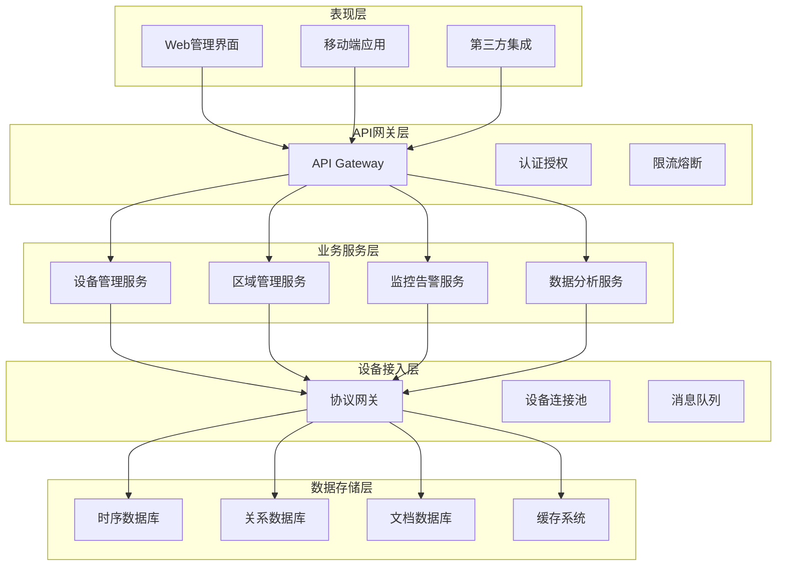

# 📚 IOT设备管理最佳实践集成指南

**文档版本**: v1.0.0
**创建日期**: 2025-11-16
**最后更新**: 2025-11-16
**维护者**: SmartAdmin Team**
**参考标准**: IOT行业标准、企业最佳实践、IOE-DREAM项目规范

---

## 📋 概述

本文档基于IOT行业最佳实践，结合IOE-DREAM项目的具体需求和架构规范，提供设备管理功能的实施指南和最佳实践建议。旨在帮助开发团队构建符合企业级标准的IOT设备管理平台。

### 🎯 设计目标

- **标准化**: 遵循IOT行业标准和规范
- **可扩展**: 支持未来业务发展和技术演进
- **安全性**: 确保设备和数据安全
- **可靠性**: 保证系统高可用和数据一致性
- **易维护**: 降低运维成本和复杂度

---

## 🏗️ 架构设计最佳实践

### 📐 参考架构模式

#### 1. 分层架构模式



**架构原则**:
- **单一职责**: 每个层只负责特定功能
- **依赖倒置**: 高层模块不依赖低层模块
- **接口隔离**: 客户端不应依赖不需要的接口
- **开闭原则**: 对扩展开放，对修改关闭

#### 2. 微服务拆分最佳实践

```java
/**
 * 微服务拆分原则
 */
public class MicroservicesDesignPrinciples {

    /**
     * 1. 业务域驱动拆分
     * 基于业务能力和限界上下文进行服务拆分
     */
    public static final class BusinessDomainDriven {
        // 设备管理域 - 设备生命周期管理
        // 设备连接域 - 设备连接和通信
        // 数据采集域 - 设备数据采集和处理
        // 监控告警域 - 设备监控和告警
        // 权限管理域 - 基于区域的权限控制
        // 分析服务域 - 设备数据分析和报表
    }

    /**
     * 2. 数据隔离原则
     * 每个服务拥有独立的数据库
     * 通过API进行跨服务数据访问
     */
    @Data
    public static class DataIsolation {
        private String serviceName;        // 服务名称
        private String databaseName;       // 独立数据库名称
        private List<String> apiEndpoints;  // 对外提供的API端点
        private boolean shareReadModel;    // 是否共享读模型
    }

    /**
     * 3. 服务自治性
     * 服务可以独立开发、测试、部署和扩展
     */
    @Data
    public static class ServiceAutonomy {
        private String version;             // 服务版本
        private String team;                // 负责团队
        private String deploymentEnv;       // 部署环境
        private List<String> dependencies;  // 依赖的其他服务
    }
}
```

### 🔧 技术选型最佳实践

#### 1. 后端技术栈

```yaml
# 技术栈选择标准
backend_tech_stack:
  framework: "Spring Boot 3.x"
    reason: "企业级成熟度、丰富的生态、项目已有技术栈"

  database:
    primary: "MySQL 8.0"
      reason: "ACID事务支持、项目已有技术栈"
    time_series: "InfluxDB"
      reason: "IOT时序数据优化、高性能写入"
    cache: "Redis 7.0"
      reason: "高性能缓存、丰富的数据结构"
    document: "MongoDB"
      reason: "灵活的文档存储、适合日志和配置"

  messaging:
    main: "RabbitMQ"
      reason: "可靠消息传递、企业级特性"
    streaming: "Apache Kafka"
      reason: "高吞吐量流处理、IOT数据管道"
    real_time: "Redis Pub/Sub"
      reason: "超低延迟实时通知"

  protocol:
    mqtt: "EMQX/Eclipse Mosquitto"
      reason: "IOT设备标准协议、轻量级"
    http: "Spring WebFlux"
      reason: "响应式编程、高并发"
    tcp: "Netty"
      reason: "高性能网络编程、协议定制"
```

#### 2. 前端技术栈

```yaml
frontend_tech_stack:
  framework: "Vue 3"
    reason: "项目已有技术栈、响应式编程"

  state_management: "Pinia"
    reason: "Vue 3官方推荐、TypeScript支持"

  ui_library: "Ant Design Vue 4.x"
    reason: "企业级UI组件、项目已有技术栈"

  build_tool: "Vite 5"
    reason: "快速构建、现代化工具链"

  real_time: "WebSocket + Socket.IO"
    reason: "设备状态实时推送"
```

---

## 🔐 安全最佳实践

### 🛡️ 多层安全防护体系

#### 1. 设备接入安全

```java
/**
 * 设备安全接入最佳实践
 */
@Component
@Slf4j
public class DeviceSecurityBestPractices {

    /**
     * 设备认证机制
     */
    public enum AuthenticationMethod {
        CERTIFICATE("X.509证书认证", "最高安全性"),
        TOKEN("JWT令牌认证", "较高安全性"),
        API_KEY("API密钥认证", "中等安全性"),
        BASIC_AUTH("基础认证", "最低安全性");
    }

    /**
     * 设备认证服务
     */
    @Service
    public class DeviceAuthenticationService {

        @Resource
        private CertificateService certificateService;

        @Resource
        private TokenService tokenService;

        /**
         * 多因素设备认证
         */
        public AuthenticationResult authenticateDevice(DeviceAuthRequest request) {
            try {
                // 1. 设备身份验证
                DeviceIdentity identity = verifyDeviceIdentity(request);
                if (identity == null) {
                    return AuthenticationResult.failed("设备身份验证失败");
                }

                // 2. 设备凭证验证
                CredentialValidationResult credentialResult = validateCredentials(request);
                if (!credentialResult.isValid()) {
                    return AuthenticationResult.failed("设备凭证验证失败");
                }

                // 3. 设备状态检查
                DeviceStatusCheckResult statusResult = checkDeviceStatus(identity.getDeviceId());
                if (!statusResult.isAllowed()) {
                    return AuthenticationResult.failed("设备状态不允许接入");
                }

                // 4. 生成访问令牌
                String accessToken = generateDeviceToken(identity);

                // 5. 记录认证日志
                logAuthenticationEvent(identity, request);

                return AuthenticationResult.success(accessToken);

            } catch (Exception e) {
                log.error("设备认证异常", e);
                return AuthenticationResult.failed("认证过程异常");
            }
        }

        /**
         * 设备证书验证
         */
        private CredentialValidationResult validateDeviceCertificate(String deviceId, String certificatePem) {
            try {
                // 1. 解析证书
                X509Certificate certificate = CertificateUtils.parseCertificate(certificatePem);

                // 2. 验证证书链
                if (!certificateService.verifyCertificateChain(certificate)) {
                    return CredentialValidationResult.failed("证书链验证失败");
                }

                // 3. 验证证书有效期
                if (certificate.getNotAfter().before(new Date())) {
                    return CredentialValidationResult.failed("证书已过期");
                }

                // 4. 验证证书吊销状态
                if (certificateService.isCertificateRevoked(certificate)) {
                    return CredentialValidationResult.failed("证书已被吊销");
                }

                // 5. 验证设备绑定关系
                if (!certificateService.isDeviceCertificateBound(deviceId, certificate)) {
                    return CredentialValidationResult.failed("证书与设备未绑定");
                }

                return CredentialValidationResult.success();

            } catch (Exception e) {
                log.error("设备证书验证失败: deviceId={}", deviceId, e);
                return CredentialValidationResult.failed("证书验证异常");
            }
        }
    }
}
```

#### 2. 通信安全

```java
/**
 * 通信安全最佳实践
 */
@Component
@Slf4j
public class CommunicationSecurityBestPractices {

    /**
     * TLS/SSL配置
     */
    @Configuration
    public static class SslConfiguration {

        /**
         * SSL上下文配置
         */
        @Bean
        public SslContext sslContext() throws Exception {
            // 1. 加载密钥库
            KeyStore keyStore = KeyStore.getInstance("PKCS12");
            try (InputStream keyStoreStream = getResourceAsStream("classpath:keystore.p12")) {
                keyStore.load(keyStoreStream, "changeit".toCharArray());
            }

            // 2. 加载信任库
            KeyStore trustStore = KeyStore.getInstance("JKS");
            try (InputStream trustStoreStream = getResourceAsStream("classpath:truststore.jks")) {
                trustStore.load(trustStoreStream, "changeit".toCharArray());
            }

            // 3. 创建SSL上下文
            SSLContext sslContext = SSLContextBuilder.create()
                    .keyManagerFactory(KeyManagerFactory.getInstance(KeyManagerFactory.getDefaultAlgorithm()))
                    .trustManagerFactory(TrustManagerFactory.getInstance(TrustManagerFactory.getDefaultAlgorithm()))
                    .keyStore(keyStore, "changeit".toCharArray())
                    .trustStore(trustStore)
                    .build();

            return sslContext;
        }
    }

    /**
     * 数据加密服务
     */
    @Service
    public class DataEncryptionService {

        @Value("${device.encryption.algorithm:AES_256_GCM}")
        private String encryptionAlgorithm;

        @Resource
        private CryptoUtils cryptoUtils;

        /**
         * 设备数据加密
         */
        public String encryptDeviceData(String deviceId, String plainData) {
            try {
                // 1. 生成设备专属密钥
                String deviceSecret = generateDeviceSecret(deviceId);

                // 2. 加密数据
                String encryptedData = cryptoUtils.encrypt(plainData, deviceSecret, encryptionAlgorithm);

                // 3. 添加加密元数据
                return addEncryptionMetadata(deviceId, encryptedData);

            } catch (Exception e) {
                log.error("设备数据加密失败: deviceId={}", deviceId, e);
                throw new EncryptionException("数据加密失败", e);
            }
        }

        /**
         * 设备数据解密
         */
        public String decryptDeviceData(String deviceId, String encryptedData) {
            try {
                // 1. 提取加密元数据
                String dataWithoutMetadata = removeEncryptionMetadata(encryptedData);

                // 2. 生成设备专属密钥
                String deviceSecret = generateDeviceSecret(deviceId);

                // 3. 解密数据
                return cryptoUtils.decrypt(dataWithoutMetadata, deviceSecret, encryptionAlgorithm);

            } catch (Exception e) {
                log.error("设备数据解密失败: deviceId={}", deviceId, e);
                throw new DecryptionException("数据解密失败", e);
            }
        }
    }
}
```

### 🔑 权限管理最佳实践

#### 1. 基于区域的权限模型

```java
/**
 * 基于区域的设备权限管理
 */
@Service
@Slf4j
public class AreaBasedPermissionManager {

    /**
     * 权限模型
     */
    @Data
    @Builder
    public static class PermissionModel {
        private Long userId;
        private Long areaId;                    // 直接授权区域
        private Set<Long> inheritedAreaIds;      // 继承区域权限
        private String permissionType;          // 权限类型
        private Set<String> allowedOperations;  // 允许的操作
        private Set<Long> allowedDeviceIds;    // 允许的设备ID
        private LocalDateTime effectiveTime;     // 生效时间
        private LocalDateTime expireTime;        // 过期时间
    }

    /**
     * 计算用户区域权限
     */
    public PermissionModel calculateUserAreaPermissions(Long userId) {
        try {
            // 1. 获取用户直接授权的区域
            Set<Long> directAreas = getUserDirectAreas(userId);

            // 2. 计算继承的区域权限
            Set<Long> inheritedAreas = calculateInheritedAreas(directAreas);

            // 3. 合并区域权限
            Set<Long> allAreas = new HashSet<>();
            allAreas.addAll(directAreas);
            allAreas.addAll(inheritedAreas);

            // 4. 构建权限模型
            return PermissionModel.builder()
                    .userId(userId)
                    .areaId(directAreas.stream().findFirst().orElse(null))
                    .inheritedAreaIds(inheritedAreas)
                    .allowedOperations(calculateAllowedOperations(userId, allAreas))
                    .effectiveTime(LocalDateTime.now())
                    .build();

        } catch (Exception e) {
            log.error("计算用户区域权限失败: userId={}", userId, e);
            return PermissionModel.empty();
        }
    }

    /**
     * 检查设备访问权限
     */
    public boolean hasDeviceAccessPermission(Long userId, Long deviceId, String operation) {
        try {
            // 1. 获取设备所属区域
            Long deviceAreaId = getDeviceAreaId(deviceId);
            if (deviceAreaId == null) {
                return false; // 设备未绑定区域，拒绝访问
            }

            // 2. 获取用户区域权限
            PermissionModel permissionModel = getUserAreaPermissions(userId);

            // 3. 检查区域权限
            if (!hasAreaPermission(permissionModel, deviceAreaId, operation)) {
                return false;
            }

            // 4. 检查设备级权限
            return hasDeviceLevelPermission(permissionModel, deviceId, operation);

        } catch (Exception e) {
            log.error("检查设备访问权限失败: userId={}, deviceId={}, operation={}", userId, deviceId, operation, e);
            return false;
        }
    }

    /**
     * 权限继承算法
     */
    private Set<Long> calculateInheritedAreas(Set<Long> directAreas) {
        Set<Long> inheritedAreas = new HashSet<>();

        for (Long areaId : directAreas) {
            // 获取所有父区域
            List<Long> parentAreas = getAreaHierarchy().getParentAreas(areaId);
            inheritedAreas.addAll(parentAreas);

            // 获取所有子区域
            List<Long> childAreas = getAreaHierarchy().getChildAreas(areaId);
            inheritedAreas.addAll(childAreas);
        }

        return inheritedAreas;
    }
}
```

---

## 📊 数据管理最佳实践

### 🗄️ 多数据库架构

#### 1. 数据存储策略

```java
/**
 * 数据存储策略
 */
@Component
@Slf4j
public class DataStorageStrategy {

    /**
     * 数据类型分类
     */
    public enum DataType {
        DEVICE_METADATA("设备元数据", StorageType.RELATIONAL, "MySQL"),
        TIME_SERIES_METRICS("时序指标数据", StorageType.TIME_SERIES, "InfluxDB"),
        EVENT_LOGS("事件日志", StorageType.DOCUMENT, "MongoDB"),
        CONFIGURATION("配置数据", StorageType.RELATIONAL, "MySQL"),
        CACHE_DATA("缓存数据", StorageType.CACHE, "Redis"),
        ARCHIVE_DATA("归档数据", StorageType.OBJECT_STORAGE, "MinIO");
    }

    /**
     * 数据路由服务
     */
    @Service
    public class DataRoutingService {

        @Resource
        private Map<DataType, DataStorageService> storageServices;

        /**
         * 智能数据路由
         */
        public CompletableFuture<Void> routeData(DeviceData data) {
            return CompletableFuture.runAsync(() -> {
                try {
                    DataType dataType = classifyData(data);
                    DataStorageService storageService = storageServices.get(dataType);

                    if (storageService != null) {
                        storageService.store(data);
                    } else {
                        log.warn("未找到数据类型对应的存储服务: dataType={}", dataType);
                    }

                } catch (Exception e) {
                    log.error("数据路由失败: dataId={}", data.getDataId(), e);
                }
            });
        }

        /**
         * 数据分类逻辑
         */
        private DataType classifyData(DeviceData data) {
            // 1. 根据数据类型分类
            if (isTimeSeriesData(data)) {
                return DataType.TIME_SERIES_METRICS;
            }

            // 2. 根据数据大小分类
            if (isLargeData(data)) {
                return DataType.ARCHIVE_DATA;
            }

            // 3. 根据访问频率分类
            if (isFrequentlyAccessed(data)) {
                return DataType.CACHE_DATA;
            }

            // 4. 默认分类
            return DataType.DEVICE_METADATA;
        }
    }

    /**
     * 数据生命周期管理
     */
    @Scheduled(cron = "0 0 2 * * ?") // 每天凌晨2点执行
    public void manageDataLifecycle() {
        try {
            log.info("开始数据生命周期管理");

            // 1. 数据老化检查
            List<AgingDataItem> agingData = identifyAgingData();
            for (AgingDataItem item : agingData) {
                handleAgingData(item);
            }

            // 2. 数据压缩
            compressOlderData();

            // 3. 数据归档
            archiveOldData();

            // 4. 数据清理
            cleanupExpiredData();

            log.info("数据生命周期管理完成");

        } catch (Exception e) {
            log.error("数据生命周期管理失败", e);
        }
    }
}
```

#### 2. 数据一致性保证

```java
/**
 * 数据一致性保证
 */
@Service
@Transactional
@Slf4j
public class DataConsistencyManager {

    /**
     * 分布式事务管理
     */
    @Service
    public class DistributedTransactionManager {

        @Resource
        private TransactionTemplate transactionTemplate;

        @Resource
        private RedisTemplate<String, Object> redisTemplate;

        /**
         * 设备区域绑定分布式事务
         */
        public void bindDeviceToAreaTransaction(Long deviceId, Long areaId) {
            try {
                // 1. 开始分布式事务
                String transactionId = generateTransactionId();

                // 2. 记录事务开始
                recordTransactionStart(transactionId);

                try {
                    // 3. 执行本地事务
                    transactionTemplate.execute(status -> {
                        // 绑定设备到区域
                        bindDeviceToArea(deviceId, areaId);
                        return null;
                    });

                    // 4. 提交事务
                    commitTransaction(transactionId);

                } catch (Exception e) {
                    // 5. 回滚事务
                    rollbackTransaction(transactionId);
                    throw e;
                }

            } catch (Exception e) {
                log.error("设备区域绑定分布式事务失败: deviceId={}, areaId={}", deviceId, areaId, e);
                throw new BusinessException("事务执行失败", e);
            }
        }

        /**
         * 数据同步验证
         */
        @Scheduled(fixedRate = 300000) // 每5分钟执行
        public void validateDataConsistency() {
            try {
                // 1. 验证设备-区域关联一致性
                validateDeviceAreaConsistency();

                // 2. 验证权限数据一致性
                validatePermissionConsistency();

                // 3. 验证统计数据一致性
                validateStatisticsConsistency();

            } catch (Exception e) {
                log.error("数据一致性验证失败", e);
            }
        }

        /**
         * 数据修复机制
         */
        public void repairDataInconsistency(DataInconsistency inconsistency) {
            try {
                log.info("开始修复数据不一致: type={}, id={}", inconsistency.getType(), inconsistency.getEntityId());

                switch (inconsistency.getType()) {
                    case DEVICE_AREA_MISMATCH:
                        repairDeviceAreaMismatch(inconsistency);
                        break;
                    case PERMISSION_VIOLATION:
                        repairPermissionViolation(inconsistency);
                        break;
                    case STATISTICS_ERROR:
                        repairStatisticsError(inconsistency);
                        break;
                    default:
                        log.warn("未知的数据不一致类型: {}", inconsistency.getType());
                }

                log.info("数据不一致修复完成: type={}, id={}", inconsistency.getType(), inconsistency.getEntityId());

            } catch (Exception e) {
                log.error("数据不一致修复失败: type={}, id={}", inconsistency.getType(), inconsistency.getEntityId(), e);
            }
        }
    }
}
```

---

## 🚀 性能优化最佳实践

### ⚡ 高并发处理

#### 1. 连接池管理

```java
/**
 * 连接池最佳实践
 */
@Configuration
@Slf4j
public class ConnectionPoolConfiguration {

    /**
     * 设备连接池配置
     */
    @Bean
    public DeviceConnectionPool deviceConnectionPool() {
        DeviceConnectionPoolConfig config = DeviceConnectionPoolConfig.builder()
                .maxTotalConnections(1000)           // 最大连接数
                .maxIdleConnections(200)             // 最大空闲连接数
                .minIdleConnections(50)              // 最小空闲连接数
                .connectionTimeout(30000)           // 连接超时时间(ms)
                .idleTimeout(60000)                 // 空闲超时时间(ms)
                .maxWaitTime(10000)                 // 最大等待时间(ms)
                .testOnBorrow(true)                 // 借用时验证连接
                .testOnReturn(false)                // 归还时不验证连接
                .testWhileIdle(true)               // 空闲时验证连接
                .validationQuery("SELECT 1")      // 验证查询
                .build();

        return new DeviceConnectionPool(config);
    }

    /**
     * 数据库连接池配置
     */
    @Bean
    @ConfigurationProperties(prefix = "spring.datasource.hikari")
    public HikariConfig dataSourceConfig() {
        return HikariConfig.builder()
                .maximumPoolSize(50)              // 最大连接池大小
                .minimumIdle(10)                  // 最小空闲连接数
                .idleTimeout(60000)               // 空闲超时时间
                .connectionTimeout(30000)         // 连接超时时间
                .maxLifetime(1800000)             // 连接最大生命周期
                .leakDetectionThreshold(60000)     // 连接泄漏检测阈值
                .validationTimeout(5000)          // 验证超时时间
                .build();
    }

    /**
     * Redis连接池配置
     */
    @Bean
    @ConfigurationProperties(prefix = "spring.redis")
    public JedisPoolConfig jedisPoolConfig() {
        return JedisPoolConfig.builder()
                .maxTotal(200)                    // 最大连接数
                .maxIdle(50)                      // 最大空闲连接数
                .minIdle(10)                      // 最小空闲连接数
                .maxWaitMillis(5000)               // 最大等待时间
                .testOnBorrow(true)               // 借用时验证
                .testOnReturn(false)              // 归还时不验证
                .testWhileIdle(true)             // 空闲时验证
                .build();
    }
}
```

#### 2. 缓存策略

```java
/**
 * 多级缓存策略
 */
@Service
@Slf4j
public class MultiLevelCacheManager {

    @Resource
    private CacheManager caffeineCacheManager;

    @Resource
    private RedisTemplate<String, Object> redisTemplate;

    /**
     * 缓存策略枚举
     */
    public enum CacheStrategy {
        L1_ONLY("仅L1缓存", "高访问频率，低更新频率"),
        L2_ONLY("仅L2缓存", "中等访问频率"),
        L1_L2("L1+L2缓存", "高访问频率，需要一致性保证"),
        WRITE_BACK("写回缓存", "写操作性能要求高");
    }

    /**
     * 缓存操作
     */
    @Component
    public static class CacheOperations {

        /**
         * 获取缓存数据
         */
        public <T> T get(String key, Class<T> type, CacheStrategy strategy) {
            try {
                switch (strategy) {
                    case L1_ONLY:
                        return getFromL1Cache(key, type);
                    case L2_ONLY:
                        return getFromL2Cache(key, type);
                    case L1_L2:
                        return getFromL1L2Cache(key, type);
                    case WRITE_BACK:
                        return getFromWriteBackCache(key, type);
                    default:
                        return null;
                }
            } catch (Exception e) {
                log.error("缓存获取失败: key={}", key, e);
                return null;
            }
        }

        /**
         * 设置缓存数据
         */
        public <T> void put(String key, T value, CacheStrategy strategy, Duration ttl) {
            try {
                switch (strategy) {
                    case L1_ONLY:
                        putToL1Cache(key, value, ttl);
                        break;
                    case L2_ONLY:
                        putToL2Cache(key, value, ttl);
                        break;
                    case L1_L2:
                        putToL1L2Cache(key, value, ttl);
                        break;
                    case WRITE_BACK:
                        putToWriteBackCache(key, value, ttl);
                        break;
                }
            } catch (Exception e) {
                log.error("缓存设置失败: key={}", key, e);
            }
        }

        /**
         * L1+L2缓存实现
         */
        private <T> T getFromL1L2Cache(String key, Class<T> type) {
            // 1. 先从L1缓存获取
            T value = getFromL1Cache(key, type);
            if (value != null) {
                return value;
            }

            // 2. 从L2缓存获取
            value = getFromL2Cache(key, type);
            if (value != null) {
                // 3. 写入L1缓存
                putToL1Cache(key, value, Duration.ofMinutes(10));
                return value;
            }

            return null;
        }

        /**
         * 写回缓存实现
         */
        private <T> void putToWriteBackCache(String key, T value, Duration ttl) {
            // 1. 立即写入L1缓存
            putToL1Cache(key, value, Duration.ofMinutes(5));

            // 2. 异步写入L2缓存
            CompletableFuture.runAsync(() -> {
                try {
                    putToL2Cache(key, value, ttl);
                } catch (Exception e) {
                    log.error("写回缓存L2写入失败: key={}", key, e);
                }
            });
        }
    }
}
```

---

## 📊 监控和运维最佳实践

### 📈 监控体系建设

#### 1. 关键指标监控

```java
/**
 * 设备监控指标
 */
@Component
@Slf4j
public class DeviceMonitoringMetrics {

    @Resource
    private MeterRegistry meterRegistry;

    // 设备连接指标
    private final Counter deviceConnectionCounter;
    private final Gauge deviceConnectionGauge;

    // 数据处理指标
    private final Counter dataProcessingCounter;
    private final Timer dataProcessingTimer;

    // 系统性能指标
    private final Gauge memoryUsageGauge;
    private final Gauge cpuUsageGauge;

    public DeviceMonitoringMetrics(MeterRegistry meterRegistry) {
        this.meterRegistry = meterRegistry;

        // 设备连接指标
        this.deviceConnectionCounter = Counter.builder("device.connections.total")
                .description("设备连接总数")
                .tag("protocol", "unknown")
                .register(meterRegistry);

        this.deviceConnectionGauge = Gauge.builder("device.connections.active")
                .description("活跃设备连接数")
                .register(meterRegistry);

        // 数据处理指标
        this.dataProcessingCounter = Counter.builder("data.processing.total")
                .description("数据处理总数")
                .tag("type", "unknown")
                .register(meterRegistry);

        this.dataProcessingTimer = Timer.builder("data.processing.duration")
                .description("数据处理耗时")
                .tag("type", "unknown")
                .register(meterRegistry);

        // 系统性能指标
        this.memoryUsageGauge = Gauge.builder("system.memory.usage")
                .description("系统内存使用率")
                .register(meterRegistry);

        this.cpuUsageGauge = Gauge.builder("system.cpu.usage")
                .description("系统CPU使用率")
                .register(meterRegistry);
    }

    /**
     * 记录设备连接事件
     */
    public void recordDeviceConnection(String protocol, String action) {
        deviceConnectionCounter.increment(
            Tags.of("protocol", protocol, "action", action)
        );

        // 更新活跃连接数
        if ("connect".equals(action)) {
            updateActiveDeviceCount(1);
        } else if ("disconnect".equals(action)) {
            updateActiveDeviceCount(-1);
        }
    }

    /**
     * 记录数据处理指标
     */
    public void recordDataProcessing(String dataType, long durationMs) {
        dataProcessingCounter.increment(
            Tags.of("type", dataType)
        );

        dataProcessingTimer.record(durationMs, TimeUnit.MILLISECONDS,
            Tags.of("type", dataType));
    }

    /**
     * 更新系统性能指标
     */
    @Scheduled(fixedRate = 30000) // 每30秒更新
    public void updateSystemMetrics() {
        try {
            // 更新内存使用率
            MemoryMXBean memoryBean = ManagementFactory.getMemoryMXBean();
            long usedMemory = memoryBean.getUsedMemory();
            long maxMemory = memoryBean.getMaxMemory();
            double memoryUsagePercent = (double) usedMemory / maxMemory * 100;
            memoryUsageGauge.set(memoryUsagePercent);

            // 更新CPU使用率
            OperatingSystemMXBean osBean = ManagementFactory.getOperatingSystemMXBean();
            double cpuUsagePercent = osBean.getSystemLoadAverage();
            cpuUsageGauge.set(cpuUsagePercent);

        } catch (Exception e) {
            log.error("更新系统指标失败", e);
        }
    }
}
```

#### 2. 告警策略

```java
/**
 * 智能告警系统
 */
@Service
@Slf4j
public class IntelligentAlertSystem {

    @Resource
    private AlertRuleEngine ruleEngine;

    @Resource
    private NotificationService notificationService;

    /**
     * 告警规则引擎
     */
    @Component
    public static class AlertRuleEngine {

        /**
         * 告警规则定义
         */
        @Data
        @Builder
        public static class AlertRule {
            private String ruleId;
            private String ruleName;
            private AlertSeverity severity;
            private String metricName;
            private String condition;
            private double threshold;
            private Duration evaluationWindow;
            private Duration cooldownPeriod;
            private List<String> notificationChannels;
            private boolean enabled;
        }

        /**
         * 规则评估
         */
        public AlertEvaluationResult evaluateRule(AlertRule rule, MetricValue metricValue) {
            try {
                // 1. 解析条件表达式
                ConditionExpression condition = parseCondition(rule.getCondition());

                // 2. 评估条件
                boolean conditionMet = condition.evaluate(metricValue.getValue());

                // 3. 检查阈值
                boolean thresholdExceeded = metricValue.getValue() > rule.getThreshold();

                // 4. 生成评估结果
                boolean shouldAlert = conditionMet && thresholdExceeded;

                return AlertEvaluationResult.builder()
                        .ruleId(rule.getRuleId())
                        .shouldAlert(shouldAlert)
                        .metricValue(metricValue.getValue())
                        .threshold(rule.getThreshold())
                        .conditionMet(conditionMet)
                        .evaluationTime(Instant.now())
                        .build();

            } catch (Exception e) {
                log.error("规则评估失败: ruleId={}", rule.getRuleId(), e);
                return AlertEvaluationResult.error("规则评估异常");
            }
        }
    }

    /**
     * 告警通知服务
     */
    @Service
    public static class NotificationService {

        @Resource
        private List<NotificationChannel> notificationChannels;

        /**
         * 发送告警通知
         */
        public void sendAlert(AlertEvent alert) {
            try {
                List<NotificationChannel> channels = getNotificationChannels(alert.getSeverity());

                for (NotificationChannel channel : channels) {
                    try {
                        channel.send(alert);
                    } catch (Exception e) {
                        log.error("告警通知发送失败: channel={}, alertId={}",
                            channel.getClass().getSimpleName(), alert.getAlertId(), e);
                    }
                }

                // 记录通知日志
                logNotificationHistory(alert, channels);

            } catch (Exception e) {
                log.error("发送告警通知失败: alertId={}", alert.getAlertId(), e);
            }
        }

        /**
         * 告警抑制机制
         */
        @EventListener
        public void handleAlertSuppression(AlertEvent alert) {
            try {
                // 1. 检查告警抑制规则
                if (isAlertSuppressed(alert)) {
                    log.info("告警已被抑制: alertId={}", alert.getAlertId());
                    return;
                }

                // 2. 检查告警冷却期
                if (isInCooldownPeriod(alert)) {
                    log.info("告警处于冷却期: alertId={}", alert.getAlertId());
                    return;
                }

                // 3. 发送告警通知
                sendAlert(alert);

                // 4. 记录告警历史
                recordAlertHistory(alert);

            } catch (Exception e) {
                log.error("告警抑制处理失败: alertId={}", alert.getAlertId(), e);
            }
        }
    }
}
```

---

## 📋 实施指南

### 🎯 分阶段实施策略

#### Phase 1: 基础设施建设 (1-2个月)
- [ ] 搭建基础微服务框架
- [ ] 实现核心设备管理功能
- [ ] 建立基础的监控和日志系统
- [ ] 完善安全和认证机制

#### Phase 2: 高级功能完善 (2-3个月)
- [ ] 实现多协议设备接入
- [ ] 建立设备区域关联管理
- [ ] 完善实时数据处理
- [ ] 实现智能告警系统

#### Phase 3: 智能化优化 (3-4个月)
- [ ] 集成机器学习算法
- [ ] 实现预测性维护
- [ ] 完善自动化运维
- [ ] 优化系统性能

#### Phase 4: 扩展和集成 (4-5个月)
- [ ] 支持第三方系统集成
- [ ] 实现多租户架构
- [ ] 完善API生态
- [ ] 建立运营分析平台

### 🔧 技术实施要点

#### 开发规范遵循
1. **严格遵循repowiki规范**: 使用@Resource依赖注入、四层架构设计
2. **代码质量标准**: 编写完整单元测试、集成测试覆盖率≥80%
3. **文档完整性**: 每个功能模块都有详细的技术文档
4. **安全第一原则**: 所有接口必须进行权限验证和数据加密

#### 性能优化要求
1. **响应时间**: API响应时间<500ms
2. **并发支持**: 支持1000+ TPS
3. **数据处理**: 支持每秒百万级数据点
4. **资源利用率**: CPU使用率<70%，内存使用率<80%

### 📊 质量保障措施

#### 测试策略
1. **单元测试**: 覆盖率≥80%
2. **集成测试**: 覆盖核心业务流程
3. **性能测试**: 支持压力测试和负载测试
4. **安全测试**: 渗透测试和漏洞扫描

#### 监控告警
1. **实时监控**: 系统性能、业务指标、错误率
2. **智能告警**: 基于机器学习的异常检测
3. **根因分析**: 快速定位问题原因
4. **自动恢复**: 故障自动切换和恢复

---

**⚠️ 重要提醒**: 本最佳实践指南基于IOT行业标准和IOE-DREAM项目具体需求制定，在实施过程中需要严格遵循项目的技术架构规范和开发标准。所有技术决策都应基于充分的技术调研和原型验证，确保系统的稳定性、安全性和可维护性。