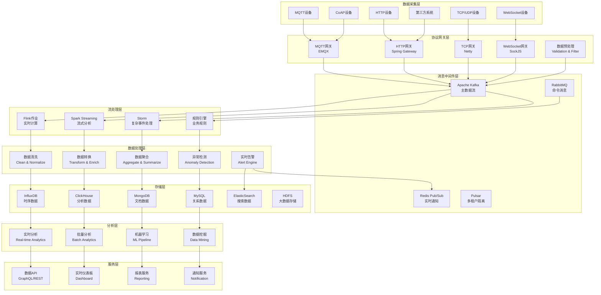
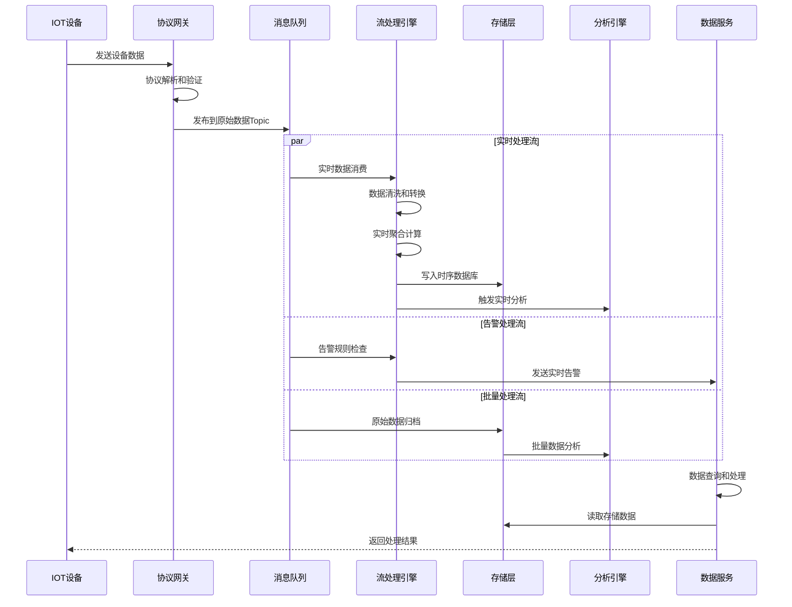

# 📊 IOT设备数据采集和处理架构设计

**文档版本**: v1.0.0
**创建日期**: 2025-11-16
**最后更新**: 2025-11-16
**维护者**: SmartAdmin Team**
**参考标准**: IOT数据处理标准、流处理架构最佳实践

---

## 📋 概述

IOT设备数据采集和处理是企业级IOT平台的核心数据处理层，负责海量设备数据的实时采集、传输、处理、存储和分析。本文档基于IOE-DREAM项目需求，设计了一套高可用、高性能、可扩展的数据处理架构，支持实时流处理、批量分析、机器学习和数据可视化等功能。

### 🎯 设计目标

- **高吞吐量**: 支持每秒百万级数据点处理
- **低延迟**: 实时数据处理延迟<100ms
- **高可靠性**: 数据处理可靠性≥99.99%
- **可扩展性**: 支持水平扩展和弹性伸缩
- **多协议支持**: 支持多种IOT协议和数据格式
- **智能化**: 集成机器学习和AI分析能力

---

## 🏗️ 数据处理架构概览

### 📐 整体架构图



### 🔧 数据流处理架构



---

## 🔌 数据采集层设计

### 📡 多协议数据接入

#### 1. MQTT数据采集

```java
@Component
@Slf4j
public class MqttDataCollector {

    @Resource
    private MqttClientPool mqttClientPool;

    @Resource
    private DataPublisher dataPublisher;

    @Resource
    private MessageValidator messageValidator;

    /**
     * MQTT消息处理器
     */
    @Component
    public static class MqttMessageHandler implements MqttCallback {

        @Resource
        private DataProcessor dataProcessor;

        @Override
        public void messageArrived(String topic, MqttMessage message) {
            try {
                // 1. 解析Topic获取设备信息
                TopicInfo topicInfo = parseTopic(topic);

                // 2. 验证消息格式
                if (!messageValidator.validate(message)) {
                    log.warn("MQTT消息验证失败: topic={}", topic);
                    return;
                }

                // 3. 构建设备数据对象
                DeviceData deviceData = DeviceData.builder()
                        .deviceId(topicInfo.getDeviceId())
                        .timestamp(Instant.now())
                        .protocol("MQTT")
                        .topic(topic)
                        .payload(message.getPayload())
                        .qos(message.getQos())
                        .retained(message.isRetained())
                        .build();

                // 4. 处理设备数据
                dataProcessor.process(deviceData);

            } catch (Exception e) {
                log.error("处理MQTT消息失败: topic={}", topic, e);
            }
        }

        private TopicInfo parseTopic(String topic) {
            // 解析Topic格式: device/{deviceId}/data/{dataType}
            String[] parts = topic.split("/");
            return TopicInfo.builder()
                    .deviceType(parts[0])
                    .deviceId(parts[1])
                    .messageType(parts[2])
                    .dataType(parts.length > 3 ? parts[3] : "default")
                    .build();
        }
    }

    /**
     * 批量MQTT数据处理
     */
    @KafkaListener(topics = "mqtt.raw.data", groupId = "mqtt-data-processor")
    public void processBatchMqttData(List<MqttRawData> rawDataList) {
        try {
            List<DeviceData> deviceDataList = rawDataList.stream()
                    .map(this::convertToDeviceData)
                    .filter(Objects::nonNull)
                    .collect(Collectors.toList());

            if (!deviceDataList.isEmpty()) {
                // 批量发布到数据流
                dataPublisher.publishBatch(deviceDataList);
            }

        } catch (Exception e) {
            log.error("批量处理MQTT数据失败", e);
        }
    }
}
```

#### 2. HTTP数据采集

```java
@RestController
@RequestMapping("/api/v1/data")
@Slf4j
public class HttpDataCollector {

    @Resource
    private DataProcessor dataProcessor;

    @Resource
    private RateLimiter rateLimiter;

    /**
     * 接收设备数据上报
     */
    @PostMapping("/upload")
    @PreAuthorize("hasRole('DEVICE_DATA_UPLOAD')")
    public ResponseDTO<String> uploadDeviceData(
            @RequestHeader("X-Device-ID") String deviceId,
            @RequestHeader("X-Device-Token") String deviceToken,
            @Valid @RequestBody DeviceDataUploadRequest request) {

        try {
            // 1. 验证设备Token
            if (!validateDeviceToken(deviceId, deviceToken)) {
                return ResponseDTO.error(UserErrorCode.UNAUTHORIZED, "设备Token验证失败");
            }

            // 2. 限流检查
            if (!rateLimiter.tryAcquire(deviceId)) {
                return ResponseDTO.error(UserErrorCode.RATE_LIMIT_EXCEEDED, "设备上报频率超限");
            }

            // 3. 构建设备数据对象
            DeviceData deviceData = DeviceData.builder()
                    .deviceId(deviceId)
                    .timestamp(Instant.now())
                    .protocol("HTTP")
                    .dataType(request.getDataType())
                    .payload(request.getPayload())
                    .metadata(request.getMetadata())
                    .build();

            // 4. 异步处理数据
            CompletableFuture.runAsync(() -> dataProcessor.process(deviceData));

            return ResponseDTO.ok("数据上报成功");

        } catch (Exception e) {
            log.error("处理设备数据上报失败: deviceId={}", deviceId, e);
            return ResponseDTO.error(UserErrorCode.SYSTEM_ERROR, "数据处理失败");
        }
    }

    /**
     * 批量数据上报
     */
    @PostMapping("/batch-upload")
    @PreAuthorize("hasRole('DEVICE_DATA_UPLOAD')")
    public ResponseDTO<String> batchUploadDeviceData(
            @RequestHeader("X-Device-ID") String deviceId,
            @RequestHeader("X-Device-Token") String deviceToken,
            @Valid @RequestBody BatchDeviceDataUploadRequest request) {

        try {
            // 1. 验证设备Token和限流
            if (!validateDeviceToken(deviceId, deviceToken)) {
                return ResponseDTO.error(UserErrorCode.UNAUTHORIZED, "设备Token验证失败");
            }

            if (!rateLimiter.tryAcquire(deviceId, request.getDataList().size())) {
                return ResponseDTO.error(UserErrorCode.RATE_LIMIT_EXCEEDED, "批量上报频率超限");
            }

            // 2. 批量转换数据
            List<DeviceData> deviceDataList = request.getDataList().stream()
                    .map(data -> DeviceData.builder()
                            .deviceId(deviceId)
                            .timestamp(Instant.ofEpochMilli(data.getTimestamp()))
                            .protocol("HTTP")
                            .dataType(data.getDataType())
                            .payload(data.getPayload())
                            .metadata(data.getMetadata())
                            .build())
                    .collect(Collectors.toList());

            // 3. 批量处理数据
            dataProcessor.processBatch(deviceDataList);

            return ResponseDTO.ok(String.format("批量数据上报成功，共%d条", deviceDataList.size()));

        } catch (Exception e) {
            log.error("处理批量设备数据上报失败: deviceId={}", deviceId, e);
            return ResponseDTO.error(UserErrorCode.SYSTEM_ERROR, "批量数据处理失败");
        }
    }
}
```

#### 3. TCP/UDP数据采集

```java
@Component
@Slf4j
public class TcpUdpDataCollector {

    @Resource
    private DataProcessor dataProcessor;

    @Resource
    private ConnectionManager connectionManager;

    /**
     * TCP数据处理器
     */
    @Component
    public static class TcpDataHandler extends ChannelInboundHandlerAdapter {

        @Resource
        private DataProcessor dataProcessor;

        private final StringBuilder messageBuffer = new StringBuilder();

        @Override
        public void channelRead(ChannelHandlerContext ctx, Object msg) {
            try {
                ByteBuf byteBuf = (ByteBuf) msg;
                String receivedData = byteBuf.toString(CharsetUtil.UTF_8);

                // 累积消息数据
                messageBuffer.append(receivedData);

                // 检查是否收到完整消息（以换行符分隔）
                int messageEndIndex;
                while ((messageEndIndex = messageBuffer.indexOf("\n")) != -1) {
                    String completeMessage = messageBuffer.substring(0, messageEndIndex);
                    messageBuffer.delete(0, messageEndIndex + 1);

                    // 处理完整消息
                    processTcpMessage(ctx, completeMessage);
                }

            } catch (Exception e) {
                log.error("处理TCP数据失败", e);
                ctx.close();
            }
        }

        private void processTcpMessage(ChannelHandlerContext ctx, String message) {
            try {
                // 1. 解析消息格式
                TcpDeviceMessage deviceMessage = TcpMessageParser.parse(message);

                // 2. 构建设备数据对象
                DeviceData deviceData = DeviceData.builder()
                        .deviceId(deviceMessage.getDeviceId())
                        .timestamp(Instant.now())
                        .protocol("TCP")
                        .dataType(deviceMessage.getDataType())
                        .payload(deviceMessage.getPayload())
                        .connectionId(ctx.channel().id().asShortText())
                        .remoteAddress(ctx.channel().remoteAddress().toString())
                        .build();

                // 3. 异步处理数据
                dataProcessor.process(deviceData);

            } catch (Exception e) {
                log.error("解析TCP消息失败: message={}", message, e);
            }
        }
    }

    /**
     * UDP数据处理器
     */
    @Component
    public static class UdpDataHandler extends SimpleChannelInboundHandler<DatagramPacket> {

        @Resource
        private DataProcessor dataProcessor;

        @Override
        protected void channelRead0(ChannelHandlerContext ctx, DatagramPacket packet) {
            try {
                String receivedData = packet.content().toString(CharsetUtil.UTF_8);
                InetSocketAddress senderAddress = packet.sender();

                // 1. 解析UDP消息
                UdpDeviceMessage deviceMessage = UdpMessageParser.parse(receivedData);

                // 2. 构建设备数据对象
                DeviceData deviceData = DeviceData.builder()
                        .deviceId(deviceMessage.getDeviceId())
                        .timestamp(Instant.now())
                        .protocol("UDP")
                        .dataType(deviceMessage.getDataType())
                        .payload(deviceMessage.getPayload())
                        .remoteAddress(senderAddress.getAddress().getHostAddress())
                        .remotePort(senderAddress.getPort())
                        .build();

                // 3. 处理数据
                dataProcessor.process(deviceData);

            } catch (Exception e) {
                log.error("处理UDP数据失败", e);
            }
        }
    }
}
```

### 🔧 数据预处理和验证

#### 数据验证框架

```java
@Component
@Slf4j
public class DataValidator {

    @Resource
    private List<ValidationRule> validationRules;

    @Resource
    private SchemaRegistry schemaRegistry;

    /**
     * 验证设备数据
     */
    public ValidationResult validate(DeviceData deviceData) {
        try {
            ValidationResult result = ValidationResult.success();

            // 1. 基础格式验证
            ValidationResult basicValidation = validateBasicFormat(deviceData);
            if (!basicValidation.isValid()) {
                result.merge(basicValidation);
            }

            // 2. Schema验证
            ValidationResult schemaValidation = validateSchema(deviceData);
            if (!schemaValidation.isValid()) {
                result.merge(schemaValidation);
            }

            // 3. 业务规则验证
            ValidationResult businessValidation = validateBusinessRules(deviceData);
            if (!businessValidation.isValid()) {
                result.merge(businessValidation);
            }

            // 4. 数据质量检查
            ValidationResult qualityValidation = validateDataQuality(deviceData);
            if (!qualityValidation.isValid()) {
                result.merge(qualityValidation);
            }

            return result;

        } catch (Exception e) {
            log.error("数据验证异常: deviceId={}", deviceData.getDeviceId(), e);
            return ValidationResult.failed("验证过程异常: " + e.getMessage());
        }
    }

    /**
     * Schema验证
     */
    private ValidationResult validateSchema(DeviceData deviceData) {
        try {
            // 1. 获取数据Schema
            DataSchema schema = schemaRegistry.getSchema(deviceData.getDataType());
            if (schema == null) {
                return ValidationResult.failed("未找到数据类型Schema: " + deviceData.getDataType());
            }

            // 2. 解析数据
            Object data = parsePayload(deviceData.getPayload(), schema.getFormat());

            // 3. Schema验证
            return JsonSchemaValidator.validate(data, schema.getSchema());

        } catch (Exception e) {
            return ValidationResult.failed("Schema验证失败: " + e.getMessage());
        }
    }

    /**
     * 业务规则验证
     */
    private ValidationResult validateBusinessRules(DeviceData deviceData) {
        ValidationResult result = ValidationResult.success();

        for (ValidationRule rule : validationRules) {
            if (rule.supports(deviceData.getDataType())) {
                ValidationResult ruleResult = rule.validate(deviceData);
                if (!ruleResult.isValid()) {
                    result.merge(ruleResult);
                }
            }
        }

        return result;
    }
}
```

#### 数据清洗和转换

```java
@Component
@Slf4j
public class DataCleaner {

    @Resource
    private Map<String, DataTransformer> transformers;

    @Resource
    private DataEnrichmentService enrichmentService;

    /**
     * 清洗设备数据
     */
    public CleanedData clean(DeviceData deviceData) {
        try {
            // 1. 数据标准化
            DeviceData normalizedData = normalizeData(deviceData);

            // 2. 数据转换
            DeviceData transformedData = transformData(normalizedData);

            // 3. 数据增强
            DeviceData enrichedData = enrichData(transformedData);

            // 4. 异常值检测和处理
            DeviceData filteredData = filterOutliers(enrichedData);

            return CleanedData.builder()
                    .originalData(deviceData)
                    .cleanedData(filteredData)
                    .transformationLog(getTransformationLog(deviceData, filteredData))
                    .build();

        } catch (Exception e) {
            log.error("数据清洗失败: deviceId={}", deviceData.getDeviceId(), e);
            return CleanedData.failed(deviceData, e.getMessage());
        }
    }

    /**
     * 数据标准化
     */
    private DeviceData normalizeData(DeviceData deviceData) {
        // 1. 时间戳标准化
        Instant normalizedTimestamp = normalizeTimestamp(deviceData.getTimestamp());

        // 2. 数值精度标准化
        Map<String, Object> normalizedPayload = normalizeNumericPrecision(deviceData.getPayload());

        // 3. 字符编码标准化
        String normalizedPayloadStr = normalizeCharacterEncoding(normalizedPayload);

        return deviceData.toBuilder()
                .timestamp(normalizedTimestamp)
                .payload(normalizedPayloadStr)
                .build();
    }

    /**
     * 数据转换
     */
    private DeviceData transformData(DeviceData deviceData) {
        DataTransformer transformer = transformers.get(deviceData.getDataType());
        if (transformer != null) {
            return transformer.transform(deviceData);
        }
        return deviceData;
    }

    /**
     * 数据增强
     */
    private DeviceData enrichData(DeviceData deviceData) {
        try {
            // 1. 添加设备信息
            DeviceInfo deviceInfo = enrichmentService.getDeviceInfo(deviceData.getDeviceId());

            // 2. 添加地理位置信息
            LocationInfo locationInfo = enrichmentService.getLocationInfo(deviceData.getDeviceId());

            // 3. 添加业务上下文信息
            BusinessContext businessContext = enrichmentService.getBusinessContext(deviceData);

            Map<String, Object> enrichedMetadata = new HashMap<>(deviceData.getMetadata());
            enrichedMetadata.put("deviceInfo", deviceInfo);
            enrichedMetadata.put("locationInfo", locationInfo);
            enrichedMetadata.put("businessContext", businessContext);

            return deviceData.toBuilder()
                    .metadata(enrichedMetadata)
                    .build();

        } catch (Exception e) {
            log.warn("数据增强失败，使用原始数据: deviceId={}", deviceData.getDeviceId(), e);
            return deviceData;
        }
    }
}
```

---

## ⚡ 流处理引擎设计

### 🔄 Flink流处理架构

#### 实时数据处理管道

```java
@Component
@Slf4j
public class FlinkDataProcessingPipeline {

    @Resource
    private StreamExecutionEnvironment env;

    @Resource
    private KafkaSource<String> kafkaSource;

    @Resource
    private SinkFunction<ProcessedData> influxDbSink;

    @Resource
    private SinkFunction<AlertEvent> alertSink;

    /**
     * 创建实时数据处理管道
     */
    public void buildPipeline() {
        try {
            // 1. 配置执行环境
            env.setParallelism(4);
            env.enableCheckpointing(60000); // 1分钟检查点
            env.getCheckpointConfig().setCheckpointingMode(CheckpointingMode.EXACTLY_ONCE);

            // 2. 创建数据源
            DataStream<String> rawStream = kafkaSource
                    .setStartingOffsets(OffsetsInitializer.latest())
                    .setBounded(OffsetsInitializer.unbounded())
                    .build();

            // 3. 数据流处理管道
            DataStream<ProcessedData> processedStream = rawStream
                    // 反序列化JSON数据
                    .map(this::deserializeDeviceData)
                    .name("Deserialize-Device-Data")
                    // 数据验证
                    .filter(this::validateDeviceData)
                    .name("Validate-Device-Data")
                    // 数据清洗
                    .map(this::cleanDeviceData)
                    .name("Clean-Device-Data")
                    // 数据转换
                    .map(this::transformDeviceData)
                    .name("Transform-Device-Data")
                    // 异常检测
                    .process(this::detectAnomalies)
                    .name("Detect-Anomalies");

            // 4. 分流处理
            DataStream<ProcessedData> normalDataStream = processedStream
                    .filter(data -> !data.isAnomaly())
                    .name("Filter-Normal-Data");

            DataStream<ProcessedData> anomalyDataStream = processedStream
                    .filter(ProcessedData::isAnomaly)
                    .name("Filter-Anomaly-Data");

            // 5. 正常数据处理
            normalDataStream
                    // 实时聚合
                    .keyBy(ProcessedData::getDeviceId)
                    .window(TumblingProcessingTimeWindows.of(Time.minutes(1)))
                    .aggregate(new DeviceDataAggregator())
                    .name("Aggregate-Normal-Data")
                    // 写入时序数据库
                    .addSink(influxDbSink)
                    .name("Write-To-InfluxDB");

            // 6. 异常数据处理
            anomalyDataStream
                    // 生成告警
                    .map(this::generateAlert)
                    .name("Generate-Alert")
                    // 发送告警
                    .addSink(alertSink)
                    .name("Send-Alert");

            // 7. 执行作业
            env.execute("IOT-Device-Data-Processing-Pipeline");

        } catch (Exception e) {
            log.error("创建Flink数据处理管道失败", e);
            throw new PipelineCreationException("管道创建失败", e);
        }
    }

    /**
     * 设备数据聚合器
     */
    public static class DeviceDataAggregator
            implements AggregateFunction<ProcessedData, DeviceDataAccumulator, ProcessedData> {

        @Override
        public DeviceDataAccumulator createAccumulator() {
            return new DeviceDataAccumulator();
        }

        @Override
        public DeviceDataAccumulator add(ProcessedData data, DeviceDataAccumulator accumulator) {
            accumulator.add(data);
            return accumulator;
        }

        @Override
        public ProcessedData getResult(DeviceDataAccumulator accumulator) {
            return accumulator.buildAggregatedData();
        }

        @Override
        public DeviceDataAccumulator merge(DeviceDataAccumulator a, DeviceDataAccumulator b) {
            return a.merge(b);
        }
    }
}
```

#### 复杂事件处理

```java
@Component
@Slf4j
public class ComplexEventProcessor {

    @Resource
    private CEP cep;

    @Resource
    private PatternFactory patternFactory;

    /**
     * 设备故障检测模式
     */
    public void detectDeviceFailures(DataStream<ProcessedData> dataStream) {
        // 1. 定义故障检测模式
        Pattern<ProcessedData, ?> failurePattern = Pattern.<ProcessedData>begin("first")
                .where(new SimpleCondition<ProcessedData>() {
                    @Override
                    public boolean filter(ProcessedData data) {
                        return data.getMetricValue("error_rate") > 0.1; // 错误率>10%
                    }
                })
                .next("second")
                .where(new SimpleCondition<ProcessedData>() {
                    @Override
                    public boolean filter(ProcessedData data) {
                        return data.getMetricValue("response_time") > 5000; // 响应时间>5s
                    }
                })
                .within(Time.seconds(30)); // 30秒内发生

        // 2. 应用模式检测
        PatternStream<ProcessedData> patternStream = CEP.pattern(dataStream.keyBy(ProcessedData::getDeviceId), failurePattern);

        // 3. 处理匹配的事件
        patternStream.select(new PatternSelectFunction<ProcessedData, DeviceFailureEvent>() {
            @Override
            public DeviceFailureEvent select(Map<String, List<ProcessedData>> pattern) {
                List<ProcessedData> firstEvents = pattern.get("first");
                List<ProcessedData> secondEvents = pattern.get("second");

                return DeviceFailureEvent.builder()
                        .deviceId(firstEvents.get(0).getDeviceId())
                        .firstEventTime(firstEvents.get(0).getTimestamp())
                        .secondEventTime(secondEvents.get(0).getTimestamp())
                        .failureType("PERFORMANCE_DEGRADATION")
                        .severity("HIGH")
                        .description("设备性能显著下降")
                        .build();
            }
        }).addSink(new SinkFunction<DeviceFailureEvent>() {
            @Override
            public void invoke(DeviceFailureEvent event, Context context) {
                handleDeviceFailure(event);
            }
        });
    }

    /**
     * 设备离线检测模式
     */
    public void detectDeviceOffline(DataStream<ProcessedData> dataStream) {
        // 1. 定义离线检测模式（5分钟内没有数据）
        Pattern<ProcessedData, ?> offlinePattern = Pattern.<ProcessedData>begin("offline")
                .where(new SimpleCondition<ProcessedData>() {
                    @Override
                    public boolean filter(ProcessedData data) {
                        return true; // 任何数据都会触发模式
                    }
                })
                .notNext("any")
                .within(Time.minutes(5));

        // 2. 应用模式检测
        PatternStream<ProcessedData> patternStream = CEP.pattern(
            dataStream.keyBy(ProcessedData::getDeviceId), offlinePattern);

        // 3. 处理离线事件
        patternStream.select(new PatternSelectFunction<ProcessedData, DeviceOfflineEvent>() {
            @Override
            public DeviceOfflineEvent select(Map<String, List<ProcessedData>> pattern) {
                List<ProcessedData> offlineEvents = pattern.get("offline");
                ProcessedData lastEvent = offlineEvents.get(0);

                return DeviceOfflineEvent.builder()
                        .deviceId(lastEvent.getDeviceId())
                        .lastSeenTime(lastEvent.getTimestamp())
                        .offlineDuration(Duration.ofMinutes(5))
                        .severity("MEDIUM")
                        .description("设备离线超过5分钟")
                        .build();
            }
        }).addSink(new SinkFunction<DeviceOfflineEvent>() {
            @Override
            public void invoke(DeviceOfflineEvent event, Context context) {
                handleDeviceOffline(event);
            }
        });
    }
}
```

---

## 🗄️ 数据存储架构设计

### 📊 多层数据存储

#### 1. 时序数据库 (InfluxDB)

```java
@Component
@Slf4j
public class TimeSeriesDataStorage {

    @Resource
    private InfluxDBTemplate influxDBTemplate;

    @Value("${influxdb.database:device_metrics}")
    private String database;

    @Value("${influxdb.retention.policy:autogen}")
    private String retentionPolicy;

    /**
     * 写入设备指标数据
     */
    @Async
    public CompletableFuture<Void> writeDeviceMetrics(List<DeviceMetric> metrics) {
        return CompletableFuture.runAsync(() -> {
            try {
                List<Point> points = metrics.stream()
                        .map(this::convertToPoint)
                        .collect(Collectors.toList());

                influxDBTemplate.write(points, database, retentionPolicy);
                log.debug("写入设备指标数据成功，数量: {}", points.size());

            } catch (Exception e) {
                log.error("写入设备指标数据失败", e);
            }
        });
    }

    /**
     * 查询设备指标数据
     */
    public List<DeviceMetric> queryDeviceMetrics(DeviceMetricQuery query) {
        try {
            Query queryBuilder = QueryBuilder
                    .select()
                    .column("value")
                    .from(query.getMeasurement())
                    .where(TagCondition.eq("device_id", query.getDeviceId()))
                    .and(TimeCondition.between(query.getStartTime(), query.getEndTime()));

            // 添加聚合条件
            if (query.getAggregation() != null) {
                queryBuilder = applyAggregation(queryBuilder, query.getAggregation());
            }

            // 添加分组条件
            if (query.getGroupByTags() != null) {
                queryBuilder.groupBy(query.getGroupByTags().toArray(new String[0]));
            }

            QueryResult queryResult = influxDBTemplate.query(queryBuilder.build(), database);
            return convertQueryResult(queryResult);

        } catch (Exception e) {
            log.error("查询设备指标数据失败: query={}", query, e);
            return Collections.emptyList();
        }
    }

    /**
     * 创建连续查询
     */
    public void createContinuousQueries() {
        try {
            // 1. 创建1分钟聚合连续查询
            String cq1Minute = "CREATE CONTINUOUS QUERY \"cq_1m\" ON \"" + database + "\" " +
                    "BEGIN SELECT mean(\"value\") AS \"value_mean\", " +
                    "max(\"value\") AS \"value_max\", " +
                    "min(\"value\") AS \"value_min\", " +
                    "count(\"value\") AS \"value_count\" " +
                    "INTO \"device_metrics_1m\" " +
                    "FROM \"device_metrics\" " +
                    "GROUP BY time(1m), \"device_id\", \"metric_type\" END";

            influxDBTemplate.createContinuousQuery(cq1Minute);

            // 2. 创建1小时聚合连续查询
            String cq1Hour = "CREATE CONTINUOUS QUERY \"cq_1h\" ON \"" + database + "\" " +
                    "BEGIN SELECT mean(\"value\") AS \"value_mean\", " +
                    "max(\"value\") AS \"value_max\", " +
                    "min(\"value\") AS \"value_min\", " +
                    "count(\"value\") AS \"value_count\" " +
                    "INTO \"device_metrics_1h\" " +
                    "FROM \"device_metrics_1m\" " +
                    "GROUP BY time(1h), \"device_id\", \"metric_type\" END";

            influxDBTemplate.createContinuousQuery(cq1Hour);

            // 3. 创建1天聚合连续查询
            String cq1Day = "CREATE CONTINUOUS QUERY \"cq_1d\" ON \"" + database + "\" " +
                    "BEGIN SELECT mean(\"value\") AS \"value_mean\", " +
                    "max(\"value\") AS \"value_max\", " +
                    "min(\"value\") AS \"value_min\", " +
                    "count(\"value\") AS \"value_count\" " +
                    "INTO \"device_metrics_1d\" " +
                    "FROM \"device_metrics_1h\" " +
                    "GROUP BY time(1d), \"device_id\", \"metric_type\" END";

            influxDBTemplate.createContinuousQuery(cq1Day);

            log.info("创建连续查询成功");

        } catch (Exception e) {
            log.error("创建连续查询失败", e);
        }
    }

    /**
     * 转换为InfluxDB Point
     */
    private Point convertToPoint(DeviceMetric metric) {
        Point.Builder builder = Point.measurement(metric.getMeasurement())
                .time(metric.getTimestamp().toEpochMilli(), TimeUnit.MILLISECONDS)
                .tag("device_id", metric.getDeviceId())
                .tag("device_type", metric.getDeviceType())
                .tag("metric_type", metric.getMetricType())
                .tag("location", metric.getLocation())
                .addField("value", metric.getValue());

        // 添加额外标签
        if (metric.getAdditionalTags() != null) {
            metric.getAdditionalTags().forEach(builder::tag);
        }

        // 添加额外字段
        if (metric.getAdditionalFields() != null) {
            metric.getAdditionalFields().forEach(builder::addField);
        }

        return builder.build();
    }
}
```

#### 2. 分析数据库 (ClickHouse)

```java
@Component
@Slf4j
public class AnalyticalDataStorage {

    @Resource
    private JdbcTemplate clickHouseTemplate;

    /**
     * 批量写入分析数据
     */
    @Async
    public CompletableFuture<Void> batchInsertAnalyticalData(List<AnalyticalData> dataList) {
        return CompletableFuture.runAsync(() -> {
            try {
                String sql = buildInsertSQL();
                clickHouseTemplate.batchUpdate(sql, dataList, this::prepareStatement);
                log.debug("批量写入分析数据成功，数量: {}", dataList.size());

            } catch (Exception e) {
                log.error("批量写入分析数据失败", e);
            }
        });
    }

    /**
     * 构建插入SQL
     */
    private String buildInsertSQL() {
        return "INSERT INTO device_analytical_data (" +
                "device_id, device_type, timestamp, metric_type, value, " +
                "metadata, created_at) VALUES (?, ?, ?, ?, ?, ?, ?)";
    }

    /**
     * 准备语句参数
     */
    private void prepareStatement(PreparedStatement ps, AnalyticalData data) throws SQLException {
        ps.setString(1, data.getDeviceId());
        ps.setString(2, data.getDeviceType());
        ps.setTimestamp(3, Timestamp.from(data.getTimestamp()));
        ps.setString(4, data.getMetricType());
        ps.setDouble(5, data.getValue());
        ps.setString(6, data.getMetadataJson());
        ps.setTimestamp(7, Timestamp.from(Instant.now()));
    }

    /**
     * 创建分析数据表
     */
    public void createAnalyticalTables() {
        try {
            // 1. 设备分析数据表
            String createDeviceAnalyticalTable = "CREATE TABLE IF NOT EXISTS device_analytical_data (" +
                    "device_id String," +
                    "device_type String," +
                    "timestamp DateTime," +
                    "metric_type String," +
                    "value Float64," +
                    "metadata String," +
                    "created_at DateTime DEFAULT now()" +
                    ") ENGINE = MergeTree() " +
                    "PARTITION BY toYYYYMM(timestamp) " +
                    "ORDER BY (device_id, timestamp, metric_type) " +
                    "TTL timestamp + INTERVAL 1 YEAR";

            clickHouseTemplate.execute(createDeviceAnalyticalTable);

            // 2. 设备统计数据表
            String createDeviceStatsTable = "CREATE TABLE IF NOT EXISTS device_stats (" +
                    "device_id String," +
                    "device_type String," +
                    "date Date," +
                    "metric_type String," +
                    "avg_value Float64," +
                    "min_value Float64," +
                    "max_value Float64," +
                    "count_value UInt64," +
                    "updated_at DateTime DEFAULT now()" +
                    ") ENGINE = ReplacingMergeTree() " +
                    "PARTITION BY toYYYYMM(date) " +
                    "ORDER BY (device_id, date, metric_type)";

            clickHouseTemplate.execute(createDeviceStatsTable);

            log.info("创建分析数据表成功");

        } catch (Exception e) {
            log.error("创建分析数据表失败", e);
        }
    }
}
```

#### 3. 文档数据库 (MongoDB)

```java
@Component
@Slf4j
public class DocumentDataStorage {

    @Resource
    private MongoTemplate mongoTemplate;

    /**
     * 存储设备事件日志
     */
    @Async
    public CompletableFuture<Void> saveDeviceEvent(DeviceEventLog eventLog) {
        return CompletableFuture.runAsync(() -> {
            try {
                mongoTemplate.save(eventLog, "device_event_logs");
                log.debug("保存设备事件日志成功: eventId={}", eventLog.getEventId());

            } catch (Exception e) {
                log.error("保存设备事件日志失败: eventId={}", eventLog.getEventId(), e);
            }
        });
    }

    /**
     * 批量存储设备事件日志
     */
    @Async
    public CompletableFuture<Void> batchSaveDeviceEvents(List<DeviceEventLog> eventLogs) {
        return CompletableFuture.runAsync(() -> {
            try {
                mongoTemplate.insertAll(eventLogs, "device_event_logs");
                log.debug("批量保存设备事件日志成功，数量: {}", eventLogs.size());

            } catch (Exception e) {
                log.error("批量保存设备事件日志失败", e);
            }
        });
    }

    /**
     * 查询设备事件日志
     */
    public List<DeviceEventLog> queryDeviceEventLogs(DeviceEventQuery query) {
        try {
            Query mongoQuery = new Query();

            // 设备ID条件
            if (StringUtils.hasText(query.getDeviceId())) {
                mongoQuery.addCriteria(Criteria.where("deviceId").is(query.getDeviceId()));
            }

            // 事件类型条件
            if (StringUtils.hasText(query.getEventType())) {
                mongoQuery.addCriteria(Criteria.where("eventType").is(query.getEventType()));
            }

            // 时间范围条件
            if (query.getStartTime() != null && query.getEndTime() != null) {
                mongoQuery.addCriteria(Criteria.where("eventTime")
                        .gte(query.getStartTime())
                        .lte(query.getEndTime()));
            }

            // 分页条件
            mongoQuery.with(PageRequest.of(query.getPage(), query.getSize()));

            // 排序条件
            mongoQuery.with(Sort.by(Sort.Direction.DESC, "eventTime"));

            return mongoTemplate.find(mongoQuery, DeviceEventLog.class, "device_event_logs");

        } catch (Exception e) {
            log.error("查询设备事件日志失败: query={}", query, e);
            return Collections.emptyList();
        }
    }

    /**
     * 创建索引
     */
    public void createIndexes() {
        try {
            // 1. 设备事件日志索引
            mongoTemplate.indexOps("device_event_logs")
                    .ensureIndex(new Index().on("deviceId", Sort.Direction.ASC)
                            .on("eventTime", Sort.Direction.DESC));

            mongoTemplate.indexOps("device_event_logs")
                    .ensureIndex(new Index().on("eventType", Sort.Direction.ASC)
                            .on("eventTime", Sort.Direction.DESC));

            // 2. TTL索引（事件日志保留30天）
            mongoTemplate.indexOps("device_event_logs")
                    .ensureIndex(new Index().on("eventTime", Sort.Direction.ASC)
                            .expire(30, TimeUnit.DAYS));

            log.info("创建MongoDB索引成功");

        } catch (Exception e) {
            log.error("创建MongoDB索引失败", e);
        }
    }
}
```

---

## 🤖 智能分析和机器学习

### 🧠 机器学习管道

#### 设备异常检测模型

```java
@Component
@Slf4j
public class DeviceAnomalyDetectionService {

    @Resource
    private ModelRepository modelRepository;

    @Resource
    private TrainingDataService trainingDataService;

    @Resource
    private PredictionService predictionService;

    /**
     * 训练异常检测模型
     */
    @Async
    public CompletableFuture<TrainingResult> trainAnomalyDetectionModel(
            String deviceId, String metricType, TrainingConfig config) {

        return CompletableFuture.supplyAsync(() -> {
            try {
                log.info("开始训练异常检测模型: deviceId={}, metricType={}", deviceId, metricType);

                // 1. 获取训练数据
                List<TrainingDataPoint> trainingData = trainingDataService
                        .getTrainingData(deviceId, metricType, config.getTrainingPeriod());

                if (CollectionUtils.isEmpty(trainingData)) {
                    return TrainingResult.failed("训练数据不足");
                }

                // 2. 数据预处理
                List<TrainingDataPoint> processedData = preprocessTrainingData(trainingData);

                // 3. 特征工程
                List<FeatureVector> featureVectors = extractFeatures(processedData);

                // 4. 模型训练
                IsolationForestModel model = trainIsolationForestModel(featureVectors, config);

                // 5. 模型验证
                ValidationResult validationResult = validateModel(model, processedData);

                // 6. 保存模型
                String modelId = saveModel(deviceId, metricType, model, validationResult);

                return TrainingResult.success(modelId, validationResult);

            } catch (Exception e) {
                log.error("训练异常检测模型失败: deviceId={}, metricType={}", deviceId, metricType, e);
                return TrainingResult.failed("模型训练异常: " + e.getMessage());
            }
        });
    }

    /**
     * 实时异常检测
     */
    public CompletableFuture<AnomalyDetectionResult> detectAnomalies(
            String deviceId, String metricType, List<DeviceMetric> recentMetrics) {

        return CompletableFuture.supplyAsync(() -> {
            try {
                // 1. 加载训练好的模型
                AnomalyDetectionModel model = modelRepository.getLatestModel(deviceId, metricType);
                if (model == null) {
                    return AnomalyDetectionResult.failed("未找到训练模型");
                }

                // 2. 数据预处理
                List<FeatureVector> featureVectors = extractFeaturesFromMetrics(recentMetrics);

                // 3. 异常检测
                List<AnomalyScore> anomalyScores = new ArrayList<>();
                for (FeatureVector vector : featureVectors) {
                    double score = model.predict(vector);
                    anomalyScores.add(AnomalyScore.builder()
                            .timestamp(vector.getTimestamp())
                            .score(score)
                            .isAnomaly(score > model.getThreshold())
                            .build());
                }

                // 4. 结果聚合
                return AnomalyDetectionResult.builder()
                        .deviceId(deviceId)
                        .metricType(metricType)
                        .anomalyScores(anomalyScores)
                        .maxAnomalyScore(anomalyScores.stream()
                                .mapToDouble(AnomalyScore::getScore)
                                .max()
                                .orElse(0.0))
                        .hasAnomalies(anomalyScores.stream().anyMatch(AnomalyScore::isAnomaly))
                        .detectionTime(Instant.now())
                        .build();

            } catch (Exception e) {
                log.error("异常检测失败: deviceId={}, metricType={}", deviceId, metricType, e);
                return AnomalyDetectionResult.failed("异常检测异常: " + e.getMessage());
            }
        });
    }

    /**
     * 训练孤立森林模型
     */
    private IsolationForestModel trainIsolationForestModel(
            List<FeatureVector> featureVectors, TrainingConfig config) {

        // 特征矩阵
        double[][] features = featureVectors.stream()
                .map(FeatureVector::getFeatures)
                .toArray(double[][]::new);

        // 创建并配置孤立森林
        IsolationForest forest = new IsolationForest();
        forest.setNumTrees(config.getNumTrees());
        forest.setMaxSamples(config.getMaxSamples());
        forest.setMaxFeatures(config.getMaxFeatures());
        forest.setContamination(config.getContamination());
        forest.setBootstrap(config.isBootstrap());
        forest.setRandomState(config.getRandomSeed());

        // 训练模型
        forest.fit(features);

        return new IsolationForestModel(forest, config);
    }
}
```

#### 设备预测性维护模型

```java
@Component
@Slf4j
public class PredictiveMaintenanceService {

    @Resource
    private DataMiningService dataMiningService;

    @Resource
    private MaintenanceRecommendationEngine recommendationEngine;

    /**
     * 设备健康度预测
     */
    public CompletableFuture<HealthPrediction> predictDeviceHealth(
            String deviceId, Duration predictionHorizon) {

        return CompletableFuture.supplyAsync(() -> {
            try {
                // 1. 获取历史数据
                List<DeviceHealthData> healthData = dataMiningService
                        .getDeviceHealthHistory(deviceId, Duration.ofDays(90));

                if (CollectionUtils.isEmpty(healthData)) {
                    return HealthPrediction.insufficientData("历史数据不足");
                }

                // 2. 特征提取
                List<HealthFeature> features = extractHealthFeatures(healthData);

                // 3. 时间序列预测
                TimeSeriesPrediction healthScorePrediction = predictHealthScore(
                    features, predictionHorizon);

                // 4. 故障风险预测
                FailureRiskPrediction failureRiskPrediction = predictFailureRisk(
                    features, predictionHorizon);

                // 5. 维护建议生成
                List<MaintenanceRecommendation> recommendations =
                    recommendationEngine.generateRecommendations(
                        deviceId, healthScorePrediction, failureRiskPrediction);

                return HealthPrediction.builder()
                        .deviceId(deviceId)
                        .predictionHorizon(predictionHorizon)
                        .healthScorePrediction(healthScorePrediction)
                        .failureRiskPrediction(failureRiskPrediction)
                        .recommendations(recommendations)
                        .predictionTime(Instant.now())
                        .confidence(calculatePredictionConfidence(features))
                        .build();

            } catch (Exception e) {
                log.error("设备健康度预测失败: deviceId={}", deviceId, e);
                return HealthPrediction.failed("预测异常: " + e.getMessage());
            }
        });
    }

    /**
     * 健康度评分预测
     */
    private TimeSeriesPrediction predictHealthScore(
            List<HealthFeature> features, Duration horizon) {

        // 使用LSTM神经网络进行时间序列预测
        LSTMModel model = new LSTMModel();
        model.setInputSize(features.size());
        model.setHiddenSize(64);
        model.setOutputSize(1);
        model.setSequenceLength(24); // 使用24小时历史数据

        // 准备训练数据
        double[][] trainingData = prepareTimeSeriesData(features);

        // 训练模型
        model.train(trainingData);

        // 进行预测
        int predictionSteps = (int) horizon.toHours();
        double[] predictions = model.predict(predictionSteps);

        return TimeSeriesPrediction.builder()
                .predictions(predictions)
                .predictionSteps(predictionSteps)
                .modelAccuracy(model.getAccuracy())
                .build();
    }

    /**
     * 故障风险预测
     */
    private FailureRiskPrediction predictFailureRisk(
            List<HealthFeature> features, Duration horizon) {

        // 使用随机森林分类器预测故障概率
        RandomForestClassifier classifier = new RandomForestClassifier();
        classifier.setNumTrees(100);
        classifier.setMaxDepth(10);

        // 特征工程
        double[][] featureMatrix = extractFailureRiskFeatures(features);

        // 预测故障概率
        double[] failureProbabilities = classifier.predictProba(featureMatrix);

        return FailureRiskPrediction.builder()
                .failureProbabilities(failureProbabilities)
                .maxFailureProbability(Arrays.stream(failureProbabilities).max().orElse(0.0))
                .riskLevel(calculateRiskLevel(failureProbabilities))
                .build();
    }
}
```

---

## 📊 监控和运维

### 📈 数据处理监控

```java
@Component
@Slf4j
public class DataProcessingMonitor {

    @Resource
    private MeterRegistry meterRegistry;

    private final Counter dataIngestionCounter;
    private final Counter dataProcessingErrorCounter;
    private final Timer processingLatencyTimer;
    private final Gauge queueSizeGauge;
    private final Gauge throughputGauge;

    public DataProcessingMonitor(MeterRegistry meterRegistry) {
        this.meterRegistry = meterRegistry;

        this.dataIngestionCounter = Counter.builder("data.ingestion.total")
                .description("数据接收总数")
                .tag("protocol", "unknown")
                .tag("data_type", "unknown")
                .register(meterRegistry);

        this.dataProcessingErrorCounter = Counter.builder("data.processing.errors.total")
                .description("数据处理错误总数")
                .tag("error_type", "unknown")
                .register(meterRegistry);

        this.processingLatencyTimer = Timer.builder("data.processing.latency")
                .description("数据处理延迟")
                .tag("stage", "unknown")
                .register(meterRegistry);

        this.queueSizeGauge = Gauge.builder("data.queue.size")
                .description("数据队列大小")
                .tag("queue_name", "unknown")
                .register(meterRegistry);

        this.throughputGauge = Gauge.builder("data.processing.throughput")
                .description("数据处理吞吐量")
                .register(meterRegistry);
    }

    /**
     * 记录数据接收
     */
    public void recordDataIngestion(String protocol, String dataType, long count) {
        dataIngestionCounter.increment(
            Tags.of("protocol", protocol, "data_type", dataType)
        );
    }

    /**
     * 记录处理错误
     */
    public void recordProcessingError(String errorType) {
        dataProcessingErrorCounter.increment(
            Tags.of("error_type", errorType)
        );
    }

    /**
     * 记录处理延迟
     */
    public void recordProcessingLatency(String stage, long durationMs) {
        processingLatencyTimer.record(durationMs, TimeUnit.MILLISECONDS,
            Tags.of("stage", stage));
    }

    /**
     * 更新队列大小
     */
    public void updateQueueSize(String queueName, long size) {
        queueSizeGauge.set(size, Tags.of("queue_name", queueName));
    }

    /**
     * 更新处理吞吐量
     */
    public void updateThroughput(double throughput) {
        throughputGauge.set(throughput);
    }
}
```

### 🔍 数据质量监控

```java
@Component
@Slf4j
public class DataQualityMonitor {

    @Resource
    private DataQualityMetrics metrics;

    /**
     * 数据质量检查
     */
    @Scheduled(fixedRate = 60000) // 每分钟执行
    public void performDataQualityCheck() {
        try {
            // 1. 数据完整性检查
            double completenessScore = checkDataCompleteness();

            // 2. 数据准确性检查
            double accuracyScore = checkDataAccuracy();

            // 3. 数据一致性检查
            double consistencyScore = checkDataConsistency();

            // 4. 数据及时性检查
            double timelinessScore = checkDataTimeliness();

            // 5. 计算综合质量分数
            double overallQualityScore = (completenessScore + accuracyScore +
                                        consistencyScore + timelinessScore) / 4.0;

            // 6. 记录质量指标
            metrics.recordDataQualityMetrics(completenessScore, accuracyScore,
                                         consistencyScore, timelinessScore, overallQualityScore);

            // 7. 质量告警
            if (overallQualityScore < 0.8) {
                sendDataQualityAlert(overallQualityScore);
            }

        } catch (Exception e) {
            log.error("数据质量检查失败", e);
        }
    }

    /**
     * 检查数据完整性
     */
    private double checkDataCompleteness() {
        try {
            // 检查必填字段的完整率
            String sql = "SELECT COUNT(*) FROM device_data WHERE " +
                        "device_id IS NOT NULL AND timestamp IS NOT NULL AND payload IS NOT NULL";
            Long completeRecords = jdbcTemplate.queryForObject(sql, Long.class);

            String totalSql = "SELECT COUNT(*) FROM device_data";
            Long totalRecords = jdbcTemplate.queryForObject(totalSql, Long.class);

            return totalRecords > 0 ? (double) completeRecords / totalRecords : 0.0;

        } catch (Exception e) {
            log.error("检查数据完整性失败", e);
            return 0.0;
        }
    }

    /**
     * 检查数据准确性
     */
    private double checkDataAccuracy() {
        try {
            // 检查数据格式准确性
            String sql = "SELECT COUNT(*) FROM device_data WHERE " +
                        "JSON_VALID(payload) = 1 AND timestamp > NOW() - INTERVAL 1 HOUR";
            Long accurateRecords = jdbcTemplate.queryForObject(sql, Long.class);

            String totalSql = "SELECT COUNT(*) FROM device_data WHERE " +
                            "timestamp > NOW() - INTERVAL 1 HOUR";
            Long totalRecords = jdbcTemplate.queryForObject(totalSql, Long.class);

            return totalRecords > 0 ? (double) accurateRecords / totalRecords : 0.0;

        } catch (Exception e) {
            log.error("检查数据准确性失败", e);
            return 0.0;
        }
    }
}
```

---

## 📋 实施建议和最佳实践

### 🎯 1. 性能优化策略

#### 数据处理优化
- 使用批处理减少网络开销
- 实现数据压缩减少存储空间
- 采用分区表提高查询性能
- 使用缓存减少重复计算

#### 存储优化
- 合理选择存储引擎（时序数据、分析数据、文档数据）
- 实现数据生命周期管理
- 采用数据分层存储策略
- 定期清理过期数据

### 🔧 2. 可靠性保障

#### 容错机制
- 实现数据重试机制
- 建立故障转移策略
- 设计降级处理方案
- 完善监控告警体系

#### 数据一致性
- 实现事务处理
- 建立数据校验机制
- 设计数据回滚策略
- 完善审计日志

### 📊 3. 扩展性设计

#### 水平扩展
- 微服务架构设计
- 数据分片策略
- 负载均衡配置
- 弹性伸缩机制

#### 垂直扩展
- 硬件资源优化
- 算法性能优化
- 内存使用优化
- 并发处理优化

---

**⚠️ 重要提醒**: 数据采集和处理架构是IOT平台的核心，需要综合考虑性能、可靠性、扩展性和成本。在实施过程中需要严格按照本文档的设计规范执行，并建立完善的监控和运维体系，确保数据处理的稳定和高效。