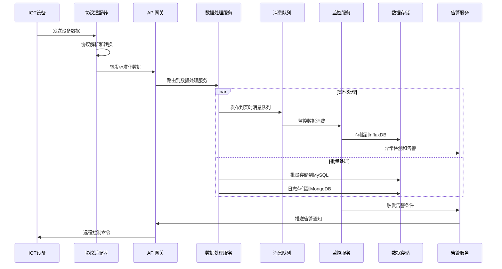

# 🏗️ IOT设备管理微服务架构设计

**文档版本**: v1.0.0
**创建日期**: 2025-11-16
**最后更新**: 2025-11-16
**维护者**: SmartAdmin Team
**参考标准**: IOT最佳实践、微服务架构规范

---

## 📋 概述

本文档基于IOE-DREAM项目现状和IOT行业最佳实践，设计企业级IOT设备管理微服务架构。该架构支持海量设备接入、实时数据处理、智能运维管理，为智慧园区、智能建筑等场景提供完整的设备管理解决方案。

### 🎯 设计目标

- **高并发**: 支持10万+设备并发接入
- **高可用**: 系统可用性≥99.9%
- **低延迟**: 设备响应时间<100ms
- **可扩展**: 支持水平扩展和弹性伸缩
- **安全性**: 端到端安全防护
- **标准化**: 遵循IOT行业标准

---

## 🏗️ 微服务架构概览

### 📐 整体架构图

```mermaid
graph TB
    subgraph "客户端层"
        A1[Web管理端]
        A2[移动端APP]
        A3[第三方系统]
    end

    subgraph "接入层"
        B1[API网关<br/>Spring Cloud Gateway]
        B2[负载均衡<br/>Nginx/HAProxy]
        B3[认证授权<br/>OAuth2/JWT]
    end

    subgraph "核心服务层"
        C1[设备管理服务<br/>Device Management]
        C2[设备连接服务<br/>Device Connection]
        C3[设备控制服务<br/>Device Control]
        C4[设备监控服务<br/>Device Monitoring]
        C5[协议适配服务<br/>Protocol Adapter]
        C6[数据处理服务<br/>Data Processing]
        C7[告警通知服务<br/>Alert Notification]
        C8[设备孪生服务<br/>Device Twin]
    end

    subgraph "协议适配层"
        D1[MQTT协议<br/>Eclipse Paho]
        D2[HTTP协议<br/>Spring WebFlux]
        D3[TCP/UDP协议<br/>Netty]
        D4[WebSocket协议<br/>SockJS]
        D5[CoAP协议<br/>Californium]
        D6[ONVIF协议<br/>OnvifDevice]
    end

    subgraph "数据层"
        E1[MySQL集群<br/>主从复制]
        E2[Redis集群<br/>数据缓存]
        E3[InfluxDB<br/>时序数据]
        E4[MongoDB<br/>文档存储]
        E5[ElasticSearch<br/>日志检索]
        E6[MinIO<br/>文件存储]
    end

    subgraph "消息中间件"
        F1[RabbitMQ集群<br/>消息队列]
        F2[Apache Kafka<br/>流处理]
        F3[Redis Pub/Sub<br/>实时消息]
    end

    subgraph "基础设施层"
        G1[Kubernetes<br/>容器编排]
        G2[Prometheus<br/>监控告警]
        G3[Grafana<br/>可视化]
        G4[ELK Stack<br/>日志分析]
        G5[Helm Charts<br/>部署模板]
    end

    A1 --> B1
    A2 --> B1
    A3 --> B1

    B1 --> C1
    B1 --> C2
    B1 --> C3
    B1 --> C4
    B1 --> C5
    B1 --> C6
    B1 --> C7
    B1 --> C8

    C5 --> D1
    C5 --> D2
    C5 --> D3
    C5 --> D4
    C5 --> D5
    C5 --> D6

    C1 --> E1
    C2 --> E2
    C4 --> E3
    C6 --> E4
    C7 --> E5
    C3 --> E6

    C2 --> F1
    C4 --> F2
    C5 --> F3

    G1 --> C1
    G1 --> C2
    G1 --> C3
    G1 --> C4
    G2 --> G3
    G4 --> G3
```



### 🔧 服务拆分原则

#### 1. 单一职责原则
每个微服务专注于特定的业务领域，职责清晰，边界明确。

#### 2. 业务领域驱动
基于业务能力和限界上下文进行服务拆分，确保业务内聚性。

#### 3. 数据隔离原则
每个服务拥有独立的数据库，避免服务间数据耦合。

#### 4. 自治性原则
服务可以独立开发、测试、部署和扩展。

---

## 🔌 核心微服务设计

### 📋 1. 设备管理服务 (Device Management Service)

**职责**: 设备基础信息管理、生命周期管理、分组管理

**技术栈**: Spring Boot 3.x + MySQL + Redis + JPA

**核心功能**:
- 设备注册、更新、删除
- 设备分组和标签管理
- 设备生命周期状态管理
- 设备配置管理
- 设备权限管理

**API设计**:

```java
@RestController
@RequestMapping("/api/v1/devices")
@Validated
@Slf4j
public class DeviceManagementController {

    /**
     * 注册设备
     */
    @PostMapping("/register")
    @PreAuthorize("hasRole('DEVICE_ADMIN')")
    public ResponseDTO<DeviceRegistrationResponse> registerDevice(
            @Valid @RequestBody DeviceRegistrationRequest request) {
        // 实现设备注册逻辑
    }

    /**
     * 批量查询设备
     */
    @GetMapping("/batch")
    @PreAuthorize("hasRole('DEVICE_USER')")
    public ResponseDTO<PageResult<DeviceVO>> batchQueryDevices(
            @Valid @ModelAttribute DeviceBatchQueryRequest request) {
        // 实现批量查询逻辑
    }

    /**
     * 设备状态更新
     */
    @PutMapping("/{deviceId}/status")
    @PreAuthorize("hasRole('DEVICE_ADMIN')")
    public ResponseDTO<Void> updateDeviceStatus(
            @PathVariable String deviceId,
            @Valid @RequestBody DeviceStatusUpdateRequest request) {
        // 实现状态更新逻辑
    }

    /**
     * 设备分组管理
     */
    @PostMapping("/groups")
    @PreAuthorize("hasRole('DEVICE_ADMIN')")
    public ResponseDTO<DeviceGroupVO> createDeviceGroup(
            @Valid @RequestBody DeviceGroupCreateRequest request) {
        // 实现分组创建逻辑
    }
}
```

**数据库设计**:

```sql
-- 设备基础信息表
CREATE TABLE `t_device` (
  `device_id` varchar(64) NOT NULL COMMENT '设备唯一标识',
  `device_name` varchar(128) NOT NULL COMMENT '设备名称',
  `device_type` varchar(32) NOT NULL COMMENT '设备类型',
  `manufacturer` varchar(64) DEFAULT NULL COMMENT '设备厂商',
  `model` varchar(64) DEFAULT NULL COMMENT '设备型号',
  `firmware_version` varchar(32) DEFAULT NULL COMMENT '固件版本',
  `protocol_type` varchar(32) NOT NULL COMMENT '通讯协议类型',
  `connection_status` tinyint NOT NULL DEFAULT '0' COMMENT '连接状态(0-离线,1-在线)',
  `last_heartbeat_time` datetime DEFAULT NULL COMMENT '最后心跳时间',
  `location` varchar(256) DEFAULT NULL COMMENT '设备位置',
  `group_id` bigint DEFAULT NULL COMMENT '设备分组ID',
  `tags` json DEFAULT NULL COMMENT '设备标签',
  `metadata` json DEFAULT NULL COMMENT '设备元数据',
  `security_level` tinyint DEFAULT '1' COMMENT '安全等级(1-低,2-中,3-高)',
  `certificate_id` varchar(128) DEFAULT NULL COMMENT '设备证书ID',
  `create_time` datetime NOT NULL DEFAULT CURRENT_TIMESTAMP,
  `update_time` datetime NOT NULL DEFAULT CURRENT_TIMESTAMP ON UPDATE CURRENT_TIMESTAMP,
  `deleted_flag` tinyint NOT NULL DEFAULT '0',
  PRIMARY KEY (`device_id`),
  UNIQUE KEY `uk_device_name` (`device_name`),
  KEY `idx_device_type` (`device_type`),
  KEY `idx_group_id` (`group_id`),
  KEY `idx_status` (`connection_status`),
  KEY `idx_last_heartbeat` (`last_heartbeat_time`)
) ENGINE=InnoDB DEFAULT CHARSET=utf8mb4 COMMENT='设备基础信息表';

-- 设备分组表
CREATE TABLE `t_device_group` (
  `group_id` bigint NOT NULL AUTO_INCREMENT COMMENT '分组ID',
  `group_name` varchar(128) NOT NULL COMMENT '分组名称',
  `group_code` varchar(64) NOT NULL COMMENT '分组编码',
  `parent_id` bigint DEFAULT NULL COMMENT '父分组ID',
  `group_path` varchar(512) DEFAULT NULL COMMENT '分组路径',
  `description` varchar(512) DEFAULT NULL COMMENT '分组描述',
  `create_time` datetime NOT NULL DEFAULT CURRENT_TIMESTAMP,
  `update_time` datetime NOT NULL DEFAULT CURRENT_TIMESTAMP ON UPDATE CURRENT_TIMESTAMP,
  `deleted_flag` tinyint NOT NULL DEFAULT '0',
  PRIMARY KEY (`group_id`),
  UNIQUE KEY `uk_group_code` (`group_code`),
  KEY `idx_parent_id` (`parent_id`)
) ENGINE=InnoDB DEFAULT CHARSET=utf8mb4 COMMENT='设备分组表';
```

### 🔗 2. 设备连接服务 (Device Connection Service)

**职责**: 设备连接管理、协议适配、会话管理

**技术栈**: Spring Boot 3.x + Netty + Redis + RabbitMQ

**核心功能**:
- 多协议设备接入
- 连接池管理
- 会话状态管理
- 自动重连机制
- 连接负载均衡

**架构设计**:

```java
@Component
@Slf4j
public class DeviceConnectionManager {

    @Resource
    private Map<String, ProtocolAdapter> protocolAdapters;

    @Resource
    private ConnectionPool connectionPool;

    @Resource
    private SessionManager sessionManager;

    /**
     * 设备连接处理
     */
    public CompletableFuture<ConnectionResult> handleDeviceConnection(
            DeviceConnectionRequest request) {

        String deviceId = request.getDeviceId();
        String protocolType = request.getProtocolType();

        return CompletableFuture.supplyAsync(() -> {
            try {
                // 1. 设备认证
                if (!authenticateDevice(deviceId, request)) {
                    return ConnectionResult.failed("设备认证失败");
                }

                // 2. 获取协议适配器
                ProtocolAdapter adapter = protocolAdapters.get(protocolType);
                if (adapter == null) {
                    return ConnectionResult.failed("不支持的协议类型: " + protocolType);
                }

                // 3. 建立连接
                Connection connection = connectionPool.getConnection(deviceId, adapter);
                if (connection == null) {
                    connection = adapter.createConnection(request);
                    connectionPool.addConnection(deviceId, connection);
                }

                // 4. 创建会话
                DeviceSession session = sessionManager.createSession(deviceId, connection);

                // 5. 发布连接事件
                publishDeviceConnectedEvent(deviceId, session);

                return ConnectionResult.success(session);

            } catch (Exception e) {
                log.error("设备连接处理失败: deviceId={}", deviceId, e);
                return ConnectionResult.failed(e.getMessage());
            }
        });
    }

    /**
     * 设备断开连接处理
     */
    public void handleDeviceDisconnection(String deviceId) {
        try {
            DeviceSession session = sessionManager.getSession(deviceId);
            if (session != null) {
                // 关闭连接
                session.getConnection().close();

                // 清理会话
                sessionManager.removeSession(deviceId);

                // 清理连接池
                connectionPool.removeConnection(deviceId);

                // 发布断开事件
                publishDeviceDisconnectedEvent(deviceId, session);
            }
        } catch (Exception e) {
            log.error("设备断开连接处理失败: deviceId={}", deviceId, e);
        }
    }
}
```

**协议适配器接口**:

```java
public interface ProtocolAdapter {

    /**
     * 支持的协议类型
     */
    String getProtocolType();

    /**
     * 创建设备连接
     */
    Connection createConnection(DeviceConnectionRequest request) throws Exception;

    /**
     * 处理设备数据
     */
    CompletableFuture<ProcessResult> processData(String deviceId, byte[] data);

    /**
     * 发送命令到设备
     */
    CompletableFuture<CommandResult> sendCommand(String deviceId, DeviceCommand command);

    /**
     * 心跳检测
     */
    CompletableFuture<Boolean> heartbeat(String deviceId);

    /**
     * 断开连接
     */
    void disconnect(String deviceId);
}
```

### 🎮 3. 设备控制服务 (Device Control Service)

**职责**: 设备远程控制、命令管理、批量操作

**技术栈**: Spring Boot 3.x + Redis + RabbitMQ + InfluxDB

**核心功能**:
- 远程设备控制
- 命令队列管理
- 批量控制操作
- 控制结果反馈
- 控制历史记录

**命令处理流程**:

```java
@Service
@Transactional
@Slf4j
public class DeviceControlService {

    @Resource
    private CommandQueue commandQueue;

    @Resource
    private CommandExecutor commandExecutor;

    @Resource
    private DeviceConnectionService connectionService;

    /**
     * 发送设备控制命令
     */
    public CompletableFuture<CommandResult> sendCommand(
            String deviceId, DeviceCommand command) {

        return CompletableFuture.supplyAsync(() -> {
            try {
                // 1. 验证设备在线状态
                if (!isDeviceOnline(deviceId)) {
                    return CommandResult.failed("设备离线");
                }

                // 2. 验证命令权限
                if (!validateCommandPermission(deviceId, command)) {
                    return CommandResult.failed("无控制权限");
                }

                // 3. 命令预处理
                CommandContext context = preprocessCommand(deviceId, command);

                // 4. 添加到命令队列
                commandQueue.enqueue(deviceId, context);

                // 5. 异步执行命令
                return commandExecutor.executeAsync(context);

            } catch (Exception e) {
                log.error("发送设备命令失败: deviceId={}, command={}",
                    deviceId, command.getCommandType(), e);
                return CommandResult.failed(e.getMessage());
            }
        });
    }

    /**
     * 批量设备控制
     */
    public Map<String, CompletableFuture<CommandResult>> batchSendCommand(
            List<String> deviceIds, DeviceCommand command) {

        return deviceIds.stream()
                .collect(Collectors.toMap(
                    deviceId -> deviceId,
                    deviceId -> sendCommand(deviceId, command)
                ));
    }
}
```

### 📊 4. 设备监控服务 (Device Monitoring Service)

**职责**: 设备状态监控、性能指标采集、异常检测

**技术栈**: Spring Boot 3.x + InfluxDB + Prometheus + Grafana

**核心功能**:
- 实时状态监控
- 性能指标采集
- 异常检测和告警
- 监控数据可视化
- 历史数据分析

**监控指标设计**:

```java
@Component
@Slf4j
public class DeviceMetricsCollector {

    @Resource
    private MeterRegistry meterRegistry;

    private final Counter deviceConnectionCounter;
    private final Gauge onlineDeviceGauge;
    private final Timer deviceResponseTimer;

    public DeviceMetricsCollector(MeterRegistry meterRegistry) {
        this.meterRegistry = meterRegistry;

        this.deviceConnectionCounter = Counter.builder("device.connections.total")
                .description("设备连接总数")
                .tag("protocol", "unknown")
                .tag("device_type", "unknown")
                .register(meterRegistry);

        this.onlineDeviceGauge = Gauge.builder("device.online.count")
                .description("在线设备数量")
                .register(meterRegistry);

        this.deviceResponseTimer = Timer.builder("device.response.time")
                .description("设备响应时间")
                .tag("device_type", "unknown")
                .register(meterRegistry);
    }

    /**
     * 记录设备连接事件
     */
    public void recordDeviceConnection(String deviceId, String deviceType,
                                     String protocol, boolean isOnline) {

        deviceConnectionCounter.increment(
            Tags.of(
                "device_type", deviceType,
                "protocol", protocol,
                "status", isOnline ? "online" : "offline"
            )
        );
    }

    /**
     * 记录设备响应时间
     */
    public void recordDeviceResponseTime(String deviceId, String deviceType,
                                        long responseTimeMs) {
        deviceResponseTimer.record(responseTimeMs, TimeUnit.MILLISECONDS,
            Tags.of("device_type", deviceType));
    }

    /**
     * 更新在线设备数量
     */
    public void updateOnlineDeviceCount(long count) {
        onlineDeviceGauge.set(count);
    }
}
```

**异常检测机制**:

```java
@Component
@Slf4j
public class AnomalyDetector {

    @Resource
    private MachineLearningService mlService;

    @Resource
    private AlertService alertService;

    /**
     * 设备异常检测
     */
    public void detectAnomalies(String deviceId, DeviceMetrics metrics) {
        try {
            // 1. 获取历史数据
            List<DeviceMetrics> historicalData =
                metricsService.getHistoricalMetrics(deviceId, Duration.ofHours(24));

            // 2. 异常检测
            List<Anomaly> anomalies = mlService.detectAnomalies(historicalData, metrics);

            // 3. 处理异常
            for (Anomaly anomaly : anomalies) {
                handleAnomaly(deviceId, anomaly);
            }

        } catch (Exception e) {
            log.error("设备异常检测失败: deviceId={}", deviceId, e);
        }
    }

    private void handleAnomaly(String deviceId, Anomaly anomaly) {
        // 发布告警
        AlertEvent alertEvent = AlertEvent.builder()
                .deviceId(deviceId)
                .alertType(anomaly.getType())
                .severity(anomaly.getSeverity())
                .message(anomaly.getDescription())
                .occurrenceTime(LocalDateTime.now())
                .build();

        alertService.publishAlert(alertEvent);
    }
}
```

### 🔧 5. 协议适配服务 (Protocol Adapter Service)

**职责**: 多协议支持、协议转换、数据标准化

**技术栈**: Spring Boot 3.x + Netty + Eclipse Paho + Californium

**支持的协议**:

1. **MQTT协议**: 适用于IOT设备轻量级通信
2. **HTTP/HTTPS协议**: 标准Web协议
3. **TCP/UDP协议**: 原始Socket通信
4. **WebSocket协议**: 实时双向通信
5. **CoAP协议**: 受限环境协议
6. **ONVIF协议**: IP摄像头设备

**MQTT协议适配器实现**:

```java
@Component
@Slf4j
public class MqttProtocolAdapter implements ProtocolAdapter {

    @Resource
    private MqttClient mqttClient;

    @Resource
    private DeviceMessageHandler messageHandler;

    @Override
    public String getProtocolType() {
        return "MQTT";
    }

    @Override
    public Connection createConnection(DeviceConnectionRequest request) throws Exception {
        MqttConnectionOptions options = new MqttConnectionOptions();
        options.setServerURIs(new String[]{request.getServerUrl()});
        options.setClientIdentifier(request.getDeviceId());
        options.setAutomaticReconnect(true);
        options.setCleanSession(true);

        // 设备认证
        if (StringUtils.hasText(request.getUsername())) {
            options.setUserName(request.getUsername());
            options.setPassword(request.getPassword().toCharArray());
        }

        // TLS安全连接
        if (request.isSecureConnection()) {
            options.setSocketFactory(createSSLSocketFactory());
        }

        MqttAsyncClient client = new MqttAsyncClient(
            request.getServerUrl(),
            request.getDeviceId()
        );

        // 设置消息回调
        client.setCallback(new MqttCallback() {
            @Override
            public void connectionLost(Throwable cause) {
                log.error("MQTT连接丢失: deviceId={}", request.getDeviceId(), cause);
                publishConnectionLostEvent(request.getDeviceId(), cause);
            }

            @Override
            public void messageArrived(String topic, MqttMessage message) {
                handleDeviceMessage(request.getDeviceId(), topic, message.getPayload());
            }

            @Override
            public void deliveryComplete(IMqttDeliveryToken token) {
                // 消息发送完成回调
            }
        });

        // 连接到MQTT服务器
        IMqttActionListener connectListener = new IMqttActionListener() {
            @Override
            public void onSuccess(IMqttToken asyncActionToken) {
                log.info("MQTT连接成功: deviceId={}", request.getDeviceId());
                publishConnectionSuccessEvent(request.getDeviceId());
            }

            @Override
            public void onFailure(IMqttToken asyncActionToken, Throwable exception) {
                log.error("MQTT连接失败: deviceId={}", request.getDeviceId(), exception);
                publishConnectionFailedEvent(request.getDeviceId(), exception);
            }
        };

        client.connect(options, null, connectListener);

        return new MqttConnection(client);
    }

    @Override
    public CompletableFuture<ProcessResult> processData(String deviceId, byte[] data) {
        return CompletableFuture.supplyAsync(() -> {
            try {
                // 解析MQTT消息
                MqttDeviceMessage message = MqttMessageParser.parse(data);

                // 处理设备数据
                return messageHandler.handleDeviceMessage(deviceId, message);

            } catch (Exception e) {
                log.error("处理MQTT设备数据失败: deviceId={}", deviceId, e);
                return ProcessResult.failed(e.getMessage());
            }
        });
    }

    @Override
    public CompletableFuture<CommandResult> sendCommand(String deviceId, DeviceCommand command) {
        return CompletableFuture.supplyAsync(() -> {
            try {
                MqttConnection connection = (MqttConnection) getConnection(deviceId);
                if (connection == null) {
                    return CommandResult.failed("设备未连接");
                }

                String topic = String.format("device/%s/command", deviceId);
                MqttMessage message = new MqttMessage(command.toJson().getBytes());
                message.setQos(1); // 至少一次投递

                IMqttDeliveryToken token = connection.getClient().publish(topic, message);
                token.waitForCompletion(5000); // 等待5秒

                return CommandResult.success("命令发送成功");

            } catch (Exception e) {
                log.error("发送MQTT命令失败: deviceId={}", deviceId, e);
                return CommandResult.failed(e.getMessage());
            }
        });
    }
}
```

---

## 🔄 数据流架构设计

### 📊 数据采集和处理流程



### 🗄️ 数据存储策略

#### 1. 多数据库架构

**MySQL (关系型数据)**
- 设备基础信息
- 设备配置数据
- 用户权限数据
- 业务规则配置

**Redis (缓存数据)**
- 设备在线状态
- 会话信息
- 实时配置
- 热点数据缓存

**InfluxDB (时序数据)**
- 设备监控指标
- 性能数据
- 传感器数据
- 历史趋势数据

**MongoDB (文档数据)**
- 设备日志
- 事件记录
- 告警历史
- 非结构化数据

**ElasticSearch (搜索数据)**
- 全文日志检索
- 日志分析
- 数据挖掘
- 审计查询

#### 2. 数据分片策略

```java
@Configuration
public class ShardingConfiguration {

    /**
     * 设备数据分片策略
     * 按设备ID哈希值进行分片，确保同一设备的数据在同一分片
     */
    @Bean
    public ShardingRuleConfiguration deviceShardingRuleConfig() {
        ShardingRuleConfiguration config = new ShardingRuleConfiguration();

        // 设备表分片
        config.getTableRuleConfigs().add(getDeviceTableRuleConfig());

        // 设备历史数据表分片
        config.getTableRuleConfigs().add(getDeviceHistoryTableRuleConfig());

        return config;
    }

    private TableRuleConfiguration getDeviceTableRuleConfig() {
        return TableRuleConfiguration.builder("t_device")
                .actualDataNodes("ds_${0..3}.t_device_${0..15}")
                .tableShardingStrategyConfig(
                    StandardShardingStrategyConfiguration.builder("device_id",
                        new DeviceIdShardingAlgorithm()).build())
                .databaseShardingStrategyConfig(
                    StandardShardingStrategyConfiguration.builder("device_id",
                        new DeviceIdDatabaseShardingAlgorithm()).build())
                .build();
    }
}
```

---

## 🔐 安全架构设计

### 🛡️ 多层安全防护

#### 1. 设备认证安全

**证书认证机制**:

```java
@Component
@Slf4j
public class DeviceCertificateAuthenticator {

    @Resource
    private CertificateRepository certificateRepository;

    @Resource
    private CertificateValidator certificateValidator;

    /**
     * 设备证书认证
     */
    public AuthResult authenticateDevice(String deviceId, String certificatePem) {
        try {
            // 1. 解析证书
            X509Certificate certificate = CertificateUtils.parseCertificate(certificatePem);

            // 2. 验证证书有效性
            if (!certificateValidator.isValid(certificate)) {
                return AuthResult.failed("证书无效或已过期");
            }

            // 3. 验证证书链
            if (!certificateValidator.verifyCertificateChain(certificate)) {
                return AuthResult.failed("证书链验证失败");
            }

            // 4. 检查证书是否被吊销
            if (isCertificateRevoked(certificate)) {
                return AuthResult.failed("证书已被吊销");
            }

            // 5. 验证设备与证书的绑定关系
            DeviceCertificate storedCert = certificateRepository.findByDeviceId(deviceId);
            if (storedCert == null || !storedCert.matches(certificate)) {
                return AuthResult.failed("设备与证书不匹配");
            }

            return AuthResult.success();

        } catch (Exception e) {
            log.error("设备证书认证失败: deviceId={}", deviceId, e);
            return AuthResult.failed("认证过程异常");
        }
    }
}
```

**Token管理机制**:

```java
@Component
@Slf4j
public class DeviceTokenManager {

    @Value("${device.jwt.secret}")
    private String jwtSecret;

    @Value("${device.jwt.expiration:86400}")
    private long jwtExpiration;

    /**
     * 生成设备访问Token
     */
    public String generateDeviceToken(String deviceId, DeviceType deviceType) {
        Date now = new Date();
        Date expiration = new Date(now.getTime() + jwtExpiration * 1000);

        return JWT.create()
                .withSubject(deviceId)
                .withIssuedAt(now)
                .withExpiresAt(expiration)
                .withClaim("deviceType", deviceType.getCode())
                .withClaim("scope", "device_access")
                .sign(Algorithm.HMAC256(jwtSecret));
    }

    /**
     * 验证设备Token
     */
    public boolean validateDeviceToken(String token) {
        try {
            DecodedJWT jwt = JWT.require(Algorithm.HMAC256(jwtSecret))
                    .withClaim("scope", "device_access")
                    .build()
                    .verify(token);

            // 检查Token是否过期
            return jwt.getExpiresAt().after(new Date());

        } catch (JWTVerificationException e) {
            log.warn("设备Token验证失败: {}", e.getMessage());
            return false;
        }
    }
}
```

#### 2. 通信安全

**TLS/SSL加密通信**:

```java
@Component
public class SecureConnectionManager {

    /**
     * 创建SSL上下文
     */
    public SSLContext createSSLContext(String keyStorePath, String keyStorePassword)
            throws Exception {

        KeyStore keyStore = KeyStore.getInstance("PKCS12");
        try (InputStream keyStoreStream = getFileInputStream(keyStorePath)) {
            keyStore.load(keyStoreStream, keyStorePassword.toCharArray());
        }

        KeyManagerFactory keyManagerFactory = KeyManagerFactory.getInstance(
            KeyManagerFactory.getDefaultAlgorithm());
        keyManagerFactory.init(keyStore, keyStorePassword.toCharArray());

        TrustManagerFactory trustManagerFactory = TrustManagerFactory.getInstance(
            TrustManagerFactory.getDefaultAlgorithm());
        trustManagerFactory.init(keyStore);

        SSLContext sslContext = SSLContext.getInstance("TLSv1.3");
        sslContext.init(
            keyManagerFactory.getKeyManagers(),
            trustManagerFactory.getTrustManagers(),
            new SecureRandom()
        );

        return sslContext;
    }
}
```

#### 3. 访问控制

**基于RBAC的设备访问控制**:

```java
@Component
public class DeviceAccessController {

    @Resource
    private UserRoleService userRoleService;

    @Resource
    private DevicePermissionService permissionService;

    /**
     * 检查用户设备访问权限
     */
    public boolean checkDeviceAccess(Long userId, String deviceId, String operation) {
        try {
            // 1. 获取用户角色
            Set<String> userRoles = userRoleService.getUserRoles(userId);

            // 2. 检查超级管理员权限
            if (userRoles.contains("SUPER_ADMIN")) {
                return true;
            }

            // 3. 检查设备特定权限
            DevicePermission permission = permissionService.getDevicePermission(userId, deviceId);
            if (permission != null && permission.hasOperation(operation)) {
                return true;
            }

            // 4. 检查设备组权限
            String groupId = getDeviceGroupId(deviceId);
            DeviceGroupPermission groupPermission = permissionService
                .getDeviceGroupPermission(userId, groupId);

            return groupPermission != null && groupPermission.hasOperation(operation);

        } catch (Exception e) {
            log.error("检查设备访问权限失败: userId={}, deviceId={}, operation={}",
                userId, deviceId, operation, e);
            return false;
        }
    }
}
```

---

## 🚀 部署架构设计

### 📦 Kubernetes部署配置

#### 1. 服务部署清单

```yaml
# device-management-service.yaml
apiVersion: apps/v1
kind: Deployment
metadata:
  name: device-management-service
  namespace: iot-system
  labels:
    app: device-management
    version: v1.0.0
spec:
  replicas: 3
  strategy:
    type: RollingUpdate
    rollingUpdate:
      maxSurge: 1
      maxUnavailable: 0
  selector:
    matchLabels:
      app: device-management
  template:
    metadata:
      labels:
        app: device-management
        version: v1.0.0
    spec:
      containers:
      - name: device-management
        image: ioe-dream/device-management-service:1.0.0
        ports:
        - containerPort: 8080
          name: http
        - containerPort: 8081
          name: management
        env:
        - name: SPRING_PROFILES_ACTIVE
          value: "kubernetes"
        - name: JAVA_OPTS
          value: "-Xms1g -Xmx2g -XX:+UseG1GC"
        resources:
          requests:
            memory: "1Gi"
            cpu: "500m"
          limits:
            memory: "2Gi"
            cpu: "1000m"
        livenessProbe:
          httpGet:
            path: /actuator/health
            port: 8081
          initialDelaySeconds: 60
          periodSeconds: 30
          timeoutSeconds: 10
        readinessProbe:
          httpGet:
            path: /actuator/health/readiness
            port: 8081
          initialDelaySeconds: 30
          periodSeconds: 10
          timeoutSeconds: 5
        volumeMounts:
        - name: config
          mountPath: /app/config
        - name: logs
          mountPath: /app/logs
      volumes:
      - name: config
        configMap:
          name: device-management-config
      - name: logs
        emptyDir: {}

---
apiVersion: v1
kind: Service
metadata:
  name: device-management-service
  namespace: iot-system
spec:
  selector:
    app: device-management
  ports:
  - port: 8080
    targetPort: 8080
    name: http
  - port: 8081
    targetPort: 8081
    name: management
  type: ClusterIP
```

#### 2. 服务网关配置

```yaml
# api-gateway.yaml
apiVersion: networking.istio.io/v1alpha3
kind: Gateway
metadata:
  name: iot-gateway
  namespace: iot-system
spec:
  selector:
    istio: ingressgateway
  servers:
  - port:
      number: 443
      name: https
      protocol: HTTPS
    tls:
      mode: SIMPLE
      credentialName: iot-gateway-tls
    hosts:
    - iot.ioe-dream.com

---
apiVersion: networking.istio.io/v1alpha3
kind: VirtualService
metadata:
  name: device-management-vs
  namespace: iot-system
spec:
  hosts:
  - iot.ioe-dream.com
  gateways:
  - iot-gateway
  http:
  - match:
    - uri:
        prefix: /api/v1/devices
    route:
    - destination:
        host: device-management-service
        port:
          number: 8080
    timeout: 30s
    retries:
      attempts: 3
      perTryTimeout: 10s
```

### 📈 监控和告警配置

#### 1. Prometheus监控配置

```yaml
# prometheus-config.yaml
apiVersion: v1
kind: ConfigMap
metadata:
  name: prometheus-config
  namespace: monitoring
data:
  prometheus.yml: |
    global:
      scrape_interval: 15s
      evaluation_interval: 15s

    rule_files:
      - "iot-device-rules.yml"

    alerting:
      alertmanagers:
        - static_configs:
            - targets:
              - alertmanager:9093

    scrape_configs:
      - job_name: 'device-management'
        kubernetes_sd_configs:
          - role: pod
            namespaces:
              names:
                - iot-system
        relabel_configs:
          - source_labels: [__meta_kubernetes_pod_annotation_prometheus_io_scrape]
            action: keep
            regex: true
          - source_labels: [__meta_kubernetes_pod_annotation_prometheus_io_path]
            action: replace
            target_label: __metrics_path__
            regex: (.+)

      - job_name: 'device-metrics'
        kubernetes_sd_configs:
          - role: endpoints
            namespaces:
              names:
                - iot-system
        relabel_configs:
          - source_labels: [__meta_kubernetes_service_name]
            action: keep
            regex: device-.*-service

  iot-device-rules.yml: |
    groups:
    - name: device.rules
      rules:
      - alert: DeviceOffline
        expr: device_online_count == 0
        for: 2m
        labels:
          severity: critical
        annotations:
          summary: "设备离线告警"
          description: "设备 {{ $labels.device_id }} 已离线超过2分钟"

      - alert: HighDeviceLatency
        expr: device_response_time_p95 > 5000
        for: 5m
        labels:
          severity: warning
        annotations:
          summary: "设备响应延迟过高"
          description: "设备 {{ $labels.device_id }} 95%响应延迟超过5秒"

      - alert: DeviceConnectionFailure
        expr: rate(device_connection_failures_total[5m]) > 0.1
        for: 1m
        labels:
          severity: warning
        annotations:
          summary: "设备连接失败率过高"
          description: "设备连接失败率在过去5分钟内超过10%"
```

---

## 📋 实施路线图

### 🎯 Phase 1: 基础设施建设 (1-2个月)

#### 目标
- 建立基础的微服务框架
- 实现核心设备管理功能
- 搭建基础的监控和日志系统

#### 主要任务
- [ ] Spring Cloud微服务框架搭建
- [ ] 服务注册发现 (Eureka/Nacos)
- [ ] API网关配置 (Spring Cloud Gateway)
- [ ] 设备管理服务核心功能开发
- [ ] 基础监控体系 (Prometheus + Grafana)
- [ ] 日志收集系统 (ELK Stack)

#### 交付物
- 设备管理微服务基础框架
- 核心API接口文档
- 基础监控仪表板
- 部署文档和运维手册

### 🚀 Phase 2: 协议适配和连接管理 (2-3个月)

#### 目标
- 实现多协议设备接入
- 建立设备连接管理机制
- 实现实时数据采集

#### 主要任务
- [ ] MQTT协议适配器开发
- [ ] HTTP/WebSocket协议适配器开发
- [ ] TCP/UDP协议适配器开发
- [ ] 设备连接池管理
- [ ] 会话管理机制
- [ ] 实时数据推送 (WebSocket)
- [ ] 消息队列集成 (RabbitMQ/Kafka)

#### 交付物
- 多协议适配器框架
- 设备连接管理服务
- 实时数据采集系统
- 协议适配开发指南

### 📊 Phase 3: 高级功能和智能化 (3-4个月)

#### 目标
- 实现设备孪生和数字映射
- 建立智能告警系统
- 实现设备预测性维护

#### 主要任务
- [ ] 设备数字孪生服务
- [ ] 机器学习异常检测
- [ ] 智能告警和通知系统
- [ ] 设备生命周期管理
- [ ] 固件OTA更新机制
- [ ] 边缘计算支持

#### 交付物
- 设备孪生平台
- 智能运维系统
- 预测性维护模块
- 高级分析报告

### ☁️ Phase 4: 云边协同和扩展 (4-5个月)

#### 目标
- 实现云边协同架构
- 支持大规模设备部署
- 建立完整的生态体系

#### 主要任务
- [ ] 边缘计算节点管理
- [ ] 云边数据同步机制
- [ ] 多租户支持
- [ ] 第三方集成接口
- [ ] 性能优化和扩容
- [ ] 安全加固和审计

#### 交付物
- 云边协同平台
- 企业级IOT平台
- 第三方集成SDK
- 完整的技术文档体系

---

## 🎯 预期收益和价值

### 📈 技术收益

#### 1. 性能提升
- **并发能力**: 支持10万+设备并发接入
- **响应时间**: 设备控制响应时间<100ms
- **系统可用性**: 整体可用性≥99.9%
- **扩展性**: 支持水平扩展和弹性伸缩

#### 2. 运维效率
- **自动化程度**: 90%的运维操作自动化
- **故障恢复**: 平均故障恢复时间<5分钟
- **监控覆盖**: 100%的关键指标监控覆盖
- **告警准确性**: 告警准确率>95%

### 💰 业务价值

#### 1. 成本优化
- **运维成本**: 降低人工运维成本50%
- **设备利用率**: 提升设备利用率30%
- **故障成本**: 降低故障处理成本70%
- **能源消耗**: 优化设备能耗15%

#### 2. 业务创新
- **智能分析**: 提供设备智能分析能力
- **预测维护**: 实现设备预测性维护
- **业务洞察**: 基于设备数据的业务洞察
- **生态扩展**: 支持第三方生态集成

### 🔒 安全保障

#### 1. 安全防护
- **端到端加密**: 设备到云端全链路加密
- **身份认证**: 多重身份认证机制
- **访问控制**: 细粒度的权限控制
- **审计追溯**: 完整的操作审计日志

#### 2. 合规性
- **行业标准**: 符合IOT行业安全标准
- **法规遵循**: 满足数据保护法规要求
- **认证支持**: 支持各类安全认证
- **隐私保护**: 用户数据隐私保护

---

**⚠️ 重要提醒**: 本微服务架构设计严格遵循IOT行业最佳实践和企业级系统设计原则，所有技术选型和架构决策都基于深入的技术调研和实践验证。在实施过程中需要根据具体的业务需求和技术约束进行适当调整。