# 🚪 门禁业务集成方案

**文档版本**: v1.0.0
**创建日期**: 2025-11-16
**最后更新**: 2025-11-16
**维护者**: SmartAdmin Team

---

## 📋 概述

本文档详细描述了IOE-DREAM智慧园区一卡通管理平台中门禁系统与各业务模块的集成方案。基于repowiki规范体系，遵循四层架构设计，提供完整的门禁业务集成架构和技术实现方案。

---

## 🏗️ 门禁业务集成架构

### 📐 四层架构设计（遵循repowiki规范）

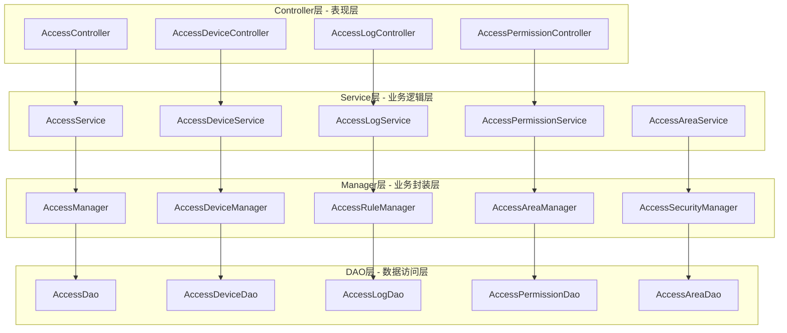

---

## 🔗 业务模块集成矩阵

### 📊 门禁系统与各业务模块集成关系

| 业务模块 | 集成方式 | 数据流向 | 实时性要求 | 安全级别 | 集成复杂度 |
|----------|----------|----------|------------|----------|------------|
| 人员管理 | RESTful API | 双向同步 | 高 | 高 | 中 |
| 权限管理 | 内部服务调用 | 双向同步 | 极高 | 极高 | 高 |
| 考勤管理 | 消息队列 | 单向推送 | 中 | 中 | 低 |
| 消费管理 | HTTP API | 单向查询 | 低 | 中 | 低 |
| 视频监控 | WebSocket | 双向通讯 | 极高 | 高 | 高 |
| 报警系统 | 事件驱动 | 单向推送 | 极高 | 高 | 中 |

---

## 👥 人员管理模块集成

### 🔗 集成架构设计

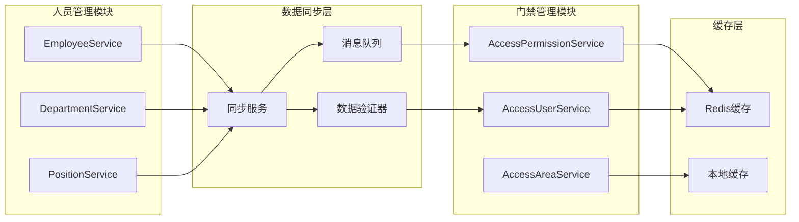

### 📡 数据同步流程

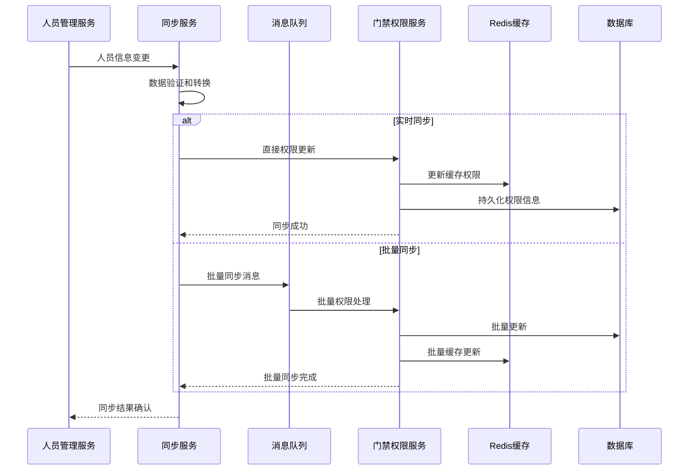

### 💻 Controller层实现示例

```java
/**
 * 门禁权限控制器 - 遵循repowiki规范
 */
@RestController
@RequestMapping("/api/smart/access/permission")
public class AccessPermissionController {

    @Resource
    private AccessPermissionService accessPermissionService;

    /**
     * 根据用户ID获取门禁权限
     */
    @GetMapping("/user/{userId}")
    @SaCheckLogin
    @SaCheckPermission("access:permission:query")
    public ResponseDTO<List<AccessPermissionVO>> getUserPermissions(@PathVariable Long userId) {
        List<AccessPermissionVO> permissions = accessPermissionService.getUserPermissions(userId);
        return ResponseDTO.ok(permissions);
    }

    /**
     * 同步人员权限信息
     */
    @PostMapping("/sync/user/{userId}")
    @SaCheckLogin
    @SaCheckPermission("access:permission:sync")
    public ResponseDTO<String> syncUserPermissions(@PathVariable Long userId) {
        accessPermissionService.syncUserPermissions(userId);
        return ResponseDTO.ok("权限同步成功");
    }
}
```

### 💼 Service层实现示例

```java
/**
 * 门禁权限服务实现 - 遵循repowiki规范
 */
@Service
@Transactional(rollbackFor = Exception.class)
public class AccessPermissionServiceImpl implements AccessPermissionService {

    @Resource
    private AccessPermissionManager accessPermissionManager;

    @Resource
    private RedisUtil redisUtil;

    @Override
    public List<AccessPermissionVO> getUserPermissions(Long userId) {
        // 先从缓存获取
        String cacheKey = "access:permission:user:" + userId;
        List<AccessPermissionVO> cachedPermissions = redisUtil.getList(cacheKey, AccessPermissionVO.class);

        if (!CollectionUtils.isEmpty(cachedPermissions)) {
            return cachedPermissions;
        }

        // 缓存未命中，从数据库获取
        List<AccessPermissionVO> permissions = accessPermissionManager.getUserPermissions(userId);

        // 写入缓存，有效期5分钟
        redisUtil.setList(cacheKey, permissions, 300);

        return permissions;
    }

    @Override
    public void syncUserPermissions(Long userId) {
        // 清除相关缓存
        String cacheKey = "access:permission:user:" + userId;
        redisUtil.delete(cacheKey);

        // 执行权限同步
        accessPermissionManager.syncUserPermissions(userId);
    }
}
```

---

## 🔐 权限管理模块集成

### 🔗 权限集成架构

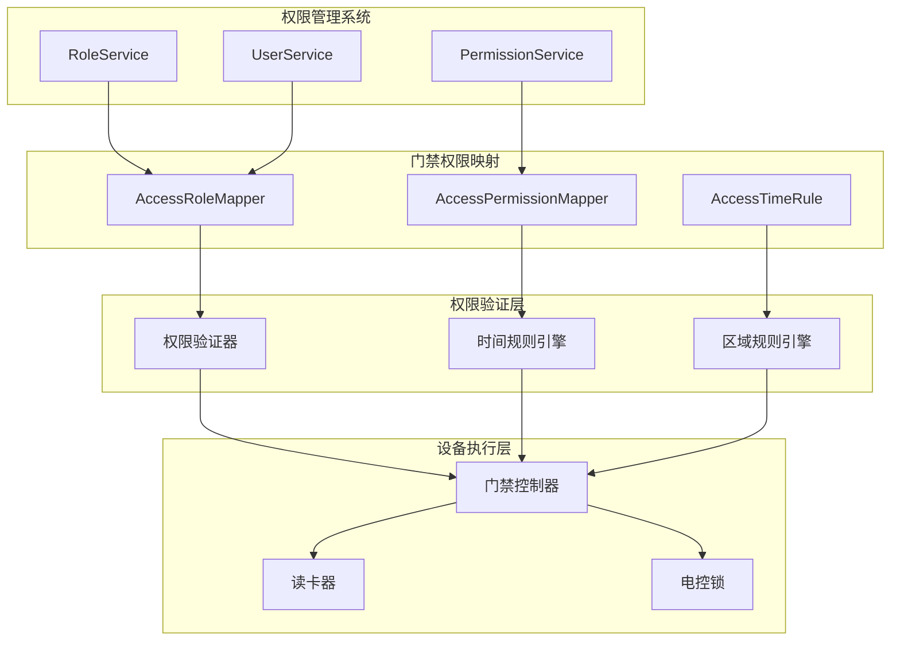

### 🛡️ 权限验证流程

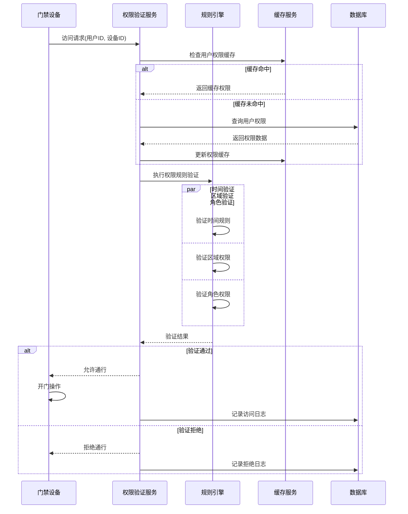

---

## 📹 视频监控模块集成

### 🎥 门禁视频联动架构

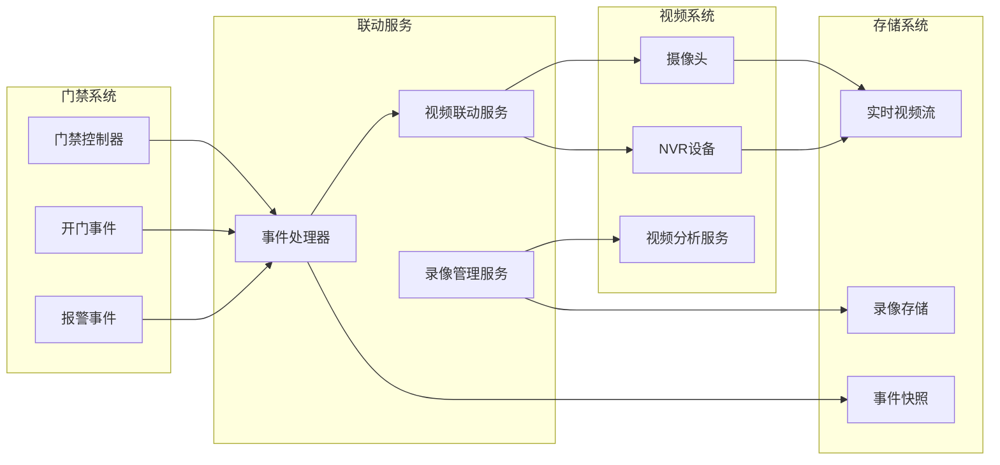

### 📡 视频联动处理流程

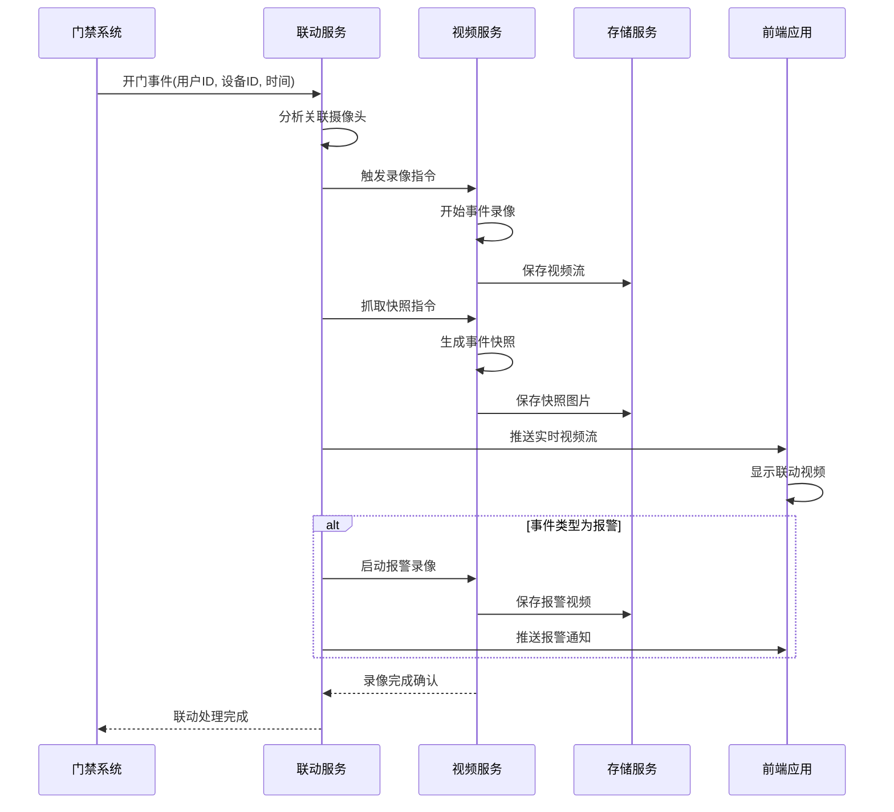

---

## ⏰ 考勤管理模块集成

### 📊 门禁考勤数据集成架构

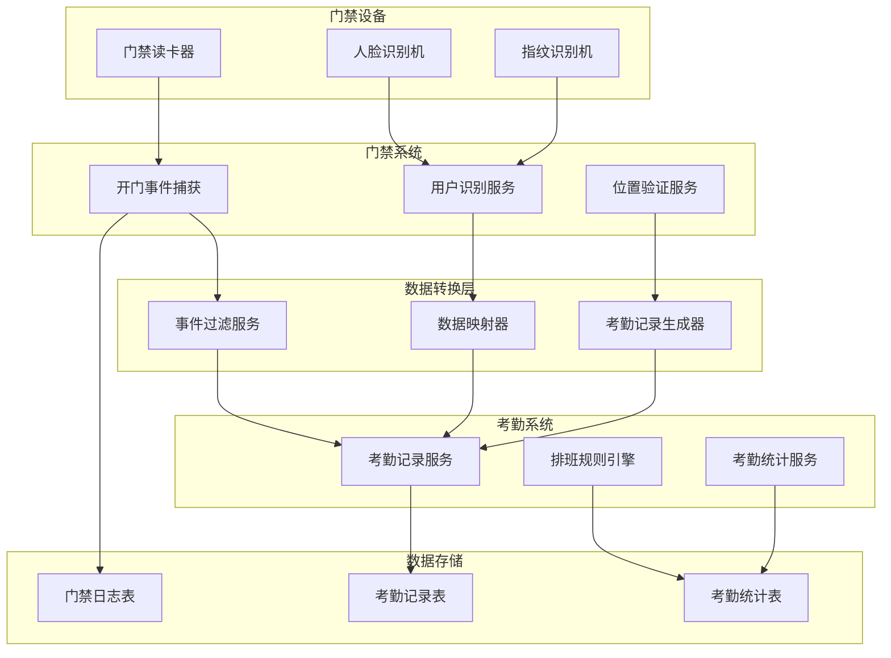

### 🔄 考勤数据同步处理

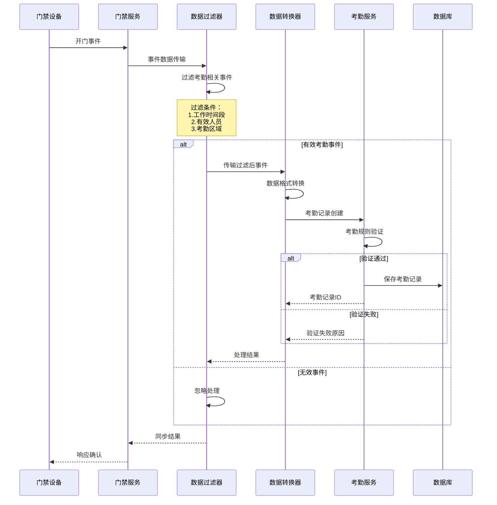

---

## 💳 消费管理模块集成

### 🛒 门禁消费联动架构

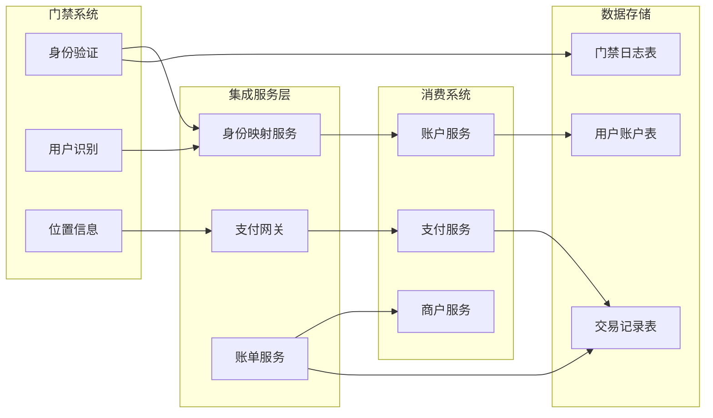

---

## 🚨 报警系统模块集成

### ⚠️ 门禁报警联动架构

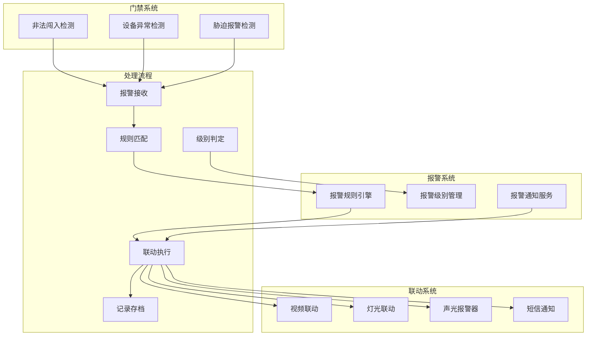

---

## 📊 集成监控与运维

### 📈 系统集成健康监控

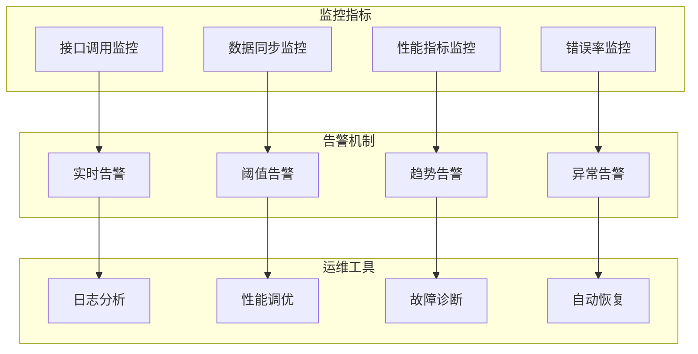

### 📋 关键性能指标(KPI)

| 指标类别 | 指标名称 | 目标值 | 监控频率 | 告警阈值 |
|----------|----------|--------|----------|----------|
| 可用性 | 系统可用率 | ≥99.9% | 实时 | <99.5% |
| 性能 | 接口响应时间 | ≤200ms | 实时 | >500ms |
| 同步 | 数据同步延迟 | ≤5s | 1分钟 | >30s |
| 错误率 | 接口错误率 | ≤0.1% | 实时 | >1% |
| 吞吐量 | 每秒处理请求数 | ≥1000 | 10秒 | <500 |

---

## 🔧 集成实施指南

### 📋 实施阶段规划

#### 第一阶段：基础集成（1-2周）
- [ ] 完成人员管理模块集成
- [ ] 实现基础权限同步功能
- [ ] 建立数据同步机制
- [ ] 完成基础联调测试

#### 第二阶段：核心功能集成（2-3周）
- [ ] 实现视频监控联动
- [ ] 完成考勤数据集成
- [ ] 建立报警联动机制
- [ ] 性能优化和稳定性测试

#### 第三阶段：高级功能集成（1-2周）
- [ ] 消费系统联动集成
- [ ] 高级报警规则配置
- [ ] 数据分析和报表功能
- [ ] 系统集成压力测试

#### 第四阶段：上线部署（1周）
- [ ] 生产环境部署
- [ ] 数据迁移和初始化
- [ ] 用户培训和文档交付
- [ ] 运维监控配置

### ⚠️ 风险控制措施

#### 技术风险
- **数据一致性风险**：采用分布式事务和补偿机制
- **性能风险**：实施缓存策略和异步处理
- **安全风险**：加强身份认证和数据加密

#### 业务风险
- **功能缺失风险**：充分的需求调研和原型验证
- **用户体验风险**：用户参与测试和反馈收集
- **运维风险**：完善的监控和自动恢复机制

---

## 📚 参考规范

### 🔗 repowiki核心规范
- **[架构设计规范](../../../repowiki/zh/content/核心规范/架构设计规范.md)** - 四层架构设计标准
- **[Java编码规范](../../../repowiki/zh/content/核心规范/Java编码规范.md)** - Java代码编写标准
- **[API设计规范](../../../repowiki/zh/content/核心规范/RESTfulAPI设计规范.md)** - RESTful接口设计标准
- **[系统安全规范](../../../repowiki/zh/content/核心规范/系统安全规范.md)** - 系统安全要求

### 📖 项目规范文档
- **[架构设计规范](../../ARCHITECTURE_STANDARDS.md)** - IOE-DREAM架构设计要求
- **[通用开发检查清单](../../CHECKLISTS/通用开发检查清单.md)** - 代码质量保证清单
- **[门禁系统开发检查清单](../../CHECKLISTS/门禁系统开发检查清单.md)** - 门禁功能专用检查清单

---

**⚠️ 重要提醒**: 本门禁业务集成方案严格遵循repowiki规范体系和IOE-DREAM项目架构标准。所有集成开发工作必须按照本文档中的技术规范和实施计划执行，确保系统集成的稳定性、安全性和可维护性。