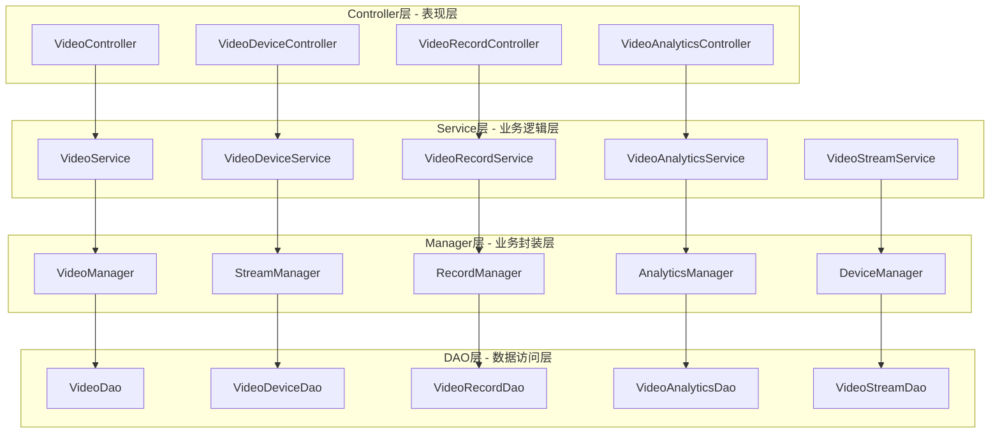
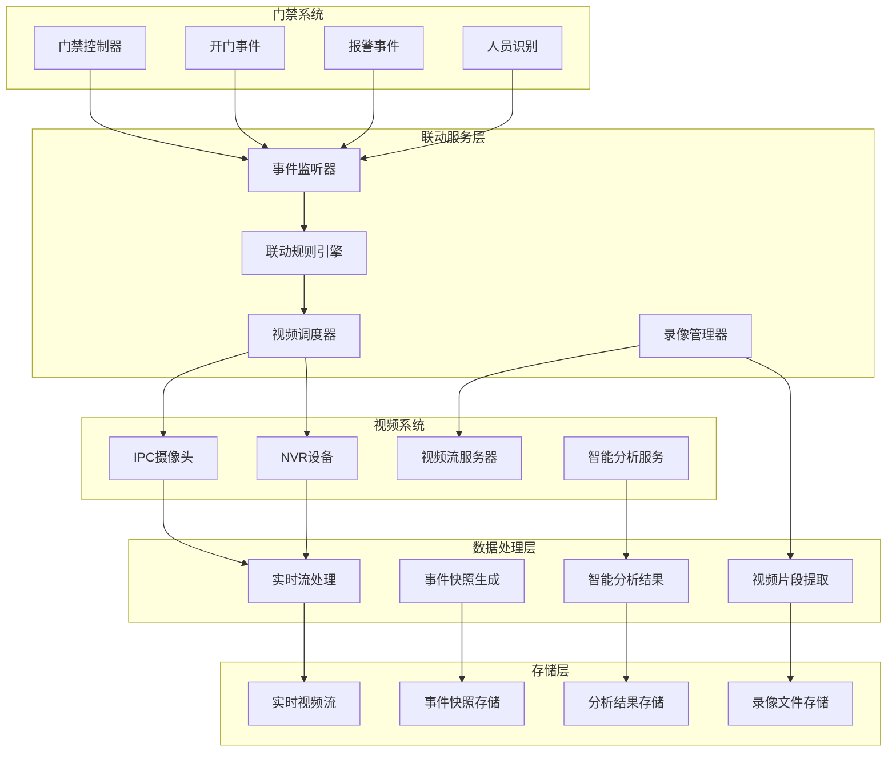
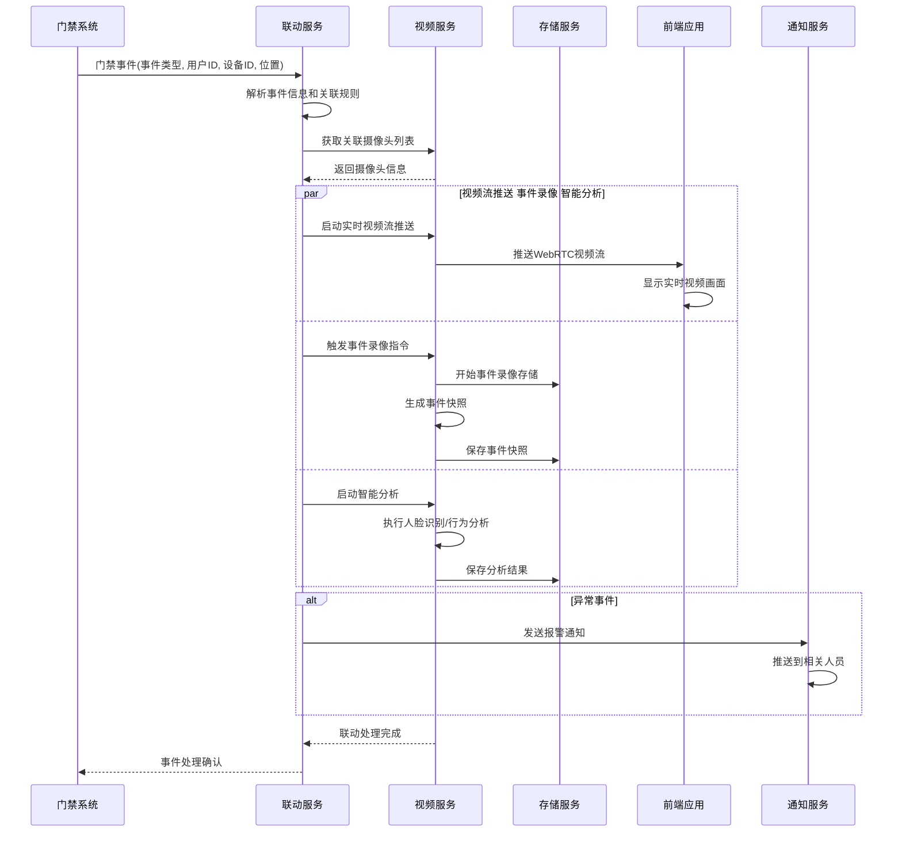
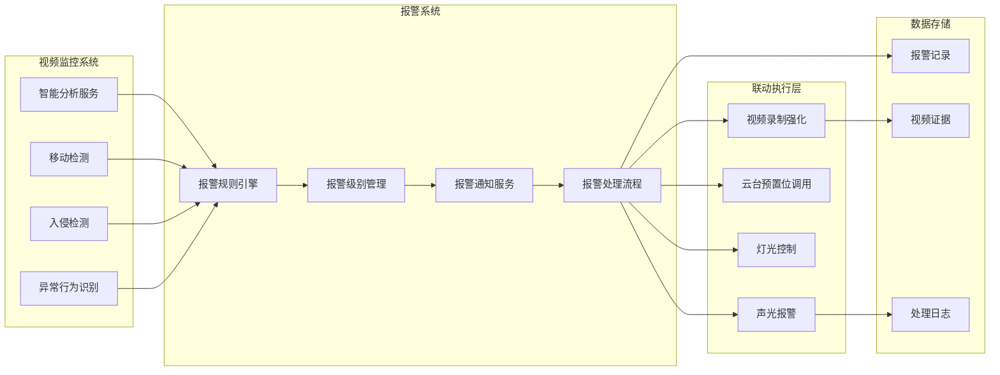
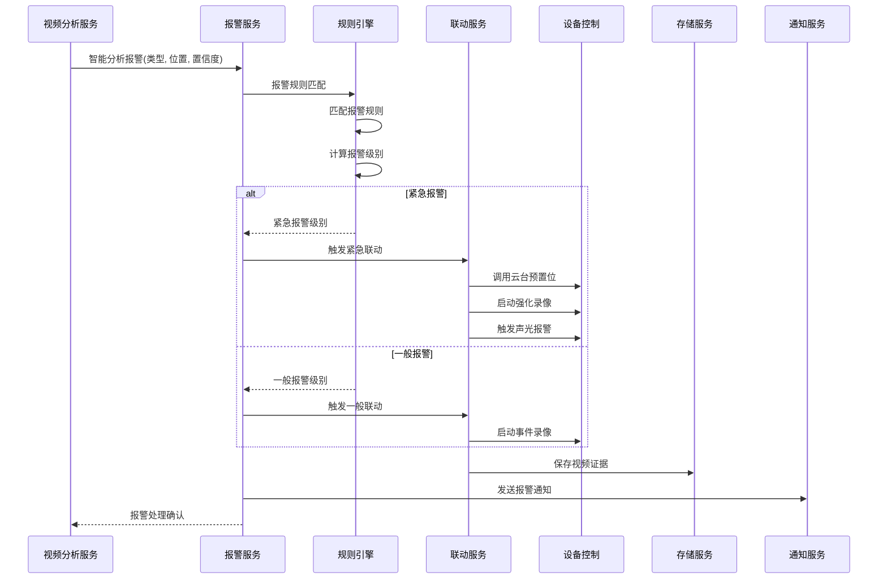
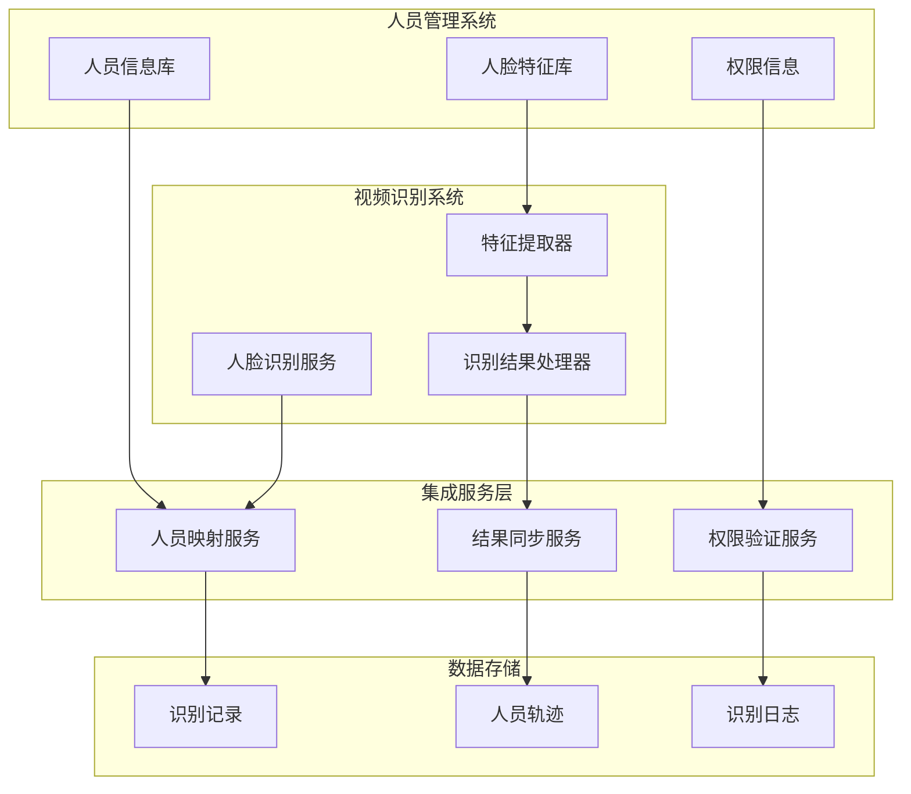
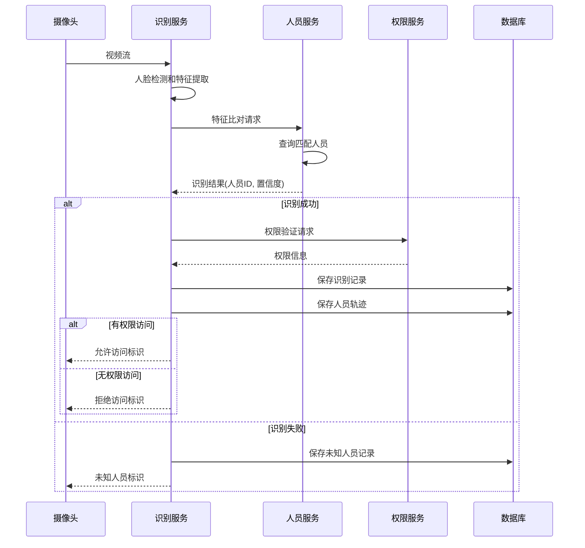
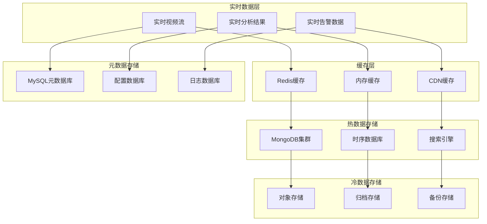
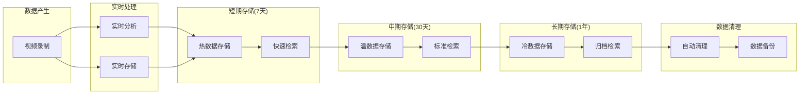

# 📹 视频监控业务集成方案

**文档版本**: v1.0.0
**创建日期**: 2025-11-16
**最后更新**: 2025-11-16
**维护者**: SmartAdmin Team

---

## 📋 概述

本文档详细描述了IOE-DREAM智慧园区一卡通管理平台中视频监控系统与各业务模块的集成方案。基于repowiki规范体系，采用四层架构设计，提供完整的视频监控业务集成架构和技术实现方案。

---

## 🏗️ 视频监控业务集成架构

### 📐 四层架构设计（遵循repowiki规范）



---

## 🔗 业务模块集成矩阵

### 📊 视频监控与各业务模块集成关系

| 业务模块 | 集成方式 | 数据流向 | 实时性要求 | 安全级别 | 集成复杂度 |
|----------|----------|----------|------------|----------|------------|
| 门禁管理 | WebSocket | 双向联动 | 极高 | 高 | 高 |
| 报警系统 | 事件驱动 | 单向推送 | 极高 | 极高 | 高 |
| 人员管理 | HTTP API | 单向查询 | 中 | 高 | 中 |
| 考勤管理 | RESTful API | 单向查询 | 中 | 中 | 低 |
| 消费管理 | HTTP API | 按需调用 | 低 | 中 | 低 |
| 区域管理 | WebSocket | 双向通讯 | 高 | 高 | 中 |

---

## 🚪 门禁管理模块集成

### 🎥 门禁视频联动架构



### 📡 门禁事件视频联动流程



### 💻 Controller层实现示例

```java
/**
 * 视频联动控制器 - 遵循repowiki规范
 */
@RestController
@RequestMapping("/api/smart/video/linkage")
public class VideoLinkageController {

    @Resource
    private VideoLinkageService videoLinkageService;

    /**
     * 门禁事件视频联动
     */
    @PostMapping("/access/event")
    @SaCheckLogin
    @SaCheckPermission("video:linkage:access")
    public ResponseDTO<VideoLinkageResult> handleAccessEvent(@Valid @RequestBody AccessEventRequest request) {
        VideoLinkageResult result = videoLinkageService.handleAccessEvent(request);
        return ResponseDTO.ok(result);
    }

    /**
     * 获取事件关联视频流
     */
    @GetMapping("/event/{eventId}/streams")
    @SaCheckLogin
    @SaCheckPermission("video:linkage:query")
    public ResponseDTO<List<VideoStreamVO>> getEventStreams(@PathVariable String eventId) {
        List<VideoStreamVO> streams = videoLinkageService.getEventStreams(eventId);
        return ResponseDTO.ok(streams);
    }
}
```

### 💼 Service层实现示例

```java
/**
 * 视频联动服务实现 - 遵循repowiki规范
 */
@Service
@Transactional(rollbackFor = Exception.class)
public class VideoLinkageServiceImpl implements VideoLinkageService {

    @Resource
    private VideoLinkageManager videoLinkageManager;

    @Resource
    private RedisUtil redisUtil;

    @Resource
    private WebSocketService webSocketService;

    @Override
    public VideoLinkageResult handleAccessEvent(AccessEventRequest request) {
        // 1. 解析事件类型和位置
        String eventType = request.getEventType();
        String location = request.getLocation();
        Long userId = request.getUserId();

        // 2. 获取关联摄像头
        List<CameraEntity> cameras = videoLinkageManager.getLocationCameras(location);

        // 3. 执行联动操作
        VideoLinkageResult result = new VideoLinkageResult();

        for (CameraEntity camera : cameras) {
            // 启动实时视频流
            String streamUrl = startRealTimeStream(camera.getCameraId());
            result.addStreamUrl(camera.getCameraId(), streamUrl);

            // 触发事件录像
            String recordId = startEventRecording(camera.getCameraId(), request);
            result.addRecordId(camera.getCameraId(), recordId);

            // 生成事件快照
            String snapshotId = generateEventSnapshot(camera.getCameraId(), request);
            result.addSnapshotId(camera.getCameraId(), snapshotId);

            // 推送到前端
            pushVideoStreamToFrontend(userId, camera.getCameraId(), streamUrl);
        }

        // 4. 缓存联动结果
        String cacheKey = "video:linkage:event:" + request.getEventId();
        redisUtil.setBean(cacheKey, result, 3600); // 缓存1小时

        return result;
    }

    private void pushVideoStreamToFrontend(Long userId, String cameraId, String streamUrl) {
        VideoStreamMessage message = new VideoStreamMessage();
        message.setUserId(userId);
        message.setCameraId(cameraId);
        message.setStreamUrl(streamUrl);
        message.setTimestamp(System.currentTimeMillis());

        webSocketService.sendToUser(userId, "video:linkage:stream", message);
    }
}
```

---

## 🚨 报警系统模块集成

### ⚠️ 视频报警联动架构



### 📡 视频报警处理流程



---

## 👥 人员管理模块集成

### 🔍 视频人员识别集成



### 📡 视频人员识别流程



---

## 📊 视频数据存储与管理

### 🗄️ 视频数据存储架构



### 📈 视频数据生命周期管理



---

## 🔧 集成实施指南

### 📋 实施阶段规划

#### 第一阶段：基础视频集成（2-3周）
- [ ] 完成视频设备接入
- [ ] 实现基础视频流功能
- [ ] 建立视频存储机制
- [ ] 完成基础播放功能

#### 第二阶段：智能分析集成（3-4周）
- [ ] 集成人脸识别功能
- [ ] 实现移动检测功能
- [ ] 建立行为分析能力
- [ ] 完成智能分析服务

#### 第三阶段：业务联动集成（2-3周）
- [ ] 实现门禁视频联动
- [ ] 完成报警视频联动
- [ ] 建立人员识别集成
- [ ] 实现数据同步机制

#### 第四阶段：优化和上线（1-2周）
- [ ] 性能优化调试
- [ ] 稳定性测试
- [ ] 安全加固
- [ ] 生产环境部署

### ⚠️ 技术风险控制

#### 性能风险
- **并发处理风险**：采用分布式架构和负载均衡
- **存储容量风险**：实施智能存储策略和数据生命周期管理
- **网络带宽风险**：优化视频压缩和传输算法

#### 安全风险
- **数据隐私风险**：加强数据加密和访问控制
- **系统安全风险**：实施安全审计和漏洞扫描
- **网络安全风险**：建立安全隔离和入侵检测

---

## 📚 参考规范

### 🔗 repowiki核心规范
- **[架构设计规范](../../../repowiki/zh/content/核心规范/架构设计规范.md)** - 四层架构设计标准
- **[Java编码规范](../../../repowiki/zh/content/核心规范/Java编码规范.md)** - Java代码编写标准
- **[API设计规范](../../../repowiki/zh/content/核心规范/RESTfulAPI设计规范.md)** - RESTful接口设计标准
- **[系统安全规范](../../../repowiki/zh/content/核心规范/系统安全规范.md)** - 系统安全要求

### 📖 项目规范文档
- **[架构设计规范](../../ARCHITECTURE_STANDARDS.md)** - IOE-DREAM架构设计要求
- **[通用开发检查清单](../../CHECKLISTS/通用开发检查清单.md)** - 代码质量保证清单
- **[智能视频系统开发检查清单](../../CHECKLISTS/智能视频系统开发检查清单.md)** - 视频功能专用检查清单

---

**⚠️ 重要提醒**: 本视频监控业务集成方案严格遵循repowiki规范体系和IOE-DREAM项目架构标准。所有集成开发工作必须按照本文档中的技术规范和实施计划执行，确保视频监控系统与各业务模块的稳定集成和安全运行。