# 💾 设备数据交互技术方案总览

**文档版本**: v1.0.0
**创建日期**: 2025-11-16
**最后更新**: 2025-11-16
**维护者**: SmartAdmin Team

---

## 📋 概述

本文档提供了IOE-DREAM设备管理系统中各类设备与业务模块数据交互的技术方案。详细描述了数据交互架构、通讯模式、消息格式、实时处理机制等关键技术实现。

---

## 🏗️ 数据交互架构概览

### 📊 数据交互架构图

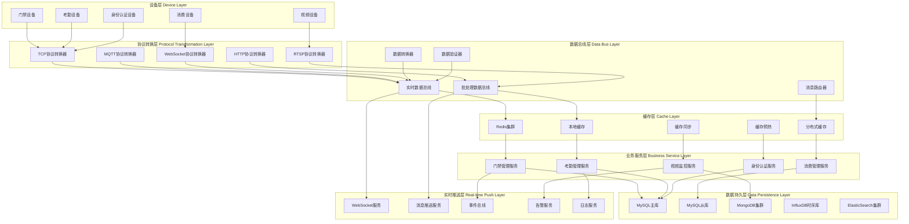

---

## 🚪 门禁设备数据交互方案

### 📋 门禁设备数据交互矩阵

| 数据类型 | 交互频率 | 数据格式 | 传输方式 | 存储位置 | 实时性 |
|----------|----------|----------|----------|----------|--------|
| 设备状态 | 实时 (秒级) | JSON | WebSocket | Redis | 极高 |
| 开门事件 | 实时 (秒级) | JSON | TCP/MQTT | MySQL+Redis | 极高 |
| 权限数据 | 按需 | JSON | HTTP | MySQL | 中 |
| 考勤记录 | 批量 (分钟级) | JSON | HTTP+队列 | MySQL | 中 |
| 设备配置 | 按需 | JSON | HTTP | MySQL+Redis | 低 |

### 🔧 门禁设备数据交互架构

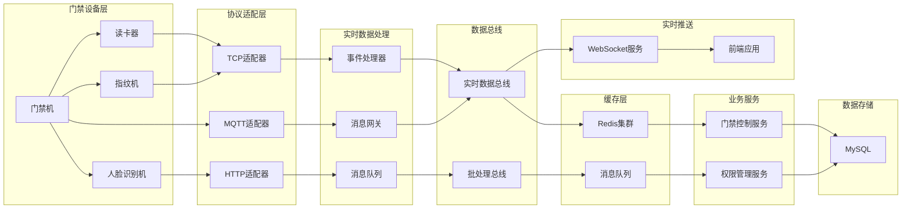

### 📡 门禁设备实时数据流

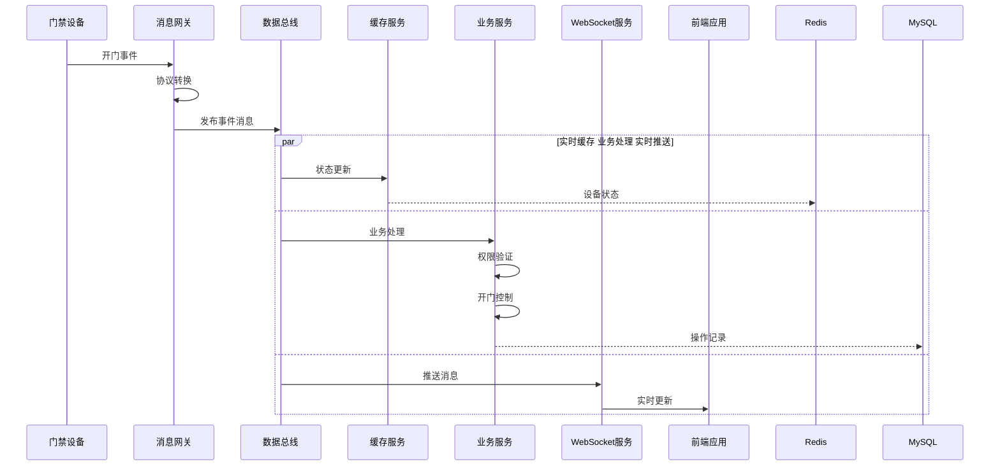

### 📊 门禁设备数据模型

#### 设备状态数据模型
```json
{
  "deviceId": "ACCESS_001",
  "deviceType": "ACCESS_CONTROLLER",
  "status": "ONLINE",
  "lastHeartbeat": 1634412345678,
  "networkInfo": {
    "ipAddress": "192.168.1.100",
    "port": 8080,
    "macAddress": "00:11:22:33:44:55"
  },
  "doorInfo": {
    "doorCount": 2,
    "openDoors": ["MAIN_DOOR"],
    "closedDoors": ["SIDE_DOOR"]
  }
}
```

#### 开门事件数据模型
```json
{
  "eventId": "EVENT_001",
  "deviceId": "ACCESS_001",
  "eventType": "DOOR_OPEN",
  "timestamp": 1634412345678,
  "userInfo": {
    "userId": "USER_001",
    "userName": "张三",
    "cardId": "CARD_123456",
    "accessType": "CARD",
    "department": "技术部"
  },
  "doorInfo": {
    "doorId": "MAIN_DOOR",
    "doorName": "主入口",
    "direction": "IN"
  },
  "result": {
    "success": true,
    "errorCode": "0",
    "errorMessage": "",
    "processingTime": 150
  }
}
```

---

## 📹 视频设备数据交互方案

### 📋 视频设备数据交互矩阵

| 数据类型 | 数据量 | 传输协议 | 处理方式 | 存储策略 | 实时性 |
|----------|--------|----------|----------|----------|--------|
| 视频流 | 2-12Mbps | RTSP/WebRTC | 实时流处理 | 内存缓存+文件存储 | 极高 |
| 控制指令 | 1-5KB | TCP/HTTP | 同步处理 | Redis | 高 |
| 设备状态 | 100B-1KB | HTTP | 定期采集 | Redis | 中 |
| 录像文件 | 10-100MB | FTP/HTTP | 异步处理 | 对象存储 | 低 |
| 告警事件 | 1-5KB | HTTP/HTTPS | 事件驱动 | MySQL+Redis | 高 |

### 🔧 视频设备数据交互架构

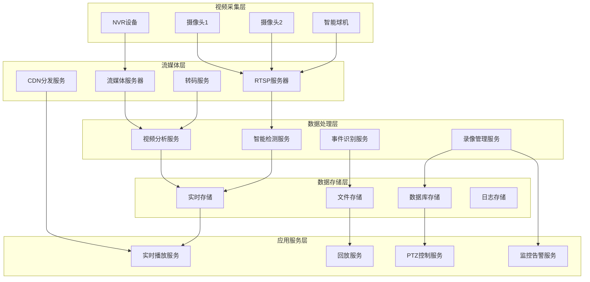

### 🎥 视频流处理架构

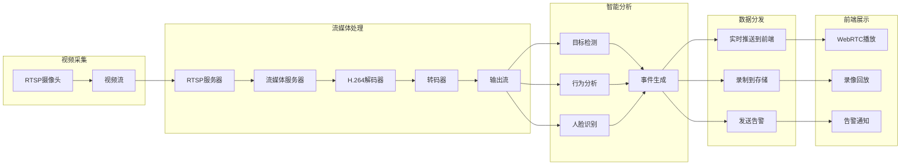

### 📡 视频设备控制流程

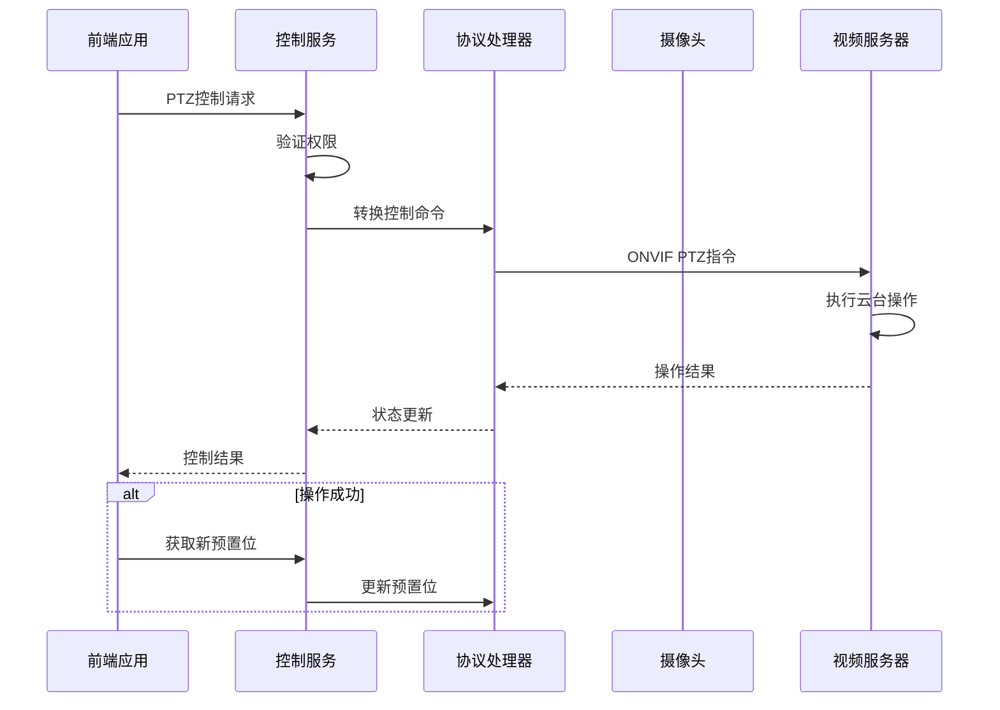

---

## ⏰ 考勤设备数据交互方案

### 📋 考勤设备数据交互矩阵

| 数据类型 | 同步频率 | 数据格式 | 传输方式 | 处理模式 | 一致性要求 |
|----------|----------|----------|----------|----------|------------|
| 考勤记录 | 实时 | JSON | HTTP/队列 | 实时处理 | 强一致性 |
| 人员信息 | 按需 | JSON | HTTP | 批量同步 | 最终一致性 |
| 排班信息 | 定时 | JSON | HTTP | 定时同步 | 最终一致性 |
| 设备状态 | 定时 | JSON | HTTP | 状态监控 | 弱一致性 |
| 生物特征 | 按需 | 二进制 | TCP | 特征同步 | 强一致性 |

### 🔧 考勤设备数据同步架构

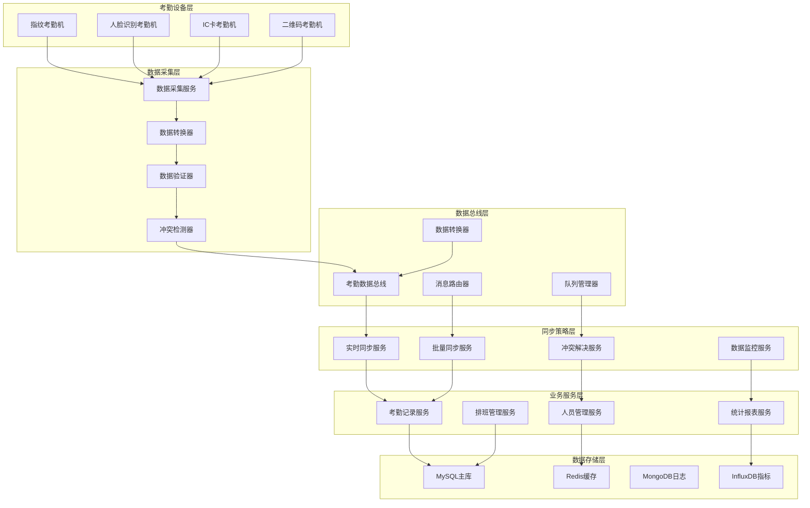

### 📡 考勤数据同步流程

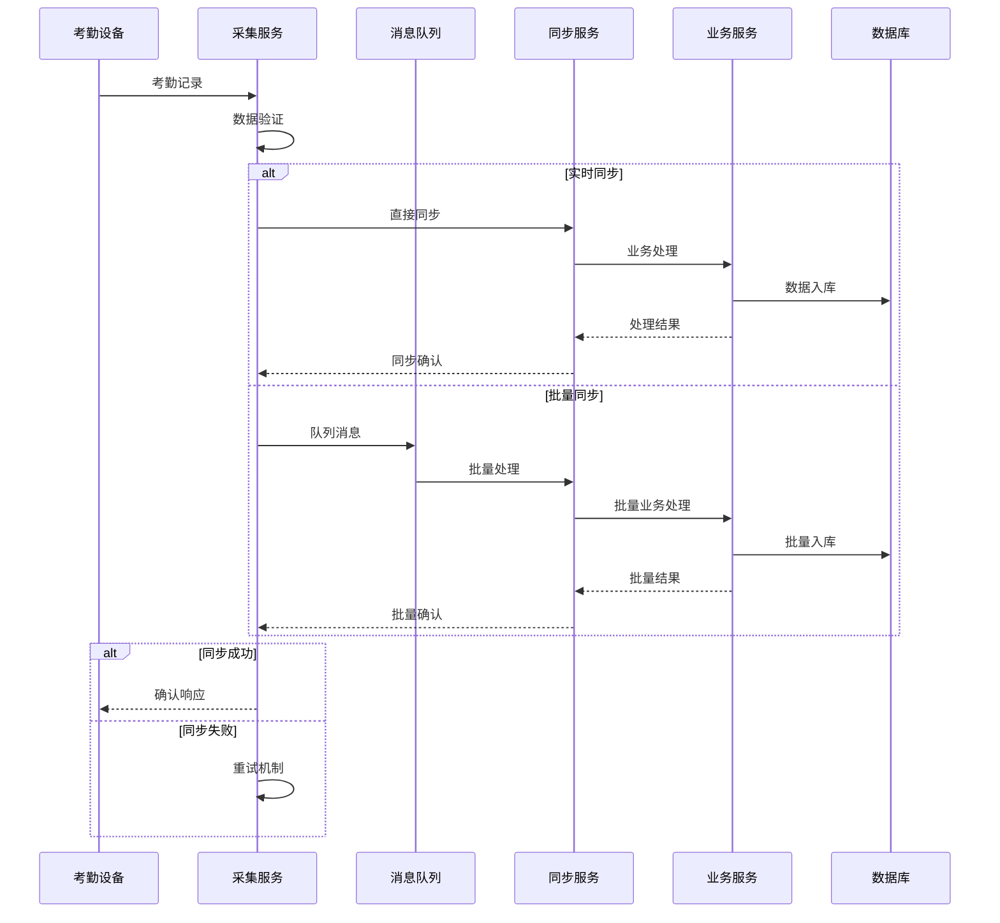

### 📊 考勤数据一致性模型

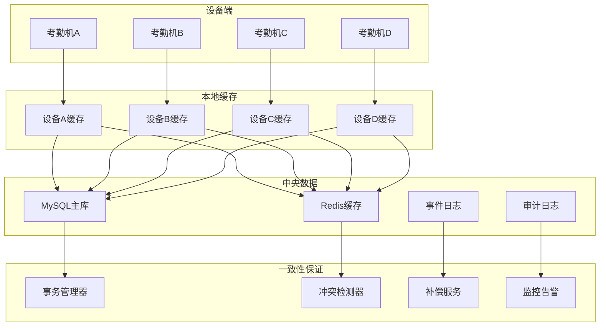

---

## 💳 消费设备数据交互方案

### 📋 消费设备数据交互矩阵

| 数据类型 | 交易金额 | 安全要求 | 传输方式 | 处理模式 | 实时性 |
|----------|----------|----------|----------|----------|--------|
| 交易请求 | 任意 | 极高 | WebSocket | 事务处理 | 极高 |
| 支付请求 | 任意 | 极高 | TCP | 支付网关 | 极高 |
| 账户余额 | 高价值 | 高 | HTTP+缓存 | 实时查询 | 高 |
| 交易记录 | 重要 | 高 | 消息队列 | 异步处理 | 中 |
| 设备状态 | 低价值 | 中 | 心跳检测 | 状态监控 | 中 |

### 🔧 消费设备交易处理架构

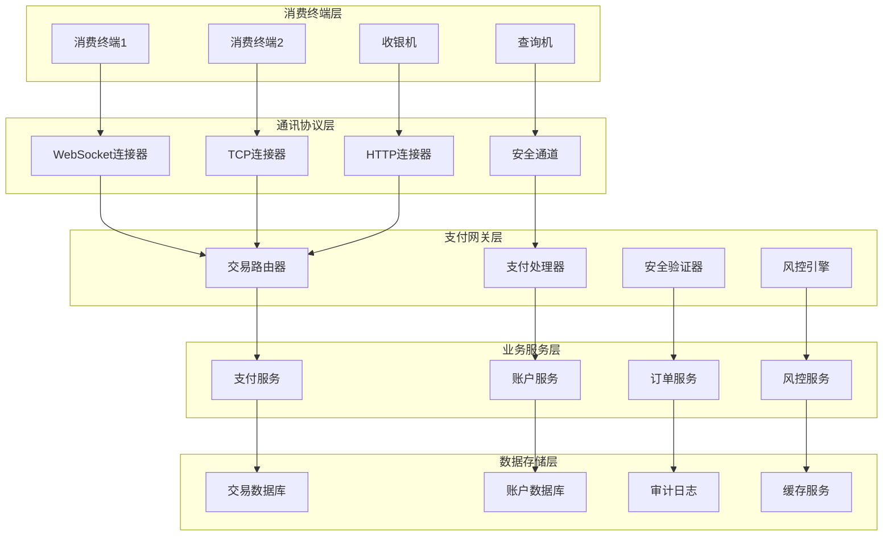

### 💰 消费交易处理流程

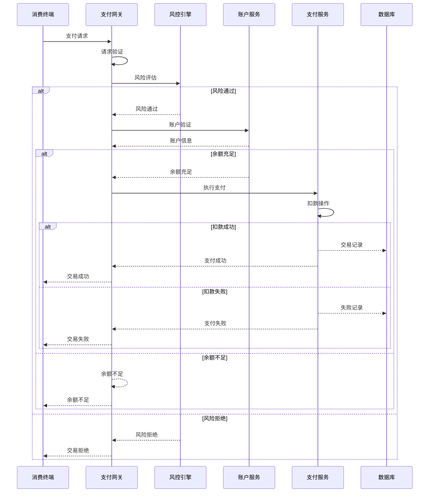

### 🔐 支付安全机制

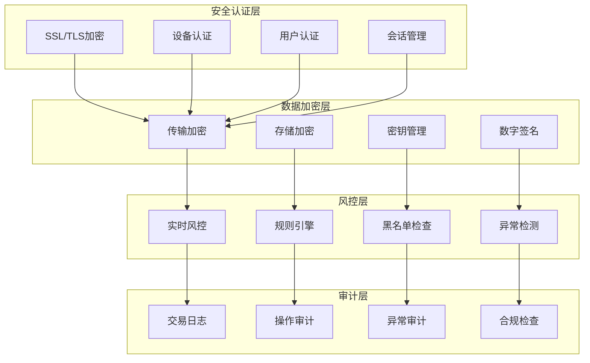

---

## 🔐 身份认证设备数据交互方案

### 📋 身份认证设备数据交互矩阵

| 数据类型 | 敏感度 | 存储位置 | 同步方式 | 认证速度 | 安全等级 |
|----------|--------|----------|----------|----------|----------|
| 生物特征 | 极高 | 加密存储 | 实时同步 | 1-3秒 | 最高 |
| 用户凭证 | 高 | 加密存储 | 按需同步 | <1秒 | 高 |
| 认证记录 | 中 | 数据库存储 | 实时记录 | 实时 | 高 |
| 设备状态 | 低 | 缓存存储 | 定期同步 | 100ms | 中 |

### 🔧 身份认证数据架构

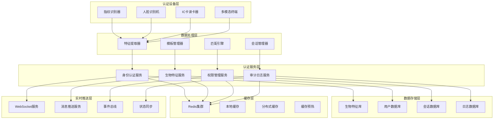

### 🔍 多模态认证流程

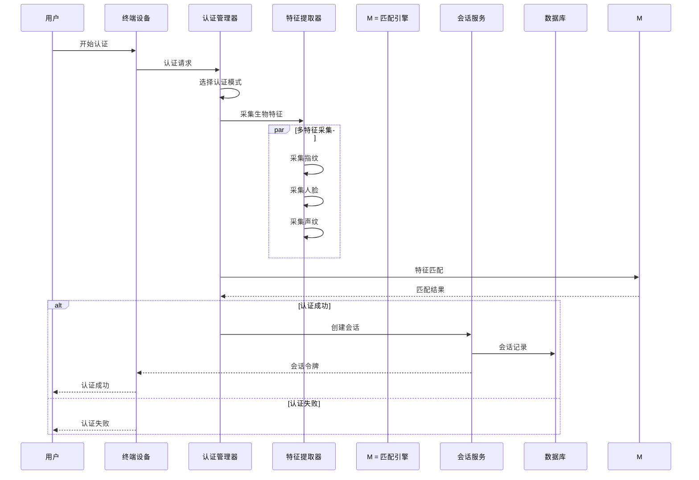

---

## 🔄 数据交互技术架构总结

### 📊 技术选型对比

| 技术方案 | 适用场景 | 优势 | 劣势 | 成本 |
|----------|----------|------|------|------|
| WebSocket | 实时交互 | 低延迟、双向通讯 | 需要保活 | 低 |
| HTTP/REST | 标准化接口 | 简单易用、广泛支持 | 单向请求、性能有限 | 中 |
| MQTT | IoT设备 | 轻量级、可靠传输 | 复杂协议、服务质量 | 中 |
| gRPC | 高性能API | 高性能、强类型 | 学习成本高、依赖生成 | 高 |
| WebRTC | 实时音视频 | 实时性高、P2P | 复杂配置、NAT穿透 | 高 |

### 🎯 架构设计原则

1. **分层解耦**: 设备层、协议层、业务层、数据层完全分离
2. **异步处理**: 实时数据和批量数据采用不同的处理策略
3. **容错设计**: 网络异常、设备故障的自动恢复机制
4. **安全可靠**: 数据传输加密、访问控制、审计日志
5. **可扩展性**: 支持新设备类型、新协议的快速接入

### 📈 性能优化策略

1. **连接池管理**: 复用设备连接，减少连接开销
2. **数据缓存**: 热点数据Redis缓存，减少数据库访问
3. **异步处理**: 使用消息队列处理非实时数据
4. **批量处理**: 收集批量数据后统一处理，提高效率
5. **负载均衡**: 分布式部署，支持水平扩展

---

**⚠️ 重要提醒**: 本文档定义的设备数据交互技术方案是设备管理系统的核心技术架构。所有新设备接入和业务功能开发都必须严格遵循本文档中的技术标准和架构设计原则。