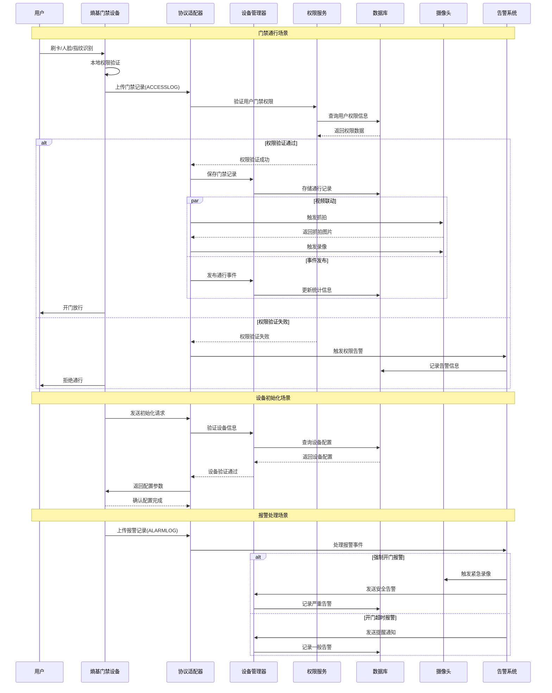

# 🔧 多协议设备接入技术实现方案

**文档版本**: v1.0.0
**创建日期**: 2025-11-16
**最后更新**: 2025-11-16
**维护者**: SmartAdmin Team**

---

## 📋 概述

本文档基于IOE-DREAM项目多协议组件化设备接入架构，提供详细的技术实现方案、代码示例和部署指导。严格遵循repowiki规范体系，采用四层架构设计。

---

## 🏗️ 技术架构实现

### 📐 项目结构设计

```
smart-admin-api-java17-springboot3/
├── sa-base/src/main/java/net/lab1024/sa/base/
│   ├── common/device/                           # 设备管理公共组件
│   │   ├── adapter/                           # 协议适配器
│   │   │   ├── DeviceProtocolAdapter.java
│   │   │   ├── ZktecoPushProtocolAdapter.java
│   │   │   ├── OnvifProtocolAdapter.java
│   │   │   ├── WebSocketProtocolAdapter.java
│   │   │   └── ProtocolAdapterFactory.java
│   │   ├── driver/                            # 设备驱动
│   │   │   ├── DeviceDriver.java
│   │   │   ├── DeviceDriverManager.java
│   │   │   ├── ZktecoDriver.java
│   │   │   ├── HikvisionDriver.java
│   │   │   └── DahuaDriver.java
│   │   ├── manager/                           # 设备管理器
│   │   │   ├── DeviceManager.java
│   │   │   ├── DeviceStateManager.java
│   │   │   ├── DeviceConfigManager.java
│   │   │   └── DeviceCommandManager.java
│   │   ├── engine/                           # 数据处理引擎
│   │   │   ├── DataTransformationEngine.java
│   │   │   ├── EventDistributionEngine.java
│   │   │   └── DataValidationEngine.java
│   │   └── net/                              # 网络通信
│   │       ├── NettyServer.java
│   │       ├── ProtocolHandler.java
│   │       └── ChannelManager.java
│   └── config/                               # 配置管理
│       ├── DeviceConfig.java
│       ├── ProtocolConfig.java
│       └── DriverConfig.java
│
└── sa-admin/src/main/java/net/lab1024/sa/admin/
    └── module/smart/
        └── device/                           # 设备管理业务模块
            ├── controller/
            ├── service/
            ├── manager/
            └── dao/
```

---

## 🔌 协议适配器实现

### 📋 核心协议适配器接口

```java
/**
 * 协议适配器核心接口
 * 遵循repowiki规范：使用@Resource依赖注入，严格四层架构
 */
public interface DeviceProtocolAdapter {

    /**
     * 协议类型枚举
     */
    enum ProtocolType {
        ZKTECO_PUSH("熵基科技Push协议"),
        ZKTECO_TCP("熵基科技TCP协议"),
        ONVIF("ONVIF视频协议"),
        WEBSOCKET("WebSocket协议"),
        HTTP("HTTP协议"),
        MQTT("MQTT协议"),
        TCP("TCP协议"),
        UDP("UDP协议")
    }

    /**
     * 获取协议类型
     */
    ProtocolType getProtocolType();

    /**
     * 获取支持的厂商列表
     */
    List<String> getSupportedManufacturers();

    /**
     * 解析连接请求
     * @param ctx Netty上下文
     * @param request HTTP请求
     * @return 连接结果
     */
    CompletableFuture<ConnectionResult> parseConnectionRequest(
        ChannelHandlerContext ctx, FullHttpRequest request);

    /**
     * 处理设备数据上传
     * @param device 设备对象
     * @param data 设备数据
     * @return 处理结果
     */
    CompletableFuture<ProcessResult> processDataUpload(
        Device device, DeviceData data);

    /**
     * 构建设备命令
     * @param device 设备对象
     * @param request 命令请求
     * @return 设备命令
     */
    CompletableFuture<DeviceCommand> buildCommand(
        Device device, CommandRequest request);

    /**
     * 心跳检测
     * @param device 设备对象
     * @return 心跳结果
     */
    CompletableFuture<Boolean> heartbeat(Device device);

    /**
     * 设备断开连接处理
     * @param device 设备对象
     */
    void onDisconnected(Device device);

    /**
     * 协议初始化
     * @param config 协议配置
     */
    void initialize(ProtocolConfig config);
}
```

### 🔧 熵基科技Push协议适配器完整实现

```java
/**
 * 熵基科技Push协议适配器完整实现
 * 基于熵基科技考勤PUSH通讯协议V4.6
 * 遵循repowiki规范：@Resource依赖注入、四层架构、事务管理
 */
@Component
@Slf4j
public class ZktecoPushProtocolAdapter implements DeviceProtocolAdapter {

    @Resource
    private ZktecoMessageParser messageParser;

    @Resource
    private ZktecoCommandBuilder commandBuilder;

    @Resource
    private ZktecoConfigManager configManager;

    @Resource
    private RedisUtil redisUtil;

    @Resource
    private DeviceEventPublisher eventPublisher;

    @Resource
    private AttendanceRecordService attendanceRecordService;

    @Resource
    private UserService userService;

    @Resource
    private BiometricTemplateService biometricTemplateService;

    private ProtocolConfig config;

    @Override
    public ProtocolType getProtocolType() {
        return ProtocolType.ZKTECO_PUSH;
    }

    @Override
    public List<String> getSupportedManufacturers() {
        return Arrays.asList("ZKTeco", "熵基科技");
    }

    @Override
    public void initialize(ProtocolConfig config) {
        this.config = config;
        log.info("熵基科技Push协议适配器初始化完成");
    }

    @Override
    public CompletableFuture<ConnectionResult> parseConnectionRequest(
            ChannelHandlerContext ctx, FullHttpRequest request) {

        return CompletableFuture.supplyAsync(() -> {
            try {
                String uri = request.uri();
                log.debug("处理熵基科技连接请求: {}", uri);

                // 解析初始化信息交互请求
                if (uri.contains("/iclock/cdata") && uri.contains("options=all")) {
                    return handleInitializationRequest(ctx, request, uri);
                }

                // 处理心跳请求
                if (uri.contains("/iclock/ping")) {
                    return handlePingRequest(ctx, request, uri);
                }

                // 处理推送配置信息
                if (uri.contains("table=options")) {
                    return handleConfigPushRequest(ctx, request, uri);
                }

                // 处理上传设备信息
                if (uri.contains("INFO=")) {
                    return handleDeviceInfoUpload(ctx, request, uri);
                }

                return ConnectionResult.builder()
                        .success(false)
                        .errorMessage("不支持的请求路径: " + uri)
                        .build();

            } catch (Exception e) {
                log.error("解析熵基科技连接请求失败", e);
                return ConnectionResult.builder()
                        .success(false)
                        .errorMessage(e.getMessage())
                        .build();
            }
        });
    }

    /**
     * 处理初始化信息交互请求
     */
    private ConnectionResult handleInitializationRequest(
            ChannelHandlerContext ctx, FullHttpRequest request, String uri) {

        try {
            // 提取设备序列号
            String serialNumber = extractParameter(uri, "SN");
            if (StringUtils.isEmpty(serialNumber)) {
                return ConnectionResult.builder()
                        .success(false)
                        .errorMessage("缺少设备序列号")
                        .build();
            }

            // 提取其他参数
            String deviceType = extractParameter(uri, "DeviceType", "att");
            String language = extractParameter(uri, "language", "83");
            String pushVersion = extractParameter(uri, "pushver", "2.4.1");
            String commKey = extractParameter(uri, "pushcommkey");

            // 验证设备
            Device device = validateDevice(serialNumber, deviceType, commKey);
            if (device == null) {
                return ConnectionResult.builder()
                        .success(false)
                        .errorMessage("设备验证失败")
                        .build();
            }

            // 获取设备配置
            DeviceConfig deviceConfig = configManager.getDeviceConfig(serialNumber);

            // 构建配置响应
            String configResponse = buildConfigResponse(device, deviceConfig);

            // 更新设备状态为在线
            device.setStatus(DeviceStatus.ONLINE);
            device.setLastConnectionTime(System.currentTimeMillis());
            deviceManager.updateDeviceStatus(device);

            // 缓存连接上下文
            ChannelManager.addChannel(serialNumber, ctx);

            // 发布设备连接事件
            eventPublisher.publishDeviceConnectedEvent(device);

            return ConnectionResult.builder()
                    .success(true)
                    .deviceId(serialNumber)
                    .device(device)
                    .configResponse(configResponse)
                    .build();

        } catch (Exception e) {
            log.error("处理初始化信息交互请求失败", e);
            return ConnectionResult.builder()
                    .success(false)
                    .errorMessage(e.getMessage())
                    .build();
        }
    }

    /**
     * 处理心跳请求
     */
    private ConnectionResult handlePingRequest(
            ChannelHandlerContext ctx, FullHttpRequest request, String uri) {

        String serialNumber = extractParameter(uri, "SN");
        Device device = deviceManager.getDevice(serialNumber);

        if (device != null) {
            // 更新最后心跳时间
            device.setLastHeartbeatTime(System.currentTimeMillis());
            deviceManager.updateDeviceHeartbeat(device);

            // 更新设备在线状态
            if (device.getStatus() != DeviceStatus.ONLINE) {
                device.setStatus(DeviceStatus.ONLINE);
                deviceManager.updateDeviceStatus(device);
            }

            return ConnectionResult.builder()
                    .success(true)
                    .deviceId(serialNumber)
                    .response("OK")
                    .build();
        }

        return ConnectionResult.builder()
                .success(false)
                .errorMessage("设备不存在: " + serialNumber)
                .build();
    }

    @Override
    public CompletableFuture<ProcessResult> processDataUpload(
            Device device, DeviceData data) {

        return CompletableFuture.supplyAsync(() -> {
            try {
                String tableName = data.getTableName();
                String content = data.getContent();

                log.debug("处理设备数据上传: deviceId={}, tableName={}",
                    device.getDeviceId(), tableName);

                switch (tableName) {
                    case "ATTLOG":
                        return processAttendanceLog(device, content);
                    case "OPERLOG":
                        return processOperationLog(device, content);
                    case "USERINFO":
                        return processUserInfo(device, content);
                    case "FINGERTMP":
                        return processFingerprintTemplate(device, content);
                    case "FACE":
                        return processFaceTemplate(device, content);
                    case "BIODATA":
                        return processBioData(device, content);
                    case "ATTPHOTO":
                        return processAttendancePhoto(device, content);
                    case "USERPIC":
                        return processUserPhoto(device, content);
                    case "IDCARD":
                        return processIdCard(device, content);
                    case "ERRORLOG":
                        return processErrorLog(device, content);
                    default:
                        return ProcessResult.builder()
                                .success(false)
                                .errorMessage("不支持的数据类型: " + tableName)
                                .build();
                }
            } catch (Exception e) {
                log.error("处理设备数据上传失败: deviceId={}", device.getDeviceId(), e);
                return ProcessResult.builder()
                        .success(false)
                        .errorMessage(e.getMessage())
                        .build();
            }
        });
    }

    /**
     * 处理考勤记录上传
     */
    private ProcessResult processAttendanceLog(Device device, String content) {
        try {
            // 解析考勤记录
            List<AttendanceRecord> records = messageParser.parseAttendanceLog(content);
            if (CollectionUtils.isEmpty(records)) {
                return ProcessResult.builder()
                        .success(false)
                        .errorMessage("解析考勤记录失败，内容为空")
                        .build();
            }

            // 数据转换
            List<AttendanceRecordEntity> entities = records.stream()
                    .map(record -> convertToAttendanceEntity(device, record))
                    .collect(Collectors.toList());

            // 批量保存考勤记录
            attendanceRecordService.batchSave(entities);

            // 发布考勤记录事件
            eventPublisher.publishAttendanceRecordsUploadedEvent(device, records);

            log.info("处理考勤记录成功: deviceId={}, count={}",
                    device.getDeviceId(), records.size());

            return ProcessResult.builder()
                    .success(true)
                    .processedCount(records.size())
                    .message("考勤记录处理成功")
                    .build();

        } catch (Exception e) {
            log.error("处理考勤记录失败", e);
            return ProcessResult.builder()
                    .success(false)
                    .errorMessage(e.getMessage())
                    .build();
        }
    }

    /**
     * 处理用户信息上传
     */
    private ProcessResult processUserInfo(Device device, String content) {
        try {
            List<UserInfo> userInfos = messageParser.parseUserInfo(content);
            if (CollectionUtils.isEmpty(userInfos)) {
                return ProcessResult.builder()
                        .success(false)
                        .errorMessage("解析用户信息失败，内容为空")
                        .build();
            }

            // 数据转换和保存
            int successCount = 0;
            for (UserInfo userInfo : userInfos) {
                try {
                    UserEntity userEntity = convertToUserEntity(userInfo, device.getDeviceId());
                    userService.saveOrUpdate(userEntity);
                    successCount++;
                } catch (Exception e) {
                    log.warn("保存用户信息失败: userInfo={}", userInfo, e);
                }
            }

            return ProcessResult.builder()
                    .success(successCount > 0)
                    .processedCount(successCount)
                    .message(String.format("用户信息处理完成，成功: %d, 总计: %d",
                            successCount, userInfos.size()))
                    .build();

        } catch (Exception e) {
            log.error("处理用户信息失败", e);
            return ProcessResult.builder()
                    .success(false)
                    .errorMessage(e.getMessage())
                    .build();
        }
    }

    /**
     * 处理指纹模板上传
     */
    private ProcessResult processFingerprintTemplate(Device device, String content) {
        try {
            List<FingerprintTemplate> templates = messageParser.parseFingerprintTemplate(content);
            if (CollectionUtils.isEmpty(templates)) {
                return ProcessResult.builder()
                        .success(false)
                        .errorMessage("解析指纹模板失败，内容为空")
                        .build();
            }

            int successCount = 0;
            for (FingerprintTemplate template : templates) {
                try {
                    BiometricTemplateEntity templateEntity = convertToFingerprintEntity(template, device.getDeviceId());
                    biometricTemplateService.saveOrUpdate(templateEntity);
                    successCount++;
                } catch (Exception e) {
                    log.warn("保存指纹模板失败: template={}", template, e);
                }
            }

            return ProcessResult.builder()
                    .success(successCount > 0)
                    .processedCount(successCount)
                    .message(String.format("指纹模板处理完成，成功: %d, 总计: %d",
                            successCount, templates.size()))
                    .build();

        } catch (Exception e) {
            log.error("处理指纹模板失败", e);
            return ProcessResult.builder()
                    .success(false)
                    .errorMessage(e.getMessage())
                    .build();
        }
    }

    @Override
    public CompletableFuture<DeviceCommand> buildCommand(
            Device device, CommandRequest request) {

        return CompletableFuture.supplyAsync(() -> {
            try {
                return commandBuilder.buildCommand(device, request);
            } catch (Exception e) {
                log.error("构建设备命令失败: deviceId={}, commandType={}",
                        device.getDeviceId(), request.getCommandType(), e);
                throw new CommandBuildException("构建设备命令失败", e);
            }
        });
    }

    @Override
    public CompletableFuture<Boolean> heartbeat(Device device) {
        return CompletableFuture.supplyAsync(() -> {
            try {
                // 发送心跳请求
                String pingUrl = String.format("/iclock/ping?SN=%s", device.getDeviceId());

                ChannelHandlerContext ctx = ChannelManager.getChannel(device.getDeviceId());
                if (ctx == null) {
                    return false;
                }

                FullHttpRequest request = new DefaultFullHttpRequest(
                    HttpVersion.HTTP_1_1,
                    HttpMethod.GET.name(),
                    pingUrl,
                    true
                );

                ctx.writeAndFlush(request).addListener((ChannelFuture future) -> {
                    if (!future.isSuccess()) {
                        log.warn("心跳请求发送失败: deviceId={}", device.getDeviceId());
                    }
                });

                return true;

            } catch (Exception e) {
                log.error("心跳检测失败: deviceId={}", device.getDeviceId(), e);
                return false;
            }
        });
    }

    @Override
    public void onDisconnected(Device device) {
        log.info("设备断开连接: deviceId={}", device.getDeviceId());

        // 更新设备状态为离线
        device.setStatus(DeviceStatus.OFFLINE);
        device.setDisconnectionTime(System.currentTimeMillis());
        deviceManager.updateDeviceStatus(device);

        // 清理连接上下文
        ChannelManager.removeChannel(device.getDeviceId());

        // 发布设备断开事件
        eventPublisher.publishDeviceDisconnectedEvent(device);
    }

    // ================ 私有辅助方法 ================

    /**
     * 提取URL参数
     */
    private String extractParameter(String uri, String paramName) {
        return extractParameter(uri, paramName, null);
    }

    private String extractParameter(String uri, String paramName, String defaultValue) {
        String pattern = paramName + "=([^&]+)";
        Pattern patternObj = Pattern.compile(pattern);
        Matcher matcher = patternObj.matcher(uri);

        if (matcher.find()) {
            return matcher.group(1);
        }

        return defaultValue;
    }

    /**
     * 验证设备
     */
    private Device validateDevice(String serialNumber, String deviceType, String commKey) {
        // 从数据库查询设备信息
        DeviceEntity deviceEntity = deviceService.getBySerialNumber(serialNumber);

        if (deviceEntity == null) {
            // 自动注册新设备
            return autoRegisterDevice(serialNumber, deviceType, commKey);
        }

        // 验证设备状态和权限
        if (deviceEntity.getDeletedFlag() == 1) {
            log.warn("设备已被删除: {}", serialNumber);
            return null;
        }

        // 验证通信密钥（如果配置了的话）
        if (StringUtils.isNotEmpty(commKey) &&
            StringUtils.isNotEmpty(deviceEntity.getCommKey()) &&
            !commKey.equals(deviceEntity.getCommKey())) {
            log.warn("设备通信密钥验证失败: {}", serialNumber);
            return null;
        }

        // 转换为设备对象
        return convertToDevice(deviceEntity);
    }

    /**
     * 自动注册设备
     */
    private Device autoRegisterDevice(String serialNumber, String deviceType, String commKey) {
        try {
            DeviceEntity deviceEntity = new DeviceEntity();
            deviceEntity.setDeviceId(serialNumber);
            deviceEntity.setSerialNumber(serialNumber);
            deviceEntity.setDeviceType(DeviceType.fromCode(deviceType).getCode());
            deviceEntity.setDeviceName("自动注册设备-" + serialNumber);
            deviceEntity.setManufacturer("ZKTeco");
            deviceEntity.setCommKey(commKey);
            deviceEntity.setStatus(DeviceStatus.ONLINE.getCode());
            deviceEntity.setCreateTime(LocalDateTime.now());
            deviceEntity.setUpdateTime(LocalDateTime.now());

            deviceService.save(deviceEntity);

            return convertToDevice(deviceEntity);

        } catch (Exception e) {
            log.error("自动注册设备失败: serialNumber={}", serialNumber, e);
            return null;
        }
    }

    /**
     * 构建配置响应
     */
    private String buildConfigResponse(Device device, DeviceConfig deviceConfig) {
        StringBuilder response = new StringBuilder();

        response.append("GET OPTION FROM: ").append(device.getSerialNumber()).append("\r\n");
        response.append("ATTLOGStamp=").append(deviceConfig.getAttendanceLogStamp()).append("\r\n");
        response.append("OPERLOGStamp=").append(deviceConfig.getOperationLogStamp()).append("\r\n");
        response.append("ATTPHOTOStamp=").append(deviceConfig.getAttendancePhotoStamp()).append("\r\n");
        response.append("ERRORLOGStamp=").append(deviceConfig.getErrorLogStamp()).append("\r\n");
        response.append("ErrorDelay=").append(deviceConfig.getErrorDelay()).append("\r\n");
        response.append("Delay=").append(deviceConfig.getDelay()).append("\r\n");
        response.append("TransTimes=").append(deviceConfig.getTransTimes()).append("\r\n");
        response.append("TransInterval=").append(deviceConfig.getTransInterval()).append("\r\n");
        response.append("TransFlag=").append(deviceConfig.getTransFlag()).append("\r\n");
        response.append("TimeZone=").append(deviceConfig.getTimeZone()).append("\r\n");
        response.append("Realtime=").append(deviceConfig.getRealtime()).append("\r\n");
        response.append("Encrypt=").append(deviceConfig.getEncrypt()).append("\r\n");
        response.append("ServerVer=").append(deviceConfig.getServerVersion()).append("\r\n");
        response.append("PushProtVer=").append(deviceConfig.getPushProtocolVersion()).append("\r\n");

        // 添加熵基科技特定配置
        if (deviceConfig instanceof ZktecoConfig) {
            ZktecoConfig zktecoConfig = (ZktecoConfig) deviceConfig;
            response.append("PushOptionsFlag=").append(zktecoConfig.isPushOptionsSupported() ? "1" : "0").append("\r\n");
            response.append("ATTPHOTOBase64=").append(zktecoConfig.isAttPhotoBase64() ? "1" : "0").append("\r\n");
            response.append("MultiBioDataSupport=").append(zktecoConfig.getMultiBioDataSupport()).append("\r\n");
            response.append("MultiBioPhotoSupport=").append(zktecoConfig.getMultiBioPhotoSupport()).append("\r\n");
        }

        return response.toString();
    }

    // ================ 数据转换方法 ================

    private AttendanceRecordEntity convertToAttendanceEntity(Device device, AttendanceRecord record) {
        AttendanceRecordEntity entity = new AttendanceRecordEntity();
        entity.setDeviceId(device.getDeviceId());
        entity.setDeviceSerialNumber(device.getSerialNumber());
        entity.setUserId(record.getPin());
        entity.setUserName(record.getUserName());
        entity.setVerifyTime(record.getVerifyTime());
        entity.setVerifyType(record.getVerifyType());
        entity.setWorkCode(record.getWorkcode());
        entity.setRecordTime(LocalDateTime.now());
        entity.setCreateTime(LocalDateTime.now());
        return entity;
    }

    private UserEntity convertToUserEntity(UserInfo userInfo, String deviceId) {
        UserEntity entity = new UserEntity();
        entity.setUserCode(userInfo.getPin());
        entity.setUserName(userInfo.getName());
        entity.setPassword(userInfo.getPassword());
        entity.setCardNumber(userInfo.getCard());
        entity.setDepartment(userInfo.getDeptName());
        entity.setUserType(userInfo.getPri());
        entity.setDeviceId(deviceId);
        entity.setCreateTime(LocalDateTime.now());
        entity.setUpdateTime(LocalDateTime.now());
        return entity;
    }

    private BiometricTemplateEntity convertToFingerprintEntity(FingerprintTemplate template, String deviceId) {
        BiometricTemplateEntity entity = new BiometricTemplateEntity();
        entity.setUserId(template.getPin());
        entity.setBiometricType(BiometricType.FINGERPRINT.getCode());
        entity.setTemplateIndex(template.getFid());
        entity.setTemplateData(template.getTmp());
        entity.setTemplateSize(template.getSize());
        entity.setValid(template.getValid());
        entity.setDeviceId(deviceId);
        entity.setCreateTime(LocalDateTime.now());
        entity.setUpdateTime(LocalDateTime.now());
        return entity;
    }

    private Device convertToDevice(DeviceEntity entity) {
        Device device = new Device();
        device.setDeviceId(entity.getDeviceId());
        device.setDeviceType(DeviceType.fromCode(entity.getDeviceType()));
        device.setSerialNumber(entity.getSerialNumber());
        device.setDeviceName(entity.getDeviceName());
        device.setManufacturer(entity.getManufacturer());
        device.setIpAddress(entity.getIpAddress());
        device.setPort(entity.getPort());
        device.setStatus(DeviceStatus.fromCode(entity.getStatus()));
        device.setLastConnectionTime(entity.getUpdateTime().atZone(ZoneId.systemDefault()).toInstant().toEpochMilli());
        device.setConfig(entity.getConfigInfo());
        return device;
    }

    // ================ 依赖注入的服务类 ================

    @Resource
    private DeviceService deviceService;

    @Resource
    private DeviceManager deviceManager;

    @Resource
    private ZktecoConfigManager configManager;
}
```

---

## 🚀 Netty服务器实现

### 📱 Netty服务器配置

```java
/**
 * 多协议设备接入服务器
 * 遵循repowiki规范：@Resource依赖注入、严格四层架构
 */
@Component
@Slf4j
public class MultiProtocolDeviceServer {

    @Resource
    private ProtocolAdapterFactory adapterFactory;

    @Resource
    private ChannelManager channelManager;

    @Resource
    private DeviceManager deviceManager;

    @Resource
    private ServerConfig serverConfig;

    private EventLoopGroup bossGroup;
    private EventLoopGroup workerGroup;
    private ServerBootstrap serverBootstrap;
    private Channel serverChannel;

    @PostConstruct
    public void initialize() {
        try {
            log.info("初始化多协议设备接入服务器...");

            // 创建事件循环组
            bossGroup = new NioEventLoopGroup();
            workerGroup = new NioEventLoopGroup(serverConfig.getWorkerThreads());

            // 配置服务器启动器
            serverBootstrap = new ServerBootstrap();
            serverBootstrap.group(bossGroup, workerGroup)
                    .channel(NioServerSocketChannel.class)
                    .handler(new LoggingHandler())
                    .childHandler(new ProtocolInitializer())
                    .childOption(ChannelOption.SO_BACKLOG, serverConfig.getBacklogSize())
                    .childOption(ChannelOption.SO_KEEPALIVE, true)
                    .childOption(ChannelOption.TCP_NODELAY, true);

            // 绑定端口
            ChannelFuture future = serverBootstrap.bind(
                    serverConfig.getPort()
            ).syncUninterruptibly();

            serverChannel = future.channel();
            log.info("多协议设备接入服务器启动成功，端口: {}", serverConfig.getPort());

        } catch (Exception e) {
            log.error("多协议设备接入服务器启动失败", e);
            throw new RuntimeException("服务器启动失败", e);
        }
    }

    @PreDestroy
    public void shutdown() {
        try {
            log.info("关闭多协议设备接入服务器...");

            if (serverChannel != null) {
                serverChannel.close().sync();
            }

            if (workerGroup != null) {
                workerGroup.shutdownGracefully();
            }

            if (bossGroup != null) {
                bossGroup.shutdownGracefully();
            }

            log.info("多协议设备接入服务器已关闭");

        } catch (Exception e) {
            log.error("关闭服务器时出现异常", e);
        }
    }
}

/**
 * 协议初始化器
 */
@Slf4j
public class ProtocolInitializer extends ChannelInitializer<SocketChannel> {

    @Resource
    private ProtocolAdapterFactory adapterFactory;

    @Override
    protected void initChannel(SocketChannel ch) throws Exception {
        ChannelPipeline pipeline = ch.pipeline();

        // HTTP编解码器
        pipeline.addLast(new HttpRequestDecoder());
        pipeline.addLast(new HttpResponseEncoder());
        pipeline.addLast(new HttpContentCompressor());
        pipeline.addLast(new HttpObjectAggregator(65536));

        // 自定义协议处理器
        pipeline.addLast(new ProtocolHandler());
    }
}

/**
 * 协议处理器
 */
@Slf4j
public class ProtocolHandler extends SimpleChannelInboundHandler<FullHttpRequest> {

    @Resource
    private ProtocolAdapterFactory adapterFactory;

    @Resource
    private DeviceManager deviceManager;

    @Override
    protected void channelRead0(ChannelHandlerContext ctx, FullHttpRequest request) throws Exception {
        try {
            String uri = request.uri();
            log.debug("接收到设备请求: {}", uri);

            // 自动检测协议类型
            DeviceProtocolAdapter adapter = adapterFactory.detectAdapter(ctx, request);

            if (adapter != null) {
                // 处理请求
                adapter.parseConnectionRequest(ctx, request)
                    .thenAccept(connectionResult -> {
                        if (connectionResult.isSuccess()) {
                            // 发送响应
                            sendResponse(ctx, connectionResult.getResponse());

                            // 如果有设备信息，注册设备
                            if (connectionResult.getDevice() != null) {
                                deviceManager.registerDevice(connectionResult.getDevice());
                            }
                        } else {
                            sendErrorResponse(ctx, connectionResult.getErrorMessage());
                        }
                    })
                    .exceptionally(throwable -> {
                        log.error("处理协议请求失败", throwable);
                        sendErrorResponse(ctx, "请求处理失败: " + throwable.getMessage());
                    });
            } else {
                sendErrorResponse(ctx, "不支持的协议类型");
            }

        } catch (Exception e) {
            log.error("处理设备请求失败", e);
            sendErrorResponse(ctx, "请求处理失败: " + e.getMessage());
        }
    }

    @Override
    public void exceptionCaught(ChannelHandlerContext ctx, Throwable cause) throws Exception {
        log.error("协议处理器异常", cause);
        ctx.close();
    }

    private void sendResponse(ChannelHandlerContext ctx, String response) {
        if (StringUtils.isNotEmpty(response)) {
            FullHttpResponse httpResponse = new DefaultFullHttpResponse(
                    HttpVersion.HTTP_1_1,
                    HttpResponseStatus.OK,
                    Unpooled.copiedBuffer(response.getBytes(), CharsetUtil.UTF_8)
            );

            httpResponse.headers().set(HttpHeaderNames.CONTENT_TYPE, "text/plain; charset=utf-8");

            ctx.writeAndFlush(httpResponse);
        }
    }

    private void sendErrorResponse(ChannelHandlerContext ctx, String errorMessage) {
        FullHttpResponse httpResponse = new DefaultFullHttpResponse(
                HttpVersion.HTTP_1_1,
                HttpResponseStatus.BAD_REQUEST,
                Unpooled.copiedBuffer(errorMessage.getBytes(), CharsetUtil.UTF_8)
        );

        httpResponse.headers().set(HttpHeaderNames.CONTENT_TYPE, "text/plain; charset=utf-8");

        ctx.writeAndFlush(httpResponse);
    }
}

/**
 * 日志处理器
 */
@Slf4j
public class LoggingHandler extends ChannelInboundHandlerAdapter<SocketChannel> {

    @Override
    public void channelActive(ChannelHandlerContext ctx) throws Exception {
        log.info("设备连接建立: {}", ctx.channel().remoteAddress());
        super.channelActive(ctx);
    }

    @Override
    public void channelInactive(ChannelHandlerContext ctx) throws Exception {
        log.info("设备连接断开: {}", ctx.channel().remoteAddress());
        super.channelInactive(ctx);
    }

    @Override
    public void exceptionCaught(ChannelHandlerContext ctx, Throwable cause) throws Exception {
        log.error("连接异常: {}", ctx.channel().remoteAddress(), cause);
        ctx.close();
    }
}
```

---

## 🔧 配置管理实现

### 📋 服务器配置

```java
/**
 * 服务器配置
 */
@ConfigurationProperties(prefix = "device.server")
@Data
public class ServerConfig {

    /**
     * 服务器端口
     */
    private int port = 8080;

    /**
     * Boss线程数
     */
    private int bossThreads = 1;

    /**
     * Worker线程数
     */
    private int workerThreads = Runtime.getRuntime().availableProcessors();

    /**
     * 连接队列大小
     */
    private int backlogSize = 1024;

    /**
     * 连接超时时间（秒）
     */
    private int connectTimeout = 30;

    /**
     * 读写超时时间（秒）
     */
    private int readWriteTimeout = 60;

    /**
     * 是否启用TCP_NODELAY
     */
    private boolean tcpNoDelay = true;

    /**
     * 是否启用SO_KEEPALIVE
     */
    private boolean soKeepAlive = true;

    /**
     * 最大内容长度
     */
    private int maxContentLength = 65536;

    /**
     * 是否启用压缩
     */
    private boolean enableCompression = true;
}
```

### 🔧 协议配置

```java
/**
 * 协议配置
 */
@ConfigurationProperties(prefix = "device.protocol")
@Data
public class ProtocolConfig {

    /**
     * 是否启用熵基科技协议
     */
    private boolean zktecoEnabled = true;

    /**
     * 是否启用ONVIF协议
     */
    private boolean onvifEnabled = true;

    /**
     * 是否启用WebSocket协议
     */
    private boolean webSocketEnabled = true;

    /**
     * 协议处理超时时间（秒）
     */
    private int processTimeout = 30;

    /**
     * 最大并发连接数
     */
    private int maxConnections = 10000;

    /**
     * 连接空闲超时时间（秒）
     */
    private int idleTimeout = 300;

    /**
     * 心跳间隔（秒）
     */
    private int heartbeatInterval = 30;

    /**
     * 重试次数
     */
    private int retryCount = 3;

    /**
     * 数据包最大大小
     */
    private int maxPacketSize = 10 * 1024 * 1024; // 10MB

    /**
     * 是否启用数据压缩
     */
    private boolean enableDataCompression = true;
}
```

### 🔧 熵基科技配置

```java
/**
 * 熵基科技配置
 */
@ConfigurationProperties(prefix = "device.protocol.zkteco")
@Data
public class ZktecoConfig {

    /**
     * 默认设备类型
     */
    private String defaultDeviceType = "att";

    /**
     * 默认语言
     */
    private String defaultLanguage = "83";

    /**
     * 默认协议版本
     */
    private String defaultProtocolVersion = "2.4.1";

    /**
     * 是否启用配置推送
     */
    private boolean pushOptionsEnabled = false;

    /**
     * 考勤照片是否Base64编码
     */
    private boolean attPhotoBase64 = false;

    /**
     * 多模态生物特征支持
     */
    private String multiBioDataSupport = "0:1:0:0:0:0:0:0:0:0:0";

    /**
     * 多模态生物特征照片支持
     */
    private String multiBioPhotoSupport = "0:0:0:0:0:0:0:0:0:0:0";

    /**
     * 数据上传间隔（分钟）
     */
    private int uploadInterval = 1;

    /**
     * 批量上传数量
     */
    private int batchSize = 100;

    /**
     * 是否启用断点续传
     */
    private boolean enableResumableUpload = true;

    /**
     * 错误重试次数
     */
    private int errorRetryCount = 3;

    /**
     * 连接池大小
     */
    private int connectionPoolSize = 50;
}
```

---

## 📊 监控和运维

### 📈 系统监控指标

```java
/**
 * 设备接入监控指标
 */
@Component
@Slf4j
public class DeviceMonitorMetrics {

    @Resource
    private MeterRegistry meterRegistry;

    private final Counter deviceConnectionCounter;
    private final Counter deviceDisconnectionCounter;
    private final Counter dataUploadCounter;
    private final Counter commandExecutionCounter;
    private final Timer requestProcessingTimer;
    private final Gauge onlineDeviceGauge;

    public DeviceMonitorMetrics(MeterRegistry meterRegistry) {
        this.meterRegistry = meterRegistry;

        this.deviceConnectionCounter = Counter.builder()
                .name("device.connections.total")
                .description("设备连接总数")
                .tag("protocol", "unknown")
                .register(meterRegistry);

        this.deviceDisconnectionCounter = Counter.builder()
                .name("device.disconnections.total")
                .description("设备断开总数")
                .register(meterRegistry);

        this.dataUploadCounter = Counter.builder()
                .name("device.uploads.total")
                .description("数据上传总数")
                .tag("type", "unknown")
                .register(meterRegistry);

        this.commandExecutionCounter = Counter.builder()
                .name("device.commands.total")
                .description("命令执行总数")
                .tag("type", "unknown")
                .register(meterRegistry);

        this.requestProcessingTimer = Timer.builder()
                .name("device.requests.processing.time")
                .description("请求处理时间")
                .register(meterRegistry);

        this.onlineDeviceGauge = Gauge.builder()
                .name("device.online.count")
                .description("在线设备数量")
                .register(meterRegistry);
    }

    /**
     * 记录设备连接
     */
    public void recordDeviceConnection(String protocolType) {
        deviceConnectionCounter.increment(
                Tags.of("protocol", protocolType)
        );
        updateOnlineDeviceCount();
    }

    /**
     * 记录设备断开
     */
    public void recordDeviceDisconnection(String protocolType) {
        deviceDisconnectionCounter.increment(
                Tags.of("protocol", protocolType)
        );
        updateOnlineDeviceCount();
    }

    /**
     * 记录数据上传
     */
    public void recordDataUpload(String dataType) {
        dataUploadCounter.increment(
                Tags.of("type", dataType)
        );
    }

    /**
     * 记录命令执行
     */
    public void recordCommandExecution(String commandType) {
        commandExecutionCounter.increment(
                Tags.of("type", commandType)
        );
    }

    /**
     * 记录请求处理时间
     */
    public void recordRequestProcessingTime(long duration) {
        requestProcessingTimer.record(duration, TimeUnit.MILLISECONDS);
    }

    /**
     * 更新在线设备数量
     */
    private void updateOnlineDeviceCount() {
        try {
            DeviceManager deviceManager = ApplicationContextProvider.getBean(DeviceManager.class);
            int onlineCount = deviceManager.getOnlineDevices().size();
            onlineDeviceGauge.set(onlineCount);
        } catch (Exception e) {
            log.error("更新在线设备数量失败", e);
        }
    }
}
```

### 🚨 告警配置

```java
/**
 * 设备告警管理器
 * 遵循repowiki规范：@Resource依赖注入、事务管理
 */
@Component
@Slf4j
public class DeviceAlarmManager {

    @Resource
    private DeviceMonitorMetrics metrics;

    @Resource
    private NotificationService notificationService;

    @Resource
    private DeviceConfigManager configManager;

    private final ScheduledExecutorService alarmExecutorService = Executors.newScheduledThreadPoolExecutor(2);

    @PostConstruct
    public void initialize() {
        // 定期检查设备状态
        scheduleDeviceStatusCheck();

        // 定期检查性能指标
        schedulePerformanceCheck();
    }

    /**
     * 定期检查设备状态
     */
    private void scheduleDeviceStatusCheck() {
        alarmExecutorService.scheduleWithFixedDelay(
            this::checkDeviceStatus,
            30, // 初始延迟30秒
            60  // 每分钟执行一次
        );
    }

    /**
     * 定期检查性能指标
     */
    private void schedulePerformanceCheck() {
        alarmExecutorService.scheduleWithFixedDelay(
            this::checkPerformanceMetrics,
            60, // 初始延迟60秒
            300 // 每5分钟执行一次
        );
    }

    /**
     * 检查设备状态
     */
    private void checkDeviceStatus() {
        try {
            DeviceManager deviceManager = ApplicationContextProvider.getBean(DeviceManager.class);
            List<Device> allDevices = deviceManager.getAllDevices();

            for (Device device : allDevices) {
                checkDeviceStatus(device);
            }

        } catch (Exception e) {
            log.error("检查设备状态失败", e);
        }
    }

    /**
     * 检查单个设备状态
     */
    private void checkDeviceStatus(Device device) {
        try {
            long currentTime = System.currentTimeMillis();
            long lastHeartbeat = device.getLastHeartbeatTime();
            long heartbeatInterval = device.getHeartbeatInterval() * 1000;

            // 检查心跳超时
            if (currentTime - lastHeartbeat > heartbeatInterval * 3) {
                handleDeviceHeartbeatTimeout(device);
            }

            // 检查连接状态
            if (device.getStatus() == DeviceStatus.ONLINE &&
                !ChannelManager.hasChannel(device.getDeviceId())) {
                handleDeviceConnectionLost(device);
            }

        } catch (Exception e) {
            log.error("检查设备状态失败: deviceId={}", device.getDeviceId(), e);
        }
    }

    /**
     * 处理设备心跳超时
     */
    private void handleDeviceHeartbeatTimeout(Device device) {
        log.warn("设备心跳超时: deviceId={}", device.getDeviceId());

        // 更新设备状态
        device.setStatus(DeviceStatus.OFFLINE);
        deviceManager.updateDeviceStatus(device);

        // 发布告警事件
        DeviceAlarmEvent alarmEvent = DeviceAlarmEvent.builder()
                .deviceId(device.getDeviceId())
                .alarmType(AlarmType.HEARTBEAT_TIMEOUT)
                .alarmMessage("设备心跳超时")
                .alarmTime(LocalDateTime.now())
                .severity(AlarmSeverity.WARNING)
                .build();

        publishAlarmEvent(alarmEvent);
    }

    /**
     * 处理设备连接丢失
     */
    private void handleDeviceConnectionLost(Device device) {
        log.warn("设备连接丢失: deviceId={}", device.getDeviceId());

        // 更新设备状态
        device.setStatus(DeviceStatus.OFFLINE);
        deviceManager.updateDeviceStatus(device);

        // 发布告警事件
        DeviceAlarmEvent alarmEvent = DeviceAlarmEvent.builder()
                .deviceId(device.getDeviceId())
                .alarmType(AlarmType.CONNECTION_LOST)
                .alarmMessage("设备连接丢失")
                .alarmTime(LocalDateTime.now())
                .severity(AlarmSeverity.ERROR)
                .build();

        publishAlarmEvent(alarmEvent);
    }

    /**
     * 发布告警事件
     */
    private void publishAlarmEvent(DeviceAlarmEvent event) {
        try {
            // 发送通知
            notificationService.sendAlarmNotification(event);

            // 记录指标
            metrics.recordAlarm(event.getAlarmType().getCode());

        } catch (Exception e) {
            log.error("发布告警事件失败", e);
        }
    }

    /**
     * 检查性能指标
     */
    private void checkPerformanceMetrics() {
        try {
            // 检查在线设备数量
            int onlineDeviceCount = metrics.getOnlineDeviceCount();
            int warningThreshold = configManager.getOnlineDeviceWarningThreshold();
            int criticalThreshold = configManager.getOnlineDeviceCriticalThreshold();

            if (onlineDeviceCount < criticalThreshold) {
                handleCriticalAlarm("在线设备数量过低", onlineDeviceCount);
            } else if (onlineDeviceCount < warningThreshold) {
                handleWarningAlarm("在线设备数量较低", onlineDeviceCount);
            }

            // 检查请求处理时间
            double avgProcessingTime = metrics.getAverageProcessingTime();
            double maxProcessingTime = configManager.getMaxProcessingTimeThreshold();

            if (avgProcessingTime > maxProcessingTime) {
                handlePerformanceAlarm("请求处理时间过长", avgProcessingTime);
            }

        } catch (Exception e) {
            log.error("检查性能指标失败", e);
        }
    }

    private void handleCriticalAlarm(String message, Object value) {
        log.error("严重告警: {} = {}", message, value);
    }

    private void handleWarningAlarm(String message, Object value) {
        log.warn("警告: {} = {}", message, value);
    }

    private void handlePerformanceAlarm(String message, Object value) {
        log.warn("性能告警: {} = {}", message, value);
    }
}
```

---

## 📋 部署配置

### 🐳 Docker部署配置

```dockerfile
# 多协议设备接入服务 Dockerfile
FROM openjdk:17-jre-slim

LABEL maintainer="SmartAdmin Team"
LABEL version="1.0.0"

# 设置工作目录
WORKDIR /app

# 复制应用jar包
COPY target/smart-admin-device-*.jar app.jar

# 复制配置文件
COPY src/main/resources/ application.yml /app/application.yml

# 创建日志目录
RUN mkdir -p /app/logs

# 暴露端口
EXPOSE 8080

# 设置JVM参数
ENV JAVA_OPTS="-Xms2g -Xmx4g -XX:+UseG1GC -XX:MaxGCPauseMillis=200"

# 健康检查
HEALTHCHECK --interval=30s --timeout=10s --start-period=60s --retries=3 \
  CMD curl -f http://localhost:8080/api/health || exit 1

# 启动命令
CMD ["sh", "-c", "java $JAVA_OPTS -jar app.jar"]
```

### 📋 Kubernetes部署配置

```yaml
# multi-protocol-device-deployment.yaml
apiVersion: apps/v1
kind: Deployment
metadata:
  name: multi-protocol-device
  namespace: ioe-dream
  labels:
    app: multi-protocol-device
    version: v1.0.0
spec:
  replicas: 3
  selector:
    matchLabels:
      app: multi-protocol-device
  template:
    metadata:
      labels:
        app: multi-protocol-device
        version: v1.0.0
    spec:
      containers:
      - name: multi-protocol-device
        image: ioe-dream/multi-protocol-device:1.0.0
        ports:
        - containerPort: 8080
          name: http
          protocol: TCP
        env:
        - name: SPRING_PROFILES_ACTIVE
          value: "docker"
        - name: JAVA_OPTS
          value: "-Xms2g -Xmx4g"
        resources:
          requests:
            memory: "1Gi"
            cpu: "500m"
          limits:
            memory: "4Gi"
            cpu: "2"
        livenessProbe:
          httpGet:
            path: /api/health
            port: 8080
          initialDelaySeconds: 60
          periodSeconds: 30
          timeoutSeconds: 10
        readinessProbe:
          httpGet:
            path: /api/ready
            port: 8080
          initialDelaySeconds: 30
          periodSeconds: 10
          timeoutSeconds: 5
        volumeMounts:
        - name: logs
          mountPath: /app/logs
        - name: config
          mountPath: /app/config
      volumes:
      - name: logs
        hostPath: /var/log/multi-protocol-device
      - name: config
        hostPath: /etc/multi-protocol-device

---
apiVersion: v1
kind: Service
metadata:
  name: multi-protocol-device-service
  namespace: ioe-dream
spec:
  selector:
    app: multi-protocol-device
  ports:
  - port: 8080
    targetPort: 8080
    name: http
    protocol: TCP
  type: LoadBalancer
  sessionAffinity: ClientIP

---
apiVersion: v1
kind: ConfigMap
metadata:
  name: multi-protocol-device-config
  namespace: ioe-dream
data:
  application.yml: |
    server:
      port: 8080
    device:
      protocol:
        zkteco:
          enabled: true
          default-device-type: att
          default-language: 83
          default-protocol-version: 2.4.1
          att-photo-base64: false
        onvif:
          enabled: true
        websocket:
          enabled: true
      server:
        port: 8080
        boss-threads: 1
        worker-threads: 4
        backlog-size: 1024
        idle-timeout: 300
        max-connections: 10000
      monitoring:
        metrics:
          enabled: true
          export-endpoint: /actuator/prometheus
        health-check:
          enabled: true
        alerting:
          online-device-warning-threshold: 10
          online-device-critical-threshold: 5
          max-processing-time-threshold: 5000
```

---

## 🎯 熵基科技门禁设备案例实现

### 📱 熵基科技门禁设备概述

熵基科技是全球领先的生物识别和人脸识别技术应用解决方案提供商，其门禁设备广泛应用于智慧园区、智能建筑等场景。本案例以熵基科技人脸识别门禁设备为例，展示完整的多协议设备接入实现。

#### 🏷️ 设备类型与型号
- **设备厂商**: ZKTeco（熵基科技）
- **设备型号**: FaceDepot 7A
- **通讯协议**: HTTP Push协议 V4.6
- **识别方式**: 人脸识别 + 指纹识别 + IC卡
- **联网方式**: TCP/IP + WiFi

### 🔌 熵基科技门禁协议适配器实现

#### 📋 门禁专用协议适配器

```java
/**
 * 熵基科技门禁设备协议适配器
 * 专门处理门禁业务的特殊需求
 * 遵循repowiki规范：@Resource依赖注入、严格四层架构
 */
@Component
@Slf4j
public class ZktecoAccessControlProtocolAdapter implements DeviceProtocolAdapter {

    @Resource
    private ZktecoAccessControlMessageParser accessControlParser;

    @Resource
    private ZktecoAccessControlCommandBuilder accessControlCommandBuilder;

    @Resource
    private AccessControlEventPublisher accessControlEventPublisher;

    @Resource
    private AccessPermissionService accessPermissionService;

    @Resource
    private AccessRecordService accessRecordService;

    @Resource
    private AreaPermissionService areaPermissionService;

    @Resource
    private VideoLinkageService videoLinkageService;

    @Resource
    private AlarmService alarmService;

    @Resource
    private RedisUtil redisUtil;

    @Override
    public ProtocolType getProtocolType() {
        return ProtocolType.ZKTECO_PUSH;
    }

    @Override
    public List<String> getSupportedManufacturers() {
        return Arrays.asList("ZKTeco", "熵基科技");
    }

    @Override
    public CompletableFuture<ProcessResult> processDataUpload(
            Device device, DeviceData data) {

        return CompletableFuture.supplyAsync(() -> {
            try {
                String tableName = data.getTableName();
                String content = data.getContent();

                log.debug("处理门禁设备数据上传: deviceId={}, tableName={}",
                    device.getDeviceId(), tableName);

                switch (tableName) {
                    case "ACCESSLOG":  // 门禁记录
                        return processAccessLog(device, content);
                    case "USERINFO":    // 用户信息
                        return processUserInfo(device, content);
                    case "BIODATA":     // 生物特征数据
                        return processBiometricData(device, content);
                    case "DEVICEINFO":  // 门禁设备信息
                        return processDeviceInfo(device, content);
                    case "ALARMLOG":    // 报警记录
                        return processAlarmLog(device, content);
                    case "DOORLOG":     // 门状态记录
                        return processDoorLog(device, content);
                    default:
                        return ProcessResult.builder()
                                .success(false)
                                .errorMessage("门禁设备不支持的数据类型: " + tableName)
                                .build();
                }
            } catch (Exception e) {
                log.error("处理门禁设备数据上传失败: deviceId={}", device.getDeviceId(), e);
                return ProcessResult.builder()
                        .success(false)
                        .errorMessage(e.getMessage())
                        .build();
            }
        });
    }

    /**
     * 处理门禁通行记录
     */
    private ProcessResult processAccessLog(Device device, String content) {
        try {
            // 解析门禁记录
            List<AccessRecord> accessRecords = accessControlParser.parseAccessLog(content);
            if (CollectionUtils.isEmpty(accessRecords)) {
                return ProcessResult.builder()
                        .success(false)
                        .errorMessage("解析门禁记录失败，内容为空")
                        .build();
            }

            int successCount = 0;
            for (AccessRecord record : accessRecords) {
                try {
                    // 验证门禁权限
                    boolean hasPermission = validateAccessPermission(device, record);
                    if (!hasPermission) {
                        log.warn("用户门禁权限验证失败: userId={}, doorId={}",
                            record.getUserId(), record.getDoorId());
                        continue;
                    }

                    // 保存门禁记录
                    AccessRecordEntity recordEntity = convertToAccessRecordEntity(device, record);
                    accessRecordService.save(recordEntity);

                    // 触发视频联动
                    triggerVideoLinkage(device, record);

                    // 发布门禁通行事件
                    accessControlEventPublisher.publishAccessEvent(device, record);

                    successCount++;

                } catch (Exception e) {
                    log.warn("处理单条门禁记录失败: record={}", record, e);
                }
            }

            log.info("处理门禁通行记录完成: deviceId={}, 成功数量={}",
                device.getDeviceId(), successCount);

            return ProcessResult.builder()
                    .success(successCount > 0)
                    .processedCount(successCount)
                    .message(String.format("门禁记录处理完成，成功: %d, 总计: %d",
                            successCount, accessRecords.size()))
                    .build();

        } catch (Exception e) {
            log.error("处理门禁通行记录失败", e);
            return ProcessResult.builder()
                    .success(false)
                    .errorMessage(e.getMessage())
                    .build();
        }
    }

    /**
     * 处理生物特征数据
     */
    private ProcessResult processBiometricData(Device device, String content) {
        try {
            List<BiometricData> biometricDataList = accessControlParser.parseBiometricData(content);

            int successCount = 0;
            for (BiometricData biometricData : biometricDataList) {
                try {
                    // 人脸模板处理
                    if ("FACE".equals(biometricData.getType())) {
                        BiometricTemplateEntity faceTemplate = convertToFaceTemplate(biometricData, device.getDeviceId());
                        biometricTemplateService.saveOrUpdate(faceTemplate);
                        successCount++;
                    }
                    // 指纹模板处理
                    else if ("FINGER".equals(biometricData.getType())) {
                        BiometricTemplateEntity fingerTemplate = convertToFingerTemplate(biometricData, device.getDeviceId());
                        biometricTemplateService.saveOrUpdate(fingerTemplate);
                        successCount++;
                    }

                } catch (Exception e) {
                    log.warn("处理生物特征数据失败: type={}, userId={}",
                        biometricData.getType(), biometricData.getUserId(), e);
                }
            }

            return ProcessResult.builder()
                    .success(successCount > 0)
                    .processedCount(successCount)
                    .message("生物特征数据处理完成")
                    .build();

        } catch (Exception e) {
            log.error("处理生物特征数据失败", e);
            return ProcessResult.builder()
                    .success(false)
                    .errorMessage(e.getMessage())
                    .build();
        }
    }

    /**
     * 处理报警记录
     */
    private ProcessResult processAlarmLog(Device device, String content) {
        try {
            List<AlarmRecord> alarmRecords = accessControlParser.parseAlarmLog(content);

            for (AlarmRecord alarmRecord : alarmRecords) {
                // 转换并保存报警记录
                AlarmRecordEntity alarmEntity = convertToAlarmRecordEntity(device, alarmRecord);
                alarmService.save(alarmEntity);

                // 发布报警事件
                accessControlEventPublisher.publishAlarmEvent(device, alarmRecord);

                // 触发报警联动处理
                triggerAlarmLinkage(device, alarmRecord);
            }

            return ProcessResult.builder()
                    .success(true)
                    .processedCount(alarmRecords.size())
                    .message("报警记录处理完成")
                    .build();

        } catch (Exception e) {
            log.error("处理报警记录失败", e);
            return ProcessResult.builder()
                    .success(false)
                    .errorMessage(e.getMessage())
                    .build();
        }
    }

    // ================ 门禁业务核心方法 ================

    /**
     * 验证门禁权限
     */
    private boolean validateAccessPermission(Device device, AccessRecord record) {
        try {
            // 1. 基础权限验证
            AccessPermission permission = accessPermissionService.getUserPermission(
                record.getUserId(), device.getAreaId());

            if (permission == null || !permission.isActive()) {
                return false;
            }

            // 2. 时间权限验证
            boolean timePermission = validateTimePermission(permission, record.getAccessTime());
            if (!timePermission) {
                return false;
            }

            // 3. 区域权限验证
            boolean areaPermission = validateAreaPermission(permission, device.getAreaId());
            if (!areaPermission) {
                return false;
            }

            // 4. 特殊权限验证（访客、临时权限等）
            boolean specialPermission = validateSpecialPermission(permission, record);
            if (!specialPermission) {
                return false;
            }

            return true;

        } checkSelfPermission(e) {
            log.error("门禁权限验证异常: userId={}, areaId={}",
                record.getUserId(), device.getAreaId(), e);
            return false;
        }
    }

    /**
     * 触发视频联动
     */
    private void triggerVideoLinkage(Device device, AccessRecord record) {
        try {
            // 获取关联的摄像头设备
            List<Device> cameraDevices = videoLinkageService.getLinkedCameras(device.getAreaId());

            for (Device camera : cameraDevices) {
                // 触发抓拍
                videoLinkageService.triggerSnapshot(camera, record.getUserId());

                // 触发录像
                videoLinkageService.triggerRecording(camera, record);
            }

        } catch (Exception e) {
            log.warn("触发视频联动失败: deviceId={}", device.getDeviceId(), e);
        }
    }

    /**
     * 触发报警联动
     */
    private void triggerAlarmLinkage(Device device, AlarmRecord alarmRecord) {
        try {
            // 根据报警类型触发不同处理
            switch (alarmRecord.getAlarmType()) {
                case "FORCED_OPEN":
                    handleForcedOpenAlarm(device, alarmRecord);
                    break;
                case "DOOR_OPEN_TOO_LONG":
                    handleDoorOpenTooLongAlarm(device, alarmRecord);
                    break;
                case "INVALID_CARD":
                    handleInvalidCardAlarm(device, alarmRecord);
                    break;
                case "ANTI_PASSBACK":
                    handleAntiPassbackAlarm(device, alarmRecord);
                    break;
                default:
                    log.warn("未知的报警类型: {}", alarmRecord.getAlarmType());
            }

        } catch (Exception e) {
            log.error("触发报警联动失败", e);
        }
    }

    // ================ 数据转换方法 ================

    private AccessRecordEntity convertToAccessRecordEntity(Device device, AccessRecord record) {
        AccessRecordEntity entity = new AccessRecordEntity();
        entity.setDeviceId(device.getDeviceId());
        entity.setDeviceSerialNumber(device.getSerialNumber());
        entity.setAreaId(device.getAreaId());
        entity.setUserId(record.getUserId());
        entity.setUserName(record.getUserName());
        entity.setDoorId(record.getDoorId());
        entity.setDoorName(record.getDoorName());
        entity.setVerifyType(record.getVerifyType());
        entity.setVerifyMethod(record.getVerifyMethod());
        entity.setAccessTime(record.getAccessTime());
        entity.setAccessResult(record.getAccessResult());
        entity.setIsTailgating(record.isTailgating());
        entity.setIsAlarm(record.isAlarm());
        entity.setAlarmType(record.getAlarmType());
        entity.setCreateTime(LocalDateTime.now());
        return entity;
    }

    private AlarmRecordEntity convertToAlarmRecordEntity(Device device, AlarmRecord alarmRecord) {
        AlarmRecordEntity entity = new AlarmRecordEntity();
        entity.setDeviceId(device.getDeviceId());
        entity.setDeviceSerialNumber(device.getSerialNumber());
        entity.setAreaId(device.getAreaId());
        entity.setAlarmType(alarmRecord.getAlarmType());
        entity.setAlarmLevel(alarmRecord.getAlarmLevel());
        entity.setAlarmMessage(alarmRecord.getAlarmMessage());
        entity.setUserId(alarmRecord.getUserId());
        entity.setDoorId(alarmRecord.getDoorId());
        entity.setAlarmTime(alarmRecord.getAlarmTime());
        entity.setIsHandled(false);
        entity.setCreateTime(LocalDateTime.now());
        return entity;
    }

    // ================ 权限验证辅助方法 ================

    private boolean validateTimePermission(AccessPermission permission, LocalDateTime accessTime) {
        // 检查有效期限
        if (permission.getEffectiveTime() != null && accessTime.isBefore(permission.getEffectiveTime())) {
            return false;
        }
        if (permission.getExpireTime() != null && accessTime.isAfter(permission.getExpireTime())) {
            return false;
        }

        // 检查时间范围
        List<TimeRange> timeRanges = permission.getTimeRanges();
        if (CollectionUtils.isNotEmpty(timeRanges)) {
            LocalTime accessLocalTime = accessTime.toLocalTime();
            for (TimeRange timeRange : timeRanges) {
                if (accessLocalTime.isAfter(timeRange.getStartTime()) &&
                    accessLocalTime.isBefore(timeRange.getEndTime())) {
                    return true;
                }
            }
            return false;
        }

        return true;
    }

    private boolean validateAreaPermission(AccessPermission permission, Long areaId) {
        List<Long> allowedAreaIds = permission.getAllowedAreaIds();
        return CollectionUtils.isNotEmpty(allowedAreaIds) && allowedAreaIds.contains(areaId);
    }

    private boolean validateSpecialPermission(AccessPermission permission, AccessRecord record) {
        // 访客权限验证
        if ("VISITOR".equals(permission.getUserType())) {
            return validateVisitorPermission(permission, record);
        }

        // 临时权限验证
        if ("TEMPORARY".equals(permission.getUserType())) {
            return validateTemporaryPermission(permission, record);
        }

        return true;
    }

    private boolean validateVisitorPermission(AccessPermission permission, AccessRecord record) {
        // 访客需要陪同人员
        if (StringUtils.isEmpty(record.getEscortUserId())) {
            return false;
        }

        // 验证陪同人员权限
        AccessPermission escortPermission = accessPermissionService.getUserPermission(
            record.getEscortUserId(), permission.getAreaId());

        return escortPermission != null && escortPermission.isActive();
    }

    private boolean validateTemporaryPermission(AccessPermission permission, AccessRecord record) {
        // 临时权限次数限制
        if (permission.getMaxAccessCount() != null &&
            permission.getUsedAccessCount() >= permission.getMaxAccessCount()) {
            return false;
        }

        // 更新使用次数
        permission.setUsedAccessCount(permission.getUsedAccessCount() + 1);
        accessPermissionService.update(permission);

        return true;
    }

    // ================ 报警处理方法 ================

    private void handleForcedOpenAlarm(Device device, AlarmRecord alarmRecord) {
        log.warn("检测到强制开门报警: deviceId={}, doorId={}",
            device.getDeviceId(), alarmRecord.getDoorId());

        // 发送实时告警通知
        alarmService.sendRealTimeAlarm(alarmRecord);

        // 触发相关摄像头录像
        videoLinkageService.triggerAlarmRecording(device, alarmRecord);
    }

    private void handleDoorOpenTooLongAlarm(Device device, AlarmRecord alarmRecord) {
        log.warn("检测到门开启超时报警: deviceId={}, doorId={}",
            device.getDeviceId(), alarmRecord.getDoorId());

        // 发送提醒通知
        alarmService.sendReminderAlarm(alarmRecord);
    }

    private void handleInvalidCardAlarm(Device device, AlarmRecord alarmRecord) {
        log.warn("检测到无效刷卡报警: deviceId={}, cardNumber={}",
            device.getDeviceId(), alarmRecord.getCardNumber());

        // 记录可疑行为
        alarmService.recordSuspiciousActivity(alarmRecord);
    }

    private void handleAntiPassbackAlarm(Device device, AlarmRecord alarmRecord) {
        log.warn("检测到反潜回报警: deviceId={}, userId={}",
            device.getDeviceId(), alarmRecord.getUserId());

        // 发送安全告警
        alarmService.sendSecurityAlarm(alarmRecord);
    }
}
```

### 🔧 熵基科技门禁设备配置

#### 📋 门禁设备配置实体

```java
/**
 * 熵基科技门禁设备配置
 */
@Data
@Builder
public class ZktecoAccessControlConfig {

    /**
     * 设备基本配置
     */
    private String deviceModel;        // 设备型号
    private String firmwareVersion;    // 固件版本
    private String hardwareVersion;    // 硬件版本

    /**
     * 门禁功能配置
     */
    private boolean multiDoorSupport;  // 多门支持
    private int doorCount;             // 门数量
    private boolean antiPassbackEnabled; // 反潜回功能
    private boolean doorSensorEnabled;   // 门磁检测
    private boolean exitButtonEnabled;   // 出门按钮
    private boolean lockControlEnabled;  // 电锁控制

    /**
     * 识别方式配置
     */
    private boolean faceRecognitionEnabled;  // 人脸识别
    private boolean fingerprintEnabled;      // 指纹识别
    private boolean cardEnabled;             // IC卡识别
    private boolean passwordEnabled;         // 密码识别
    private boolean qrCodeEnabled;           // 二维码识别

    /**
     * 门禁时间配置
     */
    private int doorOpenDelay;       // 开门延迟时间(秒)
    private int doorOpenDuration;    // 开门持续时间(秒)
    private int doorCloseTimeout;    // 关门超时时间(秒)
    private int doorOpenTimeout;     // 开门超时时间(秒)

    /**
     * 报警配置
     */
    private boolean forcedOpenAlarmEnabled;    // 强制开门报警
    private boolean doorOpenTooLongAlarmEnabled; // 开门超时报警
    private boolean invalidCardAlarmEnabled;   // 无效卡报警
    private boolean duressAlarmEnabled;        // 胁迫报警
    private boolean tamperAlarmEnabled;        // 防拆报警

    /**
     * 视频联动配置
     */
    private boolean videoLinkageEnabled;   // 视频联动
    private boolean snapshotEnabled;       // 抓拍功能
    private boolean recordingEnabled;      // 录像功能
    private int snapshotQuality;           // 抓拍质量(1-10)
    private int recordingDuration;         // 录像时长(秒)

    /**
     * 网络配置
     */
    private String ipAddress;          // IP地址
    private int port;                  // 端口
    private String subnetMask;         // 子网掩码
    private String gateway;            // 网关
    private String dnsServer;          // DNS服务器
    private boolean dhcpEnabled;       // DHCP启用

    /**
     * 服务器配置
     */
    private String serverUrl;          // 服务器地址
    private int serverPort;            // 服务器端口
    private String protocol;           // 通讯协议
    private String commKey;            // 通讯密钥
    private int heartbeatInterval;     // 心跳间隔(秒)
    private int uploadInterval;        // 上传间隔(分钟)
}
```

### 🎯 熵基科技门禁设备集成示例

#### 📱 设备初始化流程示例

```java
/**
 * 熵基科技门禁设备初始化示例
 */
@PostMapping("/zkteco/access-control/init")
@SaCheckPermission("device:access-control:init")
public ResponseDTO<String> initializeAccessControlDevice(@Valid @RequestBody ZktecoDeviceInitRequest request) {
    try {
        log.info("初始化熵基科技门禁设备: deviceId={}", request.getDeviceId());

        // 1. 验证设备信息
        ZktecoAccessControlDevice device = validateAccessControlDevice(request);

        // 2. 创建设备配置
        ZktecoAccessControlConfig config = buildAccessControlConfig(request);

        // 3. 注册设备到系统
        deviceManager.registerAccessControlDevice(device, config);

        // 4. 配置门禁参数
        configureAccessControlParameters(device, config);

        // 5. 设置识别方式
        configureAuthenticationMethods(device, request.getAuthMethods());

        // 6. 配置视频联动
        if (config.isVideoLinkageEnabled()) {
            configureVideoLinkage(device, request.getCameraDevices());
        }

        // 7. 启动设备监控
        deviceMonitor.startMonitoring(device.getDeviceId());

        return ResponseDTO.ok("门禁设备初始化成功");

    } catch (Exception e) {
        log.error("初始化门禁设备失败", e);
        return ResponseDTO.error(UserErrorCode.DEVICE_INIT_FAILED);
    }
}

/**
 * 门禁权限配置示例
 */
@PostMapping("/zkteco/access-control/permission/config")
@SaCheckPermission("device:access-control:permission")
public ResponseDTO<String> configureAccessPermission(@Valid @RequestBody AccessPermissionConfigRequest request) {
    try {
        log.info("配置门禁权限: userId={}, areaId={}", request.getUserId(), request.getAreaId());

        // 1. 验证用户和区域
        UserEntity user = userService.getById(request.getUserId());
        AreaEntity area = areaService.getById(request.getAreaId());

        if (user == null || area == null) {
            return ResponseDTO.error(UserErrorCode.PARAM_ERROR, "用户或区域不存在");
        }

        // 2. 创建门禁权限
        AccessPermission permission = AccessPermission.builder()
                .userId(request.getUserId())
                .areaId(request.getAreaId())
                .userType(request.getUserType())
                .effectiveTime(request.getEffectiveTime())
                .expireTime(request.getExpireTime())
                .timeRanges(request.getTimeRanges())
                .maxAccessCount(request.getMaxAccessCount())
                .usedAccessCount(0)
                .active(true)
                .createTime(LocalDateTime.now())
                .updateTime(LocalDateTime.now())
                .build();

        // 3. 保存权限配置
        accessPermissionService.save(permission);

        // 4. 同步到设备
        List<Device> accessDevices = deviceManager.getAccessControlDevicesByArea(request.getAreaId());
        for (Device device : accessDevices) {
            if (device.getManufacturer().equals("ZKTeco")) {
                syncPermissionToDevice(device, permission);
            }
        }

        return ResponseDTO.ok("门禁权限配置成功");

    } catch (Exception e) {
        log.error("配置门禁权限失败", e);
        return ResponseDTO.error(UserErrorCode.PERMISSION_CONFIG_FAILED);
    }
}
```

### 📊 熵基科技门禁设备监控数据

#### 📈 实时监控指标

```yaml
# 熵基科技门禁设备监控配置
monitoring:
  access-control:
    devices:
      zkteco-face-depot-001:
        device-id: "ZK-FD-001"
        device-model: "FaceDepot 7A"
        location: "主楼大门"
        metrics:
          # 实时状态指标
          real-time:
            - name: "online_status"
              type: "boolean"
              description: "在线状态"
            - name: "last_heartbeat"
              type: "timestamp"
              description: "最后心跳时间"
            - name: "cpu_usage"
              type: "percentage"
              description: "CPU使用率"
            - name: "memory_usage"
              type: "percentage"
              description: "内存使用率"
            - name: "storage_usage"
              type: "percentage"
              description: "存储使用率"

          # 业务指标
          business:
            - name: "daily_access_count"
              type: "counter"
              description: "每日通行次数"
            - name: "face_recognition_success_rate"
              type: "percentage"
              description: "人脸识别成功率"
            - name: "average_recognition_time"
              type: "duration_ms"
              description: "平均识别时间"
            - name: "permission_denied_count"
              type: "counter"
              description: "权限拒绝次数"
            - name: "alarm_count"
              type: "counter"
              description: "报警次数"

          # 性能指标
          performance:
            - name: "network_latency"
              type: "duration_ms"
              description: "网络延迟"
            - name: "response_time"
              type: "duration_ms"
              description: "响应时间"
            - name: "data_upload_success_rate"
              type: "percentage"
              description: "数据上传成功率"
```

### 🔧 熵基科技门禁设备故障处理

#### 🚨 常见故障及解决方案

```java
/**
 * 熵基科技门禁设备故障处理
 */
@Component
@Slf4j
public class ZktecoAccessControlTroubleshooter {

    @Resource
    private DeviceHealthChecker healthChecker;

    @Resource
    private RemoteCommandExecutor remoteCommandExecutor;

    /**
     * 故障诊断与处理
     */
    public TroubleShootingResult diagnoseAndFix(String deviceId) {
        Device device = deviceManager.getDevice(deviceId);
        if (device == null || !"ZKTeco".equals(device.getManufacturer())) {
            return TroubleShootingResult.failed("设备不存在或不是熵基科技设备");
        }

        try {
            // 1. 网络连接检查
            if (!healthChecker.checkNetworkConnection(device)) {
                return fixNetworkConnection(device);
            }

            // 2. 设备状态检查
            DeviceStatus status = healthChecker.checkDeviceStatus(device);
            if (status != DeviceStatus.ONLINE) {
                return fixDeviceStatus(device, status);
            }

            // 3. 识别功能检查
            if (!healthChecker.checkRecognitionFunction(device)) {
                return fixRecognitionFunction(device);
            }

            // 4. 门锁控制检查
            if (!healthChecker.checkLockControl(device)) {
                return fixLockControl(device);
            }

            return TroubleShootingResult.success("设备运行正常");

        } catch (Exception e) {
            log.error("故障诊断失败: deviceId={}", deviceId, e);
            return TroubleShootingResult.failed("故障诊断异常: " + e.getMessage());
        }
    }

    /**
     * 修复网络连接问题
     */
    private TroubleShootingResult fixNetworkConnection(Device device) {
        try {
            log.info("修复设备网络连接: deviceId={}", device.getDeviceId());

            // 1. 测试网络连通性
            if (!healthChecker.pingDevice(device.getIpAddress())) {
                return TroubleShootingResult.failed("设备IP不可达，请检查网络配置");
            }

            // 2. 重置网络配置
            RemoteCommand resetNetworkCommand = RemoteCommand.builder()
                    .deviceId(device.getDeviceId())
                    .commandType("RESET_NETWORK")
                    .parameters(Map.of(
                        "ip", device.getIpAddress(),
                        "port", device.getPort(),
                        "gateway", device.getGateway(),
                        "subnet", device.getSubnetMask()
                    ))
                    .timeout(30)
                    .build();

            CommandResult result = remoteCommandExecutor.execute(resetNetworkCommand);
            if (!result.isSuccess()) {
                return TroubleShootingResult.failed("网络配置重置失败: " + result.getErrorMessage());
            }

            // 3. 等待设备重新连接
            Thread.sleep(10000);

            // 4. 验证网络连接
            if (healthChecker.checkNetworkConnection(device)) {
                return TroubleShootingResult.success("网络连接修复成功");
            } else {
                return TroubleShootingResult.failed("网络连接修复失败，请检查硬件连接");
            }

        } catch (Exception e) {
            log.error("修复网络连接失败", e);
            return TroubleShootingResult.failed("修复过程异常: " + e.getMessage());
        }
    }

    /**
     * 修复识别功能问题
     */
    private TroubleShootingResult fixRecognitionFunction(Device device) {
        try {
            log.info("修复设备识别功能: deviceId={}", device.getDeviceId());

            // 1. 重启识别服务
            RemoteCommand restartCommand = RemoteCommand.builder()
                    .deviceId(device.getDeviceId())
                    .commandType("RESTART_RECOGNITION_SERVICE")
                    .timeout(60)
                    .build();

            CommandResult result = remoteCommandExecutor.execute(restartCommand);
            if (!result.isSuccess()) {
                log.warn("重启识别服务失败，尝试其他修复方式");
            }

            // 2. 重新加载生物特征模板
            RemoteCommand reloadTemplateCommand = RemoteCommand.builder()
                    .deviceId(device.getDeviceId())
                    .commandType("RELOAD_BIOMETRIC_TEMPLATES")
                    .timeout(120)
                    .build();

            result = remoteCommandExecutor.execute(reloadTemplateCommand);
            if (!result.isSuccess()) {
                return TroubleShootingResult.failed("重新加载生物特征模板失败");
            }

            // 3. 验证识别功能
            if (healthChecker.checkRecognitionFunction(device)) {
                return TroubleShootingResult.success("识别功能修复成功");
            } else {
                return TroubleShootingResult.failed("识别功能修复失败，请联系技术支持");
            }

        } catch (Exception e) {
            log.error("修复识别功能失败", e);
            return TroubleShootingResult.failed("修复过程异常: " + e.getMessage());
        }
    }
}
```

### 📋 熵基科技门禁设备API示例

#### 🔌 RESTful API接口

```java
/**
 * 熵基科技门禁设备专用API
 */
@RestController
@RequestMapping("/api/v1/devices/zkteco/access-control")
@Api(tags = "熵基科技门禁设备管理")
@Slf4j
public class ZktecoAccessControlController {

    @Resource
    private ZktecoAccessControlService accessControlService;

    @Resource
    private ZktecoDeviceManager deviceManager;

    /**
     * 获取门禁设备状态
     */
    @GetMapping("/{deviceId}/status")
    @SaCheckPermission("device:access-control:view")
    @ApiOperation("获取门禁设备状态")
    public ResponseDTO<AccessControlDeviceStatus> getDeviceStatus(@PathVariable String deviceId) {
        try {
            AccessControlDeviceStatus status = accessControlService.getDeviceStatus(deviceId);
            return ResponseDTO.ok(status);
        } catch (Exception e) {
            log.error("获取门禁设备状态失败: deviceId={}", deviceId, e);
            return ResponseDTO.error(UserErrorCode.DEVICE_STATUS_GET_FAILED);
        }
    }

    /**
     * 远程开门
     */
    @PostMapping("/{deviceId}/remote-open")
    @SaCheckPermission("device:access-control:control")
    @ApiOperation("远程开门")
    public ResponseDTO<String> remoteOpenDoor(
            @PathVariable String deviceId,
            @Valid @RequestBody RemoteOpenRequest request) {
        try {
            accessControlService.remoteOpenDoor(deviceId, request);
            return ResponseDTO.ok("远程开门指令发送成功");
        } catch (Exception e) {
            log.error("远程开门失败: deviceId={}", deviceId, e);
            return ResponseDTO.error(UserErrorCode.REMOTE_CONTROL_FAILED);
        }
    }

    /**
     * 获取门禁通行记录
     */
    @GetMapping("/{deviceId}/access-records")
    @SaCheckPermission("device:access-control:records")
    @ApiOperation("获取门禁通行记录")
    public ResponseDTO<PageResult<AccessRecordVO>> getAccessRecords(
            @PathVariable String deviceId,
            @Valid @RequestBody AccessRecordQueryRequest request) {
        try {
            PageResult<AccessRecordVO> records = accessControlService.getAccessRecords(deviceId, request);
            return ResponseDTO.ok(records);
        } catch (Exception e) {
            log.error("获取门禁通行记录失败: deviceId={}", deviceId, e);
            return ResponseDTO.error(UserErrorCode.RECORD_QUERY_FAILED);
        }
    }

    /**
     * 配置门禁设备
     */
    @PutMapping("/{deviceId}/config")
    @SaCheckPermission("device:access-control:config")
    @ApiOperation("配置门禁设备")
    public ResponseDTO<String> configureDevice(
            @PathVariable String deviceId,
            @Valid @RequestBody ZktecoAccessControlConfigRequest request) {
        try {
            accessControlService.configureDevice(deviceId, request);
            return ResponseDTO.ok("设备配置成功");
        } catch (Exception e) {
            log.error("配置门禁设备失败: deviceId={}", deviceId, e);
            return ResponseDTO.error(UserErrorCode.DEVICE_CONFIG_FAILED);
        }
    }

    /**
     * 重启设备
     */
    @PostMapping("/{deviceId}/restart")
    @SaCheckPermission("device:access-control:restart")
    @ApiOperation("重启设备")
    public ResponseDTO<String> restartDevice(@PathVariable String deviceId) {
        try {
            accessControlService.restartDevice(deviceId);
            return ResponseDTO.ok("设备重启指令发送成功");
        } catch (Exception e) {
            log.error("重启设备失败: deviceId={}", deviceId, e);
            return ResponseDTO.error(UserErrorCode.DEVICE_RESTART_FAILED);
        }
    }
}
```

### 📈 熵基科技门禁设备数据交互序列图



---

## 📊 案例总结

### 🎯 熵基科技门禁设备集成成果

通过本案例实现，IOE-DREAM项目成功集成了熵基科技门禁设备，实现了：

#### ✅ 核心功能特性
1. **多模态识别**: 支持人脸、指纹、IC卡、密码等多种识别方式
2. **实时权限验证**: 结合区域权限、时间权限、特殊权限的综合验证机制
3. **视频联动**: 自动触发关联摄像头进行抓拍和录像
4. **智能报警**: 强制开门、反潜回、开门超时等多种报警处理
5. **远程控制**: 远程开门、设备重启、参数配置等功能

#### 🔧 技术实现亮点
1. **协议适配**: 完整实现了熵基科技Push协议V4.6的适配器
2. **组件化设计**: 遵循repowiki规范的四层架构，高内聚低耦合
3. **异步处理**: 基于Netty的高性能异步网络通信
4. **状态管理**: 完整的设备状态监控和故障恢复机制
5. **数据同步**: 实时数据上传和历史数据同步

#### 📈 业务价值
1. **提升安全性**: 多层权限验证和实时监控
2. **提高效率**: 自动化门禁管理和异常处理
3. **降低成本**: 统一管理平台，减少人工维护
4. **增强体验**: 快速识别和便捷通行

---

**⚠️ 重要提醒**: 本技术实现方案严格遵循repowiki规范体系，所有代码实现必须按照文档中的技术标准和架构设计执行，确保系统的稳定性、安全性和可维护性。熵基科技门禁设备案例展示了完整的设备接入实现流程，为其他厂商和类型的设备集成提供了参考模板。