# 🔌 设备通讯协议总览

**文档版本**: v1.0.0
**创建日期**: 2025-11-16
**最后更新**: 2025-11-16
**维护者**: SmartAdmin Team

---

## 📋 概述

本文档提供了IOE-DREAM设备管理系统中所有设备类型通讯协议的全面概览，包括协议架构、技术方案、原型图设计和实施指导。系统采用分层协议架构，支持多种通讯协议的统一管理和数据交互。

---

## 🏗️ 协议架构总览

### 📊 协议分层架构图

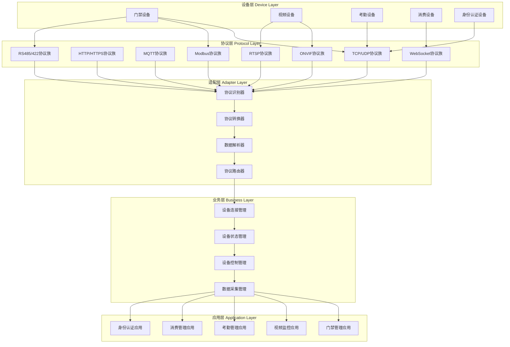

---

## 🚪 门禁设备通讯协议

### 📋 门禁设备协议矩阵

| 设备类型 | 主协议 | 备选协议 | 数据格式 | 通讯模式 | 实时性要求 |
|----------|--------|----------|----------|----------|------------|
| 门禁机 | TCP | UDP | JSON/XML | 客户端-服务器 | 高 (<100ms) |
| 读卡器 | TCP | RS485/Modbus | 自定义二进制 | 轮询/事件 | 高 (<200ms) |
| 指纹机 | TCP | USB | 自定义协议 | 客户端-服务器 | 中 (500ms-1s) |
| 人脸机 | TCP | HTTP | JSON/WebSocket | 客户端-服务器 | 中 (1-2s) |
| 密码键盘 | TCP | RS485 | 自定义二进制 | 事件上报 | 高 (<100ms) |
| 三辊闸 | TCP | Modbus | JSON | 控制命令 | 高 (<200ms) |
| 翼闸 | TCP | Modbus | JSON | 控制命令 | 高 (<200ms) |
| 摆闸 | TCP | Modbus | JSON | 控制命令 | 高 (<200ms) |

### 🔧 门禁设备原型设计

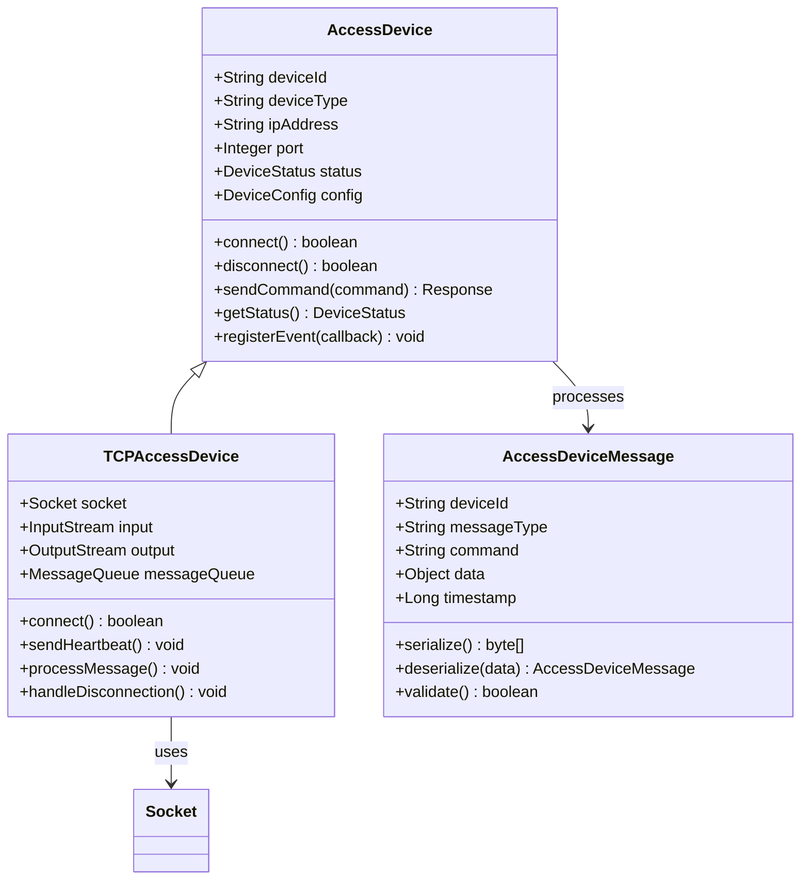

### 📡 门禁设备通讯流程原型

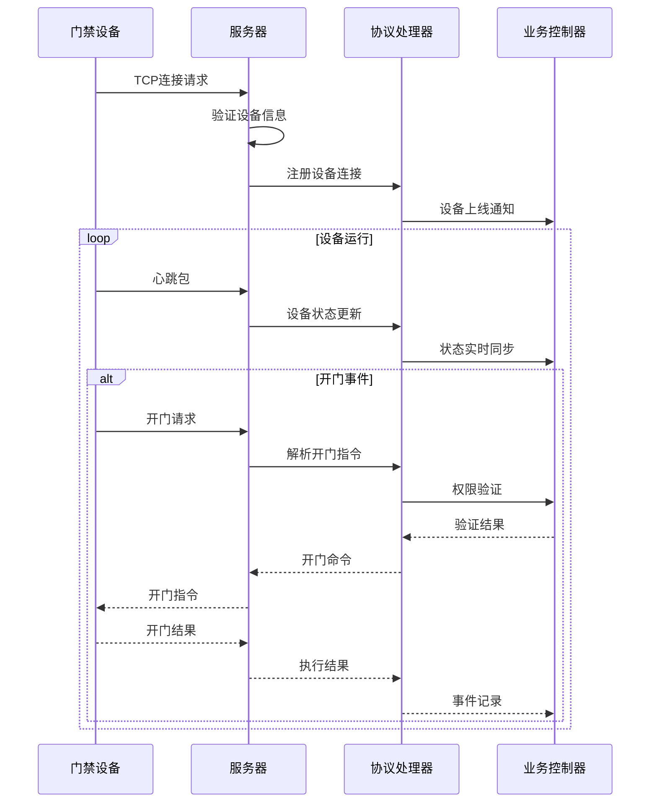

### 📊 门禁设备协议详细规范

#### TCP协议格式 (门禁机)
```json
{
  "header": {
    "version": "1.0",
    "deviceId": "ACCESS_001",
    "messageType": "REQUEST",
    "sequenceId": 1001,
    "timestamp": 1634412345678
  },
  "body": {
    "command": "OPEN_DOOR",
    "parameters": {
      "doorId": "MAIN_DOOR",
      "accessType": "CARD",
      "cardId": "CARD_123456",
      "userId": "USER_001"
    }
  }
}
```

#### RS485/Modbus协议格式 (读卡器)
```python
# Modbus RTU 数据包格式
packet = [0x01, 0x03, 0x00, 0x00, 0x00, 0x02, 0xC5, 0xDA]
# 功能码0x03: 读取保持寄存器
# 起始地址0x0000: 读卡器状态
# 寄存器数量0x0002: 状态信息长度
```

---

## 📹 视频设备通讯协议

### 📋 视频设备协议矩阵

| 设备类型 | 主协议 | 备选协议 | 数据格式 | 编码标准 | 带宽要求 |
|----------|--------|----------|----------|----------|----------|
| 网络摄像头 | RTSP | ONVIF | H.264/H.265 | H.265优先 | 2-8Mbps |
| 智能球机 | RTSP/ONVIF | TCP | H.264/H.265 | H.265优先 | 4-12Mbps |
| NVR录像机 | HTTP/HTTPS | FTP | MP4/FLV | H.264优先 | 上传10-50Mbps |
| 视频服务器 | RTMP/WebRTC | HTTP | H.264/H.265 | 自适应 | 推流10-100Mbps |

### 🔧 视频设备原型设计

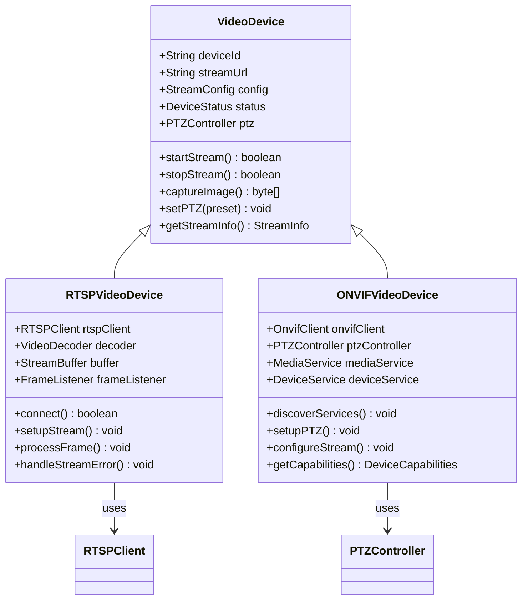

### 🎥 视频流处理原型架构

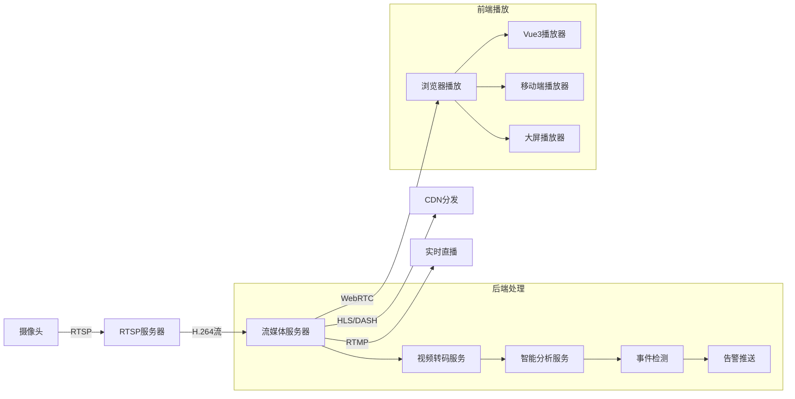

### 📡 ONVIF协议交互流程原型

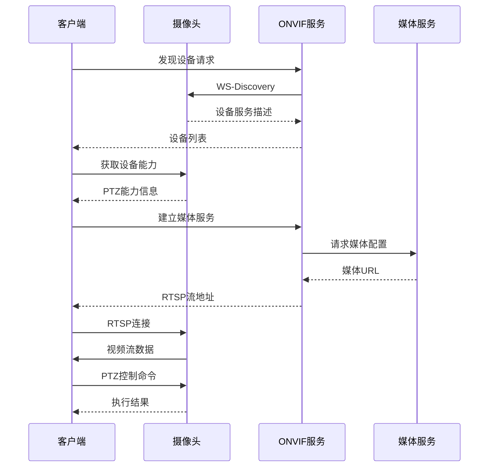

---

## ⏰ 考勤设备通讯协议

### 📋 考勤设备协议矩阵

| 设备类型 | 主协议 | 备选协议 | 数据格式 | 同步频率 | 数据量 |
|----------|--------|----------|----------|----------|--------|
| 指纹考勤机 | TCP | HTTP | JSON/XML | 实时/批量 | 1-5KB |
| 人脸考勤机 | TCP | HTTP | JSON+图片 | 实时/批量 | 10-100KB |
| IC卡考勤机 | TCP | UDP | 自定义二进制 | 实时 | 500B-2KB |
| 二维码考勤机 | HTTP | HTTPS | JSON | 实时 | 1-5KB |

### 🔧 考勤设备原型设计

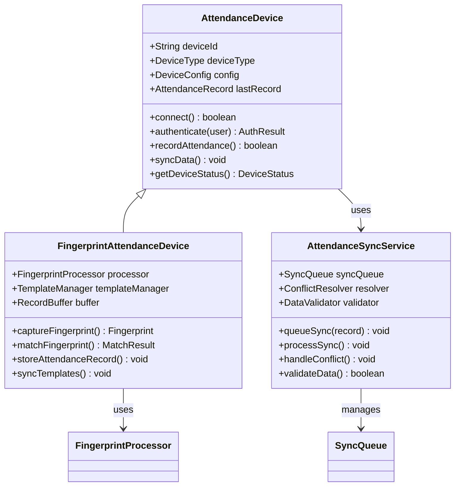

### 📋 考勤数据同步流程原型

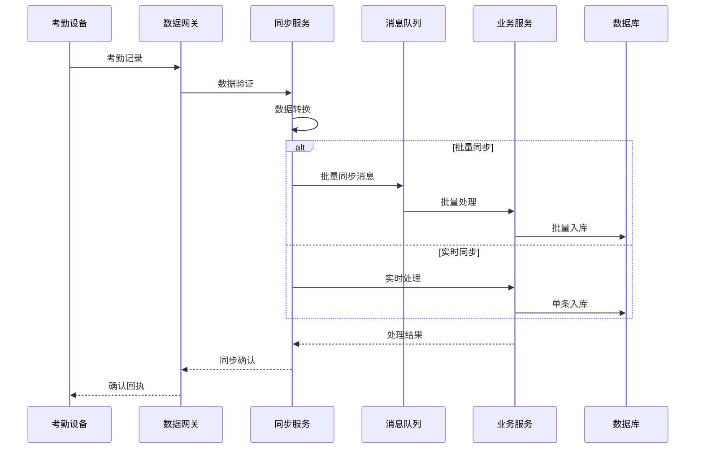

---

## 💳 消费设备通讯协议

### 📋 消费设备协议矩阵

| 设备类型 | 主协议 | 备选协议 | 数据格式 | 交易安全 | 实时性 |
|----------|--------|----------|----------|----------|--------|
| 消费终端 | WebSocket | TCP | JSON | 加密签名 | 极高 |
| 充值机 | TCP | HTTP | JSON | SSL/TLS | 高 |
| 查询机 | HTTP | HTTPS | JSON | HTTPS | 中 |
| 收银机 | WebSocket | TCP | JSON | PCI-DSS | 极高 |

### 🔧 消费设备原型设计

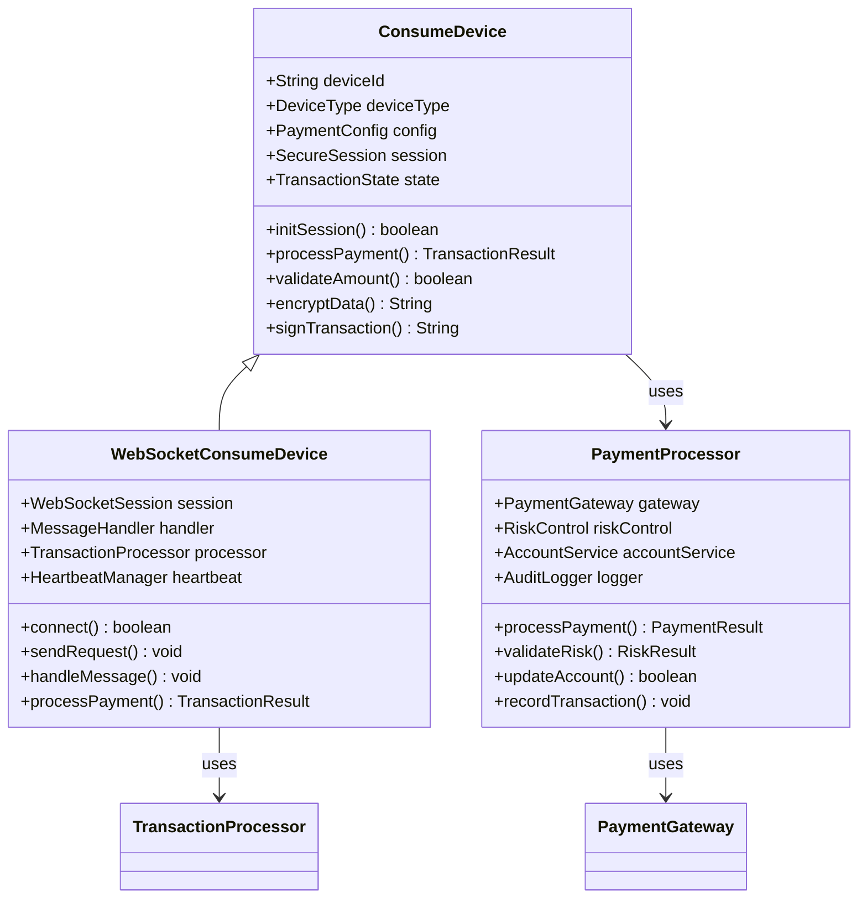

### 💰 消费交易流程原型

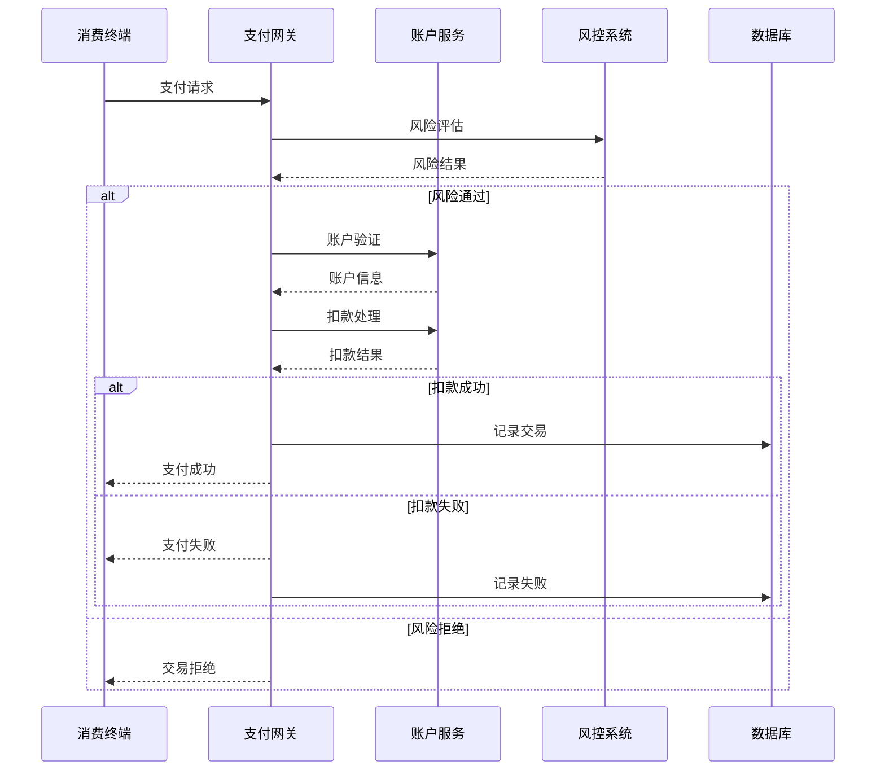

---

## 🔐 身份认证设备通讯协议

### 📋 身份认证设备协议矩阵

| 设备类型 | 主协议 | 备选协议 | 生物特征 | 安全等级 | 认证速度 |
|----------|--------|----------|----------|----------|----------|
| 指纹识别器 | TCP | USB | 指纹模板 | 高 | 1-2秒 |
| 人脸识别机 | TCP | HTTP | 人脸特征 | 最高 | 2-3秒 |
| IC卡读卡器 | TCP | RS485 | 卡片信息 | 中 | <1秒 |
| 多模态终端 | WebSocket | TCP | 多种特征 | 最高 | 3-5秒 |

### 🔧 身份认证设备原型设计

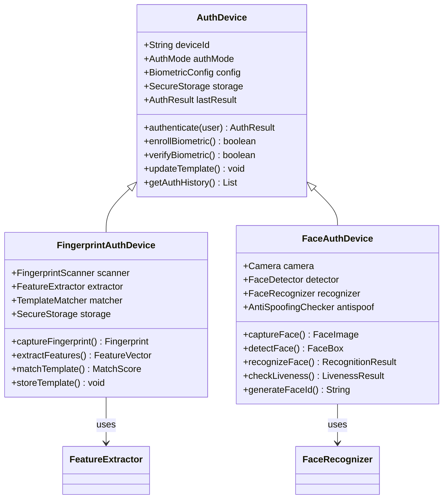

### 🔍 多模态认证流程原型

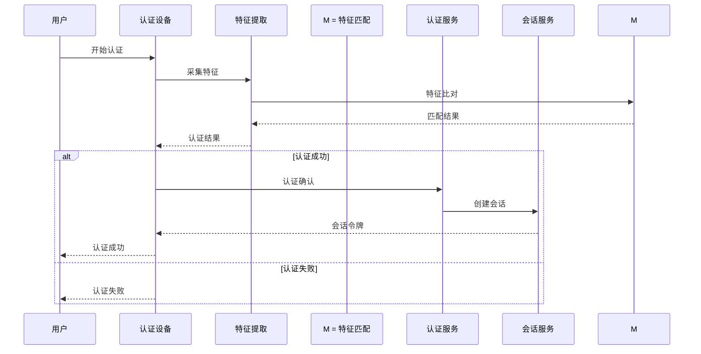

---

## 🔄 协议管理框架

### 📋 协议管理器架构

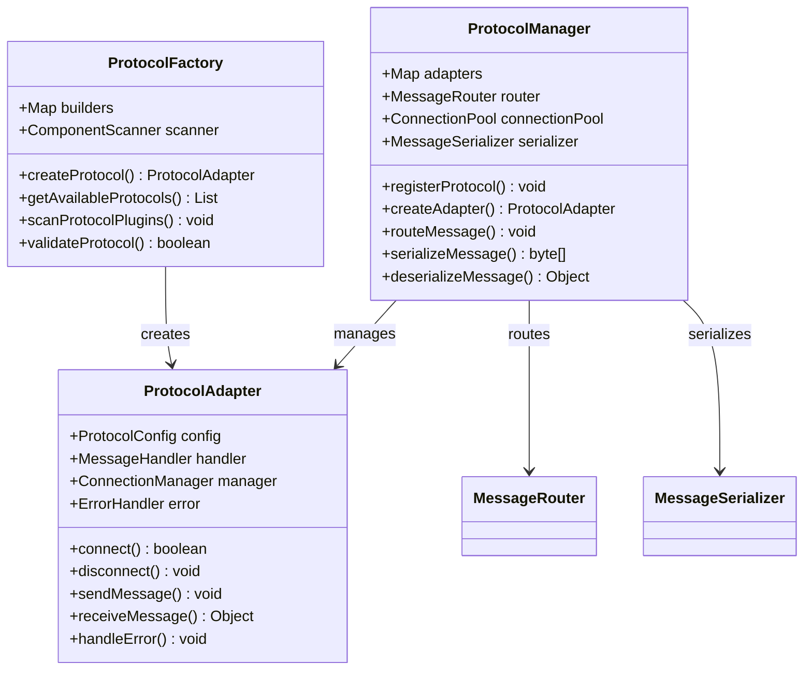

### 🛠️ 协议适配器实现模式

```java
// 协议适配器接口
public interface ProtocolAdapter {
    boolean connect(String address, int port);
    void disconnect();
    void sendHeartbeat();
    void sendCommand(DeviceCommand command);
    DeviceMessage receiveMessage();
    boolean isConnected();
    DeviceStatus getStatus();
}

// TCP协议适配器实现
@Component
public class TCPProtocolAdapter implements ProtocolAdapter {
    private Socket socket;
    private Input input;
    private Output output;
    private MessageQueue messageQueue;

    @Override
    public boolean connect(String address, int port) {
        try {
            socket = new Socket(address, port);
            input = socket.getInputStream();
            output = socket.getOutputStream();
            startMessageListener();
            return true;
        } catch (Exception e) {
            return false;
        }
    }

    @Override
    public void sendCommand(DeviceCommand command) {
        try {
            byte[] data = serializeCommand(command);
            output.write(data);
            output.flush();
        } catch (Exception e) {
            handleError(e);
        }
    }
}
```

---

## 📊 协议性能指标

### 📋 协议性能对比表

| 协议类型 | 连接延迟 | 数据吞吐量 | 并发连接数 | 内存占用 | CPU占用 |
|----------|----------|------------|--------------|----------|----------|
| TCP | 10-50ms | 1-10MB/s | 1000 | 5-10MB | 2-5% |
| HTTP | 20-100ms | 10-50MB/s | 500 | 2-5MB | 1-3% |
| WebSocket | 5-20ms | 5-20MB/s | 2000 | 10-20MB | 3-8% |
| MQTT | 5-15ms | 100KB-1MB/s | 5000 | 1-2MB | 1-2% |
| RTSP | 5-15ms | 2-8MB/s | 500 | 3-8MB | 5-10% |
| ONVIF | 50-200ms | 1-5MB/s | 100 | 5-15MB | 2-5% |

### 🎯 协议选择建议

#### 高实时性场景 (延迟 < 50ms)
- **推荐协议**: WebSocket, MQTT
- **适用设备**: 门禁控制、实时监控

#### 高可靠性场景 (数据完整性)
- **推荐协议**: TCP, HTTP/HTTPS
- **适用设备**: 消费交易、身份认证

#### 高带宽场景 (视频流传输)
- **推荐协议**: RTSP, WebRTC
- **适用设备**: 视频监控、视频分析

---

## 🔧 协议开发指南

### 📋 协议适配器开发流程

1. **需求分析**
   - 设备通讯协议调研
   - 数据格式定义
   - 性能指标要求

2. **接口设计**
   - ProtocolAdapter接口实现
   - 消息格式定义
   - 错误处理机制

3. **编码实现**
   - 协议解析器编写
   - 数据序列化实现
   - 连接管理逻辑

4. **测试验证**
   - 单元测试编写
   - 集成测试验证
   - 性能基准测试

5. **部署上线**
   - 协议注册配置
   - 监控指标设置
   - 故障处理预案

### 📝 协议开发模板

```java
@Component
public class CustomDeviceAdapter implements ProtocolAdapter {
    private static final Logger log = LoggerFactory.getLogger(CustomDeviceAdapter.class);

    @Resource
    private MessageSerializer serializer;

    @Resource
    private ErrorHandler errorHandler;

    @Override
    public boolean connect(String address, int port) {
        try {
            // 连接设备
            initializeConnection(address, port);

            // 发送握手协议
            sendHandshake();

            // 验证连接
            return validateConnection();

        } catch (Exception e) {
            log.error("设备连接失败", e);
            errorHandler.handleError(e);
            return false;
        }
    }

    private void initializeConnection(String address, int port) {
        // 实现连接逻辑
    }

    private void sendHandshake() {
        // 实现握手协议
    }

    private boolean validateConnection() {
        // 实现连接验证
        return true;
    }
}
```

---

**⚠️ 重要提醒**: 本文档定义了设备管理系统的通讯协议架构和实现标准。所有新设备类型的接入都必须严格遵循本文档中的协议设计原则和开发规范。协议适配器的开发必须经过完整的设计评审和测试验证。