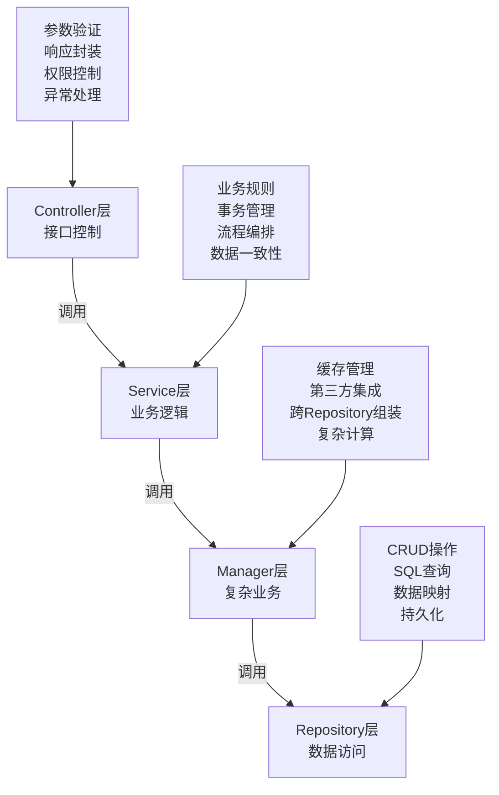

# SmartAdmin 项目综合开发规范文档

> **📋 文档版本**: v1.0.0
> **📋 文档职责**: SmartAdmin项目的唯一权威开发规范文档，整合框架规范、业务规范和最佳实践
> **📅 创建时间**: 2025-01-10
> **📅 最后更新**: 2025-01-10

## 📖 目录

1. [技术栈规范](#技术栈规范)
2. [项目结构规范](#项目结构规范)
3. [架构设计规范](#架构设计规范)
4. [数据库设计规范](#数据库设计规范)
5. [API接口规范](#api接口规范)
6. [前端开发规范](#前端开发规范)
7. [安全开发规范](#安全开发规范)
8. [业务模块开发规范](#业务模块开发规范)
9. [代码质量标准](#代码质量标准)
10. [开发检查清单](#开发检查清单)

---

## 🔧 技术栈规范

### 后端技术栈（必须使用）
```markdown
✅ 框架版本：
- Spring Boot 3.2.5
- Spring Cloud 2023.0.1 (微服务项目)
- MyBatis Plus 3.5.12
- Sa-Token 1.44.0
- MySQL 9.3.0
- Redis 7.0+
- Nacos 2.3+ (微服务项目)
- RocketMQ 5.0+ (消息队列)

✅ 开发工具：
- JDK 17+
- Maven 3.9+
- IntelliJ IDEA 2024.1+
- Git 2.40+

❌ 禁止使用：
- 未在规范中列出的技术组件
- 过时的框架版本
- 不兼容的依赖库
```

### 前端技术栈（必须使用）
```markdown
✅ 核心技术：
- Vue 3.4.27 + Composition API
- TypeScript 5.0+ (严格模式)
- Vite 5.0+
- Ant Design Vue 4.2.5
- Pinia 2.0+
- Less/SCSS

✅ 构建工具：
- Node.js 18+
- npm 9+ 或 yarn 1.22+
- Vite 5.0+
- ESLint + Prettier

❌ 绝对禁止：
- Vue 2 语法
- var 声明变量
- any 类型
- 直接修改 props
```

---

## 📁 项目结构规范

### 后端项目结构
```
smart-admin-api-java17-springboot3/
├── sa-base/                           # 基础模块
│   ├── src/main/java/net/lab1024/sa/
│   │   ├── common/                   # 公共模块
│   │   │   ├── domain/               # Entity, VO, DTO
│   │   │   │   ├── entity/           # 数据库实体
│   │   │   │   ├── vo/               # 视图对象
│   │   │   │   ├── dto/              # 数据传输对象
│   │   │   │   └── form/             # 表单对象
│   │   │   ├── mapper/               # MyBatis Plus Mapper
│   │   │   └── service/              # 基础 Service
│   │   ├── config/                   # 配置类
│   │   ├── util/                     # 工具类
│   │   ├── constant/                 # 常量定义
│   │   └── exception/                # 异常定义
│   └── src/main/resources/
│       ├── dev/sa-base.yaml          # 开发环境配置
│       ├── test/sa-base.yaml         # 测试环境配置
│       └── prod/sa-base.yaml         # 生产环境配置
└── sa-admin/                         # 管理模块
    └── src/main/java/net/lab1024/sa/
        ├── admin/                     # 业务代码
        │   ├── controller/           # 控制器层
        │   ├── service/              # 服务层
        │   ├── manager/              # 管理层
        │   └── dao/                  # 数据访问层
        └── module/                   # 功能模块
            ├── system/               # 系统管理
            ├── business/             # 业务功能
            └── data/                 # 数据管理
```

### 前端项目结构
```
smart-admin-web-javascript/
├── public/                           # 静态资源
├── src/
│   ├── api/                          # API接口
│   │   ├── modules/                  # 模块API
│   │   └── request.ts                # 请求封装
│   ├── assets/                       # 静态资源
│   │   ├── images/                   # 图片
│   │   ├── icons/                    # 图标
│   │   └── styles/                   # 全局样式
│   ├── components/                   # 公共组件
│   │   ├── common/                   # 通用组件
│   │   └── business/                 # 业务组件
│   ├── composables/                  # 组合式函数
│   ├── layouts/                      # 布局组件
│   ├── pages/                        # 页面组件
│   ├── router/                       # 路由配置
│   ├── stores/                       # Pinia状态管理
│   ├── types/                        # 类型定义
│   ├── utils/                        # 工具函数
│   ├── views/                        # 视图组件
│   ├── App.vue                       # 根组件
│   └── main.ts                       # 入口文件
├── package.json                      # 依赖配置
├── vite.config.ts                    # Vite配置
├── tsconfig.json                     # TypeScript配置
└── eslint.config.js                  # ESLint配置
```

---

## 🏗️ 架构设计规范

### 四层架构设计


### 各层职责规范

#### Controller层
```markdown
✅ 职责：
- 接收HTTP请求，参数验证
- 调用Service层业务逻辑
- 封装统一响应格式
- 权限控制和异常处理
- 接口文档和API版本管理

❌ 禁止：
- 包含复杂业务逻辑
- 直接访问数据库
- 包含事务管理
- 直接调用第三方服务
```

#### Service层
```markdown
✅ 职责：
- 核心业务逻辑处理
- 事务管理和数据一致性
- 调用Manager层处理复杂业务
- 业务规则验证和流程编排
- 业务事件发布和监听

❌ 禁止：
- 直接访问Repository层
- 包含缓存管理逻辑
- 直接处理HTTP请求
- 包含数据转换逻辑
```

#### Manager层
```markdown
✅ 职责：
- 复杂业务逻辑处理
- 缓存管理和一致性保证
- 第三方服务集成
- 跨Repository数据组装
- 复杂计算和业务规则

❌ 禁止：
- 直接处理HTTP请求
- 包含事务管理逻辑
- 直接操作数据库
- 包含业务流程编排
```

#### Repository层
```markdown
✅ 职责：
- 数据库CRUD操作
- SQL查询和映射
- 数据持久化操作
- 数据访问封装
- 数据库连接管理

❌ 禁止：
- 包含业务逻辑
- 直接调用其他Repository
- 包含事务管理
- 包含缓存逻辑
```

---

## 🗄️ 数据库设计规范

### 表设计标准模板
```sql
-- 标准表结构模板
CREATE TABLE `t_{business}_{entity}` (
  `{entity}Id` bigint(20) NOT NULL AUTO_INCREMENT COMMENT '{实体}ID',
  `{field_name}` {field_type} COMMENT '{字段描述}',
  `{status}` tinyint(4) NOT NULL DEFAULT '1' COMMENT '状态：1-正常 0-禁用',
  `sort_value` int(11) NOT NULL DEFAULT '0' COMMENT '排序值',
  `remark` varchar(500) DEFAULT NULL COMMENT '备注',

  -- 审计字段（必须包含）
  `create_time` datetime NOT NULL DEFAULT CURRENT_TIMESTAMP(6) COMMENT '创建时间（微秒精度）',
  `update_time` datetime NOT NULL DEFAULT CURRENT_TIMESTAMP(6) ON UPDATE CURRENT_TIMESTAMP(6) COMMENT '更新时间（微秒精度）',
  `create_user_id` bigint(20) DEFAULT NULL COMMENT '创建人ID',
  `update_user_id` bigint(20) DEFAULT NULL COMMENT '更新人ID',
  `deleted_flag` tinyint(1) NOT NULL DEFAULT '0' COMMENT '删除标记 0-正常 1-删除',
  `version` int(11) NOT NULL DEFAULT '0' COMMENT '版本号（乐观锁）',

  -- JSON字段（MySQL 9.3.0支持）
  `extend_info` json DEFAULT NULL COMMENT '扩展信息（JSON格式）',

  PRIMARY KEY (`{entity}Id`),

  -- 索引设计
  KEY `idx_create_time` (`create_time`),
  KEY `idx_update_time` (`update_time`),
  KEY `idx_status` (`status`),
  KEY `idx_{business_code}` (`{business_code}`),

  -- JSON索引（MySQL 9.3.0支持）
  KEY `idx_extend_info_type` ((cast(`extend_info` ->> '$.type' as char(50))))

) ENGINE=InnoDB DEFAULT CHARSET=utf8mb4 COLLATE=utf8mb4_0900_ai_ci COMMENT='{实体表}';
```

### 命名规范
```markdown
✅ 表命名：
- 格式：t_{business}_{entity}
- 示例：t_user_info, t_business_order, t_system_config
- 使用小写字母和下划线
- 名称要有业务含义
- 避免使用数据库关键字

✅ 字段命名：
- 主键字段：{entity}Id（userId, orderId, configId）
- 外键字段：{relatedEntity}Id（userId, deptId, roleId）
- 普通字段：小写字母和下划线（user_name, create_time）
- 标记字段：{business}Flag（disabled_flag, deleted_flag）
- 时间字段：{action}_time（create_time, update_time）
- 状态字段：{entity}_status（user_status, order_status）
- 数量字段：{entity}_count（user_count, order_count）

✅ 索引命名：
- 主键索引：PRIMARY
- 唯一索引：uk_{table}_{column}
- 普通索引：idx_{table}_{column}
- 组合索引：idx_{table}_{column1}_{column2}
- 前缀索引：idx_{table}_{column}_prefix
- 全文索引：ft_{table}_{column}
```

### 数据类型选择规范
```markdown
✅ 推荐数据类型：
- 主键：bigint(20) AUTO_INCREMENT
- 姓名/名称：varchar(100) CHARACTER SET utf8mb4 COLLATE utf8mb4_0900_ai_ci
- 编码：varchar(50) CHARACTER SET utf8mb4 COLLATE utf8mb4_0900_ai_ci
- 手机号：varchar(20) CHARACTER SET utf8mb4 COLLATE utf8mb4_0900_ai_ci
- 邮箱：varchar(100) CHARACTER SET utf8mb4 COLLATE utf8mb4_0900_ai_ci
- 金额：decimal(20,8)（支持更高精度）
- 数量：int(11) UNSIGNED（无符号）
- 状态：tinyint(4) UNSIGNED
- 标记：tinyint(1) UNSIGNED
- 时间：datetime(6)（微秒精度）
- 长文本：longtext
- JSON数据：json（MySQL 9.3.0增强）
- 二进制数据：varbinary(1024)
- UUID：char(36) CHARACTER SET ascii

❌ 禁止使用：
- float存储金额
- varchar存储数字
- text存储少量文字
- utf8字符集（必须用utf8mb4）
```

### 索引设计原则
```markdown
✅ 创建索引条件：
- 为经常查询的字段创建索引
- 为外键字段创建索引
- 为ORDER BY字段创建索引
- 为GROUP BY字段创建索引
- 控制索引数量（单表不超过8个）
- 考虑索引的选择性（≥0.8）
- 使用覆盖索引减少回表
- 定期分析和优化索引

✅ 性能要求：
- 单表数据量不超过1000万行
- 查询响应时间不超过100ms
- 索引选择性不低于0.8
- 避免大事务，单个事务不超过30秒
- 批量操作每批不超过1000条记录

❌ 禁止使用：
- 全表扫描查询
- 缺少必要索引
- SELECT * 查询
- 在WHERE子句中使用函数
- 大表设计（超过1000万行不进行分表）
```

---

## 🌐 API接口规范

### RESTful设计规范
```markdown
✅ URL设计：
- 使用名词复数形式：/api/users, /api/orders
- 使用小写字母和连字符：/api/user-profiles
- 层级关系清晰：/api/users/{userId}/orders
- 版本控制：/api/v1/users, /api/v2/users
- 分页参数：/api/users?page=1&size=20
- 过滤参数：/api/users?status=active&type=vip
- 排序参数：/api/users?sort=createTime:desc,userName:asc

✅ HTTP方法：
- GET: 查询资源（安全，幂等）
- POST: 创建资源（不安全，不幂等）
- POST: 更新资源（不安全，幂等）
- POST: 删除资源（不安全，幂等）

❌ 禁止使用：
- GET方法修改数据
- URL中使用动词：/api/getUser, /api/createOrder
- 深层嵌套：/api/users/{userId}/orders/{orderId}/items/{itemId}
- PUT、PATCH方法（SmartAdmin统一使用POST）
```

### Controller实现标准模板
```java
@RestController
@RequestMapping("/api/{module}")
@Tag(name = "{模块名称}管理", description = "{模块名称}的增删改查操作")
@SaCheckLogin
public class {Module}Controller {

    @Resource
    private {Module}Service {module}Service;

    @Operation(summary = "新增{实体}", description = "新增{实体}信息")
    @PostMapping("/add")
    @SaCheckPermission("{module}:add")
    public ResponseDTO<String> add(@RequestBody @Valid {Module}AddForm addForm) {
        log.info("新增{模块}, param: {}", addForm);
        return ResponseDTO.ok({module}Service.add(addForm));
    }

    @Operation(summary = "更新{实体}", description = "更新{实体}信息")
    @PostMapping("/update")
    @SaCheckPermission("{module}:update")
    public ResponseDTO<String> update(@RequestBody @Valid {Module}UpdateForm updateForm) {
        log.info("更新{模块}, param: {}", updateForm);
        return ResponseDTO.ok({module}Service.update(updateForm));
    }

    @Operation(summary = "删除{实体}", description = "删除{实体}信息")
    @PostMapping("/delete")
    @SaCheckPermission("{module}:delete")
    public ResponseDTO<String> delete(@RequestBody @Valid IdForm idForm) {
        log.info("删除{模块}, id: {}", idForm.getId());
        return ResponseDTO.ok({module}Service.delete(idForm.getId()));
    }

    @Operation(summary = "分页查询{实体}", description = "分页查询{实体}列表")
    @PostMapping("/page")
    @SaCheckPermission("{module}:query")
    public ResponseDTO<PageResult<{Module}VO>> page(@RequestBody @Valid {Module}QueryForm queryForm) {
        log.info("分页查询{模块}, param: {}", queryForm);
        return ResponseDTO.ok({module}Service.page(queryForm));
    }

    @Operation(summary = "获取{实体}详情", description = "根据ID获取{实体}详细信息")
    @GetMapping("/detail/{{id}}")
    @SaCheckPermission("{module}:query")
    public ResponseDTO<{Module}VO> detail(@PathVariable Long id) {
        log.info("获取{模块}详情, id: {}", id);
        return ResponseDTO.ok({module}Service.getDetail(id));
    }

    @Operation(summary = "更新{实体}状态", description = "启用或禁用{实体}")
    @PostMapping("/status")
    @SaCheckPermission("{module}:update")
    public ResponseDTO<String> updateStatus(@RequestBody @Valid {Module}StatusForm statusForm) {
        log.info("更新{模块}状态, param: {}", statusForm);
        return ResponseDTO.ok({module}Service.updateStatus(statusForm));
    }
}
```

### 统一响应格式
```java
// 成功响应
@Data
@AllArgsConstructor
public class ResponseDTO<T> implements Serializable {

    private Integer code;
    private String message;
    private T data;
    private Boolean success;
    private LocalDateTime timestamp;
    private String traceId;

    public ResponseDTO() {
        this.timestamp = LocalDateTime.now();
        this.success = true;
    }

    public static <T> ResponseDTO<T> ok() {
        return new ResponseDTO<>(ResponseCode.SUCCESS.getCode(), ResponseStringConst.SUCCESS);
    }

    public static <T> ResponseDTO<T> ok(T data) {
        return new ResponseDTO<>(data);
    }

    public static <T> ResponseDTO<T> error(String message) {
        return new ResponseDTO<>(ResponseCode.ERROR.getCode(), message);
    }

    public static <T> ResponseDTO<T> error(Integer code, String message) {
        ResponseDTO<T> response = new ResponseDTO<>();
        response.setCode(code);
        response.setMessage(message);
        response.setSuccess(false);
        response.setTimestamp(LocalDateTime.now());
        return response;
    }
}

// 分页响应
@Data
@AllArgsConstructor
public class PageResult<T> implements Serializable {

    private List<T> records;
    private Long total;
    private Long current;
    private Long size;
    private Long pages;
}
```

### 参数验证规范
```java
// Form参数验证
@Data
public class {Module}AddForm {

    @NotBlank(message = "{字段名称}不能为空")
    @Length(min = 2, max = 50, message = "{字段名称}长度必须在2-50之间")
    @Pattern(regexp = "^[a-zA-Z0-9_]+$", message = "{字段名称}只能包含字母、数字和下划线")
    private String {fieldName};

    @NotBlank(message = "邮箱不能为空")
    @Email(message = "邮箱格式不正确")
    private String email;

    @NotBlank(message = "手机号不能为空")
    @Pattern(regexp = "^1[3-9]\\d{9}$", message = "手机号格式不正确")
    private String phone;

    @NotNull(message = "状态不能为空")
    @Min(value = 0, message = "状态值不能小于0")
    @Max(value = 2, message = "状态值不能大于2")
    private Integer status;
}
```

---

## 🎨 前端开发规范

### Vue 3 组件开发标准模板
```vue
<template>
  <div class="{module-name}">
    <!-- 加载状态 -->
    <a-spin :spinning="loading" tip="加载中...">
      <!-- 搜索区域 -->
      <div class="search-form">
        <a-form :model="searchForm" layout="inline">
          <a-form-item label="{字段名称}">
            <a-input
              v-model:value="searchForm.{fieldName}"
              placeholder="请输入{字段名称}"
              allow-clear
            />
          </a-form-item>
          <a-form-item>
            <a-space>
              <a-button type="primary" @click="handleSearch">
                搜索
              </a-button>
              <a-button @click="handleReset">重置</a-button>
            </a-space>
          </a-form-item>
        </a-form>
      </div>

      <!-- 操作按钮 -->
      <div class="table-operations">
        <a-button type="primary" @click="handleAdd">
          新增{实体}
        </a-button>
        <a-button
          danger
          :disabled="!hasSelected"
          @click="handleBatchDelete"
        >
          批量删除
        </a-button>
      </div>

      <!-- 数据表格 -->
      <a-table
        :columns="columns"
        :data-source="dataSource"
        :pagination="pagination"
        :loading="loading"
        :row-selection="rowSelection"
        row-key="id"
        @change="handleTableChange"
      >
        <!-- 状态列 -->
        <template #status="{ record }">
          <a-tag :color="record.status === 1 ? 'green' : 'red'">
            {{ record.status === 1 ? '正常' : '禁用' }}
          </a-tag>
        </template>

        <!-- 操作列 -->
        <template #action="{ record }">
          <a-space>
            <a-button type="link" @click="handleEdit(record)">
              编辑
            </a-button>
            <a-popconfirm
              title="确定删除这条记录吗？"
              @confirm="handleDelete(record.id)"
            >
              <a-button type="link" danger>删除</a-button>
            </a-popconfirm>
          </a-space>
        </template>
      </a-table>
    </a-spin>

    <!-- 新增/编辑弹窗 -->
    <{Module}Modal
      v-model:visible="modalVisible"
      :{module}="current{Module}"
      @success="handleModalSuccess"
    />
  </div>
</template>

<script setup lang="ts">
import { ref, reactive, computed, onMounted } from 'vue'
import { message } from 'ant-design-vue'
import type { TableColumnsType, TableProps } from 'ant-design-vue'
import { {module}Api } from '@/api/{module}'
import type { {Module}Item, {Module}QueryParams } from '@/types/{module}'

// 响应式数据
const searchForm = reactive<{Module}QueryParams>({
  {fieldName}: '',
  status: undefined,
  current: 1,
  pageSize: 10
})

const dataSource = ref<{Module}Item[]>([])
const total = ref(0)
const selectedRowKeys = ref<number[]>([])
const modalVisible = ref(false)
const current{Module} = ref<{Module}Item | null>(null)
const loading = ref(false)

// 计算属性
const hasSelected = computed(() => selectedRowKeys.value.length > 0)

const pagination = computed(() => ({
  total: total.value,
  current: searchForm.current,
  pageSize: searchForm.pageSize,
  showSizeChanger: true,
  showQuickJumper: true,
  showTotal: (total: number) => `共 ${total} 条`
}))

const rowSelection: TableProps<{Module}Item>['rowSelection'] = {
  selectedRowKeys: selectedRowKeys,
  onChange: (keys: number[]) => {
    selectedRowKeys.value = keys
  }
}

// 表格列配置
const columns: TableColumnsType = [
  {
    title: 'ID',
    dataIndex: 'id',
    key: 'id',
    width: 80
  },
  {
    title: '{字段名称}',
    dataIndex: '{fieldName}',
    key: '{fieldName}'
  },
  {
    title: '状态',
    dataIndex: 'status',
    key: 'status',
    slots: { customRender: 'status' }
  },
  {
    title: '创建时间',
    dataIndex: 'createTime',
    key: 'createTime'
  },
  {
    title: '操作',
    key: 'action',
    slots: { customRender: 'action' },
    width: 150
  }
]

// 生命周期
onMounted(() => {
  loadData()
})

// 方法
const loadData = async () => {
  try {
    loading.value = true
    const response = await {module}Api.getList(searchForm)
    dataSource.value = response.data.records
    total.value = response.data.total
  } catch (error) {
    message.error('加载数据失败')
  } finally {
    loading.value = false
  }
}

const handleSearch = () => {
  searchForm.current = 1
  loadData()
}

const handleReset = () => {
  Object.assign(searchForm, {
    {fieldName}: '',
    status: undefined,
    current: 1,
    pageSize: 10
  })
  loadData()
}

const handleAdd = () => {
  current{Module}.value = null
  modalVisible.value = true
}

const handleEdit = (record: {Module}Item) => {
  current{Module}.value = { ...record }
  modalVisible.value = true
}

const handleDelete = async (id: number) => {
  try {
    await {module}Api.delete(id)
    message.success('删除成功')
    loadData()
  } catch (error) {
    message.error('删除失败')
  }
}

const handleBatchDelete = async () => {
  if (selectedRowKeys.value.length === 0) {
    message.warning('请选择要删除的数据')
    return
  }

  Modal.confirm({
    title: '确认删除',
    content: `确定删除选中的 ${selectedRowKeys.value.length} 条数据吗？`,
    async onOk() {
      try {
        await {module}Api.batchDelete(selectedRowKeys.value)
        message.success('批量删除成功')
        selectedRowKeys.value = []
        loadData()
      } catch (error) {
        message.error('批量删除失败')
      }
    }
  })
}

const handleTableChange = (pagination: any) => {
  searchForm.current = pagination.current
  searchForm.pageSize = pagination.pageSize
  loadData()
}

const handleModalSuccess = () => {
  modalVisible.value = false
  loadData()
}
</script>

<style lang="scss" scoped>
.{module-name} {
  padding: 24px;
  background: #fff;
  border-radius: 8px;

  .search-form {
    margin-bottom: 16px;
    padding: 16px;
    background: #fafafa;
    border-radius: 4px;
  }

  .table-operations {
    margin-bottom: 16px;
  }
}
</style>
```

### Pinia 状态管理规范
```typescript
// stores/{module}.ts
import { defineStore } from 'pinia'
import { ref, computed } from 'vue'
import { {module}Api } from '@/api/{module}'
import type { {Module}Item, {Module}Form } from '@/types/{module}'
import { message } from 'ant-design-vue'

export const use{Module}Store = defineStore('{module}', () => {
  // 状态
  const current{Module} = ref<{Module}Item | null>(null)
  const {module}List = ref<{Module}Item[]>([])
  const loading = ref(false)

  // 计算属性
  const has{Module} = computed(() => !!current{Module}.value)

  // 方法
  const get{Module}List = async (params?: any): Promise<boolean> => {
    try {
      loading.value = true
      const response = await {module}Api.getList(params)
      {module}List.value = response.data.records
      return true
    } catch (error) {
      message.error('获取{模块}列表失败')
      return false
    } finally {
      loading.value = false
    }
  }

  const get{Module}Detail = async (id: number): Promise<boolean> => {
    try {
      const response = await {module}Api.getDetail(id)
      current{Module}.value = response.data
      return true
    } catch (error) {
      message.error('获取{模块}详情失败')
      return false
    }
  }

  const create{Module} = async (form: {Module}Form): Promise<boolean> => {
    try {
      await {module}Api.create(form)
      message.success('创建{模块}成功')
      return true
    } catch (error) {
      message.error('创建{模块}失败')
      return false
    }
  }

  const update{Module} = async (id: number, form: Partial<{Module}Form>): Promise<boolean> => {
    try {
      await {module}Api.update(id, form)
      message.success('更新{模块}成功')
      return true
    } catch (error) {
      message.error('更新{模块}失败')
      return false
    }
  }

  const delete{Module} = async (id: number): Promise<boolean> => {
    try {
      await {module}Api.delete(id)
      message.success('删除{模块}成功')
      return true
    } catch (error) {
      message.error('删除{模块}失败')
      return false
    }
  }

  return {
    // 状态
    current{Module},
    {module}List,
    loading,

    // 计算属性
    has{Module},

    // 方法
    get{Module}List,
    get{Module}Detail,
    create{Module},
    update{Module},
    delete{Module}
  }
})
```

### TypeScript 类型定义规范
```typescript
// types/{module}.ts

// 实体接口
export interface {Module}Item {
  id: number
  {fieldName}: string
  status: number
  createTime: string
  updateTime: string
}

// 表单接口
export interface {Module}Form {
  {fieldName}?: string
  status?: number
}

// 查询参数接口
export interface {Module}QueryParams extends PageForm {
  {fieldName}?: string
  status?: number
  createTimeStart?: string
  createTimeEnd?: string
}

// API 响应接口
export interface {Module}ListResponse {
  records: {Module}Item[]
  total: number
  current: number
  size: number
  pages: number
}
```

---

## 🔐 安全开发规范

### Sa-Token 认证授权实现
```java
// Sa-Token配置类
@Configuration
public class SaTokenConfig {

    @Bean
    public SaTokenConfig saTokenConfig() {
        return new SaTokenConfig()
                .setTokenName("satoken")
                .setTimeout(30 * 24 * 60 * 60) // 30天
                .setActiveTimeout(-1)
                .setIsConcurrent(true)
                .setIsShare(true)
                .setTokenStyle(TokenStyle.UUID)
                .setIsLog(true);
    }
}

// 权限控制示例
@RestController
@RequestMapping("/api/user")
@Tag(name = "用户管理")
public class UserController {

    @PostMapping("/add")
    @SaCheckPermission("user:add")
    public ResponseDTO<String> add(@RequestBody @Valid UserAddForm addForm) {
        return ResponseDTO.ok(userService.add(addForm));
    }

    @GetMapping("/current")
    @SaCheckLogin
    public ResponseDTO<UserVO> getCurrentUser() {
        Long userId = StpUtil.getLoginIdAsLong();
        return ResponseDTO.ok(userService.getUserDetail(userId));
    }

    // 数据权限控制示例
    @GetMapping("/dept-users")
    @SaCheckPermission("user:query")
    public ResponseDTO<List<UserVO>> getDeptUsers(@RequestParam Long deptId) {
        Long currentUserId = StpUtil.getLoginIdAsLong();

        if (!dataPermissionService.hasDeptPermission(currentUserId, deptId)) {
            throw new BusinessException("NO_PERMISSION", "没有访问该部门用户的权限");
        }

        return ResponseDTO.ok(userService.getDeptUsers(deptId));
    }
}
```

### 数据安全规范
```java
// 敏感数据加密工具类
@Component
public class DataSecurityUtil {

    private static final String AES_KEY = "your-aes-key-here";

    /**
     * 密码加密
     */
    public static String encryptPassword(String password) {
        return BCrypt.hashpw(password, BCrypt.gensalt());
    }

    /**
     * 密码验证
     */
    public static boolean checkPassword(String rawPassword, String encodedPassword) {
        return BCrypt.checkpw(rawPassword, encodedPassword);
    }

    /**
     * 敏感数据AES加密
     */
    public static String encryptSensitiveData(String data) {
        try {
            AES aes = SecureUtil.aes(AES_KEY.getBytes());
            return aes.encryptHex(data);
        } catch (Exception e) {
            log.error("数据加密失败", e);
            throw new BusinessException("ENCRYPT_ERROR", "数据加密失败");
        }
    }

    /**
     * 敏感数据AES解密
     */
    public static String decryptSensitiveData(String encryptedData) {
        try {
            AES aes = SecureUtil.aes(AES_KEY.getBytes());
            return aes.decryptStr(encryptedData);
        } catch (Exception e) {
            log.error("数据解密失败", e);
            throw new BusinessException("DECRYPT_ERROR", "数据解密失败");
        }
    }
}

// 数据脱敏工具类
@Component
public class DataMaskingUtil {

    /**
     * 手机号脱敏：138****5678
     */
    public static String maskPhone(String phone) {
        if (StringUtils.isBlank(phone) || phone.length() < 11) {
            return phone;
        }
        return phone.substring(0, 3) + "****" + phone.substring(7);
    }

    /**
     * 身份证号脱敏：110101********1234
     */
    public static String maskIdCard(String idCard) {
        if (StringUtils.isBlank(idCard) || idCard.length() < 18) {
            return idCard;
        }
        return idCard.substring(0, 6) + "********" + idCard.substring(14);
    }

    /**
     * 邮箱脱敏：z***@example.com
     */
    public static String maskEmail(String email) {
        if (StringUtils.isBlank(email) || !email.contains("@")) {
            return email;
        }
        String[] parts = email.split("@");
        String username = parts[0];
        if (username.length() > 1) {
            username = username.charAt(0) + "***" + username.charAt(username.length() - 1);
        }
        return username + "@" + parts[1];
    }
}
```

### 安全防护措施
```java
// XSS过滤工具类
@Component
public class XssFilterUtil {

    private static final String[] XSS_STRINGS = {
        "<script>", "</script>", "]*>", "");
    }
}

// 输入验证Form示例
@Data
public class UserAddForm {

    @NotBlank(message = "用户名不能为空")
    @Length(min = 3, max = 50, message = "用户名长度必须在3-50之间")
    @Pattern(regexp = "^[a-zA-Z0-9_]+$", message = "用户名只能包含字母、数字和下划线")
    private String userName;

    @NotBlank(message = "密码不能为空")
    @Length(min = 8, max = 20, message = "密码长度必须在8-20之间")
    @Pattern(regexp = "^(?=.*[a-z])(?=.*[A-Z])(?=.*\\d)(?=.*[@$!%*?&])[A-Za-z\\d@$!%*?&]+$",
             message = "密码必须包含大小写字母、数字和特殊字符")
    private String password;

    // XSS过滤的setter方法
    public void setUserName(String userName) {
        this.userName = XssFilterUtil.cleanXss(userName);
    }
}
```

---

## 💼 业务模块开发规范

### 统一业务模块开发模板

#### 1. 数据库设计
```sql
-- {业务模块}表设计
CREATE TABLE `t_{business}_{entity}` (
  `{entity}Id` bigint(20) NOT NULL AUTO_INCREMENT COMMENT '{实体}ID',
  `{entity}_code` varchar(50) NOT NULL COMMENT '{实体}编码',
  `{entity}_name` varchar(100) NOT NULL COMMENT '{实体}名称',
  `{entity}_type` tinyint(4) DEFAULT NULL COMMENT '{实体}类型',
  `status` tinyint(4) NOT NULL DEFAULT '1' COMMENT '状态：1-正常 0-禁用',
  `sort_value` int(11) NOT NULL DEFAULT '0' COMMENT '排序值',
  `remark` varchar(500) DEFAULT NULL COMMENT '备注',

  -- 审计字段
  `create_time` datetime NOT NULL DEFAULT CURRENT_TIMESTAMP(6) COMMENT '创建时间',
  `update_time` datetime NOT NULL DEFAULT CURRENT_TIMESTAMP(6) ON UPDATE CURRENT_TIMESTAMP(6) COMMENT '更新时间',
  `create_user_id` bigint(20) DEFAULT NULL COMMENT '创建人ID',
  `update_user_id` bigint(20) DEFAULT NULL COMMENT '更新人ID',
  `deleted_flag` tinyint(1) NOT NULL DEFAULT '0' COMMENT '删除标记',
  `version` int(11) NOT NULL DEFAULT '0' COMMENT '版本号',

  -- 扩展字段
  `extend_info` json DEFAULT NULL COMMENT '扩展信息',

  PRIMARY KEY (`{entity}Id`),
  UNIQUE KEY `uk_{entity}_code` (`{entity}_code`),
  KEY `idx_create_time` (`create_time`),
  KEY `idx_status` (`status`),
  KEY `idx_{entity}_type` (`{entity}_type`)

) ENGINE=InnoDB DEFAULT CHARSET=utf8mb4 COLLATE=utf8mb4_0900_ai_ci COMMENT='{实体表}';
```

#### 2. 后端实现

**Entity实体类**
```java
@Data
@TableName("t_{business}_{entity}")
public class {Module}Entity extends BaseEntity {

    @TableId(type = IdType.AUTO)
    private Long {entity}Id;

    @TableField("{entity}_code")
    private String {entity}Code;

    @TableField("{entity}_name")
    private String {entity}Name;

    @TableField("{entity}_type")
    private Integer {entity}Type;

    @TableField("status")
    private Integer status;

    @TableField("sort_value")
    private Integer sortValue;

    @TableField("remark")
    private String remark;

    @TableField(typeHandler = JacksonTypeHandler.class)
    private Map<String, Object> extendInfo;
}
```

**Form表单类**
```java
@Data
public class {Module}AddForm {

    @NotBlank(message = "{实体}编码不能为空")
    @Length(max = 50, message = "{实体}编码长度不能超过50")
    @Pattern(regexp = "^[A-Z0-9_]+$", message = "{实体}编码只能包含大写字母、数字和下划线")
    private String {entity}Code;

    @NotBlank(message = "{实体}名称不能为空")
    @Length(max = 100, message = "{实体}名称长度不能超过100")
    private String {entity}Name;

    @Min(value = 1, message = "{实体}类型值不正确")
    @Max(value = 10, message = "{实体}类型值不正确")
    private Integer {entity}Type;

    @Min(value = 0, message = "排序值不能小于0")
    private Integer sortValue;

    @Length(max = 500, message = "备注长度不能超过500")
    private String remark;

    private Map<String, Object> extendInfo;
}
```

**VO视图对象**
```java
@Data
public class {Module}VO {

    private Long {entity}Id;
    private String {entity}Code;
    private String {entity}Name;
    private Integer {entity}Type;
    private String {entity}TypeName;
    private Integer status;
    private String statusName;
    private Integer sortValue;
    private String remark;
    private String createTime;
    private String updateTime;
    private String createUserName;
    private String updateUserName;
    private Map<String, Object> extendInfo;
}
```

**DAO数据访问层**
```java
@Mapper
public interface {Module}Dao extends BaseMapper<{Module}Entity> {

    /**
     * 分页查询{实体}
     */
    @Select("<script>" +
            "SELECT * FROM t_{business}_{entity} " +
            "WHERE deleted_flag = 0 " +
            "<if test='queryForm.{entity}Code != null and queryForm.{entity}Code != \"\"'>" +
            "AND {entity}_code LIKE CONCAT('%', #{queryForm.{entity}Code}, '%') " +
            "</if>" +
            "<if test='queryForm.{entity}Name != null and queryForm.{entity}Name != \"\"'>" +
            "AND {entity}_name LIKE CONCAT('%', #{queryForm.{entity}Name}, '%') " +
            "</if>" +
            "<if test='queryForm.{entity}Type != null'>" +
            "AND {entity}_type = #{queryForm.{entity}Type} " +
            "</if>" +
            "<if test='queryForm.status != null'>" +
            "AND status = #{queryForm.status} " +
            "</if>" +
            "ORDER BY sort_value ASC, create_time DESC " +
            "</script>")
    IPage<{Module}Entity> queryPage(Page<{Module}Entity> page, @Param("queryForm") {Module}QueryForm queryForm);

    /**
     * 检查编码是否存在
     */
    @Select("SELECT COUNT(*) FROM t_{business}_{entity} WHERE {entity}_code = #{code} AND deleted_flag = 0")
    int countByCode(@Param("code") String code);

    /**
     * 检查编码是否存在（排除指定ID）
     */
    @Select("SELECT COUNT(*) FROM t_{business}_{entity} WHERE {entity}_code = #{code} AND {entity}Id != #{id} AND deleted_flag = 0")
    int countByCodeExcludeId(@Param("code") String code, @Param("id") Long id);
}
```

**Manager管理层**
```java
@Component
@Slf4j
public class {Module}Manager {

    @Resource
    private RedisTemplate<String, Object> redisTemplate;

    @Resource
    private {Module}Dao {module}Dao;

    // L1本地缓存
    private final Cache<String, Object> localCache = Caffeine.newBuilder()
        .maximumSize(10_000)
        .expireAfterWrite(5, TimeUnit.MINUTES)
        .recordStats()
        .build();

    private static final String CACHE_PREFIX = "{module}:";

    /**
     * 获取{实体}信息（多级缓存）
     */
    public {Module}VO get{Module}(Long {entity}Id) {
        if ({entity}Id == null) {
            return null;
        }

        String cacheKey = CACHE_PREFIX + {entity}Id;

        // 1. 查L1缓存
        {Module}VO {module} = ({Module}VO) localCache.getIfPresent(cacheKey);
        if ({module} != null) {
            return {module};
        }

        // 2. 查L2缓存
        try {
            {module} = ({Module}VO) redisTemplate.opsForValue().get(cacheKey);
            if ({module} != null) {
                localCache.put(cacheKey, {module});
                return {module};
            }
        } catch (Exception e) {
            log.warn("Redis访问异常, {entity}Id: {}", {entity}Id, e);
        }

        // 3. 查数据库
        {Module}Entity entity = {module}Dao.selectById({entity}Id);
        if (entity != null) {
            {module} = {Module}Converter.toVO(entity);
            setCacheAsync(cacheKey, {module});
        }

        return {module};
    }

    /**
     * 清除{实体}缓存
     */
    @Async("cacheExecutor")
    public void remove{Module}Cache(Long {entity}Id) {
        String cacheKey = CACHE_PREFIX + {entity}Id;

        try {
            localCache.invalidate(cacheKey);
            redisTemplate.delete(cacheKey);
            log.info("{实体}缓存清除完成, {entity}Id: {}", {entity}Id);
        } catch (Exception e) {
            log.error("清除{实体}缓存失败, {entity}Id: {}", {entity}Id, e);
        }
    }

    @Async("cacheExecutor")
    private void setCacheAsync(String key, Object value) {
        try {
            localCache.put(key, value);
            redisTemplate.opsForValue().set(key, value, 30, TimeUnit.MINUTES);
        } catch (Exception e) {
            log.warn("缓存设置失败, key: {}", key, e);
        }
    }
}
```

**Service服务层**
```java
@Service
@Slf4j
public class {Module}ServiceImpl implements {Module}Service {

    @Resource
    private {Module}Dao {module}Dao;

    @Resource
    private {Module}Manager {module}Manager;

    @Override
    @Transactional(rollbackFor = Exception.class)
    public String add({Module}AddForm addForm) {
        // 1. 参数验证
        this.validateAddForm(addForm);

        // 2. 检查编码唯一性
        if ({module}Dao.countByCode(addForm.get{Entity}Code()) > 0) {
            throw new BusinessException("CODE_EXISTS", "{实体}编码已存在");
        }

        // 3. 构建实体
        {Module}Entity entity = SmartBeanUtil.copy(addForm, {Module}Entity.class);
        entity.setStatus(1);
        entity.setSortValue(Optional.ofNullable(addForm.getSortValue()).orElse(0));

        // 4. 保存数据
        {module}Dao.insert(entity);

        // 5. 发布事件
        eventPublisher.publishEvent(new {Module}CreatedEvent(entity));

        log.info("新增{实体}成功, {entity}Id: {}, {entity}Code: {}",
                entity.get{Entity}Id(), entity.get{Entity}Code());

        return ResponseStringConst.SUCCESS;
    }

    @Override
    @Transactional(rollbackFor = Exception.class)
    public String update({Module}UpdateForm updateForm) {
        // 1. 参数验证
        this.validateUpdateForm(updateForm);

        // 2. 查询原数据
        {Module}Entity existingEntity = {module}Dao.selectById(updateForm.get{Entity}Id());
        if (existingEntity == null || existingEntity.getDeletedFlag()) {
            throw new BusinessException("{MODULE}_NOT_FOUND", "{实体}不存在");
        }

        // 3. 检查编码唯一性（排除自己）
        if (!Objects.equals(existingEntity.get{Entity}Code(), updateForm.get{Entity}Code()) &&
            {module}Dao.countByCodeExcludeId(updateForm.get{Entity}Code(), updateForm.get{Entity}Id()) > 0) {
            throw new BusinessException("CODE_EXISTS", "{实体}编码已存在");
        }

        // 4. 更新数据
        {Module}Entity updateEntity = SmartBeanUtil.copy(updateForm, {Module}Entity.class);
        updateEntity.setVersion(existingEntity.getVersion());

        int updateCount = {module}Dao.updateById(updateEntity);
        if (updateCount == 0) {
            throw new BusinessException("VERSION_ERROR", "数据已被修改，请刷新后重试");
        }

        // 5. 清除缓存
        {module}Manager.remove{Module}Cache(updateForm.get{Entity}Id());

        // 6. 发布事件
        eventPublisher.publishEvent(new {Module}UpdatedEvent(updateEntity));

        log.info("更新{实体}成功, {entity}Id: {}", updateForm.get{Entity}Id());

        return ResponseStringConst.SUCCESS;
    }

    @Override
    @Transactional(rollbackFor = Exception.class)
    public String delete(Long {entity}Id) {
        // 1. 查询数据
        {Module}Entity entity = {module}Dao.selectById({entity}Id);
        if (entity == null || entity.getDeletedFlag()) {
            throw new BusinessException("{MODULE}_NOT_FOUND", "{实体}不存在");
        }

        // 2. 检查关联数据
        this.checkRelatedData({entity}Id);

        // 3. 软删除
        entity.setDeletedFlag(1);
        entity.setUpdateTime(LocalDateTime.now());
        {module}Dao.updateById(entity);

        // 4. 清除缓存
        {module}Manager.remove{Module}Cache({entity}Id);

        // 5. 发布事件
        eventPublisher.publishEvent(new {Module}DeletedEvent(entity));

        log.info("删除{实体}成功, {entity}Id: {}", {entity}Id);

        return ResponseStringConst.SUCCESS;
    }

    @Override
    @Transactional(readOnly = true)
    public {Module}VO getDetail(Long {entity}Id) {
        return {module}Manager.get{Module}({entity}Id);
    }

    @Override
    @Transactional(readOnly = true)
    public PageResult<{Module}VO> page({Module}QueryForm queryForm) {
        // 查询数据
        Page<{Module}Entity> page = new Page<>(queryForm.getCurrent(), queryForm.getPageSize());
        IPage<{Module}Entity> entityPage = {module}Dao.queryPage(page, queryForm);

        // 转换VO
        List<{Module}VO> voList = SmartBeanUtil.copyList(entityPage.getRecords(), {Module}VO.class);

        return new PageResult<>(voList, entityPage.getTotal());
    }

    private void validateAddForm({Module}AddForm addForm) {
        SmartValidatorUtil.validate(addForm);
        // 自定义验证逻辑
    }

    private void validateUpdateForm({Module}UpdateForm updateForm) {
        SmartValidatorUtil.validate(updateForm);
        // 自定义验证逻辑
    }

    private void checkRelatedData(Long {entity}Id) {
        // 检查是否存在关联数据，如果有则抛出异常
        // 例如：检查是否有关联的子表数据
    }
}
```

**Controller控制器**
```java
@RestController
@RequestMapping("/api/{module}")
@Tag(name = "{模块名称}管理", description = "{模块名称}的增删改查操作")
@SaCheckLogin
public class {Module}Controller {

    @Resource
    private {Module}Service {module}Service;

    @Operation(summary = "新增{实体}", description = "新增{实体}信息")
    @PostMapping("/add")
    @SaCheckPermission("{module}:add")
    public ResponseDTO<String> add(@RequestBody @Valid {Module}AddForm addForm) {
        log.info("新增{模块}, param: {}", addForm);
        return ResponseDTO.ok({module}Service.add(addForm));
    }

    @Operation(summary = "更新{实体}", description = "更新{实体}信息")
    @PostMapping("/update")
    @SaCheckPermission("{module}:update")
    public ResponseDTO<String> update(@RequestBody @Valid {Module}UpdateForm updateForm) {
        log.info("更新{模块}, param: {}", updateForm);
        return ResponseDTO.ok({module}Service.update(updateForm));
    }

    @Operation(summary = "删除{实体}", description = "删除{实体}信息")
    @PostMapping("/delete")
    @SaCheckPermission("{module}:delete")
    public ResponseDTO<String> delete(@RequestBody @Valid IdForm idForm) {
        log.info("删除{模块}, id: {}", idForm.getId());
        return ResponseDTO.ok({module}Service.delete(idForm.getId()));
    }

    @Operation(summary = "分页查询{实体}", description = "分页查询{实体}列表")
    @PostMapping("/page")
    @SaCheckPermission("{module}:query")
    public ResponseDTO<PageResult<{Module}VO>> page(@RequestBody @Valid {Module}QueryForm queryForm) {
        log.info("分页查询{模块}, param: {}", queryForm);
        return ResponseDTO.ok({module}Service.page(queryForm));
    }

    @Operation(summary = "获取{实体}详情", description = "根据ID获取{实体}详细信息")
    @GetMapping("/detail/{{id}}")
    @SaCheckPermission("{module}:query")
    public ResponseDTO<{Module}VO> detail(@PathVariable Long id) {
        log.info("获取{模块}详情, id: {}", id);
        return ResponseDTO.ok({module}Service.getDetail(id));
    }

    @Operation(summary = "更新{实体}状态", description = "启用或禁用{实体}")
    @PostMapping("/status")
    @SaCheckPermission("{module}:update")
    public ResponseDTO<String> updateStatus(@RequestBody @Valid {Module}StatusForm statusForm) {
        log.info("更新{模块}状态, param: {}", statusForm);
        return ResponseDTO.ok({module}Service.updateStatus(statusForm));
    }
}
```

#### 3. 前端实现

**API接口封装**
```typescript
// api/{module}.ts
import { request } from '@/utils/request'
import type { {Module}Item, {Module}Form, {Module}QueryParams } from '@/types/{module}'

export const {module}Api = {
  // 获取{模块}列表
  getList: (params: {Module}QueryParams) =>
    request.post('/{module}/page', params),

  // 获取{模块}详情
  getDetail: (id: number) =>
    request.get(`/{module}/detail/${id}`),

  // 新增{模块}
  create: (data: {Module}Form) =>
    request.post('/{module}/add', data),

  // 更新{模块}
  update: (data: {Module}Form) =>
    request.post('/{module}/update', data),

  // 删除{模块}
  delete: (id: number) =>
    request.post('/{module}/delete', { id }),

  // 批量删除{模块}
  batchDelete: (ids: number[]) =>
    request.post('/{module}/batch-delete', { ids }),

  // 更新状态
  updateStatus: (id: number, status: number) =>
    request.post('/{module}/status', { id, status })
}
```

**Vue页面组件**
```vue
<!-- views/{module}/index.vue -->
<template>
  <div class="{module}-page">
    <!-- 搜索表单 -->
    <div class="search-form">
      <a-form :model="searchForm" layout="inline">
        <a-form-item label="{实体}编码">
          <a-input
            v-model:value="searchForm.{entity}Code"
            placeholder="请输入{实体}编码"
            allow-clear
          />
        </a-form-item>
        <a-form-item label="{实体}名称">
          <a-input
            v-model:value="searchForm.{entity}Name"
            placeholder="请输入{实体}名称"
            allow-clear
          />
        </a-form-item>
        <a-form-item>
          <a-space>
            <a-button type="primary" @click="handleSearch">
              搜索
            </a-button>
            <a-button @click="handleReset">重置</a-button>
          </a-space>
        </a-form-item>
      </a-form>
    </div>

    <!-- 操作按钮 -->
    <div class="table-operations">
      <a-button type="primary" @click="handleAdd">
        新增{实体}
      </a-button>
      <a-button
        danger
        :disabled="!hasSelected"
        @click="handleBatchDelete"
      >
        批量删除
      </a-button>
    </div>

    <!-- 数据表格 -->
    <a-table
      :columns="columns"
      :data-source="dataSource"
      :pagination="pagination"
      :loading="loading"
      :row-selection="rowSelection"
      row-key="{entity}Id"
      @change="handleTableChange"
    >
      <template #status="{ record }">
        <a-tag :color="record.status === 1 ? 'green' : 'red'">
          {{ record.status === 1 ? '正常' : '禁用' }}
        </a-tag>
      </template>

      <template #action="{ record }">
        <a-space>
          <a-button type="link" @click="handleEdit(record)">
            编辑
          </a-button>
          <a-switch
            :checked="record.status === 1"
            @change="(checked) => handleStatusChange(record.{entity}Id, checked ? 1 : 0)"
          />
          <a-popconfirm
            title="确定删除这条记录吗？"
            @confirm="handleDelete(record.{entity}Id)"
          >
            <a-button type="link" danger>删除</a-button>
          </a-popconfirm>
        </a-space>
      </template>
    </a-table>

    <!-- 新增/编辑弹窗 -->
    <{Module}Modal
      v-model:visible="modalVisible"
      :{module}="current{Module}"
      @success="handleModalSuccess"
    />
  </div>
</template>

<script setup lang="ts">
import { ref, reactive, computed, onMounted } from 'vue'
import { message } from 'ant-design-vue'
import { {module}Api } from '@/api/{module}'
import type { {Module}Item, {Module}QueryParams } from '@/types/{module}'
import { use{Module}Store } from '@/stores/{module}'

// 使用store
const {module}Store = use{Module}Store()

// 响应式数据
const searchForm = reactive<{Module}QueryParams>({
  {entity}Code: '',
  {entity}Name: '',
  current: 1,
  pageSize: 10
})

const dataSource = ref<{Module}Item[]>([])
const total = ref(0)
const selectedRowKeys = ref<number[]>([])
const modalVisible = ref(false)
const current{Module} = ref<{Module}Item | null>(null)
const loading = ref(false)

// 计算属性
const hasSelected = computed(() => selectedRowKeys.value.length > 0)

const pagination = computed(() => ({
  total: total.value,
  current: searchForm.current,
  pageSize: searchForm.pageSize,
  showSizeChanger: true,
  showQuickJumper: true,
  showTotal: (total: number) => `共 ${total} 条`
}))

// 表格列配置
const columns = [
  {
    title: '{实体}编码',
    dataIndex: '{entity}Code',
    key: '{entity}Code'
  },
  {
    title: '{实体}名称',
    dataIndex: '{entity}Name',
    key: '{entity}Name'
  },
  {
    title: '状态',
    dataIndex: 'status',
    key: 'status',
    slots: { customRender: 'status' }
  },
  {
    title: '创建时间',
    dataIndex: 'createTime',
    key: 'createTime'
  },
  {
    title: '操作',
    key: 'action',
    slots: { customRender: 'action' },
    width: 200
  }
]

// 生命周期
onMounted(() => {
  loadData()
})

// 方法
const loadData = async () => {
  try {
    loading.value = true
    const response = await {module}Api.getList(searchForm)
    dataSource.value = response.data.records
    total.value = response.data.total
  } catch (error) {
    message.error('加载数据失败')
  } finally {
    loading.value = false
  }
}

const handleSearch = () => {
  searchForm.current = 1
  loadData()
}

const handleReset = () => {
  Object.assign(searchForm, {
    {entity}Code: '',
    {entity}Name: '',
    current: 1,
    pageSize: 10
  })
  loadData()
}

const handleAdd = () => {
  current{Module}.value = null
  modalVisible.value = true
}

const handleEdit = (record: {Module}Item) => {
  current{Module}.value = { ...record }
  modalVisible.value = true
}

const handleDelete = async (id: number) => {
  try {
    await {module}Api.delete(id)
    message.success('删除成功')
    loadData()
  } catch (error) {
    message.error('删除失败')
  }
}

const handleStatusChange = async (id: number, status: number) => {
  try {
    await {module}Api.updateStatus(id, status)
    message.success(status === 1 ? '启用成功' : '禁用成功')
    loadData()
  } catch (error) {
    message.error('状态更新失败')
  }
}

const handleBatchDelete = async () => {
  if (selectedRowKeys.value.length === 0) {
    message.warning('请选择要删除的数据')
    return
  }

  Modal.confirm({
    title: '确认删除',
    content: `确定删除选中的 ${selectedRowKeys.value.length} 条数据吗？`,
    async onOk() {
      try {
        await {module}Api.batchDelete(selectedRowKeys.value)
        message.success('批量删除成功')
        selectedRowKeys.value = []
        loadData()
      } catch (error) {
        message.error('批量删除失败')
      }
    }
  })
}

const handleTableChange = (pagination: any) => {
  searchForm.current = pagination.current
  searchForm.pageSize = pagination.pageSize
  loadData()
}

const handleModalSuccess = () => {
  modalVisible.value = false
  loadData()
}
</script>

<style lang="scss" scoped>
.{module}-page {
  padding: 24px;
  background: #fff;
  border-radius: 8px;

  .search-form {
    margin-bottom: 16px;
    padding: 16px;
    background: #fafafa;
    border-radius: 4px;
  }

  .table-operations {
    margin-bottom: 16px;
  }
}
</style>
```

---

## 📊 代码质量标准

### 性能指标
```markdown
✅ 接口性能：
- 接口响应时间：P95 ≤ 200ms，P99 ≤ 500ms
- 数据库查询时间：单次 ≤ 100ms，批量 ≤ 500ms
- 缓存命中率：L1缓存 ≥ 80%，L2缓存 ≥ 90%
- 系统可用性：≥ 99.9%（年停机时间 ≤ 8.76小时）
- 并发处理能力：支持1000+ QPS

✅ 资源使用：
- CPU使用率：平均 ≤ 70%，峰值 ≤ 85%
- 内存使用率：平均 ≤ 70%，峰值 ≤ 85%
- 磁盘IO：平均响应时间 ≤ 10ms
- 网络延迟：内部服务间 ≤ 5ms

❌ 性能红线：
- 单个接口响应时间超过2秒
- 数据库查询超过1秒
- 内存使用率超过90%
- CPU使用率超过95%
```

### 代码质量指标
```markdown
✅ 代码质量：
- 代码覆盖率 ≥ 80%
- 核心业务覆盖率 = 100%
- 重复代码率 ≤ 3%
- 圈复杂度 ≤ 10
- 方法行数 ≤ 50行
- 类行数 ≤ 500行
- 参数个数 ≤ 5个

✅ 安全指标：
- 高危安全漏洞 = 0个
- 中危安全漏洞 ≤ 1个
- 依赖漏洞扫描通过率 = 100%
- 安全测试覆盖率 ≥ 90%

✅ 可维护性：
- 代码可读性评分 ≥ 4.5/5
- 文档覆盖率 ≥ 90%
- 技术债务 ≤ 1天
- 代码审查通过率 = 100%
```

---

## ✅ 开发检查清单

### 开发前检查
```markdown
□ 需求分析是否完整？
□ 技术方案是否设计？
□ 数据库设计是否评审？
□ 接口设计是否确认？
□ 开发任务是否拆分？
□ 开发环境是否准备？
□ 依赖库版本是否确认？
□ 开发规范是否了解？
```

### 编码阶段检查
```markdown
□ 是否遵循四层架构规范？
□ 是否使用正确的命名规范？
□ 是否使用@Resource依赖注入？
□ 是否实现参数验证？
□ 是否处理异常情况？
□ 是否记录必要的日志？
□ 是否实现缓存策略？
□ 是否使用事务管理？
□ 是否实现软删除？
□ 是否包含审计字段？
```

### 测试阶段检查
```markdown
□ 单元测试是否编写？
□ 测试覆盖率是否达标？
□ 集成测试是否通过？
□ 接口测试是否完成？
□ 性能测试是否达标？
□ 安全测试是否通过？
□ 用户验收测试是否完成？
□ 回归测试是否执行？
```

### 代码审查检查
```markdown
□ 代码是否符合规范？
□ 架构设计是否合理？
□ 性能是否满足要求？
□ 安全是否存在漏洞？
□ 业务逻辑是否正确？
□ 异常处理是否完善？
□ 日志记录是否规范？
□ 文档是否完整？
□ 测试是否充分？
□ 是否可以合并发布？
```

### 部署前检查
```markdown
□ 构建是否成功？
□ 配置文件是否正确？
□ 数据库脚本是否执行？
□ 缓存配置是否完成？
□ 监控配置是否到位？
□ 日志配置是否正确？
□ 备份策略是否制定？
□ 回滚方案是否准备？
□ 发布计划是否确认？
□ 验证测试是否通过？
```

---

## 📚 相关文档

- [SmartAdmin AI编程规范](./SmartAdmin规范体系_v4/) - 完整的AI编程规范体系
- [业务模块文档](./各业务模块文档/) - 各业务模块详细设计文档
- [API开发指南](./SmartAdmin规范体系_v4/01-核心规范层/API规范.md) - API接口开发规范
- [安全开发指南](./SmartAdmin规范体系_v4/01-核心规范层/安全规范.md) - 安全开发规范
- [数据库设计指南](./SmartAdmin规范体系_v4/01-核心规范层/数据规范.md) - 数据库设计规范

---

**🎯 使用说明**：

1. **开发前**：仔细阅读本文档，理解所有规范要求
2. **开发中**：严格按照规范执行，使用开发检查清单
3. **测试后**：使用代码审查清单确保质量
4. **发布前**：完成所有检查项，确保系统稳定性

**⚠️ 重要提醒**：

- 本文档是项目开发的唯一权威规范
- 所有开发人员必须严格遵守
- 如有疑问或建议，请及时反馈给技术负责人
- 规范会根据项目发展持续更新，请定期查看最新版本

**📅 版本记录**：

- v1.0.0 (2025-01-10): 初始版本，整合SmartAdmin规范体系
- 后续版本将根据项目实践和反馈持续优化更新