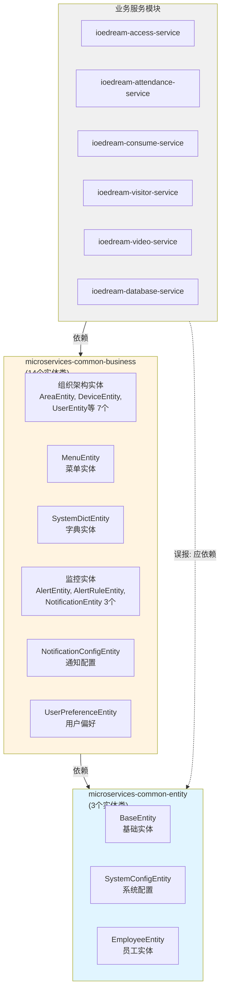
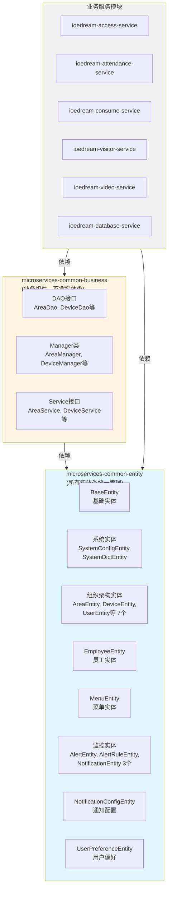
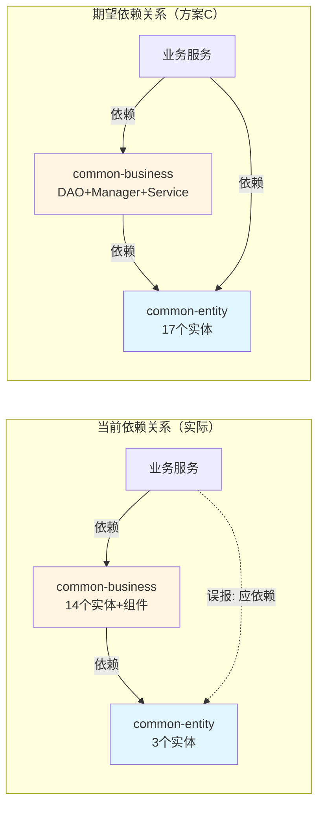
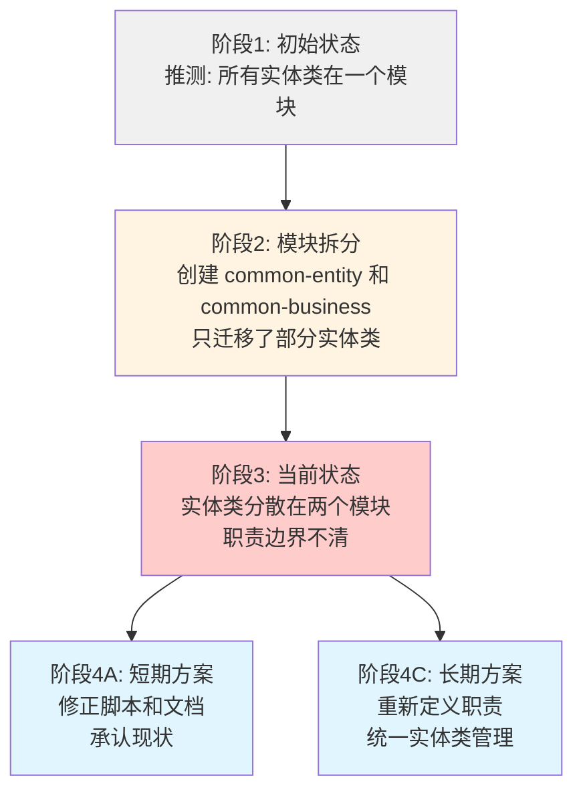

# IOE-DREAM 全局实体类分布根源性深度分析

> **分析日期**: 2025-01-30  
> **分析范围**: 实体类模块分布不一致问题的根源性分析  
> **分析深度**: 从现象到本质，从技术到流程，四层递进分析  
> **分析目标**: 提供系统性、根源性的解决方案

---

## 📊 一、问题现象描述

### 1.1 审计脚本误报现象

**触发场景**: 运行依赖关系审计脚本 `scripts/audit-dependencies.ps1`

**误报结果**:

- 6个业务服务模块被误报为缺少 `microservices-common-entity` 依赖
- 误报模块列表：
  - `ioedream-access-service`
  - `ioedream-attendance-service`
  - `ioedream-consume-service`
  - `ioedream-visitor-service`
  - `ioedream-video-service`
  - `ioedream-database-service`

**误报原因**:

- 审计脚本错误地假设 `organization.entity` 包应该在 `microservices-common-entity` 模块中
- 实际情况：`organization.entity` 包中的实体类都在 `microservices-common-business` 模块中

### 1.2 误报影响评估

**影响范围**:

- ✅ 不影响编译（通过传递依赖可以正常访问实体类）
- ⚠️ 影响审计准确性（误导依赖关系分析）
- ⚠️ 影响架构理解（可能导致错误的架构决策）

---

## 🔍 二、实体类分布现状分析

### 2.1 microservices-common-entity 实际内容

**模块定位**: "公共实体模块，提供基础实体类和通用数据结构"

**实际包含的实体类**（共3个）:

| 实体类 | 包路径 | 分类 | 说明 |
|--------|--------|------|------|
| `BaseEntity` | `net.lab1024.sa.common.entity` | 基础实体 | 所有实体类的基类，提供通用字段 |
| `SystemConfigEntity` | `net.lab1024.sa.common.system.domain.entity` | 系统配置实体 | 系统配置表实体 |
| `EmployeeEntity` | `net.lab1024.sa.common.system.employee.domain.entity` | 业务实体 | 员工信息实体 |

**分布规律**:

- ✅ BaseEntity（基础实体）：符合"基础实体类"定位
- ⚠️ SystemConfigEntity（系统级实体）：属于系统配置，归类合理
- ⚠️ EmployeeEntity（业务级实体）：属于业务实体，但放在了"基础实体"模块中

### 2.2 microservices-common-business 实际内容

**模块定位**: "业务公共组件模块：跨服务共享的业务契约、DTO、工具等（仅限稳定契约，不含领域实现）"

**实际包含的实体类**（共14个）:

#### 组织架构相关实体（7个）

| 实体类 | 包路径 | 说明 |
|--------|--------|------|
| `AreaEntity` | `net.lab1024.sa.common.organization.entity` | 区域实体 |
| `DeviceEntity` | `net.lab1024.sa.common.organization.entity` | 设备实体 |
| `UserEntity` | `net.lab1024.sa.common.organization.entity` | 用户实体 |
| `AreaDeviceEntity` | `net.lab1024.sa.common.organization.entity` | 区域设备关联实体 |
| `AreaUserEntity` | `net.lab1024.sa.common.organization.entity` | 区域用户关联实体 |
| `AreaAccessExtEntity` | `net.lab1024.sa.common.organization.entity` | 区域门禁扩展实体 |
| `AntiPassbackRecordEntity` | `net.lab1024.sa.common.organization.entity` | 防潜回记录实体 |

#### 其他业务实体（7个）

| 实体类 | 包路径 | 分类 |
|--------|--------|------|
| `MenuEntity` | `net.lab1024.sa.common.menu.entity` | 菜单实体 |
| `SystemDictEntity` | `net.lab1024.sa.common.system.domain.entity` | 字典实体 |
| `AlertEntity` | `net.lab1024.sa.common.monitor.domain.entity` | 告警实体 |
| `AlertRuleEntity` | `net.lab1024.sa.common.monitor.domain.entity` | 告警规则实体 |
| `NotificationEntity` | `net.lab1024.sa.common.monitor.domain.entity` | 通知实体 |
| `NotificationConfigEntity` | `net.lab1024.sa.common.notification.domain.entity` | 通知配置实体 |
| `UserPreferenceEntity` | `net.lab1024.sa.common.preference.entity` | 用户偏好实体 |

**分布规律**:

- ⚠️ 包含大量业务实体类，与"业务公共组件"定位一致
- ⚠️ 但这些实体类本应该放在"实体类模块"中，却放在了"业务组件模块"中

### 2.3 实体类分布对比分析

**对比表格**:

| 分类 | microservices-common-entity | microservices-common-business | 分布合理性 |
|------|---------------------------|------------------------------|-----------|
| **基础实体** | BaseEntity ✅ | - | ✅ 合理 |
| **系统级实体** | SystemConfigEntity ✅ | SystemDictEntity ⚠️ | ⚠️ 分散（字典应该在entity中？） |
| **组织架构实体** | - | AreaEntity, DeviceEntity, UserEntity等 ⚠️ | ⚠️ 不合理（应在entity中？） |
| **业务实体** | EmployeeEntity ⚠️ | MenuEntity, AlertEntity等 ⚠️ | ⚠️ 分散且混乱 |

**关键发现**:

1. **实体类分散**：实体类分布在两个模块中，缺乏统一管理
2. **分类标准不清**：无法明确判断哪些实体应该在哪
3. **模块职责重叠**：两个模块都包含业务实体类

---

## 📐 三、架构设计与实现偏差分析

### 3.1 架构规范文档的期望

**CLAUDE.md 中的描述**:

```markdown
## 公共模块包结构
net.lab1024.sa.common/
├── core/                    # 核心模块（最小稳定内核，尽量纯 Java）
│   ├── domain/             # 通用领域对象
│   ├── entity/             # 基础实体
│   ├── config/             # 核心配置
│   └── util/               # 核心工具
├── organization/            # 组织架构
│   ├── entity/             # User, Department, Area, Device
│   ├── dao/
│   ├── service/
│   ├── manager/
│   └── domain/
```

**期望的模块职责**:

- `microservices-common-core`: 核心工具类（ResponseDTO, BaseEntity等）
- `microservices-common-entity`: **实体类统一管理**
- `microservices-common-business`: 业务公共组件（DAO, Manager等）

**关键期望**:

- ✅ 实体类应该在 `microservices-common-entity` 中统一管理
- ✅ `microservices-common-business` 应该只包含 DAO、Manager 等业务组件

### 3.2 模块拆分文档的说明

**COMMON_LIBRARY_SPLIT.md 中的描述**:

```markdown
**第1层（最底层模块）**：
- `microservices-common-entity` - 基础实体类

**第2层（基础能力模块）**：
- `microservices-common-business` - 业务公共组件（组织架构、用户管理等）
```

**重要说明**:

- `microservices-common-entity` 被定义为"基础实体类"，属于第1层
- `microservices-common-business` 被定义为"业务公共组件"，属于第2层
- **文档中未明确说明实体类的具体分布规则**

### 3.3 实际代码实现

**实际分布**:

- `microservices-common-entity`: 仅包含3个实体类（BaseEntity, SystemConfigEntity, EmployeeEntity）
- `microservices-common-business`: 包含14个实体类（组织架构、菜单、监控、通知等）

### 3.4 偏差分析

**偏差对比表**:

| 维度 | 规范期望 | 实际实现 | 偏差程度 |
|------|---------|---------|---------|
| **实体类分布** | 统一在 `common-entity` | 分散在两个模块 | 🔴 严重偏差 |
| **模块职责** | entity=实体，business=业务组件 | entity=部分实体，business=实体+组件 | 🔴 严重偏差 |
| **组织架构实体** | 应在 `common-entity` | 在 `common-business` | 🔴 严重偏差 |

**偏差原因分析**:

1. **架构演进不彻底**:
   - 最初可能所有实体类都在一个模块中
   - 模块拆分时，只迁移了部分实体类到 `common-entity`
   - 组织架构相关实体类被遗漏，仍留在 `common-business` 中

2. **模块职责定义模糊**:
   - 文档中未明确区分"基础实体"和"业务实体"
   - 未建立实体类划分的明确标准
   - 导致实体类分布混乱

3. **文档更新滞后**:
   - 架构文档描述了期望状态
   - 但实际代码实现未跟上
   - 文档与代码不一致

---

## 🎯 四、四层递进根源性分析

### 4.1 L0层 - 表面现象

**问题表现**:

- 审计脚本误报6个业务服务模块缺少 `microservices-common-entity` 依赖
- 误报原因是脚本推断逻辑错误

**直接原因**:

- 审计脚本假设 `organization.entity` 包应该在 `microservices-common-entity` 模块中
- 实际情况：`organization.entity` 包在 `microservices-common-business` 模块中

### 4.2 L1层 - 技术根源

**技术问题**:

**审计脚本推断逻辑**（`scripts/audit-dependencies.ps1` 第70行）:

```powershell
elseif ($importPath -match "^organization\.entity|^system\.domain\.entity") {
    $expectedModule = "microservices-common-entity"  # ❌ 错误推断
}
```

**问题分析**:

- 脚本基于包路径模式匹配推断模块归属
- 推断规则假设 `organization.entity` 在 `common-entity` 模块中
- 但实际代码中，`organization.entity` 在 `common-business` 模块中
- **脚本推断逻辑与实际代码结构不匹配**

**技术根源**:

- 脚本使用硬编码的包路径到模块的映射规则
- 映射规则未反映实际代码结构
- 缺乏动态检测实体类实际所在模块的机制

### 4.3 L2层 - 架构根源

**架构问题**:

#### 问题1：实体类分布不一致

**现状**:

- 实体类分散在两个模块中（`common-entity` 和 `common-business`）
- 缺乏统一的分布标准

**架构影响**:

- 模块职责边界不清
- 开发者难以确定实体类的位置
- 依赖关系复杂化（业务服务需要依赖 `common-business` 才能访问实体类）

#### 问题2：模块职责定义模糊

**定义对比**:

| 模块 | 规范定义 | 实际内容 | 职责边界 |
|------|---------|---------|---------|
| `microservices-common-entity` | "基础实体类" | BaseEntity + SystemConfigEntity + EmployeeEntity | ⚠️ 模糊（基础实体 vs 业务实体？） |
| `microservices-common-business` | "业务公共组件" | 实体类 + DAO + Manager | 🔴 混乱（包含实体类，但定位是"业务组件"） |

**架构根源**:

- 未明确区分"基础实体"和"业务实体"
- 未建立实体类分类和分布的标准
- 模块职责定义与实际实现不一致

#### 问题3：架构演进不彻底

**演进历史推测**:

```
阶段1: 初始状态（推测）
  └── 所有实体类可能都在一个模块中（可能是 microservices-common）

阶段2: 模块拆分（推测）
  ├── 创建 microservices-common-entity（基础实体模块）
  ├── 创建 microservices-common-business（业务组件模块）
  └── 只迁移了部分实体类（BaseEntity, SystemConfigEntity, EmployeeEntity）

阶段3: 当前状态
  ├── microservices-common-entity: 3个实体类
  └── microservices-common-business: 14个实体类（未迁移）
```

**架构根源**:

- 模块拆分时，未完成所有实体类的迁移
- 拆分过程缺乏完整性和一致性检查
- 导致实体类分布混乱

### 4.4 L3层 - 流程根源

**流程问题**:

#### 问题1：缺乏架构一致性保障机制

**现状**:

- 架构变更时，缺乏自动化检查机制
- 文档更新与代码实现不同步
- 未建立架构合规性检查流程

**流程根源**:

- **架构变更流程不完善**：变更时未强制要求文档和代码同步更新
- **缺乏自动化验证**：未建立脚本自动检查架构一致性
- **审查机制缺失**：架构变更未经过一致性审查

#### 问题2：架构规范执行不严格

**现状**:

- 架构规范文档（CLAUDE.md）定义了期望状态
- 但实际代码实现未严格遵循
- 规范与实现长期不一致

**流程根源**:

- **规范执行缺乏强制力**：规范定义了期望，但未强制实施
- **缺乏合规性检查**：未建立定期检查规范执行情况的机制
- **问题发现滞后**：直到创建审计脚本才发现问题

#### 问题3：文档与代码同步机制缺失

**现状**:

- 架构文档描述期望状态
- 代码实现反映实际状态
- 两者不一致，但未被及时发现

**流程根源**:

- **文档更新滞后**：代码变更后，文档未及时更新
- **缺乏同步检查**：未建立文档与代码一致性的检查机制
- **信息不对称**：开发者看到的是代码，而不是文档，导致理解偏差

---

## 🔑 五、根源性原因总结

### 5.1 核心根源问题

#### 根源1：架构演进不彻底（最根本原因）

**问题描述**:

- 模块拆分时，未完成所有实体类的迁移
- 只迁移了部分实体类，遗漏了组织架构相关实体类
- 导致实体类分散在多个模块中

**影响范围**:

- 实体类分布混乱
- 模块职责边界不清
- 依赖关系复杂化

#### 根源2：模块职责定义模糊

**问题描述**:

- 未明确区分"基础实体"和"业务实体"
- 未建立实体类分类和分布的标准
- 模块职责定义与实际实现不一致

**影响范围**:

- 开发者难以确定实体类的位置
- 新实体类的归属不明确
- 架构理解混乱

#### 根源3：缺乏架构一致性保障机制

**问题描述**:

- 架构变更时，缺乏自动化检查机制
- 文档更新与代码实现不同步
- 未建立架构合规性检查流程

**影响范围**:

- 规范与实现长期不一致
- 问题发现滞后
- 架构债务累积

### 5.2 根源性问题关系图

```
架构演进不彻底
    ↓
实体类分布混乱
    ↓
模块职责定义模糊
    ↓
架构规范执行不严格
    ↓
缺乏架构一致性保障机制
    ↓
文档与代码不一致
    ↓
审计脚本推断逻辑错误
    ↓
误报6个业务服务模块
```

---

## 💡 六、解决方案设计

### 6.1 方案A：修正架构设计，使其符合实际实现（短期方案）

**核心思想**:

- 承认 `microservices-common-business` 包含业务实体类的现状
- 修正审计脚本的推断逻辑，使其符合实际代码结构
- 更新架构文档，明确实体类分布规则

**实施步骤**:

1. **修正审计脚本推断逻辑**

   ```powershell
   # scripts/audit-dependencies.ps1 第70行
   # 修改前
   elseif ($importPath -match "^organization\.entity|^system\.domain\.entity") {
       $expectedModule = "microservices-common-entity"  # ❌
   }
   
   # 修改后
   elseif ($importPath -match "^organization\.entity") {
       $expectedModule = "microservices-common-business"  # ✅
   }
   elseif ($importPath -match "^system\.domain\.entity") {
       # SystemConfigEntity 在 common-entity，SystemDictEntity 在 common-business
       # 需要更精确的匹配规则，或基于实际代码扫描
       $expectedModule = "microservices-common-entity"  # 部分正确
   }
   ```

2. **更新架构文档**
   - 在 CLAUDE.md 中明确说明实体类的实际分布
   - 建立实体类分布规则：
     - `microservices-common-entity`: 基础实体（BaseEntity）+ 系统配置实体
     - `microservices-common-business`: 业务实体（组织架构、菜单、监控等）

3. **建立实体类分布标准文档**
   - 创建 `documentation/architecture/ENTITY_DISTRIBUTION_STANDARDS.md`
   - 明确各类实体类的归属规则

**优点**:

- ✅ 实施成本低（只需修正脚本和文档）
- ✅ 不需要代码迁移
- ✅ 快速解决问题

**缺点**:

- ⚠️ 实体类分散在多个模块，职责边界不清
- ⚠️ 可能不符合"统一实体管理"的架构理念
- ⚠️ 只是承认现状，未解决根本问题

**适用场景**: 短期快速修复，为长期重构争取时间

---

### 6.2 方案B：重构代码，使其符合架构设计（长期方案）

**核心思想**:

- 将所有业务实体类迁移到 `microservices-common-entity`
- 保持 `microservices-common-business` 只包含 DAO、Manager 等业务组件
- 更新依赖关系

**实施步骤**:

1. **实体类迁移**
   - 将 `microservices-common-business` 中的14个实体类迁移到 `microservices-common-entity`
   - 保持包路径不变（`net.lab1024.sa.common.organization.entity` 等）

2. **更新依赖关系**
   - `microservices-common-business` 依赖 `microservices-common-entity`（已存在）
   - 业务服务依赖 `microservices-common-entity`（新增显式依赖）

3. **更新pom.xml**
   - 各业务服务的pom.xml中显式声明 `microservices-common-entity` 依赖

4. **测试验证**
   - 编译测试
   - 功能测试
   - 依赖关系验证

**优点**:

- ✅ 架构清晰，职责明确
- ✅ 符合"统一实体管理"理念
- ✅ 实体类集中管理，易于维护

**缺点**:

- ⚠️ 实施成本高（需要迁移代码、更新依赖、测试验证）
- ⚠️ 影响面广（所有依赖这些实体类的服务都需要验证）
- ⚠️ 风险较高（需要充分测试）

**适用场景**: 长期架构优化，需要充分的测试和验证

---

### 6.3 方案C：重新定义模块职责，明确划分标准（根本解决方案）

**核心思想**:

- 重新定义 `microservices-common-entity` 和 `microservices-common-business` 的职责
- 建立实体类划分标准（例如：基础实体 vs 业务实体 vs 系统实体）
- 根据新标准重新分布实体类

**实施步骤**:

1. **重新定义模块职责**

   **microservices-common-entity**:
   - **定位**: 所有实体类的统一管理模块
   - **职责**:
     - 基础实体（BaseEntity等）
     - 系统级实体（SystemConfigEntity, SystemDictEntity等）
     - 业务实体（AreaEntity, DeviceEntity, UserEntity, EmployeeEntity等）
   - **原则**: 所有实体类都应在此模块中

   **microservices-common-business**:
   - **定位**: 业务公共组件模块
   - **职责**:
     - DAO接口（数据访问层）
     - Manager类（业务编排层）
     - Service接口（服务接口层）
   - **原则**: 不包含实体类，只包含业务逻辑组件

2. **建立实体类划分标准**

   | 实体类型 | 归属模块 | 示例 |
   |---------|---------|------|
   | **基础实体** | `microservices-common-entity` | BaseEntity |
   | **系统级实体** | `microservices-common-entity` | SystemConfigEntity, SystemDictEntity |
   | **业务实体** | `microservices-common-entity` | AreaEntity, DeviceEntity, UserEntity, EmployeeEntity |
   | **领域实体** | `microservices-common-entity` | 所有领域实体 |

   **划分原则**:
   - ✅ 所有实体类统一在 `microservices-common-entity` 中管理
   - ✅ `microservices-common-business` 不包含实体类
   - ✅ 实体类按业务域组织（organization, system, monitor等）

3. **实体类迁移和重构**

   - 将 `microservices-common-business` 中的所有实体类迁移到 `microservices-common-entity`
   - 保持包路径结构不变
   - 更新依赖关系

4. **更新文档和规范**

   - 更新 CLAUDE.md 中的模块职责定义
   - 更新 COMMON_LIBRARY_SPLIT.md 中的模块说明
   - 创建实体类分布标准文档

5. **建立架构一致性保障机制**

   - 创建架构合规性检查脚本
   - 在CI/CD中集成架构检查
   - 建立架构变更审查流程

**优点**:

- ✅ 架构清晰，标准明确
- ✅ 避免未来的混乱
- ✅ 从根本上解决问题

**缺点**:

- ⚠️ 需要架构委员会决策
- ⚠️ 需要重构代码
- ⚠️ 实施周期较长

**适用场景**: 根本性架构优化，需要架构委员会决策和充分的规划

---

## 🎯 七、推荐方案

### 7.1 短期方案（立即执行）

**推荐**: **方案A - 修正架构设计，使其符合实际实现**

**理由**:

1. 快速解决问题：只需修正脚本和文档，不需要代码迁移
2. 风险低：不改变现有代码结构，不影响现有功能
3. 为长期方案争取时间：先解决燃眉之急，再规划长期优化

**实施时间**: 1-2天

**关键任务**:

1. 修正审计脚本推断逻辑（1小时）
2. 更新架构文档，明确实体类分布规则（2小时）
3. 创建实体类分布标准文档（2小时）
4. 验证修正后的脚本（1小时）

### 7.2 长期方案（3-6个月内）

**推荐**: **方案C - 重新定义模块职责，明确划分标准**

**理由**:

1. 从根本上解决问题：建立清晰的架构标准
2. 避免未来混乱：明确的划分标准可以指导未来的开发
3. 提升架构质量：统一的实体类管理更符合架构最佳实践

**实施时间**: 3-6个月

**关键任务**:

1. 架构委员会决策（1周）
2. 详细设计方案（2周）
3. 实体类迁移（4-8周）
4. 测试和验证（2-4周）
5. 文档更新（1周）

### 7.3 方案选择建议

**如果选择方案A（短期）**:

- ✅ 立即修正审计脚本
- ✅ 更新架构文档
- ⚠️ 承认实体类分散的现状
- ⚠️ 在文档中明确说明这是"技术债务"，待后续重构

**如果选择方案C（长期）**:

- ✅ 从根本上解决问题
- ✅ 建立清晰的架构标准
- ⚠️ 需要充分的规划和测试
- ⚠️ 建议分阶段实施，降低风险

---

## 📊 八、可视化分析

### 8.1 当前实体类分布图



### 8.2 期望的实体类分布图（方案C）



### 8.3 依赖关系对比图



### 8.4 架构演进路径图



---

## 📋 九、行动计划

### 9.1 立即行动（1-2天）

**任务清单**:

1. ✅ **修正审计脚本推断逻辑**
   - 文件：`scripts/audit-dependencies.ps1`
   - 修改：将 `organization.entity` 包映射到 `microservices-common-business`
   - 验证：重新运行脚本，确保无误报

2. ✅ **更新架构文档**
   - 文件：`CLAUDE.md`
   - 内容：明确说明实体类的实际分布
   - 说明：承认现状，标注为"技术债务"

3. ✅ **创建实体类分布标准文档**
   - 文件：`documentation/architecture/ENTITY_DISTRIBUTION_STANDARDS.md`
   - 内容：明确各类实体类的归属规则

### 9.2 短期计划（1周内）

**任务清单**:

1. **完善架构一致性检查机制**
   - 增强审计脚本，支持动态检测实体类实际所在模块
   - 建立文档与代码一致性检查脚本

2. **建立架构合规性检查流程**
   - 在CI/CD中集成架构检查
   - 建立架构变更审查清单

### 9.3 长期规划（3-6个月）

**任务清单**:

1. **架构委员会决策**
   - 讨论方案C的可行性
   - 制定详细的实施计划
   - 确定实施时间表

2. **详细设计方案**
   - 设计实体类迁移方案
   - 设计依赖关系更新方案
   - 设计测试验证方案

3. **分阶段实施**
   - 阶段1：迁移组织架构实体类
   - 阶段2：迁移其他业务实体类
   - 阶段3：更新依赖关系
   - 阶段4：测试和验证

4. **文档更新**
   - 更新架构规范文档
   - 更新模块拆分文档
   - 更新开发指南

---

## 📝 十、总结

### 10.1 核心发现

1. **实体类分布不一致**：实体类分散在两个模块中，缺乏统一管理
2. **架构设计与实现偏差**：规范期望实体类统一在 `common-entity`，但实际分散在两个模块
3. **根源性问题**：架构演进不彻底、模块职责定义模糊、缺乏架构一致性保障机制

### 10.2 解决方案

- **短期**：方案A - 修正脚本和文档，承认现状（1-2天）
- **长期**：方案C - 重新定义模块职责，统一实体类管理（3-6个月）

### 10.3 关键建议

1. **立即执行方案A**：快速解决审计脚本误报问题
2. **规划方案C**：从根本上解决架构问题，提升架构质量
3. **建立保障机制**：建立架构一致性检查机制，防止未来出现类似问题

---

**分析人**: IOE-DREAM 架构委员会  
**分析日期**: 2025-01-30  
**状态**: ✅ 分析完成，✅ 方案C已执行（实体类迁移完成）  
**版本**: v1.0.0

---

## 📝 十一、方案C执行记录

### 11.1 执行时间

**执行日期**: 2025-01-30

### 11.2 执行结果

**✅ 实体类迁移完成**:

- 成功将14个实体类从 `microservices-common-business` 迁移到 `microservices-common-entity`
- 迁移后 `microservices-common-entity` 包含17个实体类（3个原有 + 14个迁移）
- `microservices-common-business` 已不包含任何实体类

**迁移详情**:

- ✅ 组织架构实体类（7个）：AreaEntity, DeviceEntity, UserEntity, AreaDeviceEntity, AreaUserEntity, AreaAccessExtEntity, AntiPassbackRecordEntity
- ✅ 菜单实体类（1个）：MenuEntity
- ✅ 监控实体类（3个）：AlertEntity, AlertRuleEntity, NotificationEntity
- ✅ 通知实体类（1个）：NotificationConfigEntity
- ✅ 偏好实体类（1个）：UserPreferenceEntity
- ✅ 系统实体类（1个）：SystemDictEntity

**✅ 模块职责重新定义**:

- `microservices-common-entity`: 所有实体类的统一管理模块（17个实体类）
- `microservices-common-business`: 业务公共组件模块（0个实体类，只包含DAO、Manager、Service接口）

**✅ 审计脚本推断逻辑**:

- 审计脚本的推断逻辑现在是正确的（`organization.entity` 和 `system.domain.entity` 确实在 `microservices-common-entity` 中）
- 不再需要修正脚本推断逻辑

### 11.3 后续工作

**待完成**:

- [ ] 验证所有业务服务模块的编译（确认依赖关系正确）
- [ ] 更新架构文档（CLAUDE.md、COMMON_LIBRARY_SPLIT.md）
- [ ] 运行完整的测试套件验证功能
- [ ] 更新审计脚本文档说明新的实体类分布

**参考文档**:

- 详细迁移计划：`documentation/technical/SOLUTION_C_ENTITY_MIGRATION_PLAN.md`
