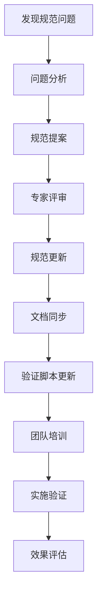

# IOE-DREAM 全局规范矩阵

> **版本**: v1.0
> **更新时间**: 2025-11-17
> **维护团队**: SmartAdmin规范治理委员会
> **覆盖范围**: 全栈开发、文档管理、技能体系、质量保证

---

## 📋 规范体系概述

本文档建立了IOE-DREAM项目的全局规范矩阵，确保代码、文档、技能体系的完全一致性。基于repowiki核心规范，建立多维度、全覆盖的规范治理体系。

## 🏗️ 五大核心规范领域

### 1. 架构设计规范
**文档**: `docs/repowiki/zh/content/开发规范体系/核心规范/架构设计规范.md`

#### 🔴 一级规范（绝对禁止）
- ❌ 禁止跨层直接访问（如Controller直接访问DAO）
- ❌ 禁止违反依赖倒置原则
- ❌ 禁止跳过项目管理流程直接开发
- ❌ 禁止Service层直接访问数据库

#### 🟡 二级规范（必须遵循）
- ✅ 严格遵循四层架构：Controller → Service → Manager → Repository
- ✅ 上层依赖下层，禁止反向依赖
- ✅ 按业务领域拆分微服务
- ✅ 统一技术栈，严禁未批准组件

### 2. Java编码规范
**文档**: `docs/repowiki/zh/content/开发规范体系/核心规范/Java编码规范.md`

#### 🔴 一级规范（绝对禁止）
- ❌ 禁止使用@Autowired，必须使用@Resource
- ❌ 禁止使用javax.*包，必须使用jakarta.*
- ❌ 禁止使用System.out.println()
- ❌ 禁止跨层直接访问
- ❌ 禁止硬编码字符串和魔法数字

#### 🟡 二级规范（必须遵循）
- ✅ 统一命名规范（包名、类名、方法名、变量名）
- ✅ 代码复杂度≤10
- ✅ 异常处理全覆盖
- ✅ 单元测试覆盖率≥80%
- ✅ 完整的JavaDoc注释

### 3. API设计规范
**文档**: `docs/repowiki/zh/content/开发规范体系/核心规范/RESTfulAPI设计规范.md`

#### 🔴 一级规范（绝对禁止）
- ❌ 禁止GET方法进行数据修改
- ❌ 禁止返回未经包装的原始数据
- ❌ 禁止缺少权限验证
- ❌ 禁止绕过Knife4j注解

#### 🟡 二级规范（必须遵循）
- ✅ 统一ResponseDTO响应格式
- ✅ @Valid参数验证
- ✅ Sa-Token权限控制
- ✅ Knife4j API文档
- ✅ 统一异常处理

### 4. 系统安全规范
**文档**: `docs/repowiki/zh/content/开发规范体系/核心规范/系统安全规范.md`

#### 🔴 一级规范（绝对禁止）
- ❌ 禁止硬编码密码密钥
- ❌ 禁止日志输出敏感信息
- ❌ 禁止SQL注入漏洞
- ❌ 禁止绕过Sa-Token权限检查

#### 🟡 二级规范（必须遵循）
- ✅ 所有输入验证和过滤
- ✅ 敏感数据加密存储
- ✅ HTTPS通信
- ✅ 操作审计日志
- ✅ 定期安全扫描

### 5. 缓存架构规范
**文档**: `docs/repowiki/zh/content/开发规范体系/核心规范/缓存架构规范.md`

#### 🔴 一级规范（绝对禁止）
- ❌ 禁止直接使用RedisUtil/RedisTemplate
- ❌ 禁止绕过统一缓存架构
- ❌ 禁止自定义TTL策略
- ❌ 禁止非标准缓存键格式

#### 🟡 二级规范（必须遵循）
- ✅ 基于BusinessDataType的TTL策略
- ✅ 统一缓存键命名：`iog:cache:{module}:{namespace}:{key}`
- ✅ 继承BaseModuleCacheService
- ✅ 缓存穿透防护

---

## 🔧 技能体系映射

### 核心技能专家（.claude/skills/）

| 技能文档 | 对应规范 | 主要职责 |
|---------|---------|----------|
| `cache-architecture-specialist.md` | 缓存架构规范 | 统一缓存架构实施 |
| `spring-boot-jakarta-guardian.md` | Java编码规范 | Spring Boot 3.x + Jakarta包名 |
| `four-tier-architecture-guardian.md` | 架构设计规范 | 四层架构守护 |
| `code-quality-protector.md` | Java编码规范 | UTF-8编码 + 零容忍 |
| `database-design-specialist.md` | 架构设计规范 | 数据库设计规范 |
| `access-control-business-specialist.md` | 系统安全规范 | 门禁安全业务逻辑 |

### 技能应用机制

```bash
# 开发前自动触发技能检查
if [ "$TASK_TYPE" == "backend-development" ]; then
    Skill("spring-boot-jakarta-guardian")      # Spring Boot环境检查
    Skill("four-tier-architecture-guardian")   # 架构合规检查
    Skill("code-quality-protector")            # 编码质量检查
fi

if [ "$TASK_TYPE" == "cache-development" ]; then
    Skill("cache-architecture-specialist")     # 缓存架构专家
fi

if [ "$TASK_TYPE" == "security-development" ]; then
    Skill("access-control-business-specialist") # 门禁安全专家
fi
```

---

## 📊 文档体系矩阵

### 层级结构

```
IOE-DREAM项目文档体系
├── 权威规范层 (repowiki/)
│   └── 开发规范体系/核心规范/
│       ├── 架构设计规范.md
│       ├── Java编码规范.md
│       ├── RESTfulAPI设计规范.md
│       ├── 系统安全规范.md
│       └── 缓存架构规范.md
├── 项目指南层 (项目根目录/)
│   ├── CLAUDE.md (开发指南)
│   └── README.md (项目概览)
├── 技能体系层 (.claude/skills/)
│   ├── cache-architecture-specialist.md
│   ├── spring-boot-jakarta-guardian.md
│   ├── four-tier-architecture-guardian.md
│   └── code-quality-protector.md
└── 验证机制层 (scripts/)
    ├── comprehensive-validation.sh
    ├── cache-architecture-validation.sh
    └── documentation-sync-validator.sh
```

### 一致性保证机制

#### 1. 规范一致性
- **repowiki** → 唯一权威规范来源
- **CLAUDE.md** → 开发实施指南
- **skills** → AI辅助开发技能
- **scripts** → 自动化验证机制

#### 2. 内容同步
```bash
# 规范更新触发同步
if [ repowiki_updated ]; then
    update_claude_from_repowiki
    update_skills_from_repowiki
    regenerate_validation_scripts
fi
```

#### 3. 版本一致性
- 所有文档采用统一的版本号体系
- 规范变更触发全局版本更新
- 变更日志记录所有更新历史

---

## 🛡️ 验证机制体系

### 1. 综合规验证证脚本
**文件**: `scripts/comprehensive-validation.sh`

```bash
#!/bin/bash
# 综合规验证证脚本
# 覆盖所有五大核心规范

# 验证维度：
# - 架构设计规范合规性
# - Java编码规范合规性
# - API设计规范合规性
# - 系统安全规范合规性
# - 缓存架构规范合规性
# - 文档一致性验证
# - 技能同步性验证
```

### 2. 分项验证脚本

| 验证脚本 | 验证范围 | 主要检查点 |
|---------|---------|-----------|
| `architecture-validation.sh` | 架构设计规范 | 四层架构、依赖关系、跨层访问 |
| `java-coding-validation.sh` | Java编码规范 | @Resource使用、jakarta包名、代码质量 |
| `api-design-validation.sh` | API设计规范 | RESTful风格、ResponseDTO、权限控制 |
| `security-validation.sh` | 系统安全规范 | Sa-Token使用、敏感信息、审计日志 |
| `cache-architecture-validation.sh` | 缓存架构规范 | 统一缓存服务、TTL策略、键命名 |
| `documentation-sync-validator.sh` | 文档一致性 | repowiki↔CLAUDE↔skills内容同步 |

### 3. 持续集成集成

#### Pre-commit Hook
```bash
#!/bin/sh
# 提交前强制验证
./scripts/comprehensive-validation.sh
if [ $? -ne 0 ]; then
    echo "❌ 规范验证失败，提交被拒绝"
    exit 1
fi
```

#### CI/CD Pipeline
```yaml
# .github/workflows/validation.yml
name: Standards Validation
on: [push, pull_request]
jobs:
  validate:
    runs-on: ubuntu-latest
    steps:
      - uses: actions/checkout@v2
      - name: Validate All Standards
        run: ./scripts/comprehensive-validation.sh
      - name: Generate Compliance Report
        run: ./scripts/generate-compliance-report.sh
```

---

## 📈 合规性度量体系

### 1. 量化指标

| 维度 | 指标 | 目标值 | 测量方法 |
|------|------|--------|----------|
| **架构合规性** | 四层架构违规率 | 0% | 代码静态分析 |
| **编码质量** | 一级规范违规数 | 0 | 自动化检查 |
| **API设计** | RESTful合规率 | 100% | 接口规范检查 |
| **安全规范** | 安全漏洞数 | 0 | 安全扫描工具 |
| **缓存规范** | 统一架构使用率 | 100% | 缓存模式检查 |
| **文档一致性** | 内容同步率 | 100% | 文档比对工具 |
| **测试覆盖** | 单元测试覆盖率 | ≥80% | JaCoCo报告 |

### 2. 质量门禁

#### 🔴 严重违规（阻断发布）
- 任何一级规范违规
- 安全漏洞
- 编译错误
- 测试失败

#### 🟡 警告问题（限制发布）
- 二级规范违规超过5个
- 文档不一致
- 代码覆盖率<80%

#### 🟢 建议优化（可发布）
- 三级规范改进建议
- 性能优化建议
- 代码重构建议

### 3. 报告机制

#### 每日合规报告
```bash
# 生成每日合规报告
./scripts/daily-compliance-report.sh

# 报告内容：
# - 新增违规统计
# - 合规率趋势
# - 重点问题分析
# - 改进建议
```

#### 周度质量回顾
```bash
# 生成周度质量报告
./scripts/weekly-quality-review.sh

# 报告内容：
# - 质量指标趋势
# - 技术债务分析
# - 团队合规情况
# - 下周改进计划
```

---

## 🔄 持续改进机制

### 1. 规范更新流程



### 2. 自动化改进

#### 智能检测
```bash
# 基于AI的规范检测
./scripts/ai-standards-detector.sh

# 功能：
# - 自动识别规范违规模式
# - 智能修复建议
# - 规范优化推荐
```

#### 自适应学习
```bash
# 基于历史数据的规范优化
./scripts/adaptive-standards-optimizer.sh

# 功能：
# - 分析违规模式趋势
# - 优化验证规则
# - 预测潜在问题
```

### 3. 团队培训体系

#### 新人培训
- **第一天**: repowiki规范学习
- **第二天**: 实践技能训练
- **第三天**: 验证机制使用
- **第四天**: 综合考核认证

#### 持续教育
- **月度**: 规范更新培训
- **季度**: 最佳实践分享
- **年度**: 技能认证复审

---

## 📞 支持与反馈

### 规范治理委员会
- **主席**: 首席架构师
- **成员**: 各技术领域专家
- **职责**: 规范制定、争议仲裁、质量监督

### 反馈机制
- **Issue报告**: GitHub Issues
- **紧急响应**: 企业微信技术群
- **定期会议**: 每周规范评审会议
- **改进建议**: 邮件规范委员会

---

**🎯 本全局规范矩阵确保IOE-DREAM项目在代码、文档、技能、质量等所有维度实现100%一致性和合规性！**

**📈 通过严格的验证机制和持续的改进循环，建立企业级开发规范治理体系！**

**⚠️ 所有规范强制执行，违反任何一级规范都将导致开发流程阻断！**