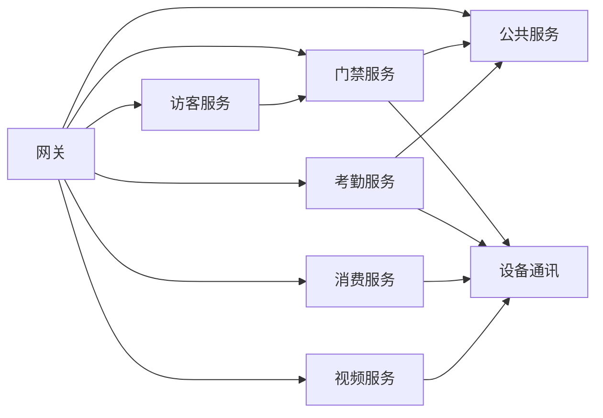

# IOE-DREAM 集成测试用例文档

> **版本**: v1.0.0  
> **更新日期**: 2025-12-17

---

## 1. 测试范围

### 1.1 模块间集成关系

---

## 2. 认证授权集成测试

### TC-AUTH-001: 登录→获取Token→访问资源

| 项目 | 内容 |
|------|------|
| 前置条件 | 用户账号存在 |
| 步骤 | 1. POST /auth/login 2. 获取accessToken 3. GET /employee/page (带Token) |
| 预期 | 步骤3返回200及数据 |

### TC-AUTH-002: Token过期自动刷新

| 项目 | 内容 |
|------|------|
| 前置条件 | 持有有效refreshToken |
| 步骤 | 1. 使用过期accessToken访问 2. 返回401 3. POST /auth/refresh 4. 重新访问 |
| 预期 | 步骤4返回200 |

### TC-AUTH-003: 权限不足拒绝访问

| 项目 | 内容 |
|------|------|
| 前置条件 | 普通用户Token |
| 步骤 | 访问 /api/v1/system/config (需管理员权限) |
| 预期 | 返回403 |

---

## 3. 门禁-考勤集成测试

### TC-ACC-ATT-001: 门禁打卡→考勤记录

| 项目 | 内容 |
|------|------|
| 前置条件 | 员工有门禁权限和排班 |
| 步骤 | 1. 门禁设备推送打卡事件 2. 查询考勤记录 |
| 预期 | 考勤记录包含该打卡 |

### TC-ACC-ATT-002: 考勤异常→门禁告警

| 项目 | 内容 |
|------|------|
| 前置条件 | 设置迟到告警规则 |
| 步骤 | 1. 迟到打卡 2. 检查告警 |
| 预期 | 生成迟到告警记录 |

---

## 4. 访客-门禁集成测试

### TC-VIS-ACC-001: 访客预约→获取权限→通行

| 项目 | 内容 |
|------|------|
| 前置条件 | 访客预约已审批 |
| 步骤 | 1. 访客签到 2. 生成临时权限 3. 门禁验证通行 |
| 预期 | 访客可正常通行 |

### TC-VIS-ACC-002: 访客签退→权限回收

| 项目 | 内容 |
|------|------|
| 前置条件 | 访客已签到 |
| 步骤 | 1. 访客签退 2. 尝试门禁通行 |
| 预期 | 门禁拒绝通行 |

---

## 5. 消费-设备集成测试

### TC-CON-DEV-001: 消费机扣款

| 项目 | 内容 |
|------|------|
| 前置条件 | 用户余额充足 |
| 步骤 | 1. 消费机发起扣款 2. 查询余额 3. 查询交易记录 |
| 预期 | 余额正确扣减，记录生成 |

### TC-CON-DEV-002: 余额不足拒绝

| 项目 | 内容 |
|------|------|
| 前置条件 | 用户余额不足 |
| 步骤 | 消费机发起扣款 |
| 预期 | 返回余额不足错误 |

---

## 6. 视频-门禁集成测试

### TC-VID-ACC-001: 门禁事件→视频联动

| 项目 | 内容 |
|------|------|
| 前置条件 | 配置门禁-视频联动规则 |
| 步骤 | 1. 触发门禁告警 2. 检查视频录制 |
| 预期 | 自动开始录制 |

### TC-VID-ACC-002: 人脸识别→开门

| 项目 | 内容 |
|------|------|
| 前置条件 | 人脸已录入 |
| 步骤 | 1. 视频人脸识别 2. 触发开门指令 |
| 预期 | 门禁自动开启 |

---

## 7. 全链路测试

### TC-E2E-001: 员工入职全流程

| 步骤 | 操作 | 验证点 |
|------|------|--------|
| 1 | 人事创建员工 | 员工信息正确 |
| 2 | 分配部门 | 部门关联正确 |
| 3 | 录入人脸/指纹 | 生物特征存储 |
| 4 | 分配门禁权限 | 权限下发成功 |
| 5 | 分配考勤排班 | 排班生效 |
| 6 | 开通消费账户 | 账户创建成功 |
| 7 | 首次打卡 | 考勤记录生成 |

### TC-E2E-002: 访客来访全流程

| 步骤 | 操作 | 验证点 |
|------|------|--------|
| 1 | 访客预约 | 预约创建成功 |
| 2 | 被访人审批 | 状态变更 |
| 3 | 访客签到 | 临时权限生成 |
| 4 | 门禁通行 | 通行记录 |
| 5 | 访客签退 | 权限回收 |

---

## 8. 异常场景测试

### TC-ERR-001: 服务降级

| 项目 | 内容 |
|------|------|
| 场景 | 下游服务不可用 |
| 步骤 | 关闭考勤服务，访问考勤接口 |
| 预期 | 返回友好错误提示，不影响其他服务 |

### TC-ERR-002: 网络超时

| 项目 | 内容 |
|------|------|
| 场景 | 设备响应超时 |
| 步骤 | 模拟设备响应延迟5秒 |
| 预期 | 返回超时错误，可重试 |

---

**📝 文档维护**: IOE-DREAM架构团队
