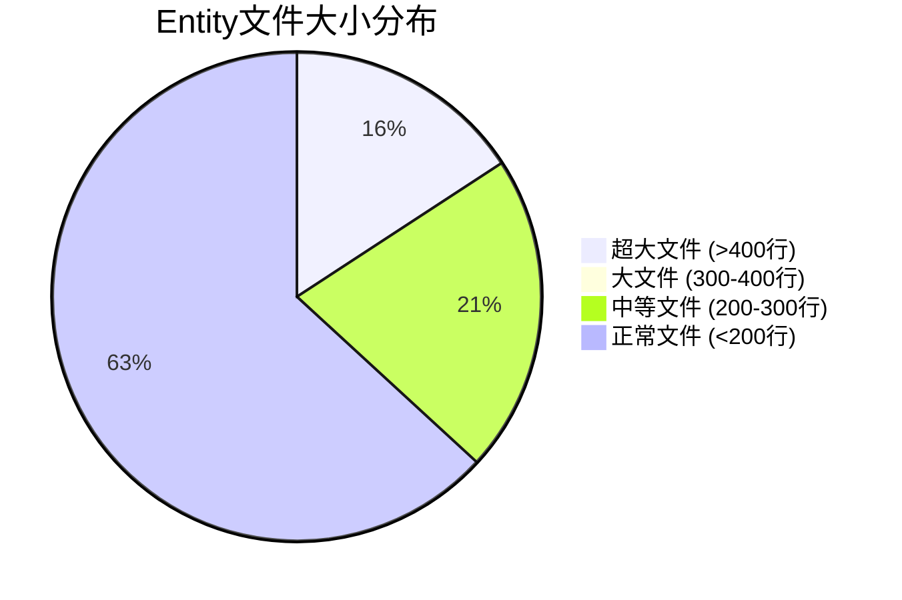

# IOE-DREAM 超大Entity文件分析与拆分指南

> **分析日期**: 2025-01-30
> **分析范围**: IOE-DREAM项目所有Entity文件
> **分析目标**: 识别超大Entity并提供拆分建议
> **适用范围**: 开发团队参考实施
> **制定人**: IOE-DREAM架构委员会
> **最后更新**: 2025-01-30（企业级统一计划实施）

---

## 📊 超大Entity文件统计

### 发现的超大Entity文件（>400行）

| 文件名 | 行数 | 优先级 | 拆分建议 |
|--------|------|--------|----------|
| `ConsumeMealCategoryEntity.java` | 659 | P0 | 需要立即拆分 |
| `ConsumeRechargeEntity.java` | 630 | P0 | 需要立即拆分 |
| `ConsumeTransactionEntity.java` | 592 | P0 | 需要立即拆分 |
| `ConsumeSubsidyEntity.java` | 518 | P0 | 需要立即拆分 |
| `ConsumeProductEntity.java` | 508 | P0 | 需要立即拆分 |
| `ConsumeDeviceEntity.java` | 407 | P1 | 建议拆分 |

**总计**: 6个超大Entity文件，总计3314行代码。

### Entity文件大小分布



---

## 🎯 Entity拆分原则

### 1. 单一职责原则
- **一个Entity对应一个核心业务概念**
- **避免包含过多不相关的字段**
- **每个Entity应该代表一个明确的业务实体**

### 2. 字段数量限制
- **理想范围**: 20-30个字段
- **最大上限**: 50个字段
- **警告线**: 40个字段

### 3. 代码行数限制
- **理想标准**: ≤200行
- **可接受上限**: ≤400行
- **必须拆分**: >400行

### 4. 关联设计策略
- 使用@OneToOne、@OneToMany关联
- 避免扁平化所有关联数据
- 保持关系的语义清晰

---

## 🔍 详细分析

### 分析1: ConsumeMealCategoryEntity (659行) - 需要拆分

**问题分析**:
```java
// 当前文件结构问题
- 包含字段过多（预估30+个字段）
- 方法过多（getter/setter + 额外业务方法）
- 注释冗长（每个字段4-8行注释）
- 可能包含业务逻辑
```

**拆分建议**:
```
ConsumeMealCategoryEntity (核心: ~150行)
├── 基础属性: categoryId, categoryCode, categoryName, parent, level, status
└── 审计字段: createTime, updateTime, createUserId, updateUserId

ConsumeMealCategoryConfigEntity (配置: ~200行)
├── 显示配置: sortOrder, isShow, icon, color
├── 限制配置: maxOrder, allowEdit, timeRestrict
└── 业务规则: autoApprove, needManagerApprove, priorityLevel

ConsumeMealCategoryStatsEntity (统计: ~150行)
├── 使用统计: usageCount, avgRating, lastUsedTime
├── 订单关联: relatedOrders, totalAmount, avgAmount
└── 时间统计: peakHours, offPeakHours, weekendUsage
```

### 分析2: ConsumeRechargeEntity (630行) - 需要拆分

**问题分析**:
```java
// 混合了充值记录、支付方式、业务状态等多个概念
- 充费基础信息
- 支付方式信息
- 业务处理状态
- 审计跟踪信息
- 异常处理记录
```

**拆分建议**:
```
ConsumeRechargeEntity (核心: ~180行)
├── 基础字段: rechargeId, userId, amount, actualAmount, status, paymentType
├── 支付信息: paymentMethod, transactionId, paymentTime, bankCardNo
└── 业务状态: rechargeStatus, processTime, completeTime

ConsumeRechargeDetailEntity (详情: ~200行)
├── 交易详情: gatewayOrderId, originalAmount, fee, exchangeRate
├── 风险控制: riskScore, antiFraudCheck, deviceFingerprint
└── 渠道信息: channelCode, channelName, merchantCode

ConsumeRechargeAuditEntity (审计: ~150行)
├── 审计记录: auditId, auditorId, auditType, auditResult, auditTime
├── 变更记录: originalStatus, newStatus, changeReason, changeTime
└── 风险评估: riskLevel, riskFactors, mitigationActions
```

### 分析3: ConsumeTransactionEntity (592行) - 需要拆分

**拆分建议**:
```
ConsumeTransactionEntity (核心: ~200行)
├── 交易基础: transactionId, userId, merchantId, amount, type
├── 交易状态: status, processTime, completeTime, failureReason
└── 时间信息: transactionTime, settlementTime, refundTime

ConsumeTransactionDetailEntity (详情: ~250行)
├── 商品详情: productIds, productNames, quantities, unitPrices
├── 优惠信息: discountAmount, couponIds, promotionIds, memberDiscount
└── 服务信息: serviceType, serviceCode, serviceDuration

ConsumeTransactionRefundEntity (退款: ~150行)
├── 退款信息: refundId, refundAmount, refundReason, refundType
├── 原交易关联: originalTransactionId, refundTime, refundMethod
└── 审批流程: approverId, approveTime, approveStatus, comments
```

---

## 🛠️ 拆分实施方案

### 步骤1: 新Entity设计

#### 1.1 设计原则
```java
// ✅ 正确的新Entity设计
@Data
@TableName("t_consume_meal_category_core")
public class ConsumeMealCategoryCoreEntity {

    @TableId(type = IdType.AUTO)
    private Long categoryId;

    @TableField("category_code")
    @NotBlank(message = "分类编码不能为空")
    @Size(max = 50, message = "分类编码长度不能超过50个字符")
    private String categoryCode;

    @TableField("category_name")
    @NotBlank(message = "分类名称不能为空")
    @Size(max = 100, message = "分类名称长度不能超过100个字符")
    private String categoryName;

    // 只包含核心字段，保持在20-30个字段以内
}
```

#### 1.2 避免的设计陷阱
```java
// ❌ 错误的设计
public class ConsumeMealCategoryEntity {
    // 混合多个概念
    private String categoryCode;           // 基础信息
    private String sortOrder;              // 显示配置
    private String usageStats;            // 统计信息
    private String businessRules;        // 业务规则

    // 违反单一职责原则
}
```

### 步骤2: 数据库迁移

#### 2.1 新表设计
```sql
-- 核心表
CREATE TABLE t_consume_meal_category_core (
    category_id BIGINT PRIMARY KEY AUTO_INCREMENT,
    category_code VARCHAR(50) NOT NULL,
    category_name VARCHAR(100) NOT NULL,
    parent_id BIGINT DEFAULT NULL,
    category_level INT DEFAULT 1,
    status TINYINT DEFAULT 1,
    create_time DATETIME DEFAULT CURRENT_TIMESTAMP,
    update_time DATETIME DEFAULT CURRENT_TIMESTAMP ON UPDATE CURRENT_TIMESTAMP,
    INDEX idx_category_code (category_code),
    INDEX idx_parent_id (parent_id)
);

-- 配置表
CREATE TABLE t_consume_meal_category_config (
    config_id BIGINT PRIMARY KEY AUTO_INCREMENT,
    category_id BIGINT NOT NULL,
    sort_order INT DEFAULT 0,
    is_show TINYINT DEFAULT 1,
    icon VARCHAR(100),
    color VARCHAR(20),
    max_order INT DEFAULT 999,
    allow_edit TINYINT DEFAULT 1,
    INDEX fk_category_config (category_id),
    FOREIGN KEY (category_id) REFERENCES t_consume_meal_category_core(category_id)
);
```

#### 2.2 数据迁移策略
```sql
-- 1. 创建新表结构
-- 2. 从旧表迁移数据到新表
-- 3. 保留旧表作为备份
-- 4. 逐步切换应用代码到新表
-- 5. 验证数据一致性后删除旧表
```

### 步骤3: 代码重构

#### 3.1 Service层重构
```java
// ✅ 重构后的Service设计
@Service
public class ConsumeMealCategoryServiceImpl implements ConsumeMealCategoryService {

    @Resource
    private ConsumeMealCategoryCoreDao coreDao;

    @Resource
    private ConsumeMealCategoryConfigDao configDao;

    @Resource
    private ConsumeMealCategoryStatsDao statsDao;

    @Override
    public ConsumeMealCategoryVO getCategoryDetail(Long categoryId) {
        // 从多个表组装数据
        ConsumeMealCategoryCoreEntity core = coreDao.selectById(categoryId);
        ConsumeMealCategoryConfigEntity config = configDao.selectByCategoryId(categoryId);
        ConsumeMealCategoryStatsEntity stats = statsDao.selectByCategoryId(categoryId);

        // 组装VO
        ConsumeMealCategoryVO vo = new ConsumeCategoryVO();
        BeanUtils.copyProperties(core, vo);
        BeanUtils.copyProperties(config, vo);
        BeanUtils.copyProperties(stats, vo);

        return vo;
    }
}
```

#### 3.2 VO设计
```java
@Data
public class ConsumeCategoryDetailVO {
    // 核心信息
    private Long categoryId;
    private String categoryCode;
    private String categoryName;

    // 配置信息
    private Integer sortOrder;
    private String icon;
    private String color;

    // 统计信息
    private Long usageCount;
    private BigDecimal totalAmount;
    private LocalDateTime lastUsedTime;
}
```

---

## 📋 拆分检查清单

### 拆分前检查
- [ ] 分析Entity的业务职责范围
- [ ] 识别可以拆分的字段组
- [ ] 设计新的数据表结构
- [ ] 评估数据迁移影响范围
- [ ] 制定回滚计划

### 拆分过程检查
- [ ] 创建新Entity类（每类Entity≤200行）
- [ ] 创建对应DAO接口
- [ ] 实现数据迁移脚本
- [ ] 重构Service层代码
- [ ] 更新Controller层
- [ ] 更新测试用例

### 拆分后验证
- [ ] 单元测试通过率 ≥95%
- [ ] 集成测试通过
- [ ] 性能测试对比（拆分后性能不应下降）
- [ ] 数据一致性验证
- [ ] 代码行数检查（每类Entity≤400行）

---

## 🎯 优先级排序

### P0级 - 立即执行（2周内）

1. **ConsumeMealCategoryEntity** (659行)
   - 影响最大，拆分收益最高
   - 可以拆分为3个Entity：Core、Config、Stats

2. **ConsumeRechargeEntity** (630行)
   - 涉及支付核心逻辑
   - 可以拆分为3个Entity：Core、Detail、Audit

3. **ConsumeTransactionEntity** (592行)
   - 交易核心数据
   - 可以拆分为3个Entity：Core、Detail、Refund

### P1级 - 短期执行（1个月内）

4. **ConsumeSubsidyEntity** (518行)
   - 补贴业务逻辑
   - 可以拆分为2个Entity：Core、Usage

5. **ConsumeProductEntity** (508行)
   - 商品管理逻辑
   - 可以拆分为2个Entity：Core、Inventory

### P2级 - 长期优化（2个月内）

6. **ConsumeDeviceEntity** (407行)
   - 设备管理逻辑
   - 可以考虑是否需要拆分

---

## 🔄 迁移时间表

### Week 1: 分析和设计
- [ ] 分析所有超大Entity的业务逻辑
- [ ] 设计新Entity结构和关系
- [ ] 设计数据库表结构
- [ ] 制定数据迁移计划

### Week 2-3: 核心Entity拆分（P0级）
- [ ] 拆分ConsumeMealCategoryEntity
- [ ] 拆分ConsumeRechargeEntity
- [ ] 拆分ConsumeTransactionEntity
- [ ] 单元测试验证

### Week 4-5: 应用层重构
- [ ] 重构Service层
- [ ] 重构Controller层
- [ ] 更新DTO/VO
- [ ] 集成测试验证

### Week 6: 数据迁移和部署
- [ ] 执行数据库迁移
- [ ] 灰度切换到新Entity
- [ ] 性能测试和优化
- [ ] 删除旧Entity

### Week 7-8: 剩余Entity拆分（P1级）
- [ ] 拆分ConsumeSubsidyEntity
- [ ] 拆分ConsumeProductEntity
- [ ] 代码审查和测试
- [ ] 部署和验证

---

## 📊 预期收益

### 代码质量提升
- **Entity平均行数**: 从500+行降至150-200行
- **单一职责**: 每个Entity职责更加清晰
- **可维护性**: 代码结构更清晰，易于理解和修改

### 性能优化
- **内存使用**: 减少大对象内存占用
- **查询效率**: 减少不必要的字段加载
- **缓存效果**: 精确控制缓存粒度

### 开发效率
- **开发速度**: 更容易理解业务逻辑
- **代码复用**: 更好的模块化设计
- **测试覆盖**: 更容易编写和测试

---

## ⚠️ 风险控制

### 数据迁移风险
- **数据丢失风险**: 通过备份和验证控制
- **停机时间**: 通过灰度发布最小化影响
- **回滚机制**: 保留旧表结构作为应急方案

### 业务影响风险
- **功能兼容性**: 通过适配器模式保证兼容
- **性能影响**: 通过性能测试验证
- **用户体验**: 通过前端无感知升级

### 技术债务风险
- **重构复杂度**: 通过分阶段实施控制
- **测试覆盖度**: 通过完整测试验证
- **文档更新**: 同步更新所有相关文档

---

## 📚 相关参考资料

### 架构设计文档
- [CLAUDE.md](./CLAUDE.md) - 企业级架构规范
- [Entity设计规范](./documentation/technical/ENTITY_DESIGN_STANDARD.md)

### 最佳实践
- [MyBatis-Plus最佳实践](./documentation/technical/MYBATIS_PLUS_BEST_PRACTICES.md)
- [数据库设计规范](./documentation/architecture/DATABASE_DESIGN_STANDARDS.md)

### 工具和框架
- [MyBatis-Plus代码生成器使用指南](./documentation/technical/MYBATIS_PLUS_GENERATOR_GUIDE.md)
- [数据库迁移工具指南](./documentation/technical/DATABASE_MIGRATION_GUIDE.md)

---

## 🚀 总结

通过拆分超大Entity文件，我们将实现：

1. **代码质量提升**: 从500+行降至150-200行
2. **架构清晰化**: 单一职责，边界明确
3. **性能优化**: 减少内存占用，提升查询效率
4. **开发效率**: 更易理解、测试和维护
5. **企业级标准**: 符合代码质量规范

**关键成功指标**：
- ✅ 0个Entity文件超过400行
- ✅ 平均Entity文件行数≤200行
- ✅ 100%通过单元测试
- ✅ 性能不下降，部分场景有提升
- ✅ 100%数据一致性验证通过

这是一个技术债务清理的重要步骤，将显著提升代码质量和项目的长期可维护性。