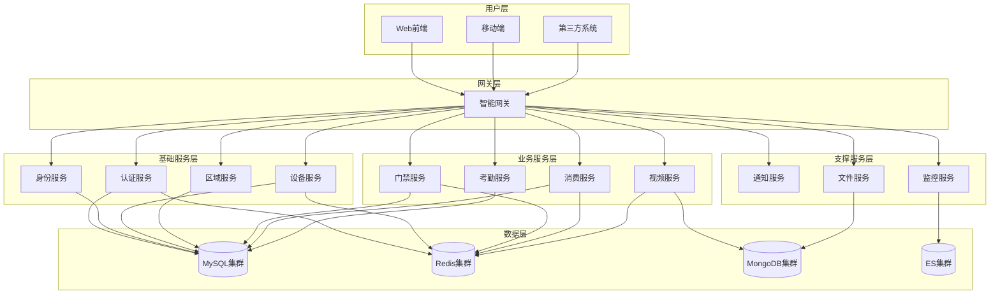
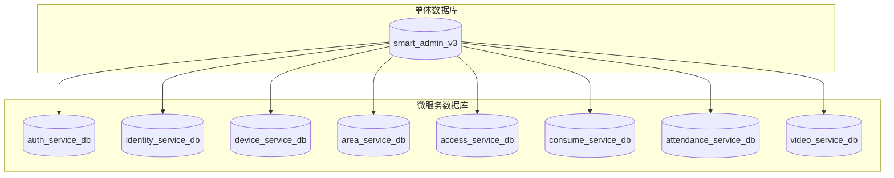
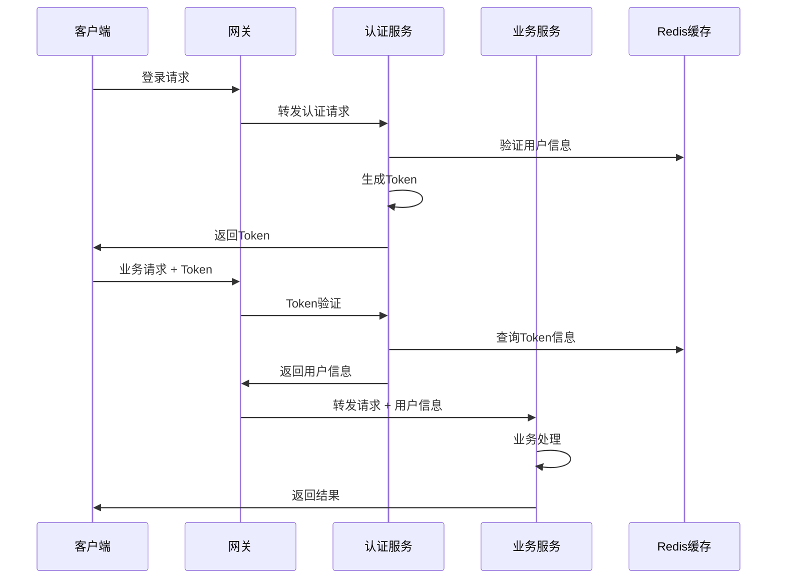
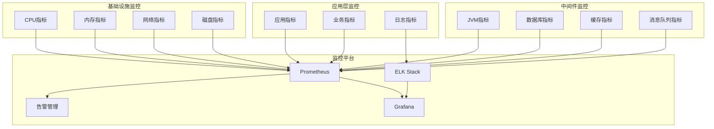

# IOE-DREAM 微服务架构迁移指南

**创建时间**: 2025-11-27
**适用版本**: v2.0.0
**文档类型**: 技术指南

---

## 📋 迁移概览

### 迁移目标

将IOE-DREAM项目从单体架构平滑迁移到微服务架构，实现：
- **服务解耦**: 降低模块间耦合度
- **独立部署**: 各服务可独立开发和部署
- **水平扩展**: 支持按需扩展服务实例
- **技术演进**: 支持不同服务采用差异化技术栈

### 迁移原则

1. **业务无中断**: 确保生产环境稳定运行
2. **渐进式迁移**: 分阶段、分模块逐步迁移
3. **数据一致性**: 保证迁移过程中数据完整性和一致性
4. **功能对等**: 微服务功能与单体架构功能完全对等

---

## 🏗️ 微服务架构设计

### 服务拆分策略



### 服务职责划分

| 服务类型 | 服务名称 | 核心职责 | 数据存储 | 备注 |
|---------|---------|---------|---------|------|
| **网关服务** | smart-gateway | 路由转发、认证鉴权、限流熔断 | N/A | Spring Cloud Gateway |
| **认证服务** | ioedream-auth-service | 用户认证、Token管理、单点登录 | Redis + MySQL | Sa-Token集成 |
| **身份服务** | ioedream-identity-service | 用户管理、角色管理、权限管理 | MySQL | 组织架构管理 |
| **设备服务** | ioedream-device-service | 设备管理、协议适配、状态监控 | MySQL + Redis | 多协议支持 |
| **区域服务** | smart-area-service | 区域管理、层级关系、权限范围 | MySQL | 基础数据服务 |
| **门禁服务** | access-service | 门禁控制、生物识别、访客管理 | MySQL + Redis | 业务核心服务 |
| **消费服务** | smart-consume-service | 消费管理、账户管理、报表分析 | MySQL + Redis | 业务核心服务 |
| **考勤服务** | smart-attendance-service | 考勤管理、排班管理、统计分析 | MySQL + Redis | 业务核心服务 |
| **视频服务** | smart-video-service | 视频监控、录像管理、智能分析 | MongoDB + Redis | 媒体数据服务 |
| **通知服务** | smart-notification-service | 消息通知、邮件发送、短信发送 | Redis + MySQL | 支撑服务 |
| **文件服务** | smart-file-service | 文件存储、上传下载、预览 | MongoDB + MinIO | 支撑服务 |
| **监控服务** | smart-monitor-service | 系统监控、告警管理、性能分析 | Elasticsearch + MySQL | 支撑服务 |

---

## 🛠️ 技术栈选型

### 微服务技术栈

```yaml
# 技术栈版本配置
spring:
  boot:
    version: "3.5.7"
  cloud:
    version: "2023.0.3"
  cloud:
    alibaba:
      version: "2022.0.0.0"

# 数据库技术栈
database:
  mysql:
    version: "8.0.33"
  redis:
    version: "6.0+"
  mongodb:
    version: "6.0+"
  elasticsearch:
    version: "8.0+"

# 中间件技术栈
middleware:
  nacos:
    version: "2.3.0"  # 服务注册发现、配置中心
  sentinel:
    version: "1.8.6"  # 流量控制、熔断降级
  seata:
    version: "1.7.0"  # 分布式事务
  rocketmq:
    version: "5.1.0"  # 消息队列
```

### 核心组件

| 组件类型 | 技术选型 | 版本 | 用途 |
|---------|---------|------|------|
| **服务框架** | Spring Boot | 3.5.7 | 微服务开发框架 |
| **服务治理** | Spring Cloud | 2023.0.3 | 微服务治理框架 |
| **服务注册** | Nacos | 2.3.0 | 服务注册与发现 |
| **配置中心** | Nacos | 2.3.0 | 分布式配置管理 |
| **服务网关** | Spring Cloud Gateway | 4.1.0 | API网关 |
| **负载均衡** | Spring Cloud LoadBalancer | 4.1.0 | 客户端负载均衡 |
| **熔断降级** | Sentinel | 1.8.6 | 流量控制和熔断降级 |
| **分布式事务** | Seata | 1.7.0 | 分布式事务解决方案 |
| **消息队列** | RocketMQ | 5.1.0 | 异步消息处理 |
| **链路追踪** | Micrometer + Zipkin | 1.12.0 | 分布式链路追踪 |

---

## 📦 项目结构规范

### 微服务目录结构

```
microservices/
├── smart-common/                          # 公共模块
│   ├── src/main/java/net/lab1024/sa/common/
│   │   ├── entity/                        # 通用实体类
│   │   ├── vo/                          # 通用VO类
│   │   ├── dto/                         # 通用DTO类
│   │   ├── config/                      # 通用配置类
│   │   ├── util/                        # 通用工具类
│   │   ├── constant/                    # 通用常量
│   │   └── exception/                   # 通用异常类
│   └── pom.xml
│
├── smart-gateway/                        # 网关服务
│   ├── src/main/java/net/lab1024/sa/gateway/
│   │   ├── GatewayApplication.java
│   │   ├── config/                      # 网关配置
│   │   ├── filter/                      # 网关过滤器
│   │   └── fallback/                    # 熔断降级处理
│   └── pom.xml
│
├── ioedream-auth-service/                # 认证服务
│   ├── src/main/java/net/lab1024/auth/
│   │   ├── AuthServiceApplication.java
│   │   ├── controller/                  # 认证控制器
│   │   ├── service/                     # 认证服务
│   │   ├── manager/                     # 认证管理层
│   │   ├── repository/                  # 数据访问层
│   │   ├── domain/                      # 认证领域模型
│   │   └── config/                      # 认证配置
│   └── pom.xml
│
├── access-service/                       # 门禁服务
│   ├── src/main/java/net/lab1024/sa/access/
│   │   ├── AccessServiceApplication.java
│   │   ├── controller/                  # 门禁控制器
│   │   ├── service/                     # 门禁服务
│   │   ├── manager/                     # 门禁管理层
│   │   ├── dao/                        # 数据访问层
│   │   ├── domain/                      # 门禁领域模型
│   │   └── config/                      # 门禁配置
│   └── pom.xml
│
└── [其他服务...]
```

### 代码规范

1. **包名规范**
   ```java
   // 基础包名：net.lab1024.sa
   net.lab1024.sa.{service-name}.{layer}.{module}

   // 示例：
   net.lab1024.sa.access.controller.device
   net.lab1024.sa.consume.service.account
   net.lab1024.sa.auth.manager.token
   ```

2. **依赖注入规范**
   ```java
   // 统一使用 @Resource 注入
   @Resource
   private UserService userService;

   // 禁止使用 @Autowired
   // @Autowired  // ❌ 错误
   ```

3. **配置文件规范**
   ```yaml
   # 服务名称：小写+连字符
   spring:
     application:
       name: access-service

   # 端口规范：8080 + 服务序号
   server:
     port: 8084
   ```

---

## 🔄 数据库迁移策略

### 数据库拆分原则

1. **业务边界**: 按业务领域拆分数据库
2. **数据关联**: 高频关联数据放在同一数据库
3. **性能考虑**: 读写分离和分库分表策略
4. **一致性**: 分布式事务保障数据一致性

### 数据库拆分方案



### 数据迁移步骤

#### 第一阶段：数据梳理和设计

1. **数据现状分析**
   ```bash
   # 分析现有表结构和使用情况
   mysql -h host -u user -p smart_admin_v3 -e "SHOW TABLES;"

   # 分析表间关联关系
   mysql -h host -u user -p smart_admin_v3 -e "SELECT TABLE_NAME, ENGINE, TABLE_ROWS FROM INFORMATION_SCHEMA.TABLES WHERE TABLE_SCHEMA='smart_admin_v3';"
   ```

2. **数据拆分设计**
   - 按业务域划分数据表
   - 设计服务间数据接口
   - 制定数据迁移计划

#### 第二阶段：数据库创建和初始化

```sql
-- 创建认证服务数据库
CREATE DATABASE auth_service_db CHARACTER SET utf8mb4 COLLATE utf8mb4_unicode_ci;

-- 创建身份服务数据库
CREATE DATABASE identity_service_db CHARACTER SET utf8mb4 COLLATE utf8mb4_unicode_ci;

-- 创建设备服务数据库
CREATE DATABASE device_service_db CHARACTER SET utf8mb4 COLLATE utf8mb4_unicode_ci;

-- [其他服务数据库...]
```

#### 第三阶段：数据同步和迁移

1. **数据同步策略**
   - 双写策略：同时写入单体库和微服务库
   - 数据校验：确保数据一致性
   - 灰度切换：逐步切换数据源

2. **迁移脚本示例**
   ```python
   # 数据迁移脚本示例
   def migrate_user_data():
       # 从单体库读取用户数据
       users = query_users_from_single_db()

       # 转换数据格式
       converted_users = convert_user_data(users)

       # 写入微服务库
       insert_users_to_microservice_db(converted_users)

       # 数据校验
       validate_data_consistency()
   ```

---

## 🚀 服务间通信

### 通信方式选择

| 通信方式 | 适用场景 | 优点 | 缺点 | 推荐指数 |
|---------|---------|------|------|---------|
| **REST API** | 同步请求响应 | 简单易用、标准化 | 阻塞调用、性能一般 | ⭐⭐⭐⭐⭐ |
| **Feign Client** | 声明式HTTP调用 | 类型安全、集成度高 | 依赖HTTP协议 | ⭐⭐⭐⭐⭐ |
| **RocketMQ** | 异步消息处理 | 解耦、削峰填谷 | 复杂性增加 | ⭐⭐⭐⭐ |
| **gRPC** | 高性能RPC调用 | 高性能、类型安全 | 学习成本高 | ⭐⭐⭐ |

### Feign Client配置

```java
// Feign客户端配置
@FeignClient(name = "identity-service", path = "/api/identity")
public interface IdentityServiceClient {

    @GetMapping("/users/{userId}")
    ResponseDTO<UserVO> getUserById(@PathVariable Long userId);

    @PostMapping("/users/query")
    ResponseDTO<PageResult<UserVO>> queryUsers(@RequestBody UserQueryDTO queryDTO);
}
```

### 服务降级和熔断

```java
// 服务降级处理
@Component
public class IdentityServiceClientFallback implements IdentityServiceClient {

    @Override
    public ResponseDTO<UserVO> getUserById(Long userId) {
        log.warn("Identity service fallback triggered for userId: {}", userId);
        return ResponseDTO.error(UserErrorCode.SERVICE_UNAVAILABLE);
    }

    @Override
    public ResponseDTO<PageResult<UserVO>> queryUsers(UserQueryDTO queryDTO) {
        log.warn("Identity service fallback triggered for query");
        return ResponseDTO.error(UserErrorCode.SERVICE_UNAVAILABLE);
    }
}
```

---

## 🔐 安全和权限管理

### 统一认证架构



### 权限控制实现

1. **网关层权限验证**
   ```java
   @Component
   public class AuthFilter implements GlobalFilter {

       @Resource
       private AuthServiceClient authService;

       @Override
       public Mono<Void> filter(ServerWebExchange exchange, GatewayFilterChain chain) {
           String token = exchange.getRequest().getHeaders().getFirst("Authorization");

           if (StringUtils.isBlank(token)) {
               return unauthorizedResponse(exchange);
           }

           return authService.validateToken(token)
               .flatMap(response -> {
                   if (response.isSuccess()) {
                       // 将用户信息添加到请求头
                       ServerHttpRequest mutatedRequest = exchange.getRequest().mutate()
                           .header("X-User-Id", response.getData().getUserId().toString())
                           .header("X-User-Name", response.getData().getUserName())
                           .build();

                       return chain.filter(exchange.mutate().request(mutatedRequest).build());
                   } else {
                       return unauthorizedResponse(exchange);
                   }
               });
       }
   }
   ```

2. **业务服务权限验证**
   ```java
   @RestController
   @RequestMapping("/api/access")
   public class AccessController {

       @Resource
       private AccessService accessService;

       @PostMapping("/devices/{deviceId}/open")
       @PreAuthorize("hasPermission('device:open')")
       public ResponseDTO<String> openDevice(@PathVariable Long deviceId) {
           // 业务逻辑处理
           return ResponseDTO.ok(accessService.openDevice(deviceId));
       }
   }
   ```

---

## 📊 监控和运维

### 服务监控体系



### 监控指标配置

```yaml
# Prometheus监控配置
management:
  endpoints:
    web:
      exposure:
        include: "health,info,metrics,prometheus"
  endpoint:
    health:
      show-details: always
  metrics:
    export:
      prometheus:
        enabled: true

# 自定义监控指标
@Component
public class AccessServiceMetrics {

    private final Counter accessRequestCounter;
    private final Timer accessProcessTimer;

    public AccessServiceMetrics(MeterRegistry meterRegistry) {
        this.accessRequestCounter = Counter.builder("access.request.total")
            .description("Total access requests")
            .register(meterRegistry);

        this.accessProcessTimer = Timer.builder("access.process.duration")
            .description("Access process duration")
            .register(meterRegistry);
    }

    public void recordAccessRequest() {
        accessRequestCounter.increment();
    }

    public Timer.Sample startTimer() {
        return Timer.start();
    }
}
```

---

## 📋 迁移检查清单

### 迁移前准备

- [ ] **架构设计完成**
  - [ ] 服务拆分方案确定
  - [ ] 数据库设计完成
  - [ ] API接口设计完成
  - [ ] 技术栈选型确定

- [ ] **基础设施准备**
  - [ ] 注册中心部署完成
  - [ ] 配置中心部署完成
  - [ ] 网关服务部署完成
  - [ ] 监控体系搭建完成

- [ ] **开发环境准备**
  - [ ] 微服务开发框架搭建
  - [ ] 代码生成工具配置
  - [ ] 持续集成环境配置
  - [ ] 测试环境准备

### 迁移过程验证

- [ ] **功能验证**
  - [ ] 服务启动正常
  - [ ] API接口正常响应
  - [ ] 业务功能正常
  - [ ] 数据流转正确

- [ ] **性能验证**
  - [ ] 响应时间达标
  - [ ] 吞吐量达标
  - [ ] 资源使用合理
  - [ ] 并发处理正常

- [ ] **安全验证**
  - [ ] 认证授权正常
  - [ ] 数据传输安全
  - [ ] 访问控制有效
  - [ ] 日志审计完整

- [ ] **运维验证**
  - [ ] 监控指标正常
  - [ ] 告警机制有效
  - [ ] 日志收集完整
  - [ ] 部署流程顺畅

---

## 🚨 风险控制和回滚策略

### 风险识别

| 风险类型 | 风险描述 | 影响等级 | 应对措施 |
|---------|---------|---------|---------|
| **数据丢失** | 数据迁移过程中数据丢失 | 高 | 全量备份、增量同步、数据校验 |
| **服务中断** | 服务切换过程中业务中断 | 高 | 灰度发布、流量切换、快速回滚 |
| **性能下降** | 微服务调用导致性能下降 | 中 | 缓存优化、连接池调优、异步处理 |
| **一致性错误** | 分布式事务导致数据不一致 | 中 | 分布式事务、补偿机制、数据校验 |

### 回滚策略

1. **服务级回滚**
   ```bash
   # 服务回滚脚本
   #!/bin/bash

   # 停止微服务
   docker-compose down access-service

   # 启动单体服务
   docker-compose up -d monolith-service

   # 数据库连接切换
   # 切换到单体数据库连接配置
   ```

2. **数据级回滚**
   ```sql
   -- 数据回滚脚本
   -- 从微服务数据库同步数据回单体数据库
   INSERT INTO smart_admin_v3.t_user SELECT * FROM identity_service_db.t_user WHERE update_time > NOW() - INTERVAL 1 HOUR;
   ```

3. **流量级回滚**
   ```yaml
   # 网关路由配置回滚
   spring:
     cloud:
       gateway:
         routes:
           - id: monolith-route
             uri: http://monolith-service:8080
             predicates:
               - Path=/api/**
   ```

---

## 📞 支持和维护

### 技术支持

- **架构团队**: 负责架构设计和技术决策
- **开发团队**: 负责功能开发和问题修复
- **运维团队**: 负责部署、监控和故障处理
- **测试团队**: 负责功能测试和性能测试

### 文档维护

- **更新频率**: 每次架构变更后更新
- **版本管理**: 使用Git管理文档版本
- **审查机制**: 技术团队定期审查文档准确性

---

*本指南基于IOE-DREAM项目实际情况编写，为微服务架构迁移提供详细指导*