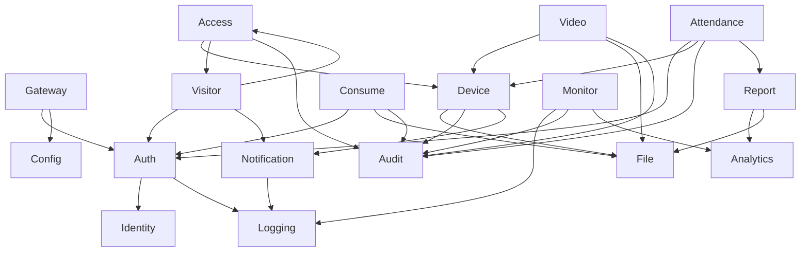

# IOE-DREAM 微服务架构深度分析报告

## 📋 当前架构分析

### 现有服务状态

#### ✅ 已创建的微服务
1. **ioedream-auth-service** - 认证服务 ✅
2. **ioedream-identity-service** - 身份权限服务 ✅
3. **ioedream-device-service** - 设备管理服务 ✅
4. **microservices-common** - 公共模块 ✅
5. **smart-gateway** - 智能网关 ✅

#### ⚠️ 命名不规范的服务（需要重构）
1. **access-service** → **ioedream-access-service** （门禁管理）
2. **consume-service** → **ioedream-consume-service** （消费管理）
3. **visitor-service** → **ioedream-visitor-service** （访客管理）
4. **attendance-service** → **ioedream-attendance-service** （考勤管理）
5. **video-service** → **ioedream-video-service** （视频监控）

#### ❌ 缺失的重要微服务
1. **ioedream-notification-service** - 通知服务
2. **ioedream-file-service** - 文件服务
3. **ioedream-report-service** - 报表服务
4. **ioedream-audit-service** - 审计服务
5. **ioedream-logging-service** - 日志服务
6. **ioedream-config-service** - 配置中心服务

#### 📚 支撑服务状态
1. **monitor** - 监控服务 ✅
2. **analytics** - 分析服务 ✅
3. **hr-service** - 人力资源服务 ✅

#### 🗂️ 冗余模块（需要清理）
1. **smart-common** - 重复的公共模块
2. **common** - 重复的公共模块
3. **ioedream-device-service** - 与device-service重复

## 🔍 深度分析发现的问题

### 1. 命名规范不一致
- **问题**: 混合使用 `ioedream-` 前缀和无前缀命名
- **影响**: 导致架构混乱，维护困难
- **解决方案**: 统一使用 `ioedream-{service-name}` 格式

### 2. 服务重复建设
- **问题**: device-service 和 ioedream-device-service 功能重复
- **影响**: 资源浪费，功能分散
- **解决方案**: 合并为统一的设备服务

### 3. 公共模块冗余
- **问题**: smart-common、common、microservices-common 三个公共模块
- **影响**: 依赖关系复杂，版本管理困难
- **解决方案**: 统一使用 microservices-common

### 4. 核心服务缺失
- **问题**: 缺少通知、文件、报表等关键服务
- **影响**: 业务功能不完整
- **解决方案**: 补全核心业务服务

### 5. 技术栈不统一
- **问题**: 部分服务使用Nacos，部分使用Consul
- **影响**: 服务发现不一致，配置管理混乱
- **解决方案**: 统一使用Consul

## 📊 完整的微服务架构规划

### 核心架构图

```mermaid
graph TB
    subgraph "客户端层"
        Web[Web客户端]
        Mobile[移动客户端]
        API[第三方API]
    end

    subgraph "网关层"
        Gateway[ioedream-gateway:8080]
    end

    subgraph "认证授权层"
        Auth[ioedream-auth-service:8081]
        Identity[ioedream-identity-service:8082]
    end

    subgraph "核心业务层"
        Device[ioedream-device-service:8101]
        Access[ioedream-access-service:8102]
        Consume[ioedream-consume-service:8103]
        Visitor[ioedream-visitor-service:8104]
        Attendance[ioedream-attendance-service:8105]
        Video[ioedream-video-service:8106]
    end

    subgraph "支撑服务层"
        Notification[ioedream-notification-service:8107]
        File[ioedream-file-service:8108]
        Report[ioedream-report-service:8109]
        Audit[ioedream-audit-service:8110]
        Logging[ioedream-logging-service:8111]
        Config[ioedream-config-service:8112]
    end

    subgraph "数据分析层"
        HR[hr-service:8200]
        Analytics[analytics-service:8201]
        Monitor[monitor-service:8300]
    end

    subgraph "基础设施层"
        MySQL[(MySQL集群)]
        Redis[(Redis集群)]
        Consul[Consul:8500]
        MQ[消息队列]
    end

    subgraph "公共模块"
        Common[microservices-common]
    end

    Web --> Gateway
    Mobile --> Gateway
    API --> Gateway

    Gateway --> Auth
    Gateway --> Identity
    Gateway --> Device
    Gateway --> Access
    Gateway --> Consume
    Gateway --> Visitor
    Gateway --> Attendance
    Gateway --> Video
    Gateway --> Notification
    Gateway --> File
    Gateway --> Report
    Gateway --> HR
    Gateway --> Analytics

    Auth --> Common
    Identity --> Common
    Device --> Common
    Access --> Common
    Consume --> Common
    Visitor --> Common
    Attendance --> Common
    Video --> Common
    Notification --> Common
    File --> Common
    Report --> Common

    Device --> MySQL
    Access --> MySQL
    Consume --> MySQL
    Visitor --> MySQL
    Attendance --> MySQL
    Video --> Redis

    Auth --> Redis
    Identity --> Redis
    Notification --> Redis
    File --> Redis

    Gateway --> Consul
    Auth --> Consul
    Device --> Consul
```


## 🎯 遗漏服务补充计划

### 1. ioedream-notification-service（通知服务）
**功能**: 邮件通知、短信通知、推送通知、站内消息
**端口**: 8107
**技术栈**: Spring Boot + RabbitMQ + Redis + SendGrid

### 2. ioedream-file-service（文件服务）
**功能**: 文件上传、下载、存储管理、权限控制
**端口**: 8108
**技术栈**: Spring Boot + MinIO + Redis + FastDFS

### 3. ioedream-report-service（报表服务）
**功能**: 报表生成、数据分析、图表展示、导出
**端口**: 8109
**技术栈**: Spring Boot + Apache POI + ECharts + Redis

### 4. ioedream-audit-service（审计服务）
**功能**: 操作审计、行为追踪、合规检查、风险预警
**端口**: 8110
**技术栈**: Spring Boot + Elasticsearch + MongoDB

### 5. ioedream-logging-service（日志服务）
**功能**: 日志收集、分析、检索、告警
**端口**: 8111
**技术栈**: Spring Boot + ELK Stack + Kafka

### 6. ioedream-config-service（配置服务）
**功能**: 动态配置、环境管理、配置版本控制
**端口**: 8112
**技术栈**: Spring Boot + Config Server + Git

## 🔧 技术架构完善

### 统一技术栈
```yaml
技术栈版本:
  Java: JDK 17
  Spring Boot: 3.5.7
  Spring Cloud: 2023.0.3
  MySQL: 8.0
  Redis: 7.0
  Consul: 1.17
  RabbitMQ: 3.12
  MinIO: RELEASE.2024-01-16T01-49-49Z
  Elasticsearch: 8.12.0
  Kibana: 8.12.0
  Logstash: 8.12.0
```

### 服务依赖关系


## 📋 实施优先级

### P0 (立即实施)
1. **服务重命名** - 统一命名规范
2. **冗余清理** - 清理重复的公共模块
3. **技术栈统一** - 统一使用Consul

### P1 (1-2周内)
1. **ioedream-notification-service** - 核心通知功能
2. **ioedream-file-service** - 文件管理
3. **ioedream-access-service** - 门禁管理（基于现有access-service）

### P2 (2-4周内)
1. **ioedream-report-service** - 报表分析
2. **ioedream-audit-service** - 审计追踪
3. **ioedream-logging-service** - 统一日志

### P3 (1-2个月内)
1. **ioedream-config-service** - 配置中心
2. **服务治理完善** - 监控、告警、链路追踪
3. **性能优化** - 缓存、数据库优化

## 🎯 完整性检查清单

### 服务完整性
- [ ] 认证授权服务
- [ ] 设备管理服务
- [ ] 门禁管理服务
- [ ] 消费管理服务
- [ ] 访客管理服务
- [ ] 考勤管理服务
- [ ] 视频监控服务
- [ ] 通知服务
- [ ] 文件服务
- [ ] 报表服务
- [ ] 审计服务
- [ ] 日志服务
- [ ] 配置服务

### 架构一致性
- [ ] 统一命名规范
- [ ] 统一技术栈
- [ ] 统一配置管理
- [ ] 统一依赖管理
- [ ] 统一监控体系

### 质量保证
- [ ] 单元测试覆盖
- [ ] 集成测试覆盖
- [ ] 性能测试
- [ ] 安全测试
- [ ] 文档完整性

### 运维支持
- [ ] 容器化部署
- [ ] CI/CD流水线
- [ ] 监控告警
- [ ] 日志分析
- [ ] 备份恢复

## 📈 预期成果

### 短期目标（1个月）
- 完成服务重命名和清理
- 补全核心业务服务
- 建立统一技术栈
- 完善监控体系

### 中期目标（3个月）
- 完成所有微服务建设
- 建立完整CI/CD
- 实现自动化运维
- 性能优化完成

### 长期目标（6个月）
- 系统稳定运行
- 性能持续优化
- 功能持续迭代
- 团队能力建设