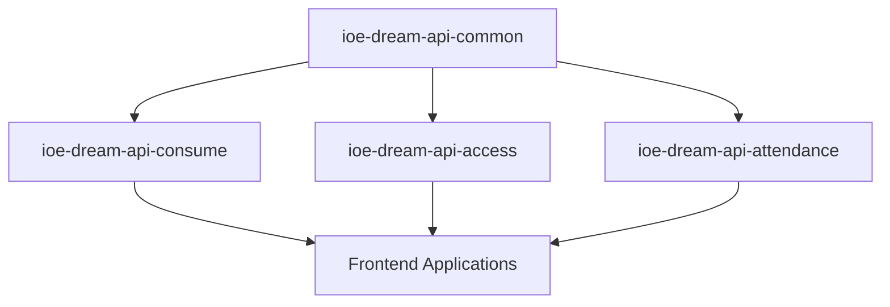
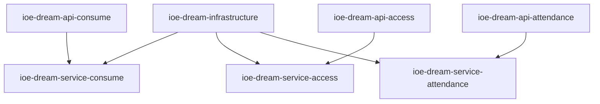

# 🚀 IOE-DREAM 微服务架构重新设计

## 📋 概述

基于当前项目分析，IOE-DREAM SmartAdmin 项目存在严重的架构问题：
- **伪微服务架构**: 所有业务模块堆砌在 sa-admin 单体中
- **包结构混乱**: 域对象、服务接口、实现类混杂
- **缺少API契约**: 没有独立的API定义模块
- **无版本管理**: 缺少API版本管理机制

本文档设计真正的企业级微服务架构，解决这些根本问题。

---

## 🏗️ 新微服务架构设计

### 架构原则

1. **单一职责原则**: 每个微服务专注单一业务域
2. **API契约优先**: API定义与实现分离
3. **版本化管理**: 支持多版本API并存
4. **领域驱动设计**: 按业务领域组织微服务
5. **基础设施分离**: 通用功能独立模块化

### 整体架构图

```
ioe-dream-platform/
├── 📦 ioe-dream-api/                    # API契约层
│   ├── ioe-dream-api-consume/           # 消费服务API v1
│   ├── ioe-dream-api-access/            # 门禁服务API v1
│   ├── ioe-dream-api-attendance/        # 考勤服务API v1
│   ├── ioe-dream-api-device/            # 设备服务API v1
│   ├── ioe-dream-api-monitor/           # 监控服务API v1
│   ├── ioe-dream-api-video/             # 视频服务API v1
│   ├── ioe-dream-api-system/            # 系统服务API v1
│   └── ioe-dream-api-common/            # 公共API定义
├── 📦 ioe-dream-service/                # 微服务实现层
│   ├── ioe-dream-service-consume/       # 消费服务实现
│   ├── ioe-dream-service-access/        # 门禁服务实现
│   ├── ioe-dream-service-attendance/    # 考勤服务实现
│   ├── ioe-dream-service-device/        # 设备服务实现
│   ├── ioe-dream-service-monitor/       # 监控服务实现
│   ├── ioe-dream-service-video/         # 视频服务实现
│   └── ioe-dream-service-system/        # 系统服务实现
├── 📦 ioe-dream-gateway/                # API网关
├── 📦 ioe-dream-infrastructure/         # 基础设施层
│   ├── ioe-dream-common/                # 通用组件
│   ├── ioe-dream-cache/                 # 缓存服务
│   ├── ioe-dream-messaging/             # 消息队列
│   └── ioe-dream-config/                # 配置中心
├── 📦 ioe-dream-admin/                  # 管理后台聚合服务
└── 📦 ioe-dream-frontend/               # 前端应用
```

---

## 📊 微服务详细设计

### 1. 消费微服务 (Consume Service)

#### API模块: `ioe-dream-api-consume`
```
ioe-dream-api-consume/
├── src/main/java/ioe/dream/api/consume/
│   ├── v1/                              # API版本v1
│   │   ├── dto/                         # 数据传输对象
│   │   │   ├── request/                 # 请求DTO
│   │   │   └── response/                # 响应DTO
│   │   ├── enums/                       # 枚举定义
│   │   ├── vo/                          # 值对象
│   │   └── ConsumeApiV1.java           # API接口定义
│   └── v0/                              # API版本v0 (兼容性)
│       └── ...
└── pom.xml
```

#### 服务实现: `ioe-dream-service-consume`
```
ioe-dream-service-consume/
├── src/main/java/ioe/dream/service/consume/
│   ├── application/                     # 应用层
│   │   ├── service/                     # 应用服务
│   │   ├── facade/                      # 外观模式
│   │   └── event/                       # 事件处理
│   ├── domain/                          # 领域层
│   │   ├── model/                       # 领域模型
│   │   ├── service/                     # 领域服务
│   │   ├── repository/                  # 仓储接口
│   │   └── event/                       # 领域事件
│   ├── infrastructure/                   # 基础设施层
│   │   ├── repository/impl/             # 仓储实现
│   │   ├── messaging/                   # 消息处理
│   │   └── external/                    # 外部服务
│   └── interfaces/                      # 接口层
│       ├── rest/                        # REST控制器
│       ├── dto/                         # 接口DTO
│       └── mapper/                      # 对象映射
└── pom.xml
```

### 2. 门禁微服务 (Access Service)

#### 业务领域模型
```
门禁领域核心概念:
├── Person (人员)
├── Device (设备)
├── Area (区域)
├── AccessRecord (通行记录)
├── Permission (权限)
└── BiometricTemplate (生物特征模板)
```

### 3. 考勤微服务 (Attendance Service)

#### 业务领域模型
```
考勤领域核心概念:
├── AttendanceRule (考勤规则)
├── AttendanceRecord (考勤记录)
├── AttendanceSchedule (排班)
├── LeaveRequest (请假申请)
├── OvertimeRecord (加班记录)
└── AttendanceReport (考勤报告)
```

---

## 🔧 API版本管理策略

### 版本命名规范
- **v0**: 兼容性版本，用于过渡期
- **v1**: 当前稳定版本
- **v2**: 下一个主要版本

### URL路径规范
```
https://api.ioe-dream.com/v1/consume/accounts
https://api.ioe-dream.com/v1/access/permissions
https://api.ioe-dream.com/v0/legacy-endpoint
```

### API兼容性策略
1. **向后兼容**: v2支持v1客户端
2. **渐进迁移**: 新功能使用最新版本
3. **废弃通知**: 提前6个月通知API废弃

---

## 📦 模块依赖关系

### API层依赖


### 服务层依赖


---

## 🗂️ 包结构规范

### API模块包结构
```
ioe.dream.api.{service}.{version}
├── dto/
│   ├── request/          # 请求DTO
│   └── response/         # 响应DTO
├── vo/                   # 值对象
├── enums/                # 枚举
├── constants/            # 常量
└── {Service}ApiV{version}.java  # API接口
```

### 服务实现包结构
```
ioe.dream.service.{service}
├── application/          # 应用层
│   ├── service/         # 应用服务
│   ├── facade/          # 外观服务
│   └── event/           # 应用事件
├── domain/              # 领域层
│   ├── model/           # 领域模型
│   ├── service/         # 领域服务
│   ├── repository/      # 仓储接口
│   └── event/           # 领域事件
├── infrastructure/      # 基础设施层
│   ├── repository/impl/ # 仓储实现
│   ├── messaging/       # 消息处理
│   └── external/        # 外部服务
└── interfaces/         # 接口层
    ├── rest/           # REST控制器
    ├── grpc/           # gRPC服务
    └── event/          # 事件发布
```

---

## 🔄 数据一致性策略

### 事务管理
1. **本地事务**: 单服务内部使用Spring事务
2. **分布式事务**: 跨服务使用Saga模式
3. **最终一致性**: 异步消息保证最终一致

### 事件驱动架构
```
事件流示例:
用户消费 → ConsumeService发布事件 → NotificationService接收 → 发送通知
```

---

## 🛡️ 安全架构

### API安全
1. **认证**: JWT + OAuth2.0
2. **授权**: RBAC + ABAC
3. **API限流**: Redis + Lua脚本
4. **数据加密**: AES256 + RSA

### 服务间通信安全
1. **服务注册**: Nacos + TLS
2. **服务调用**: gRPC + mTLS
3. **配置加密**: Jasypt + KMS

---

## 📈 监控与可观测性

### 监控体系
1. **应用监控**: Micrometer + Prometheus
2. **链路追踪**: OpenTelemetry + Jaeger
3. **日志管理**: ELK Stack
4. **健康检查**: Spring Boot Actuator

### 关键指标
- API响应时间 (P95 < 200ms)
- 服务可用性 (99.9%)
- 错误率 (< 0.1%)
- 吞吐量 (> 1000 QPS)

---

## 🚀 迁移策略

### 阶段1: 基础设施准备 (2周)
1. 创建新的Maven模块结构
2. 设置API契约规范
3. 建立CI/CD流水线

### 阶段2: 消费服务拆分 (3周)
1. 创建consume API模块
2. 拆分consume服务实现
3. 数据库分离

### 阶段3: 其他服务迁移 (6周)
1. 门禁服务迁移
2. 考勤服务迁移
3. 设备服务迁移
4. 系统服务迁移

### 阶段4: 网关与监控 (2周)
1. API网关配置
2. 监控体系搭建
3. 性能测试与优化

---

## 🎯 成功标准

### 技术指标
- [ ] 服务拆分完成度: 100%
- [ ] API契约覆盖率: 100%
- [ ] 自动化测试覆盖率: ≥80%
- [ ] 服务响应时间: P95 < 200ms
- [ ] 服务可用性: ≥99.9%

### 业务指标
- [ ] 功能完整性: 100%
- [ ] 数据一致性: 100%
- [ ] 用户体验: 无缝迁移
- [ ] 开发效率: 提升50%

---

## 📚 更新文档列表

需要同步更新的规范文档：
1. `docs/repowiki/zh/content/技术架构/技术架构.md`
2. `docs/repowiki/zh/content/开发规范体系/API设计规范.md`
3. `docs/repowiki/zh/content/开发规范体系/Java编码规范.md`
4. `docs/repowiki/zh/content/开发规范体系/数据库设计规范.md`
5. `.claude/skills/` 下的所有专家技能
6. `CLAUDE.md` 项目指南

---

*此架构设计文档是IOE-DREAM项目向真正微服务架构转型的蓝图，将分阶段实施，确保平稳过渡。*