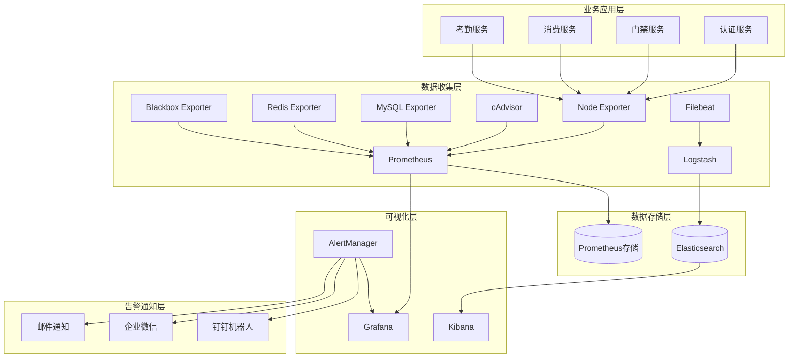

# IOE-DREAM 微服务架构运维监控系统手册

## 版本信息
- **手册版本**: v2.0.0
- **更新时间**: 2025-11-29
- **维护团队**: IOE-DREAM 运维团队

---

## 📖 目录

1. [系统概述](#系统概述)
2. [监控架构](#监控架构)
3. [快速部署](#快速部署)
4. [监控组件详解](#监控组件详解)
5. [运维工具使用](#运维工具使用)
6. [故障处理指南](#故障处理指南)
7. [性能优化建议](#性能优化建议)
8. [安全配置指南](#安全配置指南)

---

## 📋 系统概述

### 监控目标
IOE-DREAM微服务架构运维监控体系旨在提供全方位的系统监控能力，确保生产环境的长期稳定运行。

**核心监控能力：**
- ✅ 基础设施监控 (CPU、内存、磁盘、网络)
- ✅ 应用性能监控 (APM)
- ✅ 日志监控与分析 (ELK Stack)
- ✅ 业务指标监控
- ✅ 安全监控与告警
- ✅ 分布式链路追踪

### 监控指标体系

#### 1. 系统指标
```yaml
基础设施监控:
  - CPU使用率: 80%告警阈值
  - 内存使用率: 85%告警阈值
  - 磁盘空间: 90%告警阈值
  - 网络带宽: 1GB/s告警阈值
  - 系统负载: 核心数×4告警阈值
```

#### 2. 应用指标
```yaml
微服务监控:
  - 服务可用性: 99.5%目标
  - 响应时间: 95%请求<2秒
  - 错误率: <5%告警阈值
  - 并发连接数: 1000告警阈值
  - JVM堆内存: 85%告警阈值
```

#### 3. 业务指标
```yaml
业务监控:
  - 用户在线数: 实时统计
  - 交易成功率: >95%目标
  - 关键操作延迟: <5秒
  - 权限变更频率: 异常检测
  - 登录失败次数: >5次/分钟告警
```

---

## 🏗️ 监控架构

### 整体架构图



### 技术栈选择

| 组件类型 | 技术选型 | 版本 | 用途 |
|---------|----------|------|------|
| 指标收集 | Prometheus | v2.40.0 | 时序数据库 |
| 告警管理 | AlertManager | v0.24.0 | 告警路由 |
| 可视化 | Grafana | v9.1.0 | 监控面板 |
| 日志存储 | Elasticsearch | v8.4.0 | 搜索引擎 |
| 日志处理 | Logstash | v8.4.0 | 日志转换 |
| 日志可视化 | Kibana | v8.4.0 | 日志分析 |
| 系统监控 | Node Exporter | v1.3.1 | 系统指标 |
| 容器监控 | cAdvisor | v0.46.0 | 容器指标 |
| 链路追踪 | Jaeger | v1.36 | 分布式追踪 |

---

## 🚀 快速部署

### 环境要求

**硬件要求：**
- CPU: 4核心以上
- 内存: 8GB以上
- 磁盘: 100GB以上SSD
- 网络: 1Gbps带宽

**软件要求：**
- Docker Engine 20.10+
- Docker Compose 3.8+
- Linux Kernel 4.15+ (推荐CentOS 7+/Ubuntu 18+)

### 一键部署

```bash
# 1. 克隆项目
git clone https://github.com/ioedream/microservices.git
cd microservices/monitoring

# 2. 执行部署脚本
chmod +x ../scripts/monitoring-setup.sh
../scripts/monitoring-setup.sh

# 3. 验证部署
../scripts/health-check.sh -f
```

### 手动部署

```bash
# 1. 创建目录结构
mkdir -p data/{prometheus,grafana,elasticsearch,logstash,kibana}

# 2. 启动监控服务
docker-compose up -d

# 3. 等待服务启动
sleep 60

# 4. 检查服务状态
docker-compose ps
```

### 访问地址

| 服务名称 | 访问地址 | 账号/密码 | 说明 |
|---------|----------|-----------|------|
| Prometheus | http://localhost:9090 | - | 指标查询 |
| Grafana | http://localhost:3000 | admin/admin123 | 可视化面板 |
| AlertManager | http://localhost:9093 | - | 告警管理 |
| Elasticsearch | http://localhost:9200 | - | 日志存储 |
| Kibana | http://localhost:5601 | - | 日志分析 |
| Jaeger | http://localhost:16686 | - | 链路追踪 |

---

## 🔧 监控组件详解

### 1. Prometheus 指标收集

**核心特性：**
- 高效时序数据存储
- 灵活的查询语言 PromQL
- 多维数据模型
- 强大的告警规则引擎

**关键配置：**
```yaml
# 数据保留策略
storage.tsdb.retention.time: 15d
storage.tsdb.retention.size: 50GB

# 采集间隔
scrape_interval: 15s
evaluation_interval: 15s
```

**重要查询示例：**
```promql
# 服务可用性
up{job=~".*-service"}

# 响应时间95百分位
histogram_quantile(0.95, rate(http_request_duration_seconds_bucket[5m]))

# 错误率
rate(http_requests_total{status=~"5.."}[5m]) / rate(http_requests_total[5m]) * 100

# CPU使用率
100 - (avg by(instance) (irate(node_cpu_seconds_total{mode="idle"}[5m])) * 100)
```

### 2. Grafana 可视化面板

**预置仪表板：**
- 系统总览仪表板
- 微服务监控仪表板
- 基础设施仪表板
- 业务指标仪表板
- 告警管理仪表板

**自定义面板创建：**
1. 登录Grafana (admin/admin123)
2. 创建新仪表板
3. 添加查询面板
4. 配置Prometheus数据源
5. 设置告警规则

### 3. AlertManager 告警管理

**告警级别：**
- **Critical**: 系统宕机、服务不可用
- **Warning**: 高负载、响应慢、错误率高
- **Info**: 资源预警、状态变更

**通知渠道：**
- 📧 邮件通知 (SMTP)
- 💬 企业微信机器人
- 📱 钉钉机器人
- 🔔 Slack集成

**告警抑制规则：**
```yaml
# 服务器宕机时抑制其他告警
- source_match:
    alertname: InstanceDown
  target_match_re:
    instance: (.+)
  equal: ['instance']
```

### 4. ELK Stack 日志系统

**日志收集架构：**
```
应用日志 → Filebeat → Logstash → Elasticsearch → Kibana
```

**日志类型：**
- 应用程序日志 (Spring Boot)
- 访问日志 (Nginx)
- 系统日志 (Syslog)
- 审计日志 (安全事件)
- 错误日志 (异常追踪)

**日志查询示例：**
```json
// 查找特定服务的错误日志
{
  "query": {
    "bool": {
      "must": [
        {"term": {"service_name": "ioedream-auth-service"}},
        {"term": {"log_level": "ERROR"}}
      ]
    }
  }
}
```

---

## 🛠️ 运维工具使用

### 1. 监控部署工具

**monitoring-setup.sh**
```bash
# 完整部署
./monitoring-setup.sh

# 功能说明：
- 检查系统依赖
- 创建目录结构
- 生成配置文件
- 启动监控服务
- 验证部署状态
```

### 2. 健康检查工具

**health-check.sh**
```bash
# 完整健康检查
./health-check.sh -f

# 只检查微服务
./health-check.sh -s

# 只检查监控组件
./health-check.sh -m

# 只检查系统资源
./health-check.sh -r
```

**健康报告示例：**
```
[INFO] IOE-DREAM 系统健康检查报告
[INFO] 生成时间: 2025-11-29 15:30:00

[SUCCESS] 微服务健康状态: 15/16 (93%) - 良好
[SUCCESS] 监控组件健康状态: 6/6 (100%) - 优秀
[WARNING] 系统资源使用: CPU 75%, 内存 82%, 磁盘 45%
[SUCCESS] 数据库连接: MySQL ✓, Redis ✓
```

### 3. 备份恢复工具

**backup-restore.sh**
```bash
# 执行完整备份
./backup-restore.sh -b

# 恢复Prometheus数据
./backup-restore.sh -rp prometheus-data-20251129.tar.gz

# 列出可用备份
./backup-restore.sh -l

# 清理过期备份
./backup-restore.sh --cleanup
```

### 4. 自动化运维脚本

**日志轮转**
```bash
# 日志清理脚本
find /var/log -name "*.log" -mtime +7 -delete
find /var/log -name "*.log.gz" -mtime +30 -delete
```

**磁盘空间监控**
```bash
# 磁盘空间检查
df -h | awk '$5 > 90 {print $1 " 使用率过高: " $5}'
```

**服务自动重启**
```bash
# 服务健康检查和自动重启
check_service() {
    if ! nc -z localhost $1; then
        systemctl restart $2
        echo "服务 $2 已自动重启"
    fi
}
```

---

## ⚠️ 故障处理指南

### 常见故障处理

#### 1. Prometheus无法启动
**问题症状：**
- Docker容器启动失败
- 访问http://localhost:9090无响应

**排查步骤：**
```bash
# 1. 检查容器状态
docker ps | grep prometheus

# 2. 查看容器日志
docker logs ioedream-prometheus

# 3. 检查配置文件语法
promtool check config prometheus/prometheus.yml

# 4. 检查端口占用
netstat -tlnp | grep 9090
```

**解决方案：**
```bash
# 重启Prometheus服务
docker-compose restart prometheus

# 检查并修复配置文件
docker-compose down && docker-compose up -d prometheus
```

#### 2. Grafana无法连接Prometheus
**问题症状：**
- Grafana显示"Data source is not working"
- 仪表板无数据显示

**排查步骤：**
```bash
# 1. 检查网络连通性
docker exec -it ioedream-grafana wget http://prometheus:9090/api/v1/status/config

# 2. 检查数据源配置
curl -X GET http://localhost:3000/api/datasources

# 3. 验证Prometheus是否正常
curl http://localhost:9090/api/v1/targets
```

**解决方案：**
```bash
# 重启Grafana服务
docker-compose restart grafana

# 更新数据源配置
登录Grafana → Configuration → Data Sources → Test Connection
```

#### 3. Elasticsearch内存不足
**问题症状：**
- Elasticsearch频繁重启
- 日志写入失败
- Kibana显示集群状态为红色

**排查步骤：**
```bash
# 1. 检查集群状态
curl http://localhost:9200/_cluster/health

# 2. 查看节点信息
curl http://localhost:9200/_cat/nodes?v

# 3. 检查内存使用
docker stats ioedream-elasticsearch
```

**解决方案：**
```bash
# 调整JVM堆内存大小
export ES_JAVA_OPTS="-Xms4g -Xmx4g"

# 重启Elasticsearch
docker-compose restart elasticsearch

# 清理过期索引
curl -X DELETE "localhost:9200/ioedream-*-logs-2025.10.*"
```

### 紧急故障响应

#### 1. 生产环境服务宕机
**响应流程：**
1. **立即确认** (5分钟内)
   - 检查告警通知
   - 确认影响范围
   - 启动应急响应

2. **故障定位** (15分钟内)
   - 查看系统日志
   - 检查服务状态
   - 分析监控指标

3. **快速恢复** (30分钟内)
   - 重启故障服务
   - 切换备用系统
   - 恢复业务功能

4. **根因分析** (1小时内)
   - 收集故障信息
   - 分析根本原因
   - 制定改进措施

#### 2. 监控系统故障
**恢复步骤：**
```bash
# 1. 检查Docker服务状态
systemctl status docker

# 2. 重启监控服务集群
cd /opt/ioedream/monitoring
docker-compose down
docker-compose up -d

# 3. 验证服务恢复
../scripts/health-check.sh -m
```

---

## 📈 性能优化建议

### 1. Prometheus性能优化

**存储优化：**
```yaml
# 增加内存和并发
storage.remote.write-buffer-limit-bytes: 30000000
storage.remote.flush-deadline: 15m
storage.remote.read-concurrent-limit: 10

# 优化查询性能
query.max-concurrency: 20
query.timeout: 2m
query.max-samples: 50000000
```

**数据保留策略：**
```yaml
# 分级存储策略
remote_write:
  - url: "http://thanos-receive:19291/api/v1/receive"
    queue_config:
      max_samples_per_send: 1000
      max_shards: 200
```

### 2. Elasticsearch性能优化

**JVM调优：**
```bash
# 设置合适的堆内存大小
ES_JAVA_OPTS="-Xms8g -Xmx8g"

# 启用G1GC
ES_JAVA_OPTS="$ES_JAVA_OPTS -XX:+UseG1GC -XX:MaxGCPauseMillis=200"
```

**索引优化：**
```json
{
  "index.refresh_interval": "30s",
  "index.number_of_replicas": 0,
  "index.translog.flush_threshold_size": "512mb"
}
```

### 3. 系统资源优化

**磁盘I/O优化：**
```bash
# 使用SSD存储
# 配置RAID10阵列
# 启用文件系统缓存
```

**网络优化：**
```bash
# 增加网络缓冲区
net.core.rmem_max = 134217728
net.core.wmem_max = 134217728

# 启用TCP快速打开
net.ipv4.tcp_fastopen = 3
```

### 4. 容器资源限制

```yaml
# Docker Compose资源配置
version: '3.8'
services:
  prometheus:
    deploy:
      resources:
        limits:
          cpus: '2.0'
          memory: 4G
        reservations:
          cpus: '1.0'
          memory: 2G
```

---

## 🔒 安全配置指南

### 1. 访问控制

**Prometheus安全配置：**
```yaml
# 启用基础认证
basic_auth_users:
  admin: $2b$12$example_hash
```

**Grafana安全配置：**
```bash
# 修改默认密码
GF_SECURITY_ADMIN_PASSWORD=your_secure_password

# 启用匿名访问
GF_SECURITY_ALLOW_EMBEDDING=true
GF_AUTH_ANONYMOUS_ENABLED=false
```

### 2. 网络安全

**防火墙配置：**
```bash
# 只允许内网访问监控端口
iptables -A INPUT -p tcp -s 192.168.0.0/16 --dport 9090 -j ACCEPT
iptables -A INPUT -p tcp -s 192.168.0.0/16 --dport 3000 -j ACCEPT
```

**SSL/TLS配置：**
```bash
# 生成SSL证书
openssl req -x509 -newkey rsa:4096 -keyout prometheus.key -out prometheus.crt -days 365

# 配置HTTPS
web.config.file: /etc/prometheus/web.yml
```

### 3. 数据加密

**传输加密：**
```yaml
# Elasticsearch SSL配置
xpack.security.transport.ssl.enabled: true
xpack.security.transport.ssl.certificate: /usr/share/elasticsearch/config/certs/elastic-certificates.p12
```

**存储加密：**
```bash
# 启用磁盘加密
cryptsetup luksFormat /dev/sdb1
```

### 4. 审计日志

**Grafana审计配置：**
```bash
# 启用审计日志
GF_LOG_MODE: file
GF_LOG_FILTERS: auditing:debug
```

**Prometheus审计配置：**
```yaml
# 启用查询日志
query_log.enabled: true
```

---

## 📞 技术支持

### 联系方式
- **运维团队**: ops@ioedream.com
- **开发团队**: dev@ioedream.com
- **安全团队**: security@ioedream.com

### 文档资源
- [项目Wiki](https://wiki.ioedream.com)
- [API文档](https://api.ioedream.com/docs)
- [故障知识库](https://kb.ioedream.com)

### 版本更新
- **当前版本**: v2.0.0
- **更新频率**: 每月一次
- **LTS版本**: v2.x

---

*本文档由IOE-DREAM运维团队维护，最后更新时间：2025-11-29*