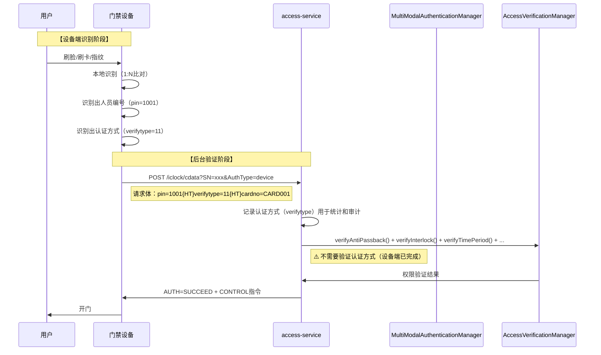

# 多模态认证正确理解与实现修正

> **修正日期**: 2025-01-30
> **问题来源**: 用户指出多模态认证不应在软件端进行人员识别
> **参考文档**: 安防PUSH通讯协议V4.8、门禁微服务总体设计文档

---

## 🚨 问题分析

### 错误理解

**错误观点**: 多模态认证策略用于在软件端识别人员（人脸识别、指纹识别等）

**错误原因**:
- 误解了"设备端识别，软件端管理"的架构原则
- 混淆了"人员识别"和"认证方式验证"的概念

### 正确理解

**核心原则**:
- ⚠️ **设备端已完成人员识别**（人脸、指纹、卡片等）
- ⚠️ **设备端已识别出人员编号**（pin字段）
- ✅ **软件端只验证权限和认证方式**

---

## 📋 两种验证模式的职责划分

### 1. 边缘验证模式（Edge）

**设备端职责**:
```
用户刷脸/刷卡 → 设备端识别（1:N比对） → 识别出人员编号（pin）
→ 设备端验证权限（本地权限表） → 设备端开门
→ 设备端上传记录到软件端（包含pin、verifytype）
```

**软件端职责**:
```
接收记录 → 存储记录 → 记录认证方式（verifytype）
→ 统计分析 → 审计追溯
```

**多模态认证作用**:
- ✅ 记录认证方式（verifytype）
- ✅ 统计各认证方式使用情况
- ❌ **不进行人员识别**（设备端已完成）

---

### 2. 后台验证模式（Backend）

**设备端职责**:
```
用户刷脸/刷卡 → 设备端识别（1:N比对） → 识别出人员编号（pin）
→ 设备端发送请求到软件端：pin=1001, verifytype=11
```

**软件端职责**:
```
接收请求（pin + verifytype） → 验证用户权限（反潜、互锁、时间段、黑名单等）
→ 记录认证方式（verifytype）用于统计和审计
→ 返回开门指令
```

**多模态认证作用**:
- ✅ 记录认证方式（verifytype）用于统计和审计
- ❌ **不验证认证方式是否允许**（设备端已完成，如果设备不支持该认证方式，设备端不会识别成功）
- ✅ 统计各认证方式使用情况
- ❌ **不进行人员识别**（设备端已完成，pin已提供）

---

## 🔍 后台验证模式详细流程

### 安防PUSH协议V4.8后台验证流程



### 关键点

1. **设备端已识别人员**:
   - 设备端通过1:N比对识别出人员编号（pin）
   - 设备端识别出认证方式（verifytype）
   - 设备端发送 `pin=1001, verifytype=11` 到软件端

2. **软件端不识别人员，不验证认证方式**:
   - 软件端接收 `pin`（人员编号），**不是**生物特征数据
   - 软件端根据 `pin` 查询用户权限（反潜、互锁、时间段等）
   - 软件端记录 `verifytype`（认证方式）用于统计和审计
   - ⚠️ **软件端不需要验证认证方式是否允许**（设备端已完成）

3. **多模态认证的作用**:
   - ✅ 记录认证方式（verifytype）用于统计和审计
   - ❌ **不进行人员识别**（设备端已完成）
   - ❌ **不验证认证方式是否允许**（设备端已完成）

---

## 🔧 多模态认证策略正确实现

### 当前实现问题

**问题代码**（`FaceAuthenticationStrategy.java`）:
```java
@Override
protected VerificationResult doAuthenticate(AccessVerificationRequest request) {
    // ❌ 错误：这里不应该进行人脸识别
    // 设备端已经识别了，并发送了pin（人员编号）
    return VerificationResult.success("人脸认证通过", null, "face");
}
```

**问题**:
- 当前实现只是简单返回成功，没有验证用户是否允许使用该认证方式
- 没有体现"认证方式验证"的核心职责

### 正确实现

**多模态认证策略的作用**（最终版）:
1. **记录认证方式**
   - 记录使用的认证方式（verifytype）用于统计和审计
   - 提供认证方式枚举（VerifyTypeEnum）统一管理
   - 转换认证方式（verifytype ↔ verifyMethod）用于数据存储和展示

2. **不进行人员识别**
   - ❌ 设备端已完成人员识别（1:N比对）
   - ❌ 软件端接收的是人员编号（pin），不是生物特征数据

3. **不验证认证方式是否允许**
   - ❌ 设备端已验证认证方式是否支持（如果设备不支持，不会识别成功）
   - ❌ 软件端不需要再验证认证方式是否允许

---

## 📊 多模态认证在AccessVerificationManager中的正确作用

### 当前错误理解

**错误观点**: 在 `AccessVerificationManager` 中调用 `MultiModalAuthenticationManager.authenticate()` 进行人员识别

**错误代码示例**:
```java
// ❌ 错误：不应该在软件端进行人员识别
VerificationResult authResult = multiModalAuthenticationManager.authenticate(request);
if (!authResult.isSuccess()) {
    return authResult; // 人员识别失败
}
```

### 正确理解

**多模态认证在AccessVerificationManager中的作用**:

1. **后台验证模式**:
   ```java
   // ✅ 正确：只记录认证方式，不验证（设备端已完成验证）
   // ⚠️ 注意：设备端已完成人员识别和认证方式验证
   // - 设备端通过1:N比对识别出人员编号（pin）
   // - 设备端已验证认证方式是否支持（如果设备不支持，不会识别成功）
   // - 软件端只需要验证权限（反潜、互锁、时间段等），不需要验证认证方式
   log.debug("[后台验证] 认证方式: verifyType={}", request.getVerifyType());

   // 继续其他验证（反潜、互锁、时间段等）
   ```

2. **边缘验证模式**:
   ```java
   // ✅ 正确：只记录认证方式，不验证（设备端已完成验证）
   VerifyTypeEnum verifyTypeEnum = VerifyTypeEnum.getByCode(request.getVerifyType());
   log.info("[设备端验证] 认证方式: {}", verifyTypeEnum.getDescription());
   // 直接存储记录，不需要验证认证方式
   ```

---

## 🎯 修正后的多模态认证职责

### 核心职责（修正后）

| 职责 | 边缘验证模式 | 后台验证模式 |
|------|------------|------------|
| **人员识别** | ❌ 设备端完成 | ❌ 设备端完成 |
| **认证方式验证** | ❌ 设备端完成 | ❌ 设备端完成 |
| **认证方式记录** | ✅ 软件端记录 | ✅ 软件端记录 |
| **权限验证** | ❌ 设备端完成 | ✅ 软件端验证 |
| **反潜/互锁验证** | ❌ 设备端完成（单设备） | ✅ 软件端验证（跨设备） |

### 多模态认证策略接口（最终版）

**⚠️ 重要说明**：
- 多模态认证策略主要用于**记录和统计**认证方式
- 不用于人员识别（设备端已完成）
- 不用于验证认证方式是否允许（设备端已完成）

**接口作用**：
```java
public interface MultiModalAuthenticationStrategy {
    /**
     * 记录认证方式（用于统计和审计）
     * <p>
     * ⚠️ 注意：不是进行人员识别，也不是验证认证方式是否允许
     * </p>
     * <p>
     * 设备端已完成：
     * - 人员识别（1:N比对，识别出pin）
     * - 认证方式验证（如果设备不支持，不会识别成功）
     * </p>
     * <p>
     * 软件端只记录认证方式（verifytype）用于统计和审计
     * </p>
     *
     * @param request 验证请求（包含userId、verifyType等，设备端已识别出人员编号）
     * @return 记录结果（始终成功，因为只是记录）
     */
    VerificationResult authenticate(AccessVerificationRequest request);

    // ... 其他方法
}
```

---

## 🔧 实现修正方案

### 修正步骤

1. **修正AbstractAuthenticationStrategy**:
   - 更新注释，明确"不是进行人员识别，而是验证认证方式是否允许"
   - 添加认证方式验证逻辑（检查用户权限、区域配置、设备配置）

2. **修正各认证策略实现**:
   - 实现认证方式验证逻辑
   - 移除"人员识别"相关的错误注释

3. **修正AccessVerificationManager集成**:
   - ⚠️ **已移除多模态认证验证调用**（设备端已完成认证方式验证）
   - ✅ 在后台验证模式中只记录认证方式，不验证
   - ✅ 在边缘验证模式中只记录认证方式，不验证

4. **多模态认证模块的保留用途**:
   - ✅ 记录认证方式（verifytype）用于统计和审计
   - ✅ 提供认证方式枚举（VerifyTypeEnum）统一管理
   - ✅ 转换认证方式（verifytype ↔ verifyMethod）用于数据存储和展示
   - ✅ 前端展示和配置（提供API接口）

---

## 📋 修正检查清单

- [ ] 修正AbstractAuthenticationStrategy注释和实现
- [ ] 修正9种认证策略的注释和实现
- [ ] 添加认证方式验证逻辑（用户权限、区域配置、设备配置）
- [ ] 修正AccessVerificationManager中的集成逻辑
- [ ] 更新依赖关系分析报告
- [ ] 更新架构文档

---

## 🎯 总结

**多模态认证的正确作用**:
1. ✅ **记录认证方式**（verifytype）用于统计和审计
2. ✅ **提供认证方式枚举**（VerifyTypeEnum）统一管理9种认证方式
3. ✅ **转换认证方式**（verifytype ↔ verifyMethod）用于数据存储和展示
4. ❌ **不进行人员识别**（设备端已完成）
5. ❌ **不验证认证方式是否允许**（设备端已完成）

**关键原则**:
- 设备端识别人员，设备端验证认证方式
- 软件端验证权限（反潜、互锁、时间段等）
- 软件端记录认证方式（用于统计和审计）
- 多模态认证是"认证方式记录和统计"，不是"人员识别"或"认证方式验证"
