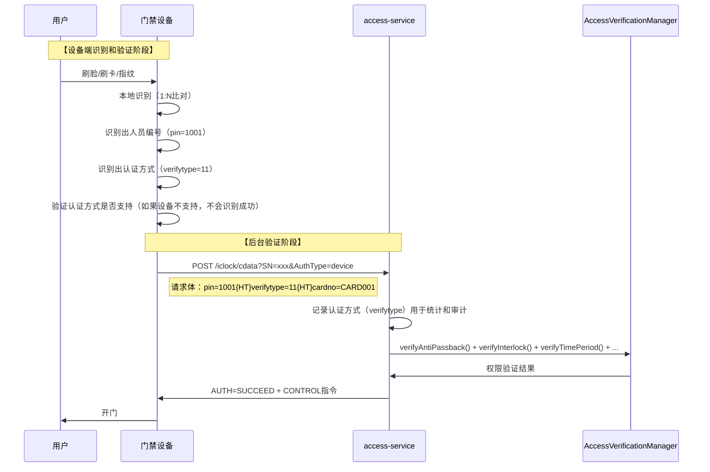

# 多模态认证最终正确理解

> **最终修正日期**: 2025-01-30
> **问题来源**: 用户明确指出多模态认证（识别的功能）不需要在门禁模块中体现，现有的多模态认证的调用是没必要的
> **参考文档**: 安防PUSH通讯协议V4.8、门禁微服务总体设计文档

---

## 🚨 最终正确理解

### 核心原则

**设备端已完成所有识别和认证方式验证**：
- ✅ 设备端通过1:N比对识别出人员编号（pin）
- ✅ 设备端已验证认证方式是否支持（如果设备不支持该认证方式，设备端不会识别成功）
- ✅ 设备端发送请求到软件端：pin=1001, verifytype=11

**软件端职责**：
- ✅ 验证用户权限（反潜、互锁、时间段、黑名单等）
- ✅ 记录认证方式（verifytype）用于统计和审计
- ✅ 返回开门指令
- ❌ **不需要验证认证方式是否允许**（设备端已完成）
- ❌ **不进行人员识别**（设备端已完成）

---

## 📋 两种验证模式的职责划分（最终版）

### 1. 边缘验证模式（Edge）

**设备端职责**:
```
用户刷脸/刷卡 → 设备端识别（1:N比对） → 识别出人员编号（pin）
→ 设备端验证认证方式是否支持 → 设备端验证权限（本地权限表）
→ 设备端开门 → 设备端上传记录到软件端（包含pin、verifytype）
```

**软件端职责**:
```
接收记录 → 存储记录 → 记录认证方式（verifytype）
→ 统计分析 → 审计追溯
```

**多模态认证作用**: 
- ✅ 记录认证方式（verifytype）
- ✅ 统计各认证方式使用情况
- ❌ **不进行人员识别**（设备端已完成）
- ❌ **不验证认证方式**（设备端已完成）

---

### 2. 后台验证模式（Backend）

**设备端职责**:
```
用户刷脸/刷卡 → 设备端识别（1:N比对） → 识别出人员编号（pin）
→ 设备端验证认证方式是否支持（如果设备不支持，不会识别成功）
→ 设备端发送请求到软件端：pin=1001, verifytype=11
```

**软件端职责**:
```
接收请求（pin + verifytype） → 验证用户权限（反潜、互锁、时间段、黑名单等）
→ 记录认证方式（verifytype）用于统计和审计
→ 返回开门指令
```

**多模态认证作用**:
- ✅ 记录认证方式（verifytype）用于统计和审计
- ❌ **不进行人员识别**（设备端已完成，pin已提供）
- ❌ **不验证认证方式是否允许**（设备端已完成）

---

## 🔍 后台验证模式详细流程（最终版）

### 安防PUSH协议V4.8后台验证流程



### 关键点

1. **设备端已识别人员和验证认证方式**:
   - 设备端通过1:N比对识别出人员编号（pin）
   - 设备端已验证认证方式是否支持（如果设备不支持该认证方式，设备端不会识别成功）
   - 设备端发送 `pin=1001, verifytype=11` 到软件端

2. **软件端不识别人员，不验证认证方式**:
   - 软件端接收 `pin`（人员编号），**不是**生物特征数据
   - 软件端根据 `pin` 查询用户权限（反潜、互锁、时间段等）
   - 软件端记录 `verifytype`（认证方式）用于统计和审计
   - ⚠️ **软件端不需要验证认证方式是否允许**（设备端已完成）

3. **多模态认证的作用**:
   - ✅ 记录认证方式（verifytype）用于统计和审计
   - ❌ **不进行人员识别**（设备端已完成）
   - ❌ **不验证认证方式是否允许**（设备端已完成）

---

## 🔧 多模态认证的正确作用（最终版）

### 核心职责

| 职责 | 边缘验证模式 | 后台验证模式 |
|------|------------|------------|
| **人员识别** | ❌ 设备端完成 | ❌ 设备端完成 |
| **认证方式验证** | ❌ 设备端完成 | ❌ 设备端完成 |
| **认证方式记录** | ✅ 软件端记录 | ✅ 软件端记录 |
| **权限验证** | ❌ 设备端完成 | ✅ 软件端验证 |
| **反潜/互锁验证** | ❌ 设备端完成（单设备） | ✅ 软件端验证（跨设备） |

### 多模态认证模块的作用

**在门禁模块中，多模态认证的作用**：
1. ✅ **记录认证方式**（verifytype）用于统计和审计
2. ✅ **提供认证方式枚举**（VerifyTypeEnum）统一管理9种认证方式
3. ✅ **转换认证方式**（verifytype ↔ verifyMethod）用于数据存储和展示
4. ❌ **不进行人员识别**（设备端已完成）
5. ❌ **不验证认证方式是否允许**（设备端已完成）

---

## 🎯 代码实现修正

### BackendVerificationStrategy修正

**修正前**（错误）:
```java
@Resource
private MultiModalAuthenticationManager multiModalAuthenticationManager;

@Override
public VerificationResult verify(AccessVerificationRequest request) {
    // ❌ 错误：不需要验证认证方式，设备端已完成
    VerificationResult authMethodResult = multiModalAuthenticationManager.authenticate(request);
    if (!authMethodResult.isSuccess()) {
        return VerificationResult.failed("AUTH_METHOD_NOT_ALLOWED", "不允许使用该认证方式");
    }
    
    // 其他验证...
}
```

**修正后**（正确）:
```java
@Override
public VerificationResult verify(AccessVerificationRequest request) {
    // ⚠️ 注意：设备端已完成人员识别和认证方式验证
    // - 设备端通过1:N比对识别出人员编号（pin）
    // - 设备端已验证认证方式是否支持（如果设备不支持，不会识别成功）
    // - 软件端只需要验证权限（反潜、互锁、时间段等），不需要验证认证方式
    
    // 记录认证方式（用于统计和审计）
    log.debug("[后台验证] 认证方式: verifyType={}", request.getVerifyType());
    
    // 1. 反潜验证
    // 2. 互锁验证
    // 3. 时间段验证
    // 4. 黑名单验证
    // 5. 多人验证（如需要）
    // ...
}
```

---

## 📋 多模态认证模块的保留用途

虽然不需要在验证流程中调用多模态认证验证，但多模态认证模块仍然有作用：

### 1. 认证方式记录和统计

**用途**：
- 记录通行记录中的认证方式（verifytype）
- 统计各认证方式的使用情况
- 提供认证方式报表

**实现位置**：
- `EdgeVerificationStrategy` - 记录认证方式
- `AccessRecordBatchService` - 转换认证方式
- `AntiPassbackService` - 获取认证方式描述

### 2. 认证方式枚举管理

**用途**：
- 统一管理9种认证方式的代码和名称
- 提供认证方式转换功能（verifytype ↔ verifyMethod）
- 提供认证方式描述

**实现位置**：
- `VerifyTypeEnum` - 认证方式枚举
- `MultiModalAuthenticationManager.getVerifyTypeDescription()` - 获取描述

### 3. 前端展示和配置

**用途**：
- 前端展示认证方式列表
- 前端配置认证方式
- 前端统计认证方式使用情况

**实现位置**：
- `MultiModalAuthenticationController` - 提供API接口
- `MultiModalAuthenticationService` - 提供业务逻辑

---

## 🎯 总结

**多模态认证的最终正确作用**:
1. ✅ **记录认证方式**（verifytype）用于统计和审计
2. ✅ **提供认证方式枚举**（VerifyTypeEnum）统一管理
3. ✅ **转换认证方式**（verifytype ↔ verifyMethod）用于数据存储和展示
4. ❌ **不进行人员识别**（设备端已完成）
5. ❌ **不验证认证方式是否允许**（设备端已完成）

**关键原则**:
- 设备端识别人员，设备端验证认证方式
- 软件端验证权限（反潜、互锁、时间段等）
- 软件端记录认证方式（用于统计和审计）
- 多模态认证是"认证方式记录和统计"，不是"人员识别"或"认证方式验证"

**架构原则**:
- ⭐ **设备端识别，软件端管理** - 生物识别在设备端完成，软件端接收记录
- ⭐ **设备端验证，软件端记录** - 认证方式验证在设备端完成，软件端记录统计
