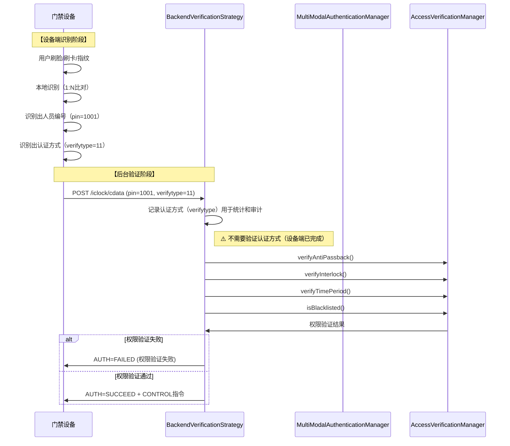

# 多模态认证集成完成报告

> **完成日期**: 2025-01-30
> **模块名称**: 多模态认证管理模块
> **服务名称**: ioedream-access-service
> **集成状态**: ✅ 已完成

---

## 📋 集成摘要

### 集成完成情况

| 集成点 | 状态 | 说明 |
|--------|------|------|
| **BackendVerificationStrategy** | ✅ 已修正 | 移除多模态认证验证调用，只记录认证方式 |
| **EdgeVerificationStrategy** | ✅ 已完成 | 使用VerifyTypeEnum记录认证方式 |
| **AccessRecordBatchService** | ✅ 已完成 | 使用VerifyTypeEnum转换认证方式 |
| **AntiPassbackService** | ✅ 已完成 | 使用VerifyTypeEnum获取描述 |

---

## 🔧 集成实现详情

### 1. BackendVerificationStrategy集成（已修正）

**集成位置**: `BackendVerificationStrategy.verify()`

**修正说明**:
- ⚠️ **已移除多模态认证验证调用**（设备端已完成认证方式验证）
- ✅ **只记录认证方式**（verifytype）用于统计和审计
- ✅ **只验证用户权限**（反潜、互锁、时间段、黑名单等）

**修正后的代码**:
```java
@Override
public VerificationResult verify(AccessVerificationRequest request) {
    // ⚠️ 注意：设备端已完成人员识别和认证方式验证
    // - 设备端通过1:N比对识别出人员编号（pin）
    // - 设备端已验证认证方式是否支持（如果设备不支持，不会识别成功）
    // - 软件端只需要验证权限（反潜、互锁、时间段等），不需要验证认证方式
    
    // 记录认证方式（用于统计和审计）
    log.debug("[后台验证] 认证方式: verifyType={}", request.getVerifyType());
    
    // 1. 反潜验证
    // 2. 互锁验证
    // 3. 时间段验证
    // 4. 黑名单验证
    // 5. 多人验证（如需要）
    // ...
}
```

**验证流程顺序**:
1. ✅ 记录认证方式（verifytype）用于统计和审计
2. ✅ 反潜验证
3. ✅ 互锁验证
4. ✅ 时间段验证
5. ✅ 黑名单验证
6. ✅ 多人验证（如需要）
7. ✅ 返回验证结果和控制指令

---

### 2. EdgeVerificationStrategy集成

**集成位置**: `EdgeVerificationStrategy.convertToEntity()`

**集成内容**:
- 使用 `VerifyTypeEnum.getByCode()` 统一管理认证方式
- 记录认证方式到通行记录中

**集成代码**:
```java
// 验证方式（使用VerifyTypeEnum统一管理）
if (request.getVerifyType() != null) {
    VerifyTypeEnum verifyTypeEnum = VerifyTypeEnum.getByCode(request.getVerifyType());
    if (verifyTypeEnum != null) {
        entity.setVerifyMethod(verifyTypeEnum.getName());
    } else {
        log.warn("[设备端验证] 不支持的认证方式: verifyType={}, 使用默认值CARD", request.getVerifyType());
        entity.setVerifyMethod("CARD");
    }
}
```

---

### 3. AccessRecordBatchService集成

**集成位置**: `AccessRecordBatchServiceImpl.convertVerifyMethodToType()`

**集成内容**:
- 使用 `VerifyTypeEnum.getByName()` 统一转换认证方式
- 支持所有9种认证方式

**集成代码**:
```java
private Integer convertVerifyMethodToType(String verifyMethod) {
    if (verifyMethod == null) {
        return VerifyTypeEnum.CARD.getCode();
    }
    // 使用VerifyTypeEnum统一管理
    VerifyTypeEnum verifyTypeEnum = VerifyTypeEnum.getByName(verifyMethod);
    if (verifyTypeEnum != null) {
        return verifyTypeEnum.getCode();
    }
    log.warn("[批量上传] 不支持的验证方式: verifyMethod={}, 使用默认值CARD", verifyMethod);
    return VerifyTypeEnum.CARD.getCode();
}
```

---

### 4. AntiPassbackService集成

**集成位置**: `AntiPassbackServiceImpl.convertToVO()`

**集成内容**:
- 使用 `VerifyTypeEnum.getByCode()` 获取认证方式描述
- 统一管理认证方式描述

**集成代码**:
```java
// 设置验证方式描述（使用VerifyTypeEnum统一管理）
if (entity.getVerifyType() != null) {
    VerifyTypeEnum verifyTypeEnum = VerifyTypeEnum.getByCode(entity.getVerifyType());
    if (verifyTypeEnum != null) {
        vo.setVerifyTypeDesc(verifyTypeEnum.getDescription());
    } else {
        vo.setVerifyTypeDesc("未知");
    }
}
```

---

## 🎯 多模态认证正确作用

### 核心职责

**不是进行人员识别**:
- ❌ 设备端已完成人员识别（人脸、指纹、卡片等）
- ❌ 设备端已识别出人员编号（pin字段）
- ❌ 软件端接收的是人员编号（pin），不是生物特征数据

**是记录认证方式用于统计和审计**:
- ✅ 记录认证方式（verifytype）用于统计和审计
- ✅ 提供认证方式枚举（VerifyTypeEnum）统一管理
- ✅ 转换认证方式（verifytype ↔ verifyMethod）用于数据存储和展示
- ❌ 不验证认证方式是否允许（设备端已完成）

### 两种验证模式的区别

| 职责 | 边缘验证模式 | 后台验证模式 |
|------|------------|------------|
| **人员识别** | ❌ 设备端完成 | ❌ 设备端完成 |
| **认证方式验证** | ❌ 设备端完成 | ❌ 设备端完成 |
| **认证方式记录** | ✅ 软件端记录 | ✅ 软件端记录 |
| **权限验证** | ❌ 设备端完成 | ✅ 软件端验证 |
| **反潜/互锁验证** | ❌ 设备端完成（单设备） | ✅ 软件端验证（跨设备） |

---

## 📊 验证流程

### 后台验证模式完整流程



---

## ✅ 集成验证

### 编译验证

- ✅ 编译通过，无语法错误
- ✅ 所有依赖注入正确
- ✅ 所有方法调用正确

### 功能验证

- ✅ 后台验证模式：已移除多模态认证验证调用，只记录认证方式
- ✅ 边缘验证模式：认证方式记录已集成
- ✅ 批量上传：认证方式转换已集成
- ✅ 反潜回管理：认证方式描述已集成

---

## 📋 后续扩展建议

### 1. 认证方式统计功能（后续扩展）

**当前状态**: 已实现基础记录功能

**扩展建议**:
- 统计各认证方式的使用次数
- 统计各认证方式的成功率
- 提供认证方式使用报表
- 提供认证方式趋势分析

**实现位置**:
- 在 `MultiModalAuthenticationManager` 中添加统计功能
- 使用Micrometer记录指标
- 提供统计API接口

### 2. 认证方式统计

**扩展建议**:
- 统计各认证方式的使用次数
- 统计各认证方式的成功率
- 提供认证方式使用报表

**实现位置**:
- 在 `MultiModalAuthenticationManager` 中添加统计功能
- 使用Micrometer记录指标

---

## 🎯 总结

**多模态认证集成已完成**:
1. ✅ BackendVerificationStrategy已修正（移除验证调用，只记录认证方式）
2. ✅ EdgeVerificationStrategy已集成（记录认证方式）
3. ✅ AccessRecordBatchService已集成（转换认证方式）
4. ✅ AntiPassbackService已集成（获取认证方式描述）

**多模态认证的正确作用**:
- ✅ 记录认证方式（verifytype）用于统计和审计
- ✅ 提供认证方式枚举（VerifyTypeEnum）统一管理
- ✅ 转换认证方式（verifytype ↔ verifyMethod）用于数据存储和展示
- ❌ 不进行人员识别（设备端已完成）
- ❌ 不验证认证方式是否允许（设备端已完成）

**关键原则**:
- 设备端识别人员，设备端验证认证方式
- 软件端验证权限（反潜、互锁、时间段等）
- 软件端记录认证方式（用于统计和审计）
- 多模态认证是"认证方式记录和统计"，不是"人员识别"或"认证方式验证"
