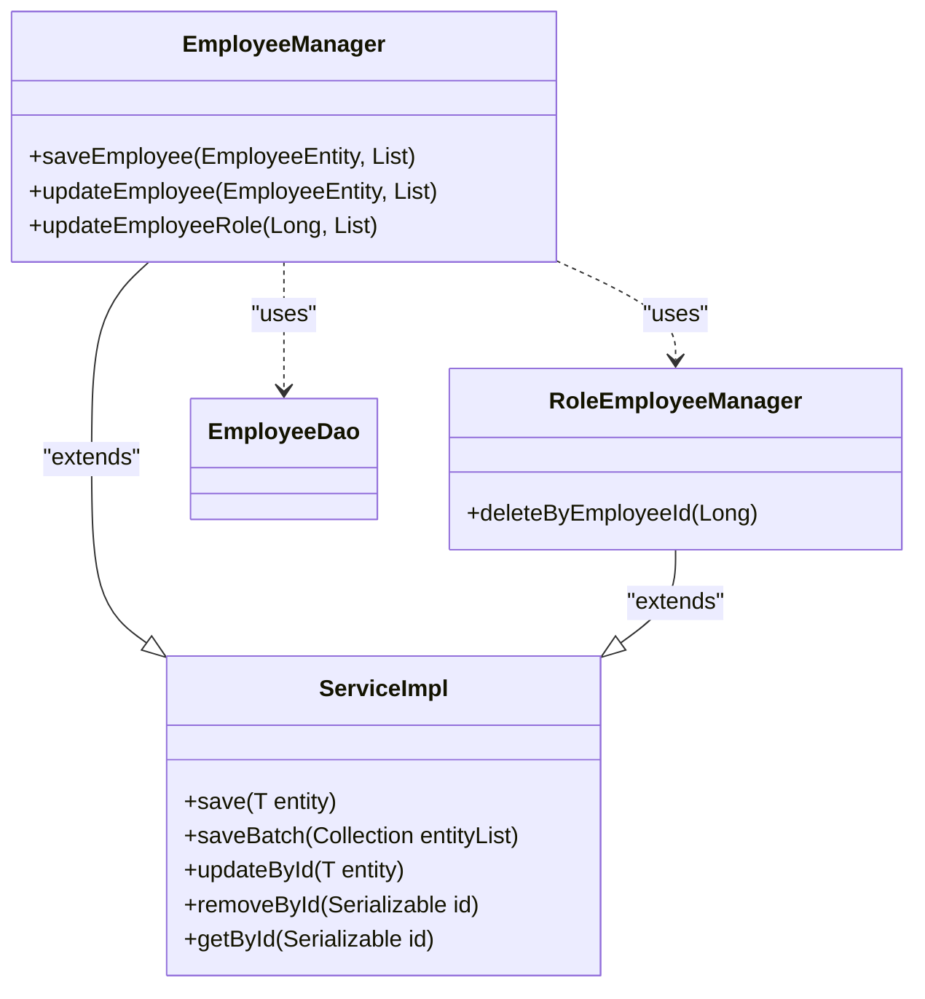
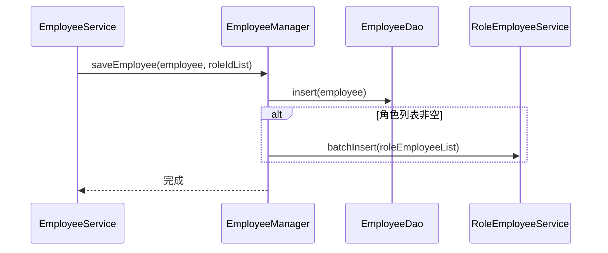
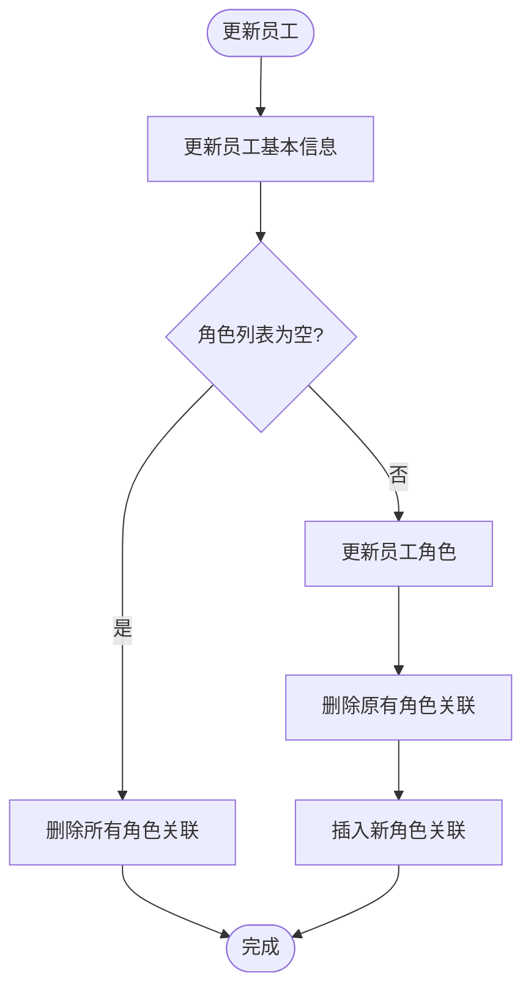

# Manager层

<cite>
**本文档引用的文件**  
- [EmployeeManager.java](file://smart-admin-api-java17-springboot3\sa-admin\src\main\java\net\lab1024\sa\admin\module\system\employee\manager\EmployeeManager.java)
- [RoleEmployeeManager.java](file://smart-admin-api-java17-springboot3\sa-admin\src\main\java\net\lab1024\sa\admin\module\system\role\manager\RoleEmployeeManager.java)
- [RoleMenuManager.java](file://smart-admin-api-java17-springboot3\sa-admin\src\main\java\net\lab1024\sa\admin\module\system\role\manager\RoleMenuManager.java)
- [DataTracerManger.java](file://smart-admin-api-java17-springboot3\sa-base\src\main\java\net\lab1024\sa\base\module\support\datatracer\manager\DataTracerManger.java)
- [AreaManager.java](file://smart-admin-api-java17-springboot3\sa-admin\src\main\java\net\lab1024\sa\admin\module\system\area\manager\AreaManager.java)
- [DepartmentCacheManager.java](file://smart-admin-api-java17-springboot3\sa-admin\src\main\java\net\lab1024\sa\admin\module\system\department\manager\DepartmentCacheManager.java)
- [MybatisPlusConfig.java](file://smart-admin-api-java17-springboot3\sa-base\src\main\java\net\lab1024\sa\base\config\MybatisPlusConfig.java)
- [EmployeeDao.java](file://smart-admin-api-java17-springboot3\sa-admin\src\main\java\net\lab1024\sa\admin\module\system\employee\dao\EmployeeDao.java)
- [RoleEmployeeDao.java](file://smart-admin-api-java17-springboot3\sa-admin\src\main\java\net\lab1024\sa\admin\module\system\role\dao\RoleEmployeeDao.java)
</cite>

## 目录
1. [引言](#引言)
2. [Manager层架构与职责](#manager层架构与职责)
3. [核心实现机制](#核心实现机制)
4. [EmployeeManager示例分析](#employeemanager示例分析)
5. [事务管理与数据一致性](#事务管理与数据一致性)
6. [批量处理与复杂查询](#批量处理与复杂查询)
7. [与其他层的协作关系](#与其他层的协作关系)
8. [最佳实践与设计优势](#最佳实践与设计优势)

## 引言

Manager层是本系统中负责封装复杂业务逻辑的核心组件，位于Service层与DAO层之间，承担着协调跨表关联操作、维护数据一致性以及处理复杂业务规则的重要职责。该层通过继承MyBatis-Plus的ServiceImpl实现基础的CRUD操作，并利用@Service注解声明为Spring Bean，确保其在整个应用上下文中的可用性。本文档将深入剖析Manager层的设计理念、实现机制及其在员工管理模块中的具体应用。

## Manager层架构与职责

Manager层作为业务逻辑的集中处理中心，其主要职责包括：

- **复杂业务逻辑封装**：将涉及多个数据表的原子性操作封装在单一方法中，确保业务操作的完整性。
- **跨表关联处理**：协调主表与关联表之间的数据操作，如员工与角色的分配关系维护。
- **事务边界控制**：通过@Transactional注解确保一系列数据库操作的原子性，防止数据不一致。
- **批量数据处理**：支持批量插入、更新和删除操作，提升系统性能。
- **复杂查询构建**：组合多个DAO查询结果，形成满足业务需求的复合数据结构。

该层遵循四层架构（Controller → Service → Manager → DAO）的设计规范，严格分离关注点，使各层职责单一且清晰。

**Section sources**
- [EmployeeManager.java](file://smart-admin-api-java17-springboot3\sa-admin\src\main\java\net\lab1024\sa\admin\module\system\employee\manager\EmployeeManager.java#L1-L87)
- [AreaManager.java](file://smart-admin-api-java17-springboot3\sa-admin\src\main\java\net\lab1024\sa\admin\module\system\area\manager\AreaManager.java#L1-L148)

## 核心实现机制

### 继承MyBatis-Plus CRUD能力

Manager层通过继承`ServiceImpl<DAO, Entity>`获得MyBatis-Plus提供的基础CRUD功能，无需重复编写通用的数据访问代码。例如：

```java
@Service
public class EmployeeManager extends ServiceImpl<EmployeeDao, EmployeeEntity> {
    // 自动获得save, update, remove等方法
}
```

这种设计模式极大地减少了模板代码，使开发者能够专注于复杂业务逻辑的实现。

### Spring Bean声明

使用`@Service`注解将Manager类声明为Spring容器管理的Bean，使其可以被Service层或其他组件通过依赖注入（@Resource）方式引用，实现松耦合的组件协作。

### 事务管理配置

系统全局启用了事务管理（@EnableTransactionManagement），并通过MyBatis Plus配置类（MybatisPlusConfig）注册分页插件和数据范围插件，为Manager层的事务操作提供基础设施支持。



**Diagram sources**
- [EmployeeManager.java](file://smart-admin-api-java17-springboot3\sa-admin\src\main\java\net\lab1024\sa\admin\module\system\employee\manager\EmployeeManager.java#L27-L28)
- [RoleEmployeeManager.java](file://smart-admin-api-java17-springboot3\sa-admin\src\main\java\net\lab1024\sa\admin\module\system\role\manager\RoleEmployeeManager.java#L17-L18)
- [MybatisPlusConfig.java](file://smart-admin-api-java17-springboot3\sa-base\src\main\java\net\lab1024\sa\base\config\MybatisPlusConfig.java#L1-L33)

**Section sources**
- [EmployeeManager.java](file://smart-admin-api-java17-springboot3\sa-admin\src\main\java\net\lab1024\sa\admin\module\system\employee\manager\EmployeeManager.java#L4-L28)
- [MybatisPlusConfig.java](file://smart-admin-api-java17-springboot3\sa-base\src\main\java\net\lab1024\sa\base\config\MybatisPlusConfig.java#L1-L33)

## EmployeeManager示例分析

以员工管理模块中的`EmployeeManager`为例，展示Manager层如何在一个事务中协调员工信息保存与角色分配的原子性操作。

### saveEmployee方法流程



该方法首先保存员工基本信息，然后根据传入的角色ID列表批量插入员工-角色关联记录，整个过程在同一个事务中完成。

### updateEmployee方法流程



当角色列表为空时，自动删除该员工的所有角色分配；否则先清除旧关联再批量插入新关联，确保数据一致性。

**Diagram sources**
- [EmployeeManager.java](file://smart-admin-api-java17-springboot3\sa-admin\src\main\java\net\lab1024\sa\admin\module\system\employee\manager\EmployeeManager.java#L43-L86)

**Section sources**
- [EmployeeManager.java](file://smart-admin-api-java17-springboot3\sa-admin\src\main\java\net\lab1024\sa\admin\module\system\employee\manager\EmployeeManager.java#L38-L86)

## 事务管理与数据一致性

Manager层通过`@Transactional(rollbackFor = Throwable.class)`注解确保操作的原子性。一旦在事务执行过程中发生异常，所有已执行的数据库操作都将回滚，避免出现部分成功导致的数据不一致问题。

例如，在`saveEmployee`方法中：
1. 插入员工记录
2. 批量插入角色关联记录

如果第二步失败，第一步插入的员工记录也会被回滚，保证了数据的完整性。

此外，系统还实现了软删除机制（deleted_flag）、乐观锁（version）和审计字段（create_time, update_time等），进一步增强了数据一致性保障。

**Section sources**
- [EmployeeManager.java](file://smart-admin-api-java17-springboot3\sa-admin\src\main\java\net\lab1024\sa\admin\module\system\employee\manager\EmployeeManager.java#L43-L86)
- [EmployeeDao.java](file://smart-admin-api-java17-springboot3\sa-admin\src\main\java\net\lab1024\sa\admin\module\system\employee\dao\EmployeeDao.java#L1-L111)

## 批量处理与复杂查询

Manager层不仅处理单条记录，还支持高效的批量操作。例如：

- `saveBatch()`：批量插入多条记录
- `updateBatchById()`：批量更新记录
- `batchUpdateDeleted()`：批量更新删除状态

对于复杂查询，Manager层会组合多个DAO查询结果，构建满足业务需求的数据结构。如`AreaManager`中的`getAreaTree()`方法，通过递归构建区域树形结构，返回完整的层级关系数据。

```java
public List<AreaTreeVO> getAreaTree() {
    List<AreaVO> allAreas = areaDao.listAll();
    return buildAreaTree(allAreas, 0L);
}
```

这种设计将数据组装逻辑集中在Manager层，减轻了Service层的负担。

**Section sources**
- [AreaManager.java](file://smart-admin-api-java17-springboot3\sa-admin\src\main\java\net\lab1024\sa\admin\module\system\area\manager\AreaManager.java#L48-L78)
- [EmployeeManager.java](file://smart-admin-api-java17-springboot3\sa-admin\src\main\java\net\lab1024\sa\admin\module\system\employee\manager\EmployeeManager.java#L50-L51)

## 与其他层的协作关系

Manager层与各层的协作关系如下：

```mermaid
graph TD
Controller --> Service
Service --> Manager
Manager --> DAO
Manager --> Manager
subgraph "Manager层"
A[EmployeeManager]
B[RoleEmployeeManager]
C[RoleMenuManager]
end
A --> B : "协调角色分配"
C --> RoleMenuDao : "更新菜单权限"
A --> EmployeeDao : "保存员工信息"
```

- **Service层调用Manager**：Service层负责流程编排和参数验证，调用Manager执行具体业务逻辑。
- **Manager调用DAO**：直接操作数据访问对象，执行数据库操作。
- **Manager间协作**：一个Manager可调用另一个Manager的方法，实现跨领域的业务协调。

这种分层架构确保了代码的可维护性和可测试性。

**Diagram sources**
- [EmployeeManager.java](file://smart-admin-api-java17-springboot3\sa-admin\src\main\java\net\lab1024\sa\admin\module\system\employee\manager\EmployeeManager.java#L30-L37)
- [RoleEmployeeManager.java](file://smart-admin-api-java17-springboot3\sa-admin\src\main\java\net\lab1024\sa\admin\module\system\role\manager\RoleEmployeeManager.java#L17-L18)

**Section sources**
- [EmployeeManager.java](file://smart-admin-api-java17-springboot3\sa-admin\src\main\java\net\lab1024\sa\admin\module\system\employee\manager\EmployeeManager.java#L30-L37)
- [RoleEmployeeManager.java](file://smart-admin-api-java17-springboot3\sa-admin\src\main\java\net\lab1024\sa\admin\module\system\role\manager\RoleEmployeeManager.java#L17-L18)

## 最佳实践与设计优势

将复杂业务逻辑从Service层分离至Manager层具有以下优势：

1. **职责单一**：Service层专注于流程控制，Manager层专注于数据操作，符合单一职责原则。
2. **复用性高**：通用的业务逻辑可在不同Service间复用。
3. **易于测试**：Manager层可独立进行单元测试，不依赖Service上下文。
4. **事务控制精确**：在Manager层定义事务边界，避免过长的事务跨度。
5. **代码可维护**：复杂的数据操作逻辑集中管理，便于维护和优化。

通过这种设计，系统实现了良好的分层架构，提高了代码质量和可维护性。

**Section sources**
- [EmployeeManager.java](file://smart-admin-api-java17-springboot3\sa-admin\src\main\java\net\lab1024\sa\admin\module\system\employee\manager\EmployeeManager.java)
- [DepartmentCacheManager.java](file://smart-admin-api-java17-springboot3\sa-admin\src\main\java\net\lab1024\sa\admin\module\system\department\manager\DepartmentCacheManager.java)