# Mapper XML映射文件

<cite>
**本文档引用的文件**
- [AreaMapper.xml](file://smart-admin-api-java17-springboot3/sa-admin/src/main/resources/mapper/system/area/AreaMapper.xml)
- [ConfigMapper.xml](file://smart-admin-api-java17-springboot3/sa-base/src/main/resources/mapper/support/ConfigMapper.xml)
- [RoleMapper.xml](file://smart-admin-api-java17-springboot3/sa-admin/src/main/resources/mapper/system/role/RoleMapper.xml)
- [DepartmentMapper.xml](file://smart-admin-api-java17-springboot3/sa-admin/src/main/resources/mapper/system/department/DepartmentMapper.xml)
- [EmployeeMapper.xml](file://smart-admin-api-java17-springboot3/sa-admin/src/main/resources/mapper/system/employee/EmployeeMapper.xml)
- [MenuMapper.xml](file://smart-admin-api-java17-springboot3/sa-admin/src/main/resources/mapper/system/menu/MenuMapper.xml)
- [CategoryMapper.xml](file://smart-admin-api-java17-springboot3/sa-admin/src/main/resources/mapper/business/category/CategoryMapper.xml)
- [OperateLogMapper.xml](file://smart-admin-api-java17-springboot3/sa-base/src/main/resources/mapper/support/OperateLogMapper.xml)
- [MyBatisPlugin.java](file://smart-admin-api-java17-springboot3/sa-admin/src/main/java/net/lab1024/sa/admin/module/system/datascope/MyBatisPlugin.java)
- [SmartPageUtil.java](file://smart-admin-api-java17-springboot3/sa-base/src/main/java/net/lab1024/sa/base/common/util/SmartPageUtil.java)
</cite>

## 目录
1. [简介](#简介)
2. [项目结构分析](#项目结构分析)
3. [核心组件架构](#核心组件架构)
4. [ResultMap配置详解](#resultmap配置详解)
5. [动态SQL编写技巧](#动态sql编写技巧)
6. [分页查询实现](#分页查询实现)
7. [关联查询与嵌套查询](#关联查询与嵌套查询)
8. [XML命名规范](#xml命名规范)
9. [SQL注入防护](#sql注入防护)
10. [性能优化策略](#性能优化策略)
11. [调试技巧](#调试技巧)
12. [最佳实践总结](#最佳实践总结)

## 简介

IOE-DREAM项目采用MyBatis作为持久层框架，通过XML映射文件实现数据库操作。该框架提供了强大的SQL映射能力，支持复杂的业务场景和高性能的数据访问需求。本文档深入分析项目中Mapper XML文件的设计理念、编写规范和最佳实践。

## 项目结构分析

项目的Mapper文件组织结构清晰，按照模块进行分类：

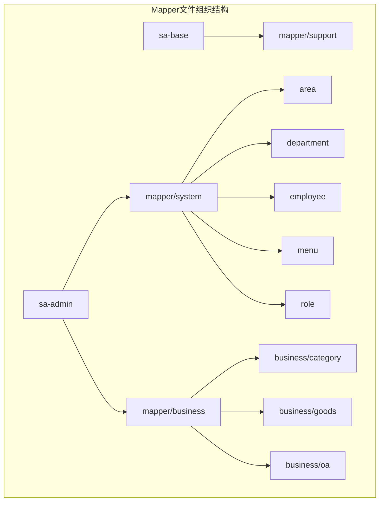

**图表来源**
- [AreaMapper.xml](file://smart-admin-api-java17-springboot3/sa-admin/src/main/resources/mapper/system/area/AreaMapper.xml)
- [ConfigMapper.xml](file://smart-admin-api-java17-springboot3/sa-base/src/main/resources/mapper/support/ConfigMapper.xml)

**章节来源**
- [AreaMapper.xml](file://smart-admin-api-java17-springboot3/sa-admin/src/main/resources/mapper/system/area/AreaMapper.xml#L1-L160)
- [ConfigMapper.xml](file://smart-admin-api-java17-springboot3/sa-base/src/main/resources/mapper/support/ConfigMapper.xml#L1-L22)

## 核心组件架构

### XML文件基础结构

所有Mapper XML文件都遵循统一的基础结构：

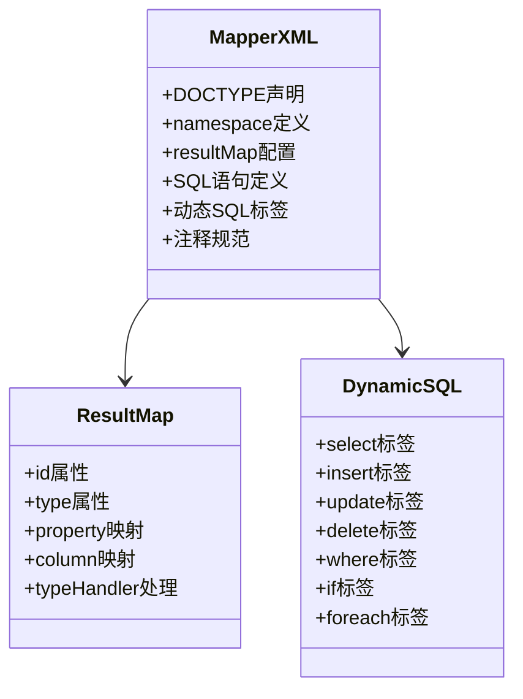

**图表来源**
- [AreaMapper.xml](file://smart-admin-api-java17-springboot3/sa-admin/src/main/resources/mapper/system/area/AreaMapper.xml#L1-L23)
- [ConfigMapper.xml](file://smart-admin-api-java17-springboot3/sa-base/src/main/resources/mapper/support/ConfigMapper.xml#L1-L22)

### 命名空间设计原则

每个Mapper文件都有明确的命名空间，遵循以下规范：
- **命名空间格式**：`包路径.dao.接口名`
- **示例**：`net.lab1024.sa.admin.module.system.area.dao.AreaDao`
- **一致性原则**：确保命名空间与Java接口完全对应

**章节来源**
- [AreaMapper.xml](file://smart-admin-api-java17-springboot3/sa-admin/src/main/resources/mapper/system/area/AreaMapper.xml#L3-L3)

## ResultMap配置详解

### 基础ResultMap结构

ResultMap是MyBatis的核心配置，用于建立数据库字段与Java对象属性的映射关系：

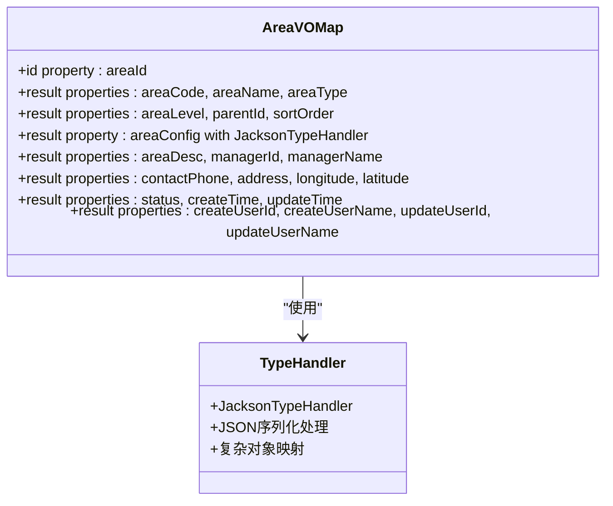

**图表来源**
- [AreaMapper.xml](file://smart-admin-api-java17-springboot3/sa-admin/src/main/resources/mapper/system/area/AreaMapper.xml#L6-L29)

### 字段映射规则

1. **基本字段映射**：直接使用`<result>`标签
2. **主键映射**：使用`<id>`标签标识主键字段
3. **复杂类型处理**：通过`typeHandler`属性指定处理器

### 类型处理器应用

项目中广泛使用JacksonTypeHandler处理JSON字段：

| 字段 | 类型 | 处理器 | 用途 |
|------|------|--------|------|
| area_config | Map<String, Object> | JacksonTypeHandler | 区域配置信息 |
| 其他JSON字段 | 复杂对象 | JacksonTypeHandler | 存储结构化数据 |

**章节来源**
- [AreaMapper.xml](file://smart-admin-api-java17-springboot3/sa-admin/src/main/resources/mapper/system/area/AreaMapper.xml#L14-L14)

## 动态SQL编写技巧

### <where>标签的智能使用

`<where>`标签自动处理SQL条件，避免多余的AND关键字：

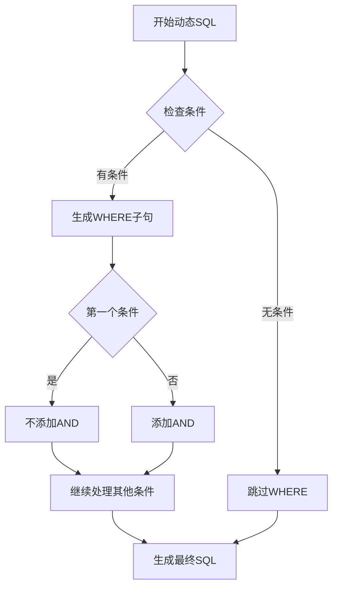

**图表来源**
- [AreaMapper.xml](file://smart-admin-api-java17-springboot3/sa-admin/src/main/resources/mapper/system/area/AreaMapper.xml#L66-L93)

### <if>标签条件判断

动态条件判断遵循严格的空值检查逻辑：

| 条件表达式 | 用途 | 示例 |
|------------|------|------|
| `test="queryForm.areaCode != null"` | 非空检查 | 检查查询参数是否为空 |
| `test="queryForm.areaName != ''"` | 非空字符串检查 | 验证字符串内容 |
| `test="parentId != null"` | 数值类型检查 | 处理数值参数 |

### <foreach>标签集合处理

批量操作和IN查询的标准实现：

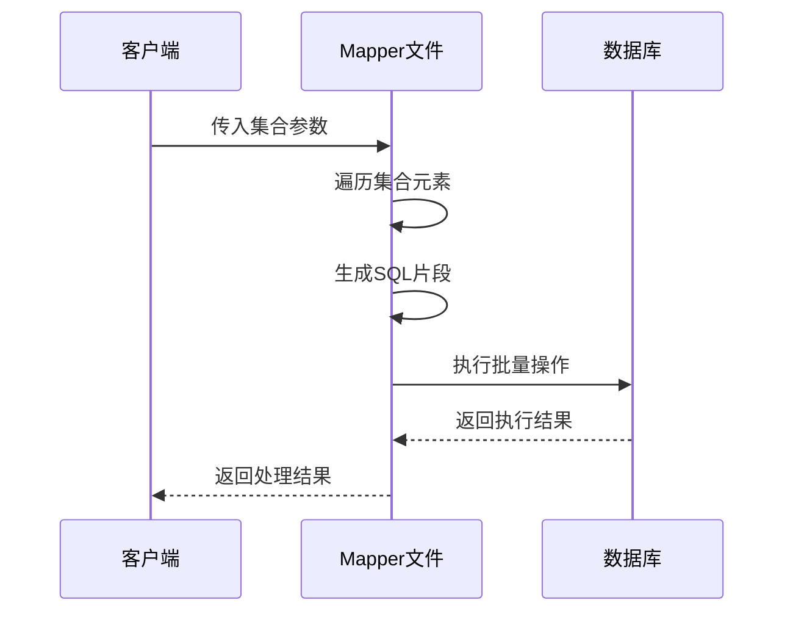

**图表来源**
- [EmployeeMapper.xml](file://smart-admin-api-java17-springboot3/sa-admin/src/main/resources/mapper/system/employee/EmployeeMapper.xml#L23-L25)
- [CategoryMapper.xml](file://smart-admin-api-java17-springboot3/sa-admin/src/main/resources/mapper/business/category/CategoryMapper.xml#L10-L12)

**章节来源**
- [AreaMapper.xml](file://smart-admin-api-java17-springboot3/sa-admin/src/main/resources/mapper/system/area/AreaMapper.xml#L66-L93)
- [EmployeeMapper.xml](file://smart-admin-api-java17-springboot3/sa-admin/src/main/resources/mapper/system/employee/EmployeeMapper.xml#L11-L33)

## 分页查询实现

### 分页工具类集成

项目使用SmartPageUtil工具类处理分页逻辑：

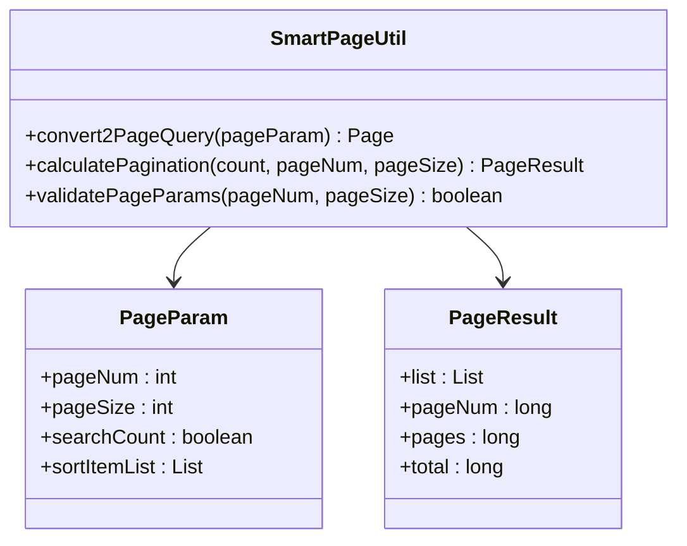

**图表来源**
- [SmartPageUtil.java](file://smart-admin-api-java17-springboot3/sa-base/src/main/java/net/lab1024/sa/base/common/util/SmartPageUtil.java#L32-L42)

### 分页查询SQL模板

分页查询的标准实现模式：

| 查询类型 | 实现方式 | 性能特点 |
|----------|----------|----------|
| 基础分页 | `LIMIT offset, size` | 内存友好，适合大数据集 |
| 排序优化 | `ORDER BY field ASC/DESC` | 提升查询效率 |
| 条件过滤 | 动态WHERE子句 | 精确匹配，减少数据传输 |

**章节来源**
- [SmartPageUtil.java](file://smart-admin-api-java17-springboot3/sa-base/src/main/java/net/lab1024/sa/base/common/util/SmartPageUtil.java#L100-L118)

## 关联查询与嵌套查询

### 多表关联查询

项目中的关联查询主要涉及员工、部门、角色等实体的复杂关系：

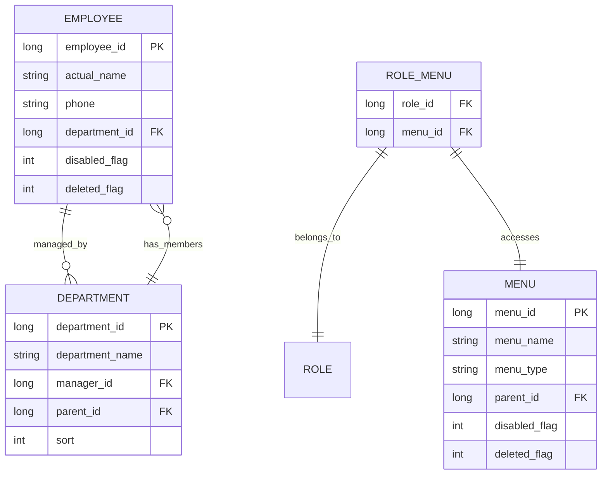

**图表来源**
- [EmployeeMapper.xml](file://smart-admin-api-java17-springboot3/sa-admin/src/main/resources/mapper/system/employee/EmployeeMapper.xml#L5-L11)
- [MenuMapper.xml](file://smart-admin-api-java17-springboot3/sa-admin/src/main/resources/mapper/system/menu/MenuMapper.xml#L48-L56)

### 递归查询实现

项目实现了基于CTE(Common Table Expression)的递归查询：

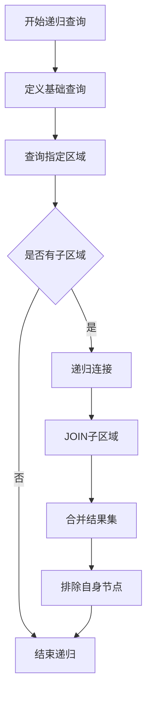

**图表来源**
- [AreaMapper.xml](file://smart-admin-api-java17-springboot3/sa-admin/src/main/resources/mapper/system/area/AreaMapper.xml#L140-L157)

### 嵌套查询优化

嵌套查询的性能优化策略：

| 优化技术 | 应用场景 | 性能提升 |
|----------|----------|----------|
| EXISTS替代IN | 大集合查询 | 减少数据扫描 |
| 子查询缓存 | 重复计算 | 提升执行效率 |
| 索引优化 | 关联字段 | 加速连接操作 |

**章节来源**
- [AreaMapper.xml](file://smart-admin-api-java17-springboot3/sa-admin/src/main/resources/mapper/system/area/AreaMapper.xml#L140-L157)
- [EmployeeMapper.xml](file://smart-admin-api-java17-springboot3/sa-admin/src/main/resources/mapper/system/employee/EmployeeMapper.xml#L124-L137)

## XML命名规范

### 文件命名规范

| 文件类型 | 命名格式 | 示例 | 说明 |
|----------|----------|------|------|
| Mapper文件 | `{模块名}Mapper.xml` | AreaMapper.xml | 模块名首字母大写 |
| DAO接口 | `{模块名}Dao` | AreaDao | 接口与文件名对应 |
| 结果映射 | `{模块名}VO` | AreaVO | VO表示视图对象 |

### 标签命名规范

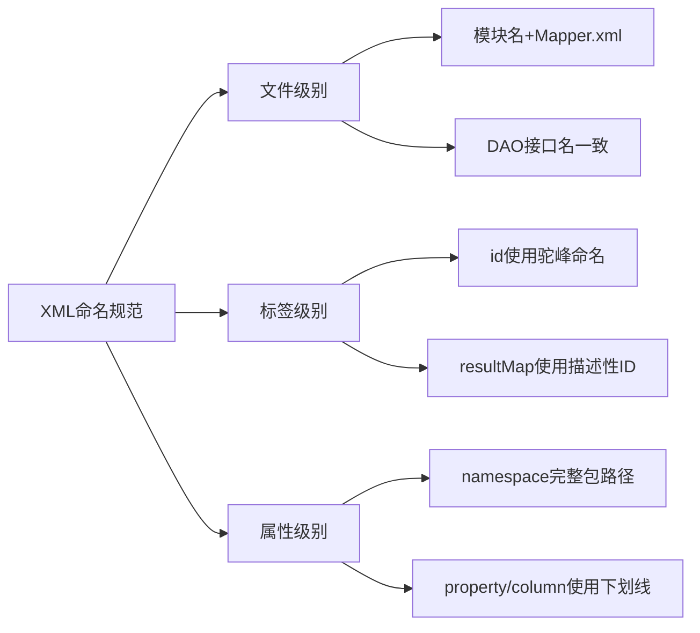

**章节来源**
- [AreaMapper.xml](file://smart-admin-api-java17-springboot3/sa-admin/src/main/resources/mapper/system/area/AreaMapper.xml#L3-L3)
- [ConfigMapper.xml](file://smart-admin-api-java17-springboot3/sa-base/src/main/resources/mapper/support/ConfigMapper.xml#L3-L3)

## SQL注入防护

### 参数绑定安全机制

MyBatis通过参数绑定防止SQL注入：

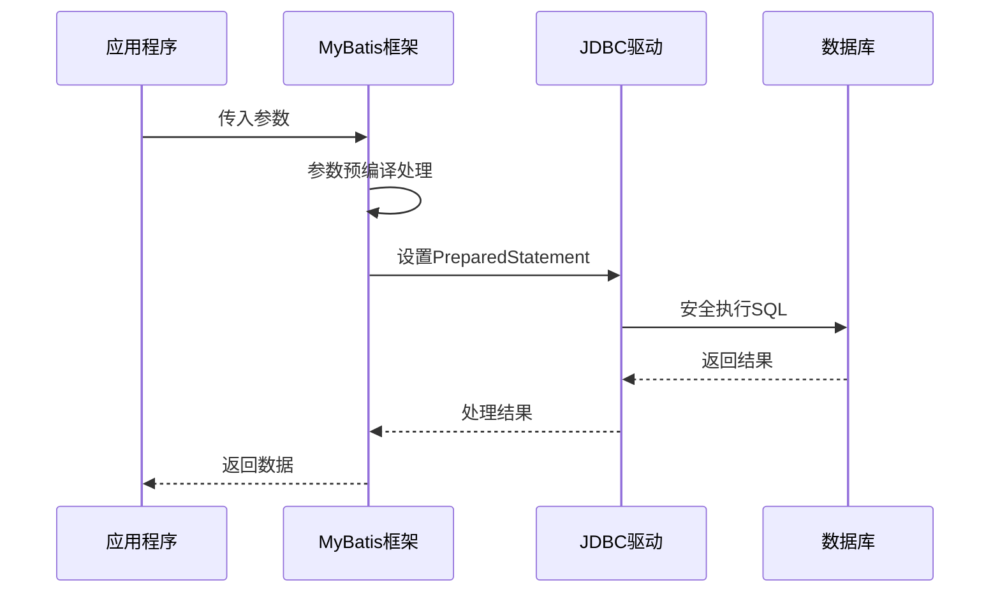

**图表来源**
- [MyBatisPlugin.java](file://smart-admin-api-java17-springboot3/sa-admin/src/main/java/net/lab1024/sa/admin/module/system/datascope/MyBatisPlugin.java#L34-L59)

### 动态SQL安全检查

项目在动态SQL中实施严格的安全检查：

| 检查类型 | 实现方式 | 防护效果 |
|----------|----------|----------|
| 空值检查 | `test="param != null"` | 防止空指针异常 |
| 空字符串检查 | `test="param != ''"` | 避免无效条件 |
| 类型验证 | `test="param instanceof XXX"` | 确保参数类型正确 |

### 数据库访问控制

通过MyBatisPlugin实现数据权限控制：

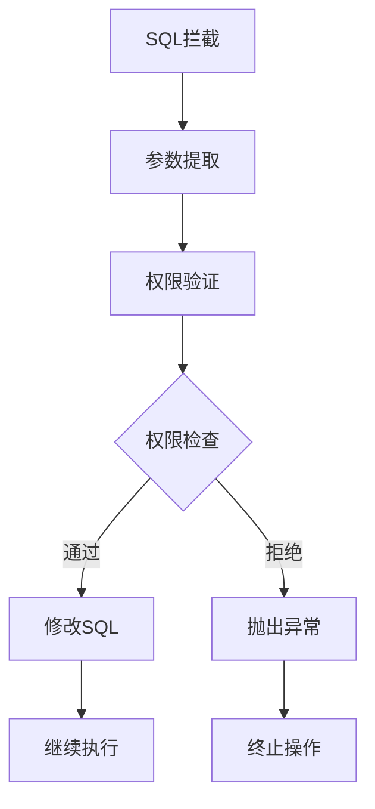

**图表来源**
- [MyBatisPlugin.java](file://smart-admin-api-java17-springboot3/sa-admin/src/main/java/net/lab1024/sa/admin/module/system/datascope/MyBatisPlugin.java#L34-L59)

**章节来源**
- [MyBatisPlugin.java](file://smart-admin-api-java17-springboot3/sa-admin/src/main/java/net/lab1024/sa/admin/module/system/datascope/MyBatisPlugin.java#L34-L96)

## 性能优化策略

### 查询性能优化

1. **索引优化**：在常用查询字段上建立索引
2. **查询精简**：只查询需要的字段，避免SELECT *
3. **分页优化**：使用LIMIT和OFFSET进行分页
4. **缓存策略**：合理使用MyBatis二级缓存

### 批量操作优化

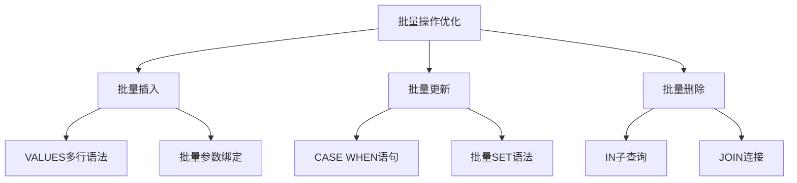

**图表来源**
- [MenuMapper.xml](file://smart-admin-api-java17-springboot3/sa-admin/src/main/resources/mapper/system/menu/MenuMapper.xml#L5-L14)

### 内存使用优化

| 优化技术 | 实现方式 | 效果 |
|----------|----------|------|
| 流式查询 | `RowBounds`参数 | 减少内存占用 |
| 结果映射优化 | 合理使用ResultMap | 提升映射效率 |
| 连接池配置 | Druid连接池 | 提升并发性能 |

**章节来源**
- [MenuMapper.xml](file://smart-admin-api-java17-springboot3/sa-admin/src/main/resources/mapper/system/menu/MenuMapper.xml#L5-L14)

## 调试技巧

### 日志配置

项目提供了完善的日志配置，支持SQL调试：

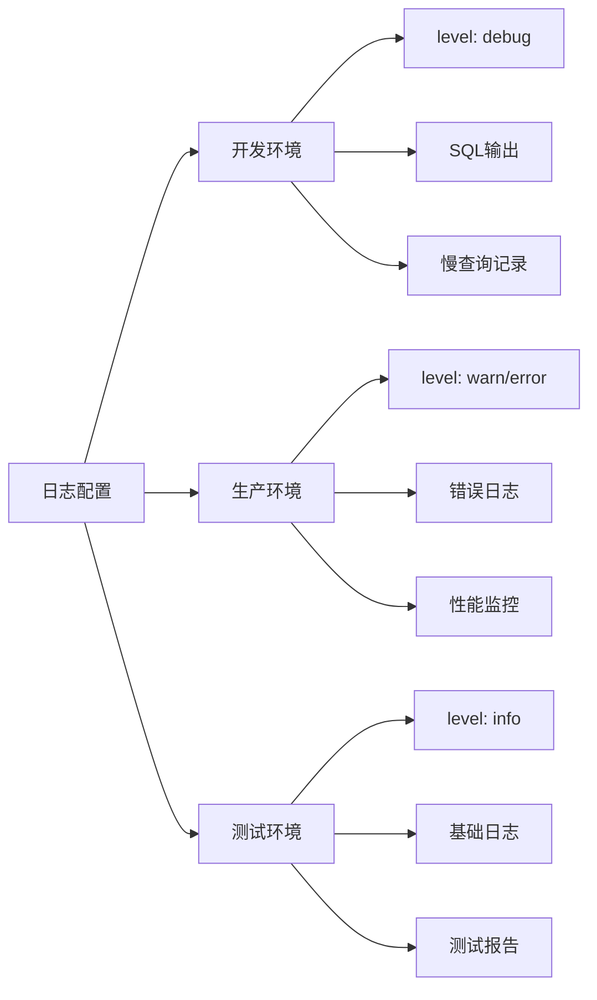

### SQL调试方法

1. **开启SQL日志**：设置log.level.debug
2. **慢查询监控**：配置Druid监控
3. **参数跟踪**：记录SQL执行参数
4. **执行计划分析**：使用EXPLAIN分析查询

### 常见问题排查

| 问题类型 | 排查方法 | 解决方案 |
|----------|----------|----------|
| SQL语法错误 | 检查XML语法 | 使用IDE插件验证 |
| 参数绑定失败 | 验证参数类型 | 检查ResultMap映射 |
| 性能问题 | 分析执行计划 | 优化索引和查询 |
| 内存泄漏 | 监控连接池 | 正确关闭资源 |

**章节来源**
- [OperateLogMapper.xml](file://smart-admin-api-java17-springboot3/sa-base/src/main/resources/mapper/support/OperateLogMapper.xml#L38-L45)

## 最佳实践总结

### 开发规范

1. **文件组织**：按模块分类，保持目录结构清晰
2. **命名约定**：使用一致的命名规范
3. **注释规范**：为复杂SQL添加详细注释
4. **版本控制**：定期审查和优化SQL语句

### 性能考虑

1. **查询优化**：避免N+1查询问题
2. **索引策略**：合理设计数据库索引
3. **缓存利用**：充分利用MyBatis缓存机制
4. **批量操作**：优先使用批量操作

### 安全实践

1. **参数绑定**：始终使用参数绑定
2. **权限控制**：实现细粒度的访问控制
3. **输入验证**：对用户输入进行严格验证
4. **审计日志**：记录关键操作的审计信息

### 维护建议

1. **定期优化**：根据实际使用情况优化SQL
2. **监控告警**：建立性能监控和告警机制
3. **文档维护**：及时更新相关技术文档
4. **团队培训**：定期进行MyBatis使用培训

通过遵循这些最佳实践，可以构建高效、安全、可维护的MyBatis XML映射文件，为业务系统提供稳定可靠的数据访问层支持。