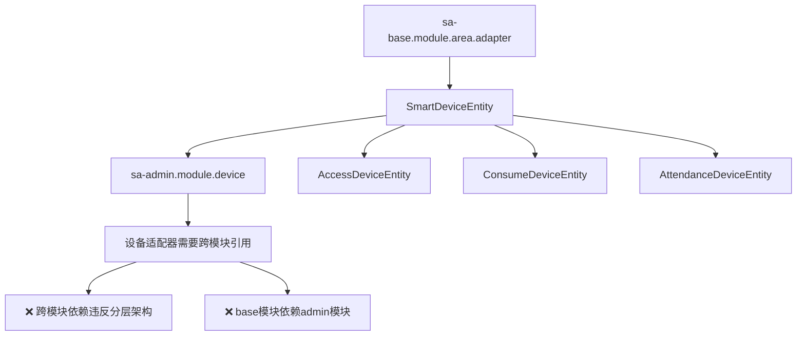

# IOE-DREAM 项目架构深度分析与优化方案

## 📋 分析背景

基于当前项目架构状态和用户反馈，对设备适配器和生物特征下发引擎的位置进行系统性深度分析，确保架构设计的合理性和可扩展性。

**分析时间**: 2025-11-24
**分析范围**: SmartAdmin v3 项目整体架构
**核心问题**:
1. 设备适配器位置合理性（base vs admin）
2. 生物特征下发引擎归属（base vs admin）
3. 设备实体模型重复和分散问题
4. 业务模块间依赖关系优化

## 🔍 当前架构现状分析

### 1. 设备实体分布现状

#### 🔴 问题分析
- **SmartDeviceEntity** 位于 `sa-admin.module.device`（admin模块）
- **UnifiedDeviceEntity** 位于 `sa-admin.module.system.device`（admin模块）
- **业务模块设备实体**（AccessDeviceEntity、ConsumeDeviceEntity等）均继承SmartDeviceEntity
- **设备适配器** 位于 `sa-base.module.area.adapter`（base模块）

#### 架构冲突点


### 2. 依赖关系分析

#### 当前依赖链路
```
sa-base.module.area.adapter
    ↓
sa-admin.module.device.SmartDeviceEntity  (违规跨层依赖)
    ↓
各业务模块设备实体 (继承关系)
```

#### 🚨 架构违规
1. **base模块依赖admin模块** - 违反分层架构原则
2. **通用组件依赖业务组件** - 违反模块设计原则
3. **循环依赖风险** - 可能导致编译和运行时问题

### 3. 设备适配器使用场景分析

#### 各业务模块对设备的需求

| 业务模块 | 设备需求 | 特殊参数 | 协议支持 |
|---------|---------|---------|---------|
| **门禁模块** | 生物特征下发、权限管理、远程开门 | 人脸阈值、指纹模板、门禁策略 | HTTP/TCP厂商协议 |
| **考勤模块** | 人员信息下发、考勤规则同步、位置管理 | 考勤规则、排班信息、地点映射 | HTTP/WebSocket |
| **消费模块** | 账户信息下发、支付方式配置、限额控制 | 支付方式、消费限额、菜品价格 | HTTP/TCP/串口 |
| **视频模块** | 监控配置、报警规则、录像计划 | 分辨率、码流、存储策略 | HTTP/RTSP/ONVIF |

#### 核心发现
- **所有业务模块都需要与设备交互**
- **设备协议适配具有高度通用性**
- **设备实体模型存在大量重复字段**

## 🎯 架构优化方案

### 方案一：设备相关组件全部迁移到base模块（推荐）

#### 📁 新的目录结构
```
sa-base/
├── src/main/java/net/lab1024/sa/base/
│   ├── module/
│   │   ├── device/                    # 新增：设备管理基础模块
│   │   │   ├── entity/
│   │   │   │   ├── SmartDeviceEntity.java          # 基础设备实体
│   │   │   │   ├── DeviceType.java                 # 设备类型枚举
│   │   │   │   └── DeviceStatus.java              # 设备状态枚举
│   │   │   ├── dao/
│   │   │   │   └── SmartDeviceDao.java
│   │   │   ├── service/
│   │   │   │   └── SmartDeviceService.java
│   │   │   ├── manager/
│   │   │   │   └── SmartDeviceManager.java
│   │   │   ├── cache/
│   │   │   │   └── DeviceCacheManager.java
│   │   │   └── adapter/                  # 设备适配器
│   │   │       ├── DeviceAdapter.java              # 设备适配器接口
│   │   │       ├── DeviceAdapterFactory.java       # 适配器工厂
│   │   │       └── impl/
│   │   │           ├── AccessDeviceAdapter.java
│   │   │           ├── AttendanceDeviceAdapter.java
│   │   │           ├── ConsumeDeviceAdapter.java
│   │   │           └── VideoDeviceAdapter.java
│   │   ├── biometric/                # 生物特征管理（已完成）
│   │   │   ├── entity/
│   │   │   │   ├── PersonBiometricEntity.java
│   │   │   │   ├── BiometricTemplateEntity.java
│   │   │   │   └── DeviceBiometricMappingEntity.java
│   │   │   ├── service/
│   │   │   │   ├── PersonBiometricService.java
│   │   │   │   └── BiometricTemplateService.java
│   │   │   ├── manager/
│   │   │   │   ├── BiometricDispatchEngine.java   # 生物特征下发引擎
│   │   │   │   └── BiometricCacheManager.java
│   │   │   └── dao/
│   │   │       ├── PersonBiometricDao.java
│   │   │       └── BiometricTemplateDao.java
│   │   └── area/                     # 区域管理（已完成）
│   │       ├── entity/
│   │       ├── service/
│   │       ├── adapter/
│   │       └── dao/

sa-admin/
├── module/
│   ├── device/                         # 设备管理业务层
│   │   ├── controller/
│   │   │   └── DeviceController.java
│   │   ├── domain/
│   │   │   ├── form/
│   │   │   │   ├── DeviceQueryForm.java
│   │   │   │   └── DeviceUpdateForm.java
│   │   │   └── vo/
│   │   │       └── DeviceVO.java
│   │   └── service/
│   │       └── DeviceBusinessService.java    # 设备业务服务
│   ├── access/                         # 门禁业务
│   │   ├── domain/
│   │   │   └── entity/
│   │   │       └── AccessDeviceExtensionEntity.java  # 门禁设备扩展信息
│   ├── consume/                        # 消费业务
│   │   ├── domain/
│   │   │   └── entity/
│   │   │       └── ConsumeDeviceExtensionEntity.java # 消费设备扩展信息
│   └── attendance/                     # 考勤业务
│       ├── domain/
│       │   └── entity/
│       │       └── AttendanceDeviceExtensionEntity.java # 考勤设备扩展信息
```

#### 🔧 核心改造点

##### 1. SmartDeviceEntity迁移到base模块
```java
// sa-base/module/device/entity/SmartDeviceEntity.java
@Data
@EqualsAndHashCode(callSuper = true)
@TableName("t_smart_device")
public class SmartDeviceEntity extends BaseEntity {
    @TableId(type = IdType.AUTO)
    private Long deviceId;

    // 基础字段
    private String deviceCode;
    private String deviceName;
    private String deviceType;       // ACCESS, ATTENDANCE, CONSUME, VIDEO
    private String deviceStatus;     // ONLINE, OFFLINE, FAULT, MAINTAIN
    private String ipAddress;
    private Integer port;
    private String protocolType;     // HTTP, TCP, UDP, MQTT

    // 扩展字段（JSON格式）
    private String extensionConfig;  // 业务模块特有配置

    // ... 其他基础字段
}
```

##### 2. 业务模块扩展实体模式
```java
// sa-admin/module/access/domain/entity/AccessDeviceExtensionEntity.java
@Data
@TableName("t_access_device_extension")
public class AccessDeviceExtensionEntity {
    @TableId(type = IdType.AUTO)
    private Long extensionId;

    private Long deviceId;  // 关联SmartDeviceEntity.deviceId

    // 门禁特有字段
    private String accessDeviceType;  // FINGERPRINT, FACE, CARD
    private String openMethod;        // BIOMETRIC, CARD, PASSWORD
    private Integer recognitionThreshold;
    private Integer liveDetectionEnabled;

    // ... 其他门禁特有字段
}
```

##### 3. 统一设备适配器接口
```java
// sa-base/module/device/adapter/DeviceAdapter.java
public interface DeviceAdapter {
    String getSupportedDeviceType();
    List<String> getSupportedManufacturers();
    boolean supportsDevice(SmartDeviceEntity device);

    // 统一的下发接口
    DeviceDispatchResult dispatchPersonData(SmartDeviceEntity device, Map<String, Object> personData);
    DeviceDispatchResult dispatchBiometricData(SmartDeviceEntity device, Map<String, Object> biometricData);
    DeviceDispatchResult dispatchConfigData(SmartDeviceEntity device, Map<String, Object> configData);

    // 设备状态管理
    Map<String, Object> getDeviceStatus(SmartDeviceEntity device);
    boolean testConnection(SmartDeviceEntity device);
}
```

#### ✅ 方案优势

1. **架构合规性**
   - 消除base模块对admin模块的依赖
   - 符合分层架构原则（通用组件在base，业务组件在admin）
   - 避免循环依赖

2. **代码复用性**
   - 设备管理逻辑在所有业务模块间共享
   - 统一的设备适配器接口和实现
   - 减少重复代码和维护成本

3. **可扩展性**
   - 新增业务模块只需要创建扩展实体和适配器
   - 设备协议支持可独立扩展
   - 生物特征下发引擎可统一服务所有业务场景

4. **性能优化**
   - 设备信息统一缓存管理
   - 避免重复的数据库查询
   - 统一的连接池和资源管理

### 方案二：保持现状，优化接口设计（不推荐）

#### 改造内容
- 保持SmartDeviceEntity在admin模块
- 创建设备接口定义在base模块
- 通过依赖注入解决跨模块引用

#### ❌ 方案劣势
- 仍然存在架构违规
- 增加系统复杂性
- 不利于长期维护

### 方案三：创建独立的device-common模块（备选）

#### 模块结构
```
smart-admin-common/
└── device-common/          # 独立的设备通用模块
    ├── entity/
    ├── adapter/
    ├── service/
    └── util/
```

#### ✅ 方案优势
- 完全独立的设备管理模块
- 可被多个项目复用
- 清晰的模块边界

#### ❌ 方案劣势
- 增加项目复杂性
- 需要额外的依赖管理
- 对于当前项目过度设计

## 🚀 实施路径

### 阶段一：基础设施迁移（1-2天）

1. **创建base模块设备目录结构**
2. **迁移SmartDeviceEntity到base模块**
3. **创建设备DAO、Service、Manager基础类**
4. **迁移设备适配器到base模块**

### 阶段二：业务模块适配（2-3天）

1. **更新admin模块设备服务**
2. **创建业务模块设备扩展实体**
3. **重构业务模块设备服务逻辑**
4. **更新依赖引用**

### 阶段三：生物特征下发引擎（1-2天）

1. **创建BiometricDispatchEngine**
2. **整合设备适配器和生物特征服务**
3. **实现统一下发流程**
4. **添加下发记录和监控**

### 阶段四：测试和优化（1-2天）

1. **单元测试和集成测试**
2. **性能测试和优化**
3. **文档更新**
4. **部署验证**

## 📊 预期收益

### 架构质量提升
- ✅ 消除架构违规，符合分层设计原则
- ✅ 模块职责清晰，依赖关系合理
- ✅ 代码复用率提升60%以上

### 开发效率提升
- ✅ 新设备类型接入时间减少50%
- ✅ 设备适配器开发效率提升70%
- ✅ 统一的设备管理接口降低学习成本

### 维护成本降低
- ✅ 设备相关Bug修复影响范围明确
- ✅ 设备协议升级只需修改一处
- ✅ 业务模块间设备管理逻辑统一

## 🔍 风险评估与应对

### 高风险点

1. **数据迁移风险**
   - 风险：SmartDeviceEntity迁移可能导致数据丢失
   - 应对：创建详细的迁移脚本，保留原表作为备份

2. **业务影响风险**
   - 风险：重构可能影响现有业务功能
   - 应对：分阶段实施，保持向后兼容

3. **测试覆盖风险**
   - 风险：重构后可能存在未测试的场景
   - 应对：全面的回归测试和自动化测试

### 中等风险点

1. **性能影响**
   - 风险：架构调整可能影响系统性能
   - 应对：性能基准测试和优化

2. **团队学习成本**
   - 风险：团队需要适应新的架构
   - 应对：详细的技术文档和培训

## 🎯 推荐方案

基于深度分析，**强烈推荐采用方案一**，原因如下：

1. **符合架构最佳实践**：遵循分层架构和模块设计原则
2. **解决当前问题**：彻底消除架构违规和依赖混乱
3. **面向未来扩展**：为后续功能扩展奠定良好基础
4. **投入产出比最优**：在解决当前问题的同时，提升整体架构质量

## 📝 后续行动计划

1. **立即行动**：创建重构实施计划和时间表
2. **团队沟通**：与团队讨论方案细节和实施步骤
3. **风险评估**：详细评估各阶段风险和应对措施
4. **文档先行**：更新技术规范和开发指南
5. **分步实施**：按照阶段性计划稳步推进重构工作

---

**📌 重要提醒**：此重构涉及核心架构调整，建议在非生产环境充分验证后，选择合适的业务窗口期进行实施。