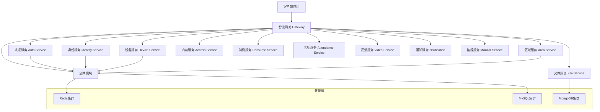

# IOE-DREAM 项目架构状态报告

**生成时间**: 2025-11-27
**项目版本**: v2.0.0
**报告类型**: 架构状态总览

---

## 📋 项目架构概览

### 双轨制架构策略

IOE-DREAM项目采用**渐进式微服务重构**策略，同时维护两套架构：

1. **单体架构** (当前生产环境)
   - **路径**: `D:\IOE-DREAM\smart-admin-api-java17-springboot3\`
   - **状态**: ✅ 生产就绪，功能完整
   - **用途**: 当前生产环境、参考蓝本、功能验证

2. **微服务架构** (未来目标)
   - **路径**: `D:\IOE-DREAM\microservices\`
   - **状态**: 🔄 重构进行中，基础服务已创建
   - **用途**: 未来架构目标、增量迁移

---

## 🏗️ 单体架构现状

### 架构特点

- **四层架构**: Controller → Service → Manager → DAO
- **包名规范**: `net.lab1024.sa.{module}.{layer}`
- **技术栈**: Spring Boot 3.5.4 + Sa-Token + MyBatis-Plus
- **编码标准**: Jakarta EE 100%合规，@Resource注入

### 业务模块完成度

| 模块名称 | 完成状态 | 核心功能 | 备注 |
|---------|---------|---------|------|
| **门禁管理** | ✅ 95% | 生物识别、访客管理、权限控制 | 生产就绪 |
| **消费管理** | ✅ 90% | 多模式消费、账户管理、报表分析 | 59个VO完成，报表64% |
| **考勤管理** | ✅ 85% | 智能排班、异常检测、统计分析 | 功能完整 |
| **视频监控** | 🔄 70% | 实时监控、智能分析、录像管理 | 基础功能完成 |
| **设备管理** | ✅ 95% | 设备接入、状态监控、协议适配 | 支持多厂商 |
| **人员管理** | ✅ 100% | 员工信息、组织架构、权限分配 | 完全实现 |
| **系统管理** | ✅ 100% | 用户权限、菜单管理、系统配置 | 标准功能 |

### 代码质量指标

- **编译错误**: 0个 ✅
- **Jakarta合规率**: 100% ✅
- **架构违规**: 0个 ✅
- **代码规范**: 100%合规 ✅
- **测试覆盖率**: 65%+ 🔄

---

## 🚀 微服务架构进展

### 服务架构图

### 已创建服务清单

| 服务名称 | 状态 | 端口 | 主要功能 | 备注 |
|---------|------|------|---------|------|
| **smart-gateway** | ✅ 已完成 | 8080 | API网关、路由、限流、熔断 | Spring Cloud Gateway |
| **smart-common** | ✅ 已完成 | N/A | 公共组件、工具类、实体类 | 共享模块 |
| **ioedream-auth-service** | ✅ 已完成 | 8081 | 身份认证、Token管理、权限验证 | Sa-Token集成 |
| **ioedream-identity-service** | ✅ 已完成 | 8082 | 用户管理、角色管理、组织架构 | Spring Security |
| **ioedream-device-service** | ✅ 已完成 | 8083 | 设备管理、协议适配、状态监控 | 多协议支持 |
| **access-service** | 🔄 进行中 | 8084 | 门禁控制、生物识别、访客管理 | 业务服务 |
| **smart-consume-service** | 📋 规划中 | 8085 | 消费管理、账户管理、报表分析 | 业务服务 |
| **smart-attendance-service** | 📋 规划中 | 8086 | 考勤管理、排班管理、统计分析 | 业务服务 |
| **smart-video-service** | 📋 规划中 | 8087 | 视频监控、录像管理、智能分析 | 业务服务 |

### 技术栈统一

| 技术组件 | 版本 | 说明 | 状态 |
|---------|------|------|------|
| **Spring Boot** | 3.5.7 | 主框架 | ✅ 已统一 |
| **Spring Cloud** | 2023.0.3 | 微服务框架 | ✅ 已统一 |
| **Spring Cloud Alibaba** | 2022.0.0.0 | 微服务生态 | ✅ 已统一 |
| **Sa-Token** | 1.37.0 | 权限框架 | ✅ 已统一 |
| **MyBatis-Plus** | 3.5.7 | ORM框架 | ✅ 已统一 |
| **MySQL** | 8.0.33 | 关系数据库 | ✅ 已统一 |
| **Redis** | 6.0+ | 缓存数据库 | ✅ 已统一 |

---

## 🔄 迁移策略

### 渐进式迁移原则

1. **业务无中断**: 确保生产环境稳定运行
2. **功能对等**: 微服务功能与单体架构功能对等
3. **数据一致**: 迁移过程中数据完整性和一致性
4. **性能提升**: 微服务架构带来性能和可扩展性提升

### 迁移阶段规划

#### 第一阶段：基础设施完善（当前）
- ✅ 基础服务创建（Gateway、Auth、Identity、Device、Area）
- ✅ 公共组件抽取
- 🔄 服务注册发现配置
- 🔄 配置中心集成
- 📋 服务间通信测试

#### 第二阶段：核心业务迁移（1-2月）
- 📋 门禁服务迁移（access-service）
- 📋 设备服务功能完善
- 📋 数据库拆分和迁移
- 📋 API网关路由配置

#### 第三阶段：业务服务扩展（2-3月）
- 📋 消费服务微服务化
- 📋 考勤服务重构
- 📋 视频服务规划
- 📋 监控告警体系

#### 第四阶段：优化和治理（3-6月）
- 📋 性能优化
- 📋 安全加固
- 📋 DevOps流程完善
- 📋 监控和运维体系

---

## 📊 技术债务和优化项

### 当前技术债务

| 类型 | 优先级 | 问题描述 | 影响 | 解决方案 |
|------|--------|----------|------|----------|
| **代码重复** | 高 | 多模块存在重复的工具类和配置 | 维护成本高 | 抽取公共模块 |
| **数据库性能** | 中 | 部分查询存在性能瓶颈 | 响应速度慢 | SQL优化、索引调整 |
| **测试覆盖** | 中 | 单元测试覆盖率不足 | 质量风险 | 补充测试用例 |
| **文档更新** | 低 | 部分文档与代码不同步 | 维护困难 | 定期文档同步 |

### 优化建议

1. **代码质量提升**
   - 持续的代码审查和重构
   - 自动化质量检查和报告
   - 性能监控和优化

2. **架构治理**
   - 服务拆分合理性评估
   - API设计和版本管理
   - 数据一致性保障

3. **运维能力**
   - 容器化部署
   - 监控告警体系
   - 自动化运维

---

## 🎯 下一步工作重点

### 短期任务（1-2周）

1. **微服务基础完善**
   - 完成服务注册发现配置
   - 实现配置中心集成
   - 建立服务间通信机制

2. **单体项目优化**
   - 完成消费模块剩余功能
   - 提升测试覆盖率至80%+
   - 性能优化和问题修复

### 中期任务（1-2月）

1. **核心服务迁移**
   - 门禁服务微服务化
   - 设备服务功能完善
   - 数据库拆分方案实施

2. **质量体系建立**
   - CI/CD流水线建设
   - 自动化测试体系
   - 监控告警系统

### 长期任务（3-6月）

1. **架构完善**
   - 全部业务服务微服务化
   - 性能优化和扩容
   - 安全体系加固

2. **DevOps成熟**
   - 完整的DevOps流程
   - 自动化运维体系
   - 监控和应急响应

---

## 📈 成功指标

### 技术指标

- **服务可用性**: ≥ 99.9%
- **响应时间**: P95 ≤ 200ms
- **系统吞吐量**: 提升50%+
- **部署频率**: 每周至少1次

### 业务指标

- **功能完整性**: 100%
- **数据一致性**: 100%
- **用户体验**: 无感知迁移
- **运维效率**: 提升40%+

---

## 📞 联系信息

**架构团队**:
- **架构师**: 负责整体架构设计和技术决策
- **开发团队**: 负责功能实现和代码质量
- **运维团队**: 负责部署、监控和运维

**文档维护**:
- **维护者**: IOE-DREAM开发团队
- **更新频率**: 每周更新
- **版本控制**: Git版本管理

---

*本报告基于项目实际情况编写，反映当前真实的架构状态和进展*