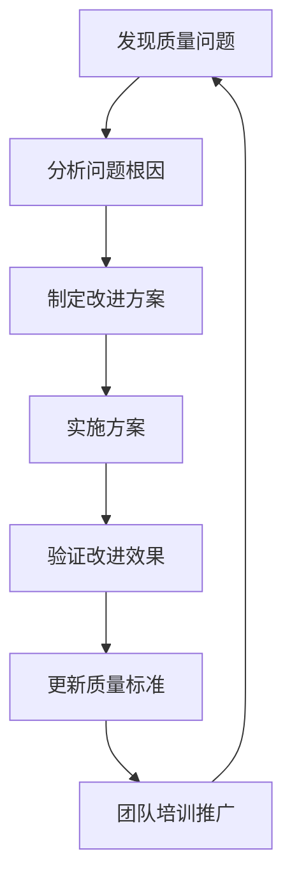

# IOE-DREAM 质量保障机制使用指南

> **版本**: v1.0.0
> **更新日期**: 2025-01-30
> **制定人**: IOE-DREAM架构委员会
> **适用范围**: 所有开发人员

---

## 🎯 概述

IOE-DREAM质量保障机制是一套完整的企业级代码质量管理体系，确保代码在开发、提交、构建、部署全流程中符合企业级标准。

### 核心理念

- **预防为主**: 在问题进入代码库之前就发现并阻止
- **自动化驱动**: 通过自动化工具减少人为疏漏
- **持续改进**: 根据质量数据持续优化标准
- **团队协作**: 建立统一的代码质量文化

---

## 🏗️ 质量保障架构

### 三道防线

```
开发阶段 ────► 提交阶段 ────► CI/CD阶段 ────► 部署阶段
     │            │            │            │
     ▼            ▼            ▼            ▼
IDE插件检查   Pre-commit    质量门禁      生产验证
             Hook检查     自动检查      监控告警
```

### 质量检查层次

| 层次 | 检查时机 | 检查内容 | 失败处理 |
|------|----------|----------|----------|
| **L1** | 开发时 | IDE插件、实时检查 | 开发者立即修复 |
| **L2** | 提交前 | Pre-commit Hook | 阻止提交，显示修复建议 |
| **L3** | CI/CD | 质量门禁检查 | 阻止合并，PR评论 |
| **L4** | 部署后 | 生产监控 | 告警通知，回滚机制 |

---

## 🛠️ 质量检查工具

### 1. 质量门禁检查脚本

**文件位置**: `scripts/quality-gate-check.sh`

**功能**: 全面的质量检查，包含5个核心检查项

```bash
# 运行模式
bash scripts/quality-gate-check.sh check     # 检查模式，仅输出结果
bash scripts/quality-gate-check.sh enforce   # 强制模式，失败时退出1

# 检查内容
1. 架构合规性检查 - @Autowired/@Repository违规、四层架构
2. 技术栈版本一致性检查 - Spring Boot、Java、数据库版本
3. 代码质量标准检查 - Entity文件大小、SLF4J规范
4. 依赖结构检查 - 循环依赖、非法依赖
5. 编译通过检查 - Maven编译验证
```

**输出格式**:
- 控制台: 彩色输出，清晰显示检查结果
- JSON报告: `quality-gate-report-YYYYMMDD_HHMMSS.json`
- 详细报告: 架构合规性报告、技术栈验证报告

### 2. Git Pre-commit Hook

**文件位置**: `.git/hooks/pre-commit`

**功能**: 提交前快速检查，防止低质量代码进入仓库

```bash
# 自动触发条件
git commit  # 自动执行pre-commit检查

# 检查内容（轻量级）
1. SLF4J日志规范检查
2. @Autowired/@Repository违规检查
3. 明文密码检查
4. 大文件检查（5MB限制）
5. Java语法快速检查
```

**使用方式**:
```bash
# 正常提交（自动检查）
git add .
git commit -m "feat: 添加新功能"

# 跳过检查（不推荐）
git commit --no-verify -m "feat: 添加新功能"
```

### 3. CI/CD 质量门禁

**文件位置**: `.github/workflows/quality-gate.yml`

**功能**: GitHub Actions自动化质量检查

**触发条件**:
- 推送到main/develop分支
- 创建Pull Request
- 手动触发（可选择模式）

**工作流程**:
```yaml
质量检查 → 结果分析 → 报告上传 → PR评论 → 质量决策
    ↓         ↓         ↓         ↓         ↓
  5项检查   JSON解析   Artifacts  自动评论  通过/失败
```

---

## 📊 质量检查标准

### 架构合规性标准

| 检查项 | 标准 | 违规后果 |
|--------|------|----------|
| @Autowired使用 | 禁止，必须使用@Resource | 阻止提交 |
| @Repository使用 | 禁止，DAO接口使用@Mapper | 阻止提交 |
| Repository命名 | 禁止*Repository.java | 阻止提交 |
| Manager类Spring注解 | 禁止，应为纯Java类 | 阻止提交 |
| 跨层访问 | 禁止Controller直接调用DAO | 阻止提交 |

### 代码质量标准

| 检查项 | 标准 | 处理方式 |
|--------|------|----------|
| Entity文件行数 | ≤400行（推荐≤200行） | 超过时警告 |
| SLF4J使用 | 强制使用@Slf4j注解 | 违规时阻止 |
| 明文密码 | 禁止，必须加密 | 阻止提交 |
| 文件大小 | 单文件≤5MB | 超过时阻止 |
| 编译通过 | 必须编译成功 | 失败时阻止 |

### 技术栈标准

| 组件 | 标准版本 | 检查方式 |
|------|----------|----------|
| Java | 17.0.9 | pom.xml检查 |
| Spring Boot | 3.5.8 | 版本一致性检查 |
| Spring Cloud | 2025.0.0 | 版本一致性检查 |
| MySQL | 8.0.35 | 版本一致性检查 |
| MyBatis-Plus | 3.5.15 | 版本一致性检查 |

---

## 🔧 本地使用指南

### 1. 开发环境配置

#### IDE插件推荐
```bash
# IntelliJ IDEA插件
- Lombok Plugin
- MyBatis Plugin
- SonarLint
- CheckStyle-IDEA

# VS Code插件
- Extension Pack for Java
- SonarLint
- Checkstyle for Java
```

#### 本地工具安装
```bash
# 必需工具
- Java 17+
- Maven 3.8+
- Git 2.30+

# 可选工具（提升体验）
- jq (JSON处理)
- ripgrep (快速搜索)
- shellcheck (Shell脚本检查)
```

### 2. 日常开发流程

#### 提交前检查流程
```bash
# 1. 代码开发完成
# 2. 运行完整质量检查
bash scripts/quality-gate-check.sh check

# 3. 修复发现的问题
# 4. 添加文件到暂存区
git add .

# 5. 提交（自动触发pre-commit检查）
git commit -m "feat: 添加用户管理功能"

# 6. 推送（触发CI/CD检查）
git push origin feature/user-management
```

#### 质量检查命令
```bash
# 快速检查（仅当前修改）
bash scripts/quality-gate-check.sh check

# 强制检查（失败时退出）
bash scripts/quality-gate-check.sh enforce

# 仅架构检查
bash scripts/architecture-compliance-check.sh

# 仅技术栈检查
bash scripts/tech-stack-validation.sh

# 生成详细报告
bash scripts/quality-gate-check.sh check > quality-report.txt 2>&1
```

### 3. 问题修复指南

#### 常见问题及修复方法

**问题1: @Autowired违规**
```java
// ❌ 错误
@Autowired
private UserService userService;

// ✅ 正确
@Resource
private UserService userService;
```

**问题2: @Repository违规**
```java
// ❌ 错误
@Repository
public interface UserDao extends BaseMapper<UserEntity> {}

// ✅ 正确
@Mapper
public interface UserDao extends BaseMapper<UserEntity> {}
```

**问题3: SLF4J违规**
```java
// ❌ 错误
import org.slf4j.LoggerFactory;
private static final Logger log = LoggerFactory.getLogger(UserService.class);

// ✅ 正确
import lombok.extern.slf4j.Slf4j;
@Slf4j
public class UserService {
    // 直接使用log
}
```

**问题4: Entity文件过大**
```bash
# 检查超大Entity文件
find microservices -name "*Entity.java" -exec wc -l {} \; | sort -nr | head -10

# 参考拆分指南
cat documentation/technical/LARGE_ENTITY_ANALYSIS_AND_SPLIT_GUIDE.md
```

**问题5: 技术栈版本不一致**
```bash
# 运行技术栈检查
bash scripts/tech-stack-validation.sh

# 查看详细报告
cat tech-stack-validation-report-*.md
```

---

## 🚀 CI/CD集成指南

### 1. GitHub Actions配置

#### 启用质量门禁
```yaml
# .github/workflows/quality-gate.yml 已自动配置
# 无需额外配置，推送到GitHub即可启用
```

#### 手动触发质量检查
```bash
# 通过GitHub界面手动触发
1. 进入Actions页面
2. 选择"质量门禁检查"
3. 点击"Run workflow"
4. 选择gate_mode（check/enforce）
5. 点击"Run workflow"
```

#### 质量报告查看
```bash
# GitHub界面查看
1. Actions → 质量门禁检查 → 具体运行
2. 查看Summary部分的质量检查结果
3. 下载Artifacts中的详细报告

# 本地查看报告
ls quality-gate-report-*.json
cat quality-gate-report-*.json | jq '.summary'
```

### 2. PR质量检查

#### 自动PR评论
质量检查会自动在PR中添加评论，包含：
- 整体检查状态
- 各项检查结果
- 修复建议
- 合并建议

#### 质量门禁状态
```yaml
质量门禁状态影响PR合并：

✅ PASS: 所有检查通过，可以合并
⚠️ PASS_WITH_WARNINGS: 检查通过但有警告，建议修复
❌ FAIL: 检查失败，禁止合并
```

### 3. 质量趋势分析

#### 质量数据收集
```bash
# 历史质量报告
quality-gate-report-*.json

# 关键指标
- 架构违规数量趋势
- 技术栈合规性评分
- 代码质量改进情况
- 编译成功率
```

#### 质量改进建议
```bash
# 定期分析质量数据
1. 每周质量报告分析
2. 月度质量趋势总结
3. 季度质量目标制定
4. 年度质量评估回顾
```

---

## 📈 质量度量指标

### 核心指标

| 指标类别 | 指标名称 | 目标值 | 计算方式 |
|----------|----------|--------|----------|
| **架构合规** | @Autowired违规率 | 0% | 违规数/总检查文件数 |
| **架构合规** | @Repository违规率 | 0% | 违规数/总检查文件数 |
| **代码质量** | 超大Entity文件数 | 0个 | wc -l > 400的Entity数量 |
| **代码质量** | SLF4J规范合规率 | 100% | 使用@Slf4j的文件数/总Java文件数 |
| **技术栈** | 版本一致性评分 | ≥95分 | 技术栈验证脚本评分 |
| **构建质量** | 编译成功率 | 100% | 编译成功次数/总编译次数 |
| **安全质量** | 明文密码违规数 | 0个 | grep检查发现的明文密码数量 |

### 质量等级

| 等级 | 评分范围 | 状态 | 措施 |
|------|----------|------|------|
| **优秀** | 95-100分 | 🟢 绿色 | 保持标准 |
| **良好** | 85-94分 | 🟡 黄色 | 持续改进 |
| **一般** | 70-84分 | 🟠 橙色 | 需要改进 |
| **需改进** | <70分 | 🔴 红色 | 立即修复 |

---

## 🔍 故障排除

### 常见问题

#### 问题1: Pre-commit Hook不执行
```bash
# 检查Hook文件权限
ls -la .git/hooks/pre-commit

# 重新设置权限
chmod +x .git/hooks/pre-commit

# 检查Git版本
git --version
```

#### 问题2: 质量检查脚本执行失败
```bash
# 检查脚本权限
chmod +x scripts/*.sh

# 检查依赖工具
which jq
which mvn
which java

# 调试模式执行
bash -x scripts/quality-gate-check.sh check
```

#### 问题3: CI/CD检查失败
```bash
# 查看Actions日志
GitHub → Repository → Actions → 具体运行 → 日志

# 本地复现问题
bash scripts/quality-gate-check.sh enforce

# 检查环境变量
echo $JAVA_HOME
echo $MAVEN_HOME
```

#### 问题4: JSON报告解析失败
```bash
# 检查jq工具
jq --version

# 验证JSON格式
cat quality-gate-report-*.json | jq '.'

# 手动解析关键信息
cat quality-gate-report-*.json | jq '.summary'
```

### 性能优化

#### 大型项目优化
```bash
# 限制检查范围
export CHECK_SCOPE="modified"  # 只检查修改的文件

# 并行检查
export PARALLEL_CHECKS=true

# 缓存检查结果
export ENABLE_CACHE=true
```

#### 网络优化
```bash
# 使用镜像源
export MAVEN_MIRROR=true

# 缓存依赖
export MAVEN_OPTS="-Xmx2048m -XX:+UseG1GC"
```

---

## 📚 相关文档

### 核心规范文档
- [CLAUDE.md](../CLAUDE.md) - 企业级架构规范
- [架构合规性报告](architecture-compliance-report.md)
- [技术栈验证报告](tech-stack-validation-report-*.md)

### 专项指南
- [Entity拆分指南](LARGE_ENTITY_ANALYSIS_AND_SPLIT_GUIDE.md)
- [日志规范标准](LOGGING_PATTERN_COMPLETE_STANDARD.md)
- [依赖结构优化](MODULE_DEPENDENCY_REFACTORING_GUIDE.md)

### 工具文档
- [质量门禁脚本使用](scripts/quality-gate-check.sh)
- [架构合规性检查](scripts/architecture-compliance-check.sh)
- [技术栈验证工具](scripts/tech-stack-validation.sh)

---

## 🤝 团队协作

### 代码审查清单

**提交前自查**:
- [ ] 运行本地质量检查通过
- [ ] 修复所有架构违规
- [ ] 确保技术栈版本一致
- [ ] 验证编译成功
- [ ] 检查无明文密码

**代码审查重点**:
- [ ] 架构设计合理性
- [ ] 代码规范性检查
- [ ] 性能影响评估
- [ ] 安全性考虑
- [ ] 测试覆盖率

### 质量改进流程



### 持续改进机制

**定期会议**:
- 每周: 质量问题复盘会
- 每月: 质量趋势分析会
- 每季: 质量标准评审会
- 每年: 质量体系评估会

**持续优化**:
- 根据质量数据调整检查标准
- 优化工具性能和体验
- 更新最佳实践指南
- 加强团队质量意识培训

---

## 📞 技术支持

### 联系方式

**质量保障团队**:
- **架构委员会**: 负责质量标准制定和评审
- **DevOps团队**: 负责CI/CD工具维护
- **开发团队**: 负责代码质量改进

**问题反馈**:
- GitHub Issues: 提交工具问题和改进建议
- 内部IM群组: 日常问题讨论和技术支持
- 邮件支持: 质量问题紧急处理

### 培训资源

**新手培训**:
- IOE-DREAM架构规范培训
- 质量保障工具使用培训
- 代码审查最佳实践培训

**进阶培训**:
- 高级代码质量技术
- 性能优化专项培训
- 安全编码实践培训

---

**📋 本指南维护**:
- **版本**: v1.0.0
- **更新频率**: 季度更新或重大变更时更新
- **责任人**: IOE-DREAM架构委员会
- **最后更新**: 2025-01-30

**🎯 质量目标**: 通过本机制，确保IOE-DREAM项目始终保持企业级代码质量标准，为用户提供稳定、安全、高性能的服务。