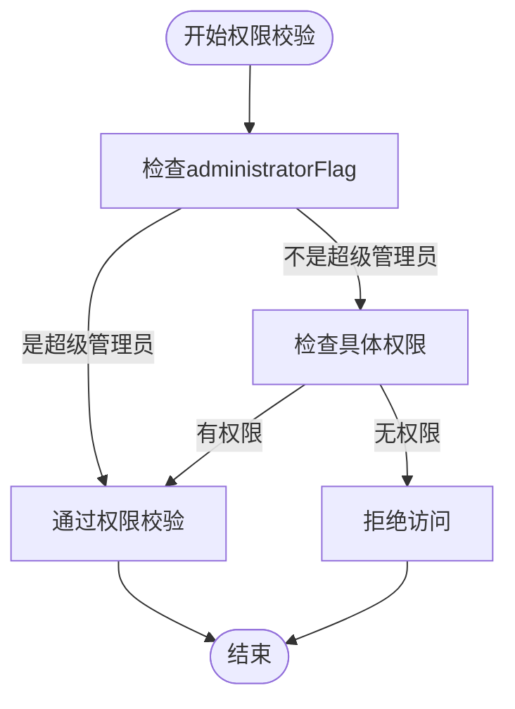
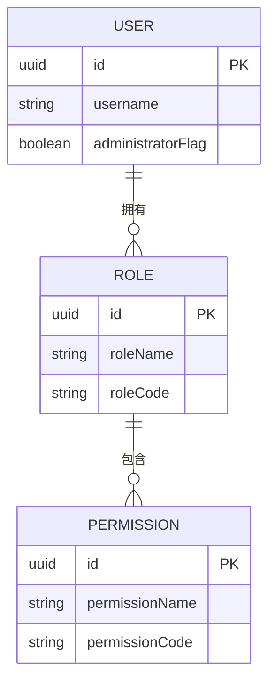
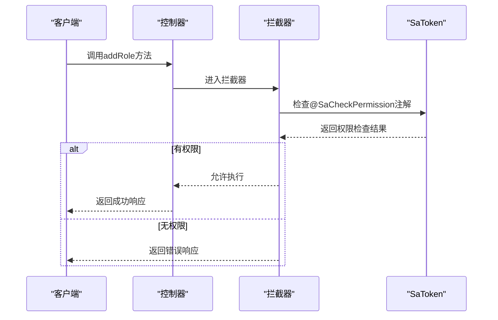
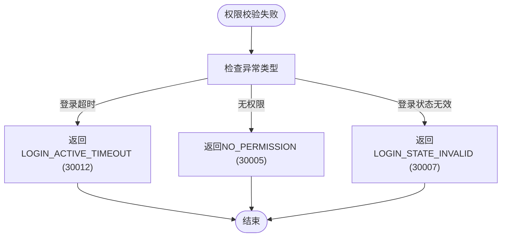

# RBAC模型实现

<cite>
**本文档引用的文件**  
- [AdminInterceptor.java](file://smart-admin-api-java17-springboot3/sa-admin/src/main/java/net/lab1024/sa/admin/interceptor/AdminInterceptor.java)
- [RequestEmployee.java](file://smart-admin-api-java17-springboot3/sa-admin/src/main/java/net/lab1024/sa/admin/module/system/login/domain/RequestEmployee.java)
- [EmployeeEntity.java](file://smart-admin-api-java17-springboot3/sa-admin/src/main/java/net/lab1024/sa/admin/module/system/employee/domain/entity/EmployeeEntity.java)
- [EmployeeVO.java](file://smart-admin-api-java17-springboot3/sa-admin/src/main/java/net/lab1024/sa/admin/module/system/employee/domain/vo/EmployeeVO.java)
- [RoleController.java](file://smart-admin-api-java17-springboot3/sa-admin/src/main/java/net/lab1024/sa/admin/module/system/role/controller/RoleController.java)
- [UserErrorCode.java](file://smart-admin-api-java17-springboot3/sa-base/src/main/java/net/lab1024/sa/base/common/code/UserErrorCode.java)
- [GlobalExceptionHandler.java](file://smart-admin-api-java17-springboot3/sa-base/src/main/java/net/lab1024/sa/base/handler/GlobalExceptionHandler.java)
- [SmartOperationCustomizer.java](file://smart-admin-api-java17-springboot3/sa-base/src/main/java/net/lab1024/sa/base/common/swagger/SmartOperationCustomizer.java)
</cite>

## 目录
1. [引言](#引言)
2. [超级管理员权限的特殊处理机制](#超级管理员权限的特殊处理机制)
3. [角色与权限的关联机制](#角色与权限的关联机制)
4. [SaToken注解体系的权限控制实现](#satoken注解体系的权限控制实现)
5. [权限校验失败的处理流程](#权限校验失败的处理流程)
6. [业务方法中权限注解的使用示例](#业务方法中权限注解的使用示例)
7. [自定义权限策略的扩展方法](#自定义权限策略的扩展方法)
8. [结论](#结论)

## 引言

本项目实现了基于角色的访问控制（RBAC）模型，通过SaToken框架提供了一套完整的权限管理体系。系统通过`RequestEmployee`对象中的`administratorFlag`字段来标识超级管理员，实现了超级管理员可绕过所有权限校验的特殊处理机制。同时，系统利用SaToken的注解体系（如`SaIgnore`）实现了方法级别的权限控制，确保了系统的安全性和灵活性。

**文档来源**
- [AdminInterceptor.java](file://smart-admin-api-java17-springboot3/sa-admin/src/main/java/net/lab1024/sa/admin/interceptor/AdminInterceptor.java)
- [RequestEmployee.java](file://smart-admin-api-java17-springboot3/sa-admin/src/main/java/net/lab1024/sa/admin/module/system/login/domain/RequestEmployee.java)

## 超级管理员权限的特殊处理机制

在本系统中，超级管理员拥有最高权限，可以绕过所有权限校验。这一机制通过`RequestEmployee`对象中的`administratorFlag`字段实现。当用户登录时，系统会根据用户信息设置`administratorFlag`字段，标识该用户是否为超级管理员。

在权限校验过程中，系统首先检查`administratorFlag`字段。如果该字段为`true`，则直接通过权限校验，无需进行后续的权限检查。这种设计确保了超级管理员可以访问系统中的所有功能，而不会受到任何权限限制。



**图示来源**
- [AdminInterceptor.java](file://smart-admin-api-java17-springboot3/sa-admin/src/main/java/net/lab1024/sa/admin/interceptor/AdminInterceptor.java#L91-L94)
- [RequestEmployee.java](file://smart-admin-api-java17-springboot3/sa-admin/src/main/java/net/lab1024/sa/admin/module/system/login/domain/RequestEmployee.java#L59-L60)

## 角色与权限的关联机制

系统通过角色与权限的关联机制来实现细粒度的权限控制。每个角色可以关联多个权限，而每个用户可以被分配一个或多个角色。这种设计使得权限管理更加灵活和可扩展。

在数据库层面，系统通过`role`表和`permission`表来存储角色和权限信息，并通过`role_permission`表来建立角色与权限之间的多对多关系。在代码层面，系统通过`RoleService`和`PermissionService`来管理角色和权限的增删改查操作。



**图示来源**
- [RoleService.java](file://smart-admin-api-java17-springboot3/sa-admin/src/main/java/net/lab1024/sa/admin/module/system/role/service/RoleService.java)
- [EmployeeEntity.java](file://smart-admin-api-java17-springboot3/sa-admin/src/main/java/net/lab1024/sa/admin/module/system/employee/domain/entity/EmployeeEntity.java#L79)

## SaToken注解体系的权限控制实现

系统利用SaToken框架的注解体系实现了方法级别的权限控制。主要使用的注解包括`@SaCheckPermission`、`@SaCheckRole`和`@SaIgnore`。

- `@SaCheckPermission`：用于检查用户是否具有指定的权限。
- `@SaCheckRole`：用于检查用户是否具有指定的角色。
- `@SaIgnore`：用于忽略权限校验，通常用于登录、注册等公共接口。

在控制器方法上使用这些注解，可以轻松实现权限控制。例如，在`RoleController`中，`addRole`方法使用了`@SaCheckPermission("system:role:add")`注解，确保只有具有`system:role:add`权限的用户才能调用该方法。



**图示来源**
- [RoleController.java](file://smart-admin-api-java17-springboot3/sa-admin/src/main/java/net/lab1024/sa/admin/module/system/role/controller/RoleController.java#L36)
- [SmartOperationCustomizer.java](file://smart-admin-api-java17-springboot3/sa-base/src/main/java/net/lab1024/sa/base/common/swagger/SmartOperationCustomizer.java)

## 权限校验失败的处理流程

当权限校验失败时，系统会根据不同的异常类型返回相应的错误码。主要的异常类型包括登录超时、无权限等。

- **登录超时**：当用户的登录状态过期时，系统会返回`LOGIN_ACTIVE_TIMEOUT`错误码（30012），提示用户需要重新登录。
- **无权限**：当用户尝试访问没有权限的资源时，系统会返回`NO_PERMISSION`错误码（30005），提示用户没有权限访问此内容。
- **登录状态无效**：当用户的登录状态无效时，系统会返回`LOGIN_STATE_INVALID`错误码（30007），提示用户需要重新登录。

这些错误码定义在`UserErrorCode`枚举中，确保了错误信息的一致性和可维护性。



**图示来源**
- [UserErrorCode.java](file://smart-admin-api-java17-springboot3/sa-base/src/main/java/net/lab1024/sa/base/common/code/UserErrorCode.java)
- [GlobalExceptionHandler.java](file://smart-admin-api-java17-springboot3/sa-base/src/main/java/net/lab1024/sa/base/handler/GlobalExceptionHandler.java#L84-L89)

## 业务方法中权限注解的使用示例

在实际的业务方法中，权限注解的使用非常简单。以下是一个具体的示例：

```java
@RestController
@Tag(name = AdminSwaggerTagConst.System.SYSTEM_ROLE)
public class RoleController {

    @Resource
    private RoleService roleService;

    @Operation(summary = "添加角色 @author 卓大")
    @PostMapping("/role/add")
    @SaCheckPermission("system:role:add")
    public ResponseDTO<String> addRole(@Valid @RequestBody RoleAddForm roleAddForm) {
        return roleService.addRole(roleAddForm);
    }

    @Operation(summary = "删除角色 @author 卓大")
    @GetMapping("/role/delete/{roleId}")
    @SaCheckPermission("system:role:delete")
    public ResponseDTO<String> deleteRole(@PathVariable Long roleId) {
        return roleService.deleteRole(roleId);
    }
}
```

在这个示例中，`addRole`方法和`deleteRole`方法都使用了`@SaCheckPermission`注解，确保只有具有相应权限的用户才能调用这些方法。这种设计使得权限控制非常直观和易于维护。

**代码来源**
- [RoleController.java](file://smart-admin-api-java17-springboot3/sa-admin/src/main/java/net/lab1024/sa/admin/module/system/role/controller/RoleController.java)

## 自定义权限策略的扩展方法

除了使用SaToken提供的标准注解外，系统还支持自定义权限策略的扩展。通过实现`SaTokenConfig`接口，可以自定义权限校验逻辑。例如，可以实现基于IP地址、时间范围等条件的权限控制。

此外，系统还提供了`@SaIgnore`注解，用于忽略特定方法的权限校验。这对于一些公共接口（如登录、注册）非常有用，确保这些接口可以被所有用户访问。

```java
@Configuration
public class TokenConfig {

    @Resource
    private Level3ProtectConfigService level3ProtectConfigService;

    @Resource
    public void configSaToken(SaTokenConfig config) {
        config.setActiveTimeout(level3ProtectConfigService.getLoginActiveTimeoutSeconds());
    }
}
```

通过这种方式，系统可以灵活地扩展权限控制策略，满足不同的业务需求。

**代码来源**
- [TokenConfig.java](file://smart-admin-api-java17-springboot3/sa-base/src/main/java/net/lab1024/sa/base/config/TokenConfig.java)

## 结论

本系统通过基于角色的访问控制（RBAC）模型，结合SaToken框架的注解体系，实现了一套完整且灵活的权限管理体系。超级管理员的特殊处理机制确保了系统管理的便利性，而细粒度的权限控制则保障了系统的安全性。通过自定义权限策略的扩展，系统能够适应不断变化的业务需求，为用户提供了一个安全、可靠的应用环境。