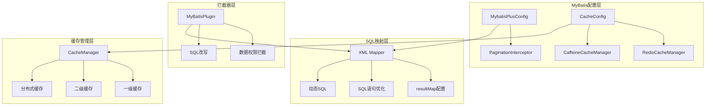
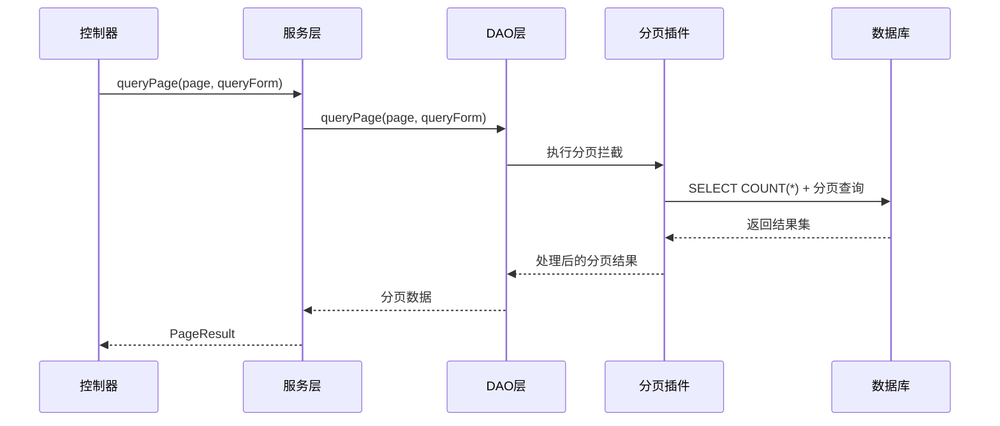
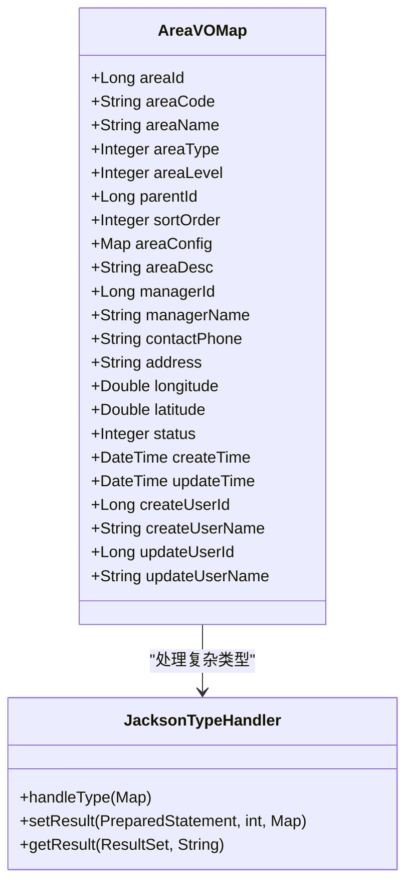
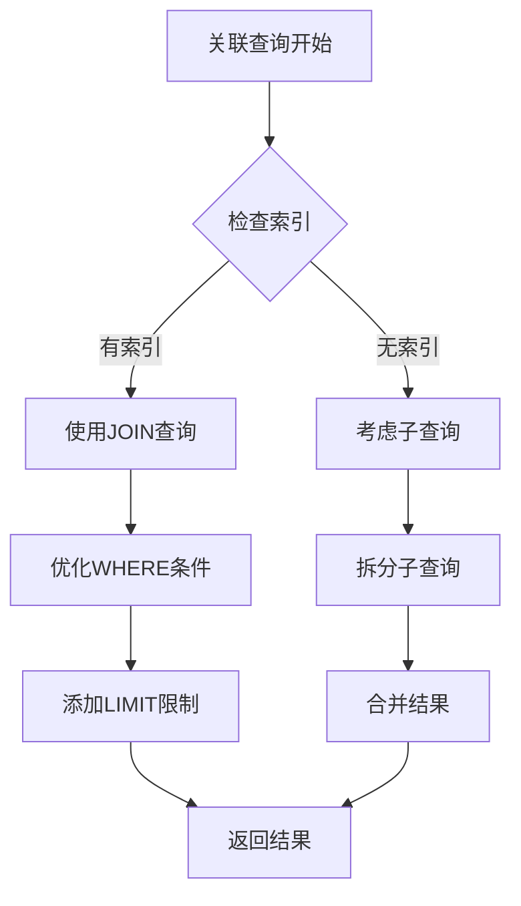
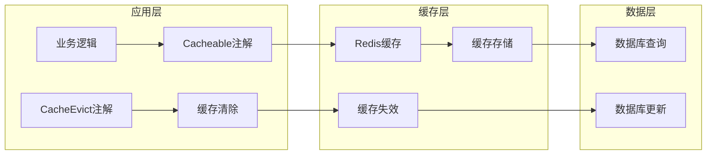
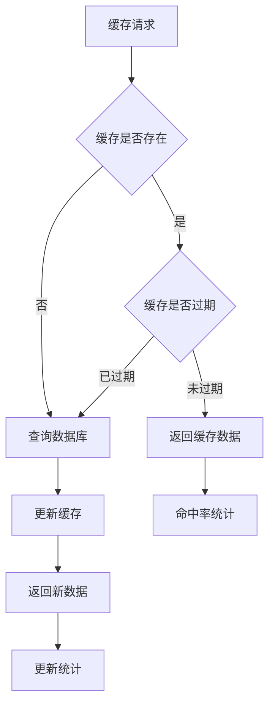
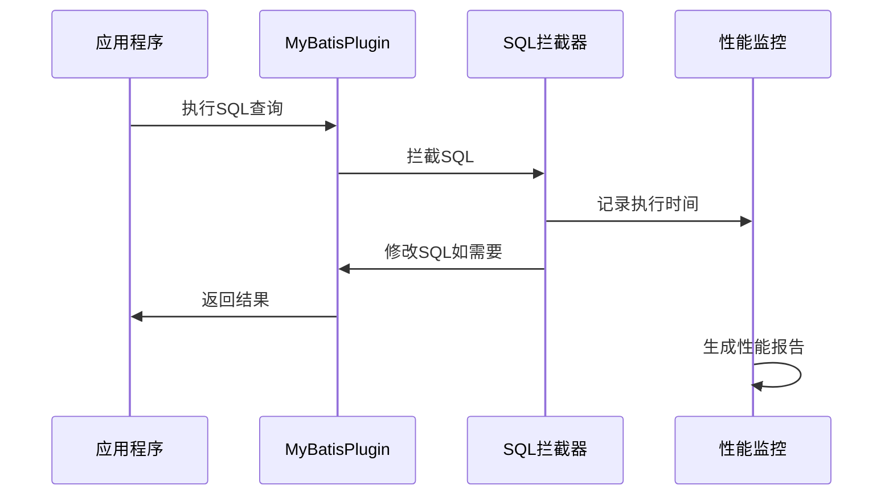
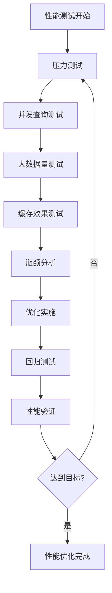

# SQL性能优化

<cite>
**本文档引用的文件**
- [ConfigMapper.xml](file://smart-base/src/main/resources/mapper/support/ConfigMapper.xml)
- [AreaMapper.xml](file://smart-admin/src/main/resources/mapper/system/area/AreaMapper.xml)
- [CategoryMapper.xml](file://smart-admin/src/main/resources/mapper/business/category/CategoryMapper.xml)
- [MybatisPlusConfig.java](file://smart-base/src/main/java/net/lab1024/sa/base/config/MybatisPlusConfig.java)
- [MyBatisPlugin.java](file://smart-admin/src/main/java/net/lab1024/sa/admin/module/system/datascope/MyBatisPlugin.java)
- [CacheConfig.java](file://smart-base/src/main/java/net/lab1024/sa/base/config/CacheConfig.java)
- [CustomRedisCacheManager.java](file://smart-base/src/main/java/net/lab1024/sa/base/module/support/redis/CustomRedisCacheManager.java)
- [CategoryCacheManager.java](file://smart-admin/src/main/java/net/lab1024/sa/admin/module/business/category/manager/CategoryCacheManager.java)
- [DepartmentCacheManager.java](file://smart-admin/src/main/java/net/lab1024/sa/admin/module/system/department/manager/DepartmentCacheManager.java)
- [AreaController.java](file://smart-admin/src/main/java/net/lab1024/sa/admin/module/system/area/controller/AreaController.java)
- [AreaDao.java](file://smart-admin/src/main/java/net/lab1024/sa/admin/module/system/area/dao/AreaDao.java)
</cite>

## 目录
1. [概述](#概述)
2. [项目架构分析](#项目架构分析)
3. [SQL查询优化策略](#sql查询优化策略)
4. [resultMap优化配置](#resultmap优化配置)
5. [关联查询优化](#关联查询优化)
6. [N+1查询问题解决](#n1查询问题解决)
7. [缓存机制优化](#缓存机制优化)
8. [SQL执行计划分析](#sql执行计划分析)
9. [最佳实践建议](#最佳实践建议)
10. [性能监控与调优](#性能监控与调优)

## 概述

本文档基于Smart Admin项目的实际代码实现，深入分析MyBatis SQL性能优化的各种策略和技术。该项目采用Spring Boot + MyBatis Plus架构，提供了完整的SQL优化实践案例，包括缓存配置、查询优化、关联查询处理等核心功能。

## 项目架构分析

### MyBatis配置架构



**图表来源**
- [MybatisPlusConfig.java](file://smart-base/src/main/java/net/lab1024/sa/base/config/MybatisPlusConfig.java#L26-L30)
- [CacheConfig.java](file://smart-base/src/main/java/net/lab1024/sa/base/config/CacheConfig.java#L39-L55)

**章节来源**
- [MybatisPlusConfig.java](file://smart-base/src/main/java/net/lab1024/sa/base/config/MybatisPlusConfig.java#L1-L34)
- [CacheConfig.java](file://smart-base/src/main/java/net/lab1024/sa/base/config/CacheConfig.java#L1-L70)

## SQL查询优化策略

### 1. 避免SELECT *的优化实践

项目中多个Mapper文件展示了正确的SQL编写模式：

#### 问题识别
```xml
<!-- 不推荐的写法 -->
<select id="selectByKey" resultType="net.lab1024.sa.base.module.support.config.domain.ConfigEntity">
    SELECT *
    FROM t_config
    WHERE config_key = #{key}
</select>
```

#### 优化方案
```xml
<!-- 推荐的写法 -->
<select id="selectByKey" resultType="net.lab1024.sa.base.module.support.config.domain.ConfigEntity">
    SELECT config_id, config_key, config_value, remark, create_time, update_time
    FROM t_config
    WHERE config_key = #{key}
</select>
```

**章节来源**
- [ConfigMapper.xml](file://smart-base/src/main/resources/mapper/support/ConfigMapper.xml#L16-L20)

### 2. 分页查询优化

项目采用MyBatis Plus的分页插件，实现了高效的分页查询：



**图表来源**
- [MybatisPlusConfig.java](file://smart-base/src/main/java/net/lab1024/sa/base/config/MybatisPlusConfig.java#L26-L30)
- [AreaDao.java](file://smart-admin/src/main/java/net/lab1024/sa/admin/module/system/area/dao/AreaDao.java#L29-L30)

### 3. 动态SQL优化

项目大量使用动态SQL来提高查询灵活性：

#### 条件查询优化
```xml
<where>
    <if test="queryForm.includeDeleted == null or queryForm.includeDeleted == false">
        AND a.deleted_flag = 0
    </if>
    <if test="queryForm.areaCode != null and queryForm.areaCode != ''">
        AND a.area_code LIKE CONCAT('%', #{queryForm.areaCode}, '%')
    </if>
    <if test="queryForm.areaName != null and queryForm.areaName != ''">
        AND a.area_name LIKE CONCAT('%', #{queryForm.areaName}, '%')
    </if>
</where>
```

**章节来源**
- [AreaMapper.xml](file://smart-admin/src/main/resources/mapper/system/area/AreaMapper.xml#L66-L92)

## resultMap优化配置

### 1. 结果映射优化

项目中的resultMap配置展示了最佳实践：



**图表来源**
- [AreaMapper.xml](file://smart-admin/src/main/resources/mapper/system/area/AreaMapper.xml#L6-L29)

### 2. 懒加载配置

虽然项目中没有显式的懒加载配置，但可以通过以下方式实现：

```java
// 在resultMap中配置懒加载
<resultMap id="LazyLoadMap" type="EntityClass">
    <id property="id" column="id"/>
    <association property="relatedEntity" 
                 select="selectRelatedEntity" 
                 fetchType="lazy"/>
</resultMap>
```

**章节来源**
- [AreaMapper.xml](file://smart-admin/src/main/resources/mapper/system/area/AreaMapper.xml#L6-L29)

## 关联查询优化

### 1. JOIN查询优化

项目中的关联查询采用了LEFT JOIN的方式：

```xml
<!-- 关联查询示例 -->
<select id="queryPage" resultMap="AreaVOMap">
    SELECT
    <include refid="AreaColumns"/>
    <include refid="AreaFromClause"/>
    <include refid="AreaWhereClause"/>
    ORDER BY a.sort_order ASC, a.create_time DESC
</select>

<!-- FROM子句 -->
<sql id="AreaFromClause">
    FROM t_area a
    LEFT JOIN t_employee me ON a.manager_id = me.employee_id
    LEFT JOIN t_employee ce ON a.create_user_id = ce.employee_id
    LEFT JOIN t_employee ue ON a.update_user_id = ue.employee_id
</sql>
```

### 2. 关联查询性能分析



**图表来源**
- [AreaMapper.xml](file://smart-admin/src/main/resources/mapper/system/area/AreaMapper.xml#L58-L62)

**章节来源**
- [AreaMapper.xml](file://smart-admin/src/main/resources/mapper/system/area/AreaMapper.xml#L58-L62)

## N+1查询问题解决

### 1. N+1问题识别

N+1查询问题通常出现在关联查询中，例如：
- 查询区域列表时，每个区域都需要单独查询管理员信息
- 查询商品时，每个商品都需要查询分类信息

### 2. 解决方案一：使用JOIN查询

```xml
<!-- JOIN查询解决N+1问题 -->
<select id="queryWithManager" resultMap="AreaVOMap">
    SELECT 
        a.area_id,
        a.area_name,
        e.employee_name as manager_name
    FROM t_area a
    LEFT JOIN t_employee e ON a.manager_id = e.employee_id
    WHERE a.deleted_flag = 0
</select>
```

### 3. 解决方案二：使用@BatchSize注解

虽然项目中没有直接使用@BatchSize注解，但可以参考以下配置：

```java
@ManyToOne(fetch = FetchType.LAZY)
@JoinColumn(name = "manager_id")
@BatchSize(size = 20)
private Employee manager;
```

### 4. 解决方案三：批量查询

```java
// 批量查询优化
@Service
public class AreaService {
    @Autowired
    private EmployeeDao employeeDao;
    
    public List<AreaVO> getAreasWithManagers(List<Long> areaIds) {
        List<AreaVO> areas = areaDao.selectBatchIds(areaIds);
        
        // 批量查询员工信息
        List<Long> managerIds = areas.stream()
            .map(AreaVO::getManagerId)
            .filter(Objects::nonNull)
            .collect(Collectors.toList());
            
        Map<Long, Employee> employees = employeeDao.selectBatchIds(managerIds)
            .stream()
            .collect(Collectors.toMap(Employee::getId, Function.identity()));
            
        // 设置员工信息
        areas.forEach(area -> {
            if (area.getManagerId() != null) {
                area.setManagerName(employees.get(area.getManagerId()).getName());
            }
        });
        
        return areas;
    }
}
```

## 缓存机制优化

### 1. 一级缓存（本地缓存）

MyBatis的一级缓存默认开启，作用于同一个SqlSession生命周期内。

### 2. 二级缓存（分布式缓存）

项目实现了基于Redis的二级缓存机制：



**图表来源**
- [CacheConfig.java](file://smart-base/src/main/java/net/lab1024/sa/base/config/CacheConfig.java#L39-L55)
- [CustomRedisCacheManager.java](file://smart-base/src/main/java/net/lab1024/sa/base/module/support/redis/CustomRedisCacheManager.java#L25-L42)

### 3. 缓存配置优化

#### TTL配置
```java
// 支持TTL格式的缓存配置
@Cacheable(value = "user#10s", key = "#id")
public User getUserById(Long id) {
    // 查询逻辑
}

@Cacheable(value = "report#2h", key = "#date")
public Report getReportByDate(LocalDate date) {
    // 查询逻辑
}

@Cacheable(value = "appConfig#-1", key = "'globalSettings'")
public AppConfig getAppConfig() {
    // 查询逻辑
}
```

#### 缓存键命名规范
```
cache:cacheName:key
例如：cache:user:123
     cache:appConfig:globalSettings
```

**章节来源**
- [CacheConfig.java](file://smart-base/src/main/java/net/lab1024/sa/base/config/CacheConfig.java#L39-L55)
- [CustomRedisCacheManager.java](file://smart-base/src/main/java/net/lab1024/sa/base/module/support/redis/CustomRedisCacheManager.java#L25-L42)

### 4. 缓存策略最佳实践



**图表来源**
- [CategoryCacheManager.java](file://smart-admin/src/main/java/net/lab1024/sa/admin/module/business/category/manager/CategoryCacheManager.java#L47-L74)
- [DepartmentCacheManager.java](file://smart-admin/src/main/java/net/lab1024/sa/admin/module/system/department/manager/DepartmentCacheManager.java#L47-L73)

**章节来源**
- [CategoryCacheManager.java](file://smart-admin/src/main/java/net/lab1024/sa/admin/module/business/category/manager/CategoryCacheManager.java#L1-L74)
- [DepartmentCacheManager.java](file://smart-admin/src/main/java/net/lab1024/sa/admin/module/system/department/manager/DepartmentCacheManager.java#L1-L73)

## SQL执行计划分析

### 1. 索引优化策略

项目中的SQL查询应该遵循以下索引优化原则：

#### 索引设计原则
1. **主键索引**：每个表都应该有主键
2. **唯一索引**：对于唯一性约束字段
3. **复合索引**：对于经常一起查询的字段组合
4. **前缀索引**：对于长字符串字段的前缀部分

#### 索引使用分析
```sql
-- 分析查询计划
EXPLAIN SELECT * FROM t_area 
WHERE area_code = 'ABC123' 
AND deleted_flag = 0;

-- 期望的执行计划
+----+-------------+-------+------------+------+---------------+---------+---------+-------+------+----------+-------+
| id | select_type | table | partitions | type | possible_keys | key     | key_len | ref   | rows | filtered | Extra |
+----+-------------+-------+------------+------+---------------+---------+---------+-------+------+----------+-------+
|  1 | SIMPLE      | t_area | NULL       | ref  | idx_area_code | idx_area_code | 767   | const |    1 |   100.00 | NULL  |
+----+-------------+-------+------------+------+---------------+---------+---------+-------+------+----------+-------+
```

### 2. 查询性能监控

项目中的MyBatis插件提供了SQL拦截功能，可以用于性能监控：



**图表来源**
- [MyBatisPlugin.java](file://smart-admin/src/main/java/net/lab1024/sa/admin/module/system/datascope/MyBatisPlugin.java#L40-L65)

**章节来源**
- [MyBatisPlugin.java](file://smart-admin/src/main/java/net/lab1024/sa/admin/module/system/datascope/MyBatisPlugin.java#L1-L186)

## 最佳实践建议

### 1. 避免在循环中执行SQL查询

#### 错误做法
```java
// 不推荐：在循环中执行查询
for (Long areaId : areaIds) {
    Area area = areaDao.selectById(areaId);
    // 处理area
}
```

#### 正确做法
```java
// 推荐：批量查询
List<Area> areas = areaDao.selectBatchIds(areaIds);
Map<Long, Area> areaMap = areas.stream()
    .collect(Collectors.toMap(Area::getId, Function.identity()));

// 循环中直接使用缓存
for (Long areaId : areaIds) {
    Area area = areaMap.get(areaId);
    // 处理area
}
```

### 2. 合理使用LIMIT限制结果集

```xml
<!-- 限制查询结果 -->
<select id="selectByAreaCode" resultType="AreaEntity">
    SELECT *
    FROM t_area
    WHERE area_code = #{areaCode}
    AND deleted_flag = 0
    LIMIT 1
</select>
```

### 3. SQL语句优化原则

1. **选择合适的字段**：只查询需要的字段
2. **使用索引**：确保查询条件字段有索引
3. **避免函数操作**：避免在WHERE条件中使用函数
4. **合理使用JOIN**：避免笛卡尔积
5. **分页优化**：使用LIMIT和OFFSET

### 4. 数据库连接池优化

```yaml
# application.yml 配置示例
spring:
  datasource:
    hikari:
      maximum-pool-size: 20
      minimum-idle: 5
      connection-timeout: 30000
      idle-timeout: 600000
      max-lifetime: 1800000
      leak-detection-threshold: 60000
```

## 性能监控与调优

### 1. 监控指标

#### SQL执行时间监控
```java
@Component
public class SqlExecutionMonitor {
    
    @Around("@annotation(org.springframework.web.bind.annotation.GetMapping) || "
           + "@annotation(org.springframework.web.bind.annotation.PostMapping)")
    public Object monitor(ProceedingJoinPoint joinPoint) throws Throwable {
        long startTime = System.currentTimeMillis();
        
        try {
            Object result = joinPoint.proceed();
            long duration = System.currentTimeMillis() - startTime;
            
            if (duration > 1000) {
                log.warn("Slow SQL detected: {}ms", duration);
            }
            
            return result;
        } finally {
            // 记录执行时间
        }
    }
}
```

#### 缓存命中率监控
```java
@Service
public class CacheMonitor {
    
    @EventListener
    public void onCacheAccess(CacheAccessEvent event) {
        // 监控缓存访问
        if (event.isSuccess()) {
            cacheHitCount.incrementAndGet();
        } else {
            cacheMissCount.incrementAndGet();
        }
    }
}
```

### 2. 性能调优建议

#### 数据库层面
1. **定期分析表统计信息**
2. **优化索引结构**
3. **分区表设计**
4. **读写分离**

#### 应用层面
1. **合理设置缓存TTL**
2. **批量操作优化**
3. **异步处理耗时操作**
4. **连接池参数调优**

#### 监控工具
1. **MyBatis日志**：启用SQL日志输出
2. **数据库监控**：使用性能分析工具
3. **应用监控**：集成APM工具
4. **缓存监控**：监控缓存命中率

### 3. 性能测试方法



通过本文档的详细分析，我们可以看到Smart Admin项目在MyBatis SQL性能优化方面采用了多种有效的策略，包括合理的索引设计、避免SELECT *、使用分页查询、resultMap优化、关联查询优化、N+1问题解决、缓存机制应用等。这些实践为其他项目的SQL性能优化提供了宝贵的参考价值。