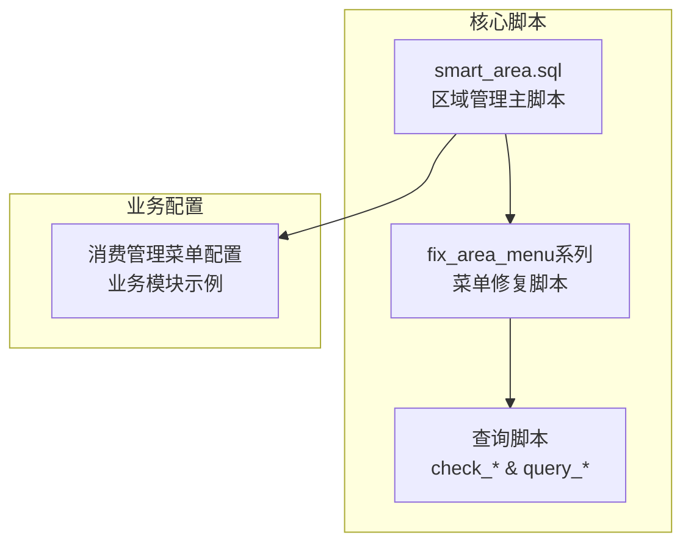
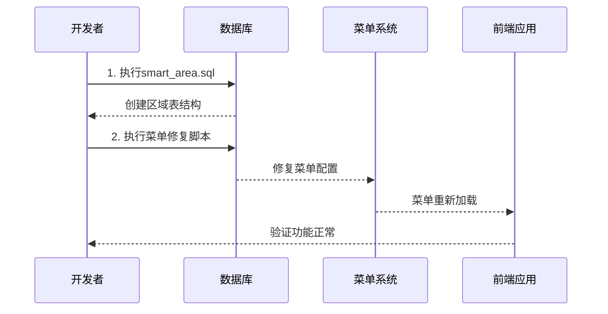
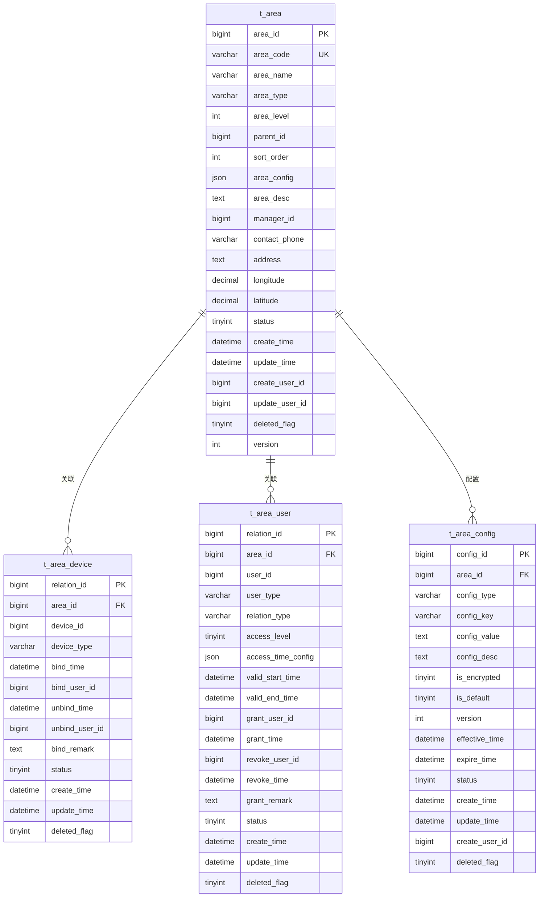
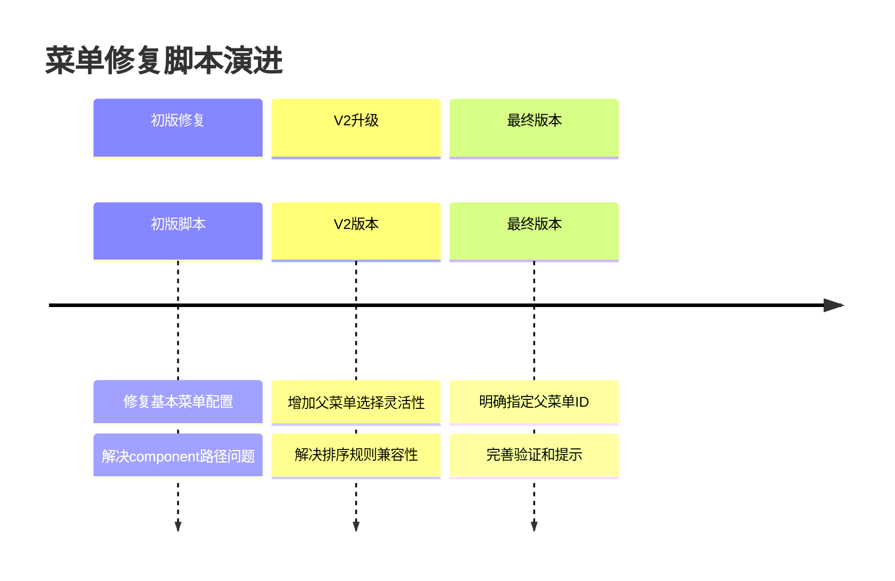
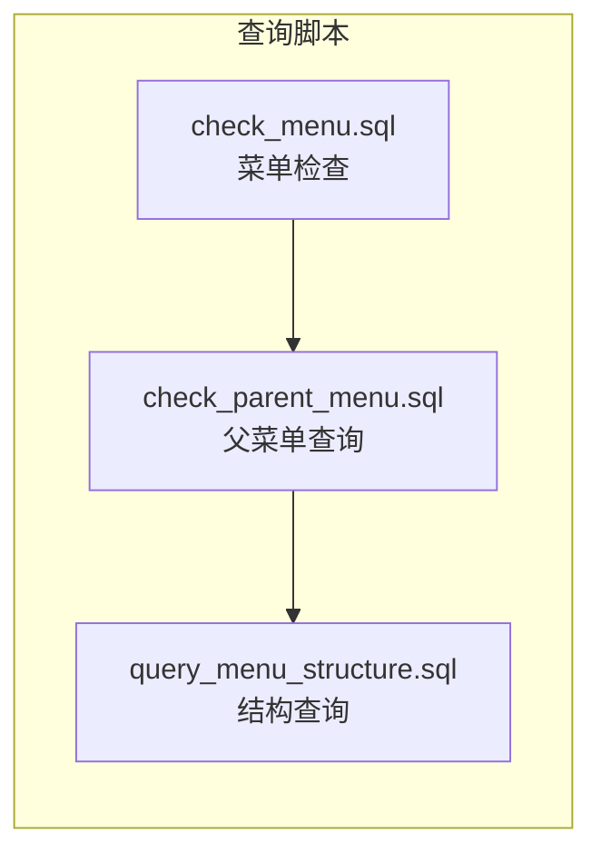
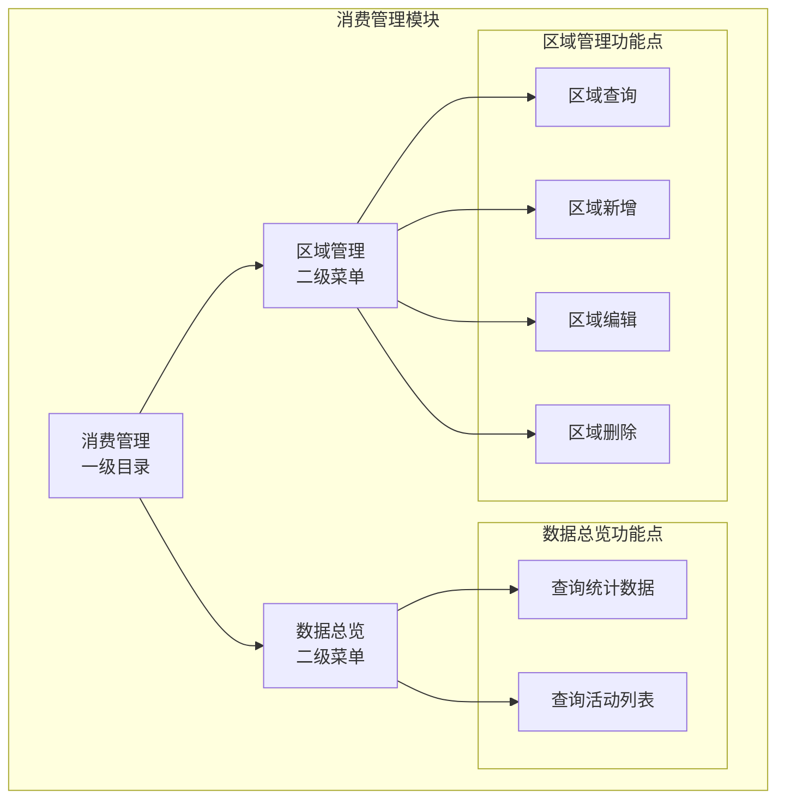
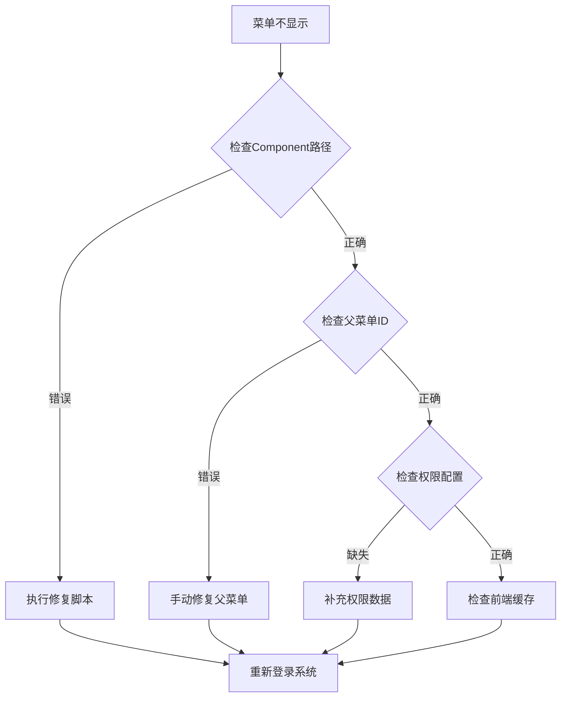
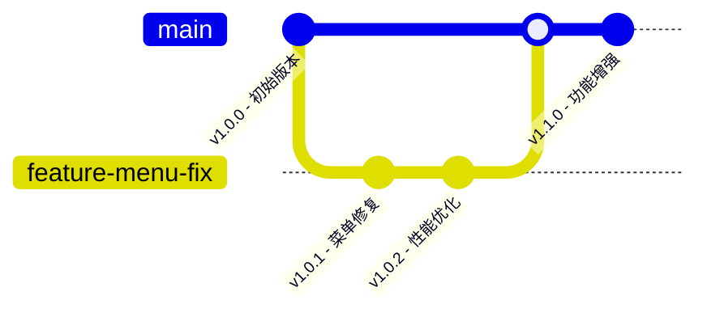

# SQL脚本说明文档

<cite>
**本文档引用的文件**
- [smart_area.sql](file://数据库SQL脚本/mysql/smart_area.sql)
- [fix_area_menu.sql](file://数据库SQL脚本/mysql/fix_area_menu.sql)
- [fix_area_menu_v2.sql](file://数据库SQL脚本/mysql/fix_area_menu_v2.sql)
- [fix_area_menu_final.sql](file://数据库SQL脚本/mysql/fix_area_menu_final.sql)
- [check_menu.sql](file://check_menu.sql)
- [check_parent_menu.sql](file://check_parent_menu.sql)
- [query_menu_structure.sql](file://query_menu_structure.sql)
- [消费管理菜单配置.sql](file://smart-admin-web-javascript/src/views/business/consumption/消费管理菜单配置.sql)
- [区域管理模块部署说明.md](file://区域管理模块部署说明.md)
- [区域管理菜单问题修复说明.md](file://区域管理菜单问题修复说明.md)
</cite>

## 目录
1. [概述](#概述)
2. [核心SQL脚本分析](#核心sql脚本分析)
3. [区域管理表结构详解](#区域管理表结构详解)
4. [菜单修复脚本演进](#菜单修复脚本演进)
5. [查询脚本功能说明](#查询脚本功能说明)
6. [消费管理菜单配置](#消费管理菜单配置)
7. [脚本执行最佳实践](#脚本执行最佳实践)
8. [故障排除指南](#故障排除指南)
9. [版本管理与维护](#版本管理与维护)

## 概述

IOE-DREAM项目中的SQL脚本主要用于实现区域管理模块的数据库设计和菜单配置。这些脚本涵盖了从基础表结构创建到菜单权限配置的完整流程，确保系统能够正确显示和使用区域管理功能。

### 主要功能模块

- **区域管理模块**：提供完整的区域层级管理、设备绑定和人员授权功能
- **菜单修复系统**：解决菜单显示问题的多阶段修复脚本
- **查询工具**：提供菜单结构和权限状态的查询功能
- **配置模板**：展示消费管理等业务模块的菜单配置标准

## 核心SQL脚本分析

### 脚本分类与用途



**图表来源**
- [smart_area.sql](file://数据库SQL脚本/mysql/smart_area.sql#L1-L197)
- [fix_area_menu.sql](file://数据库SQL脚本/mysql/fix_area_menu.sql#L1-L59)
- [消费管理菜单配置.sql](file://smart-admin-web-javascript/src/views/business/consumption/消费管理菜单配置.sql#L1-L444)

### 执行顺序与依赖关系



**图表来源**
- [smart_area.sql](file://数据库SQL脚本/mysql/smart_area.sql#L160-L197)
- [fix_area_menu_final.sql](file://数据库SQL脚本/mysql/fix_area_menu_final.sql#L1-L90)

**章节来源**
- [smart_area.sql](file://数据库SQL脚本/mysql/smart_area.sql#L1-L197)
- [fix_area_menu.sql](file://数据库SQL脚本/mysql/fix_area.sql#L1-L59)
- [fix_area_menu_v2.sql](file://数据库SQL脚本/mysql/fix_area_menu_v2.sql#L1-L78)
- [fix_area_menu_final.sql](file://数据库SQL脚本/mysql/fix_area_menu_final.sql#L1-L90)

## 区域管理表结构详解

### 表结构设计

smart_area.sql脚本创建了四个核心表，形成了完整的区域管理数据模型：



**图表来源**
- [smart_area.sql](file://数据库SQL脚本/mysql/smart_area.sql#L8-L122)

### 字段设计说明

| 表名 | 关键字段 | 数据类型 | 说明 |
|------|----------|----------|------|
| t_area | area_id, area_code | BIGINT, VARCHAR(100) | 区域唯一标识和编码 |
| t_area | area_type, area_level | VARCHAR(50), INT | 区域类型和层级结构 |
| t_area | parent_id, sort_order | BIGINT, INT | 树形结构和排序 |
| t_area_device | area_id, device_id | BIGINT, BIGINT | 区域与设备的多对多关系 |
| t_area_user | user_id, relation_type | BIGINT, VARCHAR(20) | 用户与区域的权限关系 |
| t_area_config | config_type, config_key | VARCHAR(50), VARCHAR(100) | 区域配置的分类和键值 |

### 初始数据配置

脚本包含了丰富的初始字典数据和菜单配置：

#### 区域类型字典
- CAMPUS：园区
- BUILDING：楼栋  
- FLOOR：楼层
- ROOM：房间
- OUTDOOR：室外
- PARKING：停车场
- ENTRANCE：出入口

#### 用户类型字典
- EMPLOYEE：员工
- VISITOR：访客
- CONTRACTOR：承包商
- SECURITY：安保

#### 权限类型字典
- ACCESS：访问权限
- MANAGE：管理权限
- MONITOR：监控权限

**章节来源**
- [smart_area.sql](file://数据库SQL脚本/mysql/smart_area.sql#L124-L197)

## 菜单修复脚本演进

### 问题背景

区域管理菜单最初部署时出现了component路径配置错误，导致前端无法正确加载菜单组件。

### 修复脚本演进历程



**图表来源**
- [fix_area_menu.sql](file://数据库SQL脚本/mysql/fix_area_menu.sql#L1-L59)
- [fix_area_menu_v2.sql](file://数据库SQL脚本/mysql/fix_area_menu_v2.sql#L1-L78)
- [fix_area_menu_final.sql](file://数据库SQL脚本/mysql/fix_area_menu_final.sql#L1-L90)

### 各版本修复内容对比

| 版本 | 主要改进 | 解决问题 | 使用场景 |
|------|----------|----------|----------|
| 初版 | 基础修复 | component路径错误 | 首次部署问题 |
| V2版 | 灵活父菜单 | 排序兼容性问题 | 多环境部署 |
| 最终版 | 明确配置 | 完整验证流程 | 生产环境部署 |

### 技术原理分析

#### Component路径处理机制

前端路由系统会自动处理component路径：
- 数据库配置：`system/area/index.vue`
- 前端处理：`../views/system/area/index.vue`
- 实际文件：`src/views/system/area/index.vue`

错误配置会导致路径拼接重复，如：`../views/views/system/area/index.vue`，从而导致组件加载失败。

**章节来源**
- [fix_area_menu.sql](file://数据库SQL脚本/mysql/fix_area_menu.sql#L1-L59)
- [fix_area_menu_v2.sql](file://数据库SQL脚本/mysql/fix_area_menu_v2.sql#L1-L78)
- [fix_area_menu_final.sql](file://数据库SQL脚本/mysql/fix_area_menu_final.sql#L1-L90)
- [区域管理菜单问题修复说明.md](file://区域管理菜单问题修复说明.md#L1-L165)

## 查询脚本功能说明

### 查询脚本体系



**图表来源**
- [check_menu.sql](file://check_menu.sql#L1-L31)
- [check_parent_menu.sql](file://check_parent_menu.sql#L1-L40)
- [query_menu_structure.sql](file://query_menu_structure.sql#L1-L42)

### 功能特性对比

| 脚本名称 | 查询范围 | 输出内容 | 使用场景 |
|----------|----------|----------|----------|
| check_menu.sql | 系统设置子菜单 | 菜单基本信息 | 检查菜单完整性 |
| check_parent_menu.sql | 一级菜单和系统相关 | 菜单层次结构 | 分析菜单组织 |
| query_menu_structure.sql | 系统菜单全貌 | 完整菜单树 | 系统架构分析 |

### 查询结果验证

每个查询脚本都提供了验证功能，确保数据完整性：

```sql
-- 验证菜单创建结果
SELECT * FROM t_sys_menu 
WHERE menu_name = '区域管理' 
AND deleted_flag = 0;
```

**章节来源**
- [check_menu.sql](file://check_menu.sql#L1-L31)
- [check_parent_menu.sql](file://check_parent_menu.sql#L1-L40)
- [query_menu_structure.sql](file://query_menu_structure.sql#L1-L42)

## 消费管理菜单配置

### 配置模板分析

消费管理菜单配置展示了完整的业务模块菜单设计标准：



**图表来源**
- [消费管理菜单配置.sql](file://smart-admin-web-javascript/src/views/business/consumption/消费管理菜单配置.sql#L1-L444)

### 配置规范要点

#### 菜单类型定义
- **目录类型 (menu_type=1)**：消费管理
- **菜单类型 (menu_type=2)**：数据总览、区域管理
- **功能点类型 (menu_type=3)**：具体操作权限

#### 权限配置标准
- **后端权限**：`/consumption/dashboard/stats`
- **前端权限**：`business:consumption:dashboard:query`
- **Sa-Token权限**：统一使用1类型

#### 路由配置原则
- **路径规范**：使用斜杠开头的绝对路径
- **组件路径**：相对于views目录的相对路径
- **缓存策略**：Dashboard建议开启缓存

**章节来源**
- [消费管理菜单配置.sql](file://smart-admin-web-javascript/src/views/business/consumption/消费管理菜单配置.sql#L1-L444)

## 脚本执行最佳实践

### 执行前准备

#### 环境检查清单
1. **数据库连接**：确认数据库连接信息正确
2. **权限验证**：确保具有足够的数据库操作权限
3. **备份确认**：执行前做好数据备份
4. **版本确认**：检查当前系统版本状态

#### 执行环境配置

```bash
# MySQL连接示例
mysql -h 192.168.10.110 -P 33060 -u root smart_admin_v3

# 执行SQL脚本
source G:\111建湖项目文件\IOE-DREAM\数据库SQL脚本\mysql\smart_area.sql
```

### 执行策略

#### 首次部署策略
1. **执行smart_area.sql**：创建完整的基础数据结构
2. **验证菜单配置**：使用查询脚本检查菜单状态
3. **重启应用服务**：确保配置生效
4. **功能验证**：检查区域管理功能是否正常

#### 维护更新策略
1. **评估变更影响**：分析脚本变更内容
2. **执行修复脚本**：针对特定问题执行对应修复
3. **数据迁移**：处理可能的数据迁移需求
4. **功能回归测试**：验证原有功能不受影响

### 错误处理机制

#### 常见错误类型

| 错误类型 | 症状 | 解决方案 |
|----------|------|----------|
| 权限不足 | 执行失败 | 提升数据库用户权限 |
| 表已存在 | 重复创建警告 | 使用IF NOT EXISTS |
| 外键约束 | 数据插入失败 | 检查关联数据完整性 |
| 编码问题 | 字符乱码 | 确认字符集设置 |

#### 自动化错误恢复

```sql
-- 使用ON DUPLICATE KEY UPDATE避免重复插入
INSERT INTO t_sys_dict (...) VALUES (...) 
ON DUPLICATE KEY UPDATE dict_value = VALUES(dict_value);
```

**章节来源**
- [区域管理模块部署说明.md](file://区域管理模块部署说明.md#L77-L116)

## 故障排除指南

### 常见问题诊断

#### 菜单不显示问题



**图表来源**
- [区域管理菜单问题修复说明.md](file://区域管理菜单问题修复说明.md#L280-L300)

#### 数据完整性检查

```sql
-- 检查区域管理菜单状态
SELECT 
    m.menu_id,
    m.menu_name,
    m.menu_type,
    m.parent_id,
    m.component,
    m.visible_flag,
    p.menu_name as parent_name
FROM t_sys_menu m
LEFT JOIN t_sys_menu p ON m.parent_id = p.menu_id
WHERE m.menu_name = '区域管理'
AND m.deleted_flag = 0;
```

#### 性能优化建议

1. **索引优化**：确保关键字段建立适当索引
2. **查询优化**：避免复杂的嵌套查询
3. **缓存策略**：合理使用数据库和应用缓存
4. **分区设计**：大数据量时考虑表分区

### 诊断工具使用

#### 查询脚本组合使用

```sql
-- 1. 检查菜单完整性
@source check_menu.sql

-- 2. 分析菜单结构
@source check_parent_menu.sql

-- 3. 验证最终状态
@source query_menu_structure.sql
```

**章节来源**
- [区域管理菜单问题修复说明.md](file://区域管理菜单问题修复说明.md#L280-L308)

## 版本管理与维护

### 版本控制策略

#### 脚本版本命名规范
- **主版本**：major.minor.patch格式
- **修复版本**：增加补丁号
- **功能版本**：增加功能号

#### 变更记录管理



### 维护计划

#### 定期检查项目
1. **菜单状态检查**：每月检查一次菜单配置
2. **数据完整性验证**：每季度验证一次数据完整性
3. **性能监控**：持续监控查询性能
4. **安全审计**：定期检查权限配置

#### 升级迁移指南

```sql
-- 升级前备份
CREATE TABLE t_sys_menu_backup AS SELECT * FROM t_sys_menu;

-- 执行升级脚本
@source upgrade_script_v1.1.sql

-- 验证升级结果
SELECT COUNT(*) FROM t_sys_menu WHERE deleted_flag = 0;
```

### 文档维护

#### 脚本文档更新
- **版本标注**：每次更新都要标注版本号
- **变更说明**：详细记录变更内容和影响范围
- **使用指南**：提供清晰的操作指导
- **故障排除**：包含常见问题和解决方案

#### 知识库建设
1. **最佳实践**：总结成功的实施经验
2. **反面案例**：记录失败的教训
3. **技术规范**：制定统一的技术标准
4. **培训材料**：制作操作手册和培训资料

**章节来源**
- [区域管理模块部署说明.md](file://区域管理模块部署说明.md#L256-L308)

## 结论

IOE-DREAM项目的SQL脚本体系展现了完整的数据库设计和菜单管理系统。通过smart_area.sql的区域管理表结构设计，fix_area_menu系列的菜单修复演进，以及各种查询脚本的辅助功能，构建了一个稳定可靠的区域管理解决方案。

### 核心价值

1. **标准化设计**：统一的表结构和字段命名规范
2. **渐进式修复**：从初版到最终版的完整问题解决流程
3. **完善的工具链**：查询、验证、维护一体化解决方案
4. **业务适配性强**：消费管理等业务模块的配置模板

### 发展方向

随着系统的发展，SQL脚本体系将继续演进，重点关注：
- **自动化部署**：减少人工干预，提高部署效率
- **智能监控**：实时监控脚本执行状态和数据质量
- **版本管理**：更精细的版本控制和变更追踪
- **性能优化**：持续优化查询性能和系统响应速度

通过遵循本文档的指导原则和最佳实践，开发者可以高效地使用和维护这些SQL脚本，确保系统的稳定运行和持续发展。