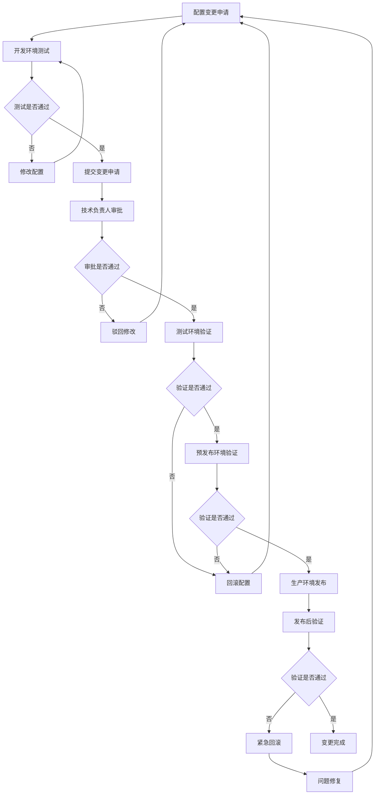

# 多环境配置规范（权威文档）

> **📋 文档版本**: v4.0.0 (整合版)
> **📋 文档职责**: SmartAdmin项目的唯一多环境配置规范权威来源，支持dev、test、pre、prod四套环境，确保配置管理标准化。

## ⚠️ 配置管理铁律（不可违反）

### 🚫 绝对禁止
```markdown
❌ 禁止在代码中硬编码配置信息
❌ 禁止将敏感信息提交到版本控制系统
❌ 禁止生产环境使用开发环境配置
❌ 禁止缺少环境变量校验机制
❌ 禁止配置文件格式不统一
❌ 禁止缺少配置文档和说明
❌ 禁止不同环境配置混用
❌ 禁止缺少配置变更记录
```

### ✅ 必须执行
```markdown
✅ 必须使用环境变量管理不同配置
✅ 必须使用配置中心统一管理配置
✅ 必须对敏感信息进行加密存储
✅ 必须有配置验证和默认值机制
✅ 必须保持配置文件结构统一
✅ 必须有完整的配置文档
✅ 必须支持配置热更新
✅ 必须有配置变更审批流程
```

## 🏗️ 环境架构设计

### 环境分层架构
```markdown
📦 环境分层：
├── dev (开发环境)
│   ├── 本地开发调试
│   ├── 快速迭代测试
│   └── 开发人员使用
├── test (测试环境)
│   ├── 功能测试验证
│   ├── 自动化测试执行
│   └── 测试团队使用
├── pre (预发布环境)
│   ├── 生产前验证
│   ├── 性能压测环境
│   └── 产品验收使用
└── prod (生产环境)
    ├── 正式对外服务
    ├── 稳定性要求最高
    └── 运维团队管理
```

### 配置文件结构
```
src/main/resources/
├── application.yml                   # 通用配置
├── application-dev.yml               # 开发环境配置
├── application-test.yml              # 测试环境配置
├── application-pre.yml               # 预发布环境配置
├── application-prod.yml              # 生产环境配置
├── config/                           # 配置文件目录
│   ├── logback-spring.xml           # 日志配置
│   ├── druid.properties             # 数据库连接池配置
│   └── redisson.yml                 # Redis配置
└── bootstrap.yml                     # 启动配置
```

## ⚙️ 配置文件规范

### 通用配置文件 (application.yml)
```yaml
# 应用基础配置
spring:
  application:
    name: smart-admin
  profiles:
    active: ${SPRING_PROFILES_ACTIVE:dev}

  # JSON配置
  jackson:
    date-format: yyyy-MM-dd HH:mm:ss
    time-zone: Asia/Shanghai
    serialization:
      write-dates-as-timestamps: false
    deserialization:
      fail-on-unknown-properties: false

  # 文件上传配置
  servlet:
    multipart:
      max-file-size: 10MB
      max-request-size: 100MB

  # 国际化配置
  messages:
    basename: i18n/messages
    encoding: UTF-8
    cache-duration: 3600

# 服务器配置
server:
  port: ${SERVER_PORT:8080}
  servlet:
    context-path: /
  tomcat:
    uri-encoding: UTF-8
    max-threads: 200
    min-spare-threads: 10
    accept-count: 100
    connection-timeout: 20000

# 应用配置
app:
  # 应用信息
  name: SmartAdmin管理系统
  version: 4.0.0
  description: 基于Spring Boot 3.5.4的企业级管理系统

  # 安全配置
  security:
    jwt:
      secret: ${JWT_SECRET:smart-admin-jwt-secret-key}
      expiration: 86400 # 24小时
      refresh-expiration: 604800 # 7天
    captcha:
      enabled: ${CAPTCHA_ENABLED:true}
      expire-time: 300 # 5分钟

  # 文件存储配置
  file:
    upload-path: ${FILE_UPLOAD_PATH:./uploads}
    max-size: 10485760 # 10MB
    allowed-types: jpg,jpeg,png,gif,pdf,doc,docx,xls,xlsx
    access-url: ${FILE_ACCESS_URL:http://localhost:8080/files}

  # 缓存配置
  cache:
    type: ${CACHE_TYPE:redis} # redis, caffeine, both
    caffeine:
      max-size: 10000
      expire-after-write: 300000 # 5分钟

  # 日志配置
  logging:
    level: ${LOG_LEVEL:INFO}
    path: ${LOG_PATH:./logs}
    max-size: 100MB
    max-history: 30

# 监控配置
management:
  endpoints:
    web:
      exposure:
        include: health,info,metrics,prometheus
      base-path: /actuator
  endpoint:
    health:
      show-details: when-authorized
  metrics:
    export:
      prometheus:
        enabled: true

# MyBatis-Plus配置
mybatis-plus:
  configuration:
    map-underscore-to-camel-case: true
    cache-enabled: true
    log-impl: org.apache.ibatis.logging.slf4j.Slf4jImpl
  global-config:
    db-config:
      logic-delete-field: deletedFlag
      logic-delete-value: 1
      logic-not-delete-value: 0
      version-field: version
  mapper-locations: classpath*:/mapper/**/*.xml
  type-aliases-package: com.smart.admin.**.entity
```

### 开发环境配置 (application-dev.yml)
```yaml
spring:
  # 数据源配置
  datasource:
    driver-class-name: com.mysql.cj.jdbc.Driver
    url: jdbc:mysql://${DB_HOST:localhost}:${DB_PORT:3306}/${DB_NAME:smart_admin_dev}?useUnicode=true&characterEncoding=UTF-8&serverTimezone=Asia/Shanghai&useSSL=false&allowPublicKeyRetrieval=true
    username: ${DB_USERNAME:root}
    password: ${DB_PASSWORD:root}
    type: com.alibaba.druid.pool.DruidDataSource
    druid:
      initial-size: 5
      min-idle: 5
      max-active: 20
      max-wait: 60000
      time-between-eviction-runs-millis: 60000
      min-evictable-idle-time-millis: 300000
      validation-query: SELECT 1
      test-while-idle: true
      test-on-borrow: false
      test-on-return: false
      pool-prepared-statements: true
      max-pool-prepared-statement-per-connection-size: 20
      filters: stat,wall
      connection-properties: druid.stat.mergeSql=true;druid.stat.slowSqlMillis=2000
      web-stat-filter:
        enabled: true
        url-pattern: /*
        exclusions: "*.js,*.gif,*.jpg,*.bmp,*.png,*.css,*.ico,/druid/*"
      stat-view-servlet:
        enabled: true
        url-pattern: /druid/*
        login-username: admin
        login-password: admin
        allow: 127.0.0.1

  # Redis配置
  redis:
    host: ${REDIS_HOST:localhost}
    port: ${REDIS_PORT:6379}
    password: ${REDIS_PASSWORD:}
    database: 0
    timeout: 3000
    lettuce:
      pool:
        max-active: 20
        max-wait: -1
        max-idle: 10
        min-idle: 0

  # 开发工具配置
  devtools:
    restart:
      enabled: true
      additional-paths: src/main/java
    livereload:
      enabled: true

# 应用配置
app:
  # 开发环境特殊配置
  security:
    permit-all:
      - /druid/**
      - /actuator/**
      - /swagger-ui/**
      - /v3/api-docs/**
      - /doc.html

  # 缓存配置
  cache:
    caffeine:
      enabled: true
      max-size: 1000
      expire-after-write: 60000 # 1分钟

# 日志配置
logging:
  level:
    com.smart.admin: DEBUG
    org.springframework.security: DEBUG
    org.springframework.web: DEBUG
    org.mybatis: DEBUG
    com.alibaba.druid: DEBUG
  pattern:
    console: "%d{yyyy-MM-dd HH:mm:ss} [%thread] %-5level %logger{36} - %msg%n"
    file: "%d{yyyy-MM-dd HH:mm:ss} [%thread] %-5level %logger{36} - %msg%n"

# Knife4j配置
knife4j:
  enable: true
  openapi:
    title: SmartAdmin API文档 (开发环境)
    description: SmartAdmin管理系统API接口文档
    version: 4.0.0
    concat-contact: true
    contact:
      name: SmartAdmin Team
      email: smartadmin@example.com
      url: https://smartadmin.vip
    license: Apache 2.0
    license-url: https://www.apache.org/licenses/LICENSE-2.0
  setting:
    language: zh-CN
    enable-swagger-models: true
    enable-document-manage: true
    swagger-model-name: 实体类列表
    enable-version: true
    enable-reload-cache-parameter: false
    enable-after-script: true
    enable-filter-multipart-api-method-type: POST
    enable-filter-multipart-apis: false
    enable-request-cache: true
    enable-host: false
    enable-host-text: localhost:8080
    enable-home-custom: false
    home-custom-path: classpath:markdown/home.md
    enable-search: true
    enable-footer: false
    enable-footer-custom: true
    footer-custom-content: Copyright © 2024 SmartAdmin Team
    enable-dynamic-parameter: false
    enable-debug: true
    enable-open-api: true
    enable-group: true
  cors: true
  production: false
  basic:
    enable: false
    username: admin
    password: 123456
```

### 测试环境配置 (application-test.yml)
```yaml
spring:
  # 数据源配置
  datasource:
    driver-class-name: com.mysql.cj.jdbc.Driver
    url: jdbc:mysql://${DB_HOST:192.168.1.100}:${DB_PORT:3306}/${DB_NAME:smart_admin_test}?useUnicode=true&characterEncoding=UTF-8&serverTimezone=Asia/Shanghai&useSSL=true
    username: ${DB_USERNAME:smart_admin}
    password: ${DB_PASSWORD:smart_admin_test_2024}
    type: com.alibaba.druid.pool.DruidDataSource
    druid:
      initial-size: 10
      min-idle: 10
      max-active: 50
      max-wait: 60000
      time-between-eviction-runs-millis: 60000
      min-evictable-idle-time-millis: 300000
      validation-query: SELECT 1
      test-while-idle: true
      test-on-borrow: false
      test-on-return: false
      pool-prepared-statements: true
      max-pool-prepared-statement-per-connection-size: 20
      filters: stat,wall
      connection-properties: druid.stat.mergeSql=true;druid.stat.slowSqlMillis=1000
      web-stat-filter:
        enabled: true
        url-pattern: /*
        exclusions: "*.js,*.gif,*.jpg,*.bmp,*.png,*.css,*.ico,/druid/*"
      stat-view-servlet:
        enabled: true
        url-pattern: /druid/*
        login-username: ${DRUID_USERNAME:admin}
        login-password: ${DRUID_PASSWORD:admin_test_2024}
        allow: 192.168.1.0/24

  # Redis配置
  redis:
    host: ${REDIS_HOST:192.168.1.101}
    port: ${REDIS_PORT:6379}
    password: ${REDIS_PASSWORD:redis_test_2024}
    database: 1
    timeout: 3000
    lettuce:
      pool:
        max-active: 50
        max-wait: -1
        max-idle: 20
        min-idle: 5

  # 邮件配置（测试环境）
  mail:
    host: ${MAIL_HOST:smtp.qq.com}
    port: ${MAIL_PORT:587}
    username: ${MAIL_USERNAME:smart_admin_test@qq.com}
    password: ${MAIL_PASSWORD:test_mail_password}
    properties:
      mail:
        smtp:
          auth: true
          starttls:
            enable: true
    test-connection: true

# 应用配置
app:
  # 测试环境特殊配置
  security:
    permit-all:
      - /actuator/health
      - /actuator/info

  # 文件存储配置
  file:
    upload-path: ${FILE_UPLOAD_PATH:/data/smart-admin/uploads}
    access-url: ${FILE_ACCESS_URL:https://test.smartadmin.com/files}

  # 缓存配置
  cache:
    type: redis
    caffeine:
      enabled: false

# 日志配置
logging:
  level:
    com.smart.admin: INFO
    org.springframework.security: INFO
    org.springframework.web: INFO
    org.mybatis: INFO
    com.alibaba.druid: INFO
  file:
    name: ${LOG_PATH:/data/smart-admin/logs}/smart-admin-test.log

# Knife4j配置
knife4j:
  enable: true
  openapi:
    title: SmartAdmin API文档 (测试环境)
    description: SmartAdmin管理系统API接口文档 - 测试环境
    version: 4.0.0
  setting:
    language: zh-CN
    enable-swagger-models: true
    enable-document-manage: true
    enable-version: true
    enable-reload-cache-parameter: false
    enable-after-script: true
    enable-filter-multipart-api-method-type: POST
    enable-filter-multipart-apis: false
    enable-request-cache: true
    enable-host: true
    enable-host-text: test.smartadmin.com
    enable-home-custom: false
    enable-search: true
    enable-footer: true
    enable-footer-custom: true
    footer-custom-content: Copyright © 2024 SmartAdmin Team - 测试环境
    enable-dynamic-parameter: false
    enable-debug: false
    enable-open-api: true
    enable-group: true
  cors: true
  production: false
  basic:
    enable: true
    username: ${KNIFE4J_USERNAME:admin}
    password: ${KNIFE4J_PASSWORD:admin_test_2024}
```

### 预发布环境配置 (application-pre.yml)
```yaml
spring:
  # 数据源配置
  datasource:
    driver-class-name: com.mysql.cj.jdbc.Driver
    url: jdbc:mysql://${DB_HOST:pre-db.smartadmin.com}:${DB_PORT:3306}/${DB_NAME:smart_admin_pre}?useUnicode=true&characterEncoding=UTF-8&serverTimezone=Asia/Shanghai&useSSL=true
    username: ${DB_USERNAME:smart_admin_pre}
    password: ${DB_PASSWORD} # 从环境变量读取
    type: com.alibaba.druid.pool.DruidDataSource
    druid:
      initial-size: 20
      min-idle: 20
      max-active: 100
      max-wait: 60000
      time-between-eviction-runs-millis: 60000
      min-evictable-idle-time-millis: 300000
      validation-query: SELECT 1
      test-while-idle: true
      test-on-borrow: false
      test-on-return: false
      pool-prepared-statements: true
      max-pool-prepared-statement-per-connection-size: 20
      filters: stat,wall
      connection-properties: druid.stat.mergeSql=true;druid.stat.slowSqlMillis=500
      web-stat-filter:
        enabled: true
        url-pattern: /*
        exclusions: "*.js,*.gif,*.jpg,*.bmp,*.png,*.css,*.ico,/druid/*"
      stat-view-servlet:
        enabled: false # 预发布环境关闭监控页面

  # Redis配置
  redis:
    host: ${REDIS_HOST:pre-redis.smartadmin.com}
    port: ${REDIS_PORT:6379}
    password: ${REDIS_PASSWORD} # 从环境变量读取
    database: 2
    timeout: 3000
    lettuce:
      pool:
        max-active: 100
        max-wait: -1
        max-idle: 50
        min-idle: 10

  # 邮件配置
  mail:
    host: ${MAIL_HOST:smtp.exmail.qq.com}
    port: ${MAIL_PORT:587}
    username: ${MAIL_USERNAME:noreply@smartadmin.com}
    password: ${MAIL_PASSWORD} # 从环境变量读取
    properties:
      mail:
        smtp:
          auth: true
          starttls:
            enable: true
    test-connection: true

# 应用配置
app:
  # 预发布环境特殊配置
  security:
    permit-all:
      - /actuator/health

  # 文件存储配置（使用OSS）
  file:
    upload-path: ${FILE_UPLOAD_PATH:/data/smart-admin/uploads}
    access-url: ${FILE_ACCESS_URL:https://pre.smartadmin.com/files}
    oss:
      enabled: true
      endpoint: ${OSS_ENDPOINT:https://oss-cn-beijing.aliyuncs.com}
      bucket: ${OSS_BUCKET:smart-admin-pre}
      access-key: ${OSS_ACCESS_KEY} # 从环境变量读取
      secret-key: ${OSS_SECRET_KEY} # 从环境变量读取

  # 缓存配置
  cache:
    type: redis
    caffeine:
      enabled: false

# 日志配置
logging:
  level:
    com.smart.admin: INFO
    org.springframework.security: WARN
    org.springframework.web: WARN
    org.mybatis: WARN
    com.alibaba.druid: WARN
    root: INFO
  file:
    name: ${LOG_PATH:/data/smart-admin/logs}/smart-admin-pre.log
    max-size: 200MB
    max-history: 60

# 监控配置
management:
  endpoints:
    web:
      exposure:
        include: health,info,metrics,prometheus
  endpoint:
    health:
      show-details: never
  metrics:
    export:
      prometheus:
        enabled: true

# Knife4j配置
knife4j:
  enable: false # 预发布环境关闭文档
  production: true
```

### 生产环境配置 (application-prod.yml)
```yaml
spring:
  # 数据源配置
  datasource:
    driver-class-name: com.mysql.cj.jdbc.Driver
    url: jdbc:mysql://${DB_HOST}:${DB_PORT:3306}/${DB_NAME}?useUnicode=true&characterEncoding=UTF-8&serverTimezone=Asia/Shanghai&useSSL=true
    username: ${DB_USERNAME}
    password: ${DB_PASSWORD}
    type: com.alibaba.druid.pool.DruidDataSource
    druid:
      initial-size: 50
      min-idle: 50
      max-active: 200
      max-wait: 60000
      time-between-eviction-runs-millis: 60000
      min-evictable-idle-time-millis: 300000
      validation-query: SELECT 1
      test-while-idle: true
      test-on-borrow: false
      test-on-return: false
      pool-prepared-statements: true
      max-pool-prepared-statement-per-connection-size: 20
      filters: stat,wall
      connection-properties: druid.stat.mergeSql=true;druid.stat.slowSqlMillis=200
      web-stat-filter:
        enabled: false # 生产环境关闭监控页面
      stat-view-servlet:
        enabled: false

  # Redis配置
  redis:
    host: ${REDIS_HOST}
    port: ${REDIS_PORT:6379}
    password: ${REDIS_PASSWORD}
    database: 3
    timeout: 3000
    lettuce:
      pool:
        max-active: 200
        max-wait: -1
        max-idle: 100
        min-idle: 20

  # 邮件配置
  mail:
    host: ${MAIL_HOST}
    port: ${MAIL_PORT:587}
    username: ${MAIL_USERNAME}
    password: ${MAIL_PASSWORD}
    properties:
      mail:
        smtp:
          auth: true
          starttls:
            enable: true
    test-connection: false

# 应用配置
app:
  # 生产环境特殊配置
  security:
    permit-all:
      - /actuator/health
      - /actuator/info

  # 文件存储配置（使用OSS）
  file:
    upload-path: ${FILE_UPLOAD_PATH}
    access-url: ${FILE_ACCESS_URL}
    oss:
      enabled: true
      endpoint: ${OSS_ENDPOINT}
      bucket: ${OSS_BUCKET}
      access-key: ${OSS_ACCESS_KEY}
      secret-key: ${OSS_SECRET_KEY}
      cdn-url: ${OSS_CDN_URL}

  # 缓存配置
  cache:
    type: redis
    caffeine:
      enabled: false

# 日志配置
logging:
  level:
    com.smart.admin: INFO
    org.springframework.security: WARN
    org.springframework.web: WARN
    org.mybatis: WARN
    com.alibaba.druid: WARN
    root: WARN
  file:
    name: ${LOG_PATH}/smart-admin-prod.log
    max-size: 500MB
    max-history: 90
  pattern:
    file: "%d{yyyy-MM-dd HH:mm:ss.SSS} [%thread] %-5level [%logger{50}] - %msg%n"

# 监控配置
management:
  endpoints:
    web:
      exposure:
        include: health,info,metrics,prometheus
  endpoint:
    health:
      show-details: never
  metrics:
    export:
      prometheus:
        enabled: true

# Knife4j配置
knife4j:
  enable: false # 生产环境关闭文档
  production: true
```

## 🔧 环境变量管理

### 环境变量清单
```bash
# ===========================================
# 通用环境变量
# ===========================================
# 运行环境
SPRING_PROFILES_ACTIVE=prod

# 服务器端口
SERVER_PORT=8080

# JWT密钥
JWT_SECRET=your-super-secret-jwt-key-at-least-256-bits-long

# 验证码开关
CAPTCHA_ENABLED=true

# 日志级别
LOG_LEVEL=INFO
LOG_PATH=/data/smart-admin/logs

# 文件上传路径
FILE_UPLOAD_PATH=/data/smart-admin/uploads
FILE_ACCESS_URL=https://smartadmin.com/files

# 缓存类型
CACHE_TYPE=redis

# ===========================================
# 数据库环境变量
# ===========================================
DB_HOST=localhost
DB_PORT=3306
DB_NAME=smart_admin
DB_USERNAME=smart_admin
DB_PASSWORD=your-database-password

# ===========================================
# Redis环境变量
# ===========================================
REDIS_HOST=localhost
REDIS_PORT=6379
REDIS_PASSWORD=your-redis-password

# ===========================================
# 邮件环境变量
# ===========================================
MAIL_HOST=smtp.exmail.qq.com
MAIL_PORT=587
MAIL_USERNAME=noreply@smartadmin.com
MAIL_PASSWORD=your-mail-password

# ===========================================
# OSS环境变量（生产环境）
# ===========================================
OSS_ENABLED=true
OSS_ENDPOINT=https://oss-cn-beijing.aliyuncs.com
OSS_BUCKET=smart-admin-prod
OSS_ACCESS_KEY=your-oss-access-key
OSS_SECRET_KEY=your-oss-secret-key
OSS_CDN_URL=https://cdn.smartadmin.com

# ===========================================
# 监控环境变量
# ===========================================
ACTUATOR_ENABLED=true
PROMETHEUS_ENABLED=true

# ===========================================
# Druid监控环境变量
# ===========================================
DRUID_USERNAME=admin
DRUID_PASSWORD=your-druid-password

# ===========================================
# Knife4j环境变量
# ===========================================
KNIFE4J_ENABLED=false
KNIFE4J_USERNAME=admin
KNIFE4J_PASSWORD=your-knife4j-password
```

### Docker环境变量文件
```bash
# .env.dev - 开发环境
SPRING_PROFILES_ACTIVE=dev
DB_HOST=mysql-dev
REDIS_HOST=redis-dev
LOG_LEVEL=DEBUG

# .env.test - 测试环境
SPRING_PROFILES_ACTIVE=test
DB_HOST=192.168.1.100
REDIS_HOST=192.168.1.101
DRUID_USERNAME=admin
DRUID_PASSWORD=admin_test_2024
KNIFE4J_USERNAME=admin
KNIFE4J_PASSWORD=admin_test_2024

# .env.pre - 预发布环境
SPRING_PROFILES_ACTIVE=pre
DB_HOST=pre-db.smartadmin.com
REDIS_HOST=pre-redis.smartadmin.com
MAIL_HOST=smtp.exmail.qq.com
OSS_ENDPOINT=https://oss-cn-beijing.aliyuncs.com
OSS_BUCKET=smart-admin-pre

# .env.prod - 生产环境
SPRING_PROFILES_ACTIVE=prod
DB_HOST=prod-db.smartadmin.com
REDIS_HOST=prod-redis.smartadmin.com
MAIL_HOST=smtp.exmail.qq.com
OSS_ENDPOINT=https://oss-cn-beijing.aliyuncs.com
OSS_BUCKET=smart-admin-prod
OSS_CDN_URL=https://cdn.smartadmin.com
```

## 🚀 部署配置规范

### Docker Compose配置
```yaml
# docker-compose.yml
version: '3.8'

services:
  # MySQL服务
  mysql:
    image: mysql:9.3.0
    container_name: smart-admin-mysql
    restart: unless-stopped
    environment:
      MYSQL_ROOT_PASSWORD: ${MYSQL_ROOT_PASSWORD}
      MYSQL_DATABASE: ${DB_NAME}
      MYSQL_USER: ${DB_USERNAME}
      MYSQL_PASSWORD: ${DB_PASSWORD}
      TZ: Asia/Shanghai
    ports:
      - "${DB_PORT:-3306}:3306"
    volumes:
      - mysql_data:/var/lib/mysql
      - ./config/mysql:/etc/mysql/conf.d
      - ./scripts/init.sql:/docker-entrypoint-initdb.d/init.sql
    command: --default-authentication-plugin=mysql_native_password
    networks:
      - smart-admin-network

  # Redis服务
  redis:
    image: redis:7.0-alpine
    container_name: smart-admin-redis
    restart: unless-stopped
    command: redis-server --requirepass ${REDIS_PASSWORD}
    ports:
      - "${REDIS_PORT:-6379}:6379"
    volumes:
      - redis_data:/data
      - ./config/redis.conf:/usr/local/etc/redis/redis.conf
    networks:
      - smart-admin-network

  # 应用服务
  app:
    build:
      context: .
      dockerfile: Dockerfile
    container_name: smart-admin-app
    restart: unless-stopped
    environment:
      SPRING_PROFILES_ACTIVE: ${SPRING_PROFILES_ACTIVE}
      DB_HOST: mysql
      REDIS_HOST: redis
      # 从环境文件加载其他变量
    env_file:
      - .env.${SPRING_PROFILES_ACTIVE}
    ports:
      - "${SERVER_PORT:-8080}:8080"
    volumes:
      - app_logs:/data/smart-admin/logs
      - app_uploads:/data/smart-admin/uploads
    depends_on:
      - mysql
      - redis
    networks:
      - smart-admin-network
    healthcheck:
      test: ["CMD", "curl", "-f", "http://localhost:8080/actuator/health"]
      interval: 30s
      timeout: 10s
      retries: 3
      start_period: 60s

  # Nginx服务（生产环境）
  nginx:
    image: nginx:alpine
    container_name: smart-admin-nginx
    restart: unless-stopped
    ports:
      - "80:80"
      - "443:443"
    volumes:
      - ./config/nginx/nginx.conf:/etc/nginx/nginx.conf
      - ./config/nginx/conf.d:/etc/nginx/conf.d
      - app_uploads:/var/www/uploads
      - ./ssl:/etc/nginx/ssl
    depends_on:
      - app
    networks:
      - smart-admin-network
    profiles:
      - prod

volumes:
  mysql_data:
    driver: local
  redis_data:
    driver: local
  app_logs:
    driver: local
  app_uploads:
    driver: local

networks:
  smart-admin-network:
    driver: bridge
```

### Kubernetes配置
```yaml
# k8s/configmap.yaml
apiVersion: v1
kind: ConfigMap
metadata:
  name: smart-admin-config
  namespace: smart-admin
data:
  application.yml: |
    spring:
      profiles:
        active: ${SPRING_PROFILES_ACTIVE}
    server:
      port: 8080
    app:
      name: SmartAdmin管理系统
      version: 4.0.0

---
# k8s/secret.yaml
apiVersion: v1
kind: Secret
metadata:
  name: smart-admin-secrets
  namespace: smart-admin
type: Opaque
data:
  # Base64编码的敏感信息
  db-password: <base64-encoded-password>
  redis-password: <base64-encoded-password>
  jwt-secret: <base64-encoded-jwt-secret>

---
# k8s/deployment.yaml
apiVersion: apps/v1
kind: Deployment
metadata:
  name: smart-admin
  namespace: smart-admin
  labels:
    app: smart-admin
spec:
  replicas: 3
  selector:
    matchLabels:
      app: smart-admin
  template:
    metadata:
      labels:
        app: smart-admin
    spec:
      containers:
      - name: smart-admin
        image: smart-admin:4.0.0
        ports:
        - containerPort: 8080
        env:
        - name: SPRING_PROFILES_ACTIVE
          value: "prod"
        - name: DB_HOST
          value: "mysql-service"
        - name: REDIS_HOST
          value: "redis-service"
        envFrom:
        - configMapRef:
            name: smart-admin-config
        - secretRef:
            name: smart-admin-secrets
        volumeMounts:
        - name: app-logs
          mountPath: /data/smart-admin/logs
        resources:
          requests:
            memory: "512Mi"
            cpu: "500m"
          limits:
            memory: "1Gi"
            cpu: "1000m"
        livenessProbe:
          httpGet:
            path: /actuator/health
            port: 8080
          initialDelaySeconds: 60
          periodSeconds: 30
        readinessProbe:
          httpGet:
            path: /actuator/health
            port: 8080
          initialDelaySeconds: 30
          periodSeconds: 10
      volumes:
      - name: app-logs
        persistentVolumeClaim:
          claimName: app-logs-pvc

---
# k8s/service.yaml
apiVersion: v1
kind: Service
metadata:
  name: smart-admin-service
  namespace: smart-admin
spec:
  selector:
    app: smart-admin
  ports:
  - protocol: TCP
    port: 80
    targetPort: 8080
  type: ClusterIP

---
# k8s/ingress.yaml
apiVersion: networking.k8s.io/v1
kind: Ingress
metadata:
  name: smart-admin-ingress
  namespace: smart-admin
  annotations:
    kubernetes.io/ingress.class: nginx
    cert-manager.io/cluster-issuer: letsencrypt-prod
spec:
  tls:
  - hosts:
    - smartadmin.com
    secretName: smartadmin-tls
  rules:
  - host: smartadmin.com
    http:
      paths:
      - path: /
        pathType: Prefix
        backend:
          service:
            name: smart-admin-service
            port:
              number: 80
```

## 📋 配置管理流程

### 配置变更流程


### 配置验证脚本
```bash
#!/bin/bash
# config-validator.sh - 配置验证脚本

set -e

# 颜色定义
RED='\033[0;31m'
GREEN='\033[0;32m'
YELLOW='\033[1;33m'
NC='\033[0m' # No Color

# 日志函数
log_info() {
    echo -e "${GREEN}[INFO]${NC} $1"
}

log_warn() {
    echo -e "${YELLOW}[WARN]${NC} $1"
}

log_error() {
    echo -e "${RED}[ERROR]${NC} $1"
}

# 必需的环境变量检查
check_required_env_vars() {
    log_info "检查必需的环境变量..."

    local required_vars=(
        "SPRING_PROFILES_ACTIVE"
        "DB_HOST"
        "DB_USERNAME"
        "DB_PASSWORD"
        "REDIS_HOST"
        "JWT_SECRET"
    )

    local missing_vars=()

    for var in "${required_vars[@]}"; do
        if [[ -z "${!var}" ]]; then
            missing_vars+=("$var")
        fi
    done

    if [[ ${#missing_vars[@]} -gt 0 ]]; then
        log_error "缺少必需的环境变量: ${missing_vars[*]}"
        return 1
    fi

    log_info "必需的环境变量检查通过"
}

# 数据库连接测试
test_database_connection() {
    log_info "测试数据库连接..."

    local db_host=${DB_HOST}
    local db_port=${DB_PORT:-3306}
    local db_name=${DB_NAME}
    local db_username=${DB_USERNAME}
    local db_password=${DB_PASSWORD}

    # 使用MySQL客户端测试连接
    if command -v mysql &> /dev/null; then
        if mysql -h"$db_host" -P"$db_port" -u"$db_username" -p"$db_password" -e "USE $db_name; SELECT 1;" &> /dev/null; then
            log_info "数据库连接测试通过"
        else
            log_error "数据库连接测试失败"
            return 1
        fi
    else
        log_warn "MySQL客户端未安装，跳过数据库连接测试"
    fi
}

# Redis连接测试
test_redis_connection() {
    log_info "测试Redis连接..."

    local redis_host=${REDIS_HOST}
    local redis_port=${REDIS_PORT:-6379}
    local redis_password=${REDIS_PASSWORD}

    # 使用Redis客户端测试连接
    if command -v redis-cli &> /dev/null; then
        local redis_cmd="redis-cli -h $redis_host -p $redis_port"

        if [[ -n "$redis_password" ]]; then
            redis_cmd="$redis_cmd -a $redis_password"
        fi

        if $redis_cmd ping &> /dev/null; then
            log_info "Redis连接测试通过"
        else
            log_error "Redis连接测试失败"
            return 1
        fi
    else
        log_warn "Redis客户端未安装，跳过Redis连接测试"
    fi
}

# 配置文件语法检查
check_config_syntax() {
    log_info "检查配置文件语法..."

    # 检查YAML语法
    if command -v yamllint &> /dev/null; then
        local config_files=(
            "application.yml"
            "application-${SPRING_PROFILES_ACTIVE}.yml"
        )

        for config_file in "${config_files[@]}"; do
            if [[ -f "$config_file" ]]; then
                if yamllint "$config_file" &> /dev/null; then
                    log_info "$config_file 语法检查通过"
                else
                    log_error "$config_file 语法检查失败"
                    return 1
                fi
            fi
        done
    else
        log_warn "yamllint未安装，跳过YAML语法检查"
    fi
}

# 安全配置检查
check_security_config() {
    log_info "检查安全配置..."

    # 检查JWT密钥长度
    if [[ ${#JWT_SECRET} -lt 32 ]]; then
        log_error "JWT密钥长度不能少于32个字符"
        return 1
    fi

    # 检查数据库密码强度
    if [[ ${#DB_PASSWORD} -lt 8 ]]; then
        log_error "数据库密码长度不能少于8个字符"
        return 1
    fi

    # 检查Redis密码
    if [[ "$SPRING_PROFILES_ACTIVE" != "dev" && -z "$REDIS_PASSWORD" ]]; then
        log_error "非开发环境必须设置Redis密码"
        return 1
    fi

    log_info "安全配置检查通过"
}

# 主函数
main() {
    log_info "开始配置验证..."

    check_required_env_vars || exit 1
    check_config_syntax || exit 1
    check_security_config || exit 1
    test_database_connection || exit 1
    test_redis_connection || exit 1

    log_info "配置验证全部通过！"
}

# 执行主函数
main "$@"
```

---

**🎯 核心原则**：
1. **环境隔离** - 不同环境配置严格分离
2. **安全优先** - 敏感信息加密存储和传输
3. **配置验证** - 自动化配置检查和验证
4. **变更管理** - 标准化配置变更流程
5. **可追溯性** - 完整的配置变更记录

**📖 相关文档**：
- [安全规范](./安全规范.md) - 配置安全管理
- [数据规范](./数据规范.md) - 数据库配置规范
- [缓存架构规范](./缓存架构规范.md) - 缓存配置规范