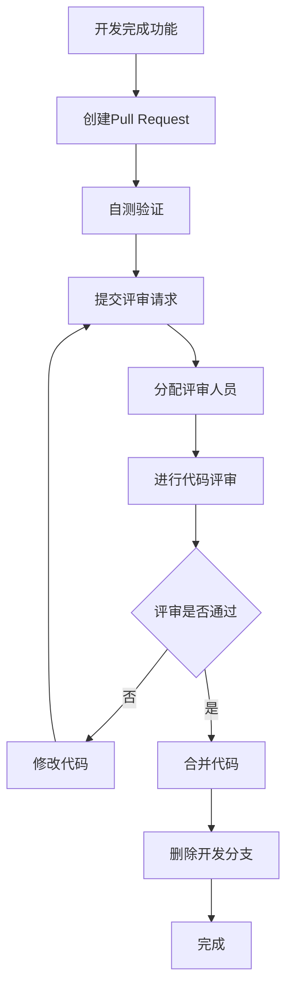

# 代码评审规范（权威文档）

> **📋 文档版本**: v4.0.0 (整合版)
> **📋 文档职责**: SmartAdmin项目的唯一代码评审规范权威来源，确保代码质量和团队协作效率。

## ⚠️ 代码评审铁律（不可违反）

### 🚫 绝对禁止
```markdown
❌ 禁止跳过代码评审直接合并
❌ 禁止评审时只关注格式问题
❌ 禁止缺乏建设性的反馈意见
❌ 禁止个人攻击或负面评价
❌ 禁止合并未通过评审的代码
❌ 禁止评审后不跟进问题修复
❌ 禁止超大型PR（超过500行）
❌ 禁止缺少测试用例的代码合并
```

### ✅ 必须执行
```markdown
✅ 必须至少一人评审通过才能合并
✅ 必须关注代码逻辑和设计质量
✅ 必须提供具体的改进建议
✅ 必须保持专业和尊重的态度
✅ 必须检查测试覆盖率
✅ 必须验证功能是否正常工作
✅ 必须关注性能和安全问题
✅ 必须及时响应评审请求
```

## 🔄 代码评审流程

### 标准评审流程


### PR模板
```markdown
## 📝 变更描述
简要描述本次变更的内容和目的

## 🎯 变更类型
- [ ] 新功能 (feature)
- [ ] 修复 (bugfix)
- [ ] 重构 (refactor)
- [ ] 性能优化 (performance)
- [ ] 文档更新 (docs)

## 🧪 测试情况
- [ ] 单元测试通过
- [ ] 集成测试通过
- [ ] 手动测试通过
- [ ] 性能测试通过

## 📋 检查清单
- [ ] 代码符合项目编码规范
- [ ] 已添加必要的注释
- [ ] 已更新相关文档
- [ ] 无安全漏洞
- [ ] 无性能问题
- [ ] 无冗余代码

## 🔗 相关链接
- Issue: #
- 设计文档:
- 测试报告:

## 📷 截图/录屏
如果是UI相关变更，请提供截图或录屏
```

## 🎯 评审检查清单

### 代码质量检查
```markdown
#### 1. 代码结构
- [ ] 代码逻辑清晰，易于理解
- [ ] 函数/方法职责单一
- [ ] 避免深度嵌套（不超过3层）
- [ ] 代码复用性良好
- [ ] 命名规范统一

#### 2. 错误处理
- [ ] 异常处理完整
- [ ] 错误信息明确
- [ ] 有适当的日志记录
- [ ] 不会导致程序崩溃

#### 3. 性能考虑
- [ ] 无明显的性能问题
- [ ] 数据库查询优化
- [ ] 缓存使用合理
- [ ] 资源使用恰当

#### 4. 安全性
- [ ] 无SQL注入风险
- [ ] 无XSS攻击风险
- [ ] 敏感信息已加密
- [ ] 权限控制合理
```

### 业务逻辑检查
```markdown
#### 1. 功能完整性
- [ ] 功能实现符合需求
- [ ] 边界条件处理正确
- [ ] 异常场景有处理
- [ ] 数据验证完整

#### 2. 数据一致性
- [ ] 数据操作正确
- [ ] 事务使用合理
- [ ] 并发处理安全
- [ ] 数据完整性保证

#### 3. 用户体验
- [ ] 交互逻辑合理
- [ ] 加载状态处理
- [ ] 错误提示友好
- [ ] 响应速度可接受
```

### 测试质量检查
```markdown
#### 1. 测试覆盖
- [ ] 单元测试覆盖率 > 80%
- [ ] 核心逻辑有测试
- [ ] 边界条件有测试
- [ ] 异常情况有测试

#### 2. 测试质量
- [ ] 测试用例合理
- [ ] 测试数据有代表性
- [ ] 断言准确
- [ ] 测试可重复执行
```

## 📝 评审反馈规范

### 反馈模板
```markdown
#### 正面反馈
"✅ **做得好的地方：**
- 代码结构清晰，逻辑易懂
- 异常处理完整
- 测试覆盖率高"

#### 改进建议
"💡 **建议改进：**
1. **问题：** 函数过长，超过50行
   **建议：** 拆分成多个小函数，提高可读性
   **示例：**
   ```java
   // 原代码
   public void processUser(User user) {
       // 100行代码...
   }

   // 建议拆分为
   public void processUser(User user) {
       validateUser(user);
       saveUser(user);
       sendNotification(user);
   }
   ```

2. **问题：** 缺少参数验证
   **建议：** 添加参数校验
   **影响：** 可能导致运行时错误"

#### 问题反馈
"❌ **需要修复的问题：**
1. **严重：** SQL注入漏洞
   **位置：** UserService.java:45
   **修复：** 使用参数化查询

2. **一般：** 魔法数字
   **位置：** OrderService.java:123
   **修复：** 定义常量 MAX_RETRY_COUNT = 3"
```

### 优先级分类
```markdown
🔴 **阻断性问题** - 必须修复才能合并
- 安全漏洞
- 功能缺陷
- 严重性能问题
- 测试失败

🟡 **重要问题** - 建议修复
- 代码质量问题
- 性能优化
- 用户体验问题

🟢 **建议优化** - 可选修复
- 代码风格
- 注释完善
- 小优化建议
```

## 👥 评审角色和职责

### 开发者职责
```markdown
✅ 开发阶段：
- 遵循编码规范
- 编写自测用例
- 进行本地测试
- 编写清晰的PR描述

✅ 评审阶段：
- 及时响应评审意见
- 解释设计决策
- 修复评审问题
- 更新相关文档
```

### 评审者职责
```markdown
✅ 评审前：
- 了解变更背景
- 检查PR描述完整性
- 准备评审环境

✅ 评审中：
- 全面检查代码质量
- 关注业务逻辑正确性
- 提供建设性反馈
- 保持专业和尊重

✅ 评审后：
- 确认问题修复
- 及时批准合并
- 总结评审经验
```

## 📊 评审质量指标

### 量化指标
```markdown
#### 效率指标
- PR平均评审时间：< 24小时
- PR平均合并时间：< 48小时
- 评审响应时间：< 4小时

#### 质量指标
- 代码缺陷发现率：> 90%
- 修复后回归问题：< 5%
- 测试覆盖率：> 80%

#### 团队指标
- 评审参与率：100%
- 评审满意度：> 4.5/5
- 知识分享次数：每月> 2次
```

### 质量改进措施
```markdown
#### 月度回顾
- 评审效率分析
- 质量问题统计
- 改进建议收集
- 最佳实践分享

#### 季度评估
- 评审流程优化
- 工具改进建议
- 团队培训需求
- 标准更新制定
```

## 🔧 评审工具和配置

### Git工作流配置
```yaml
# .github/workflows/code-review.yml
name: Code Review

on:
  pull_request:
    branches: [ main, develop ]

jobs:
  code-review:
    runs-on: ubuntu-latest

    steps:
    - uses: actions/checkout@v3

    - name: Setup Node.js
      uses: actions/setup-node@v3
      with:
        node-version: '18'

    - name: Install dependencies
      run: npm ci

    - name: Run tests
      run: npm test

    - name: Run linting
      run: npm run lint

    - name: Security check
      run: npm audit

    - name: Code coverage
      run: npm run coverage

    - name: SonarCloud analysis
      uses: SonarSource/sonarcloud-github-action@master
      env:
        GITHUB_TOKEN: ${{ secrets.GITHUB_TOKEN }}
        SONAR_TOKEN: ${{ secrets.SONAR_TOKEN }}
```

### 分支保护规则
```yaml
# 分支保护设置
branch_protection_rules:
  main:
    required_reviews: 2
    dismiss_stale_reviews: true
    require_code_owner_reviews: true
    required_status_checks:
      strict: true
      contexts:
        - "ci/circleci: build"
        - "Code coverage"
        - "Security scan"
    enforce_admins: true
    restrictions:
      users: []
      teams: ["core-developers"]
```

## 📚 评审培训材料

### 新人培训清单
```markdown
#### 基础培训
- [ ] Git工作流程培训
- [ ] 代码规范学习
- [ ] 评审工具使用
- [ ] PR模板填写

#### 实践培训
- [ ] 参与实际评审
- [ ] 编写评审反馈
- [ ] 处理评审意见
- [ ] 质量指标理解

#### 进阶培训
- [ ] 架构设计评审
- [ ] 性能优化评审
- [ ] 安全漏洞识别
- [ ] 最佳实践分享
```

---

**🎯 核心原则**：
1. **质量第一** - 确保代码质量和系统稳定性
2. **效率平衡** - 兼顾评审质量和开发效率
3. **持续改进** - 不断优化评审流程和标准
4. **知识共享** - 通过评审促进团队学习
5. **专业尊重** - 保持专业和建设性的沟通

**📖 相关文档**：
- [编码规范](../01-核心规范层/编码规范.md) - 代码风格规范
- [安全规范](../01-核心规范层/安全规范.md) - 安全检查标准
- [测试规范](../04-质量保障层/测试规范.md) - 测试质量标准