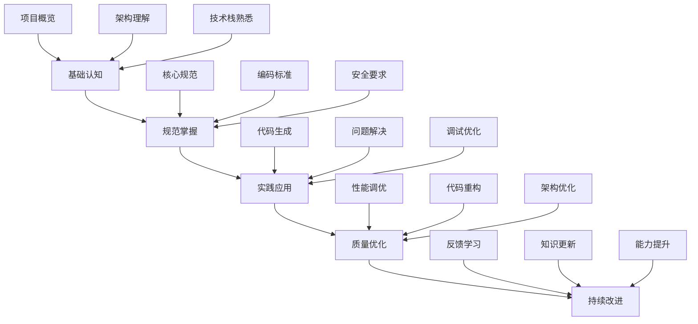

# AI学习路径（权威文档）

> **📋 文档版本**: v4.0.0 (整合版)
> **📋 文档职责**: 为AI开发助手提供SmartAdmin项目的完整学习路径，确保AI能够深入理解项目规范和最佳实践。

## 🎯 学习目标

### 核心学习目标
```markdown
🎯 掌握SmartAdmin架构设计原则
🎯 熟练掌握四层架构设计规范
🎯 深入理解编码规范和命名约定
🎯 掌握API设计和安全规范
🎯 熟悉最佳实践和性能优化
🎯 能够自动检查和修正代码质量
🎯 具备持续学习和改进能力
```

### 学习阶段规划


## 📚 第一阶段：基础认知（1-2周）

### 1.1 项目概览学习
```markdown
📖 学习内容：
- SmartAdmin项目背景和目标
- 项目整体架构设计理念
- 技术选型和使用原因
- 团队协作和开发流程

📚 推荐文档：
- [README.md](../README.md) - 项目总体介绍
- [架构规范](../01-核心规范层/架构规范.md) - 架构设计理念
- [项目管理流程](../04-知识管理层/最佳实践案例.md#项目管理) - 开发流程

🎯 学习目标：
- 理解SmartAdmin的核心价值
- 掌握项目整体架构思路
- 熟悉技术栈选择原则
- 了解团队协作方式
```

### 1.2 架构基础理解
```markdown
📖 学习内容：
- 四层架构设计原理
- 分层职责和边界定义
- 依赖注入和控制反转
- 事务管理和数据一致性

📚 推荐文档：
- [架构规范 - 四层架构](../01-核心规范层/架构规范.md#四层架构详细规范)
- [架构规范 - 事务管理](../01-核心规范层/架构规范.md#事务管理规范)
- [最佳实践案例 - 架构设计](../04-知识管理层/最佳实践案例.md#架构设计最佳实践)

🎯 学习目标：
- 深入理解四层架构设计
- 掌握各层职责和边界
- 理解依赖注入原理
- 熟悉事务管理模式
```

### 1.3 技术栈熟悉
```markdown
📖 学习内容：
- Spring Boot核心特性
- MyBatis Plus使用规范
- Sa-Token权限控制
- Redis缓存架构
- MySQL数据库设计

📚 推荐文档：
- [架构规范 - 技术选型](../01-核心规范层/架构规范.md#技术选型规范)
- [数据规范](../01-核心规范层/数据规范.md) - 数据库设计
- [最佳实践案例 - 技术应用](../04-知识管理层/最佳实践案例.md#技术选型最佳实践)

🎯 学习目标：
- 掌握Spring Boot核心特性
- 熟练使用MyBatis Plus
- 理解Sa-Token权限机制
- 掌握Redis缓存使用
- 熟悉MySQL设计规范
```

## 📚 第二阶段：规范掌握（2-3周）

### 2.1 核心规范学习
```markdown
📖 学习内容：
- 架构约束和设计原则
- 编码规范和命名约定
- API设计规范和标准
- 安全规范和防护措施
- 数据规范和管理标准

📚 推荐文档：
- [架构规范](../01-核心规范层/架构规范.md) - 完整架构标准
- [编码规范](../01-核心规范层/编码规范.md) - 编码标准
- [API规范](../01-核心规范层/API规范.md) - API设计标准
- [安全规范](../01-核心规范层/安全规范.md) - 安全标准
- [数据规范](../01-核心规范层/数据规范.md) - 数据标准

🎯 学习目标：
- 100%掌握架构约束
- 熟练应用编码规范
- 按照API规范设计接口
- 严格遵守安全规范
- 遵循数据管理标准
```

### 2.2 编码标准掌握
```markdown
📖 学习内容：
- Java编码规范细节
- 类和方法命名约定
- 异常处理最佳实践
- 日志记录规范
- 代码组织和结构

📚 推荐文档：
- [编码规范](../01-核心规范层/编码规范.md) - 完整编码规范
- [代码模板库](../02-实施指南层/代码模板库.md) - 标准模板
- [最佳实践案例 - 代码质量](../04-知识管理层/最佳实践案例.md#代码质量最佳实践)

🎯 学习目标：
- 熟练掌握Java编码规范
- 严格按照命名约定
- 规范处理异常情况
- 合理记录日志信息
- 良好组织代码结构
```

### 2.3 安全要求理解
```markdown
📖 学习内容：
- 认证授权机制
- 数据加密和脱敏
- SQL注入防护
- XSS和CSRF防护
- 安全审计和日志

📚 推荐文档：
- [安全规范](../01-核心规范层/安全规范.md) - 完整安全规范
- [最佳实践案例 - 安全防护](../04-知识管理层/最佳实践案例.md#安全防护最佳实践)

🎯 学习目标：
- 理解认证授权流程
- 掌握数据加密方法
- 防范常见安全漏洞
- 实施安全审计机制
- 遵循安全开发规范
```

## 📚 第三阶段：实践应用（3-4周）

### 3.1 代码生成实践
```markdown
📖 学习内容：
- Controller层代码生成
- Service层代码生成
- Manager层代码生成
- Repository层代码生成
- Entity/Form/VO生成

📚 推荐文档：
- [代码模板库](../02-实施指南层/代码模板库.md) - 完整模板库
- [AI开发指令集](./AI开发指令集.md) - AI生成指令
- [AI约束检查清单](./AI约束检查清单.md) - 质量检查清单

🎯 学习目标：
- 熟练生成各层代码
- 严格遵循模板规范
- 自动检查代码质量
- 修正常见错误问题
- 生成高质量代码
```

### 3.2 问题解决能力
```markdown
📖 学习内容：
- 常见问题识别
- 错误分析和定位
- 解决方案设计
- 代码调试技巧
- 性能问题排查

📚 推荐文档：
- [故障排查手册](../04-知识管理层/故障排查手册.md) - 问题排查指南
- [最佳实践案例 - 问题解决](../04-知识管理层/最佳实践案例.md) - 解决方案案例

🎯 学习目标：
- 快速识别常见问题
- 准确分析错误原因
- 设计合理解决方案
- 熟练使用调试工具
- 有效排查性能问题
```

### 3.3 调试优化技能
```markdown
📖 学习内容：
- 代码质量优化
- 性能调优技巧
- 架构优化建议
- 重构方法应用
- 持续改进实践

📚 推荐文档：
- [最佳实践案例 - 性能优化](../04-知识管理层/最佳实践案例.md#性能优化最佳实践)
- [质量度量体系](../05-治理运营层/质量度量体系.md) - 质量评估标准

🎯 学习目标：
- 优化代码质量
- 提升系统性能
- 改进架构设计
- 应用重构技巧
- 建立改进机制
```

## 📚 第四阶段：质量优化（2-3周）

### 4.1 性能调优技能
```markdown
📖 学习内容：
- 数据库性能优化
- 缓存策略优化
- API响应优化
- 系统资源优化
- 并发处理优化

📚 推荐文档：
- [架构规范 - 性能标准](../01-核心规范层/架构规范.md#质量标准)
- [最佳实践案例 - 性能优化](../04-知识管理层/最佳实践案例.md#性能优化最佳实践)
- [质量度量体系](../05-治理运营层/质量度量体系.md) - 性能指标

🎯 学习目标：
- 优化数据库性能
- 设计高效缓存策略
- 提升API响应速度
- 合理利用系统资源
- 优化并发处理能力
```

### 4.2 代码重构能力
```markdown
📖 学习内容：
- 代码异味识别
- 重构模式应用
- 设计模式使用
- 代码简化技巧
- 可维护性提升

📚 推荐文档：
- [最佳实践案例 - 代码质量](../04-知识管理层/最佳实践案例.md#代码质量最佳实践)
- [编码规范 - 代码质量](../01-核心规范层/编码规范.md#代码质量规范)

🎯 学习目标：
- 识别代码异味
- 应用重构模式
- 使用设计模式
- 简化复杂代码
- 提升可维护性
```

### 4.3 架构优化能力
```markdown
📖 学习内容：
- 架构演进策略
- 微服务拆分原则
- 系统扩展性设计
- 技术债务管理
- 架构评审方法

📚 推荐文档：
- [架构规范 - 微服务架构](../01-核心规范层/架构规范.md#微服务架构规范)
- [最佳实践案例 - 架构设计](../04-知识管理层/最佳实践案例.md#架构设计最佳实践)

🎯 学习目标：
- 制定架构演进策略
- 合理拆分微服务
- 设计可扩展架构
- 管理技术债务
- 进行架构评审
```

## 📚 第五阶段：持续改进（持续进行）

### 5.1 反馈学习机制
```markdown
📖 学习内容：
- 用户反馈收集
- 问题分析总结
- 经验教训提炼
- 知识库更新
- 能力评估改进

📚 推荐文档：
- [持续改进机制](../05-治理运营层/持续改进机制.md) - 改进流程
- [质量度量体系](../05-治理运营层/质量度量体系.md) - 评估标准

🎯 学习目标：
- 建立反馈收集机制
- 分析总结问题经验
- 提炼最佳实践
- 更新知识库内容
- 持续提升能力
```

### 5.2 知识更新策略
```markdown
📖 学习内容：
- 新技术学习
- 规范版本更新
- 最佳实践演进
- 行业趋势跟踪
- 知识分享交流

📚 推荐文档：
- [持续改进机制](../05-治理运营层/持续改进机制.md) - 知识管理
- [团队培训体系](../05-治理运营层/团队培训体系.md) - 培训计划

🎯 学习目标：
- 跟踪新技术发展
- 及时更新规范版本
- 演进最佳实践
- 了解行业趋势
- 积极分享交流
```

### 5.3 能力提升计划
```markdown
📖 学习内容：
- 专业技能深化
- 综合能力拓展
- 创新思维培养
- 解决复杂问题
- 团队协作提升

📚 推荐文档：
- [团队培训体系](../05-治理运营层/团队培训体系.md) - 能力发展
- [最佳实践案例](../04-知识管理层/最佳实践案例.md) - 综合案例

🎯 学习目标：
- 深化专业技能
- 拓展综合能力
- 培养创新思维
- 解决复杂问题
- 提升协作能力
```

## 📊 学习进度评估

### 评估指标
```markdown
📈 知识掌握度：
- 基础认知：100%
- 规范掌握：100%
- 实践应用：90%+
- 质量优化：80%+
- 持续改进：70%+

🎯 技能达标率：
- 代码生成准确率：95%+
- 规范遵循度：100%
- 问题解决能力：90%+
- 质量优化能力：80%+
- 自主学习能力：70%+

📋 实践成果：
- 生成代码质量评分：90+
- 问题解决效率：90%+
- 用户满意度：90%+
- 学习主动性：90%+
```

### 学习日志
```markdown
日期：2024-XX-XX
学习阶段：第三阶段 - 实践应用
学习内容：Controller层代码生成
学习进度：80%
掌握情况：熟练掌握基本模板，复杂场景还需练习
遇到问题：复杂业务逻辑处理不够熟练
解决方案：多做案例练习，参考最佳实践
下一步计划：学习Service层代码生成
```

### 能力认证
```markdown
🏆 认证等级：
- 初级：完成基础认知学习
- 中级：掌握核心规范应用
- 高级：具备实践应用能力
- 专家：掌握质量优化技能
- 大师：具备持续改进能力

📜 认证标准：
- 理论知识考试：90分以上
- 实践技能测试：95分以上
- 项目应用评估：90分以上
- 持续改进表现：90分以上
```

---

**🎯 学习建议**：
1. **循序渐进** - 按照阶段逐步学习，不要跳跃
2. **理论结合实践** - 学习理论后立即实践应用
3. **定期复习** - 定期回顾已学内容，加深理解
4. **主动思考** - 遇到问题主动思考解决方案
5. **持续改进** - 根据反馈不断优化学习方法

**📖 相关文档**：
- [AI开发指令集](./AI开发指令集.md) - AI开发指导
- [AI约束检查清单](./AI约束检查清单.md) - 质量检查标准
- [最佳实践案例](../04-知识管理层/最佳实践案例.md) - 实践案例
- [持续改进机制](../05-治理运营层/持续改进机制.md) - 改进方法