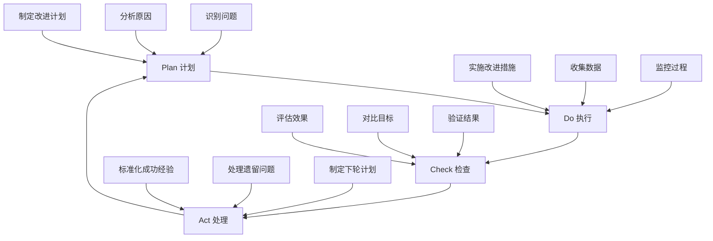

# 持续改进机制（权威文档）

> **📋 文档版本**: v4.0.0 (整合版)
> **📋 文档职责**: SmartAdmin项目的持续改进机制，确保文档体系和代码质量的持续优化。

## 🔄 改进循环流程

### PDCA循环应用


## 📋 改进计划制定

### 问题识别机制
```markdown
1. 数据驱动识别：
   - 质量指标监控
   - 用户反馈收集
   - 团队调研分析
   - 同行业对比

2. 主动发现机制：
   - 定期文档评审
   - 代码审查反馈
   - 技术债务分析
   - 最佳实践总结

3. 被动接收机制：
   - 用户问题反馈
   - 开发团队建议
   - 运维问题报告
   - 安全漏洞报告
```

### 改进优先级评估
```markdown
优先级评估矩阵：
高影响 + 高紧急 = P0 (立即处理)
高影响 + 低紧急 = P1 (本周处理)
低影响 + 高紧急 = P2 (本月处理)
低影响 + 低紧急 = P3 (下季度处理)

评估标准：
影响度：
- 对用户体验的影响程度
- 对开发效率的影响程度
- 对系统稳定性的影响程度
- 对团队协作的影响程度

紧急度：
- 问题发生的频率
- 问题的严重程度
- 解决问题的时效要求
- 资源投入的紧迫性
```

## 🚀 改进措施实施

### 文档改进流程
```java
// 文档改进管理
@Service
public class DocumentImprovementService {

    /**
     * 提交文档改进建议
     */
    public ImprovementRequest submitImprovement(ImprovementRequest request) {
        // 1. 验证改进建议
        validateImprovementRequest(request);

        // 2. 评估优先级
        request.setPriority(evaluatePriority(request));

        // 3. 分配负责人
        request.setAssignee(assignOwner(request));

        // 4. 设置计划完成时间
        request.setPlannedFinishDate(calculatePlannedDate(request));

        // 5. 保存改进请求
        improvementRepository.save(request);

        // 6. 发送通知
        notificationService.notifyImprovement(request);

        return request;
    }

    /**
     * 实施文档改进
     */
    public void implementImprovement(Long improvementId) {
        ImprovementRequest request = improvementRepository.findById(improvementId);

        try {
            // 1. 创建改进分支
            String branchName = createImprovementBranch(request);

            // 2. 实施改进
            implementDocumentChange(request, branchName);

            // 3. 代码审查
            performCodeReview(request, branchName);

            // 4. 测试验证
            validateChanges(request, branchName);

            // 5. 合并到主分支
            mergeChanges(branchName);

            // 6. 更新状态
            request.setStatus(ImprovementStatus.COMPLETED);
            request.setActualFinishDate(LocalDateTime.now());

            // 7. 记录改进效果
            recordImprovementEffect(request);

        } catch (Exception e) {
            request.setStatus(ImprovementStatus.FAILED);
            request.setFailureReason(e.getMessage());
            log.error("文档改进失败", e);
        }

        improvementRepository.save(request);
    }
}
```

### 质量改进措施
```markdown
代码质量改进：
1. 定期代码审查
2. 自动化质量检查
3. 重构技术债务
4. 性能优化
5. 安全加固

文档质量改进：
1. 内容准确性检查
2. 结构优化调整
3. 示例代码更新
4. 最佳实践补充
5. 用户反馈整合

流程改进：
1. 开发流程优化
2. 测试流程改进
3. 部署流程优化
4. 运维流程改进
5. 团队协作优化
```

## 📊 效果评估机制

### 量化指标评估
```java
// 改进效果评估
@Component
public class ImprovementEffectEvaluator {

    public ImprovementEffect evaluateImprovement(ImprovementRequest request) {
        ImprovementEffect effect = new ImprovementEffect();

        // 1. 改进前数据收集
        MetricsData beforeMetrics = collectMetricsBefore(request);

        // 2. 改进后数据收集
        MetricsData afterMetrics = collectMetricsAfter(request);

        // 3. 计算改进效果
        double improvementRate = calculateImprovementRate(beforeMetrics, afterMetrics);
        effect.setImprovementRate(improvementRate);

        // 4. 评估目标达成度
        double targetAchievementRate = calculateTargetAchievement(request, afterMetrics);
        effect.setTargetAchievementRate(targetAchievementRate);

        // 5. 评估用户满意度
        double userSatisfactionRate = evaluateUserSatisfaction(request);
        effect.setUserSatisfactionRate(userSatisfactionRate);

        // 6. 综合评分
        double overallScore = (improvementRate * 0.4) +
                            (targetAchievementRate * 0.4) +
                            (userSatisfactionRate * 0.2);
        effect.setOverallScore(Math.round(overallScore * 100) / 100.0);

        // 7. 确定改进等级
        effect.setGrade(determineImprovementGrade(effect.getOverallScore()));

        return effect;
    }

    private String determineImprovementGrade(double score) {
        if (score >= 90) return "显著改进";
        if (score >= 75) return "良好改进";
        if (score >= 60) return "一般改进";
        return "改进不明显";
    }
}
```

### 定性评估方法
```markdown
用户反馈评估：
1. 用户满意度调查
2. 使用体验访谈
3. 问题解决效果评估
4. 易用性评估

团队评估：
1. 开发效率提升
2. 代码质量改善
3. 团队协作改善
4. 知识传承效果

专家评估：
1. 技术专家评审
2. 行业专家建议
3. 同行业对比
4. 最佳实践对标
```

## 📈 知识管理与传承

### 经验总结机制
```java
// 经验知识库管理
@Service
public class ExperienceKnowledgeService {

    /**
     * 总结最佳实践
     */
    public BestPractice summarizeBestPractice(ImprovementEffect effect) {
        BestPractice practice = new BestPractice();

        // 1. 提取成功经验
        practice.setSuccessFactors(extractSuccessFactors(effect));

        // 2. 识别关键步骤
        practice.setKeySteps(identifyKeySteps(effect));

        // 3. 提炼可复制模式
        practice.setReplicablePatterns(extractReplicablePatterns(effect));

        // 4. 记录注意事项
        practice.setPrecautions(identifyPrecautions(effect));

        // 5. 制定推广计划
        practice.setPromotionPlan(createPromotionPlan(practice));

        // 6. 保存最佳实践
        bestPracticeRepository.save(practice);

        return practice;
    }

    /**
     * 更新知识库
     */
    public void updateKnowledgeBase(BestPractice practice) {
        // 1. 更新相关文档
        updateRelatedDocuments(practice);

        // 2. 更新代码模板
        updateCodeTemplates(practice);

        // 3. 更新培训材料
        updateTrainingMaterials(practice);

        // 4. 更新检查清单
        updateCheckLists(practice);

        // 5. 发布更新通知
        publishUpdateNotification(practice);
    }
}
```

### 知识传承机制
```markdown
传承方式：
1. 文档传承：
   - 完善的文档体系
   - 详细的操作指南
   - 丰富的示例代码

2. 培训传承：
   - 新员工培训
   - 技术分享会
   - 工作坊培训

3. 实践传承：
   - 师徒制指导
   - 代码审查
   - 项目实践

4. 工具传承：
   - 自动化工具
   - 检查清单
   - 模板库
```

## 🔄 反馈与调整机制

### 反馈收集机制
```java
// 反馈收集管理
@RestController
@RequestMapping("/api/feedback")
public class FeedbackController {

    @PostMapping("/submit")
    public ResponseDTO<String> submitFeedback(@RequestBody @Valid FeedbackForm form) {
        // 1. 验证反馈内容
        validateFeedback(form);

        // 2. 分类处理反馈
        FeedbackCategory category = categorizeFeedback(form);

        // 3. 分配处理人
        String assignee = assignFeedbackHandler(category, form);

        // 4. 创建反馈记录
        Feedback feedback = createFeedback(form, category, assignee);

        // 5. 发送通知
        notificationService.notifyFeedback(feedback);

        return ResponseDTO.ok("反馈提交成功");
    }

    @GetMapping("/my-feedback")
    public ResponseDTO<List<FeedbackVO>> getMyFeedback() {
        Long userId = UserContext.getCurrentUserId();
        List<Feedback> feedbackList = feedbackRepository.findBySubmitter(userId);
        return ResponseDTO.ok(convertToVO(feedbackList));
    }
}
```

### 动态调整机制
```markdown
调整触发条件：
1. 质量指标下降超过阈值
2. 用户反馈满意度低于目标
3. 重大安全漏洞发现
4. 技术栈升级需求
5. 业务需求重大变化

调整流程：
1. 问题识别与分析
2. 影响评估
3. 调整方案制定
4. 团队评审确认
5. 实施调整措施
6. 效果验证与总结

调整原则：
1. 数据驱动决策
2. 渐进式改进
3. 风险可控
4. 用户价值优先
5. 技术可行性保证
```

---

**🎯 持续改进原则**：
1. **用户中心** - 以用户需求为导向
2. **数据驱动** - 基于数据做决策
3. **持续迭代** - 小步快跑，持续优化
4. **知识沉淀** - 经验总结，知识传承
5. **团队协作** - 全员参与，共同改进

**📖 相关文档**：
- [质量度量体系](./质量度量体系.md) - 质量评估标准
- [团队培训体系](./团队培训体系.md) - 培训计划
- [最佳实践案例](../04-知识管理层/最佳实践案例.md) - 经验参考