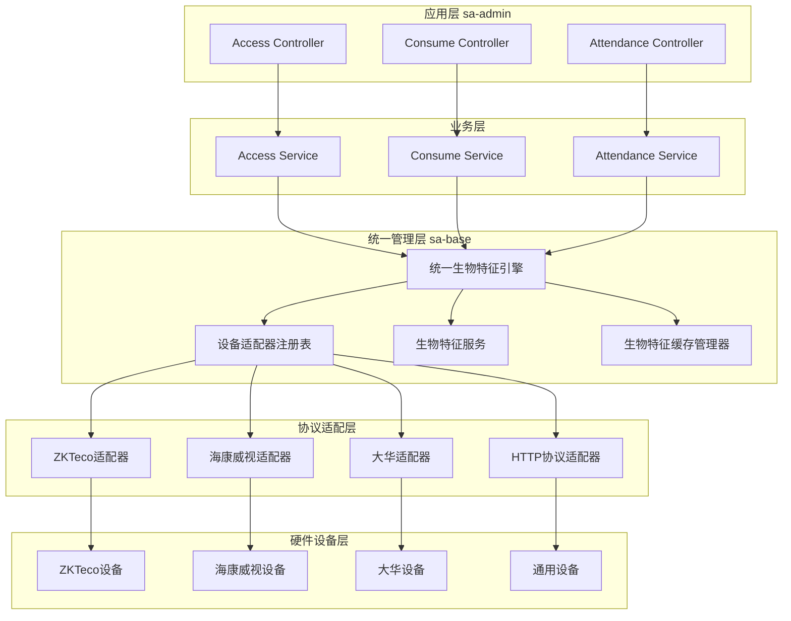
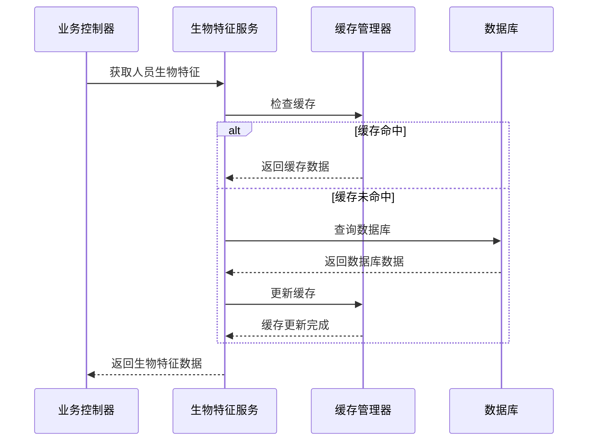
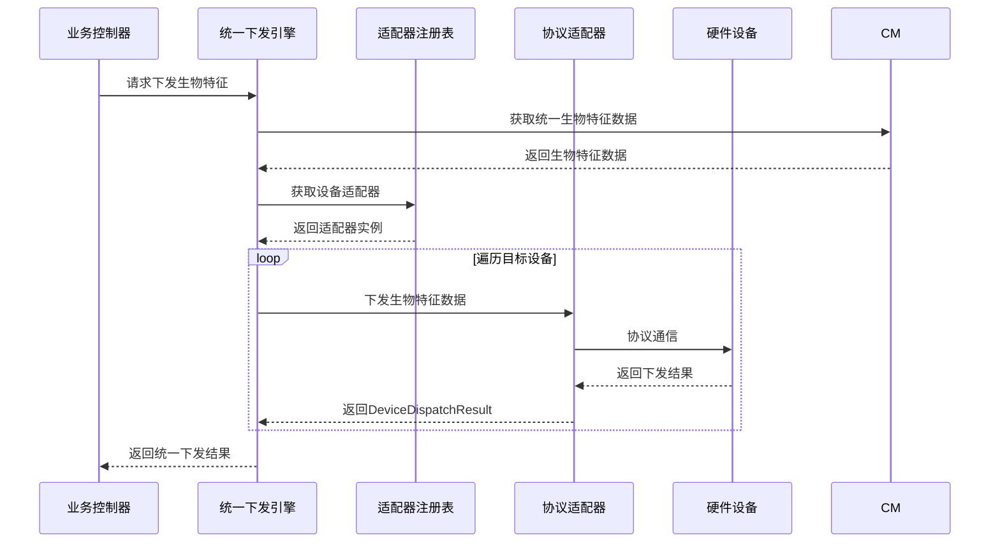
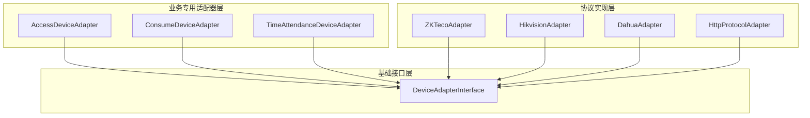
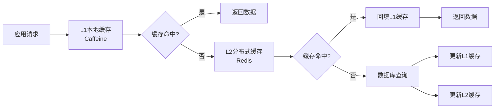
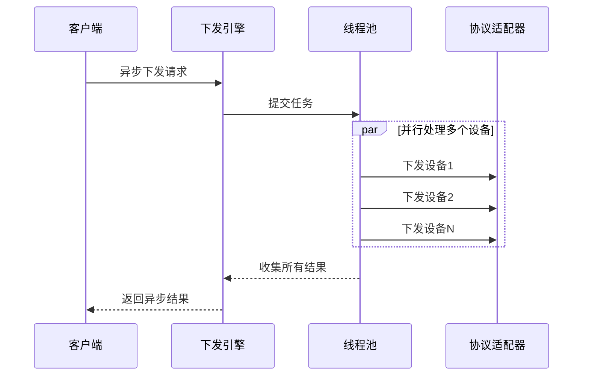

# 统一生物特征架构设计文档

**版本**: 1.0.0
**创建时间**: 2025-11-24
**最后更新**: 2025-11-24
**状态**: 已实现

## 📋 文档概述

本文档详细描述了IOE-DREAM项目中统一生物特征管理架构的设计和实现。该架构解决了生物特征数据分散在各业务模块的问题，实现了"设备下发生物特征模板时可以统一从同一处获取，且生物特征应该是每个人对应的生物特征"的核心需求。

## 🎯 核心目标

### 主要问题
1. **数据分散**: 生物特征数据散布在不同业务模块（门禁、消费、考勤等）
2. **重复实现**: 各模块都需要实现相似的下发逻辑
3. **数据不一致**: 缺乏统一的生物特征数据管理
4. **维护困难**: 协议变化需要修改多个模块

### 解决方案
1. **统一管理**: 将生物特征管理集中到base模块
2. **以人为中心**: 生物特征数据与人员强关联
3. **分层架构**: 基础层 + 业务层的分层设计
4. **协议解耦**: 设备协议与业务逻辑分离

## 🏗️ 架构设计

### 整体架构图



### 核心组件说明

#### 1. 统一生物特征下发引擎 (UnifiedBiometricDispatchEngine)
**职责**: 统一管理生物特征数据到各业务模块设备的下发工作

**核心功能**:
- 统一下发生物特征数据
- 支持批量下发和异步处理
- 失败重试机制
- 性能监控和统计

#### 2. 设备适配器注册表 (DeviceAdapterRegistry)
**职责**: 管理所有设备适配器的注册、查找和调用

**核心功能**:
- 自动注册Spring容器中的适配器
- 智设备类型和制造商查找适配器
- 支持动态注册和移除

#### 3. 生物特征服务 (PersonBiometricService)
**职责**: 统一的生物特征业务逻辑管理

**核心功能**:
- 生物特征数据的CRUD操作
- 生物特征质量验证
- 数据加密和安全处理

#### 4. 生物特征缓存管理器 (BiometricCacheManager)
**职责**: 提供高性能的生物特征数据访问

**核心功能**:
- 多级缓存（L1 Caffeine + L2 Redis）
- 智能缓存策略
- 缓存一致性保障

## 📊 数据流设计

### 生物特征数据获取流程



### 生物特征下发流程



## 🔧 协议适配器设计

### 分层适配器架构



### 协议适配器接口设计

#### DeviceAdapterInterface (基础接口)
```java
public interface DeviceAdapterInterface {
    String getSupportedDeviceType();
    List<String> getSupportedManufacturers();
    boolean supportsDevice(SmartDeviceEntity device);
    DeviceConnectionTest testConnection(SmartDeviceEntity device);
    DeviceDispatchResult dispatchBiometricData(SmartDeviceEntity device, Map<String, Object> biometricData);
    // ... 其他方法
}
```

#### AccessProtocolInterface (门禁专用接口)
```java
public interface AccessProtocolInterface {
    String getProtocolName();
    List<String> getSupportedManufacturers();
    DeviceDispatchResult remoteOpenDoor(SmartDeviceEntity device, String doorId);
    List<Map<String, Object>> getAccessRecords(SmartDeviceEntity device, String startTime, String endTime, Integer recordCount);
    // ... 门禁特有方法
}
```

## 🗄️ 数据模型设计

### 统一生物特征数据结构

#### BiometricDispatchRequest (下发请求)
```java
public class BiometricDispatchRequest {
    private final Long personId;           // 人员ID
    private final String personCode;         // 人员编号
    private final String personName;         // 人员姓名
    private final List<BiometricRecordEntity> biometricRecords;  // 生物特征记录列表
    private final List<SmartDeviceEntity> targetDevices;         // 目标设备列表
    private final Map<String, Object> dispatchOptions;          // 下发选项
}
```

#### 统一生物特征数据格式
```json
{
  "personId": 12345,
  "personCode": "EMP001",
  "personName": "张三",
  "timestamp": 1701234567890,
  "requestId": "uuid-string",
  "biometricData": {
    "FACE": [
      {
        "recordId": 1001,
        "biometricType": "FACE",
        "biometricData": "base64-encoded-face-data",
        "templateIndex": 0,
        "quality": 95,
        "templateVersion": "2.0"
      }
    ],
    "FINGERPRINT": [
      {
        "recordId": 1002,
        "biometricType": "FINGERPRINT",
        "biometricData": "base64-encoded-fingerprint-data",
        "templateIndex": 1,
        "quality": 92,
        "fingerId": "right_thumb"
      }
    ]
  },
  "biometricCount": 2
}
```

## 💾 缓存策略

### 多级缓存架构



### 缓存配置策略

| 缓存类型 | 最大条目 | 过期时间 | 用途 |
|---------|---------|---------|------|
| 人员生物特征 | 1000 | 60分钟 | 人员基础信息 |
| 生物特征模板 | 5000 | 30分钟 | 具体生物特征数据 |
| 设备生物特征映射 | 2000 | 120分钟 | 设备与人员关联关系 |
| 人员模板列表 | 500 | 45分钟 | 人员所有模板索引 |
| 统一生物特征数据 | 800 | 30分钟 | 下发使用的统一数据格式 |

## 🔄 异步处理机制

### 异步下发设计



### 批量处理优化

- **分批处理**: 大批量请求自动分批，避免内存溢出
- **并发控制**: 限制并发数，避免对设备造成压力
- **错误隔离**: 单个设备失败不影响其他设备下发

## 🔒 安全保障

### 1. 数据加密
```java
// SM4加密生物特征模板
public String encryptBiometricTemplate(String templateData) {
    // SM4加密实现
    return SM4Util.encrypt(templateData, secretKey);
}
```

### 2. 访问控制
- 基于角色的权限控制
- 设备级别权限验证
- 操作日志审计

### 3. 数据完整性
- 生物特征数据校验和验证
- 下发结果确认机制
- 数据版本控制

## 📈 性能监控

### 关键指标监控
- **下发成功率**: 监控各设备和各协议的下发成功率
- **响应时间**: 监控下发操作的平均响应时间
- **缓存命中率**: 监控各级缓存的命中率
- **错误率**: 监控各类错误的频率和类型

### 性能统计接口
```java
public Map<String, Object> getDispatchStatistics() {
    return Map.of(
        "totalRequests", totalRequests,
        "successRate", calculateSuccessRate(),
        "averageResponseTime", getAverageResponseTime(),
        "cacheHitRate", cacheManager.getCacheHitRate()
    );
}
```

## 🔧 使用示例

### 1. 单人生物特征下发

```java
// 构建下发请求
BiometricDispatchRequest request = new BiometricDispatchRequest(
    personId, "EMP001", "张三", biometricRecords, targetDevices, options
);

// 执行下发
UnifiedBiometricDispatchEngine engine = applicationContext.getBean(UnifiedBiometricDispatchEngine.class);
BiometricDispatchResult result = engine.dispatchBiometricData(request);

// 处理结果
if (result.isSuccess()) {
    log.info("生物特征下发成功: 成功={}, 失败={}",
        result.getSuccessCount(), result.getFailureCount());
} else {
    log.error("生物特征下发失败: {}", result.getMessage());
}
```

### 2. 异步批量下发

```java
List<BiometricDispatchRequest> requests = buildBatchRequests();
List<BiometricDispatchResult> results = engine.batchDispatchBiometricData(requests);

// 统计结果
int totalSuccess = results.stream().mapToInt(r -> r.getSuccessCount()).sum();
int totalFailure = results.stream().mapToInt(r -> r.getFailureCount()).sum();
log.info("批量下发完成: 总成功={}, 总失败={}", totalSuccess, totalFailure);
```

### 3. 设备适配器使用

```java
// 获取设备适配器
SmartDeviceEntity device = getDeviceById(deviceId);
DeviceAdapterRegistry registry = applicationContext.getBean(DeviceAdapterRegistry.class);
DeviceAdapterInterface adapter = registry.getAdapter(device);

// 执行设备操作
if (adapter != null) {
    DeviceConnectionTest testResult = adapter.testConnection(device);
    DeviceDispatchResult dispatchResult = adapter.dispatchBiometricData(device, biometricData);
}
```

## 🚀 扩展指南

### 添加新的协议适配器

1. **实现协议接口**
```java
@Component("customAdapter")
public class CustomProtocolAdapter implements AccessProtocolInterface {
    @Override
    public String getProtocolName() {
        return "Custom";
    }

    // 实现其他必需方法...
}
```

2. **注册适配器**
适配器会通过Spring自动注册到注册表中。

### 添加新的生物特征类型

1. **扩展枚举**
```java
public enum BiometricType {
    FACE("人脸", "FACE"),
    FINGERPRINT("指纹", "FINGERPRINT"),
    IRIS("虹膜", "IRIS"),
    VOICE("声纹", "VOICE"),  // 新增类型
    PALM("掌纹", "PALM");   // 新增类型
}
```

2. **更新缓存策略**
- 调整缓存配置参数
- 更新数据结构

## 📚 相关文档

- [设备适配器架构文档](DEVICE_ADAPTER_ARCHITECTURE_REDESIGN.md)
- [Spring Boot配置指南](../README.md)
- [缓存管理规范](docs/CACHE_MANAGEMENT_STANDARDS.md)
- [安全设计规范](docs/SECURITY_DESIGN_STANDARDS.md)

## 📋 版本历史

| 版本 | 日期 | 变更内容 | 变更人 |
|------|------|----------|--------|
| 1.0.0 | 2025-11-24 | 初始版本，完成统一生物特征架构设计 | SmartAdmin Team |
| 1.0.1 | 2025-11-24 | 优化缓存策略，添加性能监控 | SmartAdmin Team |

## 🤝 贡献指南

### 开发规范
1. 遵循Spring Boot和Java 17开发规范
2. 使用SLF4J进行日志记录
3. 实现完整的单元测试
4. 添加详细的JavaDoc文档

### 代码审查
1. 架构合规性检查
2. 性能影响评估
3. 安全性审查
4. 测试覆盖率要求≥80%

---

**注意**: 本文档将随架构演进持续更新，请确保使用最新版本。