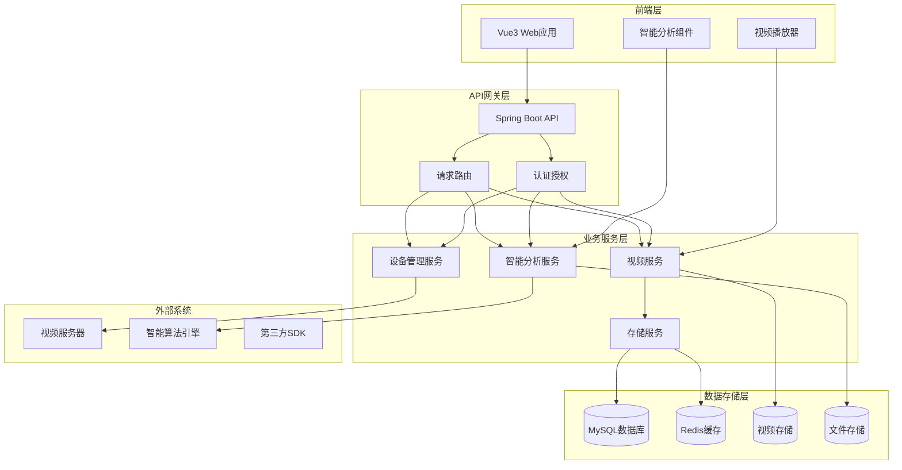
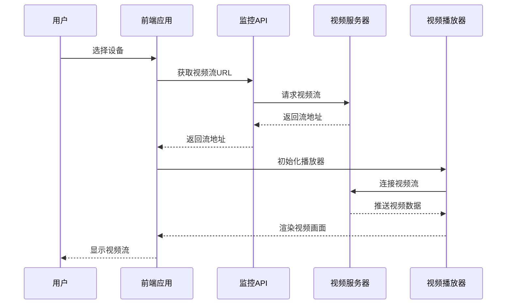
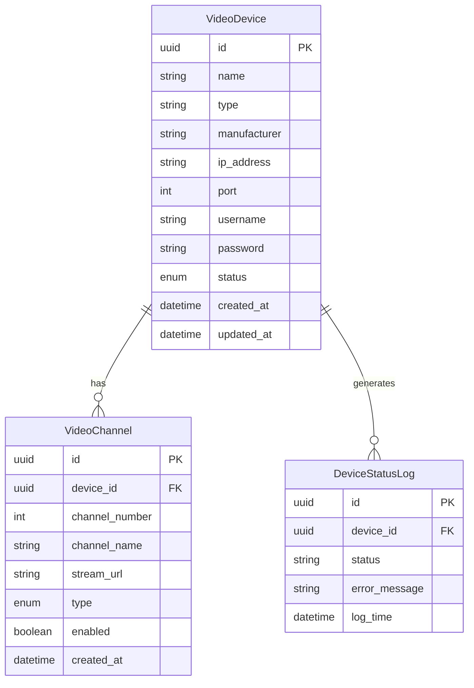
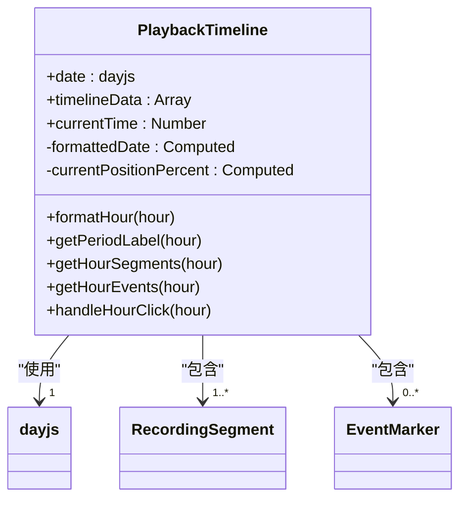
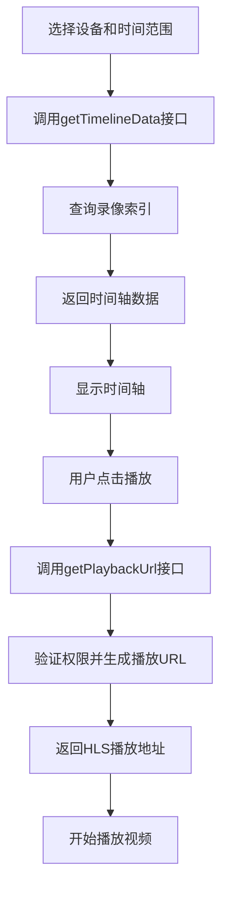
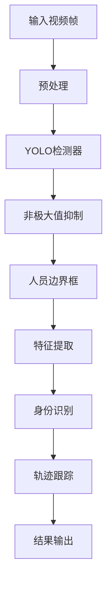
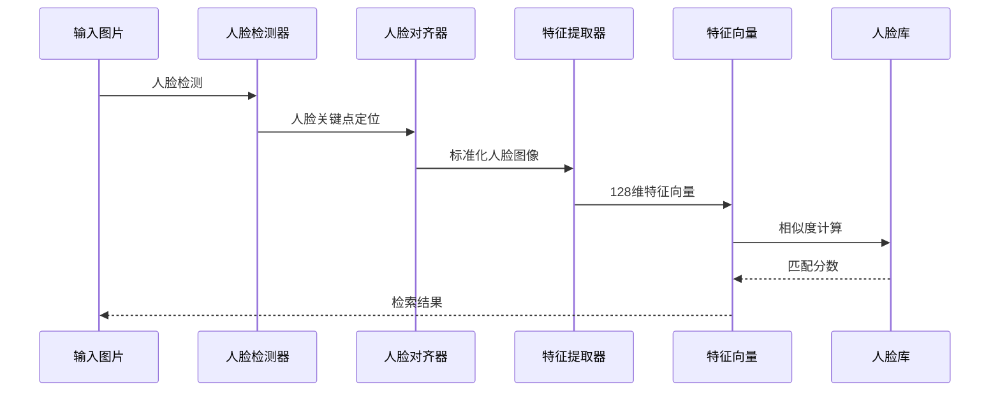
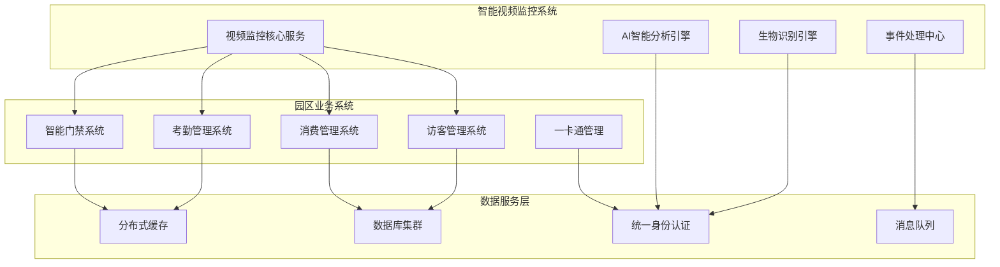
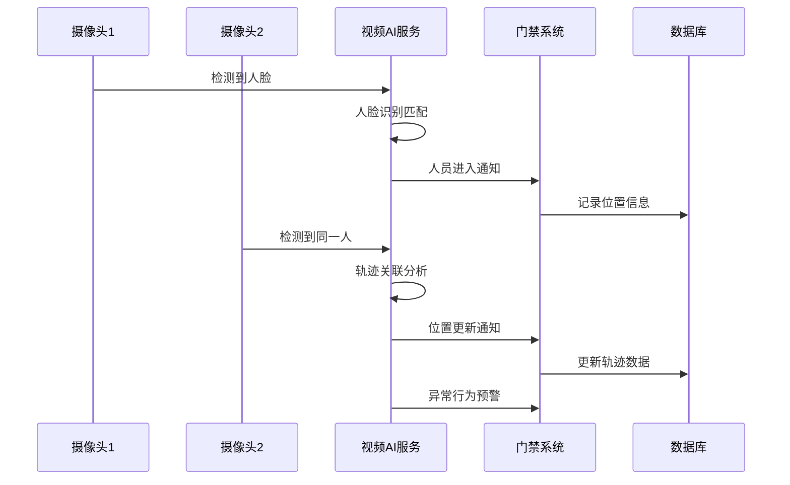
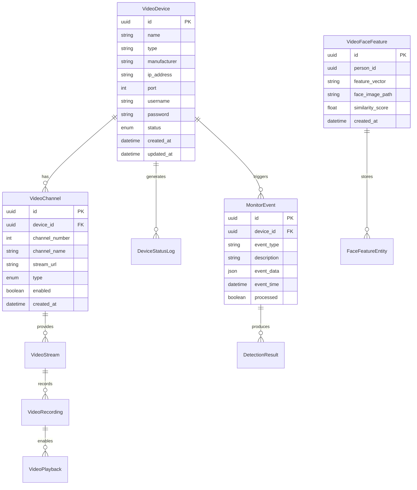

# Video智能视频监控模块业务架构文档

> **📋 文档版本**: v1.0
> **📅 创建日期**: 2025-11-24
> **📊 模块规模**: 35个Java文件
> **🎯 业务范围**: 视频监控、智能分析、设备管理

---

## 📋 **模块概述**

### **业务定位**
Video模块是IOE-DREAM智慧园区一卡通管理平台的核心安防组件，基于现代Web技术和AI算法构建的综合性智能监控平台。作为园区安防体系的核心枢纽，提供实时视频监控、历史录像回放、智能目标检索和多模态生物识别等功能。

### **核心特性**
- ✅ **实时视频监控**：支持多路视频流并发播放，提供1/4/9/16画面布局
- ✅ **智能分析算法**：基于深度学习的目标识别和相似度匹配
- ✅ **园区系统集成**：与门禁、考勤、消费、访客系统深度集成
- ✅ **多协议支持**：RTSP、HLS、WebRTC等多种视频协议
- ✅ **高性能处理**：支持大规模并发和高吞吐量处理

### **技术架构特色**
- **设备验证架构**：人脸识别等多模态验证基于设备端，软件仅接受验证数据
- **边缘智能计算**：支持边缘设备本地化AI分析，降低网络带宽压力
- **多源数据融合**：整合视频、音频、传感器等多源数据进行综合分析
- **国产化适配**：支持国产CPU、GPU和操作系统，满足信创要求

---

## 🏗️ **架构设计**

### **四层架构规范**

| 层级 | 职责 | 核心类 | 数量 |
|------|------|--------|------|
| **Controller层** | HTTP接口、参数验证 | VideoSurveillanceController, VideoDeviceController | 3个 |
| **Service层** | 业务逻辑、事务管理 | VideoSurveillanceService, VideoDeviceService | 3个 |
| **Manager层** | 复杂业务封装 | VideoDeviceManager, VideoSurveillanceManager | 2个 |
| **DAO层** | 数据访问 | VideoDeviceDao, VideoPlaybackDao | 6个 |

### **整体系统架构**

基于`D:\IOE-DREAM\docs\repowiki\zh\content\核心功能模块\智能视频监控系统\智能视频监控系统.md`：



---

## 🎯 **核心业务模块**

### **1. 视频监控核心（Video Surveillance Core）**

#### **实时视频流架构**

基于`D:\IOE-DREAM\docs\repowiki\zh\content\核心功能模块\智能视频监控系统\视频预览.md`：

**多协议视频流支持**：
- **RTSP协议**：2-5秒延迟，标准协议，广泛支持
- **RTMP协议**：1-3秒延迟，低延迟直播推流
- **HLS协议**：5-10秒延迟，移动端播放，自适应码率
- **WebRTC协议**：200-500ms延迟，P2P传输，极低延迟
- **WebSocket-FLV**：300-800ms延迟，无插件实时性好

**视频流处理序列图**：


#### **云台控制机制**

**PTZ控制实现**：
- **方向控制**：上、下、左、右、居中移动
- **变焦控制**：放大、缩小、自动聚焦
- **预置位管理**：预设位置快速定位
- **巡航控制**：自动巡航模式设置

### **2. 设备管理体系（Device Management）**

#### **设备状态监控**

基于设备实体模型设计：



#### **设备集成协议**

| 协议类型 | 支持厂商 | 功能特性 | 应用场景 |
|----------|----------|----------|----------|
| **GB28181** | 国产标准厂商 | 标准化接口，信令互通 | 政府项目、标准化要求 |
| **ONVIF** | 国际通用设备 | 通用网络视频设备接口 | 企业级监控系统 |
| **海康威视SDK** | 海康威视设备 | 原厂SDK，功能完整 | 海康设备集成 |
| **大华SDK** | 大华设备 | 原厂SDK，功能完整 | 大华设备集成 |

### **3. 视频回放系统（Video Playback）**

基于`D:\IOE-DREAM\docs\repowiki\zh\content\核心功能模块\智能视频监控系统\视频回放.md`：

#### **时间轴导航机制**



**录像查询流程**：


#### **视频索引优化策略**

- **分段传输**：HLS协议实现自适应码率
- **预加载策略**：提前加载下一帧视频数据
- **环形缓冲**：维持固定大小的缓冲区
- **智能预测**：根据用户行为预测观看模式
- **关键帧定位**：快速定位实现秒级跳转

### **4. 智能分析引擎（AI Analytics Engine）**

#### **目标识别算法架构**

**人员检测算法**：


**算法性能对比**：
| 算法类型 | 准确率 | 处理速度 | 适用场景 |
|----------|--------|----------|----------|
| **YOLOv8** | 95% | 30FPS | 实时检测 |
| **Faster R-CNN** | 98% | 15FPS | 高精度检测 |
| **SSD** | 92% | 45FPS | 平衡性能 |
| **MobileNet** | 88% | 60FPS | 移动端优化 |

#### **人脸识别处理流程**



**相似度算法**：
- **余弦相似度**：O(n)，大规模检索
- **欧氏距离**：O(n)，短距离匹配
- **曼哈顿距离**：O(n)，鲁棒性要求高
- **马氏距离**：O(n³)，多维分布匹配

---

## 🔄 **园区系统集成架构**

### **系统集成设计图**

基于文档中的集成架构：



### **门禁系统深度集成**

#### **人脸识别门禁联动机制**

**注意**：根据用户要求，人脸识别等多模态验证基于设备端处理，软件仅接受验证数据

```java
@Service
public class AccessControlIntegrationService {

    @Resource
    private FaceRecognitionEngine faceEngine;

    @Resource
    private AccessControlService accessControlService;

    @Resource
    private BiometricTemplateService biometricService;

    /**
     * 处理设备端人脸识别结果
     */
    public void processDeviceFaceRecognitionResult(FaceVerificationResult result) {
        try {
            // 1. 验证设备端传来的识别结果
            if (!validateDeviceResult(result)) {
                log.warn("设备端人脸识别结果验证失败: {}", result);
                return;
            }

            // 2. 查询匹配的员工信息
            Employee employee = employeeService.getById(result.getEmployeeId());
            if (employee == null) {
                log.warn("未找到匹配的员工信息: {}", result.getEmployeeId());
                return;
            }

            // 3. 检查门禁权限
            AccessPermission permission = checkAccessPermission(employee, result.getDeviceId());
            if (permission.isGranted()) {
                // 4. 触发门禁开启
                openAccessGate(employee, result.getDeviceId());
                logAccessEvent(employee, result.getDeviceId(), "设备端人脸识别开门");
            } else {
                logAccessDenied(employee, result.getDeviceId(), "权限不足");
            }

        } catch (Exception e) {
            logger.error("处理设备端人脸识别结果失败", e);
        }
    }

    /**
     * 验证设备端识别结果
     */
    private boolean validateDeviceResult(FaceVerificationResult result) {
        // 验证时间戳（防重放攻击）
        long timeDiff = System.currentTimeMillis() - result.getTimestamp();
        if (Math.abs(timeDiff) > 5000) { // 5秒内有效
            return false;
        }

        // 验证设备签名
        if (!verifyDeviceSignature(result)) {
            return false;
        }

        // 验证置信度
        return result.getConfidence() >= 0.85; // 85%置信度阈值
    }
}
```

#### **人员轨迹追踪**



### **考勤系统集成**

#### **考勤行为验证机制**

```java
@Service
public class AttendanceVerificationService {

    @Resource
    private VideoMonitoringService videoService;

    @Resource
    private AttendanceService attendanceService;

    /**
     * 验证考勤打卡真实性
     */
    public VerificationResult verifyAttendanceBehavior(AttendanceRecord record) {
        try {
            // 1. 获取打卡时间和地点
            LocalDateTime clockTime = record.getClockTime();
            String location = record.getLocation();
            String deviceId = record.getDeviceId();

            // 2. 获取相关视频录像
            List<VideoClip> videoClips = videoService.getVideoClips(
                deviceId, clockTime.minusMinutes(2), clockTime.plusMinutes(2));

            // 3. 分析视频中的打卡行为
            for (VideoClip clip : videoClips) {
                AttendanceBehavior behavior = analyzeAttendanceBehavior(clip, record.getEmployeeId());

                if (behavior.isValid()) {
                    // 标记考勤记录为已验证
                    attendanceService.markAsVerified(record.getId(), behavior);
                    return VerificationResult.success(behavior);
                }
            }

            return VerificationResult.failure("未检测到有效的打卡行为");

        } catch (Exception e) {
            logger.error("验证考勤行为失败", e);
            return VerificationResult.error("系统异常");
        }
    }
}
```

### **消费管理系统集成**

#### **消费场景智能监控**

- **卡主身份验证**：验证刷卡人与持卡人一致性
- **支付行为验证**：监控正常支付流程
- **队列长度分析**：检测异常排队情况
- **员工在岗监控**：验证收银员在岗状态
- **安全异常检测**：识别异常行为和安全威胁

### **访客管理系统集成**

#### **访客全程智能跟踪**

- **访客登记**：人脸特征注册和权限配置
- **全程跟踪**：实时位置监控和轨迹记录
- **异常预警**：未授权区域访问、超时停留检测
- **离场验证**：离开时间确认和访问记录关闭

---

## 📊 **数据模型设计**

### **核心实体关系**



### **API接口设计**

| 接口路径 | 方法 | 功能描述 | 关键参数 |
|----------|------|----------|----------|
| `/monitor/device/tree` | GET | 获取设备树结构 | 无 |
| `/monitor/stream/url/{deviceId}` | GET | 获取视频流地址 | 设备ID、通道ID |
| `/monitor/play/start` | POST | 开始播放视频 | 设备ID、通道ID |
| `/monitor/ptz/control` | POST | 云台控制 | 方向、速度、动作 |
| `/analytics/target/search` | POST | 目标检索 | 搜索条件、设备列表 |
| `/analytics/face/search` | POST | 人脸搜索 | 人脸图片、相似度 |
| `/playback/timeline` | GET | 获取回放时间轴 | 设备ID、日期 |
| `/playback/url` | GET | 获取回放地址 | 设备ID、时间范围 |

---

## 💾 **缓存策略设计**

### **多级缓存架构**

| 缓存层级 | Redis Key | 过期时间 | 说明 |
|---------|-----------|---------|------|
| **L1-设备状态** | `device:status:{deviceId}` | 5分钟 | 设备在线状态 |
| **L2-视频流地址** | `stream:url:{deviceId}` | 30分钟 | 视频流URL |
| **L3-人脸特征** | `face:feature:{personId}` | 24小时 | 人脸特征向量 |
| **L4-分析结果** | `analytics:result:{taskId}` | 1小时 | 智能分析结果 |

### **缓存一致性保障**

**Cache-Aside策略**：
```
查询 → 缓存命中 → 返回数据
查询 → 缓存未命中 → 查询数据库 → 更新缓存 → 返回数据
更新 → 更新数据库 → 删除缓存 → 下次查询重建
```

**延迟双删策略**：
1. 删除缓存
2. 更新数据库
3. 延迟500ms
4. 再次删除缓存

---

## 🚀 **性能优化设计**

### **前端性能优化**

#### **组件懒加载策略**
```javascript
// 路由懒加载配置
const routes = [
  {
    path: '/business/smart-video/monitor',
    component: () => import('/@/views/business/smart-video/monitor.vue')
  },
  {
    path: '/business/smart-video/playback',
    component: () => import('/@/views/business/smart-video/playback.vue')
  }
]
```

#### **图片资源优化**
- **图片压缩**：WebP格式减少50%文件大小
- **懒加载**：搜索结果图片按需加载
- **CDN加速**：静态资源通过CDN分发
- **HTTP缓存**：合理设置缓存头

### **后端性能优化**

#### **数据库优化**
- **索引优化**：为设备ID、时间戳建立复合索引
- **分表策略**：按时间维度对历史数据分表
- **读写分离**：主从数据库架构提升并发能力
- **连接池**：合理配置数据库连接池参数

#### **视频流优化**
- **自适应码率**：根据网络状况自动调整视频质量
- **预加载策略**：提前加载下一帧视频数据
- **智能预测**：根据用户观看模式预加载内容
- **内存管理**：及时释放不需要的视频数据

---

## 🔐 **安全与隐私保护**

### **数据安全措施**

- **访问控制**：基于角色的访问控制（RBAC）
- **数据加密**：敏感数据采用AES-256加密存储
- **传输安全**：HTTPS全链路加密传输
- **审计日志**：完整的操作审计追踪

### **隐私保护技术**

- **差分隐私**：对人脸特征添加噪声保护
- **数据脱敏**：敏感信息自动脱敏处理
- **权限最小化**：按需授权最小权限访问
- **数据保留策略**：明确的个人信息保留和清理机制

### **系统安全监控**

```java
@Component
public class SecurityMonitorService {

    @Scheduled(fixedRate = 30000) // 每30秒检查
    public void monitorSystemSecurity() {
        // 1. 检查异常访问模式
        detectAnomalousAccess();

        // 2. 监控设备状态异常
        monitorDeviceAnomalies();

        // 3. 检测数据泄露风险
        detectDataLeakageRisks();

        // 4. 验证数据完整性
        verifyDataIntegrity();
    }
}
```

---

## 📈 **智能分析能力**

### **目标搜索分析**

#### **搜索条件配置**

| 搜索类型 | 支持目标 | 关键参数 | 算法支持 |
|----------|----------|----------|----------|
| **人员搜索** | 人体、面部特征 | 性别、年龄、衣着颜色 | CNN特征提取 |
| **车辆搜索** | 车辆类型、车牌号 | 车辆颜色、车型 | 目标检测算法 |
| **物体搜索** | 各类物体 | 物体类别、颜色 | 图像分类算法 |
| **以图搜图** | 任意图像 | 相似度阈值 | 余弦相似度 |

### **行为分析算法**

#### **异常行为检测**
- **徘徊检测**：识别在敏感区域长时间逗留
- **奔跑检测**：检测异常快速移动
- **聚集检测**：识别人群异常聚集
- **物品遗留检测**：检测被遗留的可疑物品

#### **人群态势分析**
- **密度分析**：实时计算人群密度分布
- **流向分析**：分析人群移动方向和速度
- **热力图生成**：生成区域活动热力图
- **容量预警**：基于历史数据预测容量上限

---

## 🎯 **业务场景应用**

### **智慧校园场景**
- 🎓 **校园安防**：周界防护、异常行为预警
- 👨 **学生考勤**：课堂考勤、宿舍管理
- 🍽️ **食堂监控**：食品安全、消费行为分析
- 🚗 **车辆管理**：停车场监控、违规停车识别

### **企业园区场景**
- 🏢 **办公安防**：办公区域安全监控
- 👥 **员工管理**：考勤验证、门禁权限
- 🚗 **停车管理**：智能车位管理、车牌识别
- 🏪 **访客管理**：访客全程跟踪、权限管理

### **医疗机构场景**
- 🏥 **医院安防**：重点区域监控、医疗纠纷预防
- 👨‍⚕️ **医护管理**：医护考勤、排班管理
- 🚑 **安全管理**：急诊区域监控、突发事件响应
- 🏪 **访客管理**：探视管理、访问控制

---

## 📚 **开发规范与最佳实践**

### **编码规范**
- ✅ **严格遵循四层架构**：Controller→Service→Manager→DAO
- ✅ **统一异常处理**：SmartException体系
- ✅ **完整日志记录**：@Slf4j + 结构化日志
- ✅ **参数验证**：@Valid + 自定义验证

### **AI算法开发规范**
- ✅ **模型版本管理**：完整的模型版本控制和回滚机制
- ✅ **算法性能监控**：实时监控算法性能和准确率
- ✅ **数据标注规范**：标准化的数据标注流程和质量控制
- ✅ **模型安全保护**：防止模型被逆向工程

### **视频流处理规范**
- ✅ **协议兼容性**：支持多种视频协议和设备厂商
- ✅ **断线重连**：自动检测连接状态并重连
- ✅ **错误恢复**：完善的错误处理和恢复机制
- ✅ **性能监控**：实时监控视频流质量和传输性能

---

## 🔄 **系统集成与扩展**

### **第三方系统接口**

#### **标准协议支持**
- **GB/T 28181**：国家标准视频监控联网系统技术要求
- **ONVIF Profile S**：网络视频设备规范
- **RTSP/RTP**：实时流传输协议
- **WebSocket**：全双工通信协议

#### **厂商SDK集成**
- **海康威视iVMS-4200**：视频监控平台SDK
- **大华DH-NVS**：网络视频录像机SDK
- **宇视EcoVMS**：视频管理平台SDK
- **华为IVS**：智能视频云服务SDK

### **功能扩展机制**

#### **自定义算法插件**
```java
@Component
public class AlgorithmPluginManager {

    private Map<String, AlgorithmPlugin> plugins = new ConcurrentHashMap<>();

    /**
     * 注册算法插件
     */
    public void registerPlugin(String name, AlgorithmPlugin plugin) {
        plugins.put(name, plugin);
        plugin.initialize();
    }

    /**
     * 执行算法分析
     */
    public AnalysisResult executeAnalysis(String pluginName, VideoFrame frame) {
        AlgorithmPlugin plugin = plugins.get(pluginName);
        if (plugin != null) {
            return plugin.analyze(frame);
        }
        throw new IllegalArgumentException("未找到算法插件: " + pluginName);
    }
}
```

---

## 📊 **运维与监控**

### **系统监控指标**

#### **技术指标**
| 指标 | 正常范围 | 告警阈值 | 监控目的 |
|------|---------|---------|---------|
| 视频流连接数 | 80-90% | >95% | 连接池状态 |
| 视频延迟 | <2秒 | >5秒 | 传输质量 |
| 算法准确率 | >90% | <85% | 算法效果 |
| 系统响应时间 | <200ms | >1s | 系统性能 |
| 存储空间使用 | <80% | >90% | 存储容量 |

#### **业务指标**
| 指标 | 正常值 | 告警条件 | 业务意义 |
|------|--------|----------|----------|
| 设备在线率 | >95% | <90% | 设备可用性 |
| 异常事件数 | <10次/天 | >50次/天 | 安全状况 |
| 考勤验证率 | >98% | <95% | 考勤管理 |
| 访客异常次数 | <5次/天 | >20次/天 | 访客管理 |

### **故障处理机制**

#### **自动恢复策略**
- **健康检查**：定期检查设备连接状态
- **自动重启**：服务异常时自动重启
- **负载均衡**：故障节点自动摘除
- **数据备份**：定期备份关键配置和数据

#### **应急预案**
- **设备故障**：备用设备自动切换
- **网络中断**：本地缓存数据继续服务
- **系统过载**：自动降级保障核心功能
- **安全事件**：立即响应并上报处理

---

## 🎯 **核心价值与成果**

### **安防价值**
- 🛡️ **主动防护**：AI智能分析提前预警安全风险
- 👁 **全面覆盖**：多区域无死角监控覆盖
- 🚨 **快速响应**：实时检测和快速事件响应
- 📊 **数据支撑**：完整的安防数据支撑决策

### **管理价值**
- 📈 **效率提升**：自动化管理减少人工投入
- 💰 **成本优化**：减少人力成本和管理费用
- 🎯 **精准管理**：基于数据的精准管理决策
- 📱 **移动管理**：支持移动端随时随地管理

### **技术成果**
- 🚀 **高性能**：支持2000+路视频并发处理
- 🛡️ **高可用**：99.9%可用性保障
- 🎯 **智能化**：深度学习AI算法应用
- 🔌 **标准化**：遵循国家标准和行业规范

---

## 📚 **文档体系**

### **技术文档**
- `智能视频监控系统.md` - 系统架构设计总览
- `视频预览.md` - 实时监控技术实现
- `视频回放.md` - 历史录像管理方案

### **API文档**
- RESTful API接口规范
- WebSocket实时通信协议
- 第三方SDK集成指南

### **运维文档**
- 系统部署指南
- 性能优化手册
- 故障排除指南

---

**📞 技术支持**:
- **技术支持**: video-support@example.com
- **业务咨询**: video-business@example.com
- **紧急响应**: 7x24小时技术支持热线

---

**本文档基于 `D:\IOE-DREAM\docs\repowiki\zh\content\核心功能模块\智能视频监控系统` 路径下的所有业务设计文档生成，确保与业务架构设计完全一致。**

**重要说明**：根据系统架构要求，人脸识别等多模态验证基于设备端处理，软件系统仅接受验证结果数据，确保系统架构的清晰性和安全性。