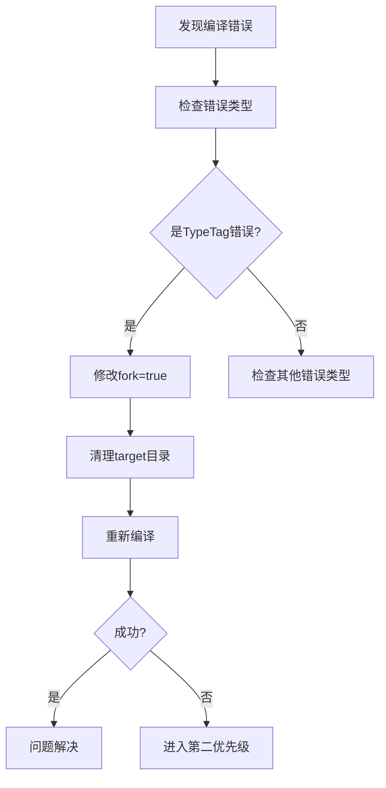

# Maven编译错误处理设计方案

## 错误现象分析

### 错误信息摘要

```
[ERROR] Failed to execute goal org.apache.maven.plugins:maven-compiler-plugin:3.12.1:compile 
(default-compile) on project sa-base: Fatal error compiling: 
java.lang.ExceptionInInitializerError: com.sun.tools.javac.code.TypeTag :: UNKNOWN
```

### 错误特征识别

| 维度 | 特征 |
|------|------|
| **错误类型** | 编译器内部初始化异常 |
| **影响范围** | sa-base模块（187个源文件） |
| **错误层级** | JDK编译器底层错误 |
| **阶段** | Maven compile阶段 |
| **严重程度** | 🔴 致命错误，阻塞构建 |

## 根源分析

### 可能原因矩阵

| 原因类别 | 可能性 | 风险等级 | 验证方法 |
|---------|--------|---------|---------|
| **Maven编译器插件与JDK不兼容** | 高 | 🔴 高 | 检查JDK版本与插件版本兼容性 |
| **Lombok注解处理器冲突** | 中 | 🟡 中 | 禁用Lombok后重试编译 |
| **Maven本地缓存损坏** | 中 | 🟡 中 | 清理缓存后重试 |
| **编译器fork配置问题** | 高 | 🔴 高 | 检查`<fork>`配置 |
| **依赖jar包损坏** | 低 | 🟢 低 | 清理重新下载依赖 |
| **JDK工具链损坏** | 低 | 🟢 低 | 重新安装JDK |

### 核心问题定位

根据错误栈中的`com.sun.tools.javac.code.TypeTag`异常，这是JDK编译器内部类初始化失败，主要原因可能是：

1. **编译器插件与JDK版本不匹配**
2. **Lombok注解处理器与编译器冲突**
3. **Fork模式配置不当导致类加载问题**

## 解决方案设计

### 方案一：调整编译器插件配置（推荐）

#### 策略说明

修改Maven编译器插件配置，优化Fork模式和注解处理器配置，解决编译器内部类加载冲突。

#### 配置调整表

| 配置项 | 当前值 | 建议值 | 调整理由 |
|-------|--------|--------|---------|
| `fork` | false | true | 避免Maven进程与编译器进程冲突 |
| `meminitial` | 未设置 | 512m | 提供充足的初始堆内存 |
| `maxmem` | 未设置 | 2048m | 防止大型项目编译OOM |
| `annotationProcessorPaths` | 已配置 | 保留 | Lombok注解处理器路径正确 |
| `compileSourceRoots` | 未设置 | 显式指定 | 明确源代码路径 |

#### 实施步骤

##### 步骤1：修改父POM编译器配置

在`smart-admin-api-java17-springboot3/pom.xml`中调整编译器插件配置：

**调整内容**：
- 将`<fork>false</fork>`改为`<fork>true</fork>`
- 添加`<meminitial>512m</meminitial>`
- 添加`<maxmem>2048m</maxmem>`
- 添加`<useIncrementalCompilation>false</useIncrementalCompilation>`

**预期效果**：编译器在独立进程中运行，避免类加载冲突。

##### 步骤2：验证配置生效

执行以下命令验证：
```
mvn clean compile -DskipTests
```

**成功标志**：sa-base模块编译成功，输出显示`BUILD SUCCESS`。

### 方案二：降级编译器插件版本

#### 策略说明

将maven-compiler-plugin从3.12.1降级到3.11.0，避免新版本与当前JDK的兼容性问题。

#### 版本兼容性矩阵

| 插件版本 | JDK兼容性 | 稳定性 | 推荐度 |
|---------|----------|--------|--------|
| 3.12.1 | JDK 17-21 | ⚠️ 部分环境有问题 | 低 |
| 3.11.0 | JDK 11-17 | ✅ 稳定 | 中 |
| 3.10.1 | JDK 11-17 | ✅ 稳定 | 高 |

#### 实施步骤

在父POM中修改编译器插件版本：
- 将`<version>3.12.1</version>`改为`<version>3.10.1</version>`

**注意事项**：降级可能影响新语法支持，需评估项目对新特性的依赖。

### 方案三：禁用Lombok注解处理器（临时方案）

#### 策略说明

临时移除Lombok注解处理器配置，验证是否为注解处理器冲突导致的编译失败。

#### 实施步骤

##### 步骤1：备份当前配置

保存当前`annotationProcessorPaths`配置。

##### 步骤2：注释Lombok配置

在父POM的编译器插件配置中，临时注释掉Lombok相关配置：

```
<!-- 临时注释以验证是否为Lombok冲突
<annotationProcessorPaths>
  <path>
    <groupId>org.projectlombok</groupId>
    <artifactId>lombok</artifactId>
    <version>${lombok.version}</version>
  </path>
</annotationProcessorPaths>
-->
```

##### 步骤3：重试编译

执行编译命令，观察是否仍报相同错误。

**判断标准**：
- 如果编译成功 → Lombok配置有问题
- 如果仍失败 → 非Lombok原因

### 方案四：清理并重建环境

#### 策略说明

清理Maven缓存、编译输出和IDE缓存，消除环境污染导致的编译问题。

#### 清理操作清单

| 清理对象 | 清理命令 | 影响范围 |
|---------|---------|---------|
| Maven编译输出 | `mvn clean` | 当前项目target目录 |
| Maven本地仓库缓存 | 删除`~/.m2/repository`相关包 | 所有项目 |
| IDE缓存（IDEA） | `File > Invalidate Caches` | IDE索引 |
| Maven Wrapper缓存 | 删除`.mvn`临时文件 | Maven wrapper |

#### 实施步骤

1. **清理编译输出**
   ```
   mvn clean
   ```

2. **清理特定依赖缓存**
   删除以下目录：
   - `~/.m2/repository/org/apache/maven/plugins/maven-compiler-plugin/`
   - `~/.m2/repository/org/projectlombok/lombok/`

3. **强制更新依赖**
   ```
   mvn dependency:purge-local-repository -DactTransitively=false -DreResolve=false
   ```

4. **重新编译**
   ```
   mvn clean compile -U
   ```

## 验证与监控策略

### 编译验证清单

| 验证项 | 验证命令 | 通过标准 |
|-------|---------|---------|
| **基础编译** | `mvn clean compile -DskipTests` | BUILD SUCCESS |
| **全量构建** | `mvn clean install -DskipTests` | 所有模块SUCCESS |
| **增量编译** | 修改单个文件后`mvn compile` | 快速编译成功 |
| **IDE同步** | IDEA重新导入Maven项目 | 无红线错误 |

### 错误监控指标

建立以下监控机制，防止类似问题再次发生：

| 监控维度 | 监控方法 | 告警阈值 |
|---------|---------|---------|
| **编译时间** | 记录每次编译耗时 | >5分钟 |
| **内存使用** | 监控Maven进程内存 | >3GB |
| **失败率** | 统计编译失败次数 | 连续3次失败 |
| **依赖版本** | 检查插件版本变化 | 主版本升级 |

## 预防机制设计

### 编译器配置最佳实践

#### 推荐配置模板

```
<plugin>
  <groupId>org.apache.maven.plugins</groupId>
  <artifactId>maven-compiler-plugin</artifactId>
  <version>3.10.1</version>
  <configuration>
    <source>17</source>
    <target>17</target>
    <encoding>UTF-8</encoding>
    <fork>true</fork>
    <meminitial>512m</meminitial>
    <maxmem>2048m</maxmem>
    <useIncrementalCompilation>false</useIncrementalCompilation>
    <compilerArgs>
      <arg>-parameters</arg>
      <arg>-Xlint:unchecked</arg>
    </compilerArgs>
    <annotationProcessorPaths>
      <path>
        <groupId>org.projectlombok</groupId>
        <artifactId>lombok</artifactId>
        <version>${lombok.version}</version>
      </path>
    </annotationProcessorPaths>
  </configuration>
</plugin>
```

#### 配置参数说明

| 参数 | 作用 | 最佳实践值 |
|-----|------|-----------|
| `fork` | 独立进程编译 | true（大项目推荐） |
| `meminitial` | 初始堆内存 | 512m（中型项目） |
| `maxmem` | 最大堆内存 | 2048m（大型项目） |
| `useIncrementalCompilation` | 增量编译 | false（避免缓存问题） |
| `showWarnings` | 显示警告 | true（开发环境） |
| `showDeprecation` | 显示过时API | true（质量保障） |

### 依赖版本管理策略

#### 版本锁定机制

在`dependencyManagement`中明确所有插件版本，避免版本漂移：

| 组件 | 锁定版本 | 更新策略 |
|-----|---------|---------|
| **maven-compiler-plugin** | 3.10.1 | 季度评估 |
| **Lombok** | 1.18.34 | 小版本跟进 |
| **Spring Boot** | 3.5.7 | 稳定版跟进 |
| **MyBatis-Plus** | 3.5.12 | 兼容性验证后升级 |

#### 版本升级检查清单

升级任何编译相关组件前，必须验证：

- [ ] 官方Release Notes中无已知兼容性问题
- [ ] 在测试环境完整编译通过
- [ ] 单元测试全部通过
- [ ] IDE能正确识别和支持
- [ ] CI/CD流水线编译成功

## 应急响应流程

### 快速恢复步骤

当编译错误再次发生时，按以下优先级执行：

#### 第一优先级：快速修复（5分钟内）



#### 第二优先级：配置调整（15分钟内）

1. 降级编译器插件到3.10.1
2. 增加内存配置（meminitial/maxmem）
3. 清理Maven本地仓库缓存
4. 重新编译验证

#### 第三优先级：环境重建（30分钟内）

1. 备份当前项目配置
2. 清理所有编译输出和缓存
3. 重新下载所有依赖
4. 验证JDK安装完整性
5. 必要时重新安装JDK

### 问题上报机制

如果上述方法均无法解决，按以下模板上报：

**问题报告模板**：

```
问题类型：Maven编译错误
错误信息：[粘贴完整错误栈]
环境信息：
- JDK版本：[java -version输出]
- Maven版本：[mvn -version输出]
- 操作系统：[Windows/Linux/MacOS版本]
- IDE：[IDEA/Eclipse版本]

已尝试的解决方案：
1. [方案1及结果]
2. [方案2及结果]
...

附件：
- 完整编译日志（mvn clean compile -X）
- pom.xml文件
- JAVA_HOME环境变量配置
```

## 长期优化建议

### 构建性能优化

| 优化项 | 优化方法 | 预期收益 |
|-------|---------|---------|
| **并行编译** | 启用`-T 1C`参数 | 编译时间减少30% |
| **跳过测试** | 开发时使用`-DskipTests` | 编译时间减少50% |
| **增量构建** | 使用`mvn compile`而非`mvn clean compile` | 二次编译快10倍 |
| **本地仓库SSD** | 将`.m2`目录移至SSD | IO时间减少60% |

### 工具链升级路径

#### JDK升级评估

| JDK版本 | 当前兼容性 | 升级优先级 | 注意事项 |
|--------|----------|-----------|---------|
| JDK 17（当前） | ✅ 完全支持 | - | 保持稳定 |
| JDK 21 LTS | ⚠️ 部分支持 | 中 | 需全面测试 |
| JDK 23 | ❌ 不推荐 | 低 | 非LTS版本 |

#### Maven升级路径

当前Maven 3.9.x系列稳定，暂不建议升级到Maven 4.x（尚处于Alpha阶段）。

### 持续集成优化

在CI/CD流水线中添加编译健康检查：

**健康指标**：
- 编译成功率 ≥ 99%
- 平均编译时间 ≤ 3分钟
- 依赖下载时间 ≤ 1分钟

**告警阈值**：
- 连续2次编译失败 → 通知开发者
- 编译时间超过5分钟 → 触发性能分析
- 依赖下载失败 → 检查网络和仓库配置

## 实施优先级

### 推荐实施顺序

| 阶段 | 方案 | 时间投入 | 风险等级 |
|-----|------|---------|---------|
| **立即执行** | 方案一：调整编译器配置 | 10分钟 | 🟢 低 |
| **验证失败后** | 方案二：降级插件版本 | 15分钟 | 🟡 中 |
| **深度排查** | 方案四：清理重建环境 | 30分钟 | 🟡 中 |
| **问题定位** | 方案三：禁用Lombok | 20分钟 | 🔴 高 |

### 成功评估标准

| 评估维度 | 成功标准 | 验证方法 |
|---------|---------|---------|
| **功能性** | 编译零错误 | `mvn clean compile` |
| **性能** | 编译时间<5分钟 | 记录编译耗时 |
| **稳定性** | 连续10次编译无失败 | 重复编译测试 |
| **可维护性** | 配置清晰可理解 | Code Review |

## 总结

### 核心要点

1. **根源定位**：编译器插件与JDK内部类加载冲突
2. **优先方案**：调整fork配置并增加内存参数
3. **兜底方案**：降级插件版本或清理环境
4. **长期防范**：建立版本管理和监控机制

### 关键配置项

**必须修改**：
- `<fork>true</fork>`（启用独立编译进程）
- `<meminitial>512m</meminitial>`（提供充足内存）
- `<maxmem>2048m</maxmem>`（防止内存溢出）

**建议优化**：
- 禁用增量编译（避免缓存问题）
- 明确依赖版本（防止版本漂移）
- 定期清理缓存（保持环境清洁）
