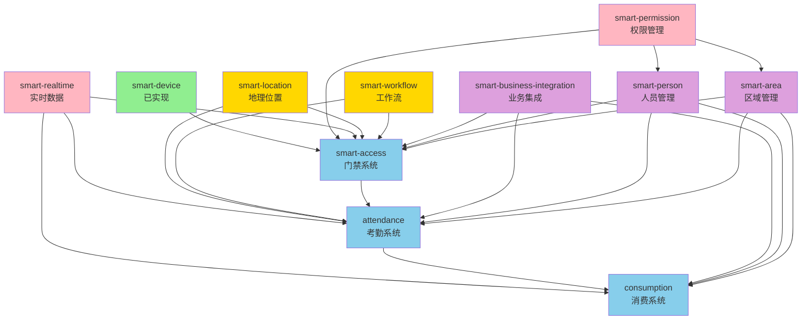

# IOE-DREAM 未实现功能完整实施设计文档

> **文档版本**: v1.0  
> **创建时间**: 2025-01-15  
> **文档类型**: 功能实施设计  
> **适用范围**: IOE-DREAM 项目全部未实现模块  
> **设计原则**: 文档驱动实施，依次渐进，零异常交付

---

## 📋 文档概述

### 背景分析

基于对 `d:\IOE-DREAM\docs` 目录下所有文档的深度分析以及代码库现状的全面扫描，IOE-DREAM项目存在以下核心问题：

1. **公共模块实现严重不足**：9个规划的公共模块中，仅 `smart-device` 完全实现，其余8个模块处于未实现状态
2. **业务模块缺口巨大**：门禁、考勤、消费三大核心业务模块后端完全缺失
3. **前后端严重脱节**：前端已完成大量页面和API定义，但后端接口全部404
4. **跨模块联动中断**：门禁×考勤×消费的业务联动无法实现
5. **文档规范与代码实现不一致**：大量规范文档已定义，但代码未遵循

### 设计目标

本文档提供全面的、结构化的实施设计，按照以下原则指导开发：

- **文档驱动开发**：每个功能实施前必须完成设计文档
- **依次渐进交付**：按优先级和依赖关系分阶段实施
- **零异常强制**：每阶段必须通过六层验证机制
- **repowiki规范严格遵循**：所有开发严格遵循repowiki规范体系
- **前后端契约一致**：确保前后端API契约完全同步

---

## 🎯 实施范围全景

### 一、公共模块实施范围

#### 1.1 已实现模块
| 模块代码 | 模块名称 | 实现状态 | 完成度 |
|---------|---------|---------|--------|
| smart-device | 设备管理模块 | ✅ 完全实现 | 100% |

#### 1.2 未实现模块（按优先级排序）

##### 🔴 P0级别 - 立即实施（基础依赖）
| 模块代码 | 模块名称 | 优先级 | 预计工期 | 核心价值 |
|---------|---------|-------|---------|---------|
| smart-permission | 5级安全权限管理 | 🔴 P0 | 6周 | 所有模块的权限基础 |
| smart-realtime | 实时数据推送 | 🔴 P0 | 3周 | 实时监控和消息推送 |

##### 🟡 P1级别 - 短期实施（核心业务）
| 模块代码 | 模块名称 | 优先级 | 预计工期 | 核心价值 |
|---------|---------|-------|---------|---------|
| smart-access | 门禁系统 | 🟡 P1 | 7周 | 核心安防业务 |
| smart-location | 地理位置服务 | 🟡 P1 | 4周 | 位置验证和围栏 |

##### 🟢 P2级别 - 中期实施（功能完善）
| 模块代码 | 模块名称 | 优先级 | 预计工期 | 核心价值 |
|---------|---------|-------|---------|---------|
| smart-person | 人员管理 | 🟢 P2 | 4周 | 人员信息基础 |
| smart-area | 区域管理 | 🟢 P2 | 3周 | 区域层级管理 |
| smart-workflow | 工作流引擎 | 🟢 P2 | 5周 | 审批流程支撑 |
| smart-business-integration | 业务集成 | 🟢 P2 | 3周 | 第三方系统集成 |

### 二、业务模块实施范围

#### 2.1 门禁系统（smart-access）

**当前状态分析**：
- ✅ 数据库表：`smart_access_permission`、`smart_access_record` 已创建
- ❌ 缺失表：`smart_access_device`、`smart_access_command`、`smart_access_device_status`、`smart_access_alarm`等5个表
- ✅ 基础接口：`SmartAccessControlController` 存在但功能不完整
- ❌ 核心缺口：设备管理、区域管理、实时监控、审批流程、高级功能全部缺失
- ⚠️ 前后端脱节：前端20+接口全部404

**实施内容**：
1. 补齐数据库表结构（7个核心表+2个扩展表）
2. 实现完整四层架构（Controller → Service → Manager → DAO）
3. 实现7大核心功能模块
4. 实现多协议设备接入（TCP/UDP/HTTP/WebSocket）
5. 集成warm-flow审批引擎
6. 实现WebSocket实时监控
7. 前后端契约同步

#### 2.2 考勤系统（attendance）

**当前状态分析**：
- ❌ 后端完全缺失：无任何考勤模块代码
- ❌ 数据库完全缺失：无任何考勤相关表
- ✅ 前端已完成：30+接口定义、页面组件完整
- ⚠️ 前后端脱节：所有前端接口404

**实施内容**：
1. 从零构建考勤数据库（10+核心表）
2. 实现考勤计算引擎（实时计算+预警）
3. 实现排班管理系统（智能排班+冲突检测）
4. 实现异常管理系统（请假+补签+审批）
5. 实现考勤规则引擎（Drools集成）
6. 实现GPS防作弊机制
7. 门禁考勤联动
8. 考勤消费联动

#### 2.3 消费系统（consumption）

**当前状态分析**：
- ❌ 后端完全缺失：无任何消费模块代码
- ❌ 数据库完全缺失：无任何消费相关表
- ✅ 前端已完成：完整消费管理页面和API
- ⚠️ 前后端脱节：所有前端接口404

**实施内容**：
1. 从零构建消费数据库（15+核心表）
2. 实现统一消费引擎（7步消费流程）
3. 实现权限验证矩阵（5级区域权限）
4. 实现账户体系（多账户类型+限额控制）
5. 实现餐别管理（时间窗口+窗口分配）
6. 实现补贴管理（考勤联动+自动发放）
7. 实现离线消费容灾
8. 实现分表+缓存+MQ架构
9. 考勤消费联动
10. 门禁消费联动

---

## 📊 依赖关系分析

### 模块依赖关系图



### 关键依赖说明

1. **smart-permission（权限管理）** - 最高优先级
   - 被依赖：所有业务模块、所有管理模块
   - 无依赖：可独立开发
   - 交付要求：必须最先完成

2. **smart-realtime（实时数据）** - 高优先级
   - 被依赖：门禁、考勤、消费的实时监控
   - 无依赖：可独立开发
   - 交付要求：与权限管理并行开发

3. **smart-access（门禁系统）** - 中高优先级
   - 依赖：smart-device（已完成）、smart-permission、smart-realtime
   - 被依赖：考勤系统（门禁打卡）
   - 交付要求：在权限和实时模块完成后开始

4. **attendance（考勤系统）** - 中优先级
   - 依赖：smart-access（门禁打卡）、smart-location、smart-workflow
   - 被依赖：消费系统（考勤补贴）
   - 交付要求：门禁系统完成后开始

5. **consumption（消费系统）** - 中优先级
   - 依赖：attendance（考勤数据）、smart-area、smart-person
   - 无被依赖
   - 交付要求：考勤系统完成后开始

---

## 🗓️ 总体实施路线图

### 阶段0：基础设施准备（2周）

**时间**：2025-01-20 ~ 2025-02-02

**目标**：建立统一开发基础，确保后续开发高效进行

**关键任务**：
1. 统一数据库建表脚本规范
2. 完善BaseEntity基类和审计字段
3. 配置统一的异常处理机制
4. 建立统一的DTO/VO转换规范
5. 配置统一的权限注解规范
6. 建立统一的缓存策略
7. 配置统一的事件总线
8. 完善六层验证脚本
9. 建立CI/CD质量门禁

**交付标准**：
- [ ] 所有规范文档更新完成
- [ ] 代码模板库建立完成
- [ ] 验证脚本通过测试
- [ ] 团队培训完成

### 阶段1：权限与实时基础（6周）

**时间**：2025-02-03 ~ 2025-03-16

#### 1.1 smart-permission（权限管理）- 4周

**Week 1-2：后端核心实现**
- 数据库设计：4个权限核心表
- 四层架构：Controller → Service → Manager → DAO
- 核心功能：5级安全级别、数据权限、临时权限、审计日志
- 缓存策略：Caffeine + Redis 多级缓存

**Week 3：高级功能实现**
- 权限验证引擎
- 权限规则解析器
- 权限批量操作
- 性能优化

**Week 4：前端集成测试**
- 前端权限指令实现
- 权限管理界面开发
- 与smart-device集成测试
- 完整功能测试

**交付标准**：
- [ ] 5级安全级别管理完整
- [ ] 数据权限验证准确率100%
- [ ] 权限验证响应时间<50ms
- [ ] 缓存命中率>90%
- [ ] 单元测试覆盖率≥80%
- [ ] 通过六层验证

#### 1.2 smart-realtime（实时数据）- 3周（与权限管理并行开发Week 2-4）

**Week 1：WebSocket服务实现**
- WebSocket握手和连接管理
- 心跳机制和断线重连
- 消息队列和优先级
- 连接池管理

**Week 2：缓存和推送机制**
- Redis订阅发布
- 消息分类和路由
- 推送策略和限流
- 性能优化

**Week 3：前端集成测试**
- 前端WebSocket连接封装
- 实时组件开发
- 与设备管理集成
- 压力测试

**交付标准**：
- [ ] 支持1000+并发连接
- [ ] 消息推送延迟<100ms
- [ ] 自动重连机制完善
- [ ] 消息可靠性保证
- [ ] 通过六层验证

### 阶段2：核心业务实现（10周）

**时间**：2025-03-17 ~ 2025-05-25

#### 2.1 smart-access（门禁系统）- 7周

**Week 1-2：数据库和设备管理**
- 补齐7个核心表+2个扩展表
- 设备管理CRUD
- 设备状态监控
- 设备分组管理

**Week 3-4：权限和协议实现**
- 权限申请审批流程
- 权限验证引擎
- 多协议设备接入（TCP/UDP/HTTP/WebSocket）
- 设备连接池管理

**Week 5：实时监控实现**
- WebSocket实时推送
- 设备状态监控
- 告警规则引擎
- 告警处理流程

**Week 6：通行记录和统计**
- 通行记录处理
- 异常检测逻辑
- 统计分析引擎
- 报表生成

**Week 7：前端集成测试**
- 前后端契约同步
- 完整功能测试
- 性能优化
- 安全测试

**交付标准**：
- [ ] 7大功能模块全部实现
- [ ] 多协议设备正常接入
- [ ] 实时监控延迟<5秒
- [ ] 通行记录完整准确
- [ ] 前端所有接口正常
- [ ] 通过六层验证

#### 2.2 smart-location（地理位置）- 3周（与门禁并行Week 5-7）

**Week 1：定位服务实现**
- GPS定位服务
- Wi-Fi定位
- 蓝牙定位
- 位置数据存储

**Week 2：地理围栏**
- 圆形围栏
- 多边形围栏
- 围栏事件检测
- 轨迹记录

**Week 3：前端集成测试**
- 地图组件集成
- 位置验证功能
- 轨迹展示
- 完整测试

**交付标准**：
- [ ] 多定位方式支持
- [ ] 围栏检测准确率>99%
- [ ] 位置数据安全保护
- [ ] 通过六层验证

### 阶段3：考勤系统实现（5周）

**时间**：2025-05-26 ~ 2025-06-29

**Week 1：数据库和基础架构**
- 10+核心表建立
- 四层架构搭建
- 基础CRUD实现
- 门禁事件集成

**Week 2：考勤计算引擎**
- 实时计算引擎
- 规则引擎集成（Drools）
- 异常检测算法
- MQ消息处理

**Week 3：排班和规则管理**
- 排班模板管理
- 智能排班算法
- 冲突检测机制
- 考勤规则配置

**Week 4：异常管理和审批**
- 请假流程
- 补签流程
- 加班管理
- warm-flow集成

**Week 5：统计报表和集成测试**
- 统计报表生成
- 数据导出功能
- 考勤消费联动
- 完整测试

**交付标准**：
- [ ] 考勤计算准确率100%
- [ ] 实时计算延迟<1秒
- [ ] 排班冲突检测有效
- [ ] 审批流程完整
- [ ] 门禁考勤联动正常
- [ ] 通过六层验证

### 阶段4：消费系统实现（6周）

**时间**：2025-06-30 ~ 2025-08-10

**Week 1-2：数据库和核心引擎**
- 15+核心表建立
- 统一消费引擎
- 权限验证矩阵
- 分表策略实现

**Week 3：账户和餐别管理**
- 多账户类型管理
- 限额控制机制
- 餐别时间窗口
- 区域权限管理

**Week 4：订餐充值补贴**
- 订餐流程
- 充值退款流程
- 补贴管理（考勤联动）
- 商品管理

**Week 5：离线和性能优化**
- 离线消费容灾
- Redis缓存优化
- MQ事件处理
- 性能压测

**Week 6：集成测试和优化**
- 考勤消费联动
- 门禁消费联动
- 完整功能测试
- 性能优化

**交付标准**：
- [ ] 消费流程准确率100%
- [ ] TPS>3000
- [ ] 数据一致性保证
- [ ] 离线容灾有效
- [ ] 跨模块联动正常
- [ ] 通过六层验证

### 阶段5：基础服务完善（7周）

**时间**：2025-08-11 ~ 2025-09-28

#### 5.1 smart-person（人员管理）- 4周
#### 5.2 smart-area（区域管理）- 3周
#### 5.3 smart-workflow（工作流）- 5周（与person/area并行）
#### 5.4 smart-business-integration（业务集成）- 3周（与workflow并行）

### 阶段6：系统集成和优化（4周）

**时间**：2025-09-29 ~ 2025-10-26

**Week 1-2：跨模块集成测试**
- 门禁×考勤×消费联动测试
- 事件总线验证
- 数据一致性验证
- 统一报表验证

**Week 3：性能优化**
- 性能瓶颈分析
- 数据库优化
- 缓存优化
- 代码优化

**Week 4：安全加固和文档**
- 安全漏洞扫描
- 安全加固
- 技术文档完善
- 部署文档编写

---

## 🔧 技术架构设计

### 统一技术栈

#### 后端技术栈
- **框架**: Spring Boot 3.5.4 + Java 17
- **持久层**: MyBatis-Plus 3.5.x
- **权限**: Sa-Token 1.37.x
- **缓存**: Redis 6.0 + Caffeine
- **消息**: RocketMQ / Kafka
- **工作流**: warm-flow / Activiti
- **规则引擎**: Drools
- **数据库**: MySQL 8.0

#### 前端技术栈
- **框架**: Vue 3 + TypeScript
- **UI组件**: Ant Design Vue 4.x
- **状态管理**: Pinia
- **路由**: Vue Router 4
- **构建**: Vite 5
- **实时通信**: WebSocket

### 统一开发规范

#### 四层架构规范
```
Controller层：接口定义、参数验证、权限控制
    ↓
Service层：业务逻辑、事务管理、缓存控制
    ↓
Manager层：复杂业务、跨模块调用、事件发布
    ↓
DAO层：数据访问、SQL操作、数据转换
```

#### 命名规范
- **包名**: `net.lab1024.sa.{module}.{layer}`
- **实体类**: `{Module}Entity` 继承 `BaseEntity`
- **DTO类**: `{Module}{Action}DTO`
- **VO类**: `{Module}VO`
- **Controller**: `{Module}Controller`
- **Service**: `{Module}Service` + `{Module}ServiceImpl`
- **Manager**: `{Module}Manager`
- **DAO**: `{Module}Dao` + Mapper XML

#### 注解规范
- **权限**: `@SaCheckLogin` + `@SaCheckPermission("module:action")`
- **验证**: `@Validated` + `@Valid`
- **事务**: `@Transactional(rollbackFor = Exception.class)`
- **缓存**: `@Cacheable` / `@CacheEvict`

### 统一数据模型规范

#### BaseEntity基类
```
所有实体类必须继承BaseEntity，包含以下字段：
- createTime: 创建时间
- updateTime: 更新时间
- createUserId: 创建人ID
- updateUserId: 更新人ID
- deletedFlag: 删除标记（软删除）
- version: 版本号（乐观锁）
```

#### 统一响应格式
```
ResponseDTO<T>:
- code: 响应码
- msg: 响应消息
- data: 响应数据
- ok: 是否成功
```

---

## 📋 质量保证体系

### 六层验证机制

#### 第零层：本地启动验证
```bash
# 本地启动必须0异常运行60秒
mvn spring-boot:run -Dspring-boot.run.profiles=docker
```

#### 第一层：编译验证
```bash
mvn clean package -DskipTests
# javax使用必须为0
# @Autowired使用必须为0
```

#### 第二层：MyBatis完整性验证
```bash
# 所有Mapper XML实体类必须存在
# 所有SQL语句必须可执行
```

#### 第三层：Spring Boot启动验证
```bash
# 启动成功且90秒内无异常
```

#### 第四层：Docker部署验证
```bash
docker-compose up -d
# 容器120秒持续运行
# 健康检查通过
# 启动日志0异常
```

#### 第五层：repowiki规范验证
```bash
# jakarta包名100%合规
# @Resource依赖注入100%合规
# 四层架构100%合规
```

#### 第六层：功能完整性验证
```bash
# 编译成功
# 测试通过
# 文档完整
```

### 测试标准

#### 单元测试
- 覆盖率≥80%
- 核心业务逻辑100%覆盖
- 边界条件全覆盖

#### 集成测试
- 模块间接口测试
- 数据库集成测试
- 缓存集成测试
- MQ集成测试

#### 性能测试
- TPS达标
- 响应时间达标
- 并发能力达标
- 资源占用合理

#### 安全测试
- SQL注入防护
- XSS防护
- CSRF防护
- 权限绕过测试

---

## 📈 风险管理

### 技术风险

#### 风险1：模块依赖复杂
- **概率**: 高
- **影响**: 严重
- **应对**：
  - 严格按依赖顺序开发
  - 使用Mock接口隔离依赖
  - 建立清晰的接口契约
  - 预留集成缓冲时间

#### 风险2：性能瓶颈
- **概率**: 中
- **影响**: 严重
- **应对**：
  - 提前性能设计和测试
  - 多级缓存策略
  - 数据库优化
  - 异步处理机制

#### 风险3：数据一致性
- **概率**: 中
- **影响**: 严重
- **应对**：
  - 严格事务管理
  - 分布式事务方案
  - 数据校验机制
  - 对账机制

### 项目风险

#### 风险1：进度延期
- **概率**: 中
- **影响**: 中
- **应对**：
  - 预留20%缓冲时间
  - MVP优先原则
  - 每周进度评审
  - 及时调整计划

#### 风险2：需求变更
- **概率**: 中
- **影响**: 中
- **应对**：
  - 版本控制管理
  - 变更评估流程
  - 影响分析机制
  - 及时沟通确认

---

## ✅ 验收标准

### 功能验收
- [ ] 所有规划功能100%实现
- [ ] 前后端契约100%一致
- [ ] 跨模块联动正常
- [ ] 业务流程完整

### 性能验收
- [ ] 权限验证<50ms
- [ ] 实时推送<100ms
- [ ] 门禁控制<1s
- [ ] 考勤计算<1s
- [ ] 消费处理<500ms

### 质量验收
- [ ] 单元测试覆盖率≥80%
- [ ] 集成测试全通过
- [ ] 性能测试达标
- [ ] 安全测试通过
- [ ] 六层验证全通过

### 文档验收
- [ ] 技术文档完整
- [ ] API文档完整
- [ ] 部署文档完整
- [ ] 用户手册完整

---

## 📞 实施保障

### 开发规范保障
- 严格遵循CLAUDE.md中的开发规范
- 强制执行repowiki规范体系
- 每次提交必须通过六层验证
- 代码审查强制执行

### 质量保障
- 每日构建和测试
- 每周代码审查
- 每月质量评审
- 持续集成和部署

### 进度保障
- 每日站会同步进度
- 每周进度评审
- 每月里程碑评审
- 风险及时识别和应对

---

## 📝 附录

### 附录A：关键文档索引

#### 公共模块设计文档
- `docs/COMMON_MODULES/README.md` - 公共模块使用指南
- `docs/COMMON_MODULES/smart-access.md` - 门禁系统设计
- `docs/COMMON_MODULES/smart-permission.md` - 权限管理设计
- `docs/COMMON_MODULES/smart-realtime.md` - 实时数据设计

#### 业务模块设计文档
- `docs/各业务模块文档/门禁/` - 门禁系统7大模块设计
- `docs/各业务模块文档/考勤/` - 考勤系统全链路设计
- `docs/各业务模块文档/消费/` - 消费系统15模块设计

#### 规范文档
- `CLAUDE.md` - AI开发规范和六层验证
- `docs/DEV_STANDARDS.md` - 开发规范
- `docs/repowiki/` - 权威规范体系

#### 实施计划
- `docs/PROJECT_PLAN/COMMON_MODULES_IMPLEMENTATION_PLAN.md` - 公共模块实施计划
- `docs/PROJECT_PLAN/SMART_ACCESS_IMPLEMENTATION_PLAN.md` - 门禁系统实施计划
- `docs/PROJECT_PLAN/access-attendance-consume-gap.md` - 三大系统差距分析

### 附录B：验证脚本清单
- `scripts/six-layer-validation.sh` - 六层验证总脚本
- `scripts/enforce-standards.sh` - 规范强制检查
- `scripts/quick-check.sh` - 快速检查
- `scripts/docker-deploy.sh` - Docker部署验证

### 附录C：技术栈版本清单
- Java: 17
- Spring Boot: 3.5.4
- MyBatis-Plus: 3.5.x
- Sa-Token: 1.37.x
- Vue: 3.x
- Ant Design Vue: 4.x
- MySQL: 8.0
- Redis: 6.0

---

**文档创建时间**: 2025-01-15  
**文档维护**: IOE-DREAM开发团队  
**文档版本**: v1.0  
**最后更新**: 2025-01-15
