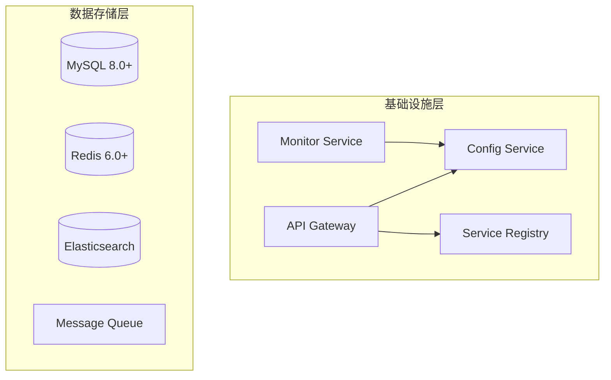
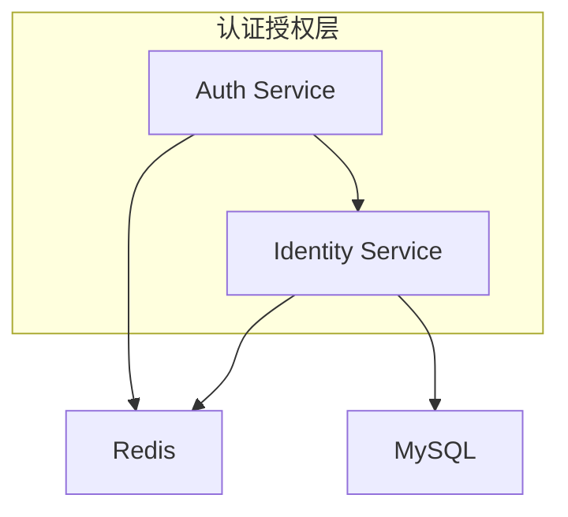
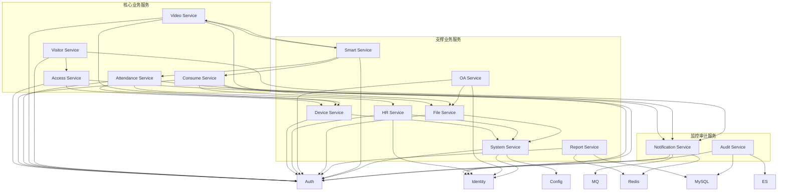

# IOE-DREAM 微服务依赖关系矩阵

**📅 分析时间**: 2025-11-29 17:28:00
**🎯 目标**: 明确服务间依赖关系，制定集成策略

---

## 🔍 微服务依赖关系图谱

### 核心基础设施服务 (Layer 0)



### 身份认证层 (Layer 1)



### 业务服务层 (Layer 2)



---

## 📊 依赖关系详细分析

### 🔴 强依赖关系 (必须满足)

| 服务 | 依赖服务 | 依赖类型 | 优先级 | 说明 |
|------|----------|----------|--------|------|
| **Access** | Auth | 强依赖 | P0 | 必须身份认证 |
| **Access** | Device | 强依赖 | P0 | 设备管理依赖 |
| **Access** | Identity | 强依赖 | P0 | 权限验证依赖 |
| **Consume** | Auth | 强依赖 | P0 | 支付认证依赖 |
| **Consume** | Identity | 强依赖 | P0 | 权限控制依赖 |
| **Consume** | File | 强依赖 | P0 | 凭证文件依赖 |
| **Attendance** | Auth | 强依赖 | P0 | 考勤认证依赖 |
| **Attendance** | Device | 强依赖 | P0 | 设备打卡依赖 |
| **Attendance** | HR | 强依赖 | P0 | 员工信息依赖 |
| **Video** | Auth | 强依赖 | P0 | 视频访问控制 |
| **Video** | Device | 强依赖 | P0 | 摄像头设备依赖 |
| **Visitor** | Auth | 强依赖 | P0 | 访客管理依赖 |
| **Visitor** | Access | 强依赖 | P0 | 门禁集成依赖 |

### 🟡 弱依赖关系 (可降级)

| 服务 | 依赖服务 | 依赖类型 | 优先级 | 说明 |
|------|----------|----------|--------|------|
| **Consume** | Notification | 弱依赖 | P1 | 支付通知可延迟 |
| **Attendance** | Notification | 弱依赖 | P1 | 考勤提醒可延迟 |
| **Video** | Smart | 弱依赖 | P1 | 智能分析可选 |
| **Video** | File | 弱依赖 | P1 | 录像存储可选 |
| **Visitor** | Notification | 弱依赖 | P1 | 访客通知可延迟 |
| **OA** | File | 弱依赖 | P1 | 文件附件可选 |
| **Report** | Redis | 弱依赖 | P1 | 缓存降级到数据库 |
| **Smart** | Video | 弱依赖 | P1 | 视频分析可选 |
| **Smart** | Attendance | 弱依赖 | P1 | 考勤数据可选 |

### 🟢 可选依赖 (增强功能)

| 服务 | 依赖服务 | 依赖类型 | 优先级 | 说明 |
|------|----------|----------|--------|------|
| **Report** | ES | 可选依赖 | P2 | 高级搜索功能 |
| **Audit** | ES | 可选依赖 | P2 | 日志全文检索 |
| **Notification** | MQ | 可选依赖 | P2 | 异步消息队列 |
| **System** | Config | 可选依赖 | P2 | 动态配置管理 |
| **Monitor** | Prometheus | 可选依赖 | P2 | 指标收集 |

---

## 🚀 集成策略

### 阶段一：核心服务集成 (Week 1)

#### 优先级P0服务启动顺序
1. **基础设施服务**
   ```bash
   启动顺序: Config → Registry → Gateway → Monitor
   验证点: 服务注册发现正常
   ```

2. **认证服务**
   ```bash
   启动顺序: Auth → Identity
   验证点: 用户登录和权限验证正常
   ```

3. **核心业务服务**
   ```bash
   启动顺序: Device → Access → Consume → Attendance
   验证点: 核心业务流程正常
   ```

#### 集成验证清单
- [ ] 服务注册发现正常
- [ ] API网关路由配置正确
- [ ] 身份认证流程正常
- [ ] 权限控制生效
- [ ] 数据库连接正常
- [ ] 缓存服务正常
- [ ] 基础业务流程验证

### 阶段二：扩展服务集成 (Week 2)

#### 视频和访客服务集成
```bash
启动顺序: Video → File → Visitor → Smart
验证点:
- 视频流正常
- 文件上传下载正常
- 访客预约流程正常
- 智能分析功能正常
```

#### 支撑服务集成
```bash
启动顺序: HR → OA → Report → System
验证点:
- 人事管理功能正常
- 办公自动化流程正常
- 报表生成正常
- 系统配置管理正常
```

### 阶段三：监控和通知服务集成 (Week 3)

#### 监控审计服务集成
```bash
启动顺序: Audit → Notification → Monitor
验证点:
- 审计日志正常记录
- 通知发送正常
- 监控指标正常收集
- 告警机制正常触发
```

---

## 🔧 技术集成方案

### 1. 服务发现集成

**Eureka配置**:
```yaml
# 所有微服务通用配置
eureka:
  client:
    service-url:
      defaultZone: http://eureka-server:8761/eureka/
    register-with-eureka: true
    fetch-registry: true
  instance:
    prefer-ip-address: true
    lease-renewal-interval-in-seconds: 30
    lease-expiration-duration-in-seconds: 90
```

### 2. API网关路由配置

**Gateway路由规则**:
```yaml
spring:
  cloud:
    gateway:
      routes:
        - id: auth-service
          uri: lb://ioedream-auth-service
          predicates:
            - Path=/api/auth/**
          filters:
            - StripPrefix=2

        - id: access-service
          uri: lb://ioedream-access-service
          predicates:
            - Path=/api/access/**
          filters:
            - StripPrefix=2

        - id: consume-service
          uri: lb://ioedream-consume-service
          predicates:
            - Path=/api/consume/**
          filters:
            - StripPrefix=2
```

### 3. 统一配置管理

**Config Server配置**:
```yaml
spring:
  cloud:
    config:
      server:
        git:
          uri: https://github.com/IOE-DREAM/config-repo
          search-paths: '{application}'
          default-label: main
        health:
          repositories:
            ioedream:
              label: main
              name: ioedream
              profiles: dev,prod
```

### 4. 分布式事务处理

**Seata配置**:
```yaml
seata:
  enabled: true
  application-id: ioedream-${spring.application.name}
  tx-service-group: ioedream_tx_group
  config:
    type: nacos
    nacos:
      server-addr: localhost:8848
      group: SEATA_GROUP
  registry:
    type: nacos
    nacos:
      server-addr: localhost:8848
      group: SEATA_GROUP
```

### 5. 链路追踪配置

**Sleuth + Zipkin**:
```yaml
spring:
  sleuth:
    sampler:
      probability: 1.0
    zipkin:
      base-url: http://zipkin-server:9411
```

---

## 🔒 安全集成策略

### 1. 统一认证中心

**JWT Token配置**:
```yaml
auth:
  jwt:
    secret: ${JWT_SECRET:your-secret-key}
    expiration: 7200
    refresh-expiration: 604800
```

### 2. 服务间安全调用

**Feign安全配置**:
```java
@Configuration
public class FeignSecurityConfig {

    @Bean
    public RequestInterceptor requestInterceptor() {
        return template -> {
            // 传递认证头
            String token = SecurityContextHolder.getContext()
                .getAuthentication().getCredentials().toString();
            template.header("Authorization", "Bearer " + token);
        };
    }
}
```

### 3. API网关安全过滤

**安全过滤器**:
```java
@Component
public class SecurityFilter implements GlobalFilter {

    @Override
    public Mono<Void> filter(ServerWebExchange exchange, GatewayFilterChain chain) {
        String path = exchange.getRequest().getPath().value();

        // 白名单路径
        if (isWhitelistPath(path)) {
            return chain.filter(exchange);
        }

        // 验证JWT Token
        String token = exchange.getRequest().getHeaders()
            .getFirst("Authorization");

        if (!validateToken(token)) {
            return unauthorizedResponse(exchange);
        }

        return chain.filter(exchange);
    }
}
```

---

## 📈 性能优化策略

### 1. 缓存策略

**多级缓存架构**:
```
L1: 本地缓存 (Caffeine) - 1分钟TTL
L2: Redis缓存 - 30分钟TTL
L3: 数据库 - 实时数据
```

### 2. 连接池优化

**数据库连接池**:
```yaml
spring:
  datasource:
    hikari:
      maximum-pool-size: 20
      minimum-idle: 5
      idle-timeout: 300000
      connection-timeout: 20000
      leak-detection-threshold: 60000
```

### 3. 异步处理

**消息队列配置**:
```yaml
spring:
  rabbitmq:
    host: localhost
    port: 5672
    username: admin
    password: admin
    virtual-host: /
    listener:
      simple:
        concurrency: 3
        max-concurrency: 10
```

---

## 🚨 故障处理和降级策略

### 1. 服务降级

**Hystrix配置**:
```yaml
hystrix:
  command:
    default:
      execution:
        isolation:
          thread:
            timeoutInMilliseconds: 5000
      circuitBreaker:
        requestVolumeThreshold: 20
        sleepWindowInMilliseconds: 5000
        errorThresholdPercentage: 50
```

### 2. 重试机制

**Spring Retry配置**:
```java
@Retryable(
    value = {ServiceUnavailableException.class},
    maxAttempts = 3,
    backoff = @Backoff(delay = 1000, multiplier = 2)
)
public ResponseEntity<String> callService(String url) {
    // 服务调用逻辑
}
```

### 3. 熔断机制

**Resilience4j配置**:
```yaml
resilience4j:
  circuitbreaker:
    instances:
      backendA:
        registerHealthIndicator: true
        slidingWindowSize: 10
        minimumNumberOfCalls: 5
        permittedNumberOfCallsInHalfOpenState: 3
        automaticTransitionFromOpenToHalfOpenEnabled: true
        waitDurationInOpenState: 5s
        failureRateThreshold: 50
```

---

## 📊 监控和告警

### 1. 应用监控

**Actuator配置**:
```yaml
management:
  endpoints:
    web:
      exposure:
        include: health,info,metrics,prometheus
  endpoint:
    health:
      show-details: always
  metrics:
    export:
      prometheus:
        enabled: true
```

### 2. 业务监控

**自定义指标**:
```java
@Component
public class BusinessMetrics {

    private final Counter requestCounter;
    private final Timer responseTimer;

    public BusinessMetrics(MeterRegistry meterRegistry) {
        this.requestCounter = Counter.builder("business.requests")
            .description("Total business requests")
            .register(meterRegistry);
        this.responseTimer = Timer.builder("business.response.time")
            .description("Business response time")
            .register(meterRegistry);
    }
}
```

---

## ✅ 集成验证清单

### 功能验证
- [ ] 所有服务正常启动
- [ ] 服务注册发现正常
- [ ] API网关路由正确
- [ ] 身份认证正常
- [ ] 权限控制生效
- [ ] 业务流程正常
- [ ] 数据一致性保证

### 性能验证
- [ ] 响应时间达标
- [ ] 吞吐量达标
- [ ] 并发处理正常
- [ ] 资源使用合理

### 安全验证
- [ ] 身份认证安全
- [ ] 权限控制有效
- [ ] 数据传输加密
- [ ] API安全防护

### 运维验证
- [ ] 监控指标正常
- [ ] 日志收集正常
- [ ] 告警机制有效
- [ ] 备份恢复正常

---

**🎯 集成目标**: 确保所有微服务协同工作，提供完整的业务能力

**📅 集成时间**: 3周内完成所有服务集成和验证

**🚀 项目状态**: 关键集成阶段，需要严格把控质量

---

*依赖分析完成: 2025-11-29 17:28:00*
*集成验证目标: 2025-12-20*