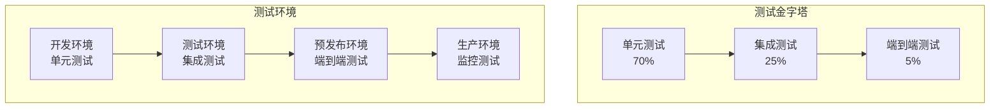
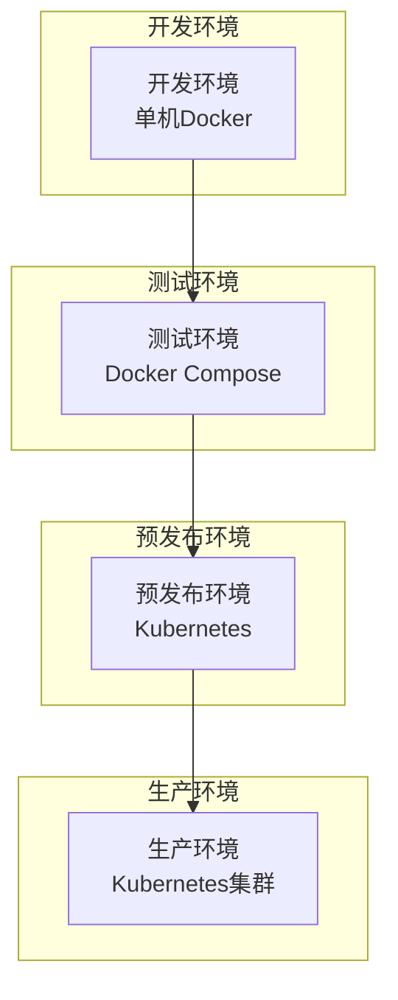

# IOE-DREAM 微服务测试和部署策略

**📅 策略制定时间**: 2025-11-29 17:30:00
**🎯 目标**: 确保所有微服务高质量交付和稳定运行

---

## 🧪 测试策略

### 测试金字塔架构



### 1. 单元测试策略 (70%)

#### 测试覆盖率要求
- **代码覆盖率**: ≥80%
- **分支覆盖率**: ≥75%
- **关键业务逻辑**: 100%

#### 测试工具栈
```xml
<dependencies>
    <!-- JUnit 5 -->
    <dependency>
        <groupId>org.junit.jupiter</groupId>
        <artifactId>junit-jupiter</artifactId>
        <version>5.10.0</version>
        <scope>test</scope>
    </dependency>

    <!-- Mockito -->
    <dependency>
        <groupId>org.mockito</groupId>
        <artifactId>mockito-core</artifactId>
        <version>5.5.0</version>
        <scope>test</scope>
    </dependency>

    <!-- Testcontainers -->
    <dependency>
        <groupId>org.testcontainers</groupId>
        <artifactId>junit-jupiter</artifactId>
        <version>1.19.0</version>
        <scope>test</scope>
    </dependency>

    <!-- Spring Boot Test -->
    <dependency>
        <groupId>org.springframework.boot</groupId>
        <artifactId>spring-boot-starter-test</artifactId>
        <scope>test</scope>
    </dependency>
</dependencies>
```

#### 单元测试示例

**Controller层测试**:
```java
@ExtendWith(MockitoExtension.class)
@WebMvcTest(AuthController.class)
class AuthControllerTest {

    @Autowired
    private MockMvc mockMvc;

    @MockBean
    private AuthService authService;

    @Test
    @DisplayName("用户登录成功测试")
    void testLoginSuccess() throws Exception {
        // Given
        LoginForm loginForm = new LoginForm("testuser", "password123");
        LoginResponse expectedResponse = new LoginResponse("jwt-token", "refresh-token");

        when(authService.login(any(LoginForm.class)))
            .thenReturn(ResponseDTO.ok(expectedResponse));

        // When & Then
        mockMvc.perform(post("/api/auth/login")
                .contentType(MediaType.APPLICATION_JSON)
                .content(objectMapper.writeValueAsString(loginForm)))
                .andExpect(status().isOk())
                .andExpect(jsonPath("$.code").value(200))
                .andExpect(jsonPath("$.data.token").value("jwt-token"));
    }

    @Test
    @DisplayName("用户登录失败测试 - 错误密码")
    void testLoginFailure_WrongPassword() throws Exception {
        // Given
        LoginForm loginForm = new LoginForm("testuser", "wrongpassword");

        when(authService.login(any(LoginForm.class)))
            .thenReturn(ResponseDTO.error("密码错误"));

        // When & Then
        mockMvc.perform(post("/api/auth/login")
                .contentType(MediaType.APPLICATION_JSON)
                .content(objectMapper.writeValueAsString(loginForm)))
                .andExpect(status().isOk())
                .andExpect(jsonPath("$.code").value(500));
    }
}
```

**Service层测试**:
```java
@ExtendWith(MockitoExtension.class)
class AuthServiceTest {

    @InjectMocks
    private AuthServiceImpl authService;

    @Mock
    private UserDao userDao;

    @Mock
    private JwtTokenProvider jwtTokenProvider;

    @Test
    @DisplayName("用户认证成功测试")
    void testAuthenticateSuccess() {
        // Given
        String username = "testuser";
        String password = "password123";
        UserEntity user = new UserEntity();
        user.setUserId(1L);
        user.setUsername(username);
        user.setPassword("$2a$10$encodedPassword");

        when(userDao.selectByUsername(username)).thenReturn(user);
        when(jwtTokenProvider.generateToken(any())).thenReturn("jwt-token");

        // When
        LoginResponse response = authService.authenticate(username, password);

        // Then
        assertThat(response).isNotNull();
        assertThat(response.getToken()).isEqualTo("jwt-token");
        verify(userDao).selectByUsername(username);
        verify(jwtTokenProvider).generateToken(any());
    }
}
```

### 2. 集成测试策略 (25%)

#### 数据库集成测试
```java
@SpringBootTest
@Testcontainers
@Transactional
class UserRepositoryIntegrationTest {

    @Container
    static MySQLContainer<?> mysql = new MySQLContainer<>("mysql:8.0")
            .withDatabaseName("test_db")
            .withUsername("test")
            .withPassword("test");

    @DynamicPropertySource
    static void mysqlProperties(DynamicPropertyRegistry registry) {
        registry.add("spring.datasource.url", mysql::getJdbcUrl);
        registry.add("spring.datasource.username", mysql::getUsername);
        registry.add("spring.datasource.password", mysql::getPassword);
    }

    @Autowired
    private UserDao userDao;

    @Test
    @DisplayName("用户创建和查询集成测试")
    void testUserCreateAndQuery() {
        // Given
        UserEntity user = new UserEntity();
        user.setUsername("testuser");
        user.setPassword("password123");
        user.setEmail("test@example.com");

        // When
        userDao.insert(user);
        UserEntity foundUser = userDao.selectByUsername("testuser");

        // Then
        assertThat(foundUser).isNotNull();
        assertThat(foundUser.getUsername()).isEqualTo("testuser");
        assertThat(foundUser.getEmail()).isEqualTo("test@example.com");
    }
}
```

#### Redis集成测试
```java
@SpringBootTest
@Testcontainers
class CacheServiceIntegrationTest {

    @Container
    static GenericContainer<?> redis = new GenericContainer<>("redis:6.2")
            .withExposedPorts(6379);

    @DynamicPropertySource
    static void redisProperties(DynamicPropertyRegistry registry) {
        registry.add("spring.redis.host", redis::getHost);
        registry.add("spring.redis.port", redis::getFirstMappedPort);
    }

    @Autowired
    private CacheService cacheService;

    @Test
    @DisplayName("缓存存取集成测试")
    void testCacheSetAndGet() {
        // Given
        String key = "test-key";
        String value = "test-value";

        // When
        cacheService.set(key, value, 60);
        String retrievedValue = cacheService.get(key);

        // Then
        assertThat(retrievedValue).isEqualTo(value);
    }
}
```

#### 消息队列集成测试
```java
@SpringBootTest
@Testcontainers
class NotificationServiceIntegrationTest {

    @Container
    static RabbitMQContainer rabbitmq = new RabbitMQContainer("rabbitmq:3.12-management");

    @Autowired
    private NotificationService notificationService;

    @Test
    @DisplayName("消息发送集成测试")
    void testSendMessage() {
        // Given
        NotificationMessage message = new NotificationMessage();
        message.setRecipient("test@example.com");
        message.setSubject("测试通知");
        message.setContent("这是一条测试消息");

        // When & Then
        assertDoesNotThrow(() -> {
            notificationService.sendEmail(message);
        });
    }
}
```

### 3. 端到端测试策略 (5%)

#### 业务流程测试
```java
@SpringBootTest(webEnvironment = SpringBootTest.WebEnvironment.RANDOM_PORT)
@TestMethodOrder(OrderAnnotation.class)
class BusinessFlowE2ETest {

    @Autowired
    private TestRestTemplate restTemplate;

    @Test
    @Order(1)
    @DisplayName("完整用户注册和登录流程测试")
    void testCompleteUserRegistrationAndLoginFlow() {
        // Step 1: 用户注册
        UserRegistrationForm registrationForm = new UserRegistrationForm();
        registrationForm.setUsername("newuser");
        registrationForm.setPassword("password123");
        registrationForm.setEmail("newuser@example.com");

        ResponseEntity<ResponseDTO<String>> registrationResponse = restTemplate.postForEntity(
            "/api/auth/register", registrationForm,
            new ParameterizedTypeReference<ResponseDTO<String>>() {});

        assertThat(registrationResponse.getStatusCode()).isEqualTo(HttpStatus.OK);
        assertThat(registrationResponse.getBody().getCode()).isEqualTo(200);

        // Step 2: 用户登录
        LoginForm loginForm = new LoginForm("newuser", "password123");

        ResponseEntity<ResponseDTO<LoginResponse>> loginResponse = restTemplate.postForEntity(
            "/api/auth/login", loginForm,
            new ParameterizedTypeReference<ResponseDTO<LoginResponse>>() {});

        assertThat(loginResponse.getStatusCode()).isEqualTo(HttpStatus.OK);
        assertThat(loginResponse.getBody().getCode()).isEqualTo(200);
        assertThat(loginResponse.getBody().getData().getToken()).isNotEmpty();
    }

    @Test
    @Order(2)
    @DisplayName("完整消费流程测试")
    void testCompleteConsumptionFlow() {
        // Step 1: 用户登录获取Token
        String token = authenticateUser("testuser", "password123");

        // Step 2: 查询账户余额
        HttpHeaders headers = new HttpHeaders();
        headers.setBearerAuth(token);
        HttpEntity<String> entity = new HttpEntity<>(headers);

        ResponseEntity<ResponseDTO<AccountBalanceVO>> balanceResponse = restTemplate.exchange(
            "/api/consume/account/balance", HttpMethod.GET, entity,
            new ParameterizedTypeReference<ResponseDTO<AccountBalanceVO>>() {});

        assertThat(balanceResponse.getStatusCode()).isEqualTo(HttpStatus.OK);

        // Step 3: 执行消费
        ConsumeForm consumeForm = new ConsumeForm();
        consumeForm.setAmount(new BigDecimal("10.00"));
        consumeForm.setDeviceId(1L);

        ResponseEntity<ResponseDTO<ConsumeResult>> consumeResponse = restTemplate.exchange(
            "/api/consume/process", HttpMethod.POST,
            new HttpEntity<>(consumeForm, headers),
            new ParameterizedTypeReference<ResponseDTO<ConsumeResult>>() {});

        assertThat(consumeResponse.getStatusCode()).isEqualTo(HttpStatus.OK);
        assertThat(consumeResponse.getBody().getData().isSuccess()).isTrue();
    }

    private String authenticateUser(String username, String password) {
        LoginForm loginForm = new LoginForm(username, password);
        ResponseEntity<ResponseDTO<LoginResponse>> response = restTemplate.postForEntity(
            "/api/auth/login", loginForm,
            new ParameterizedTypeReference<ResponseDTO<LoginResponse>>() {});

        return response.getBody().getData().getToken();
    }
}
```

---

## 🚀 部署策略

### 部署环境架构



### 1. Docker化策略

#### 统一Dockerfile模板
```dockerfile
# 多阶段构建 - 构建阶段
FROM maven:3.9.4-eclipse-temurin-17 AS builder
WORKDIR /app
COPY pom.xml .
COPY src ./src
RUN mvn clean package -DskipTests

# 运行阶段
FROM openjdk:17-jre-slim

# 安装必要的工具
RUN apt-get update && apt-get install -y \
    curl \
    && rm -rf /var/lib/apt/lists/*

# 创建应用用户
RUN groupadd -r appuser && useradd -r -g appuser appuser

# 设置工作目录
WORKDIR /app

# 复制构建产物
COPY --from=builder /app/target/*.jar app.jar

# 复制启动脚本
COPY docker-entrypoint.sh /usr/local/bin/
RUN chmod +x /usr/local/bin/docker-entrypoint.sh

# 创建日志目录
RUN mkdir -p /app/logs && chown -R appuser:appuser /app

# 切换到应用用户
USER appuser

# 健康检查
HEALTHCHECK --interval=30s --timeout=10s --start-period=60s --retries=3 \
    CMD curl -f http://localhost:8080/actuator/health || exit 1

# 暴露端口
EXPOSE 8080

# 启动应用
ENTRYPOINT ["docker-entrypoint.sh"]
CMD ["java", "-jar", "app.jar"]
```

#### 启动脚本
```bash
#!/bin/bash
set -e

# JVM参数配置
JVM_OPTS="-Xms512m -Xmx1024m -XX:+UseG1GC"
JVM_OPTS="$JVM_OPTS -XX:+HeapDumpOnOutOfMemoryError -XX:HeapDumpPath=/app/logs/"
JVM_OPTS="$JVM_OPTS -Djava.security.egd=file:/dev/./urandom"

# Spring Boot参数
SPRING_OPTS="--spring.profiles.active=${SPRING_PROFILES_ACTIVE:dev}"
SPRING_OPTS="$SPRING_OPTS --management.endpoints.web.exposure.include=health,info,metrics"
SPRING_OPTS="$SPRING_OPTS --management.endpoint.health.show-details=always"

# 启动应用
exec java $JVM_OPTS -jar /app/app.jar $SPRING_OPTS "$@"
```

### 2. Kubernetes部署策略

#### 命名空间配置
```yaml
apiVersion: v1
kind: Namespace
metadata:
  name: ioedream
  labels:
    name: ioedream
    environment: production
---
apiVersion: v1
kind: Namespace
metadata:
  name: ioedream-staging
  labels:
    name: ioedream-staging
    environment: staging
---
apiVersion: v1
kind: Namespace
metadata:
  name: ioedream-test
  labels:
    name: ioedream-test
    environment: test
```

#### 微服务部署模板
```yaml
apiVersion: apps/v1
kind: Deployment
metadata:
  name: ioedream-auth-service
  namespace: ioedream
  labels:
    app: ioedream-auth-service
    version: v1.0.0
spec:
  replicas: 3
  selector:
    matchLabels:
      app: ioedream-auth-service
  template:
    metadata:
      labels:
        app: ioedream-auth-service
        version: v1.0.0
    spec:
      containers:
      - name: auth-service
        image: ioedream/auth-service:1.0.0
        ports:
        - containerPort: 8080
          name: http
        env:
        - name: SPRING_PROFILES_ACTIVE
          value: "prod"
        - name: MYSQL_HOST
          valueFrom:
            secretKeyRef:
              name: ioedream-secrets
              key: mysql-host
        - name: MYSQL_PASSWORD
          valueFrom:
            secretKeyRef:
              name: ioedream-secrets
              key: mysql-password
        - name: REDIS_HOST
          valueFrom:
            configMapKeyRef:
              name: ioedream-config
              key: redis-host
        resources:
          requests:
            memory: "512Mi"
            cpu: "250m"
          limits:
            memory: "1Gi"
            cpu: "500m"
        livenessProbe:
          httpGet:
            path: /actuator/health
            port: 8080
          initialDelaySeconds: 60
          periodSeconds: 30
          timeoutSeconds: 10
          failureThreshold: 3
        readinessProbe:
          httpGet:
            path: /actuator/health
            port: 8080
          initialDelaySeconds: 30
          periodSeconds: 10
          timeoutSeconds: 5
          failureThreshold: 3
        volumeMounts:
        - name: logs
          mountPath: /app/logs
      volumes:
      - name: logs
        emptyDir: {}
      imagePullSecrets:
      - name: registry-secret
---
apiVersion: v1
kind: Service
metadata:
  name: ioedream-auth-service
  namespace: ioedream
  labels:
    app: ioedream-auth-service
spec:
  selector:
    app: ioedream-auth-service
  ports:
  - name: http
    port: 80
    targetPort: 8080
    protocol: TCP
  type: ClusterIP
---
apiVersion: autoscaling/v2
kind: HorizontalPodAutoscaler
metadata:
  name: ioedream-auth-service-hpa
  namespace: ioedream
spec:
  scaleTargetRef:
    apiVersion: apps/v1
    kind: Deployment
    name: ioedream-auth-service
  minReplicas: 3
  maxReplicas: 10
  metrics:
  - type: Resource
    resource:
      name: cpu
      target:
        type: Utilization
        averageUtilization: 70
  - type: Resource
    resource:
      name: memory
      target:
        type: Utilization
        averageUtilization: 80
```

#### Ingress配置
```yaml
apiVersion: networking.k8s.io/v1
kind: Ingress
metadata:
  name: ioedream-ingress
  namespace: ioedream
  annotations:
    kubernetes.io/ingress.class: nginx
    nginx.ingress.kubernetes.io/rewrite-target: /
    nginx.ingress.kubernetes.io/ssl-redirect: "true"
    nginx.ingress.kubernetes.io/rate-limit: "100"
    nginx.ingress.kubernetes.io/rate-limit-window: "1m"
    cert-manager.io/cluster-issuer: letsencrypt-prod
spec:
  tls:
  - hosts:
    - api.ioedream.com
    secretName: ioedream-tls
  rules:
  - host: api.ioedream.com
    http:
      paths:
      - path: /api/auth
        pathType: Prefix
        backend:
          service:
            name: ioedream-auth-service
            port:
              number: 80
      - path: /api/access
        pathType: Prefix
        backend:
          service:
            name: ioedream-access-service
            port:
              number: 80
      - path: /api/consume
        pathType: Prefix
        backend:
          service:
            name: ioedream-consume-service
            port:
              number: 80
```

### 3. CI/CD流水线

#### GitHub Actions配置
```yaml
name: IOE-DREAM CI/CD Pipeline

on:
  push:
    branches: [main, develop]
  pull_request:
    branches: [main]

env:
  REGISTRY: ghcr.io
  IMAGE_NAME: ${{ github.repository }}

jobs:
  test:
    runs-on: ubuntu-latest
    permissions:
      contents: read
      packages: read

    services:
      mysql:
        image: mysql:8.0
        env:
          MYSQL_ROOT_PASSWORD: test
          MYSQL_DATABASE: test_db
        options: >-
          --health-cmd="mysqladmin ping"
          --health-interval=10s
          --health-timeout=5s
          --health-retries=3
        ports:
          - 3306:3306

      redis:
        image: redis:6.2
        options: >-
          --health-cmd="redis-cli ping"
          --health-interval=10s
          --health-timeout=5s
          --health-retries=3
        ports:
          - 6379:6379

    steps:
    - name: Checkout code
      uses: actions/checkout@v4

    - name: Set up JDK 17
      uses: actions/setup-java@v4
      with:
        java-version: '17'
        distribution: 'temurin'

    - name: Cache Maven dependencies
      uses: actions/cache@v3
      with:
        path: ~/.m2
        key: ${{ runner.os }}-m2-${{ hashFiles('**/pom.xml') }}
        restore-keys: ${{ runner.os }}-m2

    - name: Run tests
      run: |
        mvn clean test
        mvn jacoco:report

    - name: Upload coverage to Codecov
      uses: codecov/codecov-action@v3
      with:
        file: ./target/site/jacoco/jacoco.xml
        flags: unittests
        name: codecov-umbrella

    - name: SonarCloud Scan
      uses: SonarSource/sonarcloud-github-action@master
      env:
        GITHUB_TOKEN: ${{ secrets.GITHUB_TOKEN }}
        SONAR_TOKEN: ${{ secrets.SONAR_TOKEN }}

  build:
    needs: test
    runs-on: ubuntu-latest
    if: github.ref == 'refs/heads/main' || github.ref == 'refs/heads/develop'
    permissions:
      contents: read
      packages: write

    steps:
    - name: Checkout code
      uses: actions/checkout@v4

    - name: Log in to Container Registry
      uses: docker/login-action@v3
      with:
        registry: ${{ env.REGISTRY }}
        username: ${{ github.actor }}
        password: ${{ secrets.GITHUB_TOKEN }}

    - name: Extract metadata
      id: meta
      uses: docker/metadata-action@v5
      with:
        images: ${{ env.REGISTRY }}/${{ env.IMAGE_NAME }}
        tags: |
          type=ref,event=branch
          type=ref,event=pr
          type=sha,prefix={{branch}}-
          type=raw,value=latest,enable={{is_default_branch}}

    - name: Build and push Docker image
      uses: docker/build-push-action@v5
      with:
        context: .
        push: true
        tags: ${{ steps.meta.outputs.tags }}
        labels: ${{ steps.meta.outputs.labels }}
        cache-from: type=gha
        cache-to: type=gha,mode=max

  deploy-staging:
    needs: build
    runs-on: ubuntu-latest
    if: github.ref == 'refs/heads/develop'
    environment: staging

    steps:
    - name: Checkout code
      uses: actions/checkout@v4

    - name: Set up kubectl
      uses: azure/setup-kubectl@v3
      with:
        version: 'v1.28.0'

    - name: Configure kubectl
      run: |
        echo "${{ secrets.KUBE_CONFIG_STAGING }}" | base64 -d > kubeconfig
        export KUBECONFIG=kubeconfig

    - name: Deploy to staging
      run: |
        export KUBECONFIG=kubeconfig
        kubectl set image deployment/ioedream-auth-service \
          auth-service=${{ env.REGISTRY }}/${{ env.IMAGE_NAME }}:${{ github.sha }} \
          -n ioedream-staging
        kubectl rollout status deployment/ioedream-auth-service -n ioedream-staging

  deploy-production:
    needs: build
    runs-on: ubuntu-latest
    if: github.ref == 'refs/heads/main'
    environment: production

    steps:
    - name: Checkout code
      uses: actions/checkout@v4

    - name: Set up kubectl
      uses: azure/setup-kubectl@v3
      with:
        version: 'v1.28.0'

    - name: Configure kubectl
      run: |
        echo "${{ secrets.KUBE_CONFIG_PRODUCTION }}" | base64 -d > kubeconfig
        export KUBECONFIG=kubeconfig

    - name: Deploy to production
      run: |
        export KUBECONFIG=kubeconfig
        kubectl set image deployment/ioedream-auth-service \
          auth-service=${{ env.REGISTRY }}/${{ env.IMAGE_NAME }}:${{ github.sha }} \
          -n ioedream
        kubectl rollout status deployment/ioedream-auth-service -n ioedream

    - name: Run smoke tests
      run: |
        # 执行冒烟测试
        ./scripts/smoke-tests.sh
```

### 4. 监控和告警

#### Prometheus配置
```yaml
apiVersion: v1
kind: ConfigMap
metadata:
  name: prometheus-config
  namespace: monitoring
data:
  prometheus.yml: |
    global:
      scrape_interval: 15s
      evaluation_interval: 15s

    rule_files:
      - "ioedream_rules.yml"

    alerting:
      alertmanagers:
        - static_configs:
            - targets:
              - alertmanager:9093

    scrape_configs:
      - job_name: 'ioedream-services'
        kubernetes_sd_configs:
          - role: pod
        relabel_configs:
          - source_labels: [__meta_kubernetes_pod_annotation_prometheus_io_scrape]
            action: keep
            regex: true
          - source_labels: [__meta_kubernetes_pod_annotation_prometheus_io_path]
            action: replace
            target_label: __metrics_path__
            regex: (.+)
          - source_labels: [__address__, __meta_kubernetes_pod_annotation_prometheus_io_port]
            action: replace
            regex: ([^:]+)(?::\d+)?;(\d+)
            replacement: $1:$2
            target_label: __address__
```

#### 告警规则
```yaml
apiVersion: v1
kind: ConfigMap
metadata:
  name: prometheus-rules
  namespace: monitoring
data:
  ioedream_rules.yml: |
    groups:
    - name: ioedream.rules
      rules:
      - alert: ServiceDown
        expr: up == 0
        for: 1m
        labels:
          severity: critical
        annotations:
          summary: "Service {{ $labels.job }} is down"
          description: "Service {{ $labels.job }} has been down for more than 1 minute."

      - alert: HighErrorRate
        expr: rate(http_requests_total{status=~"5.."}[5m]) > 0.1
        for: 2m
        labels:
          severity: warning
        annotations:
          summary: "High error rate detected"
          description: "Error rate is {{ $value }} errors per second."

      - alert: HighMemoryUsage
        expr: (node_memory_MemTotal_bytes - node_memory_MemAvailable_bytes) / node_memory_MemTotal_bytes > 0.9
        for: 3m
        labels:
          severity: warning
        annotations:
          summary: "High memory usage"
          description: "Memory usage is above 90%."

      - alert: HighCPUUsage
        expr: 100 - (avg by(instance) (rate(node_cpu_seconds_total{mode="idle"}[5m])) * 100) > 80
        for: 3m
        labels:
          severity: warning
        annotations:
          summary: "High CPU usage"
          description: "CPU usage is above 80%."
```

---

## 🔒 安全策略

### 1. 容器安全

#### 安全扫描
```yaml
# .github/workflows/security-scan.yml
name: Security Scan

on: [push, pull_request]

jobs:
  security-scan:
    runs-on: ubuntu-latest
    steps:
    - uses: actions/checkout@v4

    - name: Run Trivy vulnerability scanner
      uses: aquasecurity/trivy-action@master
      with:
        scan-type: 'fs'
        scan-ref: '.'
        format: 'sarif'
        output: 'trivy-results.sarif'

    - name: Upload Trivy scan results
      uses: github/codeql-action/upload-sarif@v2
      with:
        sarif_file: 'trivy-results.sarif'
```

### 2. 网络安全

#### NetworkPolicy配置
```yaml
apiVersion: networking.k8s.io/v1
kind: NetworkPolicy
metadata:
  name: ioedream-network-policy
  namespace: ioedream
spec:
  podSelector: {}
  policyTypes:
  - Ingress
  - Egress
  ingress:
  - from:
    - namespaceSelector:
        matchLabels:
          name: ingress-nginx
    - namespaceSelector:
        matchLabels:
          name: monitoring
  egress:
  - to:
    - namespaceSelector:
        matchLabels:
          name: kube-system
  - to: []
    ports:
    - protocol: TCP
      port: 443
    - protocol: TCP
      port: 53
    - protocol: UDP
      port: 53
```

---

## 📊 性能测试策略

### 1. 负载测试

#### JMeter测试计划
```xml
<!-- jmeter-test-plan.jmx -->
<?xml version="1.0" encoding="UTF-8"?>
<jmeterTestPlan version="1.2">
  <hashTree>
    <TestPlan>
      <stringProp name="TestPlan.comments">IOE-DREAM性能测试计划</stringProp>
      <boolProp name="TestPlan.functional_mode">false</boolProp>
      <boolProp name="TestPlan.serialize_threadgroups">false</boolProp>
      <boolProp name="TestPlan.user_defined_variables">true</boolProp>
    </TestPlan>
    <hashTree>
      <ThreadGroup>
        <stringProp name="ThreadGroup.on_sample_error">continue</stringProp>
        <stringProp name="ThreadGroup.num_threads">100</stringProp>
        <stringProp name="ThreadGroup.ramp_time">60</stringProp>
        <boolProp name="ThreadGroup.scheduler">false</boolProp>
        <stringProp name="ThreadGroup.duration">300</stringProp>
        <stringProp name="ThreadGroup.delay"></stringProp>
      </ThreadGroup>
      <hashTree>
        <HTTPSamplerProxy>
          <stringProp name="HTTPSampler.domain">api.ioedream.com</stringProp>
          <stringProp name="HTTPSampler.port">443</stringProp>
          <stringProp name="HTTPSampler.protocol">https</stringProp>
          <stringProp name="HTTPSampler.path">/api/auth/login</stringProp>
          <stringProp name="HTTPSampler.method">POST</stringProp>
        </HTTPSamplerProxy>
      </hashTree>
    </hashTree>
  </hashTree>
</jmeterTestPlan>
```

### 2. 性能基准

#### 性能目标
```yaml
性能基准:
  响应时间:
    - P50: < 50ms
    - P95: < 100ms
    - P99: < 200ms
  吞吐量:
    - API网关: > 10,000 RPS
    - 业务服务: > 1,000 RPS
  并发用户:
    - 同时在线: > 50,000
    - 峰值并发: > 10,000
  资源使用:
    - CPU: < 70%
    - 内存: < 80%
    - 网络: < 80%
```

---

## ✅ 部署验收清单

### 功能验收
- [ ] 所有服务正常启动
- [ ] API接口响应正常
- [ ] 数据库连接正常
- [ ] 缓存服务正常
- [ ] 消息队列正常
- [ ] 业务流程验证通过

### 性能验收
- [ ] 响应时间达标
- [ ] 吞吐量达标
- [ ] 并发用户达标
- [ ] 资源使用合理
- [ ] 负载均衡正常

### 安全验收
- [ ] 身份认证正常
- [ ] 权限控制有效
- [ ] 数据加密传输
- [ ] 安全扫描通过
- [ ] 漏洞修复完成

### 运维验收
- [ ] 监控指标正常
- [ ] 日志收集正常
- [ ] 告警机制有效
- [ ] 备份恢复正常
- [ ] 回滚机制验证

---

**🎯 部署目标**: 确保所有微服务稳定、安全、高性能运行

**📅 部署时间线**: 3周内完成全部测试和部署工作

**🚀 项目状态**: 关键交付阶段，需要严格质量和安全把控

---

*测试部署策略制定: 2025-11-29 17:30:00*
*预期全部完成: 2025-12-22*