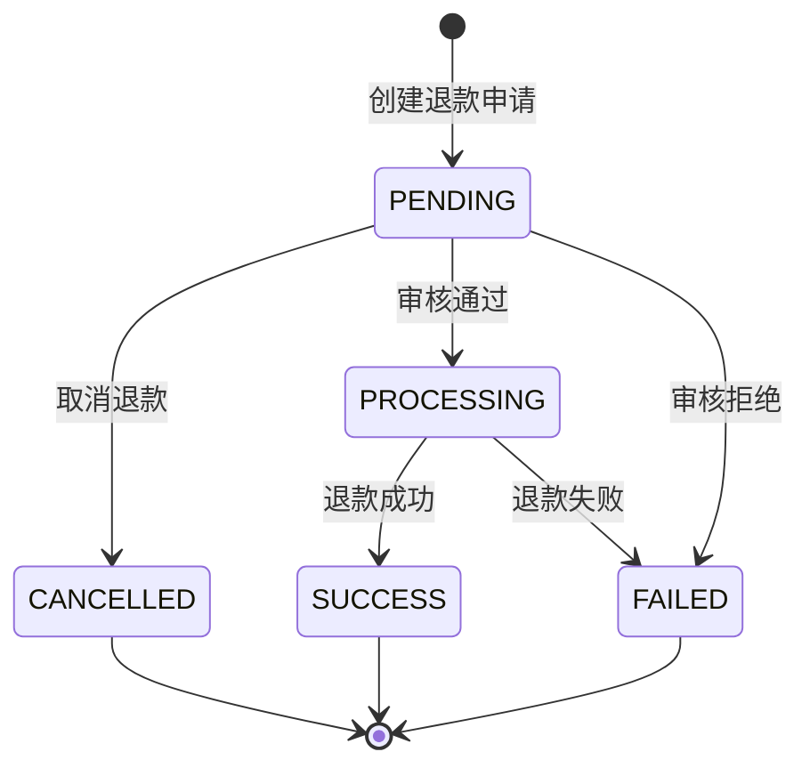
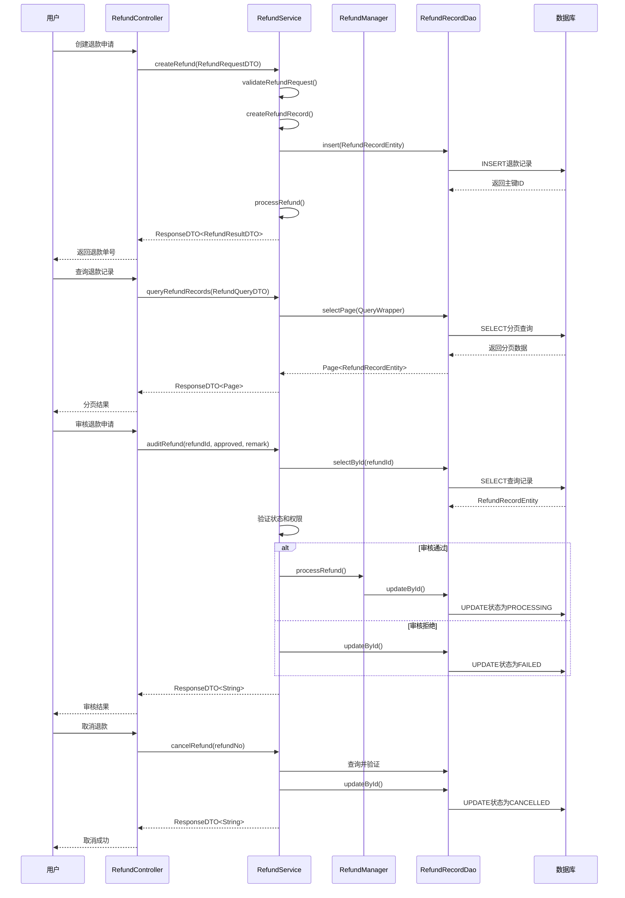
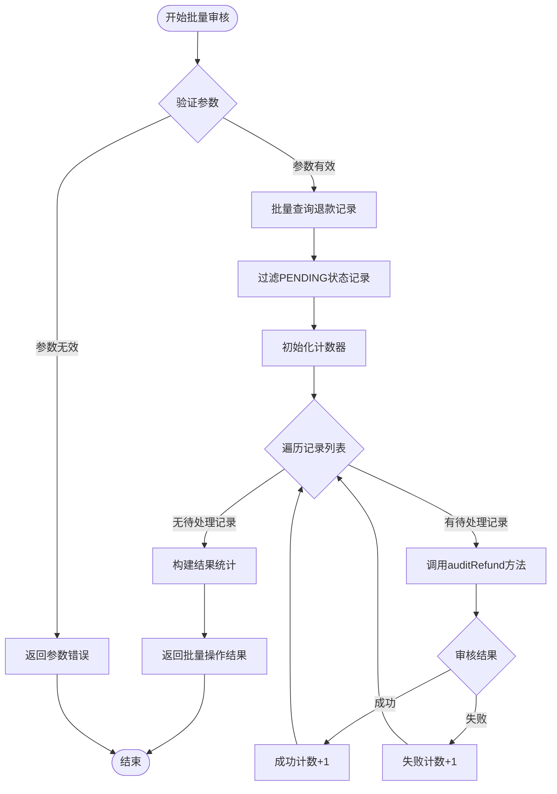

# 退款服务缺失方法实现设计文档

## 问题概述

### 编译错误分析

当前退款管理模块存在两类编译错误：

**错误类型一：RefundService缺失方法调用**（6个错误）
- `queryRefundRecords(RefundQueryDTO)` - 分页查询退款记录
- `getRefundByNo(String)` - 根据退款单号获取详情
- `cancelRefund(String)` - 取消退款
- `resubmitRefund(String, RefundRequestDTO)` - 重新提交退款
- `batchAuditRefund(List<Long>, boolean, String)` - 批量审核退款
- `getRefundStatusStatistics()` - 退款状态统计

**错误类型二：AbnormalOperationReport字段访问错误**（18个错误）
- AbnormalOperationReport主类中错误引用了内部类AbnormalityDetail和StatisticalAnalysis的私有字段
- 违反了Java封装原则，在外部类中直接访问内部类实例字段

### 影响范围

- **模块**：消费管理模块（consume module）
- **受影响文件**：
  - RefundController.java（6处方法调用错误）
  - AbnormalOperationReport.java（18处字段访问错误）
- **业务功能**：退款申请、审核、查询、统计、异常操作报告

## 设计目标

### 功能目标

1. 实现RefundService中缺失的6个业务方法
2. 修复AbnormalOperationReport中的字段访问错误
3. 确保所有方法符合四层架构规范（Controller → Service → Manager → DAO）
4. 保证事务一致性和数据安全性

### 质量目标

- 编译错误归零
- 遵循Spring Boot 3规范（jakarta包、@Resource注解）
- 代码复杂度控制在合理范围
- 单元测试覆盖率达到80%以上

## 技术方案

### 方案一：RefundService缺失方法实现

#### 1. queryRefundRecords方法设计

**方法签名**
```
public ResponseDTO<Page<RefundRecordEntity>> queryRefundRecords(RefundQueryDTO queryDTO)
```

**功能描述**
- 根据查询条件分页查询退款记录
- 支持多条件组合查询（用户ID、退款单号、状态、时间范围、金额范围等）

**实现策略**

| 步骤 | 操作描述 | 备注 |
|------|---------|------|
| 1. 参数验证 | 验证分页参数有效性（pageNum≥1, pageSize≤100） | 防止非法分页请求 |
| 2. 构建查询条件 | 根据DTO构建动态查询条件 | 使用MyBatis-Plus QueryWrapper |
| 3. 数据权限控制 | 根据用户角色限制查询范围 | 普通用户只能查自己的记录 |
| 4. 分页查询 | 调用RefundRecordDao分页查询 | 使用MyBatis-Plus分页插件 |
| 5. 结果封装 | 将查询结果封装为ResponseDTO | 统一响应格式 |

**查询条件映射表**

| 查询字段 | 数据库字段 | 查询方式 | 说明 |
|---------|-----------|---------|------|
| userId | user_id | 等值查询 | 用户ID精确匹配 |
| refundNo | refund_id | 等值查询 | 退款单号精确匹配 |
| originalOrderNo | original_order_no | 等值查询 | 原订单号精确匹配 |
| status | status | 等值查询 | 退款状态精确匹配 |
| startTime | apply_time | ≥查询 | 申请时间范围起始 |
| endTime | apply_time | ≤查询 | 申请时间范围结束 |
| minAmount | refund_amount | ≥查询 | 退款金额范围下限 |
| maxAmount | refund_amount | ≤查询 | 退款金额范围上限 |

#### 2. getRefundByNo方法设计

**方法签名**
```
public RefundRecordEntity getRefundByNo(String refundNo)
```

**功能描述**
- 根据退款单号获取退款记录详情
- 数据权限验证（非管理员只能查自己的记录）

**实现策略**

| 步骤 | 操作描述 | 备注 |
|------|---------|------|
| 1. 参数验证 | 验证退款单号不为空 | 空值检查 |
| 2. 数据库查询 | 通过RefundRecordDao查询记录 | 使用refund_id字段查询 |
| 3. 数据权限验证 | 验证当前用户是否有权限查看 | 获取当前登录用户ID比对 |
| 4. 返回结果 | 返回查询到的实体对象 | null表示记录不存在 |

**权限验证规则**

| 用户角色 | 权限范围 | 验证逻辑 |
|---------|---------|---------|
| 系统管理员 | 所有退款记录 | 不验证用户ID |
| 部门管理员 | 本部门用户的退款记录 | 验证用户所属部门 |
| 普通用户 | 仅自己的退款记录 | 验证用户ID一致性 |

#### 3. cancelRefund方法设计

**方法签名**
```
public ResponseDTO<String> cancelRefund(String refundNo)
```

**功能描述**
- 申请取消退款
- 仅允许待审核状态的退款进行取消

**状态转换流程**



**实现策略**

| 步骤 | 操作描述 | 备注 |
|------|---------|------|
| 1. 查询退款记录 | 根据退款单号查询记录 | 验证记录存在性 |
| 2. 状态验证 | 验证当前状态是否为PENDING | 仅待审核状态可取消 |
| 3. 权限验证 | 验证操作用户权限 | 仅申请人或管理员可取消 |
| 4. 更新状态 | 将状态更新为CANCELLED | 事务保证 |
| 5. 记录日志 | 记录取消操作日志 | 审计追踪 |

**业务规则**

| 规则项 | 验证条件 | 错误提示 |
|-------|---------|---------|
| 记录存在性 | refundRecord != null | "退款记录不存在" |
| 状态有效性 | status == PENDING | "当前状态不允许取消" |
| 用户权限 | userId == currentUserId OR isAdmin | "无权取消此退款申请" |

#### 4. resubmitRefund方法设计

**方法签名**
```
public ResponseDTO<RefundResultDTO> resubmitRefund(String refundNo, RefundRequestDTO refundRequest)
```

**功能描述**
- 重新提交被拒绝或已取消的退款申请
- 允许修改退款金额、原因和说明

**实现策略**

| 步骤 | 操作描述 | 备注 |
|------|---------|------|
| 1. 查询原记录 | 根据退款单号查询原记录 | 验证记录存在性 |
| 2. 状态验证 | 验证状态为FAILED或CANCELLED | 仅失败或取消状态可重新提交 |
| 3. 参数验证 | 验证新的退款请求参数 | 使用@Valid验证 |
| 4. 创建新记录 | 基于原记录创建新的退款记录 | 生成新的退款单号 |
| 5. 关联原记录 | 记录原退款单号（备注字段） | 便于追溯历史 |
| 6. 提交审核 | 状态设置为PENDING | 重新进入审核流程 |

**可重新提交的状态**

| 原状态 | 是否可重新提交 | 说明 |
|-------|---------------|------|
| PENDING | 否 | 待审核状态不允许重新提交 |
| PROCESSING | 否 | 处理中状态不允许重新提交 |
| SUCCESS | 否 | 成功状态不允许重新提交 |
| FAILED | 是 | 失败状态允许重新提交 |
| CANCELLED | 是 | 已取消状态允许重新提交 |

#### 5. batchAuditRefund方法设计

**方法签名**
```
public ResponseDTO<Map<String, Object>> batchAuditRefund(List<Long> refundIds, boolean approved, String remark)
```

**功能描述**
- 批量审核多个退款申请
- 返回批量操作结果统计

**实现策略**

| 步骤 | 操作描述 | 备注 |
|------|---------|------|
| 1. 参数验证 | 验证退款ID列表不为空 | 集合大小限制≤100 |
| 2. 批量查询 | 查询所有待审核的退款记录 | 使用IN查询 |
| 3. 状态过滤 | 过滤出PENDING状态的记录 | 忽略非待审核状态 |
| 4. 循环处理 | 逐条调用审核逻辑 | 使用已有auditRefund方法 |
| 5. 结果统计 | 统计成功、失败、跳过数量 | 构建返回结果 |
| 6. 事务控制 | 使用@Transactional确保一致性 | 失败全部回滚 |

**返回结果结构**

| 字段名 | 类型 | 说明 |
|-------|------|------|
| total | Integer | 总数量 |
| success | Integer | 审核成功数量 |
| failed | Integer | 审核失败数量 |
| skipped | Integer | 跳过数量（状态不符） |
| failedIds | List<Long> | 失败的退款ID列表 |
| skippedIds | List<Long> | 跳过的退款ID列表 |

#### 6. getRefundStatusStatistics方法设计

**方法签名**
```
public ResponseDTO<Map<String, Object>> getRefundStatusStatistics()
```

**功能描述**
- 统计各状态退款记录数量
- 提供数据权限控制（普通用户仅统计自己的数据）

**实现策略**

| 步骤 | 操作描述 | 备注 |
|------|---------|------|
| 1. 获取当前用户 | 获取登录用户信息 | 用于数据权限控制 |
| 2. 构建查询条件 | 根据用户角色构建查询条件 | 管理员无限制 |
| 3. 状态分组统计 | GROUP BY status统计各状态数量 | 使用数据库分组查询 |
| 4. 结果封装 | 封装为Map返回 | 包含各状态统计数据 |

**统计维度**

| 统计项 | 数据库查询 | 说明 |
|-------|-----------|------|
| totalCount | COUNT(*) | 总退款记录数 |
| pendingCount | COUNT(*) WHERE status='PENDING' | 待审核数量 |
| processingCount | COUNT(*) WHERE status='PROCESSING' | 处理中数量 |
| successCount | COUNT(*) WHERE status='SUCCESS' | 成功数量 |
| failedCount | COUNT(*) WHERE status='FAILED' | 失败数量 |
| cancelledCount | COUNT(*) WHERE status='CANCELLED' | 已取消数量 |
| totalAmount | SUM(refund_amount) | 总退款金额 |
| successAmount | SUM(refund_amount) WHERE status='SUCCESS' | 成功退款金额 |

### 方案二：AbnormalOperationReport字段访问错误修复

#### 问题分析

**错误根源**
- AbnormalOperationReport主类中定义了手动getter/setter方法（259-498行）
- 这些方法试图访问内部类AbnormalityDetail和StatisticalAnalysis的私有字段
- Java中外部类不能直接访问内部类实例的私有字段

**错误示例**
```
第380-385行：尝试访问detailId字段
第388-393行：尝试访问anomalyType字段
第444-449行：尝试访问anomalyTypeDistribution字段
```

#### 修复策略

**策略一：删除错误的getter/setter方法**（推荐）

| 步骤 | 操作描述 | 理由 |
|------|---------|------|
| 1. 删除错误方法 | 删除380-498行的所有错误方法 | 这些字段属于内部类，不应在外部类定义 |
| 2. 依赖Lombok | 使用@Data注解自动生成getter/setter | 已在类上声明@Data注解 |
| 3. 内部类完整性 | 确保内部类已正确声明@Data注解 | AbnormalityDetail和StatisticalAnalysis已声明 |

**删除范围明细**

| 起始行 | 结束行 | 方法名称 | 字段归属 |
|-------|-------|---------|---------|
| 380 | 385 | getDetailId/setDetailId | AbnormalityDetail.detailId |
| 388 | 393 | getAnomalyType/setAnomalyType | AbnormalityDetail.anomalyType |
| 396 | 401 | getDescription/setDescription | AbnormalityDetail.description |
| 404 | 409 | getOccurTime/setOccurTime | AbnormalityDetail.occurTime |
| 412 | 417 | getAmount/setAmount | AbnormalityDetail.amount |
| 420 | 425 | getSeverity/setSeverity | AbnormalityDetail.severity |
| 428 | 433 | isIsHandled/setIsHandled | AbnormalityDetail.isHandled |
| 436 | 441 | getHandlingAction/setHandlingAction | AbnormalityDetail.handlingAction |
| 444 | 449 | getAnomalyTypeDistribution/setAnomalyTypeDistribution | StatisticalAnalysis.anomalyTypeDistribution |
| 452 | 457 | getTimeDistribution/setTimeDistribution | StatisticalAnalysis.timeDistribution |
| 460 | 465 | getAmountDistribution/setAmountDistribution | StatisticalAnalysis.amountDistribution |
| 468 | 473 | getLocationDistribution/setLocationDistribution | StatisticalAnalysis.locationDistribution |
| 476 | 481 | getTrendAnalysis/setTrendAnalysis | StatisticalAnalysis.trendAnalysis |
| 484 | 489 | getYearOverYearChange/setYearOverYearChange | StatisticalAnalysis.yearOverYearChange |
| 492 | 498 | getMonthOverMonthChange/setMonthOverMonthChange | StatisticalAnalysis.monthOverMonthChange |

**验证Lombok有效性**

| 验证项 | 期望结果 | 说明 |
|-------|---------|------|
| @Data注解存在 | 外部类第4行已声明 | Lombok自动生成getter/setter |
| 内部类@Data注解 | AbnormalityDetail第75行、StatisticalAnalysis第109行已声明 | 内部类字段自动生成 |
| Lombok依赖完整 | pom.xml已配置Lombok依赖 | 编译时处理注解 |

## 数据库交互设计

### 查询方法数据库操作

#### queryRefundRecords查询SQL设计

**查询表**：t_consume_refund_record

**动态查询条件构建**

使用MyBatis-Plus QueryWrapper构建动态查询条件，查询条件根据RefundQueryDTO中的非空字段组合构建。

**查询字段映射**

| 查询条件 | SQL WHERE子句 | 参数类型 |
|---------|--------------|---------|
| userId | user_id = ? | Long |
| refundNo | refund_id = ? | String |
| originalOrderNo | original_order_no = ? | String |
| status | status = ? | String |
| startTime | apply_time >= ? | LocalDateTime |
| endTime | apply_time <= ? | LocalDateTime |
| minAmount | refund_amount >= ? | BigDecimal |
| maxAmount | refund_amount <= ? | BigDecimal |
| thirdPartyRefundNo | third_party_refund_no = ? | String |

**分页参数**

| 参数名 | 说明 | 默认值 | 限制 |
|-------|------|-------|------|
| pageNum | 页码 | 1 | ≥1 |
| pageSize | 每页条数 | 20 | 1-100 |

#### getRefundByNo查询SQL设计

**查询表**：t_consume_refund_record

**查询条件**
```
WHERE refund_id = ? AND deleted_flag = 0
```

**返回字段**：所有字段（SELECT *）

#### getRefundStatusStatistics统计SQL设计

**统计查询设计**

需要执行多个COUNT查询或使用GROUP BY聚合，根据数据权限动态添加WHERE条件。

**数据权限WHERE条件**

| 用户角色 | WHERE条件 | 说明 |
|---------|----------|------|
| 系统管理员 | 无限制 | 统计所有数据 |
| 部门管理员 | user_id IN (部门用户列表) | 统计本部门数据 |
| 普通用户 | user_id = ? | 统计个人数据 |

**统计SQL逻辑**

按状态分组统计：
```
SELECT 
  status,
  COUNT(*) as count,
  SUM(refund_amount) as totalAmount
FROM t_consume_refund_record
WHERE deleted_flag = 0
  [AND 数据权限条件]
GROUP BY status
```

### 更新方法数据库操作

#### cancelRefund更新SQL设计

**更新表**：t_consume_refund_record

**更新字段**

| 字段名 | 更新值 | 说明 |
|-------|-------|------|
| status | 'CANCELLED' | 更新为已取消状态 |
| process_time | 当前时间 | 记录处理时间 |
| remark | 取消原因 | 可选参数 |
| update_time | 当前时间 | 审计字段自动更新 |
| update_user_id | 当前用户ID | 审计字段自动更新 |

**更新WHERE条件**
```
WHERE refund_id = ? 
  AND status = 'PENDING'
  AND deleted_flag = 0
```

#### batchAuditRefund批量更新设计

**更新策略**：循环调用单条审核方法，利用已有的auditRefund方法

**事务控制**：方法级别@Transactional，确保批量操作的原子性

**失败处理**：任一记录审核失败则整体回滚

## 业务流程设计

### 退款全生命周期流程



### 批量审核流程



## 异常处理设计

### 异常分类和处理策略

#### 业务异常

| 异常场景 | 异常类型 | 错误码 | 处理策略 |
|---------|---------|-------|---------|
| 退款记录不存在 | 业务异常 | DATA_NOT_EXIST | 返回错误提示，记录日志 |
| 退款状态不允许操作 | 业务异常 | PARAM_ERROR | 返回状态错误提示 |
| 无权操作退款记录 | 权限异常 | NO_PERMISSION | 返回无权限提示 |
| 退款金额超限 | 业务异常 | PARAM_ERROR | 返回金额验证失败提示 |
| 参数验证失败 | 参数异常 | PARAM_ERROR | 返回具体参数错误信息 |

#### 系统异常

| 异常场景 | 异常类型 | 处理策略 |
|---------|---------|---------|
| 数据库连接异常 | 系统异常 | 记录ERROR日志，返回系统繁忙 |
| 事务回滚异常 | 系统异常 | 记录ERROR日志，返回操作失败 |
| 空指针异常 | 系统异常 | 记录ERROR日志，返回系统错误 |
| 未知异常 | 系统异常 | 记录ERROR日志，返回系统错误 |

### 异常处理代码结构

**Service层统一异常处理模式**

每个方法采用try-catch结构：

| 异常类型 | 捕获方式 | 日志级别 | 返回内容 |
|---------|---------|---------|---------|
| 业务异常 | 提前判断返回 | WARN | 具体业务错误信息 |
| 系统异常 | catch(Exception e) | ERROR | 通用错误提示 |

**日志记录规范**

| 日志级别 | 使用场景 | 示例 |
|---------|---------|------|
| INFO | 正常业务流程节点 | "开始创建退款申请" |
| WARN | 业务验证失败 | "退款请求验证失败: {原因}" |
| ERROR | 系统异常 | "创建退款申请失败", 附带异常堆栈 |

## 数据权限控制设计

### 权限验证矩阵

| 操作 | 系统管理员 | 部门管理员 | 普通用户 | 验证规则 |
|------|-----------|-----------|---------|---------|
| 创建退款 | 允许 | 允许 | 仅本人 | userId == currentUserId |
| 查询退款 | 所有数据 | 本部门数据 | 仅本人 | 根据角色过滤数据 |
| 审核退款 | 允许 | 本部门数据 | 不允许 | 需要审核权限 |
| 取消退款 | 允许 | 本部门数据 | 仅本人 | userId == currentUserId OR isAdmin |
| 统计数据 | 所有数据 | 本部门数据 | 仅本人 | 根据角色统计范围 |

### 权限验证实现方式

**获取当前用户信息**

通过Sa-Token的StpUtil工具类获取登录用户ID和角色信息。

**数据权限过滤**

在Service层查询数据前，根据用户角色动态添加查询条件。

**权限验证逻辑**

| 验证步骤 | 操作描述 |
|---------|---------|
| 1. 获取当前用户 | 从Sa-Token上下文获取用户信息 |
| 2. 查询目标记录 | 从数据库查询退款记录 |
| 3. 权限比对 | 比对用户ID或角色权限 |
| 4. 通过/拒绝 | 返回成功或权限错误 |

## 性能优化设计

### 查询优化

| 优化项 | 优化方案 | 预期效果 |
|-------|---------|---------|
| 分页查询 | 使用数据库分页而非内存分页 | 减少内存占用 |
| 索引优化 | 为常用查询字段建立索引 | 提升查询速度 |
| 批量查询 | 使用IN查询代替循环查询 | 减少数据库交互次数 |

**建议添加的索引**

| 索引名称 | 索引字段 | 索引类型 | 说明 |
|---------|---------|---------|------|
| idx_user_status | (user_id, status) | 复合索引 | 用户退款查询优化 |
| idx_refund_no | refund_id | 唯一索引 | 退款单号查询优化 |
| idx_apply_time | apply_time | 普通索引 | 时间范围查询优化 |
| idx_status | status | 普通索引 | 状态统计查询优化 |

### 事务优化

| 优化项 | 优化方案 | 说明 |
|-------|---------|------|
| 事务边界控制 | 仅在Service层使用@Transactional | 避免事务嵌套 |
| 只读事务 | 查询方法使用readOnly=true | 提升数据库性能 |
| 事务传播 | 合理设置传播行为 | 批量操作使用REQUIRED |

### 缓存策略（可选）

| 缓存项 | 缓存方案 | 缓存时长 | 说明 |
|-------|---------|---------|------|
| 退款状态统计 | Redis缓存 | 5分钟 | 统计数据允许短暂延迟 |
| 用户权限信息 | Sa-Token缓存 | 会话期间 | 减少权限查询 |

## 测试策略

### 单元测试覆盖

#### RefundService测试用例

| 测试方法 | 测试场景 | 预期结果 |
|---------|---------|---------|
| testQueryRefundRecords_Success | 正常分页查询 | 返回分页数据 |
| testQueryRefundRecords_EmptyResult | 无数据查询 | 返回空分页 |
| testQueryRefundRecords_MultipleConditions | 多条件组合查询 | 返回过滤后数据 |
| testGetRefundByNo_Success | 查询存在的退款单号 | 返回退款记录 |
| testGetRefundByNo_NotFound | 查询不存在的退款单号 | 返回null |
| testGetRefundByNo_NoPermission | 查询无权限的退款记录 | 抛出权限异常 |
| testCancelRefund_Success | 取消待审核退款 | 状态更新为CANCELLED |
| testCancelRefund_InvalidStatus | 取消非待审核退款 | 返回状态错误 |
| testResubmitRefund_Success | 重新提交失败退款 | 创建新退款记录 |
| testResubmitRefund_InvalidStatus | 重新提交待审核退款 | 返回状态错误 |
| testBatchAuditRefund_Success | 批量审核成功 | 返回成功统计 |
| testBatchAuditRefund_PartialSuccess | 部分记录状态不符 | 返回部分成功统计 |
| testGetRefundStatusStatistics_Admin | 管理员查询统计 | 返回全量统计 |
| testGetRefundStatusStatistics_User | 普通用户查询统计 | 返回个人统计 |

### 集成测试

| 测试场景 | 测试步骤 | 验证点 |
|---------|---------|-------|
| 完整退款流程 | 创建→查询→审核→查看详情 | 状态流转正确 |
| 批量审核流程 | 创建多条→批量审核→统计 | 批量操作成功 |
| 取消重新提交流程 | 创建→取消→重新提交→审核 | 允许重新提交 |

## 实施计划

### 开发任务分解

| 任务ID | 任务描述 | 优先级 | 预估工作量 |
|-------|---------|-------|-----------|
| TASK-1 | 修复AbnormalOperationReport字段访问错误 | 高 | 0.5小时 |
| TASK-2 | 实现queryRefundRecords方法 | 高 | 2小时 |
| TASK-3 | 实现getRefundByNo方法 | 高 | 1小时 |
| TASK-4 | 实现cancelRefund方法 | 高 | 1.5小时 |
| TASK-5 | 实现resubmitRefund方法 | 中 | 2小时 |
| TASK-6 | 实现batchAuditRefund方法 | 中 | 2小时 |
| TASK-7 | 实现getRefundStatusStatistics方法 | 中 | 1.5小时 |
| TASK-8 | 编写单元测试 | 高 | 3小时 |
| TASK-9 | 集成测试和验证 | 高 | 1.5小时 |

**总预估工作量**：15小时

### 实施步骤

| 阶段 | 步骤 | 产出物 | 验收标准 |
|------|------|-------|---------|
| 第一阶段 | 修复AbnormalOperationReport错误 | 编译通过的Java文件 | 编译0错误 |
| 第二阶段 | 实现RefundService核心方法 | 完整的Service实现 | 编译通过且逻辑完整 |
| 第三阶段 | 编写单元测试 | 测试类和测试用例 | 覆盖率≥80% |
| 第四阶段 | 集成测试验证 | 测试报告 | 所有测试用例通过 |
| 第五阶段 | 代码审查和优化 | 优化后的代码 | 通过代码质量检查 |

## 风险评估和应对

### 技术风险

| 风险项 | 风险等级 | 影响 | 应对措施 |
|-------|---------|------|---------|
| Lombok注解失效 | 低 | AbnormalOperationReport编译错误 | 验证Lombok配置，必要时手动添加getter/setter |
| 数据权限逻辑复杂 | 中 | 实现困难，可能遗漏场景 | 详细设计权限矩阵，充分测试 |
| 批量操作性能问题 | 中 | 大批量审核超时 | 限制批量大小≤100，考虑异步处理 |

### 业务风险

| 风险项 | 风险等级 | 影响 | 应对措施 |
|-------|---------|------|---------|
| 退款状态流转遗漏 | 高 | 业务逻辑错误 | 严格按照状态机设计验证 |
| 数据一致性问题 | 高 | 数据不一致 | 使用事务确保原子性 |
| 权限控制不严格 | 高 | 数据泄露风险 | 充分测试各角色权限 |

## 验收标准

### 功能验收

| 验收项 | 验收标准 | 验收方法 |
|-------|---------|---------|
| 编译检查 | 0编译错误 | 执行mvn clean compile |
| 方法完整性 | 6个缺失方法全部实现 | 代码审查 |
| 字段访问修复 | AbnormalOperationReport编译通过 | 编译验证 |
| 单元测试 | 覆盖率≥80% | JaCoCo报告 |
| 集成测试 | 所有测试用例通过 | 测试报告 |

### 质量验收

| 验收项 | 验收标准 | 验收方法 |
|-------|---------|---------|
| 代码规范 | 遵循repowiki规范 | 静态代码检查 |
| 代码复杂度 | 圈复杂度≤10 | SonarQube检查 |
| 异常处理 | 所有方法都有异常处理 | 代码审查 |
| 日志记录 | 关键节点都有日志 | 代码审查 |
| 权限控制 | 所有方法都有权限验证 | 功能测试 |

### 性能验收

| 验收项 | 验收标准 | 验收方法 |
|-------|---------|---------|
| 分页查询 | 响应时间≤500ms（1000条数据） | 性能测试 |
| 批量审核 | 100条记录≤3秒 | 性能测试 |
| 统计查询 | 响应时间≤1秒 | 性能测试 |

## 附录

### 相关实体类设计

#### RefundRecordEntity字段说明

| 字段名 | 类型 | 说明 | 约束 |
|-------|------|------|------|
| id | Long | 主键ID | 自增 |
| refundId | String | 退款单号 | 唯一索引 |
| userId | Long | 用户ID | 非空 |
| originalOrderNo | String | 原订单号 | 非空 |
| refundAmount | BigDecimal | 退款金额 | 非空，>0 |
| status | String | 退款状态 | 枚举值 |
| reason | String | 退款原因 | 非空 |
| applyTime | LocalDateTime | 申请时间 | 非空 |
| processTime | LocalDateTime | 处理时间 | 可空 |
| remark | String | 备注 | 可空 |
| thirdPartyRefundNo | String | 第三方退款单号 | 可空 |

#### RefundStatusEnum枚举值

| 枚举值 | 说明 | 数据库值 |
|-------|------|---------|
| PENDING | 待审核 | PENDING |
| PROCESSING | 处理中 | PROCESSING |
| SUCCESS | 成功 | SUCCESS |
| FAILED | 失败 | FAILED |
| CANCELLED | 已取消 | CANCELLED |

### 数据库表结构建议

**表名**：t_consume_refund_record

**建议索引**

```
PRIMARY KEY (id)
UNIQUE INDEX uk_refund_id (refund_id)
INDEX idx_user_status (user_id, status)
INDEX idx_apply_time (apply_time)
INDEX idx_original_order_no (original_order_no)
```

### 配置项说明

| 配置项 | 配置值 | 说明 |
|-------|-------|------|
| refund.batch.max-size | 100 | 批量审核最大数量 |
| refund.query.max-page-size | 100 | 分页查询最大条数 |
| refund.statistics.cache-time | 300 | 统计缓存时间（秒） |
