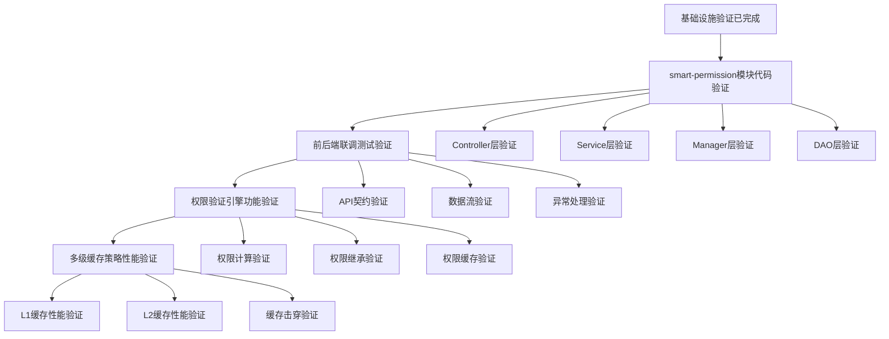

# 模块代码验证设计文档

## 文档元数据

- **文档类型**: 技术验证方案
- **验证范围**: smart-permission模块全栈验证
- **验证层级**: 后端模块验证、前端联调验证、功能验证、性能验证
- **设计原则**: 零代码设计、验证驱动、质量优先

## 验证背景

### 已完成验证项

根据用户反馈,以下基础验证已完成:

1. **BaseEntity审计字段复用验证** - 实体基础设施验证通过
2. **Caffeine缓存Bean可用性验证** - 缓存基础设施验证通过
3. **ResponseDTO统一响应格式验证** - 响应格式标准化验证通过
4. **Sa-Token权限注解体系验证** - 权限基础设施验证通过
5. **数据库表结构可用性验证** - 数据层基础验证通过
6. **前端组件复用性验证** - 前端基础设施验证通过

### 待验证项分析

基于已完成验证的基础设施,需要进行以下四项核心验证:

| 验证项 | 验证层级 | 依赖关系 | 优先级 |
|--------|---------|---------|--------|
| smart-permission模块代码实现验证 | 后端模块层 | 依赖已完成的6项基础验证 | P0 |
| 前后端联调测试验证 | 集成层 | 依赖smart-permission模块验证 | P0 |
| 权限验证引擎功能验证 | 功能层 | 依赖前后端联调验证 | P1 |
| 多级缓存策略性能验证 | 性能层 | 依赖权限引擎功能验证 | P1 |

## 验证策略

### 验证原则

1. **分层验证原则**: 按照依赖关系从下至上逐层验证
2. **零异常原则**: 每个验证阶段必须0错误、0警告才能进入下一阶段
3. **文档驱动原则**: 所有验证步骤基于repowiki规范文档
4. **自动化优先原则**: 优先使用自动化脚本进行验证

### 验证依赖链



## 验证任务一: smart-permission模块代码实现验证

### 验证目标

验证smart-permission模块的四层架构实现是否符合repowiki规范,确保代码质量达到生产环境标准。

### 验证范围

#### 后端四层架构验证

基于repowiki架构规范,验证以下层级:

| 层级 | 验证内容 | 验证标准 |
|------|---------|---------|
| Controller层 | 参数验证、权限注解、响应格式 | @Valid覆盖率100%、@SaCheckPermission覆盖率100%、ResponseDTO统一返回 |
| Service层 | 事务管理、业务逻辑、异常处理 | @Transactional正确使用、业务逻辑清晰、SmartException规范使用 |
| Manager层 | 跨模块调用、复杂业务编排 | 无直接数据库访问、依赖注入使用@Resource |
| DAO层 | MyBatis映射、SQL规范 | Mapper.xml配置正确、SQL性能优化、参数化查询 |

#### 核心功能模块验证清单

**权限资源管理模块**

验证点:
- 资源树构建逻辑是否正确
- 资源与角色关联关系是否完整
- 资源CRUD操作是否符合规范
- 资源权限编码生成是否唯一

**角色权限管理模块**

验证点:
- 角色与资源多对多关联是否正确
- 角色继承逻辑是否实现
- 角色权限变更缓存同步是否正常
- 角色数据权限隔离是否生效

**用户权限关联模块**

验证点:
- 用户与角色多对多关联是否正确
- 用户权限聚合计算是否准确
- 用户权限缓存更新是否及时
- 用户权限查询性能是否达标

**权限验证引擎模块**

验证点:
- Sa-Token集成是否正确
- 权限验证注解是否生效
- 权限计算逻辑是否准确
- 权限缓存策略是否合理

### 验证方法

#### 静态代码验证

使用自动化脚本验证代码规范:

**验证脚本执行顺序**

```
第一步: 包名规范验证
检查目标: 确保使用jakarta.*而非javax.*
检查脚本: scripts/strict-package-check.sh
通过标准: javax使用数量 = 0

第二步: 依赖注入规范验证
检查目标: 确保使用@Resource而非@Autowired
检查脚本: find命令查找@Autowired使用
通过标准: @Autowired使用数量 = 0

第三步: 架构层级验证
检查目标: 确保Controller不直接访问DAO
检查脚本: grep查找Controller中@Resource.*Dao模式
通过标准: 违规数量 = 0

第四步: 日志规范验证
检查目标: 确保使用SLF4J而非System.out
检查脚本: find命令查找System.out.println
通过标准: 使用数量 = 0

第五步: 权限注解验证
检查目标: 确保敏感接口添加@SaCheckPermission
验证方式: 统计Controller方法总数与权限注解数量比例
通过标准: 覆盖率 ≥ 80%
```

#### 编译完整性验证

**验证步骤**

```
步骤1: 清理构建环境
命令: cd smart-admin-api-java17-springboot3 && mvn clean
预期: 清理成功,无残留文件

步骤2: 完整编译验证
命令: mvn compile -DskipTests
预期: 编译成功,0错误,0警告

步骤3: 打包完整性验证
命令: mvn package -DskipTests
预期: 打包成功,生成JAR文件

步骤4: 依赖完整性验证
命令: mvn dependency:tree
预期: 依赖树完整,无冲突
```

#### MyBatis配置验证

**Mapper.xml验证清单**

验证点:
- namespace配置是否与Mapper接口全限定名匹配
- resultMap配置是否与Entity字段对应
- SQL语句是否使用参数化查询
- 关联查询是否正确配置resultMap
- 是否存在SQL注入风险

**Entity映射验证清单**

验证点:
- Entity是否继承BaseEntity
- 字段命名是否符合驼峰规范
- 数据库字段映射是否正确(@TableField)
- 逻辑删除字段是否配置(@TableLogic)
- 是否有重复定义的审计字段

#### 单元测试验证

**测试覆盖率要求**

| 层级 | 覆盖率要求 | 测试重点 |
|------|-----------|---------|
| Controller | ≥ 80% | 参数验证、权限验证、异常处理 |
| Service | ≥ 85% | 业务逻辑、事务边界、异常场景 |
| Manager | ≥ 80% | 跨模块调用、业务编排 |
| DAO | ≥ 90% | CRUD操作、关联查询、分页查询 |

**测试执行步骤**

```
步骤1: 执行单元测试
命令: mvn test
预期: 所有测试通过,0失败

步骤2: 生成覆盖率报告
命令: mvn test jacoco:report
预期: 生成target/site/jacoco/index.html报告

步骤3: 验证覆盖率达标
检查: 查看jacoco报告中各层覆盖率
通过标准: 所有层级达到要求覆盖率
```

### 验证通过标准

**代码质量门禁**

| 检查项 | 通过标准 | 检查方式 |
|--------|---------|---------|
| 包名规范 | javax使用数量 = 0 | 自动化脚本 |
| 依赖注入规范 | @Autowired使用数量 = 0 | 自动化脚本 |
| 架构规范 | Controller直接访问DAO = 0 | 自动化脚本 |
| 日志规范 | System.out使用数量 = 0 | 自动化脚本 |
| 编译成功 | 0错误,0警告 | Maven编译 |
| 单元测试 | 100%通过,覆盖率达标 | Maven test |
| MyBatis配置 | 所有Mapper可正常加载 | 启动验证 |

## 验证任务二: 前后端联调测试验证

### 验证目标

验证前后端集成的完整性和正确性,确保API契约、数据流、异常处理符合设计规范。

### 验证范围

#### API契约验证

基于OpenAPI规范验证前后端接口契约一致性:

**接口契约验证清单**

| 验证维度 | 验证内容 | 验证方法 |
|---------|---------|---------|
| 请求路径 | 前端调用路径与后端@RequestMapping是否一致 | 对比api/*.js与Controller注解 |
| 请求方法 | GET/POST/PUT/DELETE方法是否匹配 | 对比axios方法与@GetMapping等注解 |
| 请求参数 | 参数名称、类型、必填性是否一致 | 对比TS接口定义与DTO字段 |
| 响应格式 | 响应数据结构是否符合ResponseDTO规范 | 验证response.data.code/msg/data结构 |
| 错误码 | 前端错误处理与后端错误码是否对应 | 对比前端错误码常量与后端ErrorCode枚举 |

**契约测试实施步骤**

```
步骤1: 生成后端OpenAPI文档
方式: 启动后端服务,访问Swagger UI
地址: http://localhost:1024/doc.html
验证: 所有smart-permission接口可见

步骤2: 导出OpenAPI JSON规范
方式: 访问/v3/api-docs端点
保存: 保存为openapi-permission.json
验证: JSON格式正确,包含所有接口定义

步骤3: 前端API契约对比
方式: 对比前端api/permission/*.js与OpenAPI规范
工具: 使用openapi-diff工具
通过标准: 0差异,100%匹配

步骤4: 自动化契约测试
方式: 使用Pact或Spring Cloud Contract
执行: mvn verify执行契约测试
通过标准: 所有契约测试通过
```

#### 数据流验证

验证前后端数据传输的完整性和准确性:

**数据流验证场景**

场景一: 权限资源查询流程
```
前端操作流程:
1. 用户打开权限资源管理页面
2. 前端调用GET /api/permission/resource/tree
3. 接收资源树数据并渲染

验证点:
- 请求参数是否正确传递
- 响应数据结构是否符合预期
- 树形结构嵌套是否正确
- 前端渲染是否无报错
```

场景二: 角色权限分配流程
```
前端操作流程:
1. 用户选择角色并点击分配权限
2. 勾选资源树中的权限节点
3. 提交保存,调用POST /api/permission/role/assign
4. 接收保存结果并刷新页面

验证点:
- 请求体数据格式是否正确
- 后端参数验证是否生效
- 事务提交是否成功
- 缓存更新是否及时
- 前端提示信息是否准确
```

场景三: 用户权限验证流程
```
前端操作流程:
1. 用户登录系统
2. 前端调用GET /api/permission/user/current获取当前用户权限
3. 根据权限控制菜单和按钮显示
4. 执行操作时后端再次验证权限

验证点:
- 用户权限数据是否完整
- 前端权限控制是否生效
- 后端权限验证是否拦截
- 权限缓存是否命中
```

#### 异常处理验证

验证前后端异常处理的完整性:

**异常场景验证清单**

| 异常类型 | 触发方式 | 预期前端行为 | 预期后端行为 |
|---------|---------|-------------|-------------|
| 参数验证失败 | 提交空必填字段 | 显示字段级错误提示 | 返回400,参数错误信息 |
| 权限不足 | 访问无权限接口 | 跳转403页面或提示无权限 | 返回403,权限验证失败 |
| 数据不存在 | 查询不存在的资源ID | 提示数据不存在 | 返回404,资源未找到 |
| 业务规则冲突 | 删除被引用的资源 | 提示业务冲突原因 | 返回400,业务异常信息 |
| 系统异常 | 模拟数据库连接失败 | 提示系统繁忙请稍后重试 | 返回500,记录错误日志 |
| 网络超时 | 模拟接口响应超时 | 提示网络超时,支持重试 | 后端正常处理或熔断 |

**异常验证实施步骤**

```
步骤1: 参数验证异常测试
触发: 前端提交空roleId
预期后端响应: 
{
  "code": 400,
  "msg": "角色ID不能为空",
  "data": null
}
预期前端行为: 在roleId输入框下方显示红色错误提示

步骤2: 权限验证异常测试
触发: 普通用户访问删除权限资源接口
预期后端响应:
{
  "code": 403,
  "msg": "无权限访问",
  "data": null
}
预期前端行为: 显示"您没有权限执行此操作"提示

步骤3: 业务异常测试
触发: 删除已被角色使用的权限资源
预期后端响应:
{
  "code": 400,
  "msg": "该资源已被角色使用,无法删除",
  "data": null
}
预期前端行为: 显示业务错误提示,停留在当前页面

步骤4: 系统异常测试
触发: 模拟数据库连接失败
预期后端响应:
{
  "code": 500,
  "msg": "系统繁忙,请稍后重试",
  "data": null
}
预期前端行为: 显示系统错误提示,支持重试按钮
```

### 验证方法

#### 自动化接口测试

使用Postman或Newman执行自动化API测试:

**测试集结构**

```
Permission Module API Tests
├── Resource Management
│   ├── Query Resource Tree (GET)
│   ├── Create Resource (POST)
│   ├── Update Resource (PUT)
│   ├── Delete Resource (DELETE)
│   └── Query Resource Detail (GET)
├── Role Permission Management
│   ├── Query Role Permissions (GET)
│   ├── Assign Permissions (POST)
│   ├── Revoke Permissions (DELETE)
│   └── Batch Assign (POST)
├── User Permission Query
│   ├── Get Current User Permissions (GET)
│   ├── Check User Permission (POST)
│   └── Get User Menu Tree (GET)
└── Exception Scenarios
    ├── Invalid Parameters
    ├── Unauthorized Access
    ├── Resource Not Found
    └── Business Rule Violation
```

**测试执行方式**

```
方式1: Postman GUI执行
步骤: 导入测试集 → 配置环境变量 → 运行Collection
验证: 查看Test Results,确保所有测试通过

方式2: Newman命令行执行
命令: newman run permission-api-tests.json -e env.json
验证: 检查终端输出,确保0失败

方式3: CI/CD集成
配置: 在GitLab CI中配置newman测试步骤
触发: 每次代码提交自动执行
通过标准: 所有API测试通过
```

#### 前端E2E测试

使用Cypress或Playwright执行端到端测试:

**E2E测试场景**

场景一: 权限资源管理完整流程
```
测试步骤:
1. 登录系统(使用管理员账号)
2. 导航至权限资源管理页面
3. 点击新增资源按钮
4. 填写资源信息(名称、编码、URL等)
5. 提交保存
6. 验证资源列表中出现新增资源
7. 点击编辑,修改资源名称
8. 提交保存,验证修改成功
9. 点击删除,确认删除
10. 验证资源列表中不再显示该资源

验证点:
- 表单验证是否生效
- API调用是否成功
- 页面刷新是否正常
- 提示信息是否准确
```

场景二: 角色权限分配流程
```
测试步骤:
1. 登录系统(使用管理员账号)
2. 导航至角色管理页面
3. 选择测试角色,点击分配权限
4. 勾选资源树中的部分权限
5. 提交保存
6. 验证保存成功提示
7. 刷新页面,验证权限勾选状态保持
8. 使用该角色账号登录
9. 验证菜单和按钮权限生效

验证点:
- 树形组件交互是否正常
- 权限勾选状态是否正确
- 后端保存是否成功
- 权限验证是否生效
```

#### 性能基准测试

验证接口响应时间是否满足性能要求:

**性能指标要求**

| 接口类型 | 响应时间要求 | 并发要求 | 测试工具 |
|---------|-------------|---------|---------|
| 查询接口 | P95 ≤ 200ms | 100并发 | JMeter/K6 |
| 创建接口 | P95 ≤ 500ms | 50并发 | JMeter/K6 |
| 更新接口 | P95 ≤ 500ms | 50并发 | JMeter/K6 |
| 删除接口 | P95 ≤ 300ms | 30并发 | JMeter/K6 |

**性能测试场景**

```
场景: 查询用户权限树接口性能测试
工具: Apache JMeter
配置:
- 线程数: 100
- Ramp-Up时间: 10秒
- 循环次数: 100
- 测试时长: 约3分钟

验证指标:
- 平均响应时间 ≤ 100ms
- P95响应时间 ≤ 200ms
- P99响应时间 ≤ 500ms
- 错误率 = 0%
- TPS ≥ 500

执行命令:
jmeter -n -t permission-query-test.jmx -l result.jtl -e -o report/
```

### 验证通过标准

**前后端联调质量门禁**

| 检查项 | 通过标准 | 验证方式 |
|--------|---------|---------|
| API契约一致性 | 100%匹配 | openapi-diff工具 |
| 自动化接口测试 | 100%通过 | Newman测试报告 |
| E2E测试 | 核心流程100%通过 | Cypress测试报告 |
| 异常处理完整性 | 所有异常场景正确处理 | 手工测试验证 |
| 性能基准达标 | 所有接口满足性能要求 | JMeter测试报告 |

## 验证任务三: 权限验证引擎功能验证

### 验证目标

验证权限验证引擎的核心功能:权限计算、权限继承、权限缓存是否正确实现。

### 验证范围

#### 权限计算逻辑验证

验证系统如何计算用户的最终权限:

**权限计算规则**

```
用户最终权限 = 用户直接关联角色权限 ∪ 用户所属部门角色权限 ∪ 用户继承上级角色权限

权限聚合规则:
1. 用户可关联多个角色
2. 每个角色可分配多个资源权限
3. 资源权限支持增量授权(只增不减)
4. 特殊场景支持权限禁用(优先级最高)
```

**权限计算验证场景**

场景一: 单角色用户权限计算
```
测试数据:
- 用户A: 关联角色"部门经理"
- 角色"部门经理": 拥有资源权限[P1, P2, P3]

验证步骤:
1. 调用权限计算接口获取用户A权限
2. 验证返回权限列表 = [P1, P2, P3]
3. 验证权限计算时间 < 50ms(含缓存)

通过标准: 权限完整,计算准确
```

场景二: 多角色用户权限聚合
```
测试数据:
- 用户B: 关联角色["部门经理", "项目负责人"]
- 角色"部门经理": 权限[P1, P2, P3]
- 角色"项目负责人": 权限[P3, P4, P5]

验证步骤:
1. 调用权限计算接口获取用户B权限
2. 验证返回权限列表 = [P1, P2, P3, P4, P5](去重)
3. 验证权限聚合逻辑正确(并集)

通过标准: 权限完整,无遗漏,无重复
```

场景三: 部门角色权限继承
```
测试数据:
- 用户C: 所属部门"研发部"
- 部门"研发部": 默认角色"研发人员"
- 角色"研发人员": 权限[P6, P7]
- 用户C直接关联角色: 无

验证步骤:
1. 调用权限计算接口获取用户C权限
2. 验证返回权限列表 = [P6, P7]
3. 验证部门角色继承生效

通过标准: 继承权限正确
```

场景四: 权限禁用场景
```
测试数据:
- 用户D: 关联角色"部门经理"
- 角色"部门经理": 权限[P1, P2, P3]
- 用户D: 显式禁用权限P2

验证步骤:
1. 调用权限计算接口获取用户D权限
2. 验证返回权限列表 = [P1, P3](不包含P2)
3. 验证权限禁用优先级高于角色授权

通过标准: 禁用权限生效
```

#### 权限继承机制验证

验证角色之间的权限继承关系:

**权限继承规则**

```
角色继承关系:
- 支持单继承(一个角色继承一个父角色)
- 继承深度限制: 最多3层
- 继承方式: 累加式继承(子角色拥有父角色所有权限+自身权限)
- 循环继承检测: 系统自动检测并阻止循环继承
```

**权限继承验证场景**

场景一: 二级继承验证
```
测试数据:
- 角色"系统管理员": 权限[P1, P2, P3, P4, P5]
- 角色"部门管理员": 继承"系统管理员",自身权限[P6, P7]
- 用户E: 关联角色"部门管理员"

验证步骤:
1. 查询角色"部门管理员"的有效权限
2. 验证权限列表 = [P1, P2, P3, P4, P5, P6, P7]
3. 查询用户E的权限
4. 验证用户权限 = [P1, P2, P3, P4, P5, P6, P7]

通过标准: 二级继承正确
```

场景二: 三级继承验证
```
测试数据:
- 角色"超级管理员": 权限[P1, P2]
- 角色"系统管理员": 继承"超级管理员",权限[P3, P4]
- 角色"部门管理员": 继承"系统管理员",权限[P5]
- 用户F: 关联角色"部门管理员"

验证步骤:
1. 查询用户F的权限
2. 验证权限列表 = [P1, P2, P3, P4, P5]
3. 验证三级继承链路完整

通过标准: 三级继承正确
```

场景三: 循环继承阻止验证
```
测试数据:
- 角色A: 继承角色B
- 尝试设置角色B: 继承角色A(形成循环)

验证步骤:
1. 调用接口设置角色B继承角色A
2. 验证后端返回业务异常
3. 验证异常信息: "检测到循环继承,操作被阻止"
4. 验证角色B的继承关系未变更

通过标准: 循环继承被正确阻止
```

场景四: 继承深度限制验证
```
测试数据:
- 角色A → 角色B → 角色C → 角色D(四层继承)
- 尝试创建角色E继承角色D

验证步骤:
1. 调用接口创建角色E并设置继承角色D
2. 验证后端返回业务异常
3. 验证异常信息: "继承深度超过限制(最多3层)"
4. 验证角色E创建失败

通过标准: 继承深度限制生效
```

#### 权限缓存策略验证

验证权限数据的多级缓存机制:

**缓存层级设计**

```
L1缓存(Caffeine本地缓存):
- 缓存内容: 用户权限列表、角色权限列表
- 缓存时长: 5分钟
- 淘汰策略: LRU
- 最大容量: 10000条

L2缓存(Redis分布式缓存):
- 缓存内容: 用户权限列表、角色权限列表、资源树
- 缓存时长: 30分钟
- 淘汰策略: TTL过期
- Key命名规范: permission:user:{userId}, permission:role:{roleId}
```

**缓存验证场景**

场景一: L1缓存命中验证
```
测试步骤:
1. 首次查询用户G的权限(缓存未命中)
2. 记录查询耗时T1
3. 立即再次查询用户G的权限(缓存命中)
4. 记录查询耗时T2
5. 验证T2 < T1/10(缓存加速效果)

验证指标:
- L1缓存命中率 > 95%
- 缓存命中响应时间 < 10ms

通过标准: 缓存命中,性能提升明显
```

场景二: L2缓存穿透到L1验证
```
测试步骤:
1. 清空L1缓存(Caffeine)
2. 查询用户H的权限(L1未命中,L2命中)
3. 验证数据从Redis加载到Caffeine
4. 再次查询用户H权限
5. 验证从L1缓存返回

验证指标:
- L2命中后自动填充L1
- L1命中响应时间 < 10ms
- L2命中响应时间 < 50ms

通过标准: 缓存穿透正确
```

场景三: 缓存失效同步验证
```
测试步骤:
1. 查询用户I的权限(建立缓存)
2. 修改用户I的角色关联
3. 验证L1和L2缓存是否同步失效
4. 再次查询用户I权限
5. 验证返回的是更新后的权限

验证指标:
- 缓存失效延迟 < 1秒
- 分布式环境多节点缓存同步

通过标准: 缓存实时更新
```

场景四: 缓存穿透防护验证
```
测试场景: 恶意查询不存在的用户权限
测试步骤:
1. 批量查询10000个不存在的用户ID
2. 验证是否触发缓存穿透
3. 验证数据库查询次数

防护策略:
- 布隆过滤器预判用户是否存在
- 空结果缓存(缓存时长1分钟)
- 数据库查询量限制

通过标准: 数据库查询次数 < 100次
```

### 验证方法

#### 单元测试验证

编写针对权限引擎核心逻辑的单元测试:

**测试类结构**

```
PermissionEngineTest
├── testCalculateUserPermissions_SingleRole()
├── testCalculateUserPermissions_MultiRole()
├── testCalculateUserPermissions_WithDepartmentRole()
├── testCalculateUserPermissions_WithDisabledPermission()
├── testRoleInheritance_TwoLevel()
├── testRoleInheritance_ThreeLevel()
├── testRoleInheritance_CircularDetection()
├── testRoleInheritance_DepthLimit()
├── testCacheHit_L1Cache()
├── testCacheHit_L2Cache()
├── testCacheInvalidation_OnRoleUpdate()
└── testCachePenetrationProtection()
```

**测试覆盖率要求**

| 模块 | 覆盖率要求 |
|------|-----------|
| 权限计算 | ≥ 95% |
| 权限继承 | ≥ 90% |
| 权限缓存 | ≥ 85% |

#### 集成测试验证

在真实环境中验证权限引擎的完整功能:

**集成测试场景**

```
场景: 用户权限变更完整流程测试
步骤:
1. 创建测试用户和角色
2. 为角色分配权限资源
3. 将用户关联到角色
4. 调用权限计算接口验证用户权限
5. 修改角色权限
6. 验证用户权限实时更新
7. 删除用户角色关联
8. 验证用户权限变更

验证点:
- 权限计算准确性
- 缓存更新及时性
- 多节点数据一致性
```

#### 性能压测验证

验证权限引擎在高并发场景下的性能表现:

**压测场景设计**

```
场景1: 权限计算接口压测
并发数: 500
持续时间: 5分钟
目标TPS: ≥ 2000
P95响应时间: ≤ 100ms
缓存命中率: ≥ 95%

场景2: 权限验证接口压测
并发数: 1000
持续时间: 10分钟
目标TPS: ≥ 5000
P95响应时间: ≤ 50ms
错误率: 0%
```

### 验证通过标准

**权限引擎质量门禁**

| 检查项 | 通过标准 |
|--------|---------|
| 权限计算准确性 | 所有场景100%准确 |
| 权限继承完整性 | 多级继承、循环检测、深度限制全部生效 |
| 缓存命中率 | L1 ≥ 95%, L2 ≥ 90% |
| 缓存失效及时性 | 失效延迟 < 1秒 |
| 单元测试覆盖率 | ≥ 90% |
| 性能压测达标 | TPS、响应时间满足要求 |

## 验证任务四: 多级缓存策略性能验证

### 验证目标

验证多级缓存策略(Caffeine + Redis)的性能表现和稳定性,确保缓存层能够有效降低数据库压力并提升系统响应速度。

### 验证范围

#### L1缓存(Caffeine)性能验证

验证本地缓存的性能指标和淘汰策略:

**Caffeine配置验证**

```
配置参数验证:
- 最大容量: 10000条
- 过期时间: 5分钟(写入后)
- 淘汰策略: LRU(最近最少使用)
- 统计启用: 开启(用于监控命中率)
- 刷新策略: 异步刷新(避免阻塞)

验证方式:
检查PermissionCacheConfig配置类
确认Caffeine Bean配置参数正确
```

**L1缓存性能指标**

| 性能指标 | 目标值 | 测试方法 |
|---------|-------|---------|
| 缓存命中率 | ≥ 95% | 统计100000次查询的命中率 |
| 命中响应时间 | ≤ 5ms | JMH微基准测试 |
| 未命中响应时间 | ≤ 100ms | 包含从Redis/DB加载时间 |
| 内存占用 | ≤ 200MB | 10000条缓存数据的内存使用 |
| GC影响 | Minor GC频率不增加 | JVM监控 |

**L1缓存验证场景**

场景一: 缓存容量上限验证
```
测试步骤:
1. 连续写入15000条不同用户权限缓存
2. 验证缓存实际存储量 = 10000条
3. 验证早期写入的5000条已被LRU淘汰
4. 查询被淘汰的数据,验证需要重新加载

通过标准:
- 缓存容量严格限制在10000条
- LRU淘汰策略生效
- 淘汰后可重新加载
```

场景二: 缓存过期策略验证
```
测试步骤:
1. 写入用户J的权限缓存
2. 等待4分钟,查询用户J权限(缓存仍有效)
3. 等待2分钟(总计6分钟),再次查询
4. 验证缓存已过期,触发重新加载

通过标准:
- 5分钟内缓存有效
- 5分钟后自动过期
- 过期后自动刷新
```

场景三: 并发读写性能验证
```
测试工具: JMH微基准测试
测试配置:
- 预热次数: 5次
- 测试次数: 10次
- 线程数: 100
- 操作: 90%读取 + 10%写入

性能目标:
- 读取OPS ≥ 5000000/秒
- 写入OPS ≥ 500000/秒
- P99延迟 ≤ 10ms

通过标准: 所有性能指标达标
```

场景四: 缓存统计监控验证
```
验证内容:
1. 调用Caffeine.stats()获取统计信息
2. 验证统计数据包含:
   - 命中次数(hitCount)
   - 未命中次数(missCount)
   - 加载成功次数(loadSuccessCount)
   - 加载失败次数(loadFailureCount)
   - 平均加载时间(averageLoadPenalty)
3. 计算命中率 = hitCount / (hitCount + missCount)
4. 验证命中率 ≥ 95%

通过标准: 统计功能正常,命中率达标
```

#### L2缓存(Redis)性能验证

验证分布式缓存的性能和一致性:

**Redis配置验证**

```
配置参数验证:
- 连接池大小: 最小10,最大50
- 连接超时: 3秒
- 读写超时: 1秒
- 序列化方式: JSON(Jackson)
- Key命名规范: permission:{type}:{id}
- TTL设置: 30分钟

验证方式:
检查RedisConfig配置类
确认连接池和序列化配置正确
```

**L2缓存性能指标**

| 性能指标 | 目标值 | 测试方法 |
|---------|-------|---------|
| 缓存命中率 | ≥ 90% | 统计Redis GET命中率 |
| GET响应时间 | P95 ≤ 20ms | Redis SLOWLOG分析 |
| SET响应时间 | P95 ≤ 30ms | Redis SLOWLOG分析 |
| 网络延迟 | ≤ 2ms | PING测试 |
| 连接池利用率 | 50%-80% | Redis INFO stats |
| 内存使用率 | ≤ 60% | Redis INFO memory |

**L2缓存验证场景**

场景一: Redis连接池压测
```
测试工具: Redis-benchmark
测试命令:
redis-benchmark -h 127.0.0.1 -p 6379 -c 100 -n 100000 -t get,set

验证指标:
- SET OPS ≥ 50000/秒
- GET OPS ≥ 80000/秒
- 连接错误率 = 0%

通过标准: 性能达标,无连接错误
```

场景二: 缓存穿透到数据库验证
```
测试步骤:
1. 清空所有缓存(Caffeine + Redis)
2. 并发100线程查询用户权限
3. 监控数据库连接数和查询次数
4. 验证相同用户只查询数据库1次
5. 后续请求从缓存返回

防护机制:
- 分布式锁防止缓存击穿
- 单次查询只有一个线程回源
- 其他线程等待缓存填充

通过标准:
- 数据库查询次数 = 用户数量
- 无缓存击穿现象
```

场景三: 缓存数据一致性验证
```
测试场景: 分布式环境多节点缓存同步
测试步骤:
1. 启动2个后端节点
2. 节点A查询用户K权限(建立缓存)
3. 节点B修改用户K角色
4. 节点B发布Redis缓存失效消息
5. 节点A监听消息并清除本地缓存
6. 节点A再次查询用户K权限
7. 验证返回更新后的数据

通过标准:
- 缓存失效消息成功传递
- 多节点缓存实时同步
- 数据一致性100%
```

场景四: Redis故障降级验证
```
测试场景: Redis不可用时系统降级
测试步骤:
1. 停止Redis服务
2. 查询用户权限接口
3. 验证请求直接访问数据库
4. 验证接口响应正常(响应时间增加)
5. 重启Redis服务
6. 验证缓存自动恢复

降级策略:
- Redis连接失败自动降级到数据库
- 记录降级日志
- 接口正常返回数据

通过标准:
- 降级机制生效
- 接口可用性100%
- 恢复后自动切回缓存
```

#### 缓存击穿防护验证

验证高并发场景下的缓存击穿防护机制:

**缓存击穿场景模拟**

```
场景描述:
热点数据(如超级管理员权限)缓存过期瞬间,大量并发请求同时访问该数据

测试步骤:
1. 预热超级管理员权限缓存
2. 手动删除缓存(模拟过期)
3. 使用JMeter发起500并发请求查询该权限
4. 监控数据库查询次数和锁竞争情况

防护机制:
- 分布式锁(Redis SET NX EX)
- 锁等待超时: 3秒
- 锁自动释放: 10秒
- 只允许一个线程回源查询
- 其他线程等待缓存填充或超时后查库

验证指标:
- 数据库查询次数 ≤ 2次
- 锁竞争耗时 < 100ms
- 接口错误率 = 0%

通过标准: 缓存击穿被有效防护
```

#### 缓存雪崩防护验证

验证大量缓存同时失效的防护机制:

**缓存雪崩场景模拟**

```
场景描述:
系统重启后大量缓存同时失效,瞬间压垮数据库

防护策略:
1. TTL随机化: 基础TTL ± 随机偏移(0-300秒)
2. 缓存预热: 启动时自动加载热点数据
3. 限流降级: 数据库连接池限制+请求队列

测试步骤:
1. 重启后端服务(清空所有缓存)
2. 使用JMeter发起1000并发请求
3. 监控数据库连接数和查询QPS
4. 验证缓存预热机制是否生效

验证指标:
- 缓存预热覆盖率 ≥ 80%热点数据
- 数据库连接数峰值 ≤ 50
- 数据库查询QPS ≤ 500
- 接口成功率 ≥ 99%

通过标准: 缓存雪崩被有效防护
```

### 验证方法

#### JMH微基准测试

使用JMH对缓存读写性能进行精确测量:

**JMH测试类**

```
@State(Scope.Benchmark)
public class CaffeineCacheBenchmark {
    
    @Benchmark
    @BenchmarkMode(Mode.Throughput)
    public void testCacheRead() {
        // 测试缓存读取吞吐量
    }
    
    @Benchmark
    @BenchmarkMode(Mode.AverageTime)
    public void testCacheWrite() {
        // 测试缓存写入平均时间
    }
    
    @Benchmark
    @BenchmarkMode(Mode.SampleTime)
    public void testCacheReadUnderLoad() {
        // 测试负载下的缓存读取延迟分布
    }
}

执行命令:
mvn clean install
java -jar target/benchmarks.jar CaffeineCacheBenchmark
```

#### Redis性能分析

使用Redis内置工具分析性能:

**Redis监控命令**

```
1. 查看慢查询日志
SLOWLOG GET 100

验证: 无慢查询或慢查询数量 < 10

2. 查看内存使用情况
INFO memory

验证: used_memory_human < 1GB, mem_fragmentation_ratio < 1.5

3. 查看命中率统计
INFO stats

计算命中率:
hit_rate = keyspace_hits / (keyspace_hits + keyspace_misses)
验证: hit_rate ≥ 0.9

4. 监控实时命令
MONITOR

验证: 无异常命令,QPS平稳
```

#### 分布式缓存一致性测试

使用自动化脚本验证多节点缓存同步:

**一致性测试脚本**

```
#!/bin/bash
# 多节点缓存一致性测试脚本

# 启动2个后端节点
docker-compose up -d backend1 backend2

# 节点1创建缓存
curl -X GET http://backend1:1024/api/permission/user/1/permissions

# 节点2修改数据并失效缓存
curl -X POST http://backend2:1024/api/permission/user/1/roles -d '{"roleIds":[2,3]}'

# 等待缓存失效消息传播
sleep 2

# 节点1查询数据
response=$(curl -X GET http://backend1:1024/api/permission/user/1/permissions)

# 验证数据一致性
if echo "$response" | grep -q "role2\|role3"; then
    echo "✅ 缓存一致性测试通过"
    exit 0
else
    echo "❌ 缓存一致性测试失败"
    exit 1
fi
```

### 验证通过标准

**多级缓存质量门禁**

| 检查项 | 通过标准 |
|--------|---------|
| L1缓存命中率 | ≥ 95% |
| L1缓存响应时间 | P95 ≤ 5ms |
| L2缓存命中率 | ≥ 90% |
| L2缓存响应时间 | P95 ≤ 20ms |
| 缓存击穿防护 | 数据库查询次数 ≤ 2次 |
| 缓存雪崩防护 | 数据库QPS ≤ 500 |
| 缓存一致性 | 多节点同步延迟 < 1秒 |
| Redis故障降级 | 接口可用性100% |

## 验证执行计划

### 验证顺序

基于依赖关系,验证按以下顺序执行:

```
阶段1: smart-permission模块代码验证(预计2-3天)
  ↓ 依赖通过
阶段2: 前后端联调测试验证(预计2-3天)
  ↓ 依赖通过
阶段3: 权限验证引擎功能验证(预计1-2天)
  ↓ 依赖通过
阶段4: 多级缓存策略性能验证(预计1-2天)
```

### 验证检查点

每个阶段完成后的质量检查点:

**阶段1检查点**

- [ ] 包名规范检查通过(javax = 0)
- [ ] 依赖注入规范通过(@Autowired = 0)
- [ ] 架构规范检查通过(跨层访问 = 0)
- [ ] 编译0错误0警告
- [ ] 单元测试覆盖率≥80%
- [ ] MyBatis配置验证通过

**阶段2检查点**

- [ ] API契约100%匹配
- [ ] 自动化接口测试100%通过
- [ ] E2E核心流程测试通过
- [ ] 异常处理验证通过
- [ ] 性能基准测试达标

**阶段3检查点**

- [ ] 权限计算准确性100%
- [ ] 权限继承机制验证通过
- [ ] 缓存命中率达标(L1≥95%, L2≥90%)
- [ ] 缓存失效同步延迟<1秒
- [ ] 性能压测达标(TPS≥2000)

**阶段4检查点**

- [ ] L1缓存性能指标达标
- [ ] L2缓存性能指标达标
- [ ] 缓存击穿防护生效
- [ ] 缓存雪崩防护生效
- [ ] 缓存一致性验证通过
- [ ] Redis故障降级验证通过

### 验证工具清单

| 工具类型 | 工具名称 | 用途 |
|---------|---------|------|
| 代码规范检查 | scripts/strict-package-check.sh | 包名规范验证 |
| 编译工具 | Maven 3.8+ | 编译和打包验证 |
| 单元测试 | JUnit 5 + Mockito | 单元测试执行 |
| 覆盖率工具 | JaCoCo | 测试覆盖率统计 |
| API测试 | Postman + Newman | 接口自动化测试 |
| E2E测试 | Cypress/Playwright | 端到端测试 |
| 性能测试 | JMeter + K6 | 接口性能压测 |
| 微基准测试 | JMH | 缓存性能测试 |
| Redis监控 | Redis CLI + INFO | Redis性能分析 |
| 契约测试 | Spring Cloud Contract | 前后端契约验证 |

## 验证风险和应对

### 潜在风险

| 风险项 | 风险等级 | 应对措施 |
|-------|---------|---------|
| 代码规范违规导致编译失败 | 高 | 执行前强制运行规范检查脚本 |
| MyBatis配置错误导致启动失败 | 高 | 提前验证Mapper.xml配置完整性 |
| 前后端API契约不一致 | 中 | 使用OpenAPI规范和契约测试 |
| 权限计算逻辑复杂导致性能问题 | 中 | 实施多级缓存和性能压测 |
| 缓存一致性问题 | 中 | 实施分布式缓存失效机制 |
| 测试环境不稳定 | 低 | 使用Docker容器化测试环境 |

### 回滚策略

如验证过程中发现严重问题:

**回滚决策标准**

- 编译失败且2小时内无法修复 → 回滚代码
- 单元测试覆盖率<70%且无法在1天内达标 → 回滚或延期
- 性能测试不达标且无优化方案 → 架构评审
- 缓存一致性问题无法解决 → 降级为单级缓存

**回滚操作流程**

```
1. 停止所有验证活动
2. 评估问题严重性和修复时间
3. 决策是否回滚(技术负责人审批)
4. 执行git revert回滚代码
5. 重新运行基础验证确保系统可用
6. 分析问题根因并制定修复计划
```

## 验证完成标准

### 整体验证完成条件

所有验证任务必须满足以下条件才视为完成:

**代码质量标准**

- 编译: 0错误, 0警告
- 包名规范: javax使用 = 0
- 依赖注入: @Autowired使用 = 0
- 架构规范: 跨层访问 = 0
- 日志规范: System.out使用 = 0
- 单元测试覆盖率: ≥ 80%

**功能完整性标准**

- API契约: 100%匹配
- 自动化测试: 100%通过
- E2E测试: 核心流程100%通过
- 权限计算: 100%准确
- 权限继承: 所有场景验证通过
- 异常处理: 所有异常场景正确处理

**性能达标标准**

- 查询接口: P95 ≤ 200ms, TPS ≥ 500
- 创建接口: P95 ≤ 500ms, TPS ≥ 50
- L1缓存命中率: ≥ 95%
- L2缓存命中率: ≥ 90%
- 缓存响应时间: L1 ≤ 5ms, L2 ≤ 20ms
- 权限验证TPS: ≥ 5000

**稳定性标准**

- 缓存击穿: 数据库查询 ≤ 2次
- 缓存雪崩: 数据库QPS ≤ 500
- 缓存一致性: 同步延迟 < 1秒
- Redis故障: 接口可用性 100%
- 错误率: 0%

### 验证交付物

验证完成后需交付以下文档和报告:

**验证报告**

- smart-permission模块代码验证报告
- 前后端联调测试报告
- 权限验证引擎功能测试报告
- 多级缓存性能测试报告
- 综合验证总结报告

**测试证据**

- 单元测试覆盖率报告(JaCoCo HTML)
- 接口自动化测试报告(Newman HTML)
- 性能测试报告(JMeter HTML)
- 缓存性能基准测试报告(JMH结果)
- 代码规范检查报告(脚本输出)

**配置文档**

- 缓存配置说明文档
- Redis集群配置文档
- 监控告警配置文档
- 故障降级方案文档

## 验证总结

本设计文档定义了smart-permission模块的四层验证体系:

1. **模块代码验证** - 确保代码质量和架构规范
2. **前后端联调验证** - 确保集成完整性和API契约
3. **功能验证** - 确保权限引擎核心功能正确
4. **性能验证** - 确保缓存策略性能达标

通过系统化的验证方法和严格的质量门禁,保障smart-permission模块达到生产环境部署标准。
