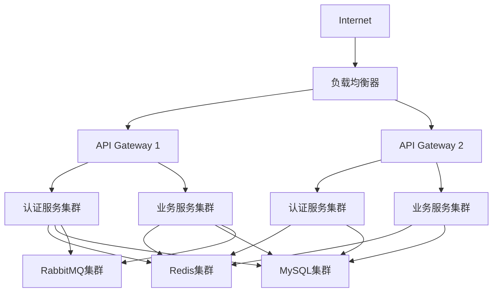

# IOE-DREAM 微服务系统运维手册

## 📖 目录

- [系统架构概述](#系统架构概述)
- [环境部署指南](#环境部署指南)
- [监控系统配置](#监控系统配置)
- [日常运维操作](#日常运维操作)
- [性能优化指南](#性能优化指南)
- [备份与恢复](#备份与恢复)
- [故障诊断与处理](#故障诊断与处理)
- [安全管理](#安全管理)
- [版本升级管理](#版本升级管理)

---

## 🏗️ 系统架构概述

### 微服务架构设计

IOE-DREAM采用现代化的微服务架构，基于Spring Boot 3.x + Spring Cloud技术栈，实现高可用、可扩展的分布式系统。

#### 核心服务组件

```
┌─────────────────────────────────────────────────────────────┐
│                    API Gateway (智能网关)                    │
│                     Port: 8080/8443                         │
├─────────────────────────────────────────────────────────────┤
│        认证服务        │      身份管理服务      │  设备管理服务 │
│   Auth Service      │   Identity Service  │ Device Service│
│     Port: 8101      │      Port: 8102     │   Port: 8103  │
├─────────────────────────────────────────────────────────────┤
│        区域管理服务      │     访客管理服务     │  访问控制服务  │
│     Area Service     │   Visitor Service   │ Access Service│
│     Port: 8104      │      Port: 8105     │   Port: 8106  │
├─────────────────────────────────────────────────────────────┤
│        消费服务        │      考勤服务        │   视频服务    │
│   Consume Service   │  Attendance Service │ Video Service │
│     Port: 8107      │      Port: 8108     │   Port: 8109  │
├─────────────────────────────────────────────────────────────┤
│        OA服务         │      通知服务        │   文件服务    │
│      OA Service     │ Notification Service│ File Service  │
│     Port: 8110      │      Port: 8111     │   Port: 8112  │
├─────────────────────────────────────────────────────────────┤
│        报表服务        │      审计服务        │   配置服务    │
│    Report Service   │    Audit Service    │ Config Service│
│     Port: 8113      │      Port: 8114     │   Port: 8115  │
└─────────────────────────────────────────────────────────────┘
```

#### 基础设施组件

**服务注册与发现**
- **Eureka Server**: 服务注册中心
- **端口**: 8761
- **集群部署**: 3节点高可用

**配置中心**
- **Spring Cloud Config**: 统一配置管理
- **端口**: 8888
- **配置仓库**: Git存储

**消息队列**
- **RabbitMQ**: 异步消息处理
- **端口**: 5672 (AMQP), 15672 (管理界面)
- **集群模式**: 镜像队列

**缓存服务**
- **Redis**: 分布式缓存
- **端口**: 6379
- **集群模式**: Redis Cluster

**数据库**
- **MySQL**: 主数据库
- **端口**: 3306
- **架构**: 主从复制 + 读写分离

### 网络架构

#### 网络拓扑



#### 端口分配

| 服务类型 | 端口范围 | 说明 |
|---------|---------|------|
| API Gateway | 8080, 8443 | HTTP/HTTPS入口 |
| 核心服务 | 8101-8115 | 业务微服务 |
| 基础服务 | 8761, 8888 | 注册中心、配置中心 |
| 中间件 | 5672, 6379, 3306 | 消息队列、缓存、数据库 |
| 监控 | 9090-9095 | 监控和管理服务 |

---

## 🚀 环境部署指南

### 环境要求

#### 硬件要求

**生产环境**
- **CPU**: 16核心以上，支持虚拟化
- **内存**: 64GB以上
- **存储**: 1TB SSD + 2TB HDD
- **网络**: 千兆网络，双网卡

**测试环境**
- **CPU**: 8核心
- **内存**: 32GB
- **存储**: 500GB SSD
- **网络**: 千兆网络

**开发环境**
- **CPU**: 4核心
- **内存**: 16GB
- **存储**: 256GB SSD
- **网络**: 百兆网络

#### 软件要求

**操作系统**
- **推荐**: CentOS 8.x / Ubuntu 20.04 LTS
- **最低**: CentOS 7.x / Ubuntu 18.04 LTS

**Java环境**
- **JDK**: OpenJDK 17+ 或 Oracle JDK 17+
- **Maven**: 3.8+
- **Git**: 2.25+

**容器环境**
- **Docker**: 20.10+
- **Docker Compose**: 2.0+
- **Kubernetes**: 1.22+ (可选)

### 部署架构

#### 单机部署（开发/测试）

```
服务器: 192.168.1.100
├── Nginx (端口 80/443)
├── API Gateway (端口 8080)
├── 所有微服务 (端口 8101-8115)
├── MySQL (端口 3306)
├── Redis (端口 6379)
├── RabbitMQ (端口 5672/15672)
└── 监控组件 (端口 9090-9095)
```

#### 集群部署（生产）

```
负载均衡层:
├── Nginx LB1 (192.168.1.10)
└── Nginx LB2 (192.168.1.11)

API网关层:
├── Gateway Node1 (192.168.1.20)
├── Gateway Node2 (192.168.1.21)
└── Gateway Node3 (192.168.1.22)

业务服务层:
├── Service Node1 (192.168.1.30)
├── Service Node2 (192.168.1.31)
├── Service Node3 (192.168.1.32)
└── Service Node4 (192.168.1.33)

数据层:
├── MySQL Master (192.168.1.40)
├── MySQL Slave1 (192.168.1.41)
├── MySQL Slave2 (192.168.1.42)
├── Redis Cluster (192.168.1.50-52)
└── RabbitMQ Cluster (192.168.1.60-62)
```

### 安装部署步骤

#### 1. 基础环境准备

**系统配置**
```bash
# 关闭防火墙和SELinux
systemctl stop firewalld
systemctl disable firewalld
setenforce 0
sed -i 's/SELINUX=enforcing/SELINUX=disabled/g' /etc/selinux/config

# 配置hosts文件
cat >> /etc/hosts << EOF
192.168.1.100 ioedream-gateway
192.168.1.101 ioedream-mysql
192.168.1.102 ioedream-redis
192.168.1.103 ioedream-rabbitmq
EOF

# 创建系统用户
useradd -m -s /bin/bash ioedream
usermod -aG wheel ioedream
```

**Java环境安装**
```bash
# 安装OpenJDK 17
yum install -y java-17-openjdk java-17-openjdk-devel

# 配置环境变量
cat > /etc/profile.d/java17.sh << EOF
export JAVA_HOME=/usr/lib/jvm/java-17-openjdk
export PATH=\$JAVA_HOME/bin:\$PATH
export CLASSPATH=.:$JAVA_HOME/jre/lib/rt.jar:$JAVA_HOME/lib/dt.jar:$JAVA_HOME/lib/tools.jar
EOF

source /etc/profile.d/java17.sh
java -version
```

#### 2. 数据库安装配置

**MySQL安装**
```bash
# 安装MySQL 8.0
yum install -y mysql-server

# 启动MySQL服务
systemctl start mysqld
systemctl enable mysqld

# 获取临时密码
TEMP_PASSWORD=$(grep 'temporary password' /var/log/mysqld.log | awk '{print $NF}')

# 安全配置
mysql_secure_installation

# 创建应用数据库
mysql -u root -p << EOF
CREATE DATABASE ioedream_auth CHARACTER SET utf8mb4 COLLATE utf8mb4_unicode_ci;
CREATE DATABASE ioedream_identity CHARACTER SET utf8mb4 COLLATE utf8mb4_unicode_ci;
CREATE DATABASE ioedream_device CHARACTER SET utf8mb4 COLLATE utf8mb4_unicode_ci;
CREATE DATABASE ioedream_access CHARACTER SET utf8mb4 COLLATE utf8mb4_unicode_ci;
CREATE DATABASE ioedream_consume CHARACTER SET utf8mb4 COLLATE utf8mb4_unicode_ci;
CREATE DATABASE ioedream_attendance CHARACTER SET utf8mb4 COLLATE utf8mb4_unicode_ci;
CREATE DATABASE ioedream_video CHARACTER SET utf8mb4 COLLATE utf8mb4_unicode_ci;
CREATE DATABASE ioedream_oa CHARACTER SET utf8mb4 COLLATE utf8mb4_unicode_ci;

CREATE USER 'ioedream'@'%' IDENTIFIED BY 'Ioedream@2025';
GRANT ALL PRIVILEGES ON ioedream_*.* TO 'ioedream'@'%';
FLUSH PRIVILEGES;
EOF
```

**Redis安装**
```bash
# 安装Redis
yum install -y redis

# 配置Redis
cp /etc/redis.conf /etc/redis.conf.bak
cat > /etc/redis.conf << EOF
bind 0.0.0.0
port 6379
daemonize yes
pidfile /var/run/redis/redis.pid
logfile /var/log/redis/redis.log
databases 16
save 900 1
save 300 10
save 60 10000
maxmemory 2gb
maxmemory-policy allkeys-lru
EOF

# 启动Redis
systemctl start redis
systemctl enable redis
```

#### 3. 消息队列安装

**RabbitMQ安装**
```bash
# 安装Erlang
yum install -y erlang

# 安装RabbitMQ
yum install -y rabbitmq-server

# 启动RabbitMQ
systemctl start rabbitmq-server
systemctl enable rabbitmq-server

# 启用管理插件
rabbitmq-plugins enable rabbitmq_management

# 创建管理员用户
rabbitmqctl add_user admin Admin123!
rabbitmqctl set_user_tags admin administrator
rabbitmqctl set_permissions -p / admin ".*" ".*" ".*"
```

#### 4. 应用服务部署

**构建应用**
```bash
# 克隆代码
git clone https://github.com/company/ioedream-microservices.git
cd ioedream-microservices

# 构建所有服务
mvn clean package -DskipTests

# 创建部署目录
mkdir -p /opt/ioedream/services
mkdir -p /opt/ioedream/logs
mkdir -p /opt/ioedream/config
```

**部署API Gateway**
```bash
# 复制应用文件
cp smart-gateway/target/smart-gateway-*.jar /opt/ioedream/services/gateway.jar

# 创建启动脚本
cat > /opt/ioedream/start-gateway.sh << 'EOF'
#!/bin/bash
cd /opt/ioedream
nohup java -jar services/gateway.jar \
  --spring.profiles.active=prod \
  --server.port=8080 \
  > logs/gateway.log 2>&1 &
echo $! > /var/run/gateway.pid
EOF

chmod +x /opt/ioedream/start-gateway.sh

# 创建systemd服务
cat > /etc/systemd/system/ioedream-gateway.service << EOF
[Unit]
Description=IOE-DREAM API Gateway
After=network.target

[Service]
Type=forking
User=ioedream
WorkingDirectory=/opt/ioedream
ExecStart=/opt/ioedream/start-gateway.sh
ExecStop=/bin/kill -9 $MAINPID
PIDFile=/var/run/gateway.pid
Restart=always
RestartSec=10

[Install]
WantedBy=multi-user.target
EOF

systemctl daemon-reload
systemctl enable ioedream-gateway
systemctl start ioedream-gateway
```

**部署业务服务**
```bash
# 批量部署脚本
cat > /opt/ioedream/deploy-services.sh << 'EOF'
#!/bin/bash

SERVICES=(
  "ioedream-auth-service:8101"
  "ioedream-identity-service:8102"
  "ioedream-device-service:8103"
  "ioedream-access-service:8106"
  "ioedream-consume-service:8107"
  "ioedream-attendance-service:8108"
  "ioedream-video-service:8109"
  "ioedream-oa-service:8110"
)

for service in "${SERVICES[@]}"; do
  name=$(echo $service | cut -d: -f1)
  port=$(echo $service | cut -d: -f2)

  echo "Deploying $name on port $port..."

  # 复制jar文件
  cp $name/target/$name-*.jar /opt/ioedream/services/$name.jar

  # 创建启动脚本
  cat > /opt/ioedream/start-$name.sh << EOFS
#!/bin/bash
cd /opt/ioedream
nohup java -jar services/$name.jar \
  --spring.profiles.active=prod \
  --server.port=$port \
  > logs/$name.log 2>&1 &
echo $! > /var/run/$name.pid
EOFS

  chmod +x /opt/ioedream/start-$name.sh

  # 创建systemd服务
  cat > /etc/systemd/system/ioedream-$name.service << EOFS
[Unit]
Description=IOE-DREAM $name
After=network.target

[Service]
Type=forking
User=ioedream
WorkingDirectory=/opt/ioedream
ExecStart=/opt/ioedream/start-$name.sh
ExecStop=/bin/kill -9 \$MAINPID
PIDFile=/var/run/$name.pid
Restart=always
RestartSec=10

[Install]
WantedBy=multi-user.target
EOFS

  systemctl daemon-reload
  systemctl enable ioedream-$name
  systemctl start ioedream-$name

  echo "$name deployed and started successfully"
done
EOF

chmod +x /opt/ioedream/deploy-services.sh
/opt/ioedream/deploy-services.sh
```

#### 5. 负载均衡配置

**Nginx配置**
```bash
# 安装Nginx
yum install -y nginx

# 配置负载均衡
cat > /etc/nginx/nginx.conf << 'EOF'
user nginx;
worker_processes auto;
error_log /var/log/nginx/error.log warn;
pid /var/run/nginx.pid;

events {
    worker_connections 1024;
}

http {
    include /etc/nginx/mime.types;
    default_type application/octet-stream;

    log_format main '$remote_addr - $remote_user [$time_local] "$request" '
                    '$status $body_bytes_sent "$http_referer" '
                    '"$http_user_agent" "$http_x_forwarded_for"';

    access_log /var/log/nginx/access.log main;

    sendfile on;
    tcp_nopush on;
    tcp_nodelay on;
    keepalive_timeout 65;

    # Gateway负载均衡
    upstream gateway_cluster {
        least_conn;
        server 192.168.1.20:8080 max_fails=3 fail_timeout=30s;
        server 192.168.1.21:8080 max_fails=3 fail_timeout=30s;
        server 192.168.1.22:8080 max_fails=3 fail_timeout=30s;
    }

    # 主服务器配置
    server {
        listen 80;
        server_name ioedream.company.com;

        location / {
            proxy_pass http://gateway_cluster;
            proxy_set_header Host $host;
            proxy_set_header X-Real-IP $remote_addr;
            proxy_set_header X-Forwarded-For $proxy_add_x_forwarded_for;
            proxy_set_header X-Forwarded-Proto $scheme;

            proxy_connect_timeout 30s;
            proxy_send_timeout 30s;
            proxy_read_timeout 30s;
        }
    }

    # HTTPS配置
    server {
        listen 443 ssl http2;
        server_name ioedream.company.com;

        ssl_certificate /etc/nginx/ssl/ioedream.crt;
        ssl_certificate_key /etc/nginx/ssl/ioedream.key;
        ssl_protocols TLSv1.2 TLSv1.3;
        ssl_ciphers HIGH:!aNULL:!MD5;

        location / {
            proxy_pass http://gateway_cluster;
            proxy_set_header Host $host;
            proxy_set_header X-Real-IP $remote_addr;
            proxy_set_header X-Forwarded-For $proxy_add_x_forwarded_for;
            proxy_set_header X-Forwarded-Proto $scheme;
        }
    }
}
EOF

# 启动Nginx
systemctl start nginx
systemctl enable nginx
```

---

## 📊 监控系统配置

### 监控架构

IOE-DREAM采用分层监控架构，实现全方位的系统监控和告警。

#### 监控组件

**Prometheus** - 指标收集和存储
- **端口**: 9090
- **功能**: 时序数据库，收集应用和系统指标

**Grafana** - 可视化展示
- **端口**: 3000
- **功能**: 仪表板展示，告警管理

**AlertManager** - 告警管理
- **端口**: 9093
- **功能**: 告警路由，通知发送

**Node Exporter** - 系统指标
- **端口**: 9100
- **功能**: 收集服务器硬件和系统指标

### 监控部署

#### 1. Prometheus安装配置

```bash
# 创建Prometheus用户
useradd --no-create-home --shell /bin/false prometheus

# 下载Prometheus
wget https://github.com/prometheus/prometheus/releases/download/v2.40.0/prometheus-2.40.0.linux-amd64.tar.gz
tar xzf prometheus-*.tar.gz

# 安装Prometheus
cd prometheus-2.40.0.linux-amd64
mkdir -p /etc/prometheus /var/lib/prometheus

cp prometheus /usr/local/bin/
cp promtool /usr/local/bin/
cp -r consoles /etc/prometheus/
cp -r console_libraries /etc/prometheus/

# 创建配置文件
cat > /etc/prometheus/prometheus.yml << 'EOF'
global:
  scrape_interval: 15s
  evaluation_interval: 15s

rule_files:
  - "rules/*.yml"

alerting:
  alertmanagers:
    - static_configs:
        - targets:
          - localhost:9093

scrape_configs:
  # Prometheus自监控
  - job_name: 'prometheus'
    static_configs:
      - targets: ['localhost:9090']

  # 系统监控
  - job_name: 'node-exporter'
    static_configs:
      - targets:
        - '192.168.1.100:9100'
        - '192.168.1.101:9100'
        - '192.168.1.102:9100'

  # 应用服务监控
  - job_name: 'ioedream-services'
    static_configs:
      - targets:
        - '192.168.1.100:8101'
        - '192.168.1.100:8102'
        - '192.168.1.100:8103'
        - '192.168.1.100:8106'
        - '192.168.1.100:8107'
        - '192.168.1.100:8108'

  # MySQL监控
  - job_name: 'mysql-exporter'
    static_configs:
      - targets: ['192.168.1.101:9104']

  # Redis监控
  - job_name: 'redis-exporter'
    static_configs:
      - targets: ['192.168.1.102:9121']

  # RabbitMQ监控
  - job_name: 'rabbitmq-exporter'
    static_configs:
      - targets: ['192.168.1.103:9419']
EOF

# 创建systemd服务
cat > /etc/systemd/system/prometheus.service << EOF
[Unit]
Description=Prometheus
Wants=network-online.target
After=network-online.target

[Service]
User=prometheus
Group=prometheus
Type=simple
ExecStart=/usr/local/bin/prometheus \
    --config.file /etc/prometheus/prometheus.yml \
    --storage.tsdb.path /var/lib/prometheus/ \
    --web.console.templates=/etc/prometheus/consoles \
    --web.console.libraries=/etc/prometheus/console_libraries \
    --web.listen-address=0.0.0.0:9090

[Install]
WantedBy=multi-user.target
EOF

# 启动Prometheus
chown -R prometheus:prometheus /etc/prometheus /var/lib/prometheus
systemctl daemon-reload
systemctl enable prometheus
systemctl start prometheus
```

#### 2. Grafana安装配置

```bash
# 安装Grafana
sudo yum install -y https://dl.grafana.com/oss/release/grafana-9.2.0-1.x86_64.rpm

# 启动Grafana
systemctl start grafana-server
systemctl enable grafana-server

# 配置数据源
# 访问 http://192.168.1.100:3000
# 默认用户名/密码: admin/admin
# 添加Prometheus数据源: http://localhost:9090
```

#### 3. 告警规则配置

```bash
# 创建告警规则目录
mkdir -p /etc/prometheus/rules

# 服务可用性告警
cat > /etc/prometheus/rules/service-availability.yml << 'EOF'
groups:
- name: service-availability
  rules:
  - alert: ServiceDown
    expr: up == 0
    for: 1m
    labels:
      severity: critical
    annotations:
      summary: "Service {{ $labels.job }} is down"
      description: "Service {{ $labels.job }} has been down for more than 1 minute."

  - alert: HighCPUUsage
    expr: 100 - (avg by(instance) (irate(node_cpu_seconds_total{mode="idle"}[5m])) * 100) > 80
    for: 5m
    labels:
      severity: warning
    annotations:
      summary: "High CPU usage on {{ $labels.instance }}"
      description: "CPU usage is above 80% for more than 5 minutes."

  - alert: HighMemoryUsage
    expr: (1 - (node_memory_MemAvailable_bytes / node_memory_MemTotal_bytes)) * 100 > 85
    for: 5m
    labels:
      severity: warning
    annotations:
      summary: "High memory usage on {{ $labels.instance }}"
      description: "Memory usage is above 85% for more than 5 minutes."

  - alert: DiskSpaceLow
    expr: (1 - (node_filesystem_avail_bytes / node_filesystem_size_bytes)) * 100 > 90
    for: 1m
    labels:
      severity: critical
    annotations:
      summary: "Low disk space on {{ $labels.instance }}"
      description: "Disk usage is above 90% on mount point {{ $labels.mountpoint }}."
EOF

# 重新加载Prometheus配置
curl -X POST http://localhost:9090/-/reload
```

### 监控指标

#### 系统指标

**CPU使用率**
```promql
100 - (avg by(instance) (irate(node_cpu_seconds_total{mode="idle"}[5m])) * 100)
```

**内存使用率**
```promql
(1 - (node_memory_MemAvailable_bytes / node_memory_MemTotal_bytes)) * 100
```

**磁盘使用率**
```promql
(1 - (node_filesystem_avail_bytes / node_filesystem_size_bytes)) * 100
```

**网络流量**
```promql
rate(node_network_receive_bytes_total[5m])
rate(node_network_transmit_bytes_total[5m])
```

#### 应用指标

**JVM内存使用**
```promql
(jvm_memory_used_bytes / jvm_memory_max_bytes) * 100
```

**HTTP请求速率**
```promql
rate(http_requests_total[5m])
```

**HTTP错误率**
```promql
rate(http_requests_total{status=~"5.."}[5m]) / rate(http_requests_total[5m]) * 100
```

**数据库连接池**
```promql
hikaricp_connections_active / hikaricp_connections_max
```

---

## 🔄 日常运维操作

### 服务管理

#### 服务状态检查

```bash
#!/bin/bash
# 服务健康检查脚本

SERVICES=(
    "ioedream-gateway"
    "ioedream-auth-service"
    "ioedream-identity-service"
    "ioedream-device-service"
    "ioedream-access-service"
    "ioedream-consume-service"
    "ioedream-attendance-service"
    "ioedream-video-service"
    "ioedream-oa-service"
)

echo "=== IOE-DREAM Service Health Check ==="
echo "Time: $(date)"
echo ""

for service in "${SERVICES[@]}"; do
    if systemctl is-active --quiet $service; then
        status="✅ RUNNING"
        pid=$(systemctl show $service -p MainPID --value)
        port=$(netstat -tlnp | grep $pid | awk '{print $4}' | cut -d: -f2 | head -1)
        echo "$service: $status (PID: $pid, Port: $port)"
    else
        status="❌ STOPPED"
        echo "$service: $status"
    fi
done

echo ""
echo "=== Middleware Status ==="

# MySQL状态
if systemctl is-active --quiet mysqld; then
    echo "MySQL: ✅ RUNNING"
else
    echo "MySQL: ❌ STOPPED"
fi

# Redis状态
if systemctl is-active --quiet redis; then
    echo "Redis: ✅ RUNNING"
else
    echo "Redis: ❌ STOPPED"
fi

# RabbitMQ状态
if systemctl is-active --quiet rabbitmq-server; then
    echo "RabbitMQ: ✅ RUNNING"
else
    echo "RabbitMQ: ❌ STOPPED"
fi

echo ""
echo "=== Load Balancer Status ==="
if systemctl is-active --quiet nginx; then
    echo "Nginx: ✅ RUNNING"
else
    echo "Nginx: ❌ STOPPED"
fi
```

#### 服务重启操作

```bash
#!/bin/bash
# 服务重启脚本

SERVICE_NAME=$1
if [ -z "$SERVICE_NAME" ]; then
    echo "Usage: $0 <service-name>"
    echo "Available services:"
    echo "  gateway"
    echo "  auth"
    echo "  identity"
    echo "  device"
    echo "  access"
    echo "  consume"
    echo "  attendance"
    echo "  video"
    echo "  oa"
    exit 1
fi

case $SERVICE_NAME in
    "gateway")
        SERVICE="ioedream-gateway"
        ;;
    "auth")
        SERVICE="ioedream-auth-service"
        ;;
    "identity")
        SERVICE="ioedream-identity-service"
        ;;
    "device")
        SERVICE="ioedream-device-service"
        ;;
    "access")
        SERVICE="ioedream-access-service"
        ;;
    "consume")
        SERVICE="ioedream-consume-service"
        ;;
    "attendance")
        SERVICE="ioedream-attendance-service"
        ;;
    "video")
        SERVICE="ioedream-video-service"
        ;;
    "oa")
        SERVICE="ioedream-oa-service"
        ;;
    *)
        echo "Unknown service: $SERVICE_NAME"
        exit 1
        ;;
esac

echo "Restarting $SERVICE..."
systemctl restart $SERVICE

# 等待服务启动
sleep 10

# 检查服务状态
if systemctl is-active --quiet $SERVICE; then
    echo "✅ $SERVICE restarted successfully"
    echo "Status: $(systemctl is-active $SERVICE)"
    echo "PID: $(systemctl show $SERVICE -p MainPID --value)"
else
    echo "❌ $SERVICE restart failed"
    echo "Error logs:"
    journalctl -u $SERVICE --no-pager -n 20
fi
```

### 日志管理

#### 日志收集配置

```bash
# 创建日志目录结构
mkdir -p /opt/ioedream/logs/{services,nginx,mysql,redis,rabbitmq}
mkdir -p /var/log/ioedream/{archive,backup}

# 配置logrotate
cat > /etc/logrotate.d/ioedream << 'EOF'
/opt/ioedream/logs/services/*.log {
    daily
    rotate 30
    compress
    delaycompress
    missingok
    notifempty
    create 644 ioedream ioedream
    postrotate
        systemctl reload ioedream-gateway
        systemctl reload ioedream-auth-service
        systemctl reload ioedream-identity-service
    endscript
}

/var/log/nginx/*.log {
    daily
    rotate 30
    compress
    delaycompress
    missingok
    notifempty
    create 644 nginx nginx
    postrotate
        systemctl reload nginx
    endscript
}
EOF
```

#### 日志分析脚本

```bash
#!/bin/bash
# 日志分析脚本

LOG_DIR="/opt/ioedream/logs/services"
TODAY=$(date +%Y-%m-%d)
YESTERDAY=$(date -d "yesterday" +%Y-%m-%d)

echo "=== IOE-DREAM Log Analysis ==="
echo "Date: $TODAY"
echo ""

# 错误日志分析
echo "=== Error Log Summary ==="
for log_file in $LOG_DIR/*.log; do
    service_name=$(basename $log_file .log)
    error_count=$(grep -c "ERROR" $log_file 2>/dev/null || echo 0)
    warn_count=$(grep -c "WARN" $log_file 2>/dev/null || echo 0)

    echo "$service_name:"
    echo "  Errors: $error_count"
    echo "  Warnings: $warn_count"

    if [ $error_count -gt 0 ]; then
        echo "  Latest errors:"
        grep "ERROR" $log_file | tail -3 | sed 's/^/    /'
    fi
    echo ""
done

# HTTP状态码分析
echo "=== HTTP Status Code Analysis ==="
if [ -f "/var/log/nginx/access.log" ]; then
    echo "Top 10 HTTP status codes:"
    awk '{print $9}' /var/log/nginx/access.log | sort | uniq -c | sort -nr | head -10 | sed 's/^/  /'
    echo ""
fi

# 数据库慢查询
echo "=== Database Slow Queries ==="
if [ -f "/var/log/mysql/mysql-slow.log" ]; then
    slow_count=$(grep -c "# Time:" /var/log/mysql/mysql-slow.log)
    echo "Slow query count: $slow_count"
    if [ $slow_count -gt 0 ]; then
        echo "Latest slow queries:"
        grep -A 5 "# Time:" /var/log/mysql/mysql-slow.log | tail -20 | sed 's/^/  /'
    fi
fi
```

### 配置管理

#### 配置更新流程

```bash
#!/bin/bash
# 配置更新脚本

CONFIG_TYPE=$1
CONFIG_FILE=$2

if [ -z "$CONFIG_TYPE" ] || [ -z "$CONFIG_FILE" ]; then
    echo "Usage: $0 <config-type> <config-file>"
    echo "Config types: service, nginx, mysql, redis"
    exit 1
fi

# 备份当前配置
BACKUP_DIR="/opt/ioedream/backup/$(date +%Y%m%d_%H%M%S)"
mkdir -p $BACKUP_DIR

case $CONFIG_TYPE in
    "service")
        if [ -f "/etc/ioedream/$CONFIG_FILE" ]; then
            cp /etc/ioedream/$CONFIG_FILE $BACKUP_DIR/
        fi
        cp $CONFIG_FILE /etc/ioedream/
        echo "Service configuration updated"
        ;;
    "nginx")
        if [ -f "/etc/nginx/nginx.conf" ]; then
            cp /etc/nginx/nginx.conf $BACKUP_DIR/
        fi
        cp $CONFIG_FILE /etc/nginx/nginx.conf
        # 测试nginx配置
        nginx -t
        if [ $? -eq 0 ]; then
            systemctl reload nginx
            echo "Nginx configuration updated and reloaded"
        else
            echo "Nginx configuration test failed"
            exit 1
        fi
        ;;
    "mysql")
        if [ -f "/etc/my.cnf" ]; then
            cp /etc/my.cnf $BACKUP_DIR/
        fi
        cp $CONFIG_FILE /etc/my.cnf
        systemctl restart mysqld
        echo "MySQL configuration updated"
        ;;
    "redis")
        if [ -f "/etc/redis/redis.conf" ]; then
            cp /etc/redis/redis.conf $BACKUP_DIR/
        fi
        cp $CONFIG_FILE /etc/redis/redis.conf
        systemctl restart redis
        echo "Redis configuration updated"
        ;;
esac

echo "Configuration backup created at: $BACKUP_DIR"
```

---

## 📈 性能优化指南

### JVM调优

#### 生产环境JVM参数

```bash
# Gateway服务JVM参数
JAVA_OPTS_GATEWAY="-Xms2g -Xmx4g \
-XX:+UseG1GC \
-XX:MaxGCPauseMillis=200 \
-XX:+UseStringDeduplication \
-XX:+PrintGCDetails \
-XX:+PrintGCTimeStamps \
-Xloggc:/opt/ioedream/logs/gateway-gc.log \
-XX:+UseGCLogFileRotation \
-XX:NumberOfGCLogFiles=5 \
-XX:GCLogFileSize=10M"

# 业务服务JVM参数
JAVA_OPTS_SERVICE="-Xms1g -Xmx2g \
-XX:+UseG1GC \
-XX:MaxGCPauseMillis=150 \
-XX:+UseStringDeduplication \
-Dspring.profiles.active=prod \
-Dserver.port=8101"
```

#### 内存监控

```bash
#!/bin/bash
# JVM内存监控脚本

SERVICES=("gateway" "auth-service" "identity-service" "device-service" "access-service")

echo "=== JVM Memory Usage ==="
for service in "${SERVICES[@]}"; do
    pid=$(pgrep -f "$service")
    if [ ! -z "$pid" ]; then
        echo "$service (PID: $pid):"
        # 堆内存使用情况
        heap_used=$(jstat -gc $pid | tail -1 | awk '{print $3 + $4 + $6 + $8}')
        heap_max=$(jstat -gc $pid | tail -1 | awk '{print $9}')
        heap_usage=$(echo "scale=2; $heap_used / $heap_max * 100" | bc)
        echo "  Heap Usage: $heap_usage%"

        # GC情况
        gc_count=$(jstat -gc $pid | tail -1 | awk '{print $14 + $15}')
        gc_time=$(jstat -gc $pid | tail -1 | awk '{print $16 + $17}')
        echo "  GC Count: $gc_count, GC Time: ${gc_time}s"
        echo ""
    fi
done
```

### 数据库优化

#### MySQL配置优化

```ini
# /etc/my.cnf
[mysqld]
# 基础配置
port = 3306
socket = /var/lib/mysql/mysql.sock
pid-file = /var/run/mysqld/mysqld.pid
user = mysql
bind-address = 0.0.0.0

# 内存配置
innodb_buffer_pool_size = 8G
innodb_buffer_pool_instances = 8
innodb_log_file_size = 256M
innodb_log_buffer_size = 16M

# 连接配置
max_connections = 1000
max_connect_errors = 100000
wait_timeout = 28800
interactive_timeout = 28800

# 查询缓存
query_cache_type = 1
query_cache_size = 64M
query_cache_limit = 2M

# 慢查询日志
slow_query_log = 1
slow_query_log_file = /var/log/mysql/mysql-slow.log
long_query_time = 2

# 二进制日志
log-bin = mysql-bin
binlog_format = ROW
expire_logs_days = 7

# InnoDB配置
innodb_file_per_table = 1
innodb_flush_log_at_trx_commit = 2
innodb_flush_method = O_DIRECT
innodb_lock_wait_timeout = 50

# 字符集配置
character-set-server = utf8mb4
collation-server = utf8mb4_unicode_ci
```

#### Redis配置优化

```conf
# /etc/redis/redis.conf
# 内存配置
maxmemory 4gb
maxmemory-policy allkeys-lru

# 持久化配置
save 900 1
save 300 10
save 60 10000

# AOF配置
appendonly yes
appendfsync everysec
no-appendfsync-on-rewrite no
auto-aof-rewrite-percentage 100
auto-aof-rewrite-min-size 64mb

# 网络配置
tcp-keepalive 300
timeout 0

# 客户端配置
maxclients 10000

# 慢日志配置
slowlog-log-slower-than 10000
slowlog-max-len 128
```

### 网络优化

#### Nginx性能优化

```nginx
# /etc/nginx/nginx.conf
worker_processes auto;
worker_rlimit_nofile 65535;

events {
    worker_connections 4096;
    use epoll;
    multi_accept on;
}

http {
    # 基础优化
    sendfile on;
    tcp_nopush on;
    tcp_nodelay on;
    keepalive_timeout 30;
    keepalive_requests 1000;

    # 压缩优化
    gzip on;
    gzip_vary on;
    gzip_min_length 1024;
    gzip_types text/plain text/css application/json application/javascript text/xml application/xml application/xml+rss text/javascript;

    # 缓存优化
    open_file_cache max=65536 inactive=60s;
    open_file_cache_valid 80s;
    open_file_cache_min_uses 1;
    open_file_cache_errors on;

    # 连接优化
    client_body_buffer_size 128k;
    client_max_body_size 10m;
    client_header_buffer_size 1k;
    large_client_header_buffers 4 4k;

    # 超时优化
    client_body_timeout 12;
    client_header_timeout 12;
    send_timeout 10;
}
```

---

## 💾 备份与恢复

### 备份策略

#### 数据库备份

```bash
#!/bin/bash
# MySQL全量备份脚本

BACKUP_DIR="/opt/ioedream/backup/mysql"
DATE=$(date +%Y%m%d_%H%M%S)
DB_USER="ioedream"
DB_PASS="Ioedream@2025"

# 创建备份目录
mkdir -p $BACKUP_DIR

# 备份所有数据库
databases=$(mysql -u$DB_USER -p$DB_PASS -e "SHOW DATABASES;" | grep -E "(ioedream_)")

for db in $databases; do
    echo "Backing up database: $db"
    mysqldump -u$DB_USER -p$DB_PASS \
        --single-transaction \
        --routines \
        --triggers \
        --events \
        --hex-blob \
        --opt \
        $db | gzip > $BACKUP_DIR/${db}_${DATE}.sql.gz
done

# 删除7天前的备份
find $BACKUP_DIR -name "*.sql.gz" -mtime +7 -delete

echo "Database backup completed: $BACKUP_DIR"
```

#### 应用配置备份

```bash
#!/bin/bash
# 应用配置备份脚本

BACKUP_DIR="/opt/ioedream/backup/config"
DATE=$(date +%Y%m%d_%H%M%S)

mkdir -p $BACKUP_DIR

# 备份配置文件
tar -czf $BACKUP_DIR/config_${DATE}.tar.gz \
    /etc/ioedream/ \
    /etc/nginx/ \
    /etc/redis/ \
    /etc/my.cnf \
    /opt/ioedream/config/

# 备份应用部署文件
tar -czf $BACKUP_DIR/deployment_${DATE}.tar.gz \
    /opt/ioedream/services/

echo "Configuration backup completed: $BACKUP_DIR"
```

### 恢复操作

#### 数据库恢复

```bash
#!/bin/bash
# MySQL数据库恢复脚本

BACKUP_FILE=$1
DB_USER="ioedream"
DB_PASS="Ioedream@2025"

if [ -z "$BACKUP_FILE" ]; then
    echo "Usage: $0 <backup-file>"
    exit 1
fi

# 检查备份文件是否存在
if [ ! -f "$BACKUP_FILE" ]; then
    echo "Backup file not found: $BACKUP_FILE"
    exit 1
fi

# 获取数据库名
filename=$(basename "$BACKUP_FILE")
db_name=$(echo "$filename" | sed 's/_[0-9]\{8\}_[0-9]\{6\}\.sql\.gz//')

echo "Restoring database: $db_name from $BACKUP_FILE"

# 创建数据库（如果不存在）
mysql -u$DB_USER -p$DB_PASS -e "CREATE DATABASE IF NOT EXISTS $db_name CHARACTER SET utf8mb4 COLLATE utf8mb4_unicode_ci;"

# 恢复数据
gunzip < "$BACKUP_FILE" | mysql -u$DB_USER -p$DB_PASS $db_name

echo "Database restore completed: $db_name"
```

#### 服务恢复

```bash
#!/bin/bash
# 服务快速恢复脚本

echo "Starting IOE-DREAM service recovery..."

# 启动顺序
SERVICES=(
    "mysqld"
    "redis"
    "rabbitmq-server"
    "nginx"
    "ioedream-gateway"
    "ioedream-auth-service"
    "ioedream-identity-service"
    "ioedream-device-service"
    "ioedream-access-service"
    "ioedream-consume-service"
    "ioedream-attendance-service"
    "ioedream-video-service"
    "ioedream-oa-service"
)

for service in "${SERVICES[@]}"; do
    echo "Starting $service..."
    systemctl start $service

    # 等待服务启动
    sleep 5

    if systemctl is-active --quiet $service; then
        echo "✅ $service started successfully"
    else
        echo "❌ $service failed to start"
        echo "Checking logs for $service:"
        journalctl -u $service --no-pager -n 10
    fi
done

echo "Service recovery completed"
```

---

## 🚨 故障诊断与处理

### 常见故障处理

#### 服务无法启动

**检查步骤**:
1. 检查服务状态: `systemctl status service-name`
2. 查看服务日志: `journalctl -u service-name -n 50`
3. 检查端口占用: `netstat -tlnp | grep port`
4. 检查配置文件语法
5. 检查依赖服务状态

**解决方案**:
```bash
#!/bin/bash
# 服务故障诊断脚本

SERVICE_NAME=$1

if [ -z "$SERVICE_NAME" ]; then
    echo "Usage: $0 <service-name>"
    exit 1
fi

echo "=== Diagnosing $SERVICE_NAME ==="

# 1. 检查服务状态
echo "1. Service Status:"
systemctl status $SERVICE_NAME --no-pager

echo ""
echo "2. Recent Logs:"
journalctl -u $SERVICE_NAME --no-pager -n 20

echo ""
echo "3. Port Usage:"
port=$(systemctl show $SERVICE_NAME -p ExecStart | grep -o 'server.port=[0-9]*' | cut -d= -f2)
if [ ! -z "$port" ]; then
    netstat -tlnp | grep $port || echo "Port $port is not in use"
fi

echo ""
echo "4. Memory Usage:"
pid=$(systemctl show $SERVICE_NAME -p MainPID --value)
if [ "$pid" != "0" ]; then
    ps -p $pid -o pid,ppid,cmd,%mem,%cpu --no-headers
fi

echo ""
echo "5. File Descriptor Usage:"
if [ "$pid" != "0" ]; then
    lsof -p $pid | wc -l
fi
```

#### 数据库连接问题

**诊断脚本**:
```bash
#!/bin/bash
# MySQL连接诊断脚本

echo "=== MySQL Connection Diagnosis ==="

# 1. 检查MySQL服务状态
echo "1. MySQL Service Status:"
systemctl status mysqld --no-pager

echo ""
echo "2. MySQL Process:"
pgrep -f mysqld || echo "MySQL process not found"

echo ""
echo "3. Port Status:"
netstat -tlnp | grep 3306 || ss -tlnp | grep 3306

echo ""
echo "4. Connection Test:"
mysql -uioedream -p'Ioedream@2025' -e "SELECT 1;" 2>/dev/null && echo "✅ Connection successful" || echo "❌ Connection failed"

echo ""
echo "5. Error Log:"
tail -20 /var/log/mysql/error.log

echo ""
echo "6. Connection Count:"
mysql -uioedream -p'Ioedream@2025' -e "SHOW PROCESSLIST;" | wc -l
```

#### 性能问题诊断

**系统性能检查**:
```bash
#!/bin/bash
# 系统性能诊断脚本

echo "=== System Performance Diagnosis ==="
echo "Time: $(date)"
echo ""

# CPU使用率
echo "1. CPU Usage:"
top -bn1 | grep "Cpu(s)" | awk '{print "CPU Load: " $2}'

echo ""
echo "2. Top CPU Processes:"
ps aux --sort=-%cpu | head -10 | awk 'NR==1 || NR<=10 {print}'

echo ""
echo "3. Memory Usage:"
free -h

echo ""
echo "4. Top Memory Processes:"
ps aux --sort=-%mem | head -10 | awk 'NR==1 || NR<=10 {print}'

echo ""
echo "5. Disk Usage:"
df -h

echo ""
echo "6. Disk I/O:"
iostat -x 1 1 | tail -n +4

echo ""
echo "7. Network Statistics:"
sar -n DEV 1 1 | tail -n +3

echo ""
echo "8. System Load:"
uptime

echo ""
echo "9. Zombie Processes:"
ps aux | awk '$8 ~ /^Z/ {count++} END {print "Zombie processes: " count+0}'
```

### 应急响应流程

#### 服务宕机应急响应

1. **立即响应** (5分钟内)
   - 确认服务状态
   - 检查告警信息
   - 通知相关人员

2. **初步诊断** (15分钟内)
   - 查看服务日志
   - 检查系统资源
   - 确定故障范围

3. **快速恢复** (30分钟内)
   - 重启相关服务
   - 切换备用服务
   - 恢复核心功能

4. **根因分析** (1小时内)
   - 深入分析日志
   - 复现故障场景
   - 制定长期方案

5. **预防措施** (24小时内)
   - 更新监控规则
   - 完善应急预案
   - 优化系统配置

---

**📝 文档信息**
- **版本**: v2.0.0
- **更新时间**: 2025-11-29
- **适用系统**: IOE-DREAM微服务架构
- **维护单位**: 运维团队

**💡 重要提醒**:
- 定期检查服务状态和性能指标
- 及时处理告警信息
- 保持备份策略的有效性
- 定期进行应急演练
- 持续优化系统性能和稳定性