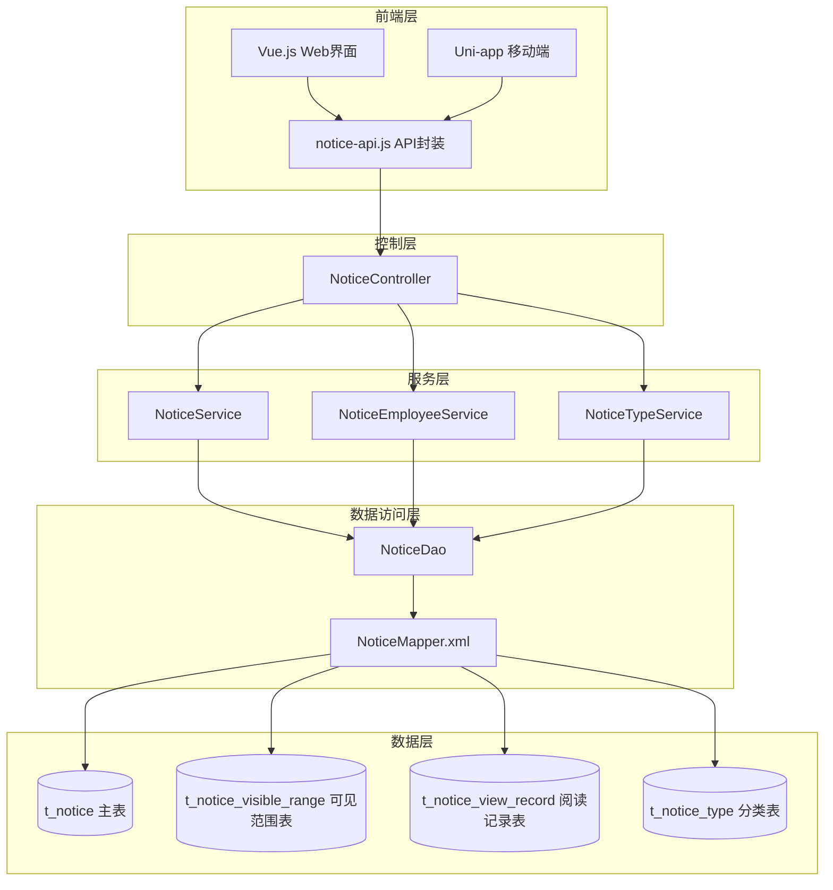
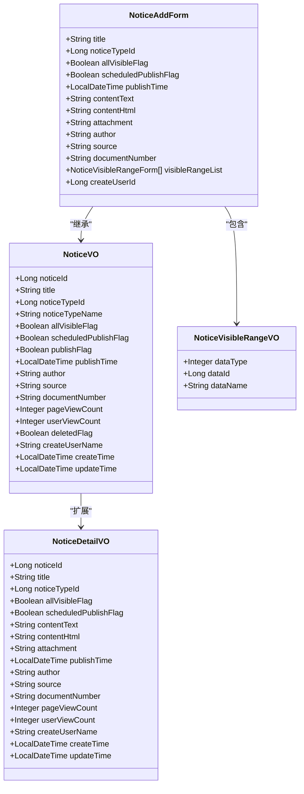
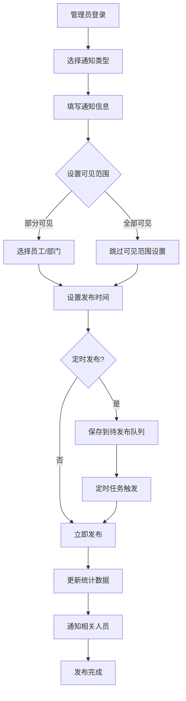
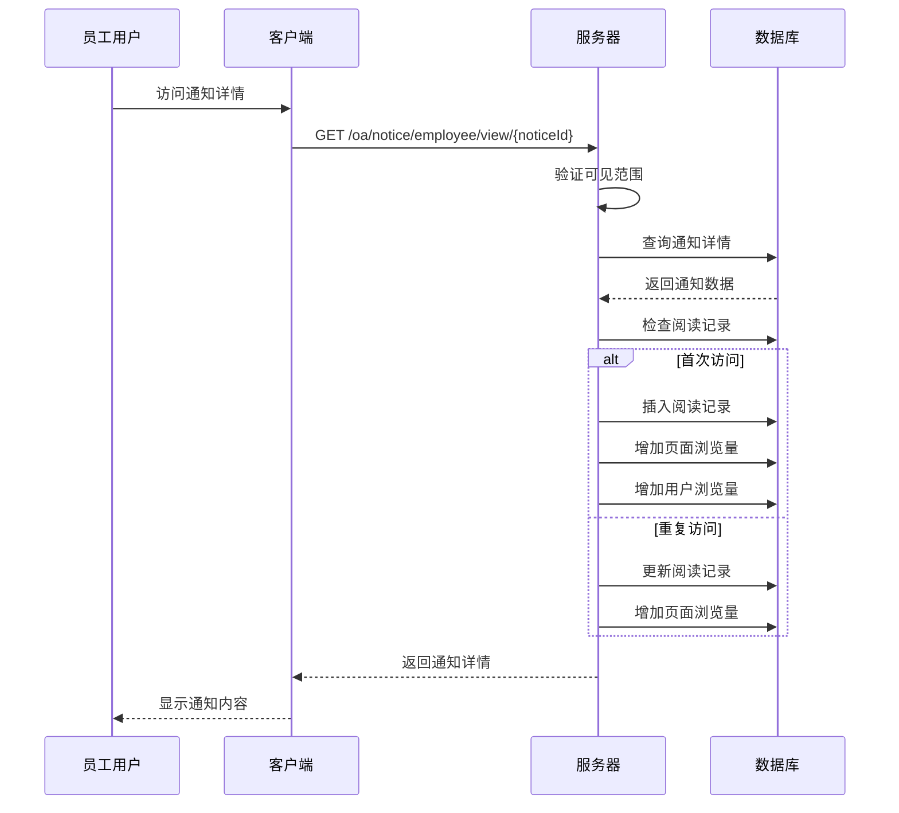
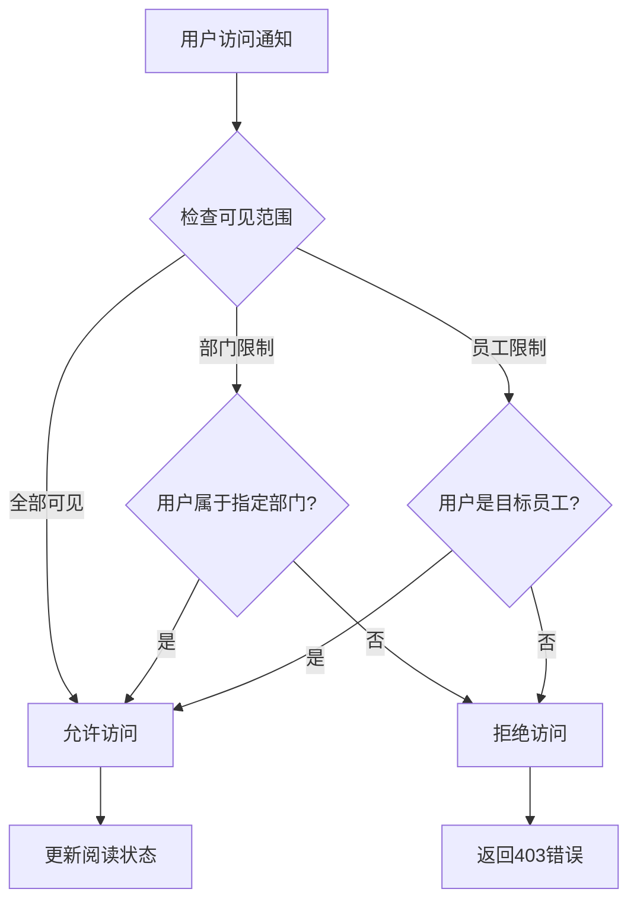

# 企业OA通知公告API文档

<cite>
**本文档中引用的文件**
- [NoticeController.java](file://smart-admin-api-java17-springboot3\sa-admin\src\main\java\net\lab1024\sa\admin\module\business\oa\notice\controller\NoticeController.java)
- [notice-api.js](file://smart-admin-web-javascript\src\api\business\oa\notice-api.js)
- [notice-const.js](file://smart-admin-web-javascript\src\constants\business\oa\notice-const.js)
- [NoticeAddForm.java](file://smart-admin-api-java17-springboot3\sa-admin\src\main\java\net\lab1024\sa\admin\module\business\oa\notice\domain\form\NoticeAddForm.java)
- [NoticeVO.java](file://smart-admin-api-java17-springboot3\sa-admin\src\main\java\net\lab1024\sa\admin\module\business\oa\notice\domain\vo\NoticeVO.java)
- [NoticeDetailVO.java](file://smart-admin-api-java17-springboot3\sa-admin\src\main\java\net\lab1024\sa\admin\module\business\oa\notice\domain\vo\NoticeDetailVO.java)
- [NoticeViewRecordVO.java](file://smart-admin-api-java17-springboot3\sa-admin\src\main\java\net\lab1024\sa\admin\module\business\oa\notice\domain\vo\NoticeViewRecordVO.java)
- [NoticeVisibleRangeDataTypeEnum.java](file://smart-admin-api-java17-springboot3\sa-admin\src\main\java\net\lab1024\sa\admin\module\business\oa\notice\constant\NoticeVisibleRangeDataTypeEnum.java)
- [NoticeMapper.xml](file://smart-admin-api-java17-springboot3\sa-admin\src\main\resources\mapper\business\oa\notice\NoticeMapper.xml)
</cite>

## 目录
1. [简介](#简介)
2. [系统架构](#系统架构)
3. [核心组件](#核心组件)
4. [API接口详解](#api接口详解)
5. [数据模型](#数据模型)
6. [业务流程](#业务流程)
7. [前端调用示例](#前端调用示例)
8. [权限控制](#权限控制)
9. [错误处理](#错误处理)
10. [最佳实践](#最佳实践)

## 简介

企业OA通知公告系统是一个完整的企业内部信息管理系统，提供通知公告的发布、管理和阅读状态跟踪功能。系统支持多种通知类型，具备灵活的可见范围控制机制，并能够准确记录用户的阅读状态。

### 主要特性
- **多类型通知支持**：公告和通知两种类型
- **灵活的可见范围控制**：支持按员工或部门设置可见范围
- **阅读状态跟踪**：精确记录用户阅读情况
- **定时发布功能**：支持通知的定时发布机制
- **全文检索**：支持标题、作者、来源等多维度搜索

## 系统架构



**图表来源**
- [NoticeController.java](file://smart-admin-api-java17-springboot3\sa-admin\src\main\java\net\lab1024\sa\admin\module\business\oa\notice\controller\NoticeController.java#L24-L139)
- [NoticeMapper.xml](file://smart-admin-api-java17-springboot3\sa-admin\src\main\resources\mapper\business\oa\notice\NoticeMapper.xml#L1-L269)

## 核心组件

### 控制器层 - NoticeController

NoticeController是通知公告系统的核心控制器，提供了完整的RESTful API接口。

#### 主要职责
- 管理通知公告的生命周期
- 处理通知公告的分类管理
- 管理员和普通员工的不同访问权限
- 维护通知的可见范围和阅读状态

#### 核心方法分类

| 方法分类 | 描述 | 权限要求 |
|---------|------|----------|
| 通知类型管理 | 获取、添加、修改、删除通知类型 | 无特殊权限 |
| 管理员功能 | 添加、更新、删除、查询通知公告 | oa:notice:* |
| 员工功能 | 查看通知详情、查询个人通知、查看阅读记录 | 无特殊权限 |

**章节来源**
- [NoticeController.java](file://smart-admin-api-java17-springboot3\sa-admin\src\main\java\net\lab1024\sa\admin\module\business\oa\notice\controller\NoticeController.java#L48-L139)

### 数据模型层

系统采用分层的数据模型设计，确保数据的一致性和完整性。



**图表来源**
- [NoticeAddForm.java](file://smart-admin-api-java17-springboot3\sa-admin\src\main\java\net\lab1024\sa\admin\module\business\oa\notice\domain\form\NoticeAddForm.java#L24-L79)
- [NoticeVO.java](file://smart-admin-api-java17-springboot3\sa-admin\src\main\java\net\lab1024\sa\admin\module\business\oa\notice\domain\vo\NoticeVO.java#L18-L73)
- [NoticeDetailVO.java](file://smart-admin-api-java17-springboot3\sa-admin\src\main\java\net\lab1024\sa\admin\module\business\oa\notice\domain\vo\NoticeDetailVO.java#L21-L85)

## API接口详解

### 通知类型管理接口

#### 获取所有通知类型
- **HTTP方法**: GET
- **URL路径**: `/oa/noticeType/getAll`
- **功能描述**: 获取系统中的所有通知类型列表
- **权限要求**: 无特殊权限

#### 添加通知类型
- **HTTP方法**: GET
- **URL路径**: `/oa/noticeType/add/{name}`
- **功能描述**: 添加新的通知类型
- **权限要求**: 无特殊权限

#### 修改通知类型
- **HTTP方法**: GET
- **URL路径**: `/oa/noticeType/update/{noticeTypeId}/{name}`
- **功能描述**: 修改现有通知类型
- **权限要求**: 无特殊权限

#### 删除通知类型
- **HTTP方法**: GET
- **URL路径**: `/oa/noticeType/delete/{noticeTypeId}`
- **功能描述**: 删除指定的通知类型
- **权限要求**: 无特殊权限

### 管理员功能接口

#### 添加通知公告
- **HTTP方法**: POST
- **URL路径**: `/oa/notice/add`
- **请求参数**: NoticeAddForm对象
- **功能描述**: 创建新的通知公告
- **权限要求**: `oa:notice:add`

**请求体结构**:
```javascript
{
  "title": "通知标题",
  "noticeTypeId": 1,
  "allVisibleFlag": false,
  "scheduledPublishFlag": true,
  "publishTime": "2024-01-15T10:00:00",
  "contentText": "纯文本内容",
  "contentHtml": "<p>HTML内容</p>",
  "attachment": "file_key_123",
  "author": "张三",
  "source": "人力资源部",
  "documentNumber": "HR-2024-001",
  "visibleRangeList": [
    {
      "dataType": 1,  // 员工类型
      "dataId": 1001  // 员工ID
    },
    {
      "dataType": 2,  // 部门类型
      "dataId": 2001  // 部门ID
    }
  ]
}
```

#### 修改通知公告
- **HTTP方法**: POST
- **URL路径**: `/oa/notice/update`
- **请求参数**: NoticeUpdateForm对象
- **功能描述**: 更新现有通知公告
- **权限要求**: `oa:notice:update`

#### 查询通知公告列表
- **HTTP方法**: POST
- **URL路径**: `/oa/notice/query`
- **请求参数**: NoticeQueryForm对象
- **功能描述**: 分页查询通知公告列表
- **权限要求**: `oa:notice:query`

#### 获取通知公告详情
- **HTTP方法**: GET
- **URL路径**: `/oa/notice/getUpdateVO/{noticeId}`
- **功能描述**: 获取通知公告的详细信息用于编辑
- **权限要求**: `oa:notice:update`

#### 删除通知公告
- **HTTP方法**: GET
- **URL路径**: `/oa/notice/delete/{noticeId}`
- **功能描述**: 删除指定的通知公告
- **权限要求**: `oa:notice:delete`

### 员工功能接口

#### 查看通知公告详情
- **HTTP方法**: GET
- **URL路径**: `/oa/notice/employee/view/{noticeId}`
- **功能描述**: 查看通知公告详情并更新阅读状态
- **权限要求**: 无特殊权限

#### 查询员工通知列表
- **HTTP方法**: POST
- **URL路径**: `/oa/notice/employee/query`
- **功能描述**: 查询员工可查看的通知公告列表
- **权限要求**: 无特殊权限

#### 查询阅读记录
- **HTTP方法**: POST
- **URL路径**: `/oa/notice/employee/queryViewRecord`
- **功能描述**: 查询通知公告的阅读记录
- **权限要求**: 无特殊权限

**章节来源**
- [NoticeController.java](file://smart-admin-api-java17-springboot3\sa-admin\src\main\java\net\lab1024\sa\admin\module\business\oa\notice\controller\NoticeController.java#L75-L139)

## 数据模型

### 通知类型枚举

| 枚举值 | 描述 | 用途 |
|--------|------|------|
| ANNOUNCEMENT (1) | 公告 | 重要通知、政策公告等 |
| NOTICE (2) | 通知 | 工作安排、会议通知等 |

### 可见范围类型枚举

| 枚举值 | 描述 | 适用场景 |
|--------|------|----------|
| EMPLOYEE (1) | 员工 | 针对特定员工的通知 |
| DEPARTMENT (2) | 部门 | 针对特定部门的通知 |

### 关键数据表结构

#### 主表 (t_notice)
| 字段名 | 类型 | 描述 |
|--------|------|------|
| notice_id | BIGINT | 通知ID |
| notice_type_id | BIGINT | 类型ID |
| title | VARCHAR(200) | 标题 |
| content_text | TEXT | 纯文本内容 |
| content_html | TEXT | HTML内容 |
| attachment | VARCHAR(1000) | 附件 |
| page_view_count | INT | 页面浏览量 |
| user_view_count | INT | 用户浏览量 |
| publish_time | DATETIME | 发布时间 |
| author | VARCHAR(50) | 作者 |
| source | VARCHAR(100) | 来源 |
| document_number | VARCHAR(50) | 文号 |

#### 可见范围表 (t_notice_visible_range)
| 字段名 | 类型 | 描述 |
|--------|------|------|
| notice_id | BIGINT | 通知ID |
| data_type | INT | 数据类型 (1:员工, 2:部门) |
| data_id | BIGINT | 员工ID或部门ID |

#### 阅读记录表 (t_notice_view_record)
| 字段名 | 类型 | 描述 |
|--------|------|------|
| notice_id | BIGINT | 通知ID |
| employee_id | BIGINT | 员工ID |
| first_ip | VARCHAR(50) | 首次访问IP |
| first_user_agent | VARCHAR(200) | 首次访问用户代理 |
| page_view_count | INT | 查看次数 |
| create_time | DATETIME | 首次查看时间 |
| update_time | DATETIME | 最后查看时间 |

**章节来源**
- [NoticeVisibleRangeDataTypeEnum.java](file://smart-admin-api-java17-springboot3\sa-admin\src\main\java\net\lab1024\sa\admin\module\business\oa\notice\constant\NoticeVisibleRangeDataTypeEnum.java#L18-L36)
- [NoticeMapper.xml](file://smart-admin-api-java17-springboot3\sa-admin\src\main\resources\mapper\business\oa\notice\NoticeMapper.xml#L28-L269)

## 业务流程

### 通知发布流程



### 阅读状态跟踪流程



**图表来源**
- [NoticeMapper.xml](file://smart-admin-api-java17-springboot3\sa-admin\src\main\resources\mapper\business\oa\notice\NoticeMapper.xml#L247-L269)

## 前端调用示例

### JavaScript API调用示例

以下是基于前端notice-api.js的实际调用示例：

#### 发布面向特定部门的通知

```javascript
// 发布通知的函数
async function publishDepartmentNotice() {
  const noticeData = {
    title: "关于2024年春节放假安排的通知",
    noticeTypeId: 2, // 通知类型ID
    allVisibleFlag: false, // 不是全部可见
    scheduledPublishFlag: false, // 立即发布
    publishTime: new Date().toISOString(), // 当前时间
    contentText: "公司决定2024年春节期间放假安排如下...",
    contentHtml: "<p>公司决定2024年春节期间放假安排如下...</p>",
    attachment: "", // 附件文件key
    author: "人力资源部",
    source: "行政办公室",
    documentNumber: "HR-2024-001",
    visibleRangeList: [
      {
        dataType: NOTICE_VISIBLE_RANGE_DATA_TYPE_ENUM.DEPARTMENT.value,
        dataId: 2001 // 人力资源部ID
      },
      {
        dataType: NOTICE_VISIBLE_RANGE_DATA_TYPE_ENUM.DEPARTMENT.value,
        dataId: 2002 // 技术研发部ID
      }
    ]
  };
  
  try {
    const response = await noticeApi.addNotice(noticeData);
    if (response.ok) {
      console.log("通知发布成功");
      // 刷新通知列表
      refreshNoticeList();
    }
  } catch (error) {
    console.error("发布通知失败:", error);
  }
}
```

#### 发布面向特定员工的通知

```javascript
// 发布针对特定员工的通知
async function publishEmployeeNotice() {
  const noticeData = {
    title: "关于项目进度汇报的要求",
    noticeTypeId: 2,
    allVisibleFlag: false,
    scheduledPublishFlag: false,
    publishTime: new Date().toISOString(),
    contentText: "请各位项目经理在本周五前提交项目进度报告...",
    contentHtml: "<p>请各位项目经理在本周五前提交项目进度报告...</p>",
    attachment: "file_20240115_001",
    author: "项目管理办公室",
    source: "技术总监",
    documentNumber: "PMO-2024-001",
    visibleRangeList: [
      {
        dataType: NOTICE_VISIBLE_RANGE_DATA_TYPE_ENUM.EMPLOYEE.value,
        dataId: 1001 // 张三的员工ID
      },
      {
        dataType: NOTICE_VISIBLE_RANGE_DATA_TYPE_ENUM.EMPLOYEE.value,
        dataId: 1002 // 李四的员工ID
      }
    ]
  };
  
  try {
    const response = await noticeApi.addNotice(noticeData);
    if (response.ok) {
      console.log("员工通知发布成功");
      // 显示成功消息
      showSuccessMessage("通知已成功发布");
    }
  } catch (error) {
    console.error("发布员工通知失败:", error);
  }
}
```

#### 查询通知阅读记录

```javascript
// 查询通知阅读记录
async function queryViewRecords(noticeId) {
  const queryData = {
    noticeId: noticeId,
    pageNum: 1,
    pageSize: 20,
    keywords: "" // 可以根据关键词筛选
  };
  
  try {
    const response = await noticeApi.queryViewRecord(queryData);
    if (response.ok) {
      const records = response.data.list;
      console.log("阅读记录:", records);
      // 在表格中显示阅读记录
      displayViewRecords(records);
    }
  } catch (error) {
    console.error("查询阅读记录失败:", error);
  }
}
```

#### 获取通知详情并更新阅读状态

```javascript
// 获取通知详情并自动更新阅读状态
async function fetchNoticeDetail(noticeId) {
  try {
    const response = await noticeApi.view(noticeId);
    if (response.ok) {
      const noticeDetail = response.data;
      console.log("通知详情:", noticeDetail);
      
      // 更新UI显示
      updateNoticeContent(noticeDetail);
      
      // 如果需要，可以显示阅读状态
      updateReadingStatus(noticeDetail.viewFlag);
      
      return noticeDetail;
    }
  } catch (error) {
    console.error("获取通知详情失败:", error);
    throw error;
  }
}
```

**章节来源**
- [notice-api.js](file://smart-admin-web-javascript\src\api\business\oa\notice-api.js#L7-L75)
- [notice-const.js](file://smart-admin-web-javascript\src\constants\business\oa\notice-const.js#L11-L36)

## 权限控制

### 权限级别

系统采用基于角色的权限控制机制：

#### 管理员权限
- **oa:notice:add**: 添加通知公告权限
- **oa:notice:update**: 修改通知公告权限
- **oa:notice:delete**: 删除通知公告权限
- **oa:notice:query**: 查询通知公告权限

#### 员工权限
- 所有员工都有查看通知公告的权限
- 无法修改或删除通知公告
- 可以查看自己的阅读记录

### 可见范围控制

系统通过以下机制确保通知的可见性：

1. **全部可见**: 所有员工都可以看到该通知
2. **部门可见**: 只有指定部门的员工可以看到
3. **员工可见**: 只有指定员工可以看到



**图表来源**
- [NoticeMapper.xml](file://smart-admin-api-java17-springboot3\sa-admin\src\main\resources\mapper\business\oa\notice\NoticeMapper.xml#L116-L140)

## 错误处理

### 常见错误码

| 错误码 | 描述 | 解决方案 |
|--------|------|----------|
| 400 | 请求参数错误 | 检查必填字段和数据格式 |
| 401 | 未授权访问 | 检查用户登录状态 |
| 403 | 权限不足 | 确认用户具有相应权限 |
| 404 | 资源不存在 | 检查资源ID是否正确 |
| 500 | 服务器内部错误 | 联系技术支持 |

### 错误处理最佳实践

```javascript
// 统一错误处理示例
async function safeNoticeOperation(operationFunc) {
  try {
    const response = await operationFunc();
    
    if (!response.ok) {
      switch(response.code) {
        case 400:
          throw new Error("请求参数错误，请检查输入数据");
        case 401:
          throw new Error("请先登录");
        case 403:
          throw new Error("您没有权限执行此操作");
        case 404:
          throw new Error("请求的资源不存在");
        default:
          throw new Error(`服务器错误: ${response.message}`);
      }
    }
    
    return response;
  } catch (error) {
    console.error(`${operationFunc.name} error:`, error);
    // 显示友好的错误消息给用户
    showMessage(error.message, 'error');
    throw error;
  }
}
```

## 最佳实践

### 通知发布建议

1. **标题规范**: 使用简洁明了的标题，便于快速识别
2. **内容结构**: 合理使用HTML标签，保持内容清晰易读
3. **附件管理**: 上传必要的附件，但避免过大文件
4. **发布时间**: 根据受众特点选择合适的时间发布
5. **可见范围**: 精确设置可见范围，避免信息泄露

### 性能优化

1. **分页查询**: 大量数据时使用分页查询
2. **缓存策略**: 对于频繁访问的通知内容进行缓存
3. **批量操作**: 对于大量相似的通知，考虑批量处理
4. **索引优化**: 确保查询字段建立适当的数据库索引

### 安全考虑

1. **输入验证**: 严格验证所有用户输入
2. **权限检查**: 每个操作都进行权限验证
3. **敏感信息**: 避免在通知中包含敏感信息
4. **审计日志**: 记录重要的操作日志

### 数据备份

1. **定期备份**: 定期备份通知数据
2. **版本控制**: 对重要通知进行版本控制
3. **恢复机制**: 建立数据恢复机制

通过遵循这些最佳实践，可以确保通知公告系统的稳定运行和良好的用户体验。