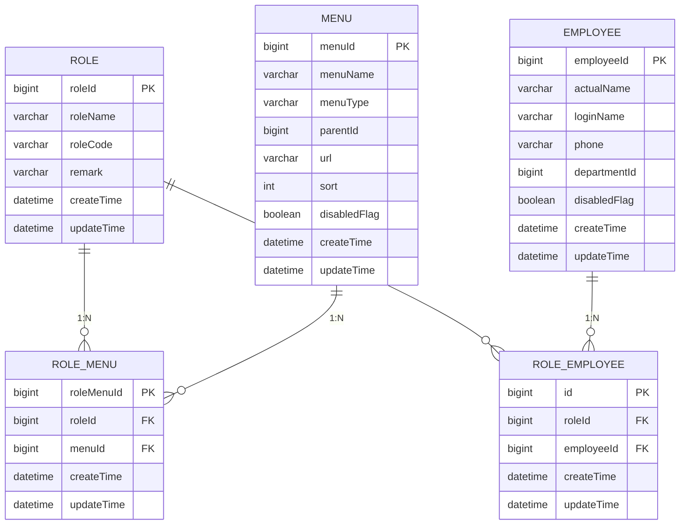

# 角色管理API

<cite>
**本文档引用的文件**  
- [RoleController.java](file://smart-admin-api-java17-springboot3\sa-admin\src\main\java\net\lab1024\sa\admin\module\system\role\controller\RoleController.java)
- [RoleMenuController.java](file://smart-admin-api-java17-springboot3\sa-admin\src\main\java\net\lab1024\sa\admin\module\system\role\controller\RoleMenuController.java)
- [RoleEmployeeController.java](file://smart-admin-api-java17-springboot3\sa-admin\src\main\java\net\lab1024\sa\admin\module\system\role\controller\RoleEmployeeController.java)
- [RoleService.java](file://smart-admin-api-java17-springboot3\sa-admin\src\main\java\net\lab1024\sa\admin\module\system\role\service\RoleService.java)
- [RoleMenuService.java](file://smart-admin-api-java17-springboot3\sa-admin\src\main\java\net\lab1024\sa\admin\module\system\role\service\RoleMenuService.java)
- [RoleEmployeeService.java](file://smart-admin-api-java17-springboot3\sa-admin\src\main\java\net\lab1024\sa\admin\module\system\role\service\RoleEmployeeService.java)
- [RoleAddForm.java](file://smart-admin-api-java17-springboot3\sa-admin\src\main\java\net\lab1024\sa\admin\module\system\role\domain\form\RoleAddForm.java)
- [RoleUpdateForm.java](file://smart-admin-api-java17-springboot3\sa-admin\src\main\java\net\lab1024\sa\admin\module\system\role\domain\form\RoleUpdateForm.java)
- [RoleMenuUpdateForm.java](file://smart-admin-api-java17-springboot3\sa-admin\src\main\java\net\lab1024\sa\admin\module\system\role\domain\form\RoleMenuUpdateForm.java)
- [RoleEmployeeQueryForm.java](file://smart-admin-api-java17-springboot3\sa-admin\src\main\java\net\lab1024\sa\admin\module\system\role\domain\form\RoleEmployeeQueryForm.java)
- [RoleEntity.java](file://smart-admin-api-java17-springboot3\sa-admin\src\main\java\net\lab1024\sa\admin\module\system\role\domain\entity\RoleEntity.java)
- [RoleMenuEntity.java](file://smart-admin-api-java17-springboot3\sa-admin\src\main\java\net\lab1024\sa\admin\module\system\role\domain\entity\RoleMenuEntity.java)
- [RoleEmployeeEntity.java](file://smart-admin-api-java17-springboot3\sa-admin\src\main\java\net\lab1024\sa\admin\module\system\role\domain\entity\RoleEmployeeEntity.java)
- [role-api.js](file://smart-admin-web-javascript\src\api\system\role-api.js)
- [role-menu-api.js](file://smart-admin-web-javascript\src\api\system\role-menu-api.js)
</cite>

## 目录
1. [角色管理API概述](#角色管理api概述)
2. [角色基础操作API](#角色基础操作api)
   - [添加角色 (addRole)](#添加角色-addrole)
   - [更新角色 (updateRole)](#更新角色-updaterole)
   - [删除角色 (deleteRole)](#删除角色-deleterole)
   - [获取角色详情 (getRole)](#获取角色详情-getrole)
   - [获取所有角色 (getAllRole)](#获取所有角色-getallrole)
3. [角色与菜单关联API](#角色与菜单关联api)
   - [为角色分配菜单权限 (updateRoleMenu)](#为角色分配菜单权限-updaterolemenu)
   - [获取角色关联菜单权限 (getRoleSelectedMenu)](#获取角色关联菜单权限-getroleselectedmenu)
4. [角色与员工关联API](#角色与员工关联api)
   - [查询角色下的员工列表](#查询角色下的员工列表)
   - [从角色中移除员工](#从角色中移除员工)
   - [批量为角色添加员工](#批量为角色添加员工)
5. [数据模型与关系](#数据模型与关系)
   - [数据库表结构](#数据库表结构)
   - [实体关系图](#实体关系图)

## 角色管理API概述

本API文档详细描述了系统中角色管理的核心功能，包括角色的增删改查（CRUD）操作，以及角色与菜单、角色与员工之间的关联关系管理。系统通过多对多关系实现了灵活的权限控制体系，其中角色与菜单通过`role_menu`关联表连接，角色与员工通过`role_employee`关联表连接。

整个权限体系遵循以下设计原则：
- **唯一性约束**：角色名称和角色编码在系统中必须唯一
- **级联删除**：删除角色时会自动删除其相关的菜单权限和员工关联
- **安全校验**：删除角色前会校验是否有员工关联，若有则禁止删除
- **权限控制**：所有操作均需相应的权限码才能执行

**Section sources**
- [RoleController.java](file://smart-admin-api-java17-springboot3\sa-admin\src\main\java\net\lab1024\sa\admin\module\system\role\controller\RoleController.java#L1-L67)
- [RoleMenuController.java](file://smart-admin-api-java17-springboot3\sa-admin\src\main\java\net\lab1024\sa\admin\module\system\role\controller\RoleMenuController.java#L1-L43)
- [RoleEmployeeController.java](file://smart-admin-api-java17-springboot3\sa-admin\src\main\java\net\lab1024\sa\admin\module\system\role\controller\RoleEmployeeController.java#L1-L75)

## 角色基础操作API

### 添加角色 (addRole)

该接口用于创建新的角色，同时校验角色名称和编码的唯一性。

**接口信息**
- **HTTP方法**: POST
- **URL路径**: `/role/add`
- **权限要求**: `system:role:add`

**请求参数**
- **请求体**: `RoleAddForm` 对象

| 字段名 | 类型 | 必填 | 描述 | 约束 |
|-------|------|------|------|------|
| roleName | String | 是 | 角色名称 | 1-20个字符，不能为空 |
| roleCode | String | 是 | 角色编码 | 1-20个字符，不能为空 |
| remark | String | 否 | 角色描述 | 最多255个字符 |

**响应格式**
```json
{
  "code": 0,
  "data": "操作成功",
  "msg": null
}
```

**错误码**
- `400`: 参数校验失败（如字段为空或超出长度限制）
- `409`: 角色名称或编码已存在

**业务约束**
- 角色名称在系统中必须唯一
- 角色编码在系统中必须唯一
- 名称和编码均不能为空，且长度在1-20个字符之间

**Section sources**
- [RoleController.java](file://smart-admin-api-java17-springboot3\sa-admin\src\main\java\net\lab1024\sa\admin\module\system\role\controller\RoleController.java#L34-L39)
- [RoleAddForm.java](file://smart-admin-api-java17-springboot3\sa-admin\src\main\java\net\lab1024\sa\admin\module\system\role\domain\form\RoleAddForm.java#L1-L42)
- [RoleService.java](file://smart-admin-api-java17-springboot3\sa-admin\src\main\java\net\lab1024\sa\admin\module\system\role\service\RoleService.java#L43-L57)

### 更新角色 (updateRole)

该接口用于更新现有角色的信息。

**接口信息**
- **HTTP方法**: POST
- **URL路径**: `/role/update`
- **权限要求**: `system:role:update`

**请求参数**
- **请求体**: `RoleUpdateForm` 对象

| 字段名 | 类型 | 必填 | 描述 | 约束 |
|-------|------|------|------|------|
| roleId | Long | 是 | 角色ID | 不能为空 |
| roleName | String | 是 | 角色名称 | 1-20个字符，不能为空 |
| roleCode | String | 是 | 角色编码 | 1-20个字符，不能为空 |
| remark | String | 否 | 角色描述 | 最多255个字符 |

**响应格式**
```json
{
  "code": 0,
  "data": "操作成功",
  "msg": null
}
```

**错误码**
- `400`: 参数校验失败
- `404`: 角色不存在
- `409`: 角色名称或编码已存在（与其他角色冲突）

**业务约束**
- 角色ID必须存在
- 更新后的角色名称不能与其他角色名称重复
- 更新后的角色编码不能与其他角色编码重复
- 名称和编码的长度约束与添加时相同

**Section sources**
- [RoleController.java](file://smart-admin-api-java17-springboot3\sa-admin\src\main\java\net\lab1024\sa\admin\module\system\role\controller\RoleController.java#L48-L53)
- [RoleUpdateForm.java](file://smart-admin-api-java17-springboot3\sa-admin\src\main\java\net\lab1024\sa\admin\module\system\role\domain\form\RoleUpdateForm.java#L1-L28)
- [RoleService.java](file://smart-admin-api-java17-springboot3\sa-admin\src\main\java\net\lab1024\sa\admin\module\system\role\service\RoleService.java#L83-L101)

### 删除角色 (deleteRole)

该接口用于删除指定的角色，删除前会校验是否有关联员工。

**接口信息**
- **HTTP方法**: GET
- **URL路径**: `/role/delete/{roleId}`
- **权限要求**: `system:role:delete`

**请求参数**
- **路径参数**: 
  - `roleId` (Long): 要删除的角色ID

**响应格式**
```json
{
  "code": 0,
  "data": "操作成功",
  "msg": null
}
```

**错误码**
- `404`: 角色不存在
- `409`: 该角色下存在员工，无法删除

**业务约束**
- 角色ID必须存在
- 如果该角色下有关联的员工，则禁止删除
- 删除角色时会级联删除该角色的所有菜单权限和员工关联

**Section sources**
- [RoleController.java](file://smart-admin-api-java17-springboot3\sa-admin\src\main\java\net\lab1024\sa\admin\module\system\role\controller\RoleController.java#L41-L46)
- [RoleService.java](file://smart-admin-api-java17-springboot3\sa-admin\src\main\java\net\lab1024\sa\admin\module\system\role\service\RoleService.java#L62-L77)
- [RoleEmployeeDao.java](file://smart-admin-api-java17-springboot3\sa-admin\src\main\java\net\lab1024\sa\admin\module\system\role\dao\RoleEmployeeDao.java#L84-L88)

### 获取角色详情 (getRole)

该接口用于获取指定角色的详细信息。

**接口信息**
- **HTTP方法**: GET
- **URL路径**: `/role/get/{roleId}`

**请求参数**
- **路径参数**: 
  - `roleId` (Long): 要查询的角色ID

**响应格式**
```json
{
  "code": 0,
  "data": {
    "roleId": 1,
    "roleName": "管理员",
    "roleCode": "ADMIN",
    "remark": "系统管理员角色",
    "createTime": "2023-01-01T00:00:00",
    "updateTime": "2023-01-01T00:00:00"
  },
  "msg": null
}
```

**错误码**
- `404`: 角色不存在

**业务约束**
- 角色ID必须存在

**Section sources**
- [RoleController.java](file://smart-admin-api-java17-springboot3\sa-admin\src\main\java\net\lab1024\sa\admin\module\system\role\controller\RoleController.java#L55-L59)
- [RoleService.java](file://smart-admin-api-java17-springboot3\sa-admin\src\main\java\net\lab1024\sa\admin\module\system\role\service\RoleService.java#L106-L113)

### 获取所有角色 (getAllRole)

该接口用于获取系统中所有角色的列表。

**接口信息**
- **HTTP方法**: GET
- **URL路径**: `/role/getAll`

**请求参数**
- 无

**响应格式**
```json
{
  "code": 0,
  "data": [
    {
      "roleId": 1,
      "roleName": "管理员",
      "roleCode": "ADMIN",
      "remark": "系统管理员角色",
      "createTime": "2023-01-01T00:00:00",
      "updateTime": "2023-01-01T00:00:00"
    },
    {
      "roleId": 2,
      "roleName": "普通用户",
      "roleCode": "USER",
      "remark": "普通用户角色",
      "createTime": "2023-01-01T00:00:00",
      "updateTime": "2023-01-01T00:00:00"
    }
  ],
  "msg": null
}
```

**业务约束**
- 返回系统中所有角色的完整列表

**Section sources**
- [RoleController.java](file://smart-admin-api-java17-springboot3\sa-admin\src\main\java\net\lab1024\sa\admin\module\system\role\controller\RoleController.java#L61-L65)
- [RoleService.java](file://smart-admin-api-java17-springboot3\sa-admin\src\main\java\net\lab1024\sa\admin\module\system\role\service\RoleService.java#L118-L122)

## 角色与菜单关联API

### 为角色分配菜单权限 (updateRoleMenu)

该接口用于为指定角色分配菜单权限。

**接口信息**
- **HTTP方法**: POST
- **URL路径**: `/role/menu/updateRoleMenu`
- **权限要求**: `system:role:menu:update`

**请求参数**
- **请求体**: `RoleMenuUpdateForm` 对象

| 字段名 | 类型 | 必填 | 描述 | 约束 |
|-------|------|------|------|------|
| roleId | Long | 是 | 角色ID | 不能为空 |
| menuIdList | List<Long> | 是 | 菜单ID集合 | 不能为空 |

**响应格式**
```json
{
  "code": 0,
  "data": "操作成功",
  "msg": null
}
```

**错误码**
- `400`: 参数校验失败
- `404`: 角色不存在

**业务流程**
1. 删除该角色原有的所有菜单权限
2. 为该角色添加新的菜单权限
3. 事务性操作，确保数据一致性

**Section sources**
- [RoleMenuController.java](file://smart-admin-api-java17-springboot3\sa-admin\src\main\java\net\lab1024\sa\admin\module\system\role\controller\RoleMenuController.java#L31-L36)
- [RoleMenuUpdateForm.java](file://smart-admin-api-java17-springboot3\sa-admin\src\main\java\net\lab1024\sa\admin\module\system\role\domain\form\RoleMenuUpdateForm.java#L1-L36)
- [RoleMenuService.java](file://smart-admin-api-java17-springboot3\sa-admin\src\main\java\net\lab1024\sa\admin\module\system\role\service\RoleMenuService.java#L35-L64)

### 获取角色关联菜单权限 (getRoleSelectedMenu)

该接口用于获取指定角色已关联的菜单权限。

**接口信息**
- **HTTP方法**: GET
- **URL路径**: `/role/menu/getRoleSelectedMenu/{roleId}`

**请求参数**
- **路径参数**: 
  - `roleId` (Long): 要查询的角色ID

**响应格式**
```json
{
  "code": 0,
  "data": {
    "roleId": 1,
    "menuTreeList": [
      {
        "menuId": 1,
        "menuName": "系统管理",
        "menuType": 1,
        "parentId": 0,
        "children": [
          {
            "menuId": 2,
            "menuName": "角色管理",
            "menuType": 1,
            "parentId": 1,
            "children": []
          }
        ]
      }
    ],
    "selectedMenuId": [1, 2]
  },
  "msg": null
}
```

**业务约束**
- 返回角色的菜单权限树结构和已选中的菜单ID列表

**Section sources**
- [RoleMenuController.java](file://smart-admin-api-java17-springboot3\sa-admin\src\main\java\net\lab1024\sa\admin\module\system\role\controller\RoleMenuController.java#L38-L42)
- [RoleMenuService.java](file://smart-admin-api-java17-springboot3\sa-admin\src\main\java\net\lab1024\sa\admin\module\system\role\service\RoleMenuService.java#L75-L100)

## 角色与员工关联API

### 查询角色下的员工列表

该接口用于分页查询某个角色下的员工列表。

**接口信息**
- **HTTP方法**: POST
- **URL路径**: `/role/employee/queryEmployee`

**请求参数**
- **请求体**: `RoleEmployeeQueryForm` 对象

| 字段名 | 类型 | 必填 | 描述 | 约束 |
|-------|------|------|------|------|
| roleId | String | 是 | 角色ID | 不能为空 |
| keywords | String | 否 | 关键字搜索 | 用于搜索员工姓名、手机号等 |
| pageNum | Integer | 是 | 页码 | 从1开始 |
| pageSize | Integer | 是 | 每页数量 | 默认10 |

**响应格式**
```json
{
  "code": 0,
  "data": {
    "list": [
      {
        "employeeId": 1,
        "actualName": "张三",
        "phone": "13800138000",
        "loginName": "zhangsan",
        "departmentName": "技术部",
        "disabledFlag": false
      }
    ],
    "total": 1,
    "pageNum": 1,
    "pageSize": 10,
    "pages": 1
  },
  "msg": null
}
```

**Section sources**
- [RoleEmployeeController.java](file://smart-admin-api-java17-springboot3\sa-admin\src\main\java\net\lab1024\sa\admin\module\system\role\controller\RoleEmployeeController.java#L36-L40)
- [RoleEmployeeQueryForm.java](file://smart-admin-api-java17-springboot3\sa-admin\src\main\java\net\lab1024\sa\admin\module\system\role\domain\form\RoleEmployeeQueryForm.java#L1-L25)

### 从角色中移除员工

该接口用于从角色成员列表中移除指定员工。

**接口信息**
- **HTTP方法**: GET
- **URL路径**: `/role/employee/removeEmployee`
- **权限要求**: `system:role:employee:delete`

**请求参数**
- **查询参数**: 
  - `employeeId` (Long): 员工ID
  - `roleId` (Long): 角色ID

**响应格式**
```json
{
  "code": 0,
  "data": "操作成功",
  "msg": null
}
```

**Section sources**
- [RoleEmployeeController.java](file://smart-admin-api-java17-springboot3\sa-admin\src\main\java\net\lab1024\sa\admin\module\system\role\controller\RoleEmployeeController.java#L48-L53)

### 批量为角色添加员工

该接口用于批量为角色添加员工。

**接口信息**
- **HTTP方法**: POST
- **URL路径**: `/role/employee/batchAddRoleEmployee`
- **权限要求**: `system:role:employee:add`

**请求参数**
- **请求体**: `RoleEmployeeUpdateForm` 对象

| 字段名 | 类型 | 必填 | 描述 | 约束 |
|-------|------|------|------|------|
| roleId | Long | 是 | 角色ID | 不能为空 |
| employeeIdList | Set<Long> | 是 | 员工ID集合 | 不能为空 |

**响应格式**
```json
{
  "code": 0,
  "data": "操作成功",
  "msg": null
}
```

**Section sources**
- [RoleEmployeeController.java](file://smart-admin-api-java17-springboot3\sa-admin\src\main\java\net\lab1024\sa\admin\module\system\role\controller\RoleEmployeeController.java#L62-L67)
- [RoleEmployeeUpdateForm.java](file://smart-admin-api-java17-springboot3\sa-admin\src\main\java\net\lab1024\sa\admin\module\system\role\domain\form\RoleEmployeeUpdateForm.java#L1-L30)

## 数据模型与关系

### 数据库表结构

系统通过三个主要表和两个关联表来实现角色、菜单、员工之间的多对多关系。

**角色表 (t_role)**
| 字段名 | 类型 | 描述 |
|-------|------|------|
| roleId | BIGINT | 主键ID |
| roleName | VARCHAR(50) | 角色名称 |
| roleCode | VARCHAR(50) | 角色编码 |
| remark | VARCHAR(255) | 角色描述 |
| createTime | DATETIME | 创建时间 |
| updateTime | DATETIME | 更新时间 |

**角色-菜单关联表 (t_role_menu)**
| 字段名 | 类型 | 描述 |
|-------|------|------|
| roleMenuId | BIGINT | 主键ID |
| roleId | BIGINT | 角色ID |
| menuId | BIGINT | 菜单ID |
| createTime | DATETIME | 创建时间 |
| updateTime | DATETIME | 更新时间 |

**角色-员工关联表 (t_role_employee)**
| 字段名 | 类型 | 描述 |
|-------|------|------|
| id | BIGINT | 主键ID |
| roleId | BIGINT | 角色ID |
| employeeId | BIGINT | 员工ID |
| createTime | DATETIME | 创建时间 |
| updateTime | DATETIME | 更新时间 |

**Section sources**
- [RoleEntity.java](file://smart-admin-api-java17-springboot3\sa-admin\src\main\java\net\lab1024\sa\admin\module\system\role\domain\entity\RoleEntity.java#L1-L53)
- [RoleMenuEntity.java](file://smart-admin-api-java17-springboot3\sa-admin\src\main\java\net\lab1024\sa\admin\module\system\role\domain\entity\RoleMenuEntity.java#L1-L50)
- [RoleEmployeeEntity.java](file://smart-admin-api-java17-springboot3\sa-admin\src\main\java\net\lab1024\sa\admin\module\system\role\domain\entity\RoleEmployeeEntity.java#L1-L42)

### 实体关系图



**Diagram sources**
- [RoleEntity.java](file://smart-admin-api-java17-springboot3\sa-admin\src\main\java\net\lab1024\sa\admin\module\system\role\domain\entity\RoleEntity.java#L1-L53)
- [RoleMenuEntity.java](file://smart-admin-api-java17-springboot3\sa-admin\src\main\java\net\lab1024\sa\admin\module\system\role\domain\entity\RoleMenuEntity.java#L1-L50)
- [RoleEmployeeEntity.java](file://smart-admin-api-java17-springboot3\sa-admin\src\main\java\net\lab1024\sa\admin\module\system\role\domain\entity\RoleEmployeeEntity.java#L1-L42)