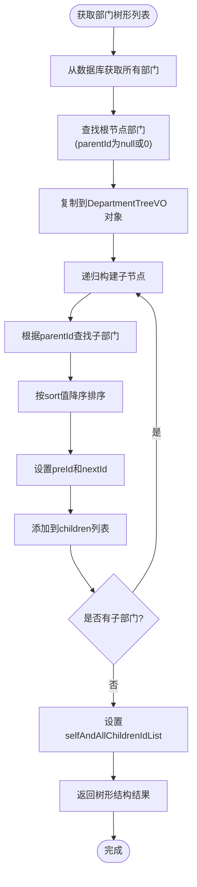
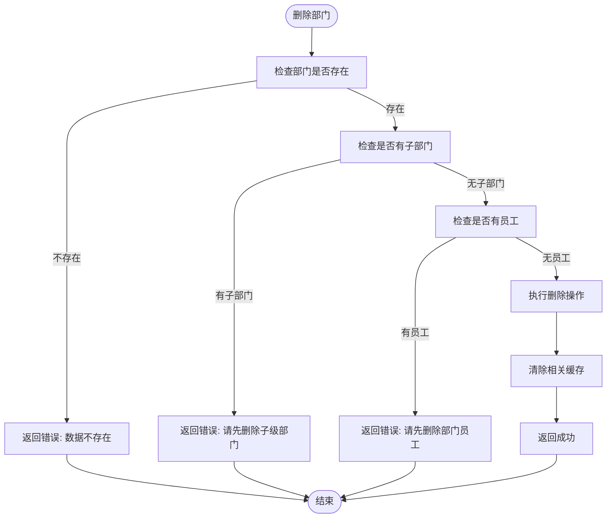

# 部门管理API

<cite>
**本文档引用的文件**   
- [department-api.js](file://smart-admin-web-javascript/src/api/system/department-api.js)
- [DepartmentController.java](file://smart-admin-api-java17-springboot3/sa-admin/src/main/java/net/lab1024/sa/admin/module/system/department/controller/DepartmentController.java)
- [DepartmentService.java](file://smart-admin-api-java17-springboot3/sa-admin/src/main/java/net/lab1024/sa/admin/module/system/department/service/DepartmentService.java)
- [DepartmentCacheManager.java](file://smart-admin-api-java17-springboot3/sa-admin/src/main/java/net/lab1024/sa/admin/module/system/department/manager/DepartmentCacheManager.java)
- [DepartmentAddForm.java](file://smart-admin-api-java17-springboot3/sa-admin/src/main/java/net/lab1024/sa/admin/module/system/department/domain/form/DepartmentAddForm.java)
- [DepartmentUpdateForm.java](file://smart-admin-api-java17-springboot3/sa-admin/src/main/java/net/lab1024/sa/admin/module/system/department/domain/form/DepartmentUpdateForm.java)
- [DepartmentTreeVO.java](file://smart-admin-api-java17-springboot3/sa-admin/src/main/java/net/lab1024/sa/admin/module/system/department/domain/vo/DepartmentTreeVO.java)
- [DepartmentDao.java](file://smart-admin-api-java17-springboot3/sa-admin/src/main/java/net/lab1024/sa/admin/module/system/department/dao/DepartmentDao.java)
- [EmployeeDao.java](file://smart-admin-api-java17-springboot3/sa-admin/src/main/java/net/lab1024/sa/admin/module/system/employee/dao/EmployeeDao.java)
- [DepartmentMapper.xml](file://smart-admin-api-java17-springboot3/sa-admin/src/main/resources/mapper/system/department/DepartmentMapper.xml)
- [EmployeeMapper.xml](file://smart-admin-api-java17-springboot3/sa-admin/src/main/resources/mapper/system/employee/EmployeeMapper.xml)
- [department-form-modal.vue](file://smart-admin-web-javascript/src/views/system/department/components/department-form-modal.vue)
</cite>

## 目录
1. [简介](#简介)
2. [核心API端点](#核心api端点)
3. [数据模型](#数据模型)
4. [树形结构处理逻辑](#树形结构处理逻辑)
5. [缓存机制](#缓存机制)
6. [前端调用示例](#前端调用示例)
7. [错误处理与业务约束](#错误处理与业务约束)

## 简介
部门管理API提供了一套完整的部门管理功能，包括部门的增删改查、树形结构操作及状态变更等核心功能。本API通过DepartmentController提供RESTful接口，支持部门的添加、更新、删除和查询操作。系统采用树形结构来组织部门层级关系，支持无限级部门嵌套。为提高性能，系统通过DepartmentCacheManager实现了多级缓存机制，包括部门列表缓存、部门树形结构缓存、部门路径缓存等。所有敏感操作均需权限验证，确保数据安全。

## 核心API端点

### departmentTree() - 获取部门树形列表
获取部门树形结构列表，返回包含完整层级关系的部门数据。

**HTTP方法**: GET  
**URL路径**: `/department/treeList`  
**权限要求**: 无特定权限要求（由系统自动验证登录状态）  
**请求参数**: 无  
**响应格式**: 
```json
{
  "code": 0,
  "data": [
    {
      "departmentId": 1,
      "departmentName": "总公司",
      "parentId": 0,
      "managerId": 1001,
      "managerName": "张总",
      "sort": 100,
      "preId": null,
      "nextId": 2,
      "children": [
        {
          "departmentId": 2,
          "departmentName": "研发部",
          "parentId": 1,
          "managerId": 1002,
          "managerName": "李经理",
          "sort": 90,
          "preId": null,
          "nextId": 3,
          "children": [
            {
              "departmentId": 3,
              "departmentName": "前端组",
              "parentId": 2,
              "managerId": 1003,
              "managerName": "王组长",
              "sort": 80,
              "preId": null,
              "nextId": null,
              "children": []
            }
          ]
        }
      ]
    }
  ],
  "msg": "OK"
}
```

**Section sources**
- [DepartmentController.java](file://smart-admin-api-java17-springboot3/sa-admin/src/main/java/net/lab1024/sa/admin/module/system/department/controller/DepartmentController.java#L35-L39)
- [DepartmentService.java](file://smart-admin-api-java17-springboot3/sa-admin/src/main/java/net/lab1024/sa/admin/module/system/department/service/DepartmentService.java#L101-L107)
- [DepartmentCacheManager.java](file://smart-admin-api-java17-springboot3/sa-admin/src/main/java/net/lab1024/sa/admin/module/system/department/manager/DepartmentCacheManager.java#L62-L66)

### addDepartment() - 添加部门
添加新的部门信息。

**HTTP方法**: POST  
**URL路径**: `/department/add`  
**权限要求**: `system:department:add`  
**请求体JSON结构**:
```json
{
  "departmentName": "新部门名称",
  "sort": 50,
  "managerId": 1004,
  "parentId": 1
}
```

**请求参数说明**:
- `departmentName` (string, 必填): 部门名称，长度1-50个字符
- `sort` (integer, 必填): 排序值，值越大越靠前
- `managerId` (long, 可选): 部门负责人ID
- `parentId` (long, 可选): 上级部门ID，为空或0表示顶级部门

**响应格式**:
```json
{
  "code": 0,
  "data": null,
  "msg": "OK"
}
```

**Section sources**
- [DepartmentController.java](file://smart-admin-api-java17-springboot3/sa-admin/src/main/java/net/lab1024/sa/admin/module/system/department/controller/DepartmentController.java#L41-L46)
- [DepartmentService.java](file://smart-admin-api-java17-springboot3/sa-admin/src/main/java/net/lab1024/sa/admin/module/system/department/service/DepartmentService.java#L31-L40)
- [DepartmentAddForm.java](file://smart-admin-api-java17-springboot3/sa-admin/src/main/java/net/lab1024/sa/admin/module/system/department/domain/form/DepartmentAddForm.java#L1-L35)

### updateDepartment() - 更新部门信息
更新现有部门的信息。

**HTTP方法**: POST  
**URL路径**: `/department/update`  
**权限要求**: `system:department:update`  
**请求体JSON结构**:
```json
{
  "departmentId": 2,
  "departmentName": "更新后的部门名称",
  "sort": 85,
  "managerId": 1005,
  "parentId": 1
}
```

**请求参数说明**:
- `departmentId` (long, 必填): 部门ID
- `departmentName` (string, 必填): 部门名称，长度1-50个字符
- `sort` (integer, 必填): 排序值，值越大越靠前
- `managerId` (long, 可选): 部门负责人ID
- `parentId` (long, 必填): 上级部门ID

**响应格式**:
```json
{
  "code": 0,
  "data": null,
  "msg": "OK"
}
```

**Section sources**
- [DepartmentController.java](file://smart-admin-api-java17-springboot3/sa-admin/src/main/java/net/lab1024/sa/admin/module/system/department/controller/DepartmentController.java#L48-L53)
- [DepartmentService.java](file://smart-admin-api-java17-springboot3/sa-admin/src/main/java/net/lab1024/sa/admin/module/system/department/service/DepartmentService.java#L42-L71)
- [DepartmentUpdateForm.java](file://smart-admin-api-java17-springboot3/sa-admin/src/main/java/net/lab1024/sa/admin/module/system/department/domain/form/DepartmentUpdateForm.java#L1-L23)

### deleteDepartment() - 删除部门
删除指定部门，删除前会进行完整性校验。

**HTTP方法**: GET  
**URL路径**: `/department/delete/{departmentId}`  
**权限要求**: `system:department:delete`  
**路径参数**:
- `departmentId` (long, 必填): 要删除的部门ID

**响应格式**:
```json
{
  "code": 0,
  "data": null,
  "msg": "OK"
}
```

**业务约束**:
1. 如果部门存在子部门，则不允许删除，返回错误信息"请先删除子级部门"
2. 如果部门下有员工，则不允许删除，返回错误信息"请先删除部门员工"
3. 删除成功后，会自动清除相关缓存

**Section sources**
- [DepartmentController.java](file://smart-admin-api-java17-springboot3/sa-admin/src/main/java/net/lab1024/sa/admin/module/system/department/controller/DepartmentController.java#L55-L60)
- [DepartmentService.java](file://smart-admin-api-java17-springboot3/sa-admin/src/main/java/net/lab1024/sa/admin/module/system/department/service/DepartmentService.java#L67-L105)
- [DepartmentDao.java](file://smart-admin-api-java17-springboot3/sa-admin/src/main/java/net/lab1024/sa/admin/module/system/department/dao/DepartmentDao.java#L27-L28)

### listAll() - 查询所有部门
获取所有部门的扁平化列表。

**HTTP方法**: GET  
**URL路径**: `/department/listAll`  
**权限要求**: 无特定权限要求  
**请求参数**: 无  
**响应格式**:
```json
{
  "code": 0,
  "data": [
    {
      "departmentId": 1,
      "departmentName": "总公司",
      "parentId": 0,
      "managerId": 1001,
      "managerName": "张总",
      "parentName": null,
      "sort": 100
    },
    {
      "departmentId": 2,
      "departmentName": "研发部",
      "parentId": 1,
      "managerId": 1002,
      "managerName": "李经理",
      "parentName": "总公司",
      "sort": 90
    }
  ],
  "msg": "OK"
}
```

**Section sources**
- [DepartmentController.java](file://smart-admin-api-java17-springboot3/sa-admin/src/main/java/net/lab1024/sa/admin/module/system/department/controller/DepartmentController.java#L62-L66)
- [DepartmentService.java](file://smart-admin-api-java17-springboot3/sa-admin/src/main/java/net/lab1024/sa/admin/module/system/department/service/DepartmentService.java#L115-L120)

## 数据模型

### DepartmentAddForm - 部门添加表单
用于添加部门时的请求数据结构。

**属性**:
- `departmentName` (string): 部门名称，必填，长度1-50个字符
- `sort` (integer): 排序值，必填
- `managerId` (long): 部门负责人ID，可选
- `parentId` (long): 上级部门ID，可选，为空表示顶级部门

**Section sources**
- [DepartmentAddForm.java](file://smart-admin-api-java17-springboot3/sa-admin/src/main/java/net/lab1024/sa/admin/module/system/department/domain/form/DepartmentAddForm.java#L1-L35)

### DepartmentUpdateForm - 部门更新表单
用于更新部门时的请求数据结构，继承自DepartmentAddForm。

**属性**:
- `departmentId` (long): 部门ID，必填
- （继承自DepartmentAddForm的所有属性）

**Section sources**
- [DepartmentUpdateForm.java](file://smart-admin-api-java17-springboot3/sa-admin/src/main/java/net/lab1024/sa/admin/module/system/department/domain/form/DepartmentUpdateForm.java#L1-L23)

### DepartmentTreeVO - 部门树形视图对象
用于返回部门树形结构的数据模型。

**属性**:
- `departmentId` (long): 部门ID
- `departmentName` (string): 部门名称
- `parentId` (long): 上级部门ID
- `managerId` (long): 部门负责人ID
- `managerName` (string): 部门负责人姓名
- `parentName` (string): 上级部门名称
- `sort` (integer): 排序值
- `preId` (long): 同级上一个元素ID
- `nextId` (long): 同级下一个元素ID
- `children` (array): 子部门列表
- `selfAndAllChildrenIdList` (array): 自身及所有子部门ID集合

**Section sources**
- [DepartmentTreeVO.java](file://smart-admin-api-java17-springboot3/sa-admin/src/main/java/net/lab1024/sa/admin/module/system/department/domain/vo/DepartmentTreeVO.java#L1-L32)
- [DepartmentVO.java](file://smart-admin-api-java17-springboot3/sa-admin/src/main/java/net/lab1024/sa/admin/module/system/department/domain/vo/DepartmentVO.java)

## 树形结构处理逻辑
部门树形结构的处理逻辑主要在DepartmentCacheManager中实现，通过递归算法构建树形结构。



**Diagram sources**
- [DepartmentCacheManager.java](file://smart-admin-api-java17-springboot3/sa-admin/src/main/java/net/lab1024/sa/admin/module/system/department/manager/DepartmentCacheManager.java#L116-L176)
- [DepartmentTreeVO.java](file://smart-admin-api-java17-springboot3/sa-admin/src/main/java/net/lab1024/sa/admin/module/system/department/domain/vo/DepartmentTreeVO.java)

## 缓存机制
系统通过DepartmentCacheManager实现了多级缓存机制，使用Spring Cache注解进行缓存管理。

```mermaid
classDiagram
class DepartmentCacheManager {
+getDepartmentList() DepartmentVO[]
+getDepartmentTree() DepartmentTreeVO[]
+getDepartmentSelfAndChildren(Long) Long[]
+getDepartmentPathMap() Map~Long,String~
+clearCache() void
-buildTree(DepartmentVO[]) DepartmentTreeVO[]
-getChildren(Long, DepartmentVO[]) DepartmentTreeVO[]
-selfAndChildrenIdList(Long, DepartmentVO[]) Long[]
-buildDepartmentPath(DepartmentVO, Map~Long,DepartmentVO~) String
}
class DepartmentService {
+departmentTree() ResponseDTO~DepartmentTreeVO[]~
+listAll() DepartmentVO[]
+deleteDepartment(Long) ResponseDTO~String~
+clearCache() void
}
class DepartmentDao {
+listAll() DepartmentVO[]
+countSubDepartment(Long) Integer
+selectDepartmentVO(Long) DepartmentVO
}
DepartmentService --> DepartmentCacheManager : "使用"
DepartmentCacheManager --> DepartmentDao : "数据访问"
DepartmentController --> DepartmentService : "调用"
note right of DepartmentCacheManager
缓存键 :
- DEPARTMENT_LIST_CACHE
- DEPARTMENT_TREE_CACHE
- DEPARTMENT_SELF_CHILDREN_CACHE
- DEPARTMENT_PATH_CACHE
end note
```

**Diagram sources**
- [DepartmentCacheManager.java](file://smart-admin-api-java17-springboot3/sa-admin/src/main/java/net/lab1024/sa/admin/module/system/department/manager/DepartmentCacheManager.java)
- [DepartmentService.java](file://smart-admin-api-java17-springboot3/sa-admin/src/main/java/net/lab1024/sa/admin/module/system/department/service/DepartmentService.java)
- [DepartmentDao.java](file://smart-admin-api-java17-springboot3/sa-admin/src/main/java/net/lab1024/sa/admin/module/system/department/dao/DepartmentDao.java)

**Section sources**
- [DepartmentCacheManager.java](file://smart-admin-api-java17-springboot3/sa-admin/src/main/java/net/lab1024/sa/admin/module/system/department/manager/DepartmentCacheManager.java)
- [AdminCacheConst.java](file://smart-admin-api-java17-springboot3/sa-base/src/main/java/net/lab1024/sa/admin/constant/AdminCacheConst.java)

## 前端调用示例
前端通过department-api.js封装了部门管理API的调用。

```javascript
import { departmentApi } from '/@/api/system/department-api';

// 获取部门树形列表
async function getDepartmentTree() {
  try {
    const response = await departmentApi.queryDepartmentTree();
    console.log('部门树形列表:', response.data);
    return response.data;
  } catch (error) {
    console.error('获取部门树形列表失败:', error);
  }
}

// 添加部门
async function addNewDepartment() {
  const departmentData = {
    departmentName: '新部门',
    sort: 50,
    managerId: 1001,
    parentId: 1
  };
  
  try {
    await departmentApi.addDepartment(departmentData);
    message.success('添加部门成功');
    // 刷新列表
    refreshDepartmentList();
  } catch (error) {
    message.error('添加部门失败: ' + error.message);
  }
}

// 更新部门
async function updateExistingDepartment() {
  const updateData = {
    departmentId: 2,
    departmentName: '更新后的部门名称',
    sort: 80,
    managerId: 1002,
    parentId: 1
  };
  
  try {
    await departmentApi.updateDepartment(updateData);
    message.success('更新部门成功');
    // 刷新列表
    refreshDepartmentList();
  } catch (error) {
    message.error('更新部门失败: ' + error.message);
  }
}

// 删除部门
async function removeDepartment(departmentId) {
  try {
    await departmentApi.deleteDepartment(departmentId);
    message.success('删除部门成功');
    // 刷新列表
    refreshDepartmentList();
  } catch (error) {
    message.error('删除部门失败: ' + error.message);
  }
}
```

**Section sources**
- [department-api.js](file://smart-admin-web-javascript/src/api/system/department-api.js)
- [department-form-modal.vue](file://smart-admin-web-javascript/src/views/system/department/components/department-form-modal.vue#L124-L153)

## 错误处理与业务约束

### 删除限制
删除部门时存在以下业务约束：

1. **子部门约束**: 如果部门存在子部门，则不允许删除
   - 错误码: `userErrorParam`
   - 错误信息: "请先删除子级部门"
   - 实现逻辑: 通过`DepartmentDao.countSubDepartment()`查询子部门数量

2. **员工约束**: 如果部门下有员工，则不允许删除
   - 错误码: `userErrorParam`
   - 错误信息: "请先删除部门员工"
   - 实现逻辑: 通过`EmployeeDao.countByDepartmentId()`查询部门员工数量



**Diagram sources**
- [DepartmentService.java](file://smart-admin-api-java17-springboot3/sa-admin/src/main/java/net/lab1024/sa/admin/module/system/department/service/DepartmentService.java#L67-L105)
- [DepartmentDao.java](file://smart-admin-api-java17-springboot3/sa-admin/src/main/java/net/lab1024/sa/admin/module/system/department/dao/DepartmentDao.java#L27-L28)
- [EmployeeDao.java](file://smart-admin-api-java17-springboot3/sa-admin/src/main/java/net/lab1024/sa/admin/module/system/employee/dao/EmployeeDao.java#L69-L70)

**Section sources**
- [DepartmentService.java](file://smart-admin-api-java17-springboot3/sa-admin/src/main/java/net/lab1024/sa/admin/module/system/department/service/DepartmentService.java#L67-L105)
- [UserErrorCode.java](file://smart-admin-api-java17-springboot3/sa-base/src/main/java/net/lab1024/sa/base/common/code/UserErrorCode.java)

### 缓存清除策略
当部门数据发生变化时，系统会自动清除相关缓存：

- 添加、更新、删除部门时，调用`clearCache()`方法
- 清除的缓存包括：
  - 部门列表缓存 (`DEPARTMENT_LIST_CACHE`)
  - 部门树形结构缓存 (`DEPARTMENT_TREE_CACHE`)
  - 部门自身及子部门ID列表缓存 (`DEPARTMENT_SELF_CHILDREN_CACHE`)
  - 部门路径缓存 (`DEPARTMENT_PATH_CACHE`)

此策略确保了数据的一致性，同时在查询时提供高性能的缓存访问。

**Section sources**
- [DepartmentService.java](file://smart-admin-api-java17-springboot3/sa-admin/src/main/java/net/lab1024/sa/admin/module/system/department/service/DepartmentService.java#L65-L69)
- [DepartmentCacheManager.java](file://smart-admin-api-java17-springboot3/sa-admin/src/main/java/net/lab1024/sa/admin/module/system/department/manager/DepartmentCacheManager.java#L45-L48)