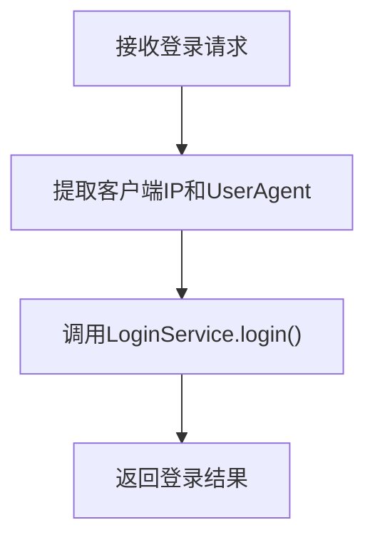
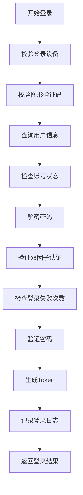
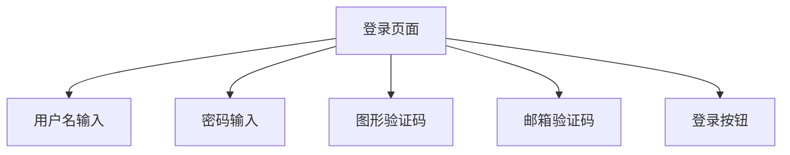
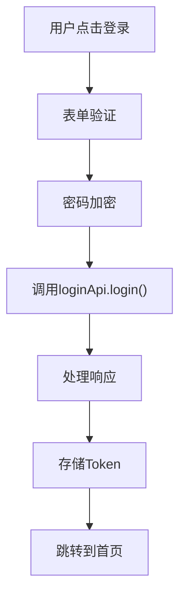
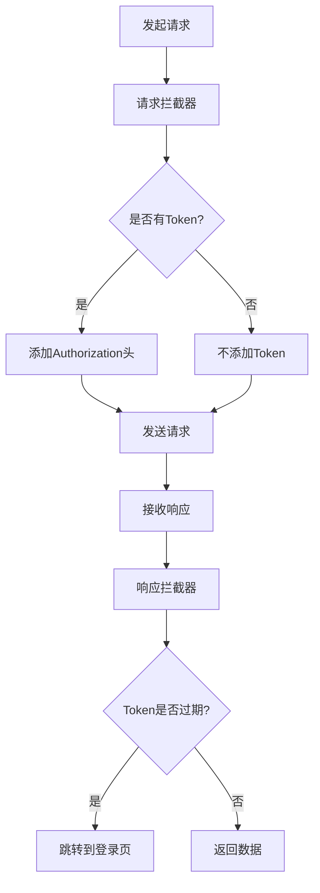
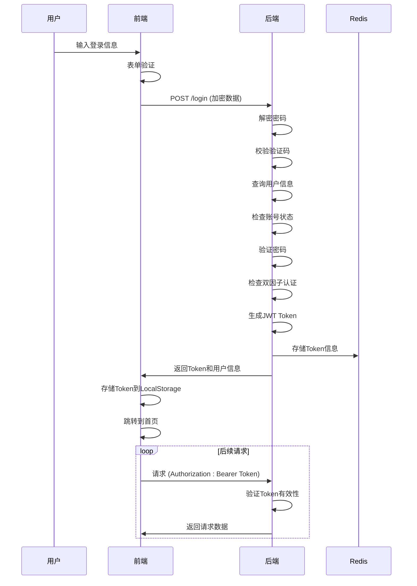
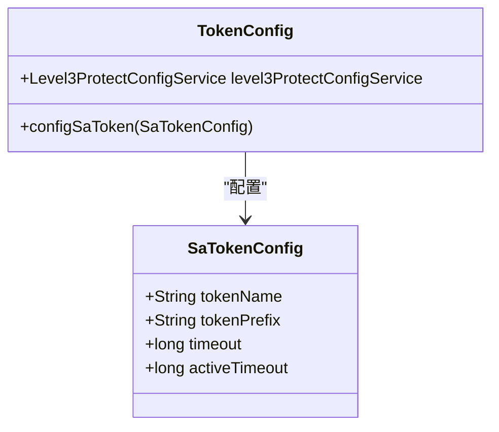
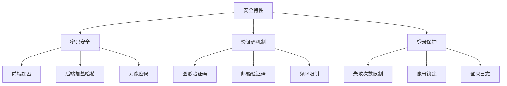

# 认证流程

<cite>
**本文档引用的文件**   
- [LoginController.java](file://smart-admin-api-java17-springboot3/sa-admin/src/main/java/net/lab1024/sa/admin/module/system/login/controller/LoginController.java)
- [LoginService.java](file://smart-admin-api-java17-springboot3/sa-admin/src/main/java/net/lab1024/sa/admin/module/system/login/service/LoginService.java)
- [LoginForm.java](file://smart-admin-api-java17-springboot3/sa-admin/src/main/java/net/lab1024/sa/admin/module/system/login/domain/LoginForm.java)
- [TokenConfig.java](file://smart-admin-api-java17-springboot3/sa-base/src/main/java/net/lab1024/sa/base/config/TokenConfig.java)
- [login-api.js](file://smart-admin-web-javascript/src/api/system/login-api.js)
- [login.vue](file://smart-admin-web-javascript/src/views/system/login3/login.vue)
- [axios.js](file://smart-admin-web-javascript/src/lib/axios.js)
</cite>

## 目录
1. [认证流程概述](#认证流程概述)
2. [后端认证实现](#后端认证实现)
3. [前端认证实现](#前端认证实现)
4. [认证时序图](#认证时序图)
5. [Token配置详解](#token配置详解)
6. [安全特性](#安全特性)

## 认证流程概述

本系统采用基于JWT的认证机制，实现前后端分离的无状态认证。认证流程从用户在前端登录页面输入用户名和密码开始，经过参数校验、身份验证、Token生成等步骤，最终返回包含JWT Token的响应。后续请求通过在HTTP请求头中携带Token来验证用户身份。

整个认证流程涉及多个组件的协同工作：
- 前端：登录页面、API调用、Token存储和请求拦截
- 后端：登录控制器、服务层、JWT配置和安全验证

**Section sources**
- [LoginController.java](file://smart-admin-api-java17-springboot3/sa-admin/src/main/java/net/lab1024/sa/admin/module/system/login/controller/LoginController.java#L1-L90)
- [login.vue](file://smart-admin-web-javascript/src/views/system/login3/login.vue#L1-L249)

## 后端认证实现

后端认证流程主要由`LoginController`和`LoginService`两个类实现。`LoginController`作为REST API的入口，接收前端的登录请求，而`LoginService`则负责具体的业务逻辑处理。

### LoginController实现

`LoginController`类定义了登录接口`/login`，该接口使用`@PostMapping`注解标记，接收JSON格式的登录表单数据。控制器方法`login()`接收`LoginForm`对象和HTTP请求对象作为参数。



**Diagram sources**
- [LoginController.java](file://smart-admin-api-java17-springboot3/sa-admin/src/main/java/net/lab1024/sa/admin/module/system/login/controller/LoginController.java#L42-L49)

### LoginService认证逻辑

`LoginService`类实现了完整的认证逻辑，包括参数校验、密码验证、用户状态检查和Token生成等步骤。

#### 认证流程步骤

1. **设备类型校验**：验证登录设备类型是否支持
2. **验证码校验**：验证图形验证码是否正确
3. **用户存在性校验**：根据登录名查询用户是否存在
4. **账号状态检查**：检查账号是否被删除或禁用
5. **密码解密和验证**：解密前端加密的密码并进行验证
6. **双因子认证校验**：如果启用，验证邮箱验证码
7. **登录失败次数检查**：防止暴力破解
8. **Token生成和签发**：使用Sa-Token框架生成JWT Token



**Diagram sources**
- [LoginService.java](file://smart-admin-api-java17-springboot3/sa-admin/src/main/java/net/lab1024/sa/admin/module/system/login/service/LoginService.java#L127-L224)

**Section sources**
- [LoginService.java](file://smart-admin-api-java17-springboot3/sa-admin/src/main/java/net/lab1024/sa/admin/module/system/login/service/LoginService.java#L58-L479)
- [LoginForm.java](file://smart-admin-api-java17-springboot3/sa-admin/src/main/java/net/lab1024/sa/admin/module/system/login/domain/LoginForm.java#L11-L38)

## 前端认证实现

前端认证实现主要包括登录页面、API调用、Token存储和请求拦截四个部分。

### 登录页面实现

登录页面`login.vue`提供了用户友好的登录界面，包含用户名、密码、验证码和邮箱验证码（如果启用双因子认证）的输入框。



**Diagram sources**
- [login.vue](file://smart-admin-web-javascript/src/views/system/login3/login.vue#L1-L249)

### 前端API调用

前端通过`login-api.js`文件封装了登录相关的API调用。

```javascript
login: (param) => {
  return postRequest('/login', param);
}
```

在登录方法中，前端会先对密码进行加密，然后调用后端的登录接口。



**Diagram sources**
- [login-api.js](file://smart-admin-web-javascript/src/api/system/login-api.js#L1-L55)

### Token存储和请求拦截

前端使用`axios.js`中的拦截器机制来处理Token的自动添加。



**Diagram sources**
- [axios.js](file://smart-admin-web-javascript/src/lib/axios.js#L1-L251)

**Section sources**
- [login-api.js](file://smart-admin-web-javascript/src/api/system/login-api.js#L1-L55)
- [login.vue](file://smart-admin-web-javascript/src/views/system/login3/login.vue#L1-L249)
- [axios.js](file://smart-admin-web-javascript/src/lib/axios.js#L1-L251)

## 认证时序图



**Diagram sources**
- [LoginController.java](file://smart-admin-api-java17-springboot3/sa-admin/src/main/java/net/lab1024/sa/admin/module/system/login/controller/LoginController.java#L42-L49)
- [LoginService.java](file://smart-admin-api-java17-springboot3/sa-admin/src/main/java/net/lab1024/sa/admin/module/system/login/service/LoginService.java#L127-L224)
- [axios.js](file://smart-admin-web-javascript/src/lib/axios.js#L35-L45)

## Token配置详解

Token配置主要在`TokenConfig.java`文件中定义，通过Sa-Token框架进行JWT的配置和管理。

### 核心配置项

| 配置项 | 默认值 | 说明 |
|-------|-------|------|
| token名称 | Authorization | HTTP请求头中Token的名称 |
| token前缀 | Bearer | Token值的前缀，符合JWT标准 |
| 过期时间 | 3600秒 | Token的有效期，1小时后过期 |
| 刷新时间 | 1800秒 | Token的刷新时间，30分钟后需要刷新 |



**Diagram sources**
- [TokenConfig.java](file://smart-admin-api-java17-springboot3/sa-base/src/main/java/net/lab1024/sa/base/config/TokenConfig.java#L1-L34)

### 配置意义

- **token名称(Authorization)**：遵循HTTP标准，使用Authorization头传递认证信息
- **过期时间(3600秒)**：平衡安全性和用户体验，避免用户频繁登录
- **刷新时间(1800秒)**：在用户活跃期间自动刷新Token，提升用户体验
- **token前缀(Bearer)**：符合OAuth 2.0标准，便于与其他系统集成

**Section sources**
- [TokenConfig.java](file://smart-admin-api-java17-springboot3/sa-base/src/main/java/net/lab1024/sa/base/config/TokenConfig.java#L1-L34)

## 安全特性

本系统实现了多项安全特性，确保认证过程的安全性。

### 密码安全

- 前端密码加密传输
- 后端密码加盐哈希存储
- 支持万能密码（特殊场景使用）

### 验证码机制

- 图形验证码防止自动化攻击
- 邮箱验证码实现双因子认证
- 验证码有效期和发送频率限制

### 登录保护

- 登录失败次数限制
- 账号锁定机制
- 登录日志记录



**Diagram sources**
- [LoginService.java](file://smart-admin-api-java17-springboot3/sa-admin/src/main/java/net/lab1024/sa/admin/module/system/login/service/LoginService.java#L127-L224)
- [SecurityLoginService.java](file://smart-admin-api-java17-springboot3/sa-base/src/main/java/net/lab1024/sa/base/module/support/securityprotect/service/SecurityLoginService.java#L20-L173)

**Section sources**
- [LoginService.java](file://smart-admin-api-java17-springboot3/sa-admin/src/main/java/net/lab1024/sa/admin/module/system/login/service/LoginService.java#L127-L224)
- [SecurityLoginService.java](file://smart-admin-api-java17-springboot3/sa-base/src/main/java/net/lab1024/sa/base/module/support/securityprotect/service/SecurityLoginService.java#L20-L173)